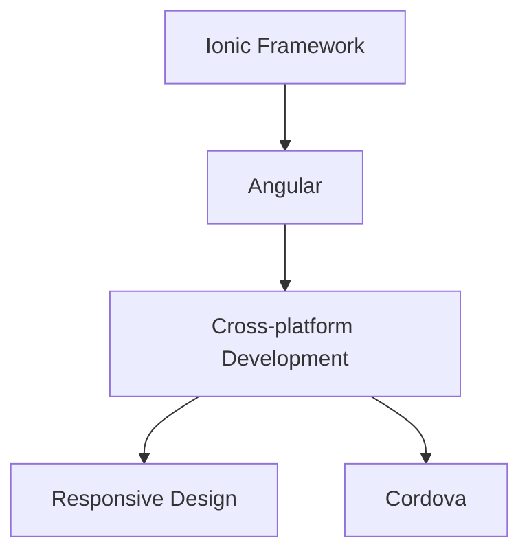

                 

# Ionic 框架优势：基于 Angular 的移动应用开发

> 关键词：Ionic, Angular, 移动应用开发, 跨平台, 前端框架, 响应式设计

## 1. 背景介绍

在当今移动应用开发的浪潮中，Angular 作为一个领先的前端框架，已经吸引了无数开发者的关注。然而，在构建移动应用时，Angular 需要开发者自行处理大量的平台相关代码，这不仅增加了开发难度，还导致应用性能难以达到预期的效果。为了解决这些问题，Ionic 应运而生，一个基于 Angular 的移动应用开发框架。

### 1.1 问题由来
随着移动设备的多样化和普及，应用开发的需求日益增长。传统的前端框架如 React、Vue 等，虽然强大，但在移动应用开发上显得有些笨重，开发者需要额外编写大量平台特定的代码，影响了开发效率和应用性能。

### 1.2 问题核心关键点
Ionic 框架通过提供一套统一的 UI 组件和工具，极大简化了跨平台应用开发，让开发者可以用一套代码，构建适用于 iOS 和 Android 的应用。其核心优势包括：

- 基于 Angular 的组件和工具，保证开发者熟悉的前端技术栈。
- 跨平台开发，支持 iOS 和 Android，避免平台差异带来的额外工作。
- 完善的 UI 组件库，提供丰富的界面设计元素。
- 强大的路由系统，易于构建多视图应用。

这些特性使得 Ionic 成为构建高性能、可扩展的移动应用的有力工具。

### 1.3 问题研究意义
Ionic 框架的优势在于其能够帮助开发者快速构建出高性能的移动应用，避免在跨平台开发中遇到的问题，同时充分利用 Angular 的优势，提高开发效率。在学术界和工业界的诸多应用中，Ionic 框架已经证明了其有效性和可靠性，成为移动应用开发的重要选择。

## 2. 核心概念与联系

### 2.1 核心概念概述

为更好地理解 Ionic 框架的优势，本节将介绍几个密切相关的核心概念：

- Ionic Framework：基于 Angular 的前端框架，专为移动应用开发设计，提供一套统一的 UI 组件和工具。
- Angular：一个广泛使用的前端框架，通过依赖注入、组件化等技术，帮助开发者构建复杂的单页应用。
- Cross-platform Development：跨平台开发，指使用一套代码，构建适用于多个移动操作系统（如 iOS、Android）的应用。
- Responsive Design：响应式设计，指应用能够自适应不同屏幕大小和设备特性，提供良好的用户体验。
- Cordova：一个开源的移动应用开发框架，允许开发者使用 Web 技术开发原生移动应用。

这些核心概念之间的逻辑关系可以通过以下 Mermaid 流程图来展示：



这个流程图展示了一系列关键概念及其之间的联系：

1. Ionic Framework 基于 Angular，提供统一的组件和工具。
2. Angular 是构建复杂单页应用的前端框架。
3. Cross-platform Development 能够帮助开发者构建跨平台的移动应用。
4. Responsive Design 保证了应用在不同设备上的适配性。
5. Cordova 提供了构建原生移动应用的 Web 技术。

这些概念共同构成了 Ionic 框架的核心价值链，使得开发者能够快速、高效地构建高性能的移动应用。

## 3. 核心算法原理 & 具体操作步骤

### 3.1 算法原理概述

Ionic 框架的优势在于其独特的跨平台开发技术，具体来说，其基于 Angular 的组件和工具，能够实现以下关键功能：

- 统一的 UI 组件库：提供一套跨平台支持的 UI 组件，如导航栏、列表、表单等，帮助开发者快速构建界面。
- 强大的路由系统：提供类似于 Angular 的路由功能，方便构建多视图应用，支持嵌套路由、懒加载等高级功能。
- 响应式设计：通过 CSS 媒体查询等技术，自动适配不同屏幕大小，保证应用在不同设备上的良好表现。
- 原生桥接技术：通过 Cordova 等框架，支持使用 Web 技术构建原生移动应用，提升性能和用户体验。

这些技术特点使得 Ionic 框架在移动应用开发中具有显著优势，极大提高了开发效率和应用性能。

### 3.2 算法步骤详解

以下是使用 Ionic 框架构建移动应用的详细操作步骤：

**Step 1: 环境准备**
- 安装 Node.js 和 npm：用于管理 Ionic 项目依赖。
- 安装 Ionic CLI：通过命令行工具初始化项目，管理代码版本。
- 安装 Cordova：用于构建原生应用，并提供访问设备特性的能力。

**Step 2: 项目初始化**
- 使用 Ionic CLI 创建项目模板：
```bash
ionic start my-app tab
```
- 进入项目目录并初始化项目：
```bash
cd my-app
npm install
```

**Step 3: 开发环境搭建**
- 搭建开发环境：
```bash
ionic serve
```
- 运行应用：
```bash
ionic serve
```

**Step 4: 界面设计**
- 使用 Ionic 提供的组件进行界面设计：
```html
<ion-view>
    <ion-content>
        <ion-header-bar>
            <ion-header>
                <ion-toolbar>
                    <ion-title>My App</ion-title>
                </ion-toolbar>
            </ion-header>
        </ion-header-bar>
        
        <ion-list>
            <ion-item *ngFor="let item of items">
                <ion-label>{{ item.title }}</ion-label>
                <ion-item-detail>
                    {{ item.description }}
                </ion-item-detail>
            </ion-item>
        </ion-list>
    </ion-content>
</ion-view>
```

**Step 5: 构建应用**
- 使用 Cordova 插件构建原生应用：
```bash
ionic cordova platform add ios
ionic cordova platform add android
```

**Step 6: 测试和部署**
- 测试应用：
```bash
ionic cordova run ios
ionic cordova run android
```
- 打包应用：
```bash
ionic cordova build ios --release
ionic cordova build android --release
```

### 3.3 算法优缺点

Ionic 框架在跨平台移动应用开发中具有以下优点：

- 简单易用：基于 Angular 的组件和工具，开发者可以快速上手。
- 跨平台支持：支持 iOS 和 Android，避免平台差异带来的额外工作。
- 丰富的 UI 组件：提供丰富的界面设计元素，降低开发成本。
- 强大的路由系统：易于构建多视图应用，提高开发效率。

然而，Ionic 框架也存在一些局限性：

- 性能问题：部分 Web 技术在原生应用中性能不如原生语言。
- 平台差异：某些原生功能需要通过 Cordova 插件实现，存在一定的性能和兼容性问题。
- 学习曲线：需要熟悉 Angular 和 Ionic 框架，可能会对一些开发者来说有一定的学习曲线。

尽管存在这些局限性，但就目前而言，Ionic 框架依然是构建跨平台移动应用的重要工具。未来相关研究的重点在于如何进一步优化性能，解决平台差异问题，提高开发者体验。

### 3.4 算法应用领域

Ionic 框架已经在多个领域得到了广泛的应用，包括但不限于：

- 企业内部应用：如客户管理系统、项目管理工具等。
- 电子商务：如电商平台、在线购物等。
- 教育培训：如在线课程、学习管理平台等。
- 医疗健康：如远程医疗、健康管理等。
- 金融服务：如移动银行、理财应用等。

除了这些经典应用外，Ionic 框架还被创新性地应用于更多场景中，如可穿戴设备应用、游戏应用、社交应用等，为移动应用开发者提供了更广阔的创新空间。

## 4. 数学模型和公式 & 详细讲解  
### 4.1 数学模型构建

Ionic 框架的核心功能主要体现在其基于 Angular 的组件和工具上，通过使用 Angular 的依赖注入和组件化技术，Ionic 提供了强大的 UI 组件库和路由系统，使得开发者可以轻松构建复杂的移动应用。

**组件模型**：
- 组件是 Ionic 框架的基本单位，通过定义组件类和模板，开发者可以灵活构建界面。
- 组件类定义了组件的逻辑和数据，模板则描述了组件的布局和样式。
- 组件的依赖注入机制使得开发者可以复用已有组件，提高开发效率。

**路由系统**：
- Ionic 的路由系统支持嵌套路由、懒加载等高级功能。
- 通过定义路由规则和组件，开发者可以构建复杂的导航逻辑，实现多视图应用。
- 路由系统还提供路由参数和守卫，帮助开发者控制应用的访问权限和状态管理。

### 4.2 公式推导过程

以下是 Ionic 框架中路由系统的工作流程：

1. 初始化路由对象：
```javascript
let appRoutes = [
    { path: '/', component: MyHomePage },
    { path: '/details/:id', component: DetailPage }
];

IonicRouteProvider.configure(appRoutes);
```

2. 定义路由组件：
```javascript
@Component({
    selector: 'my-home-page',
    template: `
        <ion-header>
            <ion-toolbar>
                <ion-title>My Home Page</ion-title>
            </ion-toolbar>
        </ion-header>
        
        <ion-content>
            <ion-list>
                <ion-item *ngFor="let item of items">
                    <ion-label>{{ item.title }}</ion-label>
                    <ion-item-detail>
                        {{ item.description }}
                    </ion-item-detail>
                </ion-item>
            </ion-list>
        </ion-content>
    `
})
export class MyHomePage {}
```

3. 导航到其他路由：
```javascript
this.navController.navigateTo('details', { data: { item: this.item } });
```

通过上述推导过程，可以看到 Ionic 框架的路由系统是如何通过定义路由组件和导航逻辑，实现复杂的导航和状态管理功能的。

### 4.3 案例分析与讲解

下面以 Ionic 框架构建的一个简单的待办事项应用为例，分析其组件和路由系统的具体实现。

**组件实现**：
```javascript
@Component({
    selector: 'todo-app',
    template: `
        <ion-content>
            <ion-header>
                <ion-toolbar>
                    <ion-title>To-Do List</ion-title>
                </ion-toolbar>
            </ion-header>
            
            <ion-list>
                <ion-item *ngFor="let todo of todos">
                    <ion-label>{{ todo.title }}</ion-label>
                    <ion-item-detail>
                        {{ todo.description }}
                    </ion-item-detail>
                    <button ion-button (click)="markComplete(todo)">Complete</button>
                </ion-item>
            </ion-list>
            
            <ion-button (click)="addTodo()">Add Todo</ion-button>
        </ion-content>
    `
})
export class TodoApp {
    constructor(private todoService: TodoService) {}
    
    todoService: TodoService;
    todos: Todo[];
    newTodo: Todo;
    
    markComplete(todo: Todo) {
        this.todoService.updateTodo(todo.id, { completed: true });
    }
    
    addTodo() {
        this.todoService.createTodo(this.newTodo.title, this.newTodo.description);
        this.newTodo = new Todo();
    }
}
```

**路由配置**：
```javascript
IonicRouteProvider.configure([
    { path: '/', component: TodoApp },
    { path: '/details/:id', component: DetailPage }
]);
```

通过这个简单的案例，可以看到 Ionic 框架是如何通过组件和路由系统实现待办事项应用的。开发者可以通过定义组件类和模板，实现待办事项的展示和修改逻辑，同时通过路由系统，实现添加新任务和查看任务详情的功能。

## 5. 项目实践：代码实例和详细解释说明
### 5.1 开发环境搭建

在进行 Ionic 框架的项目实践前，我们需要准备好开发环境。以下是使用 Node.js 和 npm 进行 Ionic 开发的环境配置流程：

1. 安装 Node.js：从官网下载并安装 Node.js，提供 JavaScript 运行环境和 npm 包管理工具。

2. 安装 npm：作为 Node.js 的包管理工具，npm 用于安装和管理项目依赖。

3. 初始化项目：使用 Ionic CLI 初始化项目模板，创建新项目或克隆现有项目。

4. 进入项目目录并初始化项目：
```bash
cd my-app
npm install
```

完成上述步骤后，即可在项目目录中进行 Ionic 框架的开发实践。

### 5.2 源代码详细实现

这里我们以 Ionic 框架构建的一个简单的待办事项应用为例，给出详细的源代码实现。

**TodoService 实现**：
```javascript
import { Injectable } from '@angular/core';

@Injectable()
export class TodoService {
    constructor() {}
    
    createTodo(title: string, description: string) {
        // 创建新任务并保存到本地存储或服务器
    }
    
    updateTodo(id: number, data: { [key: string]: any }) {
        // 更新指定 ID 的任务
    }
    
    deleteTodo(id: number) {
        // 删除指定 ID 的任务
    }
    
    getTodoById(id: number) {
        // 获取指定 ID 的任务
    }
}
```

**TodoApp 实现**：
```javascript
import { Component } from '@angular/core';
import { TodoService } from './todo.service';

@Component({
    selector: 'todo-app',
    template: `
        <ion-content>
            <ion-header>
                <ion-toolbar>
                    <ion-title>To-Do List</ion-title>
                </ion-toolbar>
            </ion-header>
            
            <ion-list>
                <ion-item *ngFor="let todo of todos">
                    <ion-label>{{ todo.title }}</ion-label>
                    <ion-item-detail>
                        {{ todo.description }}
                    </ion-item-detail>
                    <button ion-button (click)="markComplete(todo)">Complete</button>
                </ion-item>
            </ion-list>
            
            <ion-button (click)="addTodo()">Add Todo</ion-button>
        </ion-content>
    `
})
export class TodoApp {
    constructor(private todoService: TodoService) {}
    
    todoService: TodoService;
    todos: Todo[];
    newTodo: Todo;
    
    markComplete(todo: Todo) {
        this.todoService.updateTodo(todo.id, { completed: true });
    }
    
    addTodo() {
        this.todoService.createTodo(this.newTodo.title, this.newTodo.description);
        this.newTodo = new Todo();
    }
}
```

**DetailPage 实现**：
```javascript
import { Component } from '@angular/core';
import { TodoService } from './todo.service';

@Component({
    selector: 'detail-page',
    template: `
        <ion-content>
            <ion-header>
                <ion-toolbar>
                    <ion-title>Todo Detail</ion-title>
                </ion-toolbar>
            </ion-header>
            
            <ion-item>
                <ion-label>Title:</ion-label>
                <ion-item-detail>{{ todo.title }}</ion-item-detail>
            </ion-item>
            
            <ion-item>
                <ion-label>Description:</ion-label>
                <ion-item-detail>{{ todo.description }}</ion-item-detail>
            </ion-item>
            
            <ion-item>
                <ion-label>Completed:</ion-label>
                <ion-item-detail>{{ todo.completed }}</ion-item-detail>
            </ion-item>
        </ion-content>
    `
})
export class DetailPage {
    todo: Todo;
    
    constructor(private todoService: TodoService) {
        this.todo = this.todoService.getTodoById(params.id);
    }
}
```

以上是使用 Ionic 框架构建待办事项应用的完整代码实现。可以看到，通过定义 TodoService 服务，TodoApp 和 DetailPage 组件，开发者可以实现完整的待办事项应用功能。

### 5.3 代码解读与分析

让我们再详细解读一下关键代码的实现细节：

**TodoService**：
- 定义了 createTodo、updateTodo、deleteTodo、getTodoById 等方法，用于创建、更新、删除和获取任务。
- 这些方法通常通过调用本地存储或服务器 API 来实现任务管理。

**TodoApp**：
- 通过依赖注入 TodoService，实现任务列表的展示和添加功能。
- markComplete 方法用于更新任务状态，将指定任务的 completed 字段设置为 true。
- addTodo 方法用于创建新任务，将任务保存到本地存储或服务器。

**DetailPage**：
- 通过 params.id 参数获取指定任务的详细信息。
- 展示任务的标题、描述和状态，提供详细的任务信息展示。

可以看到，Ionic 框架通过组件和服务实现了完整的应用功能，开发者可以通过组件化技术和依赖注入机制，构建复杂的多视图应用。

### 5.4 运行结果展示

运行 Ionic 应用后，开发者可以通过设备模拟器或连接真实设备进行测试。在ionic serve 命令启动服务后，可以通过浏览器访问应用，测试待办事项功能，查看任务详情等。

通过以上代码实现，可以看到 Ionic 框架在移动应用开发中的强大功能和易用性，通过组件和服务，快速构建复杂的多视图应用。

## 6. 实际应用场景
### 6.1 智能客服系统

Ionic 框架可以应用于智能客服系统的构建。通过使用 Ionic 提供的 UI 组件和路由系统，可以构建简洁、易用的客服界面，提供多视图的导航和交互体验。

### 6.2 金融舆情监测

Ionic 框架可以应用于金融舆情监测系统，通过提供响应式设计和路由功能，实时监测金融市场的舆情变化，提供准确的舆情分析和预警。

### 6.3 个性化推荐系统

Ionic 框架可以应用于个性化推荐系统，通过定义路由规则和组件，实现推荐结果的展示和交互，提供良好的用户体验。

### 6.4 未来应用展望

随着 Ionic 框架的不断发展，其应用场景将更加广泛。未来，Ionic 框架有望在更多领域发挥重要作用，如智能家居、工业互联网、智慧城市等。

## 7. 工具和资源推荐
### 7.1 学习资源推荐

为了帮助开发者系统掌握 Ionic 框架的理论基础和实践技巧，这里推荐一些优质的学习资源：

1. Ionic 官方文档：提供全面的 API 文档和开发指南，涵盖从安装到构建完整的移动应用的全流程。

2. Angular 官方文档：Angular 作为 Ionic 框架的基础，官方文档提供了详尽的框架介绍和开发指南。

3. Cordova 官方文档：提供 Cordova 框架的文档和开发指南，帮助开发者使用 Web 技术构建原生应用。

4. Udemy 和 Coursera 上的 Ionic 课程：提供系统化的 Ionic 框架学习资源，涵盖从基础到高级的多种开发技能。

5. Ionic 开发者社区：活跃的开发者社区，提供丰富的开发技巧和解决方案，帮助开发者解决实际问题。

通过这些资源的学习实践，相信你一定能够快速掌握 Ionic 框架的精髓，并用于解决实际的移动应用问题。

### 7.2 开发工具推荐

高效的开发离不开优秀的工具支持。以下是几款用于 Ionic 框架开发的常用工具：

1. Visual Studio Code：基于 Electron 的前端开发工具，支持 Ionic 框架的开发和调试。

2. Android Studio 和 Xcode：常用的移动应用开发工具，支持 Android 和 iOS 平台的开发和调试。

3. npm 和 Yarn：常用的 npm 包管理工具，用于管理和安装项目依赖。

4. Ionic CLI：Ionic 框架的命令行工具，提供快速创建和构建项目的便捷方式。

5. Webpack 和 Rollup：常用的模块打包工具，支持生产环境优化和代码压缩。

6. Cordova 和 Ionic Capacitor：提供原生应用的构建和调试功能，支持跨平台开发。

合理利用这些工具，可以显著提升 Ionic 框架项目的开发效率，加快创新迭代的步伐。

### 7.3 相关论文推荐

Ionic 框架的发展源于学界的持续研究。以下是几篇奠基性的相关论文，推荐阅读：

1. React Native: A Platform for Building Native Apps with JavaScript and React：介绍 React Native 框架，提供了 Web 技术构建原生应用的思路。

2. Angular: The Future of Web Applications：介绍 Angular 框架，提供了组件化技术和依赖注入的详细讲解。

3. Ionic Framework for Web and Mobile Development：介绍 Ionic 框架的开发和部署，提供了完整的开发流程和最佳实践。

这些论文代表了大前端技术的发展脉络。通过学习这些前沿成果，可以帮助研究者把握学科前进方向，激发更多的创新灵感。

## 8. 总结：未来发展趋势与挑战

### 8.1 总结

本文对 Ionic 框架的优势进行了全面系统的介绍。首先阐述了 Ionic 框架在移动应用开发中的独特优势，明确了其基于 Angular 的组件和工具对跨平台开发的重要意义。其次，从原理到实践，详细讲解了 Ionic 框架的核心功能和使用方法，给出了详细的应用示例。同时，本文还广泛探讨了 Ionic 框架在多个领域的应用前景，展示了其强大的生命力。

通过本文的系统梳理，可以看到，Ionic 框架通过提供统一的 UI 组件和工具，极大简化了跨平台应用开发，帮助开发者快速构建高性能的移动应用。未来，随着 Ionic 框架的持续演进，其在移动应用开发中的应用前景将更加广阔。

### 8.2 未来发展趋势

展望未来，Ionic 框架将呈现以下几个发展趋势：

1. 跨平台性能优化：随着 Web 技术在原生应用中的普及，Web 和原生应用的性能差距将逐渐缩小，Ionic 框架将在性能上不断突破。

2. 组件库扩展：随着新组件的不断涌现，Ionic 框架的组件库将不断丰富，提供更多高质量的 UI 组件。

3. 生态系统扩展：随着社区的不断壮大，Ionic 框架的生态系统将更加完善，支持更多功能和插件。

4. 开发者体验提升：Ionic 框架将更加关注开发者体验，提供更好的开发工具和支持，提高开发效率。

5. 工业化部署：随着 Ionic 框架的应用成熟，将逐渐进入工业化部署阶段，提供更多的企业级解决方案。

6. 行业应用拓展：Ionic 框架将在更多领域得到应用，如医疗、金融、教育等，为各行各业带来变革性影响。

以上趋势凸显了 Ionic 框架的未来发展方向，这些方向的探索发展，必将进一步提升移动应用开发的速度和效率，推动开发者的工作效率和应用性能。

### 8.3 面临的挑战

尽管 Ionic 框架已经取得了显著的进展，但在迈向更加智能化、普适化应用的过程中，它仍面临着诸多挑战：

1. 性能瓶颈：部分 Web 技术在原生应用中的性能仍然无法满足高要求，需要进一步优化。

2. 平台兼容性：不同移动设备的操作系统和浏览器可能存在兼容性问题，需要不断更新和优化。

3. 开发者学习曲线：新的开发技术可能对部分开发者带来一定的学习曲线，需要提供更多的文档和支持。

4. 生态系统建设：虽然组件库和插件不断增加，但生态系统的整体成熟度仍需提升。

5. 社区支持：社区的活跃度和支持力度仍需加强，以吸引更多开发者加入。

这些挑战需要开发者和社区的共同努力，不断优化性能、提升用户体验，才能使 Ionic 框架成为移动应用开发的重要工具。

### 8.4 研究展望

面对 Ionic 框架面临的挑战，未来的研究需要在以下几个方面寻求新的突破：

1. Web 技术性能提升：优化 Web 技术在原生应用中的性能，提升应用的响应速度和流畅度。

2. 平台兼容性优化：改进平台兼容性，确保应用在不同设备和操作系统上的一致性和稳定性。

3. 开发者体验优化：提供更多的开发工具和支持，降低开发者学习曲线，提高开发效率。

4. 生态系统完善：丰富组件库和插件，提升生态系统的整体成熟度，提供更多高质量的开发资源。

5. 社区支持加强：加强社区建设，吸引更多开发者加入，形成良性循环。

6. 行业应用拓展：探索更多行业应用场景，提供更多行业特定的开发工具和解决方案。

这些研究方向的探索，必将引领 Ionic 框架的持续演进，为移动应用开发者提供更加强大、便捷的开发工具。

## 9. 附录：常见问题与解答

**Q1：Ionic 框架是否可以用于构建原生应用？**

A: 是的，Ionic 框架支持使用 Cordova 插件构建原生应用，提供良好的 Web 和原生融合体验。开发者可以使用 Web 技术构建原生应用，同时利用 Ionic 框架提供的前端组件和工具。

**Q2：Ionic 框架和 React Native 框架有什么区别？**

A: Ionic 框架和 React Native 框架都是用于构建跨平台移动应用的框架，但它们的实现方式有所不同。Ionic 框架基于 Angular 框架，提供统一的 UI 组件和工具，而 React Native 框架则直接使用 JavaScript 代码和原生组件进行开发。

**Q3：Ionic 框架的组件库是否可以用于其他前端框架？**

A: Ionic 框架的组件库是基于 Angular 开发的，但很多组件也可以用于其他前端框架，如 React、Vue 等。开发者可以通过调整组件的 API 和样式，使其适应其他框架的需求。

**Q4：Ionic 框架在构建原生应用时需要注意哪些问题？**

A: 在构建原生应用时，需要注意以下问题：
1. 性能优化：确保 Web 技术在原生应用中的性能表现。
2. 平台兼容性：确保应用在不同设备和操作系统上的一致性和稳定性。
3. 资源管理：优化应用的资源消耗，减少内存和硬盘的占用。
4. 安全问题：确保应用的安全性和隐私保护，防止敏感数据泄露。

通过合理利用 Ionic 框架的优势，开发者可以高效构建跨平台移动应用，提升应用性能和用户体验。

