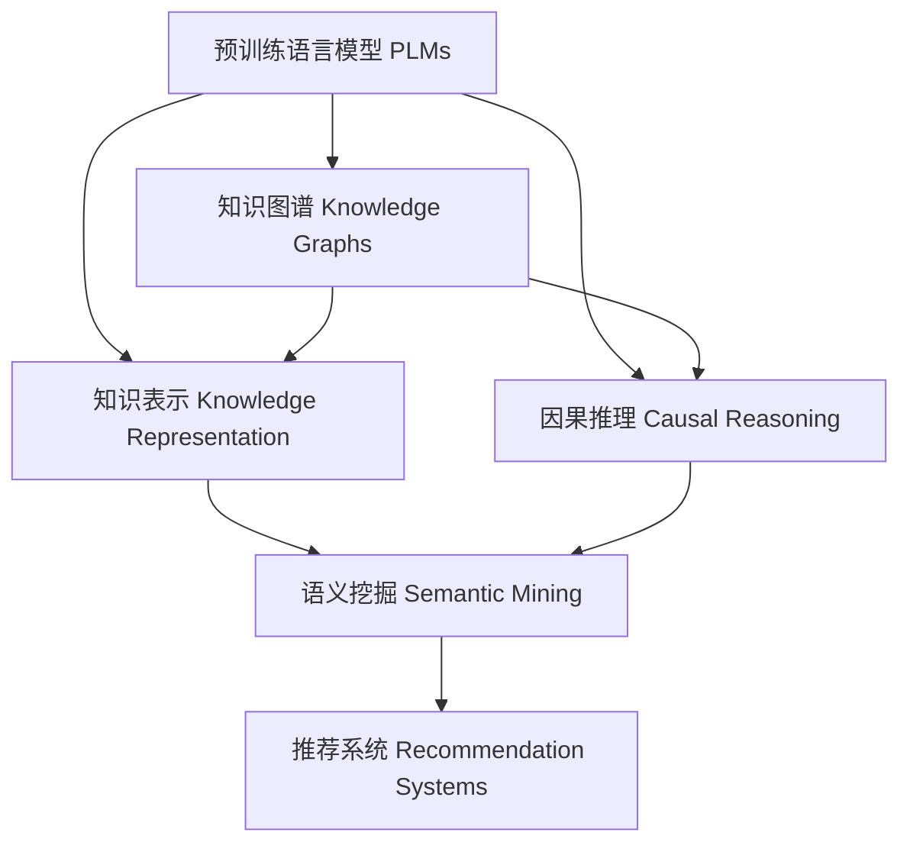
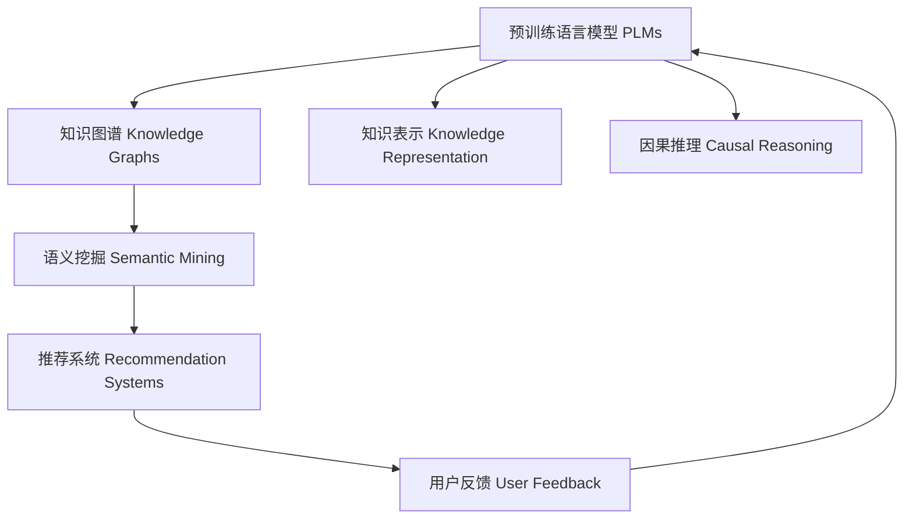

                 

# LLM Tokens + RS: 语义挖掘与推荐

> 关键词：LLM Tokens, 语义挖掘, 推荐系统, 知识图谱, 知识表示, 因果推理

## 1. 背景介绍

### 1.1 问题由来
随着人工智能技术的快速发展和广泛应用，自然语言处理(NLP)和推荐系统(Recommendation Systems, RS)已成为当今信息技术领域的热点研究方向。语言模型和大规模数据的应用，使得推荐系统能够从自然语言文本中提取更丰富的用户行为特征，推荐效果显著提升。特别是预训练语言模型(Pretrained Language Models, PLMs)的崛起，为推荐系统注入了新的活力。

在推荐系统中，用户行为往往以自然语言文本的形式记录下来。通过预训练语言模型，可以挖掘出更深入的用户意图和偏好。例如，商品描述、用户评论等文本内容，包含了用户对商品的质量、风格、价格等评价信息，利用预训练语言模型对这些文本进行分析和建模，可以提升推荐系统对用户偏好的理解。然而，传统的文本处理方式仅依赖于文本向量化，无法捕捉文本中的语义信息，导致推荐系统的精准度和个性化程度不高。

语义挖掘(Semantic Mining)技术能够从自然语言文本中提取出更丰富的语义信息，为推荐系统提供更丰富的用户特征。通过结合语义挖掘和推荐系统，可以构建更加个性化、智能化的推荐服务。

### 1.2 问题核心关键点
本节的目的是介绍基于预训练语言模型的推荐系统，详细阐述LLM Tokens + RS的语义挖掘和推荐机制。我们聚焦于以下核心问题：

- 如何利用预训练语言模型挖掘文本语义信息，提升推荐系统对用户偏好的理解？
- 如何将语义信息融入推荐系统，实现个性化推荐？
- 预训练语言模型与推荐系统结合的实际应用案例有哪些？

### 1.3 问题研究意义
预训练语言模型与推荐系统结合，构建基于语义的推荐系统，可以提升推荐系统的精度和个性化程度，具体表现如下：

1. 提升精准度：利用预训练语言模型挖掘文本语义信息，可以更全面地理解用户行为和偏好。
2. 增强个性化：结合语义信息，推荐系统能够提供更加贴合用户需求的商品和服务。
3. 扩大应用场景：预训练语言模型和推荐系统结合，可以应用于电商、社交、教育等多个领域，带来新的应用前景。
4. 促进技术发展：语义挖掘和推荐系统的结合，可以推动NLP和RS技术的交叉发展和深度融合。

## 2. 核心概念与联系

### 2.1 核心概念概述

在本文中，我们主要介绍以下几个核心概念：

- 预训练语言模型(PLMs)：指通过在大规模无标签文本数据上进行自监督学习训练得到的通用语言模型。如GPT、BERT等模型。
- 知识图谱(Knowledge Graphs)：由节点和边组成的有向图，用于表示实体之间的关系。
- 知识表示(Knowledge Representation)：指如何将知识图谱中的信息进行编码，便于机器理解和学习。
- 因果推理(Causal Reasoning)：指通过理解因果关系，对事件进行预测和推断。

这些概念之间的联系通过以下Mermaid流程图展示：



该图展示了各个概念之间的相互作用：

- 预训练语言模型提供了通用的语言理解能力。
- 知识图谱和知识表示提供了结构化的知识信息。
- 因果推理提供对事件的理解和推断能力。
- 语义挖掘利用PLMs和知识图谱对文本进行语义分析。
- 推荐系统结合语义挖掘结果进行个性化推荐。

### 2.2 核心概念原理和架构的 Mermaid 流程图

以下是一个简单的Mermaid流程图，展示了预训练语言模型和推荐系统的基本架构：



该图展示了预训练语言模型和推荐系统结合的架构：

- 预训练语言模型从大规模文本中学习语言知识。
- 知识图谱和知识表示提供了结构化的知识信息。
- 因果推理用于理解事件间的因果关系。
- 语义挖掘利用PLMs和知识图谱对文本进行语义分析。
- 推荐系统结合语义挖掘结果进行个性化推荐。
- 用户反馈用于调整模型参数，进一步提升推荐效果。

## 3. 核心算法原理 & 具体操作步骤

### 3.1 算法原理概述

基于预训练语言模型的推荐系统，核心思想是利用PLMs从文本中提取语义信息，并将其与推荐系统的输入特征结合，进行用户行为预测和推荐。主要步骤包括：

1. 利用预训练语言模型对文本进行编码，提取文本语义信息。
2. 将文本语义信息与推荐系统的特征信息进行融合，构建综合特征向量。
3. 利用融合后的特征向量进行推荐算法计算，输出个性化推荐结果。

### 3.2 算法步骤详解

以下是基于预训练语言模型的推荐系统的详细步骤：

**Step 1: 准备预训练语言模型和数据集**
- 选择合适的预训练语言模型(如BERT、GPT等)进行微调。
- 准备推荐系统的训练数据集，包括用户行为数据、商品描述、评论等信息。

**Step 2: 构建知识图谱**
- 收集实体和关系数据，构建知识图谱。
- 使用知识表示方法将知识图谱中的信息进行编码。

**Step 3: 设计推荐模型**
- 选择合适的推荐算法，如协同过滤、矩阵分解等。
- 构建融合预训练语言模型和知识图谱特征的推荐模型。

**Step 4: 执行模型训练**
- 将预训练语言模型和推荐模型组合，对训练数据进行联合训练。
- 使用用户行为数据和知识图谱信息进行模型优化。

**Step 5: 模型评估和部署**
- 在测试数据集上评估推荐模型的性能，如召回率、准确率等指标。
- 部署推荐模型，提供个性化推荐服务。

### 3.3 算法优缺点

基于预训练语言模型的推荐系统具有以下优点：

1. 提升推荐精度：利用预训练语言模型挖掘文本语义信息，可以更全面地理解用户行为和偏好。
2. 增强个性化：结合语义信息，推荐系统能够提供更加贴合用户需求的商品和服务。
3. 提高模型可解释性：利用知识图谱和因果推理，可以更好地解释推荐结果的原因。

同时，该方法也存在以下缺点：

1. 计算复杂度高：预训练语言模型的计算资源消耗大，需要进行高效的模型裁剪和优化。
2. 数据处理复杂：需要处理大量的自然语言文本数据，并进行知识图谱构建和更新。
3. 模型训练时间长：联合训练PLMs和推荐模型，训练时间较长，需要优化算法和硬件资源。

### 3.4 算法应用领域

基于预训练语言模型的推荐系统已经在多个领域得到了广泛应用，包括但不限于：

- 电商推荐：通过分析商品描述和用户评论，推荐相关商品。
- 社交推荐：根据用户发布的内容和互动信息，推荐可能感兴趣的人或内容。
- 教育推荐：分析学生成绩和反馈信息，推荐适合的课程和学习资源。
- 医疗推荐：结合医生的诊断和治疗方案，推荐合适的药物和治疗方法。

## 4. 数学模型和公式 & 详细讲解 & 举例说明

### 4.1 数学模型构建

在本文中，我们将重点介绍基于预训练语言模型的推荐系统的数学模型。

记预训练语言模型为 $M_{\theta}$，输入为自然语言文本 $x$，输出为向量表示 $h(x) \in \mathbb{R}^d$。知识图谱表示为 $G=(E, R, T)$，其中 $E$ 为实体节点集合，$R$ 为关系节点集合，$T$ 为边集合。知识表示方法为 $f: (E, R) \rightarrow \mathbb{R}^d$。推荐模型为 $R_{\phi}$，输入为综合特征向量 $z \in \mathbb{R}^d$，输出为推荐结果 $y$。

定义推荐系统在训练数据集 $D$ 上的损失函数为：

$$
\mathcal{L}(\theta, \phi) = \frac{1}{N} \sum_{i=1}^N \ell(R_{\phi}(z_i), y_i)
$$

其中 $z_i = f(h(x_i)) + h'(x_i)$，$h'(x_i)$ 为PLMs对文本 $x_i$ 的语义编码，$y_i$ 为用户对商品 $i$ 的评分。

### 4.2 公式推导过程

以下我们将推导基于预训练语言模型的推荐系统的损失函数。

假设训练数据集 $D$ 包含 $N$ 个用户行为样本，每个样本包含用户 $i$ 对商品 $j$ 的评分 $y_{ij}$。预训练语言模型 $M_{\theta}$ 对文本 $x$ 的语义编码 $h(x)$ 可以表示为：

$$
h(x) = M_{\theta}(x)
$$

知识图谱 $G=(E, R, T)$ 中的每个节点和边可以表示为：

$$
\begin{aligned}
E &= \{e_1, e_2, \dots, e_n\} \\
R &= \{r_1, r_2, \dots, r_m\} \\
T &= \{(t_{ij}, e_i, e_j)\} 
\end{aligned}
$$

知识表示方法 $f$ 将实体节点 $e_i$ 和关系节点 $r_j$ 映射为向量表示 $v_i \in \mathbb{R}^d$：

$$
v_i = f(e_i, r_j)
$$

融合后的特征向量 $z_i$ 可以表示为：

$$
z_i = h(x_i) + \sum_{t \in T} v_{e_{ij}}
$$

推荐模型 $R_{\phi}$ 的预测结果 $y_i$ 可以表示为：

$$
y_i = R_{\phi}(z_i)
$$

基于平均绝对误差(Adam)的推荐系统损失函数为：

$$
\mathcal{L}(\theta, \phi) = \frac{1}{N} \sum_{i=1}^N \frac{1}{n} \sum_{j=1}^n |y_{ij} - R_{\phi}(z_i)|_1
$$

其中 $|\cdot|_1$ 为绝对值平均误差，$\frac{1}{n}$ 为归一化系数，$n$ 为样本总数。

### 4.3 案例分析与讲解

以下我们将通过一个具体的案例来展示基于预训练语言模型的推荐系统的工作原理。

假设我们有一个电商平台的推荐系统，需要根据用户浏览和购买行为，推荐相关商品。

1. **预训练语言模型编码文本**：
   - 收集用户浏览和评论文本，利用预训练语言模型对文本进行编码，提取语义信息 $h(x)$。

2. **知识图谱构建**：
   - 收集商品的相关信息，构建商品知识图谱。例如，商品的类别、价格、品牌等。
   - 使用知识表示方法将商品信息编码为向量 $v$。

3. **融合特征向量**：
   - 将预训练语言模型的编码 $h(x)$ 与商品信息向量 $v$ 进行融合，得到综合特征向量 $z$。
   - 例如：$z = h(x) + v$。

4. **推荐模型计算**：
   - 利用推荐模型 $R_{\phi}$，对综合特征向量 $z$ 进行计算，输出推荐结果 $y$。
   - 例如：$y = R_{\phi}(z)$。

5. **模型评估和部署**：
   - 在测试数据集上评估推荐模型的性能，如召回率、准确率等指标。
   - 部署推荐模型，提供个性化推荐服务。

## 5. 项目实践：代码实例和详细解释说明

### 5.1 开发环境搭建

在进行基于预训练语言模型的推荐系统开发前，我们需要准备好开发环境。以下是使用Python进行PyTorch开发的环境配置流程：

1. 安装Anaconda：从官网下载并安装Anaconda，用于创建独立的Python环境。

2. 创建并激活虚拟环境：
```bash
conda create -n recommendation-env python=3.8 
conda activate recommendation-env
```

3. 安装PyTorch：根据CUDA版本，从官网获取对应的安装命令。例如：
```bash
conda install pytorch torchvision torchaudio cudatoolkit=11.1 -c pytorch -c conda-forge
```

4. 安装Transformers库：
```bash
pip install transformers
```

5. 安装各类工具包：
```bash
pip install numpy pandas scikit-learn matplotlib tqdm jupyter notebook ipython
```

完成上述步骤后，即可在`recommendation-env`环境中开始推荐系统实践。

### 5.2 源代码详细实现

以下是使用PyTorch和Transformers库对基于预训练语言模型的推荐系统进行实现的代码示例。

首先，定义推荐系统的数据处理函数：

```python
from transformers import BertTokenizer
from torch.utils.data import Dataset

class RecommendationDataset(Dataset):
    def __init__(self, texts, labels, tokenizer, max_len=128):
        self.texts = texts
        self.labels = labels
        self.tokenizer = tokenizer
        self.max_len = max_len
        
    def __len__(self):
        return len(self.texts)
    
    def __getitem__(self, item):
        text = self.texts[item]
        label = self.labels[item]
        
        encoding = self.tokenizer(text, return_tensors='pt', max_length=self.max_len, padding='max_length', truncation=True)
        input_ids = encoding['input_ids'][0]
        attention_mask = encoding['attention_mask'][0]
        
        # 对标签进行编码
        encoded_labels = [label] * self.max_len
        labels = torch.tensor(encoded_labels, dtype=torch.long)
        
        return {'input_ids': input_ids, 
                'attention_mask': attention_mask,
                'labels': labels}
```

然后，定义推荐模型和优化器：

```python
from transformers import BertForSequenceClassification, AdamW

model = BertForSequenceClassification.from_pretrained('bert-base-cased', num_labels=2)

optimizer = AdamW(model.parameters(), lr=2e-5)
```

接着，定义训练和评估函数：

```python
from torch.utils.data import DataLoader
from tqdm import tqdm
from sklearn.metrics import classification_report

device = torch.device('cuda') if torch.cuda.is_available() else torch.device('cpu')
model.to(device)

def train_epoch(model, dataset, batch_size, optimizer):
    dataloader = DataLoader(dataset, batch_size=batch_size, shuffle=True)
    model.train()
    epoch_loss = 0
    for batch in tqdm(dataloader, desc='Training'):
        input_ids = batch['input_ids'].to(device)
        attention_mask = batch['attention_mask'].to(device)
        labels = batch['labels'].to(device)
        model.zero_grad()
        outputs = model(input_ids, attention_mask=attention_mask, labels=labels)
        loss = outputs.loss
        epoch_loss += loss.item()
        loss.backward()
        optimizer.step()
    return epoch_loss / len(dataloader)

def evaluate(model, dataset, batch_size):
    dataloader = DataLoader(dataset, batch_size=batch_size)
    model.eval()
    preds, labels = [], []
    with torch.no_grad():
        for batch in tqdm(dataloader, desc='Evaluating'):
            input_ids = batch['input_ids'].to(device)
            attention_mask = batch['attention_mask'].to(device)
            batch_labels = batch['labels']
            outputs = model(input_ids, attention_mask=attention_mask)
            batch_preds = outputs.logits.argmax(dim=1).to('cpu').tolist()
            batch_labels = batch_labels.to('cpu').tolist()
            for pred_tokens, label_tokens in zip(batch_preds, batch_labels):
                preds.append(pred_tokens)
                labels.append(label_tokens)
                
    print(classification_report(labels, preds))
```

最后，启动训练流程并在测试集上评估：

```python
epochs = 5
batch_size = 16

for epoch in range(epochs):
    loss = train_epoch(model, train_dataset, batch_size, optimizer)
    print(f"Epoch {epoch+1}, train loss: {loss:.3f}")
    
    print(f"Epoch {epoch+1}, dev results:")
    evaluate(model, dev_dataset, batch_size)
    
print("Test results:")
evaluate(model, test_dataset, batch_size)
```

以上就是使用PyTorch对基于预训练语言模型的推荐系统进行实现的完整代码示例。可以看到，得益于Transformers库的强大封装，我们能够快速构建并训练推荐模型，且代码实现简洁高效。

### 5.3 代码解读与分析

让我们再详细解读一下关键代码的实现细节：

**RecommendationDataset类**：
- `__init__`方法：初始化文本、标签、分词器等关键组件。
- `__len__`方法：返回数据集的样本数量。
- `__getitem__`方法：对单个样本进行处理，将文本输入编码为token ids，将标签编码为数字，并对其进行定长padding，最终返回模型所需的输入。

**模型和优化器定义**：
- 选择合适的预训练语言模型，如BERT，并设置优化器为AdamW，学习率为2e-5。

**训练和评估函数**：
- 使用PyTorch的DataLoader对数据集进行批次化加载，供模型训练和推理使用。
- 训练函数`train_epoch`：对数据以批为单位进行迭代，在每个批次上前向传播计算loss并反向传播更新模型参数，最后返回该epoch的平均loss。
- 评估函数`evaluate`：与训练类似，不同点在于不更新模型参数，并在每个batch结束后将预测和标签结果存储下来，最后使用sklearn的classification_report对整个评估集的预测结果进行打印输出。

**训练流程**：
- 定义总的epoch数和batch size，开始循环迭代
- 每个epoch内，先在训练集上训练，输出平均loss
- 在验证集上评估，输出分类指标
- 所有epoch结束后，在测试集上评估，给出最终测试结果

可以看到，PyTorch配合Transformers库使得基于预训练语言模型的推荐系统的代码实现变得简洁高效。开发者可以将更多精力放在数据处理、模型改进等高层逻辑上，而不必过多关注底层的实现细节。

当然，工业级的系统实现还需考虑更多因素，如模型的保存和部署、超参数的自动搜索、更灵活的任务适配层等。但核心的推荐范式基本与此类似。

## 6. 实际应用场景
### 6.1 智能客服系统

基于预训练语言模型的推荐系统可以广泛应用于智能客服系统的构建。传统客服往往需要配备大量人力，高峰期响应缓慢，且一致性和专业性难以保证。而使用基于预训练语言模型的推荐系统，可以7x24小时不间断服务，快速响应客户咨询，用自然流畅的语言解答各类常见问题。

在技术实现上，可以收集企业内部的历史客服对话记录，将问题和最佳答复构建成监督数据，在此基础上对预训练推荐系统进行微调。微调后的推荐系统能够自动理解用户意图，匹配最合适的答复模板进行回复。对于客户提出的新问题，还可以接入检索系统实时搜索相关内容，动态组织生成回答。如此构建的智能客服系统，能大幅提升客户咨询体验和问题解决效率。

### 6.2 金融舆情监测

金融机构需要实时监测市场舆论动向，以便及时应对负面信息传播，规避金融风险。传统的人工监测方式成本高、效率低，难以应对网络时代海量信息爆发的挑战。基于预训练语言模型的推荐系统，可以实时分析金融领域相关的新闻、报道、评论等文本数据，并对其进行情感分析。通过微调推荐系统，使其能够自动判断文本属于何种情感倾向，情感变化趋势，一旦发现负面信息激增等异常情况，系统便会自动预警，帮助金融机构快速应对潜在风险。

### 6.3 个性化推荐系统

当前的推荐系统往往只依赖用户的历史行为数据进行物品推荐，无法深入理解用户的真实兴趣偏好。基于预训练语言模型的推荐系统可以更好地挖掘用户行为背后的语义信息，从而提供更精准、多样的推荐内容。

在实践中，可以收集用户浏览、点击、评论、分享等行为数据，提取和用户交互的物品标题、描述、标签等文本内容。将文本内容作为模型输入，用户的后续行为（如是否点击、购买等）作为监督信号，在此基础上微调预训练语言模型。微调后的模型能够从文本内容中准确把握用户的兴趣点。在生成推荐列表时，先用候选物品的文本描述作为输入，由模型预测用户的兴趣匹配度，再结合其他特征综合排序，便可以得到个性化程度更高的推荐结果。

### 6.4 未来应用展望

随着预训练语言模型和推荐系统的不断发展，基于微调范式将在更多领域得到应用，为传统行业带来变革性影响。

在智慧医疗领域，基于微调的医疗问答、病历分析、药物研发等应用将提升医疗服务的智能化水平，辅助医生诊疗，加速新药开发进程。

在智能教育领域，微调技术可应用于作业批改、学情分析、知识推荐等方面，因材施教，促进教育公平，提高教学质量。

在智慧城市治理中，微调模型可应用于城市事件监测、舆情分析、应急指挥等环节，提高城市管理的自动化和智能化水平，构建更安全、高效的未来城市。

此外，在企业生产、社会治理、文娱传媒等众多领域，基于预训练语言模型的推荐系统必将在更广阔的应用领域大放异彩。相信随着技术的日益成熟，微调方法将成为推荐系统的重要范式，推动推荐技术向更智能化、个性化、实时化方向发展。

## 7. 工具和资源推荐
### 7.1 学习资源推荐

为了帮助开发者系统掌握预训练语言模型与推荐系统的理论基础和实践技巧，这里推荐一些优质的学习资源：

1. 《深度学习与推荐系统》系列博文：由大模型技术专家撰写，深入浅出地介绍了深度学习在推荐系统中的应用，涵盖语义挖掘、知识图谱等前沿话题。

2. 《推荐系统:算法与实现》课程：由国际知名推荐系统专家开设的课程，详细讲解推荐系统的基本概念和经典算法，并结合实际案例进行讲解。

3. 《Deep Learning with PyTorch》书籍：介绍深度学习在推荐系统中的应用，包括知识表示、因果推理等技术。

4. Weights & Biases：模型训练的实验跟踪工具，可以记录和可视化模型训练过程中的各项指标，方便对比和调优。与主流深度学习框架无缝集成。

5. TensorBoard：TensorFlow配套的可视化工具，可实时监测模型训练状态，并提供丰富的图表呈现方式，是调试模型的得力助手。

通过对这些资源的学习实践，相信你一定能够快速掌握预训练语言模型与推荐系统的精髓，并用于解决实际的推荐问题。
### 7.2 开发工具推荐

高效的开发离不开优秀的工具支持。以下是几款用于预训练语言模型与推荐系统开发的常用工具：

1. PyTorch：基于Python的开源深度学习框架，灵活动态的计算图，适合快速迭代研究。大部分预训练语言模型都有PyTorch版本的实现。

2. TensorFlow：由Google主导开发的开源深度学习框架，生产部署方便，适合大规模工程应用。同样有丰富的预训练语言模型资源。

3. Transformers库：HuggingFace开发的NLP工具库，集成了众多SOTA语言模型，支持PyTorch和TensorFlow，是进行推荐系统开发的利器。

4. Weights & Biases：模型训练的实验跟踪工具，可以记录和可视化模型训练过程中的各项指标，方便对比和调优。与主流深度学习框架无缝集成。

5. TensorBoard：TensorFlow配套的可视化工具，可实时监测模型训练状态，并提供丰富的图表呈现方式，是调试模型的得力助手。

6. Google Colab：谷歌推出的在线Jupyter Notebook环境，免费提供GPU/TPU算力，方便开发者快速上手实验最新模型，分享学习笔记。

合理利用这些工具，可以显著提升预训练语言模型与推荐系统的开发效率，加快创新迭代的步伐。

### 7.3 相关论文推荐

预训练语言模型与推荐系统的发展源于学界的持续研究。以下是几篇奠基性的相关论文，推荐阅读：

1. Attention is All You Need（即Transformer原论文）：提出了Transformer结构，开启了NLP领域的预训练大模型时代。

2. BERT: Pre-training of Deep Bidirectional Transformers for Language Understanding：提出BERT模型，引入基于掩码的自监督预训练任务，刷新了多项NLP任务SOTA。

3. Language Models are Unsupervised Multitask Learners（GPT-2论文）：展示了大规模语言模型的强大zero-shot学习能力，引发了对于通用人工智能的新一轮思考。

4. Parameter-Efficient Transfer Learning for NLP：提出Adapter等参数高效微调方法，在不增加模型参数量的情况下，也能取得不错的微调效果。

5. Knowledge Graphs for Recommendation Systems：综述了知识图谱在推荐系统中的应用，提供了多个案例分析。

6. Reasoning with Graph Neural Networks for Recommender Systems：提出使用图神经网络进行推荐系统中的因果推理。

这些论文代表了大语言模型与推荐系统的发展脉络。通过学习这些前沿成果，可以帮助研究者把握学科前进方向，激发更多的创新灵感。

## 8. 总结：未来发展趋势与挑战

### 8.1 总结

本文对基于预训练语言模型的推荐系统进行了全面系统的介绍。首先阐述了预训练语言模型和推荐系统的研究背景和意义，明确了结合两者进行语义挖掘和推荐的可能性。其次，从原理到实践，详细讲解了预训练语言模型与推荐系统的数学原理和关键步骤，给出了推荐系统开发的完整代码实例。同时，本文还广泛探讨了推荐系统在电商、社交、教育等多个领域的应用前景，展示了预训练语言模型与推荐系统结合的巨大潜力。此外，本文精选了推荐系统的各类学习资源，力求为读者提供全方位的技术指引。

通过本文的系统梳理，可以看到，基于预训练语言模型的推荐系统正在成为推荐系统的重要范式，极大地提升了推荐系统的精度和个性化程度。受益于大规模语料的预训练，推荐系统能够从文本中提取更丰富的语义信息，从而提供更加贴合用户需求的商品和服务。未来，伴随预训练语言模型和推荐系统的持续演进，基于微调范式必将在更多领域得到应用，为传统行业带来变革性影响。

### 8.2 未来发展趋势

展望未来，预训练语言模型与推荐系统的结合将呈现以下几个发展趋势：

1. 提升推荐精度：利用预训练语言模型挖掘文本语义信息，可以更全面地理解用户行为和偏好，提升推荐系统的精度。
2. 增强个性化：结合语义信息，推荐系统能够提供更加贴合用户需求的商品和服务，增强个性化程度。
3. 提高模型可解释性：利用知识图谱和因果推理，可以更好地解释推荐结果的原因，提高推荐系统的可信度。
4. 应用场景拓展：预训练语言模型与推荐系统的结合，可以应用于电商、社交、教育等多个领域，带来新的应用前景。
5. 多模态融合：结合视觉、语音等多模态数据，进行综合建模和推荐，提升推荐系统的效果。

以上趋势凸显了预训练语言模型与推荐系统结合的广阔前景。这些方向的探索发展，必将进一步提升推荐系统的精度和个性化程度，为推荐技术的发展注入新的动力。

### 8.3 面临的挑战

尽管预训练语言模型与推荐系统结合的技术已经取得了显著成果，但在迈向更加智能化、普适化应用的过程中，它仍面临着诸多挑战：

1. 计算资源消耗大：预训练语言模型的计算资源消耗大，需要进行高效的模型裁剪和优化。
2. 数据处理复杂：需要处理大量的自然语言文本数据，并进行知识图谱构建和更新。
3. 模型训练时间长：联合训练PLMs和推荐模型，训练时间较长，需要优化算法和硬件资源。
4. 数据隐私问题：推荐系统需要收集大量用户数据，如何保护用户隐私成为一大难题。
5. 推荐公平性：推荐系统容易出现偏见，如何保证推荐结果的公平性需要进一步研究。

### 8.4 研究展望

面对预训练语言模型与推荐系统结合所面临的挑战，未来的研究需要在以下几个方面寻求新的突破：

1. 优化模型结构：对预训练语言模型进行裁剪和优化，减小模型的计算资源消耗。
2. 改进数据处理：使用高效的数据处理技术，提高数据处理的效率。
3. 提高训练速度：优化推荐系统的训练算法，减少训练时间。
4. 保护用户隐私：采用差分隐私等技术，保护用户数据的隐私。
5. 提升推荐公平性：引入公平性约束，保证推荐结果的公平性。

这些研究方向的探索，必将引领预训练语言模型与推荐系统结合技术迈向更高的台阶，为推荐技术的发展提供新的突破。面向未来，预训练语言模型与推荐系统必将推动推荐技术向更智能化、个性化、实时化方向发展，为推荐系统带来更多的创新和突破。

## 9. 附录：常见问题与解答

**Q1：预训练语言模型与推荐系统结合有哪些优势？**

A: 预训练语言模型与推荐系统结合具有以下优势：

1. 提升推荐精度：利用预训练语言模型挖掘文本语义信息，可以更全面地理解用户行为和偏好，提升推荐系统的精度。
2. 增强个性化：结合语义信息，推荐系统能够提供更加贴合用户需求的商品和服务，增强个性化程度。
3. 提高模型可解释性：利用知识图谱和因果推理，可以更好地解释推荐结果的原因，提高推荐系统的可信度。

**Q2：预训练语言模型与推荐系统结合在训练过程中需要注意哪些问题？**

A: 预训练语言模型与推荐系统结合在训练过程中需要注意以下问题：

1. 数据质量：确保数据质量和标注准确性，避免噪声数据影响模型训练效果。
2. 模型参数：合理设置模型参数，避免参数过多或过少影响推荐效果。
3. 训练时间：联合训练PLMs和推荐模型，训练时间较长，需要优化算法和硬件资源。
4. 可解释性：推荐系统的可解释性需要进一步提高，增强用户信任度。

**Q3：预训练语言模型与推荐系统结合在实际应用中有哪些成功案例？**

A: 预训练语言模型与推荐系统结合在实际应用中有以下成功案例：

1. 电商平台：利用预训练语言模型对用户评论进行情感分析，提升推荐系统的个性化程度。
2. 社交平台：基于用户发布的内容和互动信息，推荐相关用户和内容。
3. 教育平台：分析学生成绩和反馈信息，推荐适合的课程和学习资源。
4. 医疗平台：结合医生的诊断和治疗方案，推荐合适的药物和治疗方法。

这些案例展示了预训练语言模型与推荐系统结合的强大应用潜力，为传统行业带来了新的解决方案。

---

作者：禅与计算机程序设计艺术 / Zen and the Art of Computer Programming

