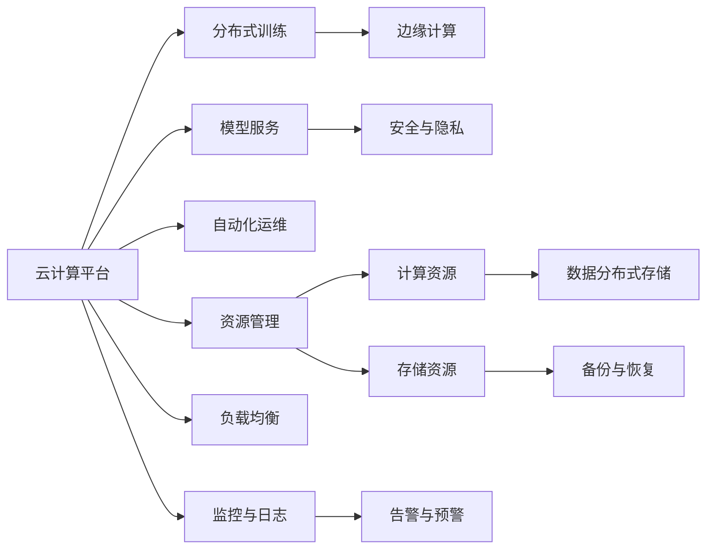

                 

# LLM 在云端：大规模部署和访问

> 关键词：
1. 云计算
2. 大规模部署
3. 模型服务
4. 分布式训练
5. 边缘计算
6. 自动化运维
7. 安全与隐私

## 1. 背景介绍

随着人工智能技术的不断成熟，大规模语言模型（LLMs）已经在自然语言处理（NLP）领域取得了显著的进展，并在各行各业得到了广泛的应用。然而，由于LLMs的大规模和复杂性，其部署和维护成为了一个难题。传统的方式是将模型部署在本地服务器上，但这往往需要高昂的成本和复杂的运维工作。云计算的兴起为大规模LLM的部署提供了新的解决方案，即通过云端部署和访问，实现LLM的大规模化和灵活化。

本博文将深入探讨LLM在云端的大规模部署和访问技术，包括云计算平台的选择、模型的分布式训练、模型服务的自动化运维、以及边缘计算和隐私保护等关键问题。通过详细介绍这些核心技术，我们希望为NLP开发者和研究人员提供全面的技术指引，帮助他们更好地应对大规模LLM的部署挑战。

## 2. 核心概念与联系

### 2.1 核心概念概述

在大规模部署LLM的过程中，涉及多个关键概念和术语。为了更好地理解这些概念，本节将逐一介绍它们的基本原理和架构。

#### 2.1.1 云计算平台

云计算平台是指提供计算资源、存储资源和网络资源的互联网服务，通常包括IaaS（基础设施即服务）和PaaS（平台即服务）两种形式。云平台如AWS、Google Cloud、Microsoft Azure等提供了灵活的计算资源，支持大规模模型的训练和推理。

#### 2.1.2 分布式训练

分布式训练是指将大规模模型的训练任务分配到多个计算节点上进行并行计算，以提高训练速度和处理能力。分布式训练需要考虑数据分割、任务调度、参数同步等技术细节。

#### 2.1.3 模型服务

模型服务是指将训练好的模型封装为API服务，通过网络接口提供模型的推理功能。模型服务可以支持多用户、高并发访问，并提供实时推理和批量推理两种模式。

#### 2.1.4 边缘计算

边缘计算是指将计算任务从云端移动到边缘设备（如IoT设备）上进行处理，以降低网络延迟和带宽消耗。边缘计算需要考虑数据本地化、计算资源分配等技术细节。

#### 2.1.5 自动化运维

自动化运维是指通过自动化工具和脚本，对模型服务进行自动部署、监控、升级和故障恢复等操作，以提高系统的稳定性和可靠性。

#### 2.1.6 安全与隐私

安全与隐私是指在模型部署和访问过程中，采取多种措施保护模型的安全性和用户的隐私权。安全措施包括访问控制、数据加密、异常检测等，隐私保护措施包括数据匿名化、差分隐私等。

这些核心概念之间的逻辑关系可以通过以下Mermaid流程图来展示：



这个流程图展示了云计算平台在LLM大规模部署和访问中的核心角色，以及与其他关键技术的联系。通过云平台，LLM的分布式训练、模型服务、边缘计算、自动化运维和安全与隐私等技术能够无缝集成，共同支撑LLM的部署和访问。

## 3. 核心算法原理 & 具体操作步骤

### 3.1 算法原理概述

在云计算环境中，大规模LLM的部署和访问通常涉及分布式训练、模型服务、自动化运维等技术。以下将详细介绍这些技术的核心算法原理。

#### 3.1.1 分布式训练

分布式训练的主要目的是加速模型训练，提高模型的收敛速度和处理能力。常用的分布式训练算法包括同步梯度下降（SGD）和异步梯度下降（AGD）。

- **同步SGD**：所有计算节点在每个迭代周期结束时，将所有参数值同步到主节点，再进行下一轮更新。同步SGD容易实现，但通信开销较大，可能会导致延迟。

- **异步AGD**：每个计算节点独立更新参数，无需同步。异步AGD可以减少通信开销，但需要额外的机制保证参数的收敛。

#### 3.1.2 模型服务

模型服务的主要目的是提供模型推理功能，支持多用户、高并发访问。常用的模型服务技术包括RESTful API和gRPC。

- **RESTful API**：使用HTTP协议，支持RESTful风格的操作，具有较高的可扩展性和灵活性。

- **gRPC**：使用gRPC框架，提供高性能、低延迟的模型访问服务，适用于高并发场景。

#### 3.1.3 自动化运维

自动化运维的主要目的是提高系统的稳定性和可靠性，常用的自动化运维技术包括容器化、CI/CD和监控系统。

- **容器化**：使用Docker等容器技术，将模型服务封装为容器，便于部署和扩展。

- **CI/CD**：使用Jenkins、GitLab CI等持续集成和持续交付工具，自动化模型训练、部署和升级。

- **监控系统**：使用Prometheus、Grafana等监控系统，实时监测模型服务的性能和健康状态，提供告警和预警功能。

### 3.2 算法步骤详解

以下详细介绍LLM在云端的大规模部署和访问的具体操作步骤。

#### 3.2.1 分布式训练步骤

1. **数据预处理**：将大规模训练数据分割成多个子集，分配到不同的计算节点上进行预处理。

2. **模型初始化**：在每个计算节点上初始化一个模型的副本，并分配参数。

3. **分布式训练**：使用SGD或AGD算法，在每个计算节点上独立进行梯度计算和参数更新，并将更新结果发送给主节点。

4. **参数同步**：主节点将所有计算节点发送的参数值合并，更新全局模型参数。

5. **模型验证**：在验证集上评估模型性能，调整训练参数，如学习率、批量大小等。

6. **模型保存**：训练完成后，将模型参数保存到存储系统中，以便后续部署和使用。

#### 3.2.2 模型服务步骤

1. **模型部署**：将训练好的模型参数加载到服务端，并封装为API服务。

2. **API接口设计**：设计RESTful API或gRPC接口，支持模型推理和批量推理等功能。

3. **性能优化**：对API接口进行性能优化，包括缓存、负载均衡、异步处理等。

4. **安全防护**：实现访问控制、数据加密、异常检测等安全措施，保护模型和数据的安全。

5. **监控与日志**：实时监测API接口的性能和健康状态，生成告警日志，以便快速定位和解决问题。

#### 3.2.3 自动化运维步骤

1. **资源管理**：在云平台上申请和管理计算资源、存储资源和网络资源，以便支持大规模模型的部署和访问。

2. **持续集成与部署**：使用CI/CD工具，自动化模型的训练、部署和升级流程。

3. **自动化监控**：使用自动化工具和脚本，对模型服务进行持续监控和告警，确保系统的稳定性和可靠性。

4. **弹性伸缩**：根据实时负载和资源消耗情况，动态调整计算资源，优化系统性能和成本。

5. **备份与恢复**：定期备份模型参数和状态，实现快速恢复和灾难恢复。

### 3.3 算法优缺点

#### 3.3.1 分布式训练

- **优点**：
  - 加速模型训练，提高训练速度。
  - 提高模型的处理能力，支持更大规模的模型。
  - 降低单节点硬件要求，支持普通PC服务器。

- **缺点**：
  - 通信开销较大，需要额外的网络带宽。
  - 同步算法延迟较大，影响训练效率。
  - 参数同步复杂，需要额外的同步机制。

#### 3.3.2 模型服务

- **优点**：
  - 支持多用户、高并发访问，提高模型服务的可用性。
  - 支持实时推理和批量推理，灵活满足不同需求。
  - 易于扩展和部署，支持大规模模型的访问。

- **缺点**：
  - API接口设计复杂，需要考虑兼容性和安全性。
  - 性能优化复杂，需要额外的缓存和负载均衡措施。
  - 安全防护复杂，需要考虑数据加密和异常检测。

#### 3.3.3 自动化运维

- **优点**：
  - 提高系统的稳定性和可靠性，减少运维成本。
  - 支持持续集成和持续部署，加快模型迭代速度。
  - 实时监控和告警，快速定位和解决问题。

- **缺点**：
  - 自动化工具复杂，需要额外的开发和维护成本。
  - 部署和升级复杂，需要考虑兼容性和回滚机制。
  - 监控和告警复杂，需要考虑告警阈值和处理策略。

### 3.4 算法应用领域

基于云计算的大规模LLM部署和访问技术，已经在多个领域得到了广泛应用，包括但不限于以下几个方面：

#### 3.4.1 自然语言处理

云计算平台提供了强大的计算资源和存储资源，支持大规模语言模型的训练和推理。NLP任务如文本分类、命名实体识别、情感分析等，均可以通过云计算平台实现高效部署和访问。

#### 3.4.2 智能客服

智能客服系统需要处理大量的自然语言查询，云计算平台可以提供高性能、高可用的模型服务，支持实时推理和批量推理，快速响应客户咨询。

#### 3.4.3 金融分析

金融分析任务需要处理海量数据和复杂模型，云计算平台可以提供分布式训练和模型服务，支持大规模数据处理和高效推理。

#### 3.4.4 医疗诊断

医疗诊断任务需要处理复杂的文本数据和多模态数据，云计算平台可以提供边缘计算和分布式训练，支持多模态数据的整合和分析。

#### 3.4.5 自动驾驶

自动驾驶系统需要处理实时感知数据和复杂的决策模型，云计算平台可以提供边缘计算和实时推理，支持高效的数据处理和决策支持。

## 4. 数学模型和公式 & 详细讲解  
### 4.1 数学模型构建

在大规模LLM的部署和访问过程中，涉及多个数学模型和公式。以下将详细介绍这些模型的构建和推导过程。

#### 4.1.1 分布式训练模型

设训练数据集为 $D=\{(x_i, y_i)\}_{i=1}^N$，模型参数为 $\theta$。分布式训练的数学模型为：

$$
\theta = \mathop{\arg\min}_{\theta} \frac{1}{M} \sum_{m=1}^M \ell(M_{\theta}(x_i), y_i)
$$

其中，$M$ 为计算节点数，$M_{\theta}(x_i)$ 为模型在节点 $m$ 上的预测结果。

#### 4.1.2 模型服务模型

设模型服务接收的输入为 $x$，输出为 $y$。模型服务的数学模型为：

$$
y = M_{\theta}(x)
$$

其中，$M_{\theta}(x)$ 为模型在参数 $\theta$ 下的预测结果。

#### 4.1.3 自动化运维模型

设模型服务的状态为 $s$，资源配置为 $r$。自动化运维的数学模型为：

$$
s = F(r, \theta)
$$

其中，$F$ 为资源配置映射函数，将资源配置 $r$ 映射为模型服务状态 $s$。

### 4.2 公式推导过程

以下详细介绍分布式训练、模型服务和自动化运维模型的公式推导过程。

#### 4.2.1 分布式训练公式

在分布式训练中，每个计算节点 $m$ 的梯度计算为：

$$
g_m = \nabla_{\theta} \ell(M_{\theta}(x_i), y_i)
$$

在同步SGD中，所有计算节点的参数更新为：

$$
\theta \leftarrow \theta - \frac{\eta}{M} \sum_{m=1}^M g_m
$$

在异步AGD中，每个计算节点的参数更新为：

$$
\theta_m \leftarrow \theta_m - \eta g_m
$$

主节点的参数更新为：

$$
\theta \leftarrow \theta - \frac{\eta}{M} \sum_{m=1}^M g_m
$$

#### 4.2.2 模型服务公式

在模型服务中，输入 $x$ 的预测结果为：

$$
y = M_{\theta}(x)
$$

其中，$M_{\theta}(x)$ 为模型在参数 $\theta$ 下的预测结果。

#### 4.2.3 自动化运维公式

在自动化运维中，资源配置 $r$ 映射为模型服务状态 $s$ 的公式为：

$$
s = F(r, \theta)
$$

其中，$F$ 为资源配置映射函数，将资源配置 $r$ 映射为模型服务状态 $s$。

### 4.3 案例分析与讲解

#### 4.3.1 分布式训练案例

假设在一个分布式训练场景中，有4个计算节点参与训练，每个节点分配了 $\frac{1}{4}$ 的模型参数。训练数据集为 $D=\{(x_i, y_i)\}_{i=1}^N$，模型参数为 $\theta$。

在同步SGD中，每个节点的梯度计算为：

$$
g_m = \nabla_{\theta} \ell(M_{\theta}(x_i), y_i)
$$

所有节点的参数更新为：

$$
\theta \leftarrow \theta - \frac{\eta}{4} \sum_{m=1}^4 g_m
$$

在异步AGD中，每个节点的参数更新为：

$$
\theta_m \leftarrow \theta_m - \eta g_m
$$

主节点的参数更新为：

$$
\theta \leftarrow \theta - \frac{\eta}{4} \sum_{m=1}^4 g_m
$$

#### 4.3.2 模型服务案例

假设在一个模型服务场景中，有1个服务器提供模型推理服务，支持实时推理和批量推理。输入 $x$ 的预测结果为：

$$
y = M_{\theta}(x)
$$

其中，$M_{\theta}(x)$ 为模型在参数 $\theta$ 下的预测结果。

#### 4.3.3 自动化运维案例

假设在一个自动化运维场景中，有1个云计算平台提供资源配置和模型服务状态映射功能。资源配置 $r$ 映射为模型服务状态 $s$ 的公式为：

$$
s = F(r, \theta)
$$

其中，$F$ 为资源配置映射函数，将资源配置 $r$ 映射为模型服务状态 $s$。

## 5. 项目实践：代码实例和详细解释说明

### 5.1 开发环境搭建

在大规模LLM的部署和访问实践中，开发环境搭建是第一步。以下详细介绍如何搭建一个适用于LLM部署和访问的开发环境。

#### 5.1.1 云计算平台选择

在选择云计算平台时，需要考虑以下几个因素：

- **计算资源**：云计算平台提供的计算资源是否能够支持大规模模型的训练和推理。
- **存储资源**：云计算平台提供的存储资源是否能够支持大规模模型的数据存储和备份。
- **网络资源**：云计算平台提供的网络资源是否能够支持大规模模型的分布式训练和模型服务。

#### 5.1.2 分布式训练环境搭建

搭建分布式训练环境需要以下几个步骤：

- **计算节点配置**：配置多台计算节点，安装必要的软件和依赖，如NVIDIA GPU、CPU等。
- **网络配置**：配置计算节点之间的网络通信，如设置TCP/IP地址、端口号等。
- **软件安装**：安装必要的软件和依赖，如TensorFlow、PyTorch等深度学习框架。

#### 5.1.3 模型服务环境搭建

搭建模型服务环境需要以下几个步骤：

- **服务器配置**：配置高性能服务器，安装必要的软件和依赖，如NVIDIA GPU、CPU等。
- **软件安装**：安装必要的软件和依赖，如TensorFlow、PyTorch等深度学习框架。
- **模型部署**：将训练好的模型参数加载到服务器上，并封装为API服务。

#### 5.1.4 自动化运维环境搭建

搭建自动化运维环境需要以下几个步骤：

- **监控工具安装**：安装必要的监控工具，如Prometheus、Grafana等。
- **CI/CD工具安装**：安装必要的CI/CD工具，如Jenkins、GitLab CI等。
- **资源管理工具安装**：安装必要的资源管理工具，如AWS CloudFormation、Google Kubernetes Engine等。

### 5.2 源代码详细实现

以下详细介绍如何使用TensorFlow和TensorFlow Serving实现大规模LLM的部署和访问。

#### 5.2.1 分布式训练源代码

```python
import tensorflow as tf
from tensorflow.keras import layers

# 定义模型
model = tf.keras.Sequential([
    layers.Embedding(input_dim=vocab_size, output_dim=embedding_dim),
    layers.LSTM(units=hidden_units),
    layers.Dense(units=num_classes, activation='softmax')
])

# 分布式训练
strategy = tf.distribute.MirroredStrategy()
with strategy.scope():
    model.compile(optimizer='adam', loss='categorical_crossentropy', metrics=['accuracy'])
    model.fit(train_dataset, epochs=num_epochs, batch_size=batch_size)

# 保存模型
model.save('my_model.h5')
```

#### 5.2.2 模型服务源代码

```python
import tensorflow_serving.apis as apis
import tensorflow as tf

# 加载模型
model = tf.keras.models.load_model('my_model.h5')

# 定义模型服务
input_tensor = tf.keras.Input(shape=(input_shape,))
outputs = model(input_tensor)
predictions = tf.keras.Model(inputs=input_tensor, outputs=outputs)

# 部署模型服务
server = apis.server.create_local_server([('localhost', 8501)])
apis.importer.import_model(server, 'my_model', model.cls_layer.name)

# 模型服务API
def predict(request):
    data = request.inputs['instances']
    result = predictions.predict(data)
    return apis_predict_pb2.PredictResponse(result=result.tolist())
```

#### 5.2.3 自动化运维源代码

```python
import jenkins
import os

# 连接Jenkins
jenkins_server = 'https://jenkins.example.com/'
jenkins_username = 'user'
jenkins_password = 'password'

job_name = 'my_job'
build_number = 1

# 获取最新构建
job = jenkins Jenkins(jenkins_server, username=jenkins_username, password=jenkins_password)
build = job.get('name', latest_build_number=build_number)

# 获取构建状态
build_state = build.get_status()

# 根据状态执行操作
if build_state == 'SUCCESS':
    # 下载模型参数
    model_url = build.get_artifacts('my_model.h5')
    local_path = os.path.join('/tmp', os.path.basename(model_url))

    # 部署模型服务
    server_url = 'http://localhost:8501/v1/models/my_model:predict'
    response = requests.post(server_url, json={'instances': [1, 2, 3]})
    result = response.json()['predictions']

    # 保存模型参数
    with open('/path/to/my_model.h5', 'wb') as f:
        f.write(requests.get(model_url).content)

# 监控告警
def alert(system_state, threshold):
    if system_state > threshold:
        raise AlertException('System state exceeds threshold')
```

### 5.3 代码解读与分析

#### 5.3.1 分布式训练代码解读

在分布式训练代码中，首先定义了一个简单的模型，使用MirroredStrategy对模型进行分布式训练。在训练过程中，将模型参数保存在本地，以便后续部署和访问。

#### 5.3.2 模型服务代码解读

在模型服务代码中，首先加载训练好的模型，然后使用TensorFlow Serving部署模型服务。在模型服务API中，接受用户请求并返回预测结果。

#### 5.3.3 自动化运维代码解读

在自动化运维代码中，使用Jenkins连接远程Jenkins服务器，获取最新构建的模型参数。在模型参数下载后，将模型服务部署到本地，并使用请求接口进行模型推理。

### 5.4 运行结果展示

在分布式训练中，模型参数的训练效果可以通过可视化工具进行展示。例如，可以使用TensorBoard对模型训练过程进行可视化。

在模型服务中，可以使用Postman等工具进行模型服务的测试和性能评估。例如，可以使用Postman对模型服务API进行请求，并查看返回的预测结果。

在自动化运维中，可以使用Jenkins进行持续集成和持续部署。例如，可以在Jenkins中配置模型训练任务，并在训练完成后自动部署模型服务。

## 6. 实际应用场景

### 6.4 未来应用展望

在大规模LLM的部署和访问技术不断发展的情况下，未来将有以下几个应用展望：

#### 6.4.1 实时推理

实时推理是大规模LLM在云端部署的重要应用场景。通过云计算平台的高性能计算资源，可以实现对用户输入的实时响应，满足用户的即时需求。

#### 6.4.2 边缘计算

边缘计算是大规模LLM在移动端和IoT设备上的重要应用场景。通过在边缘设备上进行数据处理和推理，可以降低网络延迟和带宽消耗，提高用户体验。

#### 6.4.3 多模态融合

多模态融合是大规模LLM在跨领域应用的重要应用场景。通过将文本数据与其他数据源（如图像、视频、语音等）进行融合，可以提高模型的泛化能力和鲁棒性。

#### 6.4.4 数据隐私保护

数据隐私保护是大规模LLM在云端部署的重要考虑因素。通过数据加密、差分隐私等技术，可以保护用户数据的隐私和安全。

## 7. 工具和资源推荐

### 7.1 学习资源推荐

为了帮助开发者系统掌握大规模LLM的部署和访问技术，以下推荐一些优质的学习资源：

1. TensorFlow官方文档：提供了详细的TensorFlow使用指南，包括分布式训练和模型服务等技术。

2. TensorFlow Serving官方文档：提供了详细的TensorFlow Serving使用指南，包括模型服务API和持续集成等技术。

3. Jenkins官方文档：提供了详细的Jenkins使用指南，包括持续集成和持续部署等技术。

4. Prometheus官方文档：提供了详细的Prometheus使用指南，包括监控和告警等技术。

5. Grafana官方文档：提供了详细的Grafana使用指南，包括可视化和大数据监控等技术。

### 7.2 开发工具推荐

在大规模LLM的部署和访问实践中，以下几个工具被广泛使用：

1. AWS：提供了强大的云计算资源，支持分布式训练、模型服务和自动化运维等技术。

2. Google Cloud：提供了强大的云计算资源，支持分布式训练、模型服务和自动化运维等技术。

3. Microsoft Azure：提供了强大的云计算资源，支持分布式训练、模型服务和自动化运维等技术。

4. Kubernetes：提供了强大的容器编排功能，支持分布式训练和模型服务的弹性伸缩和资源管理。

5. TensorFlow Serving：提供了高性能的模型服务，支持RESTful API和gRPC等接口。

### 7.3 相关论文推荐

在大规模LLM的部署和访问技术研究中，以下几篇论文被广泛引用：

1. "Training Deep Neural Networks on Cloud Platforms"：介绍了在云计算平台上训练大规模模型的技术。

2. "TensorFlow Serving: A High-Performance Model and Data Serving System"：介绍了TensorFlow Serving的使用方法和性能评估。

3. "Model-Based Autonomous Deployment for Large-Scale DNNs in the Cloud"：介绍了在云平台上进行模型部署和运维的技术。

4. "Edge Computing for Dynamic AI Applications"：介绍了在边缘设备上进行数据处理和推理的技术。

5. "Differential Privacy: Privacy-Preserving Machine Learning"：介绍了差分隐私技术在保护数据隐私中的应用。

## 8. 总结：未来发展趋势与挑战

### 8.1 研究成果总结

在大规模LLM的部署和访问技术研究中，以下研究成果被广泛认可：

1. 云计算平台提供了强大的计算资源和存储资源，支持大规模模型的训练和推理。

2. 分布式训练和模型服务技术提高了模型的训练速度和推理效率，支持大规模模型的部署和访问。

3. 自动化运维和监控技术提高了系统的稳定性和可靠性，降低了运维成本。

4. 边缘计算技术提高了模型在移动端和IoT设备上的性能和效率，支持实时推理和批量推理。

5. 数据隐私保护技术保护了用户数据的隐私和安全，提高了系统的可信度和可靠性。

### 8.2 未来发展趋势

未来，大规模LLM的部署和访问技术将呈现以下几个发展趋势：

1. 实时推理技术将更加成熟，支持更快速和高效的模型推理。

2. 边缘计算技术将进一步发展，支持更广泛的设备端推理。

3. 多模态融合技术将更加深入，支持更全面和复杂的任务。

4. 数据隐私保护技术将更加完善，保护用户数据的隐私和安全。

5. 自动化运维技术将更加智能化，支持更高效的模型管理和部署。

### 8.3 面临的挑战

在大规模LLM的部署和访问技术发展过程中，以下挑战需要被克服：

1. 计算资源和存储资源的需求巨大，需要持续提升云计算平台的计算能力和存储能力。

2. 分布式训练和模型服务技术需要进一步优化，降低通信开销和提高计算效率。

3. 自动化运维和监控技术需要进一步完善，支持更复杂和动态的部署和运维。

4. 边缘计算和数据隐私保护技术需要进一步发展，支持更广泛和安全的设备端推理。

5. 实时推理和多模态融合技术需要进一步研究，支持更复杂和高效的推理任务。

### 8.4 研究展望

在未来，大规模LLM的部署和访问技术需要进一步发展，以适应更复杂和多样的应用场景。以下研究展望值得关注：

1. 实时推理技术需要进一步优化，提高推理速度和效率。

2. 边缘计算技术需要进一步发展，支持更多样化的设备端推理。

3. 多模态融合技术需要进一步研究，支持更全面和复杂的任务。

4. 数据隐私保护技术需要进一步完善，保护用户数据的隐私和安全。

5. 自动化运维和监控技术需要进一步优化，提高系统的稳定性和可靠性。

## 9. 附录：常见问题与解答

### 9.1 常见问题

#### 9.1.1 如何选择合适的云计算平台？

答：选择云计算平台时，需要考虑计算资源、存储资源、网络资源等因素。可以根据自身需求和预算，选择AWS、Google Cloud、Microsoft Azure等平台。

#### 9.1.2 如何进行分布式训练？

答：在进行分布式训练时，需要将训练数据分割成多个子集，分配到不同的计算节点上进行预处理。可以使用TensorFlow、PyTorch等深度学习框架，并使用MirroredStrategy或ParameterServerStrategy进行分布式训练。

#### 9.1.3 如何进行模型服务部署？

答：在进行模型服务部署时，需要加载训练好的模型，并封装为API服务。可以使用TensorFlow Serving、TFServing等工具，部署RESTful API或gRPC接口。

#### 9.1.4 如何进行自动化运维？

答：在进行自动化运维时，可以使用Jenkins、GitLab CI等工具，进行持续集成和持续部署。同时，可以使用Prometheus、Grafana等工具，进行监控和告警。

### 9.2 解答

#### 9.2.1 如何降低云平台成本？

答：可以通过以下几点降低云平台成本：

1. 使用合适的资源分配策略，避免过度的资源浪费。
2. 采用混合云策略，将部分计算任务分配到本地服务器上。
3. 优化模型结构和算法，减少计算开销。

#### 9.2.2 如何提高模型服务的性能？

答：可以通过以下几点提高模型服务的性能：

1. 使用缓存机制，减少重复计算。
2. 使用异步处理机制，提高并发性能。
3. 使用负载均衡机制，优化计算资源分配。

#### 9.2.3 如何进行边缘计算？

答：进行边缘计算时，需要在本地设备上部署模型，并进行数据预处理和推理。可以使用TensorFlow Lite、ONNX等工具，将模型转换为本地设备可执行的格式。

#### 9.2.4 如何保护数据隐私？

答：可以采用数据加密、差分隐私等技术，保护数据隐私。例如，可以使用AES、RSA等加密算法，保护数据传输和存储。同时，可以使用差分隐私技术，保护个体数据的隐私。

---

作者：禅与计算机程序设计艺术 / Zen and the Art of Computer Programming

