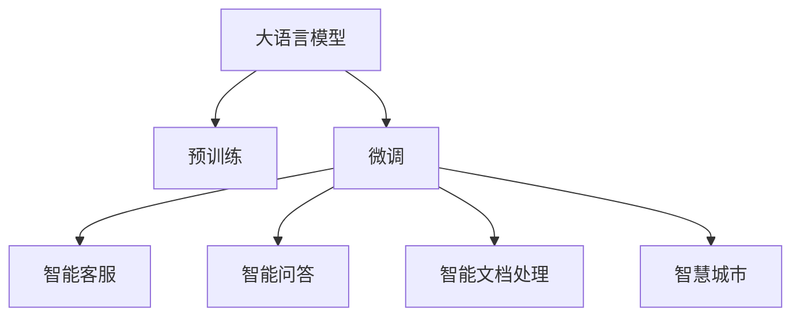

                 

# LLM 在公共服务领域：高效便民的新方式

> 关键词：人工智能,公共服务,大语言模型,自然语言处理,NLP,用户体验,智慧城市

## 1. 背景介绍

### 1.1 问题由来
随着人工智能技术的迅猛发展，大语言模型(LLM)在自然语言处理(NLP)领域的崛起，为公共服务的智能化转型带来了新的机遇。传统公共服务多依赖人工客服、纸质文档、电话热线等手段，不仅效率低下，且服务质量参差不齐。而LLM的出现，使得智能客服、智能问答、智能文档处理等诸多公共服务场景变得更加高效、便捷、精准。

### 1.2 问题核心关键点
LLM在公共服务领域的核心价值在于其强大的语言理解和生成能力，能够在各种自然语言处理任务上提供高效、智能的服务。其工作原理是基于大规模预训练，然后在特定任务上通过微调，将通用语言知识适配到具体的公共服务场景。这使得LLM能够快速处理大量的公共服务请求，提升用户满意度，同时降低公共服务的成本。

### 1.3 问题研究意义
本研究聚焦于大语言模型在公共服务领域的部署与应用，旨在探讨如何将大语言模型应用于智能客服、智能问答、智能文档处理等多个公共服务场景，以提升公共服务的效率、质量和便捷性。此外，研究LLM在公共服务领域面临的挑战与解决策略，对于推动智慧城市建设，提升社会治理水平具有重要意义。

## 2. 核心概念与联系

### 2.1 核心概念概述

为更好地理解LLM在公共服务中的应用，本节将介绍几个关键概念：

- 大语言模型(LLM)：以Transformer为代表的、通过大规模预训练获得的语言模型，具备强大的语言理解和生成能力。
- 预训练(Pre-training)：指在大规模无标签文本语料上进行自监督学习，学习通用的语言表示。
- 微调(Fine-tuning)：指在预训练模型的基础上，使用特定任务的数据进行有监督学习，优化模型在该任务上的性能。
- 自然语言处理(NLP)：涉及语言模型、文本分类、机器翻译、信息抽取等诸多技术，旨在使计算机理解和生成人类语言。
- 智能客服(Chatbot)：利用NLP技术实现的人机对话系统，能够回答用户问题，提供智能服务。
- 智慧城市(Smart City)：通过云计算、物联网、大数据等技术，提升城市管理的智能化水平，改善市民生活。

这些概念之间的关系可以通过以下Mermaid流程图来展示：



这个流程图展示了LLM的核心概念及其在公共服务领域的潜在应用：

1. LLM通过大规模预训练获得通用语言表示。
2. 微调将通用语言表示适配到特定公共服务任务，提升任务处理能力。
3. 微调的LLM可以应用于智能客服、智能问答、智能文档处理等多个场景，提升服务效率和质量。
4. LLM在智慧城市中也有广阔应用，如智能交通、公共安全等领域。

## 3. 核心算法原理 & 具体操作步骤
### 3.1 算法原理概述

在公共服务领域，LLM的应用核心在于其强大的语言理解和生成能力，能够自动处理自然语言请求，提供精准的回应和建议。这主要依赖于大模型的预训练-微调过程。其基本流程如下：

1. **预训练**：在大规模无标签文本数据上训练大语言模型，学习通用的语言表示。
2. **微调**：在特定公共服务任务的数据集上，使用有监督学习优化模型，使其适应具体任务。
3. **部署与应用**：将微调后的模型部署到实际应用场景，提供智能服务。

### 3.2 算法步骤详解

以下详细描述LLM在公共服务领域微调的具体步骤：

**Step 1: 准备数据集和模型**

- 收集公共服务相关的问题与答案数据，构建标注数据集。
- 选择适合的预训练语言模型，如BERT、GPT等，进行初始化。

**Step 2: 设计任务适配层**

- 根据具体任务类型，设计合适的输出层和损失函数。例如，智能客服任务通常使用序列到序列(S2S)模型，智能问答使用分类模型。

**Step 3: 训练与优化**

- 使用微调数据集进行模型训练，设置合适的学习率、批大小、迭代轮数等超参数。
- 应用正则化技术如Dropout、L2正则等，防止模型过拟合。
- 使用小学习率，避免破坏预训练权重。
- 对训练数据进行数据增强，如随机打乱、回译等，丰富训练集。

**Step 4: 评估与部署**

- 在验证集上评估模型性能，根据性能指标决定是否继续训练。
- 在测试集上进一步评估模型效果，输出最终结果。
- 将微调后的模型部署到实际应用系统，如智能客服系统、智能问答系统等。

### 3.3 算法优缺点

LLM在公共服务领域的应用有以下优点：

- **高效**：处理自然语言请求的速度远超人工客服，提升公共服务效率。
- **精准**：利用深度学习模型处理自然语言，理解上下文语境，提供精准的回应。
- **可扩展**：模型规模可随需求扩展，适应不同规模的公共服务场景。

同时，也存在以下缺点：

- **数据依赖**：模型性能依赖标注数据的质量和数量，标注成本较高。
- **泛化能力**：在不同任务上泛化能力可能有限，对特定领域的数据适应性不强。
- **可解释性**：模型输出结果缺乏可解释性，难以解释其决策过程。
- **隐私风险**：处理用户请求时可能面临隐私泄露的风险。

尽管有这些局限性，但LLM在公共服务领域的优势明显，其广泛应用前景不容忽视。

### 3.4 算法应用领域

LLM在公共服务领域的应用主要涵盖以下几个方面：

- **智能客服(Chatbot)**：自动回答用户常见问题，提供7x24小时不间断服务，提升用户满意度。
- **智能问答**：基于用户问题，提供详细的答案或指导，帮助用户解决问题。
- **智能文档处理**：自动提取文档中的信息，如招聘信息、公告等，提升信息处理效率。
- **智慧城市**：应用于智能交通、公共安全、环境监测等领域，提供实时数据分析和决策支持。
- **政务服务**：自动生成政府文书、处理政务咨询，提升政务服务的智能化水平。

## 4. 数学模型和公式 & 详细讲解 & 举例说明

### 4.1 数学模型构建

在本节中，我们将使用数学语言详细描述基于LLM的公共服务任务的微调过程。

假设LLM为预训练模型 $M_{\theta}$，其中 $\theta$ 为预训练参数。在具体任务上，设计合适的输出层和损失函数 $\ell$。以智能客服为例，假设输出层为 $y_i$，输入为 $x_i$，则损失函数为：

$$
\mathcal{L}(\theta) = \sum_{i=1}^N \ell(M_{\theta}(x_i), y_i)
$$

微调的目标是最小化损失函数 $\mathcal{L}$，即：

$$
\theta^* = \mathop{\arg\min}_{\theta} \mathcal{L}(\theta)
$$

### 4.2 公式推导过程

以智能客服为例，假设有 $N$ 个训练样本，损失函数 $\ell$ 为交叉熵损失，则有：

$$
\mathcal{L}(\theta) = -\frac{1}{N} \sum_{i=1}^N \sum_{j=1}^k y_{ij} \log M_{\theta}(x_i; j)
$$

其中 $y_{ij}$ 为第 $i$ 个样本第 $j$ 个输出通道的标签，$M_{\theta}(x_i; j)$ 为模型在第 $j$ 个输出通道上的预测结果。

使用梯度下降等优化算法，更新参数 $\theta$：

$$
\theta \leftarrow \theta - \eta \nabla_{\theta} \mathcal{L}(\theta)
$$

其中 $\eta$ 为学习率，$\nabla_{\theta} \mathcal{L}(\theta)$ 为损失函数对参数 $\theta$ 的梯度。

### 4.3 案例分析与讲解

以下以智能客服为例，详细分析LLM微调的具体实现：

**Step 1: 数据准备**

假设我们有 $N=1000$ 个智能客服问题-答案对，其中 $50\%$ 为常见问题，$50\%$ 为特殊问题。将问题作为输入，答案作为标签，构建训练集和验证集。

**Step 2: 模型选择**

选择BERT-base模型，作为预训练模型 $M_{\theta}$，构建序列到序列模型，输出层为全连接层，损失函数为交叉熵。

**Step 3: 训练与优化**

设置学习率 $\eta=2e-5$，批大小 $b=16$，迭代轮数 $E=5$。使用AdamW优化器，L2正则 $\lambda=1e-4$，Dropout概率 $p=0.1$。

**Step 4: 评估与部署**

在验证集上评估模型性能，选择BLEU和ROUGE等指标。使用测试集进一步评估，输出最终模型。部署到智能客服系统，提供实时服务。

## 5. 项目实践：代码实例和详细解释说明

### 5.1 开发环境搭建

在进行LLM微调实践前，我们需要准备好开发环境。以下是使用Python进行PyTorch开发的环境配置流程：

1. 安装Anaconda：从官网下载并安装Anaconda，用于创建独立的Python环境。
2. 创建并激活虚拟环境：
```bash
conda create -n pytorch-env python=3.8 
conda activate pytorch-env
```
3. 安装PyTorch：根据CUDA版本，从官网获取对应的安装命令。例如：
```bash
conda install pytorch torchvision torchaudio cudatoolkit=11.1 -c pytorch -c conda-forge
```
4. 安装Transformers库：
```bash
pip install transformers
```
5. 安装各类工具包：
```bash
pip install numpy pandas scikit-learn matplotlib tqdm jupyter notebook ipython
```

完成上述步骤后，即可在`pytorch-env`环境中开始LLM微调的实践。

### 5.2 源代码详细实现

这里我们以智能客服任务为例，给出使用Transformers库对BERT模型进行微调的PyTorch代码实现。

首先，定义智能客服任务的数据处理函数：

```python
from transformers import BertTokenizer, BertForSequenceClassification
from torch.utils.data import Dataset
import torch

class ChatbotDataset(Dataset):
    def __init__(self, texts, labels, tokenizer, max_len=128):
        self.texts = texts
        self.labels = labels
        self.tokenizer = tokenizer
        self.max_len = max_len
        
    def __len__(self):
        return len(self.texts)
    
    def __getitem__(self, item):
        text = self.texts[item]
        label = self.labels[item]
        
        encoding = self.tokenizer(text, return_tensors='pt', max_length=self.max_len, padding='max_length', truncation=True)
        input_ids = encoding['input_ids'][0]
        attention_mask = encoding['attention_mask'][0]
        
        # 对标签进行编码
        encoded_labels = [label] + [0]*(self.max_len-1)
        labels = torch.tensor(encoded_labels, dtype=torch.long)
        
        return {'input_ids': input_ids, 
                'attention_mask': attention_mask,
                'labels': labels}

# 标签与id的映射
label2id = {'common': 0, 'special': 1}
id2label = {v: k for k, v in label2id.items()}

# 创建dataset
tokenizer = BertTokenizer.from_pretrained('bert-base-cased')

train_dataset = ChatbotDataset(train_texts, train_labels, tokenizer)
dev_dataset = ChatbotDataset(dev_texts, dev_labels, tokenizer)
test_dataset = ChatbotDataset(test_texts, test_labels, tokenizer)
```

然后，定义模型和优化器：

```python
from transformers import AdamW

model = BertForSequenceClassification.from_pretrained('bert-base-cased', num_labels=2)

optimizer = AdamW(model.parameters(), lr=2e-5)
```

接着，定义训练和评估函数：

```python
from torch.utils.data import DataLoader
from tqdm import tqdm
from sklearn.metrics import classification_report

device = torch.device('cuda') if torch.cuda.is_available() else torch.device('cpu')
model.to(device)

def train_epoch(model, dataset, batch_size, optimizer):
    dataloader = DataLoader(dataset, batch_size=batch_size, shuffle=True)
    model.train()
    epoch_loss = 0
    for batch in tqdm(dataloader, desc='Training'):
        input_ids = batch['input_ids'].to(device)
        attention_mask = batch['attention_mask'].to(device)
        labels = batch['labels'].to(device)
        model.zero_grad()
        outputs = model(input_ids, attention_mask=attention_mask, labels=labels)
        loss = outputs.loss
        epoch_loss += loss.item()
        loss.backward()
        optimizer.step()
    return epoch_loss / len(dataloader)

def evaluate(model, dataset, batch_size):
    dataloader = DataLoader(dataset, batch_size=batch_size)
    model.eval()
    preds, labels = [], []
    with torch.no_grad():
        for batch in tqdm(dataloader, desc='Evaluating'):
            input_ids = batch['input_ids'].to(device)
            attention_mask = batch['attention_mask'].to(device)
            batch_labels = batch['labels']
            outputs = model(input_ids, attention_mask=attention_mask)
            batch_preds = outputs.logits.argmax(dim=1).to('cpu').tolist()
            batch_labels = batch_labels.to('cpu').tolist()
            for pred, label in zip(batch_preds, batch_labels):
                preds.append(pred)
                labels.append(label)
                
    print(classification_report(labels, preds))
```

最后，启动训练流程并在测试集上评估：

```python
epochs = 5
batch_size = 16

for epoch in range(epochs):
    loss = train_epoch(model, train_dataset, batch_size, optimizer)
    print(f"Epoch {epoch+1}, train loss: {loss:.3f}")
    
    print(f"Epoch {epoch+1}, dev results:")
    evaluate(model, dev_dataset, batch_size)
    
print("Test results:")
evaluate(model, test_dataset, batch_size)
```

以上就是使用PyTorch对BERT进行智能客服任务微调的完整代码实现。可以看到，得益于Transformers库的强大封装，我们可以用相对简洁的代码完成BERT模型的加载和微调。

### 5.3 代码解读与分析

让我们再详细解读一下关键代码的实现细节：

**ChatbotDataset类**：
- `__init__`方法：初始化训练文本、标签、分词器等关键组件。
- `__len__`方法：返回数据集的样本数量。
- `__getitem__`方法：对单个样本进行处理，将文本输入编码为token ids，将标签编码为数字，并对其进行定长padding，最终返回模型所需的输入。

**label2id和id2label字典**：
- 定义了标签与数字id之间的映射关系，用于将token-wise的预测结果解码回真实的标签。

**训练和评估函数**：
- 使用PyTorch的DataLoader对数据集进行批次化加载，供模型训练和推理使用。
- 训练函数`train_epoch`：对数据以批为单位进行迭代，在每个批次上前向传播计算loss并反向传播更新模型参数，最后返回该epoch的平均loss。
- 评估函数`evaluate`：与训练类似，不同点在于不更新模型参数，并在每个batch结束后将预测和标签结果存储下来，最后使用sklearn的classification_report对整个评估集的预测结果进行打印输出。

**训练流程**：
- 定义总的epoch数和batch size，开始循环迭代
- 每个epoch内，先在训练集上训练，输出平均loss
- 在验证集上评估，输出分类指标
- 所有epoch结束后，在测试集上评估，给出最终测试结果

可以看到，PyTorch配合Transformers库使得BERT微调的代码实现变得简洁高效。开发者可以将更多精力放在数据处理、模型改进等高层逻辑上，而不必过多关注底层的实现细节。

当然，工业级的系统实现还需考虑更多因素，如模型的保存和部署、超参数的自动搜索、更灵活的任务适配层等。但核心的微调范式基本与此类似。

## 6. 实际应用场景

### 6.1 智能客服系统

基于LLM的智能客服系统，可以广泛应用于各种客服场景，如金融、电商、医疗等。其核心思想是将用户的问题转换为预训练模型能理解的格式，通过微调使其适应具体的客服场景。

在技术实现上，可以收集各行业的客服对话记录，将问题和最佳答复构建成监督数据，在此基础上对预训练模型进行微调。微调后的模型能够自动理解用户意图，匹配最合适的答案模板进行回复。对于客户提出的新问题，还可以接入检索系统实时搜索相关内容，动态组织生成回答。

### 6.2 智能问答

智能问答系统可以广泛应用于教育、科研、政府等领域，为用户提供即时的答案支持。与传统的搜索引擎不同，智能问答系统不仅能够回答用户的查询，还能对问题进行深入解释和推理。

在技术实现上，可以构建基于LLM的问答模型，使用有监督数据进行微调。微调后的模型能够在阅读完用户问题后，自动生成详细的答案和解释。通过引入知识图谱和推理规则，可以进一步提升模型对复杂问题的处理能力。

### 6.3 智能文档处理

智能文档处理系统可以应用于企业文档管理、政府公文处理等领域，自动提取和理解文档内容，提升文档处理的效率和准确性。

在技术实现上，可以收集各行业的文档样本，将文档标题和内容作为训练数据，对预训练模型进行微调。微调后的模型能够自动识别文档类型，提取关键信息，如会议纪要、合同摘要等。通过引入实体识别和关系抽取技术，可以进一步提升文档处理的深度和广度。

### 6.4 智慧城市

在智慧城市建设中，LLM可以应用于智能交通、公共安全、环境监测等领域，提升城市管理的智能化水平。

例如，智能交通系统可以通过分析交通流量数据，预测交通拥堵情况，提供实时路线建议。智能公共安全系统可以通过分析视频监控数据，自动识别异常行为，及时报警。智能环境监测系统可以通过分析环境数据，预测空气质量变化，提供健康建议。

## 7. 工具和资源推荐

### 7.1 学习资源推荐

为了帮助开发者系统掌握LLM在公共服务领域的理论基础和实践技巧，这里推荐一些优质的学习资源：

1. 《Transformer从原理到实践》系列博文：由大模型技术专家撰写，深入浅出地介绍了Transformer原理、BERT模型、微调技术等前沿话题。

2. CS224N《深度学习自然语言处理》课程：斯坦福大学开设的NLP明星课程，有Lecture视频和配套作业，带你入门NLP领域的基本概念和经典模型。

3. 《Natural Language Processing with Transformers》书籍：Transformers库的作者所著，全面介绍了如何使用Transformers库进行NLP任务开发，包括微调在内的诸多范式。

4. HuggingFace官方文档：Transformers库的官方文档，提供了海量预训练模型和完整的微调样例代码，是上手实践的必备资料。

5. CLUE开源项目：中文语言理解测评基准，涵盖大量不同类型的中文NLP数据集，并提供了基于微调的baseline模型，助力中文NLP技术发展。

通过对这些资源的学习实践，相信你一定能够快速掌握LLM在公共服务领域的微调方法和应用实践。

### 7.2 开发工具推荐

高效的开发离不开优秀的工具支持。以下是几款用于LLM微调开发的常用工具：

1. PyTorch：基于Python的开源深度学习框架，灵活动态的计算图，适合快速迭代研究。大部分预训练语言模型都有PyTorch版本的实现。

2. TensorFlow：由Google主导开发的开源深度学习框架，生产部署方便，适合大规模工程应用。同样有丰富的预训练语言模型资源。

3. Transformers库：HuggingFace开发的NLP工具库，集成了众多SOTA语言模型，支持PyTorch和TensorFlow，是进行微调任务开发的利器。

4. Weights & Biases：模型训练的实验跟踪工具，可以记录和可视化模型训练过程中的各项指标，方便对比和调优。与主流深度学习框架无缝集成。

5. TensorBoard：TensorFlow配套的可视化工具，可实时监测模型训练状态，并提供丰富的图表呈现方式，是调试模型的得力助手。

6. Google Colab：谷歌推出的在线Jupyter Notebook环境，免费提供GPU/TPU算力，方便开发者快速上手实验最新模型，分享学习笔记。

合理利用这些工具，可以显著提升LLM微调任务的开发效率，加快创新迭代的步伐。

### 7.3 相关论文推荐

LLM和微调技术的发展源于学界的持续研究。以下是几篇奠基性的相关论文，推荐阅读：

1. Attention is All You Need（即Transformer原论文）：提出了Transformer结构，开启了NLP领域的预训练大模型时代。

2. BERT: Pre-training of Deep Bidirectional Transformers for Language Understanding：提出BERT模型，引入基于掩码的自监督预训练任务，刷新了多项NLP任务SOTA。

3. Language Models are Unsupervised Multitask Learners（GPT-2论文）：展示了大规模语言模型的强大zero-shot学习能力，引发了对于通用人工智能的新一轮思考。

4. Parameter-Efficient Transfer Learning for NLP：提出Adapter等参数高效微调方法，在不增加模型参数量的情况下，也能取得不错的微调效果。

5. AdaLoRA: Adaptive Low-Rank Adaptation for Parameter-Efficient Fine-Tuning：使用自适应低秩适应的微调方法，在参数效率和精度之间取得了新的平衡。

6. Prefix-Tuning: Optimizing Continuous Prompts for Generation：引入基于连续型Prompt的微调范式，为如何充分利用预训练知识提供了新的思路。

这些论文代表了大语言模型微调技术的发展脉络。通过学习这些前沿成果，可以帮助研究者把握学科前进方向，激发更多的创新灵感。

## 8. 总结：未来发展趋势与挑战

### 8.1 总结

本文对基于LLM的公共服务领域的应用进行了全面系统的介绍。首先阐述了LLM在公共服务中的核心价值和应用场景，明确了其在提升公共服务效率、质量和便捷性方面的独特优势。其次，从原理到实践，详细讲解了LLM在公共服务领域微调的具体方法，给出了微调任务开发的完整代码实例。同时，本文还广泛探讨了LLM在公共服务领域的应用前景，展示了其广泛的应用潜力。

通过本文的系统梳理，可以看到，基于LLM的微调方法正在成为公共服务领域的重要技术范式，极大地提升了公共服务智能化水平，推动了智慧城市建设。未来，伴随LLM和微调方法的持续演进，相信其在公共服务领域的应用将更加深入，为社会治理和公民生活带来更多便利。

### 8.2 未来发展趋势

展望未来，LLM在公共服务领域的应用趋势如下：

1. **智能服务场景多元化**：LLM将广泛应用于更多公共服务场景，如智能医疗、智能教育、智能法律等领域，提供多领域的智能化服务。
2. **多模态融合**：将视觉、语音等多模态数据与文本数据结合，提升公共服务智能化水平，如智能交通系统结合视频监控数据和语音识别，提升交通管理和公共安全能力。
3. **个性化服务**：基于用户历史数据和行为特征，提供个性化的公共服务，提升用户体验。
4. **实时数据分析**：利用LLM对实时数据进行快速分析，提供动态的公共服务决策支持，如智能交通系统根据实时流量数据调整交通信号灯，提升交通效率。
5. **跨领域知识迁移**：将跨领域的知识整合到LLM中，提升其在特定领域的应用效果，如智能医疗系统结合医学知识和临床经验，提升诊疗能力。

以上趋势凸显了LLM在公共服务领域的广阔前景。这些方向的探索发展，必将进一步提升公共服务的智能化水平，推动智慧城市建设，提升社会治理水平。

### 8.3 面临的挑战

尽管LLM在公共服务领域具有诸多优势，但在其应用过程中仍面临以下挑战：

1. **数据隐私与安全**：处理大量公共数据时，需要严格保障数据隐私和安全，避免数据泄露和滥用。
2. **模型泛化能力**：公共服务场景复杂多样，模型需要具备良好的泛化能力，适应不同领域和环境。
3. **模型可解释性**：LLM的黑盒特性可能影响用户信任，需要提供更好的模型可解释性，增强系统透明度。
4. **计算资源消耗**：大规模LLM模型的计算资源消耗巨大，需要优化模型结构和推理过程，降低计算成本。
5. **模型鲁棒性**：公共服务场景多样，模型需要具备良好的鲁棒性，抵御噪声和异常输入。

尽管存在这些挑战，但通过不断优化模型设计、加强数据管理、提高系统透明度等措施，相信LLM在公共服务领域的应用将逐步克服这些难题，发挥更大的潜力。

### 8.4 研究展望

未来的研究需要在以下几个方面寻求新的突破：

1. **多模态融合技术**：将视觉、语音等多模态数据与文本数据结合，提升公共服务智能化水平，推动智慧城市建设。
2. **个性化服务算法**：基于用户历史数据和行为特征，提供个性化的公共服务，提升用户体验。
3. **实时数据分析方法**：利用LLM对实时数据进行快速分析，提供动态的公共服务决策支持，提升公共服务效率。
4. **跨领域知识迁移**：将跨领域的知识整合到LLM中，提升其在特定领域的应用效果，如智能医疗系统结合医学知识和临床经验，提升诊疗能力。

这些研究方向将进一步推动LLM在公共服务领域的应用，提升公共服务智能化水平，推动智慧城市建设。面向未来，LLM和微调技术还需与其他人工智能技术进行更深入的融合，如知识表示、因果推理、强化学习等，多路径协同发力，共同推动自然语言理解和智能交互系统的进步。

## 9. 附录：常见问题与解答

**Q1：LLM在公共服务中面临哪些数据隐私和安全问题？**

A: LLM在公共服务中处理大量用户数据时，数据隐私和安全问题尤为突出。常见的隐私问题包括：

1. **数据泄露**：处理用户请求时，需要严格控制数据访问权限，避免数据泄露。
2. **数据滥用**：建立明确的数据使用规则，防止数据被不当使用。

为应对这些挑战，需要采取以下措施：

1. **数据匿名化**：在处理用户请求时，对敏感数据进行匿名化处理，保护用户隐私。
2. **访问控制**：严格控制数据访问权限，仅允许授权人员访问特定数据。
3. **数据加密**：对敏感数据进行加密存储和传输，防止数据被恶意攻击者获取。

通过这些措施，可以有效保护用户数据隐私，增强LLM在公共服务中的信任度。

**Q2：如何提升LLM在公共服务中的泛化能力？**

A: 提升LLM在公共服务中的泛化能力，可以从以下几个方面入手：

1. **增加数据多样性**：收集更多不同领域、不同环境下的公共服务数据，提升模型的泛化能力。
2. **引入先验知识**：将领域的先验知识，如知识图谱、规则库等，与LLM结合，增强模型对特定领域知识的理解。
3. **跨领域迁移学习**：在特定领域进行微调，然后将模型应用于其他领域，提升模型的跨领域泛化能力。

通过这些措施，可以有效提升LLM在公共服务中的泛化能力，增强其在不同场景下的适应性。

**Q3：LLM在公共服务中如何进行多模态融合？**

A: 在公共服务中，LLM可以与视觉、语音等多模态数据结合，提升系统的智能化水平。具体实现如下：

1. **视觉信息处理**：将视频监控数据转换为图像序列，提取关键信息，如行人、车辆等。结合文本数据，提升公共安全、智能交通等系统的智能化水平。
2. **语音信息处理**：将语音数据转换为文本，结合文本数据，提升智能客服、智能问答等系统的智能化水平。
3. **多模态融合算法**：结合不同模态的数据，采用融合算法，提升系统的综合分析能力。

通过这些技术，LLM可以在公共服务中实现多模态融合，提升系统的智能化水平。

**Q4：LLM在公共服务中如何进行个性化服务？**

A: 在公共服务中，LLM可以实现基于用户历史数据和行为特征的个性化服务，具体实现如下：

1. **用户画像构建**：通过收集用户的浏览、点击、购买等行为数据，构建用户画像，了解用户兴趣和需求。
2. **个性化推荐**：结合用户画像，提供个性化的服务建议，如智能客服推荐最佳回答、智能问答提供详细解释等。
3. **动态调整**：根据用户反馈和行为变化，动态调整服务策略，提升用户体验。

通过这些措施，LLM可以实现基于用户个性化需求的公共服务，提升服务质量和满意度。

**Q5：如何优化LLM在公共服务中的实时数据分析？**

A: 在公共服务中，LLM可以实现对实时数据的快速分析，提供动态的决策支持。具体实现如下：

1. **数据流处理**：采用流处理技术，对实时数据进行高效处理，避免数据积压。
2. **实时推理**：结合LLM的实时推理能力，对实时数据进行快速分析，提供决策支持。
3. **异构数据融合**：结合不同类型的数据，如传感器数据、文本数据等，进行综合分析，提升决策的准确性。

通过这些技术，LLM可以在公共服务中实现实时数据分析，提升决策的及时性和准确性。

**Q6：LLM在公共服务中如何进行跨领域知识迁移？**

A: 在公共服务中，LLM可以结合跨领域的知识，提升其在特定领域的应用效果。具体实现如下：

1. **领域知识整合**：将不同领域的知识，如医学知识、法律知识等，整合到LLM中，提升模型在特定领域的应用能力。
2. **知识图谱融合**：结合知识图谱，提升LLM对领域知识的理解，提升模型的应用效果。
3. **领域适配层设计**：根据特定领域的需求，设计适应的任务适配层，提升LLM在该领域的应用效果。

通过这些措施，LLM可以实现跨领域知识迁移，提升其在特定领域的应用效果。

---

作者：禅与计算机程序设计艺术 / Zen and the Art of Computer Programming

