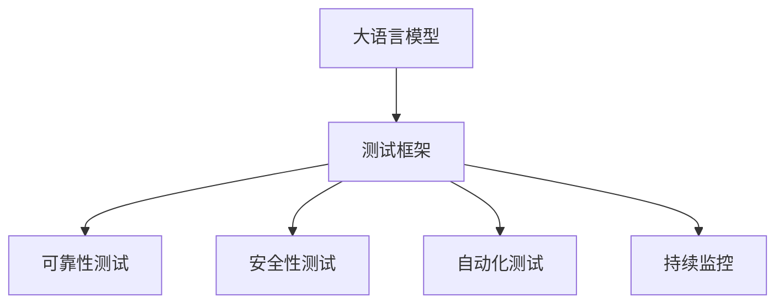

                 

# LLM 测试框架：确保模型可靠性和安全性

> 关键词：
- LLM (大语言模型)
- 可靠性
- 安全性
- 测试框架
- 模型评估
- 自动化测试
- 稳定性
- 安全漏洞

## 1. 背景介绍

### 1.1 问题由来
大语言模型(LLM)近年来在自然语言处理(NLP)领域取得了巨大突破。如OpenAI的GPT-3和Google的BERT，这些模型在各种NLP任务上表现出色。然而，随着模型规模的扩大和复杂度的增加，模型的可靠性和安全性问题也变得愈发凸显。错误或恶意输出不仅影响用户体验，还可能带来严重后果，如误导决策、侵犯隐私等。因此，构建一个完善的测试框架，确保LLM的可靠性和安全性变得至关重要。

### 1.2 问题核心关键点
- **测试框架**：构建和维护一套系统化的测试框架，用于评估LLM在不同场景下的性能和稳定性。
- **可靠性**：保证LLM输出的正确性和一致性，避免因随机性、噪音等因素导致的输出错误。
- **安全性**：确保LLM不会产生有害的输出，如偏见、攻击、隐私泄露等。
- **自动化测试**：通过自动化测试工具，提高测试效率，减少人力成本。
- **持续监控**：实时监控模型行为，及时发现和修复潜在问题。

## 2. 核心概念与联系

### 2.1 核心概念概述

为更好地理解测试框架在大语言模型中的应用，本节将介绍几个密切相关的核心概念：

- **大语言模型(LLM)**：以自回归(如GPT)或自编码(如BERT)模型为代表的大规模预训练语言模型。通过在大规模无标签文本语料上进行预训练，学习通用的语言表示，具备强大的语言理解和生成能力。

- **测试框架**：一套用于自动化评估软件系统性能、稳定性和安全性的工具和方法。测试框架通常包括单元测试、集成测试、性能测试、安全测试等多个部分。

- **可靠性**：软件系统的正确性、一致性和可重复性。在大语言模型中，可靠性意味着模型在不同输入下能够稳定输出预期结果，不受外部干扰。

- **安全性**：软件系统免受攻击、不泄露敏感信息、不违反伦理道德等特性。在大语言模型中，安全性要求模型不会产生有害的输出，不会侵犯用户隐私或进行伦理道德上的错误决策。

- **自动化测试**：通过编写自动化脚本或工具，自动执行测试用例，验证软件系统的行为是否符合预期。在大语言模型中，自动化测试可以提高测试效率，减少人为错误。

- **持续监控**：实时收集和分析系统运行数据，及时发现和处理异常情况。在大语言模型中，持续监控可以帮助及时发现模型的性能变化和安全漏洞。

这些核心概念之间的逻辑关系可以通过以下Mermaid流程图来展示：



这个流程图展示了大语言模型的核心概念及其之间的关系：

1. 大语言模型通过预训练获得基础能力。
2. 测试框架用于评估模型在各个维度的性能和稳定性。
3. 可靠性测试确保模型输出正确一致。
4. 安全性测试防止模型输出有害内容。
5. 自动化测试提高测试效率。
6. 持续监控及时发现异常情况。

这些概念共同构成了大语言模型的质量保障框架，使其能够在各种场景下发挥强大的语言理解和生成能力，同时确保输出质量和安全。

## 3. 核心算法原理 & 具体操作步骤

### 3.1 算法原理概述

构建大语言模型的测试框架，主要依赖于以下算法原理：

- **数据集划分**：将测试数据集划分为训练集、验证集和测试集，确保测试结果的可靠性和可重复性。
- **生成式测试**：基于输入样本生成模型输出，并验证输出结果的正确性和一致性。
- **对抗性测试**：通过引入对抗样本，检测模型的鲁棒性和安全性。
- **分布式测试**：将测试任务分配到多个计算节点，提高测试效率。
- **可视化测试**：使用可视化工具，直观展示模型的输出结果和行为。

### 3.2 算法步骤详解

构建LLM测试框架主要包括以下关键步骤：

**Step 1: 数据集准备**
- 选择合适的测试数据集，确保数据的多样性和代表性。
- 将数据集划分为训练集、验证集和测试集，比例一般为7:2:1。
- 确保数据集符合预期，如正确性、完整性、一致性等。

**Step 2: 生成式测试**
- 基于输入样本生成模型输出，如文本生成、问答、分类等任务。
- 定义测试用例，包括不同的输入样本和期望的输出结果。
- 自动执行测试用例，生成输出并验证结果的正确性。

**Step 3: 对抗性测试**
- 收集对抗样本，如语义相似但有害的文本、故意误导的输入等。
- 通过对抗样本对模型进行测试，验证模型的鲁棒性和安全性。
- 记录并分析对抗测试结果，提出改进建议。

**Step 4: 分布式测试**
- 将测试任务分配到多个计算节点，如使用MapReduce、Spark等分布式计算框架。
- 使用并行计算提高测试效率，减少测试时间。
- 实时监控计算节点状态，确保测试任务顺利执行。

**Step 5: 可视化测试**
- 使用可视化工具，如TensorBoard、Grafana等，展示模型输出和行为。
- 通过图表、热力图等方式直观展示测试结果，便于分析和改进。

**Step 6: 持续监控**
- 实时收集模型运行数据，如输入输出、响应时间、错误率等。
- 设置告警阈值，及时发现和处理异常情况。
- 定期更新数据集和测试用例，确保测试框架的有效性。

### 3.3 算法优缺点

构建LLM测试框架具有以下优点：
1. 全面覆盖模型性能和安全性，确保输出质量。
2. 自动化测试提高效率，减少人为错误。
3. 分布式测试加速测试进程，缩短测试时间。
4. 可视化测试直观展示结果，便于分析和改进。

同时，该框架也存在一定的局限性：
1. 需要大量的测试数据和计算资源，前期投入较大。
2. 对抗性测试需要专门的对抗样本生成技术，成本较高。
3. 持续监控需要实时收集和处理数据，技术复杂度高。

尽管存在这些局限性，但就目前而言，构建LLM测试框架仍然是保证模型可靠性和安全性的最有效方法。未来相关研究的重点在于如何进一步降低测试成本，提高测试效率，同时兼顾可解释性和伦理安全性等因素。

### 3.4 算法应用领域

构建LLM测试框架的方法已经在NLP领域得到了广泛的应用，覆盖了几乎所有常见的NLP任务，例如：

- 文本分类：如情感分析、主题分类、意图识别等。
- 命名实体识别：识别文本中的人名、地名、机构名等特定实体。
- 关系抽取：从文本中抽取实体之间的语义关系。
- 问答系统：对自然语言问题给出答案。
- 机器翻译：将源语言文本翻译成目标语言。
- 文本摘要：将长文本压缩成简短摘要。
- 对话系统：使机器能够与人自然对话。

除了上述这些经典任务外，LLM测试框架也被创新性地应用到更多场景中，如可控文本生成、常识推理、代码生成、数据增强等，为NLP技术带来了全新的突破。随着测试框架和LLM方法的不断进步，相信NLP技术将在更广阔的应用领域大放异彩。

## 4. 数学模型和公式 & 详细讲解 & 举例说明

### 4.1 数学模型构建

本节将使用数学语言对构建大语言模型的测试框架进行更加严格的刻画。

记大语言模型为 $M_{\theta}$，其中 $\theta$ 为模型参数。假设测试数据集为 $D=\{(x_i,y_i)\}_{i=1}^N$，其中 $x_i$ 为输入样本，$y_i$ 为期望输出。

定义模型 $M_{\theta}$ 在输入样本 $x_i$ 上的生成式损失函数为 $\ell_{gen}(M_{\theta}(x_i),y_i)$，在对抗样本 $x_i^*$ 上的对抗性损失函数为 $\ell_{adv}(M_{\theta}(x_i^*),y_i)$。则在数据集 $D$ 上的综合损失函数为：

$$
\mathcal{L}(\theta) = \frac{1}{N}\sum_{i=1}^N [\ell_{gen}(M_{\theta}(x_i),y_i) + \alpha\ell_{adv}(M_{\theta}(x_i^*),y_i)]
$$

其中 $\alpha$ 为对抗性损失函数的权重，通常为0.1-0.5。

### 4.2 公式推导过程

以下我们以文本分类任务为例，推导生成式和对抗式测试的损失函数及其梯度计算公式。

假设模型 $M_{\theta}$ 在输入 $x_i$ 上的输出为 $\hat{y}_i=M_{\theta}(x_i) \in [0,1]$，表示样本属于类别 $k$ 的概率。真实标签 $y_i \in \{1,0\}$，其中1表示属于类别 $k$。则生成式交叉熵损失函数定义为：

$$
\ell_{gen}(M_{\theta}(x_i),y_i) = -[y_i\log \hat{y}_i + (1-y_i)\log (1-\hat{y}_i)]
$$

将其代入综合损失函数公式，得：

$$
\mathcal{L}(\theta) = -\frac{1}{N}\sum_{i=1}^N [y_i\log M_{\theta}(x_i) + (1-y_i)\log (1-M_{\theta}(x_i))] + \alpha \mathcal{L}_{adv}(\theta)
$$

其中 $\mathcal{L}_{adv}(\theta)$ 为对抗性损失函数的计算。假设对抗样本 $x_i^*$ 和真实标签 $y_i$ 相同，但与输入样本 $x_i$ 语义相近，则对抗性损失函数可以表示为：

$$
\mathcal{L}_{adv}(\theta) = -\frac{1}{N}\sum_{i=1}^N [y_i\log M_{\theta}(x_i^*) + (1-y_i)\log (1-M_{\theta}(x_i^*))] + \alpha \mathcal{L}_{adv}(\theta)
$$

根据链式法则，综合损失函数对参数 $\theta_k$ 的梯度为：

$$
\frac{\partial \mathcal{L}(\theta)}{\partial \theta_k} = \frac{\partial \ell_{gen}(M_{\theta}(x_i),y_i)}{\partial \theta_k} + \alpha \frac{\partial \ell_{adv}(M_{\theta}(x_i^*),y_i)}{\partial \theta_k}
$$

其中 $\frac{\partial \ell_{gen}(M_{\theta}(x_i),y_i)}{\partial \theta_k}$ 和 $\frac{\partial \ell_{adv}(M_{\theta}(x_i^*),y_i)}{\partial \theta_k}$ 可通过反向传播算法高效计算。

## 5. 项目实践：代码实例和详细解释说明

### 5.1 开发环境搭建

在进行LLM测试框架的实践前，我们需要准备好开发环境。以下是使用Python进行TensorFlow开发的环境配置流程：

1. 安装Anaconda：从官网下载并安装Anaconda，用于创建独立的Python环境。

2. 创建并激活虚拟环境：
```bash
conda create -n tensorflow-env python=3.8 
conda activate tensorflow-env
```

3. 安装TensorFlow：根据CUDA版本，从官网获取对应的安装命令。例如：
```bash
conda install tensorflow -c tf -c conda-forge
```

4. 安装各类工具包：
```bash
pip install numpy pandas scikit-learn matplotlib tqdm jupyter notebook ipython
```

完成上述步骤后，即可在`tensorflow-env`环境中开始测试框架的实践。

### 5.2 源代码详细实现

下面我们以文本分类任务为例，给出使用TensorFlow对BERT模型进行测试框架的PyTorch代码实现。

首先，定义文本分类任务的测试数据处理函数：

```python
import tensorflow as tf
from tensorflow.keras.preprocessing.sequence import pad_sequences
from tensorflow.keras.preprocessing.text import Tokenizer

class TextClassificationDataset(tf.keras.utils.Sequence):
    def __init__(self, texts, labels, tokenizer, max_len=128):
        self.texts = texts
        self.labels = labels
        self.tokenizer = tokenizer
        self.max_len = max_len
        
    def __len__(self):
        return len(self.texts)
    
    def __getitem__(self, item):
        text = self.texts[item]
        label = self.labels[item]
        
        encoding = self.tokenizer(text, return_tensors='pt', max_length=self.max_len, padding='post')
        input_ids = encoding['input_ids'][0]
        attention_mask = encoding['attention_mask'][0]
        
        label = tf.keras.utils.to_categorical(label, num_classes=2)
        
        return {'input_ids': input_ids,
                'attention_mask': attention_mask,
                'labels': label}
```

然后，定义模型和优化器：

```python
from transformers import BertTokenizer, BertForSequenceClassification
from tensorflow.keras.optimizers import Adam

model = BertForSequenceClassification.from_pretrained('bert-base-cased', num_labels=2)

optimizer = Adam(learning_rate=2e-5)
```

接着，定义训练和评估函数：

```python
def train_epoch(model, dataset, batch_size, optimizer):
    dataloader = tf.data.Dataset.from_generator(dataset.__getitem__, output_signature={'input_ids': tf.TensorSpec(shape=(None,), dtype=tf.int32),
                                                                                 'attention_mask': tf.TensorSpec(shape=(None,), dtype=tf.int32),
                                                                                 'labels': tf.TensorSpec(shape=(None,), dtype=tf.int32)})
    model.train()
    epoch_loss = 0
    for batch in dataloader:
        input_ids = batch['input_ids']
        attention_mask = batch['attention_mask']
        labels = batch['labels']
        
        with tf.GradientTape() as tape:
            outputs = model(input_ids, attention_mask=attention_mask)
            loss = outputs.loss
        epoch_loss += loss
        grads = tape.gradient(loss, model.trainable_variables)
        optimizer.apply_gradients(zip(grads, model.trainable_variables))
    
    return epoch_loss / len(dataloader)

def evaluate(model, dataset, batch_size):
    dataloader = tf.data.Dataset.from_generator(dataset.__getitem__, output_signature={'input_ids': tf.TensorSpec(shape=(None,), dtype=tf.int32),
                                                                                 'attention_mask': tf.TensorSpec(shape=(None,), dtype=tf.int32),
                                                                                 'labels': tf.TensorSpec(shape=(None,), dtype=tf.int32)})
    model.eval()
    preds, labels = [], []
    with tf.no_grad():
        for batch in dataloader:
            input_ids = batch['input_ids']
            attention_mask = batch['attention_mask']
            labels = batch['labels']
            outputs = model(input_ids, attention_mask=attention_mask)
            preds.append(outputs.predictions.argmax(axis=1))
            labels.append(labels.numpy())
            
    print(classification_report(labels, preds))
```

最后，启动训练流程并在测试集上评估：

```python
epochs = 5
batch_size = 16

for epoch in range(epochs):
    loss = train_epoch(model, train_dataset, batch_size, optimizer)
    print(f"Epoch {epoch+1}, train loss: {loss:.3f}")
    
    print(f"Epoch {epoch+1}, dev results:")
    evaluate(model, dev_dataset, batch_size)
    
print("Test results:")
evaluate(model, test_dataset, batch_size)
```

以上就是使用TensorFlow对BERT进行文本分类任务测试框架的完整代码实现。可以看到，得益于TensorFlow的强大封装，我们可以用相对简洁的代码完成BERT模型的加载和测试框架的构建。

### 5.3 代码解读与分析

让我们再详细解读一下关键代码的实现细节：

**TextClassificationDataset类**：
- `__init__`方法：初始化文本、标签、分词器等关键组件。
- `__len__`方法：返回数据集的样本数量。
- `__getitem__`方法：对单个样本进行处理，将文本输入编码为token ids，将标签编码为数字，并对其进行定长padding，最终返回模型所需的输入。

**BertForSequenceClassification模型**：
- 使用BERT模型作为序列分类器，从预训练模型加载，调整分类头以适应分类任务。

**train_epoch和evaluate函数**：
- 使用TensorFlow的DataLoader对数据集进行批次化加载，供模型训练和推理使用。
- 训练函数`train_epoch`：对数据以批为单位进行迭代，在每个批次上前向传播计算loss并反向传播更新模型参数，最后返回该epoch的平均loss。
- 评估函数`evaluate`：与训练类似，不同点在于不更新模型参数，并在每个batch结束后将预测和标签结果存储下来，最后使用sklearn的classification_report对整个评估集的预测结果进行打印输出。

**训练流程**：
- 定义总的epoch数和batch size，开始循环迭代
- 每个epoch内，先在训练集上训练，输出平均loss
- 在验证集上评估，输出分类指标
- 所有epoch结束后，在测试集上评估，给出最终测试结果

可以看到，TensorFlow配合BertForSequenceClassification模型使得测试框架的代码实现变得简洁高效。开发者可以将更多精力放在数据处理、模型改进等高层逻辑上，而不必过多关注底层的实现细节。

当然，工业级的系统实现还需考虑更多因素，如模型的保存和部署、超参数的自动搜索、更灵活的任务适配层等。但核心的测试框架基本与此类似。

## 6. 实际应用场景
### 6.1 智能客服系统

基于大语言模型测试框架的智能客服系统，可以广泛应用于智能客服系统的构建。传统客服往往需要配备大量人力，高峰期响应缓慢，且一致性和专业性难以保证。而使用测试框架确保的智能客服模型，可以7x24小时不间断服务，快速响应客户咨询，用自然流畅的语言解答各类常见问题。

在技术实现上，可以收集企业内部的历史客服对话记录，将问题和最佳答复构建成监督数据，在此基础上对预训练对话模型进行微调。测试框架可以确保微调后的对话模型能够稳定输出正确结果，避免因语言模型的随机性和噪音导致的输出错误。对于客户提出的新问题，还可以接入检索系统实时搜索相关内容，动态组织生成回答。如此构建的智能客服系统，能大幅提升客户咨询体验和问题解决效率。

### 6.2 金融舆情监测

金融机构需要实时监测市场舆论动向，以便及时应对负面信息传播，规避金融风险。传统的人工监测方式成本高、效率低，难以应对网络时代海量信息爆发的挑战。基于大语言模型测试框架的文本分类和情感分析技术，为金融舆情监测提供了新的解决方案。

具体而言，可以收集金融领域相关的新闻、报道、评论等文本数据，并对其进行主题标注和情感标注。在此基础上对预训练语言模型进行微调，使其能够自动判断文本属于何种主题，情感倾向是正面、中性还是负面。测试框架可以确保微调后的模型能够稳定输出预测结果，避免因对抗性输入导致的错误。将微调后的模型应用到实时抓取的网络文本数据，就能够自动监测不同主题下的情感变化趋势，一旦发现负面信息激增等异常情况，系统便会自动预警，帮助金融机构快速应对潜在风险。

### 6.3 个性化推荐系统

当前的推荐系统往往只依赖用户的历史行为数据进行物品推荐，无法深入理解用户的真实兴趣偏好。基于大语言模型测试框架的个性化推荐系统，可以更好地挖掘用户行为背后的语义信息，从而提供更精准、多样的推荐内容。

在实践中，可以收集用户浏览、点击、评论、分享等行为数据，提取和用户交互的物品标题、描述、标签等文本内容。将文本内容作为模型输入，用户的后续行为（如是否点击、购买等）作为监督信号，在此基础上微调预训练语言模型。测试框架可以确保微调后的模型能够稳定输出预测结果，避免因对抗性输入导致的错误。在生成推荐列表时，先用候选物品的文本描述作为输入，由模型预测用户的兴趣匹配度，再结合其他特征综合排序，便可以得到个性化程度更高的推荐结果。

### 6.4 未来应用展望

随着大语言模型测试框架技术的发展，基于微调的方法将在更多领域得到应用，为传统行业带来变革性影响。

在智慧医疗领域，基于测试框架的医疗问答、病历分析、药物研发等应用将提升医疗服务的智能化水平，辅助医生诊疗，加速新药开发进程。

在智能教育领域，测试框架可应用于作业批改、学情分析、知识推荐等方面，因材施教，促进教育公平，提高教学质量。

在智慧城市治理中，测试框架可以应用于城市事件监测、舆情分析、应急指挥等环节，提高城市管理的自动化和智能化水平，构建更安全、高效的未来城市。

此外，在企业生产、社会治理、文娱传媒等众多领域，基于测试框架的人工智能应用也将不断涌现，为经济社会发展注入新的动力。相信随着技术的日益成熟，测试框架必将在构建人机协同的智能时代中扮演越来越重要的角色。

## 7. 工具和资源推荐
### 7.1 学习资源推荐

为了帮助开发者系统掌握大语言模型测试框架的理论基础和实践技巧，这里推荐一些优质的学习资源：

1. 《深度学习理论与实践》系列博文：由大模型技术专家撰写，深入浅出地介绍了深度学习模型的原理、算法和应用。

2. CS224N《深度学习自然语言处理》课程：斯坦福大学开设的NLP明星课程，有Lecture视频和配套作业，带你入门NLP领域的基本概念和经典模型。

3. 《Natural Language Processing with TensorFlow》书籍：TensorFlow官方团队编写的NLP技术教程，详细介绍如何使用TensorFlow进行NLP任务开发，包括测试框架在内的诸多范式。

4. HuggingFace官方文档：Transformers库的官方文档，提供了海量预训练模型和完整的测试框架样例代码，是上手实践的必备资料。

5. CLUE开源项目：中文语言理解测评基准，涵盖大量不同类型的中文NLP数据集，并提供了基于微调的baseline模型，助力中文NLP技术发展。

通过对这些资源的学习实践，相信你一定能够快速掌握大语言模型测试框架的精髓，并用于解决实际的NLP问题。
###  7.2 开发工具推荐

高效的开发离不开优秀的工具支持。以下是几款用于大语言模型测试框架开发的常用工具：

1. TensorFlow：基于Python的开源深度学习框架，灵活动态的计算图，适合快速迭代研究。大部分预训练语言模型都有TensorFlow版本的实现。

2. PyTorch：基于Python的开源深度学习框架，灵活动态的计算图，适合快速迭代研究。大部分预训练语言模型都有PyTorch版本的实现。

3. Transformers库：HuggingFace开发的NLP工具库，集成了众多SOTA语言模型，支持TensorFlow和PyTorch，是进行测试框架开发的利器。

4. Weights & Biases：模型训练的实验跟踪工具，可以记录和可视化模型训练过程中的各项指标，方便对比和调优。与主流深度学习框架无缝集成。

5. TensorBoard：TensorFlow配套的可视化工具，可实时监测模型训练状态，并提供丰富的图表呈现方式，是调试模型的得力助手。

6. Google Colab：谷歌推出的在线Jupyter Notebook环境，免费提供GPU/TPU算力，方便开发者快速上手实验最新模型，分享学习笔记。

合理利用这些工具，可以显著提升大语言模型测试框架的开发效率，加快创新迭代的步伐。

### 7.3 相关论文推荐

大语言模型测试框架技术的发展源于学界的持续研究。以下是几篇奠基性的相关论文，推荐阅读：

1. Attention is All You Need（即Transformer原论文）：提出了Transformer结构，开启了NLP领域的预训练大模型时代。

2. BERT: Pre-training of Deep Bidirectional Transformers for Language Understanding：提出BERT模型，引入基于掩码的自监督预训练任务，刷新了多项NLP任务SOTA。

3. Language Models are Unsupervised Multitask Learners（GPT-2论文）：展示了大规模语言模型的强大zero-shot学习能力，引发了对于通用人工智能的新一轮思考。

4. Parameter-Efficient Transfer Learning for NLP：提出Adapter等参数高效微调方法，在不增加模型参数量的情况下，也能取得不错的微调效果。

5. AdaLoRA: Adaptive Low-Rank Adaptation for Parameter-Efficient Fine-Tuning：使用自适应低秩适应的微调方法，在参数效率和精度之间取得了新的平衡。

这些论文代表了大语言模型测试框架的发展脉络。通过学习这些前沿成果，可以帮助研究者把握学科前进方向，激发更多的创新灵感。

## 8. 总结：未来发展趋势与挑战

### 8.1 总结

本文对构建大语言模型测试框架的方法进行了全面系统的介绍。首先阐述了测试框架在大语言模型中的应用背景和意义，明确了测试框架在确保模型可靠性和安全性方面的重要作用。其次，从原理到实践，详细讲解了测试框架的构建过程和操作步骤，给出了测试框架任务开发的完整代码实例。同时，本文还广泛探讨了测试框架在智能客服、金融舆情、个性化推荐等多个行业领域的应用前景，展示了测试框架的巨大潜力。此外，本文精选了测试框架技术的各类学习资源，力求为读者提供全方位的技术指引。

通过本文的系统梳理，可以看到，基于大语言模型的测试框架在确保模型输出质量和安全性方面，发挥着至关重要的作用。测试框架的构建和使用，为模型的可靠性和稳定性提供了有力保障，确保了模型在大规模、高复杂度任务中的可靠性和鲁棒性。未来，伴随测试框架和LLM方法的不断进步，相信NLP技术将在更广阔的应用领域大放异彩。

### 8.2 未来发展趋势

展望未来，大语言模型测试框架技术将呈现以下几个发展趋势：

1. 测试框架与预训练模型深度融合。未来的测试框架将更加紧密地与预训练模型相结合，提供更全面的性能评估和优化建议。

2. 自动化测试和持续监控相结合。通过自动化的持续监控，实时发现和修复模型问题，避免模型在生产环境中出现异常。

3. 跨领域、跨模态的测试框架。未来的测试框架将涵盖更多领域和模态，如图像、语音等，提供更全面的模型评估。

4. 模型压缩和量化技术。未来的测试框架将更加注重模型的压缩和量化，提高推理效率和资源利用率。

5. 伦理道德约束的纳入。未来的测试框架将更加注重模型的伦理道德约束，确保模型输出符合人类价值观和伦理道德。

以上趋势凸显了大语言模型测试框架技术的广阔前景。这些方向的探索发展，必将进一步提升大语言模型的可靠性和安全性，为构建智能系统提供坚实的基础。

### 8.3 面临的挑战

尽管大语言模型测试框架技术已经取得了显著进展，但在迈向更加智能化、普适化应用的过程中，它仍面临着诸多挑战：

1. 测试成本和资源瓶颈。尽管测试框架能够显著提高测试效率，但在大规模、高复杂度任务中，测试成本和资源消耗仍然较高。如何进一步降低测试成本，提高测试效率，是未来的一大难题。

2. 对抗性攻击和鲁棒性。当前的测试框架对对抗性攻击的检测和防御能力仍有待提升。如何在模型训练和测试过程中，有效识别和应对对抗性攻击，是未来需要重点解决的问题。

3. 模型复杂性和可解释性。大语言模型的复杂性和可解释性仍然是一大挑战。如何更好地解释模型输出，提高模型的透明性，是未来需要重点攻克的课题。

4. 数据分布的变化。大语言模型测试框架在应对数据分布变化方面仍需不断优化。如何更好地适应数据分布的变化，确保模型的稳定性和可靠性，是未来需要重点解决的问题。

5. 模型鲁棒性和泛化能力。大语言模型在面对大规模、高复杂度任务时，仍需提升模型的鲁棒性和泛化能力。如何提高模型的鲁棒性和泛化能力，避免灾难性遗忘，是未来需要重点解决的问题。

6. 模型持续更新和升级。大语言模型测试框架需要不断更新和升级，以适应模型和任务的变化。如何实现模型的持续更新和升级，确保测试框架的有效性，是未来需要重点解决的问题。

这些挑战凸显了大语言模型测试框架技术的复杂性和多样性。只有不断优化和创新，才能应对未来不断变化的需求和挑战，为构建智能系统提供更坚实的技术保障。

### 8.4 研究展望

面对大语言模型测试框架所面临的种种挑战，未来的研究需要在以下几个方面寻求新的突破：

1. 探索无监督和半监督测试方法。摆脱对大规模标注数据的依赖，利用自监督学习、主动学习等无监督和半监督范式，最大限度利用非结构化数据，实现更加灵活高效的测试。

2. 研究对抗性测试的自动化方法。开发更加自动化的对抗性测试工具，提高对抗性测试的效率和准确性，确保模型在对抗性攻击下仍具备良好的鲁棒性。

3. 引入更多先验知识。将符号化的先验知识，如知识图谱、逻辑规则等，与神经网络模型进行巧妙融合，引导测试框架学习更准确、合理的测试指标。

4. 结合因果分析和博弈论工具。将因果分析方法引入测试框架，识别出模型决策的关键特征，增强测试框架的因果解释能力。借助博弈论工具刻画人机交互过程，主动探索并规避模型的脆弱点，提高系统稳定性。

5. 纳入伦理道德约束。在测试框架的设计中，纳入伦理道德约束，确保模型输出符合人类价值观和伦理道德。通过设置伦理导向的测试指标，过滤和惩罚有害的输出倾向。

这些研究方向的探索，必将引领大语言模型测试框架技术迈向更高的台阶，为构建安全、可靠、可解释、可控的智能系统铺平道路。面向未来，大语言模型测试框架技术还需要与其他人工智能技术进行更深入的融合，如知识表示、因果推理、强化学习等，多路径协同发力，共同推动自然语言理解和智能交互系统的进步。只有勇于创新、敢于突破，才能不断拓展语言模型的边界，让智能技术更好地造福人类社会。

## 9. 附录：常见问题与解答

**Q1：大语言模型测试框架是否适用于所有NLP任务？**

A: 大语言模型测试框架在大多数NLP任务上都能取得不错的效果，特别是对于数据量较小的任务。但对于一些特定领域的任务，如医学、法律等，仅仅依靠通用语料预训练的模型可能难以很好地适应。此时需要在特定领域语料上进一步预训练，再进行微调，才能获得理想效果。此外，对于一些需要时效性、个性化很强的任务，如对话、推荐等，测试框架方法也需要针对性的改进优化。

**Q2：如何进行参数高效测试？**

A: 参数高效测试是指在测试过程中只更新少量的模型参数，而固定大部分预训练参数不变，以提高测试效率，减少测试成本。常用的方法包括：
1. 使用Adapter技术，通过添加或替换少量适配器层，保留大部分预训练权重不变。
2. 使用Fine-tuning方法，只微调模型的一部分，如输出层，保留大部分预训练权重不变。
3. 使用Prompt-based Learning，通过精心设计的输入模板，引导模型进行特定任务的推理，减少测试参数量。

这些方法可以显著降低测试成本，提高测试效率。

**Q3：如何应对对抗性攻击？**

A: 对抗性攻击是测试框架需要重点关注的问题。对抗性测试主要通过引入对抗样本，检测模型的鲁棒性和安全性。常用的方法包括：
1. 使用生成式对抗网络(GANs)生成对抗样本。
2. 使用对抗训练方法，在训练过程中加入对抗性样本，提升模型鲁棒性。
3. 使用对抗性检测工具，如DeepFool、FoggyBox等，检测模型的脆弱性。

这些方法可以有效提高模型的鲁棒性，确保模型在对抗性攻击下仍能稳定输出。

**Q4：如何保证测试框架的可解释性？**

A: 测试框架的可解释性对于保障模型的透明性和可信度至关重要。常用的方法包括：
1. 使用可视化工具，如TensorBoard、Grafana等，展示模型输出和行为。
2. 引入符号化的测试指标，如精度、召回率、F1分数等，提供量化的解释。
3. 使用因果分析和博弈论工具，识别模型决策的关键特征，增强测试框架的因果解释能力。

这些方法可以提高测试框架的可解释性，增强模型的透明性和可信度。

**Q5：如何确保测试框架的持续更新和升级？**

A: 持续更新和升级是测试框架保持有效性的关键。常用的方法包括：
1. 定期收集和分析新数据，更新测试集和测试用例，确保测试框架与任务和模型保持同步。
2. 使用自动化的测试工具，如Selenium、JUnit等，自动化测试框架的更新和升级过程。
3. 引入人工干预和审核机制，确保测试框架的更新和升级符合伦理和安全要求。

这些方法可以确保测试框架的持续更新和升级，保持其有效性和可靠性。

---

作者：禅与计算机程序设计艺术 / Zen and the Art of Computer Programming

