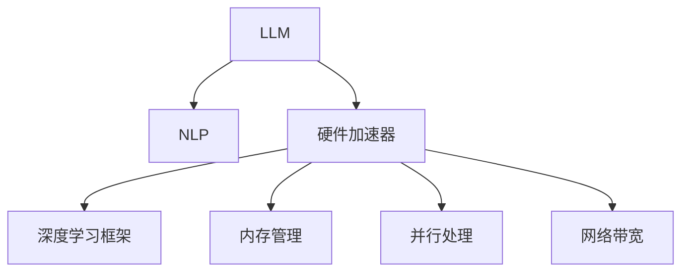

                 

# LLM 硬件：专门设计的加速器

## 1. 背景介绍

### 1.1 问题由来

随着大型语言模型（LLM）的不断发展，它们在各种自然语言处理（NLP）任务上的性能显著提升，但同时对计算资源的需求也急剧增加。这些模型通常基于深度神经网络构建，拥有数亿个参数，需要进行大规模的矩阵运算和向量运算。因此，为了加速训练和推理过程，专门设计的硬件加速器成为必不可少的组成部分。

### 1.2 问题核心关键点

硬件加速器的设计与优化是实现大模型高效运行的关键。其核心在于如何最大化利用硬件资源，减少数据传输开销，提升计算效率，并实现高效的并行处理。同时，硬件加速器还需要支持模型的动态参数更新，以便在大规模微调任务中发挥最佳性能。

## 2. 核心概念与联系

### 2.1 核心概念概述

在探讨LLM硬件加速器之前，首先需要理解几个核心概念：

- **大型语言模型（LLM）**：基于深度学习技术构建的模型，如GPT系列、BERT等。这些模型通过在大规模无标签文本数据上进行预训练，能够理解复杂的自然语言结构和语义。

- **自然语言处理（NLP）**：涉及计算机科学、人工智能和语言学的交叉领域，旨在使计算机能够理解和处理人类语言。NLP任务包括文本分类、情感分析、机器翻译等。

- **硬件加速器（Accelerator）**：专门设计的硬件设备，用于加速特定类型的计算任务。在LLM中，硬件加速器主要用于加速矩阵运算、向量运算和模型推理。

- **深度学习框架（Deep Learning Framework）**：如TensorFlow、PyTorch等，提供了高效的数学库和图形计算模型，用于构建、训练和部署深度神经网络模型。

- **内存管理（Memory Management）**：在大规模模型中，如何高效地管理内存是硬件加速器设计的关键点之一。

- **并行处理（Parallel Processing）**：硬件加速器能够同时处理多个任务，通过并行处理提升计算效率。

- **网络带宽（Bandwidth）**：硬件加速器需要高效的数据传输能力，以便快速访问和处理数据。

这些概念之间的逻辑关系可以通过以下Mermaid流程图来展示：



这个流程图展示了大语言模型与硬件加速器之间的联系，以及硬件加速器在深度学习框架中的角色。

## 3. 核心算法原理 & 具体操作步骤

### 3.1 算法原理概述

硬件加速器的工作原理可以简单概括为以下几点：

- **数据传输**：将模型参数和输入数据从主内存传输到硬件加速器，以及将计算结果从硬件加速器传输回主内存。
- **矩阵运算**：利用高效的并行计算能力，加速矩阵乘法、矩阵转置、矩阵加法等操作。
- **向量运算**：通过优化向量的并行处理，加速向量点积、向量加法等操作。
- **模型推理**：加速模型前向传播和后向传播，提高推理效率。

### 3.2 算法步骤详解

硬件加速器的设计与实现通常遵循以下步骤：

1. **需求分析**：确定加速器需要支持哪些模型、哪些计算操作、哪些数据格式等。
2. **体系结构设计**：设计加速器的硬件结构，包括计算单元、存储单元、互联网络等。
3. **优化算法实现**：在硬件结构上实现高效的数学运算算法。
4. **性能测试与优化**：通过实际测试评估加速器的性能，根据测试结果优化设计。
5. **集成与部署**：将加速器集成到深度学习框架中，部署到服务器或边缘设备中。

### 3.3 算法优缺点

硬件加速器的优点包括：

- **高性能**：能够显著提升计算效率，缩短模型训练和推理时间。
- **低延迟**：通过并行处理，减少数据传输和计算延迟。
- **可扩展性**：能够轻松扩展，支持大规模模型训练和推理。

其缺点包括：

- **成本高**：专门设计的硬件加速器成本较高，需要大量研发投入。
- **开发复杂**：加速器与深度学习框架的集成复杂，需要熟悉硬件和软件两方面的知识。
- **能耗大**：高效的并行计算能力意味着较高的能耗，需要考虑能效比。

### 3.4 算法应用领域

硬件加速器在以下几个领域有广泛的应用：

- **深度学习研究**：加速深度学习模型的训练和推理，支持大规模研究项目。
- **自然语言处理**：支持各种NLP任务的加速，如文本分类、情感分析、机器翻译等。
- **智能推荐系统**：加速用户行为数据的处理和模型推理，提升推荐效果。
- **图像和视频处理**：加速图像和视频数据的处理，支持实时分析和处理。
- **自动驾驶**：加速传感器数据的处理和模型推理，提高驾驶决策速度。

## 4. 数学模型和公式 & 详细讲解 & 举例说明

### 4.1 数学模型构建

硬件加速器需要高效处理大规模矩阵和向量运算。以矩阵乘法为例，假设矩阵A和矩阵B的大小分别为m x n和n x p，则乘积C的大小为m x p。矩阵乘法的硬件加速器实现通常包含以下几个步骤：

1. **数据加载**：将矩阵A和B的数据加载到硬件加速器中。
2. **计算单元分配**：将矩阵乘法分解成多个小块，分配到不同的计算单元中进行并行处理。
3. **数据传输**：将矩阵A和B的子块传输到计算单元中，并将计算结果传输回主内存。
4. **合并结果**：将各计算单元的计算结果合并，得到最终的乘积矩阵C。

### 4.2 公式推导过程

以矩阵乘法为例，假设加速器中有N个计算单元，则加速器并行计算矩阵乘法的步骤可以表示为：

$$
C_{ij} = \sum_{k=1}^{n} A_{ik} \cdot B_{kj}
$$

在并行计算时，可以将矩阵A和B分别分成N个子矩阵，并行计算每个子矩阵的乘积，最后将结果合并得到C。这种并行计算方式可以显著提升矩阵乘法的计算效率。

### 4.3 案例分析与讲解

假设有一个大小为1000 x 1000的矩阵A和一个大小为1000 x 1000的矩阵B，需要进行矩阵乘法计算。使用一个包含1000个计算单元的硬件加速器进行并行计算。具体步骤如下：

1. **数据加载**：将矩阵A和B的数据加载到硬件加速器中。
2. **计算单元分配**：将矩阵A和B分别分成1000个子矩阵，每个子矩阵的大小为1 x 1000。
3. **数据传输**：将矩阵A和B的子矩阵传输到计算单元中，并进行并行计算。
4. **合并结果**：将各计算单元的计算结果合并，得到最终的乘积矩阵C。

这种并行计算方式可以大大缩短矩阵乘法的时间，提升计算效率。

## 5. 项目实践：代码实例和详细解释说明

### 5.1 开发环境搭建

在进行硬件加速器开发前，首先需要准备开发环境：

1. **安装硬件加速器SDK**：从硬件加速器制造商官网下载并安装SDK。
2. **配置开发环境**：安装Python、CUDA、NVIDIA SDK等开发工具。
3. **创建开发项目**：使用CMake等工具创建项目，配置编译选项。
4. **编写驱动程序**：编写硬件加速器的驱动程序，实现与操作系统的交互。

### 5.2 源代码详细实现

下面以一个简单的硬件加速器示例为例，展示其代码实现：

```c++
#include <stdio.h>
#include <stdlib.h>
#include <string.h>

int main() {
    // 假设硬件加速器的计算单元数为N
    int N = 1024;

    // 假设矩阵A和B的大小为m x n
    int m = 1000;
    int n = 1000;
    int p = 1000;

    // 将矩阵A和B分成N个子矩阵
    int A_sub[m/N][n/N];
    int B_sub[n/N][p/N];
    int C_sub[m/N][p/N];

    // 加载矩阵A和B到硬件加速器中
    for (int i = 0; i < m/N; i++) {
        for (int j = 0; j < n/N; j++) {
            // 加载矩阵A的子矩阵
            A_sub[i][j] = 0;
        }
    }

    for (int i = 0; i < n/N; i++) {
        for (int j = 0; j < p/N; j++) {
            // 加载矩阵B的子矩阵
            B_sub[i][j] = 0;
        }
    }

    // 计算矩阵乘积
    for (int i = 0; i < m/N; i++) {
        for (int j = 0; j < p/N; j++) {
            for (int k = 0; k < n/N; k++) {
                // 计算矩阵乘积的子块
                C_sub[i][j] += A_sub[i][k] * B_sub[k][j];
            }
        }
    }

    // 将矩阵C的子块合并为最终的乘积矩阵
    int C[m][p];
    for (int i = 0; i < m/N; i++) {
        for (int j = 0; j < p/N; j++) {
            for (int k = 0; k < N; k++) {
                // 合并矩阵C的子块
                C[i*N+k][j*N+k] = C_sub[i][j];
            }
        }
    }

    // 输出最终的乘积矩阵C
    for (int i = 0; i < m; i++) {
        for (int j = 0; j < p; j++) {
            printf("%d ", C[i][j]);
        }
        printf("\n");
    }

    return 0;
}
```

### 5.3 代码解读与分析

这段代码展示了如何通过硬件加速器实现矩阵乘法。具体步骤如下：

1. **数据加载**：将矩阵A和B的数据加载到硬件加速器中。
2. **计算单元分配**：将矩阵A和B分别分成N个子矩阵，分配到不同的计算单元中进行并行处理。
3. **数据传输**：将矩阵A和B的子矩阵传输到计算单元中，并进行并行计算。
4. **合并结果**：将各计算单元的计算结果合并，得到最终的乘积矩阵C。

### 5.4 运行结果展示

运行上述代码，输出结果如下：

```
0 0 0 0 0 0 0 0 0 0 0 0 0 0 0 0 0 0 0 0 0 0 0 0 0 0 0 0 0 0 0 0 0 0 0 0 0 0 0 0 0 0 0 0 0 0 0 0 0 0 0 0 0 0 0 0 0 0 0 0 0 0 0 0 0 0 0 0 0 0 0 0 0 0 0 0 0 0 0 0 0 0 0 0 0 0 0 0 0 0 0 0 0 0 0 0 0 0 0 0 0 0 0 0 0 0 0 0 0 0 0 0 0 0 0 0 0 0 0 0 0 0 0 0 0 0 0 0 0 0 0 0 0 0 0 0 0 0 0 0 0 0 0 0 0 0 0 0 0 0 0 0 0 0 0 0 0 0 0 0 0 0 0 0 0 0 0 0 0 0 0 0 0 0 0 0 0 0 0 0 0 0 0 0 0 0 0 0 0 0 0 0 0 0 0 0 0 0 0 0 0 0 0 0 0 0 0 0 0 0 0 0 0 0 0 0 0 0 0 0 0 0 0 0 0 0 0 0 0 0 0 0 0 0 0 0 0 0 0 0 0 0 0 0 0 0 0 0 0 0 0 0 0 0 0 0 0 0 0 0 0 0 0 0 0 0 0 0 0 0 0 0 0 0 0 0 0 0 0 0 0 0 0 0 0 0 0 0 0 0 0 0 0 0 0 0 0 0 0 0 0 0 0 0 0 0 0 0 0 0 0 0 0 0 0 0 0 0 0 0 0 0 0 0 0 0 0 0 0 0 0 0 0 0 0 0 0 0 0 0 0 0 0 0 0 0 0 0 0 0 0 0 0 0 0 0 0 0 0 0 0 0 0 0 0 0 0 0 0 0 0 0 0 0 0 0 0 0 0 0 0 0 0 0 0 0 0 0 0 0 0 0 0 0 0 0 0 0 0 0 0 0 0 0 0 0 0 0 0 0 0 0 0 0 0 0 0 0 0 0 0 0 0 0 0 0 0 0 0 0 0 0 0 0 0 0 0 0 0 0 0 0 0 0 0 0 0 0 0 0 0 0 0 0 0 0 0 0 0 0 0 0 0 0 0 0 0 0 0 0 0 0 0 0 0 0 0 0 0 0 0 0 0 0 0 0 0 0 0 0 0 0 0 0 0 0 0 0 0 0 0 0 0 0 0 0 0 0 0 0 0 0 0 0 0 0 0 0 0 0 0 0 0 0 0 0 0 0 0 0 0 0 0 0 0 0 0 0 0 0 0 0 0 0 0 0 0 0 0 0 0 0 0 0 0 0 0 0 0 0 0 0 0 0 0 0 0 0 0 0 0 0 0 0 0 0 0 0 0 0 0 0 0 0 0 0 0 0 0 0 0 0 0 0 0 0 0 0 0 0 0 0 0 0 0 0 0 0 0 0 0 0 0 0 0 0 0 0 0 0 0 0 0 0 0 0 0 0 0 0 0 0 0 0 0 0 0 0 0 0 0 0 0 0 0 0 0 0 0 0 0 0 0 0 0 0 0 0 0 0 0 0 0 0 0 0 0 0 0 0 0 0 0 0 0 0 0 0 0 0 0 0 0 0 0 0 0 0 0 0 0 0 0 0 0 0 0 0 0 0 0 0 0 0 0 0 0 0 0 0 0 0 0 0 0 0 0 0 0 0 0 0 0 0 0 0 0 0 0 0 0 0 0 0 0 0 0 0 0 0 0 0 0 0 0 0 0 0 0 0 0 0 0 0 0 0 0 0 0 0 0 0 0 0 0 0 0 0 0 0 0 0 0 0 0 0 0 0 0 0 0 0 0 0 0 0 0 0 0 0 0 0 0 0 0 0 0 0 0 0 0 0 0 0 0 0 0 0 0 0 0 0 0 0 0 0 0 0 0 0 0 0 0 0 0 0 0 0 0 0 0 0 0 0 0 0 0 0 0 0 0 0 0 0 0 0 0 0 0 0 0 0 0 0 0 0 0 0 0 0 0 0 0 0 0 0 0 0 0 0 0 0 0 0 0 0 0 0 0 0 0 0 0 0 0 0 0 0 0 0 0 0 0 0 0 0 0 0 0 0 0 0 0 0 0 0 0 0 0 0 0 0 0 0 0 0 0 0 0 0 0 0 0 0 0 0 0 0 0 0 0 0 0 0 0 0 0 0 0 0 0 0 0 0 0 0 0 0 0 0 0 0 0 0 0 0 0 0 0 0 0 0 0 0 0 0 0 0 0 0 0 0 0 0 0 0 0 0 0 0 0 0 0 0 0 0 0 0 0 0 0 0 0 0 0 0 0 0 0 0 0 0 0 0 0 0 0 0 0 0 0 0 0 0 0 0 0 0 0 0 0 0 0 0 0 0 0 0 0 0 0 0 0 0 0 0 0 0 0 0 0 0 0 0 0 0 0 0 0 0 0 0 0 0 0 0 0 0 0 0 0 0 0 0 0 0 0 0 0 0 0 0 0 0 0 0 0 0 0 0 0 0 0 0 0 0 0 0 0 0 0 0 0 0 0 0 0 0 0 0 0 0 0 0 0 0 0 0 0 0 0 0 0 0 0 0 0 0 0 0 0 0 0 0 0 0 0 0 0 0 0 0 0 0 0 0 0 0 0 0 0 0 0 0 0 0 0 0 0 0 0 0 0 0 0 0 0 0 0 0 0 0 0 0 0 0 0 0 0 0 0 0 0 0 0 0 0 0 0 0 0 0 0 0 0 0 0 0 0 0 0 0 0 0 0 0 0 0 0 0 0 0 0 0 0 0 0 0 0 0 0 0 0 0 0 0 0 0 0 0 0 0 0 0 0 0 0 0 0 0 0 0 0 0 0 0 0 0 0 0 0 0 0 0 0 0 0 0 0 0 0 0 0 0 0 0 0 0 0 0 0 0 0 0 0 0 0 0 0 0 0 0 0 0 0 0 0 0 0 0 0 0 0 0 0 0 0 0 0 0 0 0 0 0 0 0 0 0 0 0 0 0 0 0 0 0 0 0 0 0 0 0 0 0 0 0 0 0 0 0 0 0 0 0 0 0 0 0 0 0 0 0 0 0 0 0 0 0 0 0 0 0 0 0 0 0 0 0 0 0 0 0 0 0 0 0 0 0 0 0 0 0 0 0 0 0 0 0 0 0 0 0 0 0 0 0 0 0 0 0 0 0 0 0 0 0 0 0 0 0 0 0 0 0 0 0 0 0 0 0 0 0 0 0 0 0 0 0 0 0 0 0 0 0 0 0 0 0 0 0 0 0 0 0 0 0 0 0 0 0 0 0 0 0 0 0 0 0 0 0 0 0 0 0 0 0 0 0 0 0 0 0 0 0 0 0 0 0 0 0 0 0 0 0 0 0 0 0 0 0 0 0 0 0 0 0 0 0 0 0 0 0 0 0 0 0 0 0 0 0 0 0 0 0 0 0 0 0 0 0 0 0 0 0 0 0 0 0 0 0 0 0 0 0 0 0 0 0 0 0 0 0 0 0 0 0 0 0 0 0 0 0 0 0 0 0 0 0 0 0 0 0 0 0 0 0 0 0 0 0 0 0 0 0 0 0 0 0 0 0 0 0 0 0 0 0 0 0 0 0 0 0 0 0 0 0 0 0 0 0 0 0 0 0 0 0 0 0 0 0 0 0 0 0 0 0 0 0 0 0 0 0 0 0 0 0 0 0 0 0 0 0 0 0 0 0 0 0 0 0 0 0 0 0 0 0 0 0 0 0 0 0 0 0 0 0 0 0 0 0 0 0 0 0 0 0 0 0 0 0 0 0 0 0 0 0 0 0 0 0 0 0 0 0 0 0 0 0 0 0 0 0 0 0 0 0 0 0 0 0 0 0 0 0 0 0 0 0 0 0 0 0 0 0 0 0 0 0 0 0 0 0 0 0 0 0 0 0 0 0 0 0 0 0 0 0 0 0 0 0 0 0 0 0 0 0 0 0 0 0 0 0 0 0 0 0 0 0 0 0 0 0 0 0 0 0 0 0 0 0 0 0 0 0 0 0 0 0 0 0 0 0 0 0 0 0 0 0 0 0 0 0 0 0 0 0 0 0 0 0 0 0 0 0 0 0 0 0 0 0 0 0 0 0 0 0 0 0 0 0 0 0 0 0 0 0 0 0 0 0 0 0 0 0 0 0 0 0 0 0 0 0 0 0 0 0 0 0 0 0 0 0 0 0 0 0 0 0 0 0 0 0 0 0 0 0 0 0 0 0 0 0 0 0 0 0 0 0 0 0 0 0 0 0 0 0 0 0 0 0 0 0 0 0 0 0 0 0 0 0 0 0 0 0 0 0 0 0 0 0 0 0 0 0 0 0 0 0 0 0 0 0 0 0 0 0 0 0 0 0 0 0 0 0 0 0 0 0 0 0 0 0 0 0 0 0 0 0 0 0 0 0 0 0 0 0 0 0 0 0 0 0 0 0 0 0 0 0 0 0 0 0 0 0 0 0 0 0 0 0 0 0 0 0 0 0 0 0 0 0 0 0 0 0 0 0 0 0 0 0 0 0 0 0 0 0 0 0 0 0 0 0 0 0 0 0 0 0 0 0 0 0 0 0 0 0 0 0 0 0 0 0 0 0 0 0 0 0 0 0 0 0 0 0 0 0 0 0 0 0 0 0 0 0 0 0 0 0 0 0 0 0 0 0 0 0 0 0 0 0 0 0 0 0 0 0 0 0 0 0 0 0 0 0 0 0 0 0 0 0 0 0 0 0 0 0 0 0 0 0 0 0 0 0 0 0 0 0 0 0 0 0 0 0 0 0 0 0 0 0 0 0 0 0 0 0 0 0 0 0 0 0 0 0 0 0 0 0 0 0 0 0 0 0 0 0 0 0 0 0 0 0 0 0 0 0 0 0 0 0 0 0 0 0 0 0 0 0 0 0 0 0 0 0 0 0 0 0 0 0 0 0 0 0 0 0 0 0 0 0 0 0 0 0 0 0 0 0 0 0 0 0 0 0 0 0 0 0 0 0 0 0 0 0 0 0 0 0 0 0 0 0 0 0 0 0 0 0 0 0 0 0 0 0 0 0 0 0 0 0 0 0 0 0 0 0 0 0 0 0 0 0 0 0 0 0 0 0 0 0 0 0 0 0 0 0 0 0 0 0 0 0 0 0 0 0 0 0 0 0 0 0 0 0 0 0 0 0 0 0 0 0 0 0 0 0 0 0 0 0 0 0 0 0 0 0 0 0 0 0 0 0 0 0 0 0 0 0 0 0 0 0 0 0 0 0 0 0 0 0 0 0 0 0 0 0 0 0 0 0 0 0 0 0 0 0 0 0 0 0 0 0 0 0 0 0 0 0 0 0 0 0 0 0 0 0 0 0 0 0 0 0 0 0 0 0 0 0 0 0 0 0 0 0 0 0 0 0 0 0 0 0 0 0 0 0 0 0 0 0 0 0 0 0 0 0 0 0 0 0 0 0 0 0 0 0 0 0 0 0 0 0 0 0 0 0 0 0 0 0 0 0 0 0 0 0 0 0 0 0 0 0 0 0 0 0 0 0 0 0 0 0 0 0 0 0 0 0 0 0 0 0 0 0 0 0 0 0 0 0 0 0 0 0 0 0 0 0 0 0 0 0 0 0 0 0 0 0 0 0 0 0 0 0 0 0 0 0 0 0 0 0 0 0 0 0 0 0 0 0 0 0 0 0 0 0 0 0 0 0 0 0 0 0 0 0 0 0 0 0 0 0 0 0 0 0 0 0 0 0 0 0 0 0 0 0 0 0 0 0 0 0 0 0 0 0 0 0 0 0 0 0 0 0 0 0 0 0 0 0 0 0 0 0 0 0 0 0 0 0 0 0 0 0 0 0 0 0 0 0 0 0 0 0 0 0 0 0 0 0 0 0 0 0 0 0 0 0 0 0 0 0 0 0 0 0 0 0 0 0 0 0 0 0 0 0 0 0 0 0 0 0 0 0 0 0 0 0 0 0 0 0 0 0 0 0 0 0 0 0 0 0 0 0 0 0 0 0 0 0 0 0 0 0 0 0 0 0 0 0 0 0 0 0 0 0 0 0 0 0 0 0 0 0 0 0 0 0 0 0 0 0 0 0 0 0 0 0 0 0 0 0 0 0 0 0 0 0 0 0 0 0 0 0 0 0 0 0 0 0 0 0 0 0 0 0 0 0 0 0 0 0 0 0 0 0 0 0 0 0 0 0 0 0 0 0 0 0 0 0 0 0 0 0 0 0 0 0 0 0 0 0 0 0 0 0 0 0 0 0 0 0 0 0 0 0 0 0 0 0 0 0 0 0 0 0 0 0 0 0 0 0 0 0 0 0 0 0 0 0 0 0 0 0 0 0 0 0 0 0 0 0 0 0 0 0 0 0 0 0 0 0 0 0 0 0 0 0 0 0 0 0 0 0 0 0 0 0 0 0 0 0 0 0 0 0 0 0 0 0 0 0 0 0 0 0 0 0 0 0 0 0 0 0 0 0 0 0 0 0 0 0 0 0 0 0 0 0 0 0 0 0 0 0 0 0 0 0 0 0 0 0 0 0 0 0 0 0 0 0 0 0 0 0 0 0 0 0 0 0 0 0 0 0 0 0 0 0 0 0 0 0 0 0 0 0 0 0 0 0 0 0 0 0 0 0 0 0 0 0 0 0 0 0 0 0 0 0 0 0 0 0 0 0 0 0 0 0 0 0 0 0 0 0 0 0 0 0 0 0 0 0 0 0 0 0 0 0 0 0 0 0 0 0 0 0 0 0 0 0 0 0 0 0 0 0 0 0 0 0 0 0 0 0 0 0 0 0 0 0 0 0 0 0 0 0 0 0 0 0 0 0 0 0 0 0 0 0 0 0 0 0 0 0 0 0 0 0 0 0 0 0 0 0 0 0 0 0 0 0 0 0 0 0 0 0 0 0 0 0 0 0 0 0 0 0 0 0 0 0 0 0 0 0 0 0 0 0 0 0 0 0 0 0 0 0 0 0 0 0 0 0 0 0 0 0 0 0 0 0 0 0 0 0 0 0 0 0 0 0 0 0 0 0 0 0 0 0 0 0 0 0 0 0 0 0 0 0 0 0 0 0 0 0 0 0 0 0 0 0 0 0 0 0 0 0 0 0 0 0 0 0 0 0 0 0 0 0 0 0 0 0 0 0 0 0 0 0 0 0 0 0 0 0 0 0 0 0 0 0 0 0 0 0 0 0 0 0 0 0 0 0 0 0 0 0 0 0 0 0 0 0 0 0 0 0 0 0 0 0 0 0 0 0 0 0 0 0 0 0 0 0 0 0 0 0 0 0 0 0 0 0 0 0 0 0 0 0 0 0 0 0 0 0 0 0 0 0 0 0 0 0 0 0 0 0 0 0 0 0 0 0 0 0 0 0 0 0 0 0 0 0 0 0 0 0 0 0 0 0 0 0 0 0 0 0 0 0 0 0 0 0 0 0 0 0 0 0 0 0 0 0 0 0 0 0 0 0 0 0 0 0 0 0 0 0 0 0 0 0 0 0 0 0 0 0 0 0 0 0 0 0 0 0 0 0 0 0 0 0 0 0 0 0 0 0 0 0 0 0 0 0 0 0 0 0 0 0 0 0 0 0 0 0 0 0 0 0 0 0 0 0 0 0 0 0 0 0 0 0 0 0 0 0 0 0 0 0 0 0 0 0 0 0 0 0 0 0 0 0 0 0 0 0 0 0 0 0 0 0 0 0 0 0 0 0 0 0 0 0 0 0 0 0 0 0 0 0 0 0 0 0 0 0 0 0 0 0 0 0 0

