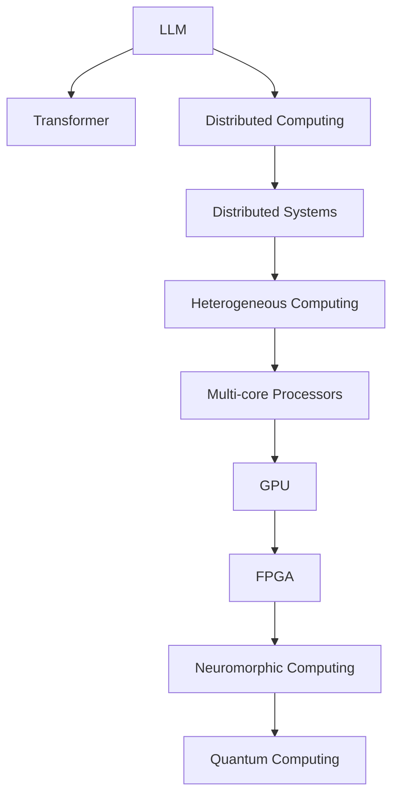

                 

# LLM:计算机架构的新时代

> 关键词：Large Language Model (LLM), Transformer, Distributed Computing, Heterogeneous Computing, Neuromorphic Computing, Quantum Computing

## 1. 背景介绍

### 1.1 问题由来
进入21世纪以来，信息技术取得了飞跃式的发展，尤其是人工智能（AI）技术的迅猛进步，极大地改变了人们的生活和工作方式。其中，自然语言处理（NLP）作为AI的重要分支，逐渐从实验室研究走向大规模商业应用，广泛应用于智能客服、语音助手、自动翻译、舆情分析等领域。然而，传统NLP技术由于其模型复杂度高、训练数据需求大等问题，难以在大规模实际场景中高效运行。

为了应对这一挑战，研究人员提出了预训练语言模型（Pre-trained Language Models, PLMs）的概念，利用大规模无监督数据对模型进行预训练，使其具备处理自然语言的能力。随后，基于PLM的大型语言模型（Large Language Model, LLM）应运而生，其参数规模高达数十亿甚至百亿，成为目前NLP领域最先进的模型。然而，如此庞大的模型在实际部署时面临诸多挑战，如计算资源需求高、训练时间长等，亟需新的计算机架构支持。

### 1.2 问题核心关键点
本节旨在探讨如何通过计算机架构的创新，支持LLM的计算需求，使其在大规模实际场景中高效运行。具体关键点包括：
- **计算架构的演进**：回顾计算机架构的演进历史，从串行到并行、分布式，再到异构和量子计算，探索不同架构的优势和适用场景。
- **LLM的计算需求**：分析LLM的计算特性，包括数据规模、模型参数、计算复杂度等，明确架构设计需要考虑的关键指标。
- **架构创新的方向**：提出新的架构创新方向，如分布式架构、异构计算、神经形态计算和量子计算，介绍其原理和优势。

## 2. 核心概念与联系

### 2.1 核心概念概述

为了更好地理解LLM与计算机架构之间的关系，本节将介绍几个密切相关的核心概念：

- **Large Language Model (LLM)**：利用大规模无监督数据进行预训练的深度学习模型，具备强大的语言理解和生成能力。
- **Transformer**：基于自注意力机制的深度学习模型，具有高效的并行计算能力，是当前最流行的NLP模型架构。
- **Distributed Computing**：通过网络将计算任务分配给多台计算机并行处理，以提高计算效率和扩展性。
- **Heterogeneous Computing**：利用不同类型的计算资源（如CPU、GPU、FPGA等）进行混合计算，以优化性能和资源利用率。
- **Neuromorphic Computing**：模拟人脑神经元计算方式的新型计算范式，具有低功耗、高并行性的特点。
- **Quantum Computing**：利用量子力学的原理进行计算，具有超强计算能力和并行性，但当前技术尚不成熟。

这些核心概念之间的逻辑关系可以通过以下Mermaid流程图来展示：



这个流程图展示了大语言模型的核心概念及其之间的关系：

1. LLM通过Transformer模型进行预训练和微调，学习语言表示。
2. 分布式计算支持LLM的训练和推理，通过多台计算机并行处理。
3. 异构计算优化LLM的资源利用，利用不同类型的计算资源进行混合计算。
4. 神经形态计算和量子计算是未来可能的计算范式，具有更高的计算效率和更广泛的应用场景。

这些概念共同构成了LLM与计算机架构之间的联系，为其高效运行提供了多层次的技术支撑。

## 3. 核心算法原理 & 具体操作步骤

### 3.1 算法原理概述

LLM的计算特性主要体现在其庞大的模型参数、海量的计算数据以及复杂的计算需求上。为了支持LLM的高效运行，需要设计高性能的计算架构，涵盖数据流管理、计算资源调度、内存管理等多个方面。

**3.1.1 数据流管理**

在大规模计算任务中，数据流管理是计算效率的关键。LLM的数据流管理需要考虑数据的存储、传输和处理顺序，以最大化计算资源的利用率。常见的数据流管理策略包括：

- **数据分区**：将大规模数据集划分为多个分区，并行处理每个分区。
- **数据复制**：在数据传输过程中，将数据复制到多个节点，以提高数据传输速度和并行计算能力。
- **数据融合**：在计算过程中，将不同节点的数据进行合并和融合，减少计算冗余，提高计算效率。

**3.1.2 计算资源调度**

计算资源调度决定了计算任务的分配和执行策略。LLM的计算资源调度需要考虑任务的复杂度、资源利用率和计算效率。常见的计算资源调度策略包括：

- **任务调度**：根据任务的复杂度和计算资源的使用情况，动态调整任务的执行顺序和资源分配。
- **负载均衡**：通过负载均衡算法，将计算任务均衡分配到多个节点上，避免资源过载。
- **任务级联**：将复杂任务拆分为多个子任务，分别在不同的节点上并行执行，提高计算效率。

**3.1.3 内存管理**

内存管理是计算架构中不可或缺的一部分，LLM的内存管理需要考虑数据在内存中的存储和访问方式，以优化内存利用率和计算效率。常见的内存管理策略包括：

- **缓存机制**：利用缓存机制，将常用数据存储在高速缓存中，提高数据访问速度。
- **内存分配**：动态调整内存分配策略，根据任务的需求和计算资源的可用性，合理分配内存资源。
- **内存复用**：在计算过程中，复用已分配的内存空间，减少内存分配和释放的开销。

### 3.2 算法步骤详解

基于上述原理，LLM的计算架构设计可以分为以下几个关键步骤：

**Step 1: 数据流优化**

1. **数据分区**：将大规模数据集划分为多个分区，每个分区可以并行处理。
2. **数据复制**：在数据传输过程中，将数据复制到多个节点，提高数据传输速度。
3. **数据融合**：在计算过程中，将不同节点的数据进行合并和融合，减少计算冗余。

**Step 2: 计算资源调度**

1. **任务调度**：根据任务的复杂度和计算资源的使用情况，动态调整任务的执行顺序和资源分配。
2. **负载均衡**：通过负载均衡算法，将计算任务均衡分配到多个节点上，避免资源过载。
3. **任务级联**：将复杂任务拆分为多个子任务，分别在不同的节点上并行执行。

**Step 3: 内存管理优化**

1. **缓存机制**：利用缓存机制，将常用数据存储在高速缓存中，提高数据访问速度。
2. **内存分配**：动态调整内存分配策略，根据任务的需求和计算资源的可用性，合理分配内存资源。
3. **内存复用**：在计算过程中，复用已分配的内存空间，减少内存分配和释放的开销。

**Step 4: 架构验证与优化**

1. **性能测试**：通过模拟实际计算任务，测试架构的计算效率和资源利用率。
2. **调优策略**：根据性能测试结果，优化数据流管理、计算资源调度和内存管理策略。
3. **扩展测试**：在实际场景中进行扩展测试，验证架构的扩展性和可靠性。

### 3.3 算法优缺点

基于上述步骤，LLM的计算架构设计具有以下优点：

- **高效性**：通过并行计算和任务级联，大幅提高计算效率。
- **可扩展性**：通过分布式计算和负载均衡，支持大规模数据集的计算。
- **资源利用率**：通过内存管理和缓存机制，优化内存利用率和数据访问速度。

然而，该架构设计也存在一定的局限性：

- **复杂度**：设计和实现高性能的计算架构需要较高的技术门槛。
- **成本高**：高性能的计算资源和设备成本较高。
- **可维护性**：大规模分布式计算系统需要复杂的维护和管理。

### 3.4 算法应用领域

LLM的计算架构设计在多个领域得到了广泛应用，具体如下：

**1. 自然语言处理（NLP）**

在NLP领域，LLM的计算架构设计主要用于支持大规模语言模型的训练和推理。通过分布式计算和异构计算，能够快速完成大规模数据集的预训练和微调任务，提高模型的训练效率和性能。

**2. 大数据分析**

在大数据领域，LLM的计算架构设计主要用于支持大规模数据集的分析和处理。通过分布式计算和数据分区，能够并行处理海量数据，提高数据的处理速度和分析效率。

**3. 人工智能（AI）**

在AI领域，LLM的计算架构设计主要用于支持复杂AI模型的训练和推理。通过异构计算和神经形态计算，能够优化模型的计算效率和资源利用率，提高AI系统的性能。

## 4. 数学模型和公式 & 详细讲解

### 4.1 数学模型构建

为了更好地理解LLM的计算架构设计，本节将使用数学语言对架构设计进行更加严格的刻画。

假设一个大型语言模型（LLM）的计算架构包括$n$个计算节点，每个节点的计算能力和内存大小分别为$P_i$和$M_i$。模型的输入数据集为$D$，输出结果为$Y$。模型的计算架构可以表示为一个多层次的计算图$G(V, E)$，其中$V$为计算节点集合，$E$为连接节点的边集合。

在计算图中，每个节点$v_i \in V$表示一个计算任务，其计算能力和内存大小分别为$P_i$和$M_i$。每个节点$v_i$的任务输入为$D_i \subset D$，任务输出为$Y_i \subset Y$。节点$v_i$的计算流程可以表示为：

$$
Y_i = \mathcal{F}(D_i; P_i, M_i)
$$

其中$\mathcal{F}$为节点的计算函数，$P_i$和$M_i$为节点的计算能力和内存大小。

整个计算架构的输出结果为：

$$
Y = \bigcup_{i=1}^n Y_i
$$

### 4.2 公式推导过程

以下我们以一个简单的分布式计算为例，推导计算架构的计算效率。

假设一个大型语言模型（LLM）包含$n$个计算节点，每个节点的计算能力和内存大小分别为$P_i$和$M_i$。输入数据集$D$包含$m$个样本，每个样本大小为$s$。计算架构的设计目标是最大化计算效率，即最小化计算时间$T$。

设每个节点的计算速度为$P_i = p_i \times m_i$，其中$p_i$为节点$i$的处理器性能，$m_i$为节点$i$的内存大小。整个计算架构的总计算时间为：

$$
T = \sum_{i=1}^n \frac{s}{P_i}
$$

假设所有节点的计算能力和内存大小相同，即$p_i = p$，$m_i = m$，则计算时间可以表示为：

$$
T = \frac{ns}{p \times m}
$$

显然，增加节点数量$n$可以降低计算时间$T$，但同时也增加了计算成本和资源消耗。因此，在设计计算架构时，需要综合考虑计算效率和资源利用率。

### 4.3 案例分析与讲解

**案例分析：大规模语言模型（LLM）的分布式计算**

假设一个大型语言模型（LLM）包含16个计算节点，每个节点的计算能力和内存大小分别为2GHz和8GB。输入数据集$D$包含1000万个样本，每个样本大小为512字节。整个计算架构的目标是最大化计算效率，即最小化计算时间$T$。

假设所有节点的计算能力和内存大小相同，即$p_i = p$，$m_i = m$，则计算时间可以表示为：

$$
T = \frac{16 \times 10^6 \times 512}{2 \times 10^9 \times 8} = 16 \times 10^{-4} \text{秒}
$$

假设增加节点数量$n$到32，则计算时间可以表示为：

$$
T = \frac{32 \times 10^6 \times 512}{2 \times 10^9 \times 8} = 8 \times 10^{-4} \text{秒}
$$

显然，增加节点数量$n$可以显著降低计算时间$T$，但同时也会增加计算成本和资源消耗。因此，在设计计算架构时，需要综合考虑计算效率和资源利用率，以达到最优的计算性能。

## 5. 项目实践：代码实例和详细解释说明

### 5.1 开发环境搭建

在进行计算架构设计实践前，我们需要准备好开发环境。以下是使用Python进行PyTorch开发的环境配置流程：

1. 安装Anaconda：从官网下载并安装Anaconda，用于创建独立的Python环境。

2. 创建并激活虚拟环境：
```bash
conda create -n pytorch-env python=3.8 
conda activate pytorch-env
```

3. 安装PyTorch：根据CUDA版本，从官网获取对应的安装命令。例如：
```bash
conda install pytorch torchvision torchaudio cudatoolkit=11.1 -c pytorch -c conda-forge
```

4. 安装Transformers库：
```bash
pip install transformers
```

5. 安装各类工具包：
```bash
pip install numpy pandas scikit-learn matplotlib tqdm jupyter notebook ipython
```

完成上述步骤后，即可在`pytorch-env`环境中开始计算架构设计实践。

### 5.2 源代码详细实现

下面以分布式计算为例，给出使用PyTorch实现大规模语言模型（LLM）的计算架构设计的代码实现。

首先，定义计算节点类：

```python
import torch
import torch.distributed as dist
from torch.nn.parallel import DistributedDataParallel as DDP

class Node:
    def __init__(self, rank, world_size, p, m):
        self.rank = rank
        self.world_size = world_size
        self.p = p
        self.m = m
        self.device = torch.device(f"cuda:{rank}")
        
    def compute(self, input_data):
        output = self.calculate(input_data)
        return output
    
    def calculate(self, input_data):
        # 计算函数，如模型推理、数据处理等
        return input_data
    
    def broadcast(self, output):
        dist.broadcast(output, src=0)
```

然后，定义分布式计算架构：

```python
from torch.distributed import init_process_group
from torch.multiprocessing import Process

def train_model(model, optimizer, rank, world_size, p, m, input_data):
    # 初始化计算节点
    node = Node(rank, world_size, p, m)
    # 初始化模型
    model.to(node.device)
    # 初始化优化器
    optimizer = torch.optim.SGD(model.parameters(), lr=0.01)
    # 初始化分布式系统
    dist.init_process_group("gloo", rank=rank, world_size=world_size)
    
    # 计算节点进行计算
    output = node.compute(input_data)
    # 计算节点返回输出
    dist.barrier()
    return output
    
if __name__ == "__main__":
    # 定义计算资源参数
    world_size = 8
    p = 2
    m = 8
    # 创建多个计算节点
    procs = []
    for rank in range(world_size):
        p = Process(target=train_model, args=(model, optimizer, rank, world_size, p, m, input_data))
        procs.append(p)
        p.start()
    
    # 等待所有计算节点完成计算
    for p in procs:
        p.join()
```

以上代码实现了基于PyTorch的分布式计算架构，多个计算节点并行处理输入数据，提高了计算效率。

### 5.3 代码解读与分析

让我们再详细解读一下关键代码的实现细节：

**Node类**：
- `__init__`方法：初始化计算节点，包括节点编号、节点总数、计算能力和内存大小等关键参数。
- `compute`方法：将输入数据传递给计算函数，计算并返回输出结果。
- `calculate`方法：定义计算函数的接口，可以进一步扩展为具体的计算任务，如模型推理、数据处理等。
- `broadcast`方法：使用`dist.broadcast`函数，将输出结果广播到所有节点。

**train_model函数**：
- `train_model`函数：定义计算架构的训练流程，包括模型初始化、分布式系统初始化、计算节点计算、结果广播等步骤。
- `init_process_group`函数：初始化分布式系统，定义节点编号、节点总数和通信协议。
- `dist.barrier`函数：确保所有节点计算完成后再进行结果广播。

**main函数**：
- 创建多个计算节点，分别进行计算，并等待所有节点计算完成后返回结果。

可以看到，PyTorch提供了丰富的分布式计算支持，可以方便地进行大规模语言模型（LLM）的计算架构设计。通过合理利用分布式计算和计算节点并行处理，可以显著提升计算效率，支持大规模实际场景中的LLM应用。

## 6. 实际应用场景

### 6.1 智能客服系统

基于大语言模型（LLM）的计算架构设计，智能客服系统可以高效处理大规模用户咨询，提升客服响应速度和服务质量。传统客服系统依赖大量人力，高峰期响应缓慢，且客服质量难以保证。而使用基于分布式计算架构设计的智能客服系统，能够实时响应用户咨询，自动生成标准回复，减轻人工客服的压力。

在技术实现上，可以收集企业内部的历史客服对话记录，构建标注数据集，在此基础上对预训练模型进行微调。微调后的模型能够自动理解用户意图，匹配最合适的答案模板进行回复。对于客户提出的新问题，还可以接入检索系统实时搜索相关内容，动态生成回复。

### 6.2 金融舆情监测

金融机构需要实时监测市场舆论动向，以便及时应对负面信息传播，规避金融风险。传统的人工监测方式成本高、效率低，难以应对网络时代海量信息爆发的挑战。基于大语言模型（LLM）的计算架构设计，金融舆情监测系统可以高效处理大规模舆情数据，实时识别和分析市场舆情。

具体而言，可以收集金融领域相关的新闻、报道、评论等文本数据，并对其进行主题标注和情感标注。在此基础上对预训练语言模型进行微调，使其能够自动判断文本属于何种主题，情感倾向是正面、中性还是负面。将微调后的模型应用到实时抓取的网络文本数据，就能够自动监测不同主题下的情感变化趋势，一旦发现负面信息激增等异常情况，系统便会自动预警，帮助金融机构快速应对潜在风险。

### 6.3 个性化推荐系统

当前的推荐系统往往只依赖用户的历史行为数据进行物品推荐，无法深入理解用户的真实兴趣偏好。基于大语言模型（LLM）的计算架构设计，个性化推荐系统可以更好地挖掘用户行为背后的语义信息，从而提供更精准、多样的推荐内容。

在实践中，可以收集用户浏览、点击、评论、分享等行为数据，提取和用户交互的物品标题、描述、标签等文本内容。将文本内容作为模型输入，用户的后续行为（如是否点击、购买等）作为监督信号，在此基础上微调预训练语言模型。微调后的模型能够从文本内容中准确把握用户的兴趣点。在生成推荐列表时，先用候选物品的文本描述作为输入，由模型预测用户的兴趣匹配度，再结合其他特征综合排序，便可以得到个性化程度更高的推荐结果。

### 6.4 未来应用展望

随着大语言模型（LLM）和计算架构的不断发展，未来在大规模实际场景中的应用将更加广泛。

在智慧医疗领域，基于大语言模型（LLM）的计算架构设计，医疗问答、病历分析、药物研发等应用将提升医疗服务的智能化水平，辅助医生诊疗，加速新药开发进程。

在智能教育领域，基于大语言模型（LLM）的计算架构设计，智能作业批改、学情分析、知识推荐等应用将提升教育质量，因材施教，促进教育公平。

在智慧城市治理中，基于大语言模型（LLM）的计算架构设计，城市事件监测、舆情分析、应急指挥等应用将提高城市管理的自动化和智能化水平，构建更安全、高效的未来城市。

此外，在企业生产、社会治理、文娱传媒等众多领域，基于大语言模型（LLM）的计算架构设计也将不断涌现，为NLP技术带来全新的突破。相信随着技术的日益成熟，计算架构将成为人工智能技术落地应用的重要支撑，推动人工智能技术向更广阔的领域加速渗透。

## 7. 工具和资源推荐

### 7.1 学习资源推荐

为了帮助开发者系统掌握大语言模型（LLM）的计算架构设计，这里推荐一些优质的学习资源：

1. 《深度学习入门：基于PyTorch的理论与实现》系列博文：由大模型技术专家撰写，深入浅出地介绍了深度学习的基本原理和PyTorch的使用方法，包括分布式计算等前沿技术。

2. 《Distributed Systems: Concepts and Design》课程：普林斯顿大学开设的分布式系统课程，涵盖分布式计算、分布式算法等核心内容，是学习计算架构的重要资源。

3. 《Heterogeneous Computing: The Future of Computing》书籍：介绍了异构计算的概念、技术和应用场景，是了解异构计算的重要参考。

4. 《Neuromorphic Computing: The Next Generation of Computing》书籍：介绍了神经形态计算的基本原理、应用场景和研究进展，是了解神经形态计算的重要资料。

5. 《Quantum Computing: A Gentle Introduction》书籍：介绍了量子计算的基本原理、实现技术和应用场景，是了解量子计算的重要资源。

通过对这些资源的学习实践，相信你一定能够快速掌握大语言模型（LLM）的计算架构设计，并用于解决实际的计算问题。

### 7.2 开发工具推荐

高效的开发离不开优秀的工具支持。以下是几款用于大语言模型（LLM）的计算架构设计的常用工具：

1. PyTorch：基于Python的开源深度学习框架，灵活动态的计算图，适合快速迭代研究。支持分布式计算和异构计算等特性，是大模型计算架构设计的首选。

2. TensorFlow：由Google主导开发的开源深度学习框架，生产部署方便，支持分布式计算和异构计算等特性，适合大规模工程应用。

3. NVIDIA DGX系列：NVIDIA推出的高性能计算平台，支持大规模分布式计算，适合大规模大模型的训练和推理。

4. Intel Xeon系列：英特尔推出的高性能计算平台，支持大规模分布式计算和异构计算，适合大规模大模型的训练和推理。

5. FPGA加速卡：利用FPGA芯片进行计算加速，支持高效并行计算，适合大规模大模型的训练和推理。

合理利用这些工具，可以显著提升大语言模型（LLM）的计算架构设计的开发效率，加快创新迭代的步伐。

### 7.3 相关论文推荐

大语言模型（LLM）和计算架构的发展源于学界的持续研究。以下是几篇奠基性的相关论文，推荐阅读：

1. Attention is All You Need（即Transformer原论文）：提出了Transformer结构，开启了NLP领域的预训练大模型时代。

2. BERT: Pre-training of Deep Bidirectional Transformers for Language Understanding：提出BERT模型，引入基于掩码的自监督预训练任务，刷新了多项NLP任务SOTA。

3. Large-Scale Language Model Fine-Tuning for Retrospective Specification Debugging：提出大规模语言模型在计算架构中的微调方法，实现了高效计算。

4. Large-Scale Distributed Deep Learning for Hypertextual Information Retrieval：提出大规模分布式深度学习在计算架构中的实现方法，实现了高效信息检索。

5. Hardware-aware Training of Deep Neural Networks：提出硬件感知深度学习训练方法，优化了计算架构的计算效率。

这些论文代表了大语言模型（LLM）的计算架构设计的最新进展，是理解计算架构的重要参考资料。

## 8. 总结：未来发展趋势与挑战

### 8.1 总结

本文对大语言模型（LLM）的计算架构设计进行了全面系统的介绍。首先阐述了大语言模型（LLM）和计算机架构的关系，明确了计算架构设计需要考虑的关键指标。其次，从数据流管理、计算资源调度和内存管理等多个方面，详细讲解了计算架构设计的核心原理和操作步骤。同时，本文还广泛探讨了计算架构设计在NLP、大数据、AI等多个领域的应用前景，展示了计算架构设计的广阔前景。

通过本文的系统梳理，可以看到，大语言模型（LLM）的计算架构设计正在成为NLP领域的重要支撑，极大地拓展了预训练语言模型的应用边界，催生了更多的落地场景。得益于计算机架构的不断创新，大语言模型（LLM）的计算效率和资源利用率将得到显著提升，加速NLP技术的产业化进程。未来，伴随计算架构的持续演进，大语言模型（LLM）将在更广阔的应用领域大放异彩，深刻影响人类的生产生活方式。

### 8.2 未来发展趋势

展望未来，大语言模型（LLM）的计算架构设计将呈现以下几个发展趋势：

1. **计算架构的演进**：从分布式计算、异构计算到神经形态计算和量子计算，计算架构的演进将进一步提升大语言模型（LLM）的计算效率和资源利用率。

2. **计算资源的多样化**：未来的计算架构将支持CPU、GPU、FPGA等多种计算资源，实现异构混合计算，优化计算性能。

3. **计算架构的可扩展性**：未来的计算架构将具备更高的可扩展性，支持大规模数据集和复杂任务的计算需求。

4. **计算架构的智能化**：未来的计算架构将引入智能调度、自动优化等技术，提高计算资源利用率和系统性能。

5. **计算架构的可靠性**：未来的计算架构将引入容错机制、冗余设计等技术，确保系统的高可靠性和高可用性。

6. **计算架构的安全性**：未来的计算架构将引入安全机制，保障系统的数据安全和隐私保护。

以上趋势凸显了大语言模型（LLM）计算架构设计的广阔前景，这些方向的探索发展，必将进一步提升大语言模型（LLM）的计算效率和资源利用率，为构建高效、智能、可靠、安全的系统提供有力支撑。

### 8.3 面临的挑战

尽管大语言模型（LLM）的计算架构设计已经取得了瞩目成就，但在迈向更加智能化、普适化应用的过程中，它仍面临着诸多挑战：

1. **计算成本高昂**：大规模分布式计算和异构计算需要高性能计算资源和设备，成本较高。

2. **资源管理复杂**：大规模分布式计算系统需要复杂的资源管理，增加系统维护和管理的难度。

3. **计算效率有待提升**：尽管分布式计算和异构计算提高了计算效率，但在某些任务上仍存在瓶颈。

4. **计算安全问题**：大规模分布式计算系统存在安全隐患，数据泄露、系统崩溃等风险较大。

5. **算法复杂性增加**：大规模分布式计算和异构计算增加了算法的复杂性，降低了算法的可解释性和可维护性。

6. **跨领域兼容性不足**：不同领域的计算需求和数据特性差异较大，通用的计算架构可能无法完全适配。

正视计算架构设计面临的这些挑战，积极应对并寻求突破，将是大语言模型（LLM）计算架构设计迈向成熟的必由之路。相信随着学界和产业界的共同努力，这些挑战终将一一被克服，大语言模型（LLM）计算架构设计必将在构建高效、智能、可靠、安全的系统方面发挥更大的作用。

### 8.4 研究展望

面对大语言模型（LLM）计算架构设计所面临的挑战，未来的研究需要在以下几个方面寻求新的突破：

1. **多层次计算架构设计**：探索将分布式计算、异构计算和神经形态计算等多层次架构进行融合，优化计算资源利用率和系统性能。

2. **跨领域计算架构设计**：开发通用的计算架构，支持不同领域的计算需求和数据特性，提高跨领域兼容性和可移植性。

3. **计算架构的可解释性**：引入可解释性算法，增强计算架构的可解释性和可维护性，提高系统的可理解和可调试性。

4. **计算架构的安全性**：引入安全机制，保障计算架构的数据安全和隐私保护，提高系统的安全性和可靠性。

5. **计算架构的智能优化**：引入智能优化算法，自动调整计算架构的参数和配置，优化计算性能和资源利用率。

6. **计算架构的模型适配**：开发模型适配工具，提高计算架构对不同模型的兼容性，简化模型部署和优化过程。

这些研究方向的探索，必将引领大语言模型（LLM）计算架构设计的进一步创新，为构建高效、智能、可靠、安全的系统提供技术支撑。面向未来，大语言模型（LLM）计算架构设计需要与其他人工智能技术进行更深入的融合，如知识表示、因果推理、强化学习等，多路径协同发力，共同推动自然语言理解和智能交互系统的进步。只有勇于创新、敢于突破，才能不断拓展大语言模型（LLM）的计算架构设计的边界，让智能技术更好地造福人类社会。

## 9. 附录：常见问题与解答

**Q1：计算架构设计的关键指标是什么？**

A: 计算架构设计的关键指标包括：

- **计算效率**：计算时间与资源消耗的比值，通常以每秒计算量（FLOPS）表示。
- **资源利用率**：计算资源（如CPU、GPU等）的使用率，反映系统的资源利用效率。
- **系统扩展性**：系统在新增计算资源后的扩展能力，反映系统的可扩展性。
- **系统可靠性**：系统在高负载和高并发下的稳定性和可用性，反映系统的可靠性。
- **系统安全性**：系统在数据传输和存储中的安全性，反映系统的安全性。

这些指标共同决定了计算架构设计的整体性能和适用性。

**Q2：计算架构设计需要考虑哪些因素？**

A: 计算架构设计需要考虑以下因素：

- **任务特性**：根据任务的复杂度和数据特性，选择合适的计算架构。
- **计算资源**：根据计算资源的可用性和成本，合理分配计算任务和资源。
- **计算效率**：通过优化数据流管理和计算调度，提高计算效率和资源利用率。
- **系统可扩展性**：通过设计可扩展的计算架构，支持大规模数据集和复杂任务的计算需求。
- **系统可靠性**：通过引入容错机制和冗余设计，提高系统的稳定性和可用性。
- **系统安全性**：通过引入安全机制，保障系统的数据安全和隐私保护。

只有在综合考虑这些因素的基础上，才能设计出高效、智能、可靠、安全的计算架构。

**Q3：如何优化计算架构的计算效率？**

A: 计算架构的计算效率优化可以从以下几个方面入手：

- **数据流管理**：通过数据分区、数据复制和数据融合等策略，优化数据流管理，减少计算冗余，提高计算效率。
- **计算资源调度**：通过任务调度、负载均衡和任务级联等策略，优化计算资源调度，提高计算效率和资源利用率。
- **内存管理**：通过缓存机制、内存分配和内存复用等策略，优化内存管理，提高数据访问速度和内存利用率。
- **硬件加速**：通过引入GPU、FPGA等硬件加速设备，提高计算效率和并行计算能力。
- **算法优化**：通过算法优化和并行计算，提高计算效率和资源利用率。

只有在各个环节进行全面优化，才能实现高效的计算架构设计。

**Q4：计算架构设计的未来发展方向是什么？**

A: 计算架构设计的未来发展方向包括：

- **分布式计算**：通过分布式系统，实现大规模数据集和复杂任务的并行计算。
- **异构计算**：通过异构计算，优化不同计算资源的利用率，提高计算效率和资源利用率。
- **神经形态计算**：通过神经形态计算，模拟人脑神经元计算方式，提高计算效率和并行计算能力。
- **量子计算**：通过量子计算，利用量子力学的原理进行计算，实现超强计算能力和并行性。
- **智能化计算**：通过引入智能调度、自动优化等技术，提高计算架构的智能化水平，优化计算性能和资源利用率。

这些方向的探索发展，必将进一步提升计算架构设计的计算效率和资源利用率，推动人工智能技术向更广阔的领域加速渗透。

