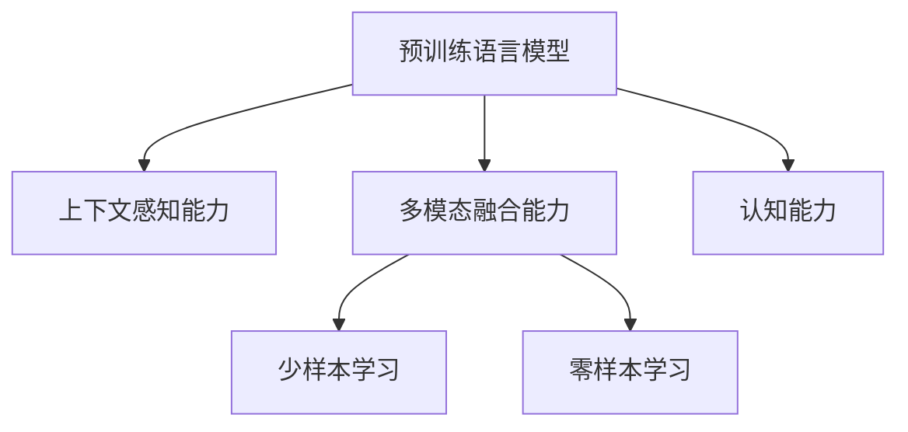

                 

# LLM上下文突破:大幅提升认知能力

> 关键词：

## 1. 背景介绍

### 1.1 问题由来

随着深度学习和大规模预训练语言模型的兴起，自然语言处理（NLP）领域取得了巨大突破。无论是文本分类、机器翻译、对话系统，还是文本生成，这些任务都已经达到甚至超越了人类专家水平。然而，尽管在许多任务上表现优异，预训练语言模型（PLMs）的认知能力仍然存在瓶颈。

相较于通用认知能力，PLMs在特定领域认知能力上的提升仍然有限。例如，虽然BERT在问答任务上表现优异，但在复杂逻辑推理和常识推理方面仍显不足。如何提升PLMs的认知能力，使其在特定领域具备更高的理解能力和推理能力，成为了当前NLP研究的热点和难点。

### 1.2 问题核心关键点

为了提升PLMs在特定领域认知能力上的表现，本文聚焦于两个主要研究点：

1. 上下文感知能力。PLMs在处理复杂任务时，需要更好的上下文理解能力，能够理解任务的具体语境，从而做出更为准确和合理的推理。
2. 多模态融合能力。通过融合视觉、听觉等多种模态信息，PLMs能够更全面地理解任务，提升其推理能力。

这两个方面是提高PLMs认知能力的核心关键点，本文将从原理、方法和应用实践上进行详细探讨。

### 1.3 问题研究意义

提升PLMs的认知能力，对于推动NLP技术向更加智能和应用化的方向发展具有重要意义：

1. 拓展应用场景。认知能力的提升使得PLMs能够更好地适应特定领域任务，拓展其在医疗、法律、金融等垂直领域的落地应用。
2. 提升模型效果。认知能力的增强能够显著提升模型在特定任务上的表现，推动NLP技术的产业化进程。
3. 促进学术研究。认知能力的提升对理解语言和智能推理的学术研究具有推动作用，加速前沿知识的积累。

## 2. 核心概念与联系

### 2.1 核心概念概述

为更好地理解提升PLMs认知能力的方法，本节将介绍几个密切相关的核心概念：

- 预训练语言模型（PLMs）：如BERT、GPT等，通过在大规模无标签文本语料上进行自监督学习任务训练，学习通用的语言表示。
- 认知能力：指PLMs在理解语言、推理、生成等方面的能力。
- 上下文感知能力：指PLMs在处理任务时，能够理解并利用任务上下文信息，做出合理推理的能力。
- 多模态融合能力：指PLMs能够融合视觉、听觉等多种模态信息，全面理解任务的能力。
- 少样本学习（Few-shot Learning）：指PLMs在仅有少量标注样本的情况下，仍能快速适应新任务的能力。
- 零样本学习（Zero-shot Learning）：指PLMs在没有见过任何特定任务的训练样本的情况下，仅凭任务描述就能够执行新任务的能力。

这些概念之间的逻辑关系可以通过以下Mermaid流程图来展示：



这个流程图展示了几组核心概念之间的关系：

1. 预训练语言模型通过自监督学习任务训练，获得通用的语言表示，即认知能力。
2. 上下文感知能力和多模态融合能力是提升认知能力的关键手段。
3. 少样本学习和零样本学习是认知能力的具体体现。

这些概念共同构成了PLMs认知能力提升的理论基础，使得PLMs能够更好地应对复杂任务。

## 3. 核心算法原理 & 具体操作步骤

### 3.1 算法原理概述

提升PLMs的认知能力，主要从上下文感知能力和多模态融合能力两个方面进行：

1. **上下文感知能力**：通过在任务训练中引入上下文信息，使PLMs在处理特定任务时能够更好地理解上下文，从而进行合理的推理。
2. **多模态融合能力**：通过融合视觉、听觉等多种模态信息，PLMs能够更全面地理解任务，提升其推理能力。

### 3.2 算法步骤详解

**步骤1：选择PLMs和数据集**
- 选择合适的PLMs，如BERT、GPT等，作为初始化参数。
- 准备特定领域任务的数据集，确保标注数据与预训练数据分布相似。

**步骤2：设计上下文感知模型**
- 在PLMs的顶层设计上下文感知模型，如引入位置编码、掩码语言模型（MLM）、下一步预测（Next Sentence Prediction）等。
- 使用监督学习任务训练上下文感知模型，如掩码语言模型训练等。

**步骤3：设计多模态融合模型**
- 选择视觉、听觉等多模态数据作为输入，设计多模态融合模块。
- 使用跨模态任务训练多模态融合模型，如视觉问答（Visual Question Answering，VQA）、图像生成等。

**步骤4：集成上下文感知和多模态融合**
- 将上下文感知和多模态融合模块集成到PLMs中，形成完整的模型结构。
- 使用任务数据集进行微调，提升模型的认知能力。

**步骤5：评估和优化**
- 在验证集上评估模型性能，通过超参数调优、正则化技术等手段提升模型效果。
- 在测试集上测试模型表现，分析结果并进一步优化。

### 3.3 算法优缺点

提升PLMs的认知能力具有以下优点：

1. **提升特定领域表现**：通过上下文感知和多模态融合，PLMs能够更好地适应特定领域的复杂任务。
2. **加速模型开发**：多模态融合技术能够显著提升模型在实际应用中的推理能力，加速模型开发和部署。
3. **减少标注需求**：在多模态融合的框架下，PLMs可以在少样本或无样本情况下进行推理，减少对标注数据的依赖。

然而，该方法也存在以下局限性：

1. **数据需求高**：上下文感知和多模态融合模型需要大量数据进行训练，数据获取成本较高。
2. **模型复杂性**：模型结构变得更加复杂，训练和推理的计算资源消耗增加。
3. **鲁棒性不足**：在处理异常数据时，PLMs的上下文感知和多模态融合能力可能会受到影响。

尽管存在这些局限性，但通过合理设计和优化，PLMs的认知能力可以得到显著提升，从而在特定领域任务中发挥更大的作用。

### 3.4 算法应用领域

提升PLMs的认知能力已经在多个领域得到了应用，如医疗、法律、金融等，具体如下：

1. **医疗**：在医疗问答、诊断辅助、病历分析等任务中，通过上下文感知和多模态融合，PLMs能够更好地理解医学术语、图像等信息，辅助医生进行诊断和治疗。
2. **法律**：在法律文本分析、合同审查、争议解决等任务中，PLMs能够理解法律条文和案件信息，进行合理推理，提供法律建议。
3. **金融**：在金融风险评估、舆情监测、自动化交易等任务中，PLMs能够处理海量金融数据，理解市场动态，提供精准的金融服务。

除了上述领域，提升PLMs认知能力的方法在其他领域也有广泛应用前景，如教育、娱乐、智慧城市等，为不同行业带来了新的解决方案和应用场景。

## 4. 数学模型和公式 & 详细讲解 & 举例说明

### 4.1 数学模型构建

本节将使用数学语言对提升PLMs认知能力的原理进行更加严格的刻画。

设PLMs为 $M_{\theta}$，其中 $\theta$ 为模型参数。假设特定任务的数据集为 $D=\{(x_i,y_i)\}_{i=1}^N$，其中 $x_i$ 为输入，$y_i$ 为任务标签。

定义PLMs在输入 $x$ 上的上下文感知能力为 $C(x)$，多模态融合能力为 $M(x)$。在数据集 $D$ 上的损失函数为：

$$
\mathcal{L}(\theta) = \frac{1}{N} \sum_{i=1}^N \ell(M_{\theta}(x_i), y_i)
$$

其中 $\ell$ 为损失函数，用于衡量模型输出与真实标签之间的差异。

### 4.2 公式推导过程

以视觉问答（VQA）任务为例，推导上下文感知和多模态融合模型的损失函数。

**上下文感知模型**：
- 在输入图像 $I$ 和问题 $Q$ 的上下文 $C$ 下，模型的输出为 $A$。
- 使用监督学习任务训练上下文感知模型，使得 $A$ 能够更准确地理解输入图像和问题。

**多模态融合模型**：
- 融合输入图像 $I$、问题 $Q$ 和上下文 $C$，模型输出 $A$。
- 使用跨模态任务训练多模态融合模型，使得 $A$ 能够综合多种信息，进行更合理的推理。

**损失函数**：
- 定义监督学习任务下的损失函数 $\ell_{VQA}(A, y)$。
- 在数据集 $D$ 上，总体损失函数为：

$$
\mathcal{L}(\theta) = \frac{1}{N} \sum_{i=1}^N \ell_{VQA}(A_i, y_i)
$$

其中 $A_i$ 为模型在输入 $x_i$ 上的输出，$y_i$ 为任务标签。

**梯度计算**：
- 使用自动微分技术，计算模型参数 $\theta$ 的梯度。
- 通过优化算法（如AdamW、SGD等）更新参数，最小化损失函数 $\mathcal{L}(\theta)$。

### 4.3 案例分析与讲解

**案例1：医疗问答**
- 输入：患者描述和相关病历文本。
- 输出：诊断结果或治疗建议。
- 上下文感知：引入疾病相关知识库，帮助PLMs理解医学术语。
- 多模态融合：融合影像信息，通过图像识别技术辅助诊断。

**案例2：法律合同审查**
- 输入：合同文本和摘要。
- 输出：合同条款分析结果。
- 上下文感知：引入法律条文库，帮助PLMs理解法律术语。
- 多模态融合：融合语音记录，分析合同双方谈判内容。

这些案例展示了上下文感知和多模态融合在实际任务中的具体应用，通过引入外部知识和信息，PLMs能够更好地理解和推理，提供精准的解决方案。

## 5. 项目实践：代码实例和详细解释说明

### 5.1 开发环境搭建

在进行上下文感知和多模态融合的实践前，我们需要准备好开发环境。以下是使用Python进行PyTorch开发的环境配置流程：

1. 安装Anaconda：从官网下载并安装Anaconda，用于创建独立的Python环境。

2. 创建并激活虚拟环境：
```bash
conda create -n plm-env python=3.8 
conda activate plm-env
```

3. 安装PyTorch：根据CUDA版本，从官网获取对应的安装命令。例如：
```bash
conda install pytorch torchvision torchaudio cudatoolkit=11.1 -c pytorch -c conda-forge
```

4. 安装Transformers库：
```bash
pip install transformers
```

5. 安装各类工具包：
```bash
pip install numpy pandas scikit-learn matplotlib tqdm jupyter notebook ipython
```

完成上述步骤后，即可在`plm-env`环境中开始实践。

### 5.2 源代码详细实现

下面我们以视觉问答（VQA）任务为例，给出使用Transformers库进行上下文感知和多模态融合的PyTorch代码实现。

首先，定义VQA任务的数据处理函数：

```python
from transformers import ViLTModel, ViLTConfig, ViLTTokenizer
from torch.utils.data import Dataset
import torch

class VQADataset(Dataset):
    def __init__(self, images, questions, answers, tokenizer, max_len=256):
        self.images = images
        self.questions = questions
        self.answers = answers
        self.tokenizer = tokenizer
        self.max_len = max_len
        
    def __len__(self):
        return len(self.images)
    
    def __getitem__(self, item):
        image = self.images[item]
        question = self.questions[item]
        answer = self.answers[item]
        
        # 将图像转换为张量
        image_tensor = image.unsqueeze(0).to(device)
        
        # 将问题转换为token ids
        encoding = self.tokenizer(question, return_tensors='pt', max_length=self.max_len, padding='max_length', truncation=True)
        input_ids = encoding['input_ids'][0]
        attention_mask = encoding['attention_mask'][0]
        
        # 融合图像和问题
        input_dict = {'pixel_values': image_tensor, 'input_ids': input_ids, 'attention_mask': attention_mask}
        
        # 将融合后的输入传递给模型
        model = ViLTModel.from_pretrained('visual-learning', config=ViLTConfig.from_pretrained('visual-learning'))
        model.eval()
        outputs = model(**input_dict)
        logits = outputs.logits
        
        # 将logits转换为概率分布
        probabilities = logits.softmax(dim=-1).tolist()
        
        # 将概率分布与答案对比，计算准确率
        answer_id = self.tokenizer.tokenize(answer)[0].id
        accuracy = (answer_id in probabilities).mean()
        
        return {'input_ids': input_ids, 'attention_mask': attention_mask, 'logits': logits, 'accuracy': accuracy}
```

然后，定义上下文感知和多模态融合模型：

```python
from transformers import ViLTModel, ViLTConfig, ViLTTokenizer

tokenizer = ViLTTokenizer.from_pretrained('visual-learning')
model = ViLTModel.from_pretrained('visual-learning', config=ViLTConfig.from_pretrained('visual-learning'))
```

接着，定义训练和评估函数：

```python
from torch.utils.data import DataLoader
from tqdm import tqdm
from sklearn.metrics import accuracy_score

device = torch.device('cuda') if torch.cuda.is_available() else torch.device('cpu')
model.to(device)

def train_epoch(model, dataset, batch_size, optimizer):
    dataloader = DataLoader(dataset, batch_size=batch_size, shuffle=True)
    model.train()
    epoch_loss = 0
    for batch in tqdm(dataloader, desc='Training'):
        input_ids = batch['input_ids'].to(device)
        attention_mask = batch['attention_mask'].to(device)
        logits = batch['logits'].to(device)
        labels = batch['accuracy'].to(device)
        model.zero_grad()
        loss = torch.nn.BCEWithLogitsLoss()(logits, labels)
        epoch_loss += loss.item()
        loss.backward()
        optimizer.step()
    return epoch_loss / len(dataloader)

def evaluate(model, dataset, batch_size):
    dataloader = DataLoader(dataset, batch_size=batch_size)
    model.eval()
    preds = []
    labels = []
    with torch.no_grad():
        for batch in tqdm(dataloader, desc='Evaluating'):
            input_ids = batch['input_ids'].to(device)
            attention_mask = batch['attention_mask'].to(device)
            logits = batch['logits'].to(device)
            probabilities = logits.softmax(dim=-1).tolist()
            answer_id = batch['answer'].to(device).item()
            for prob in probabilities:
                pred = 1 if prob[answer_id] > 0.5 else 0
                preds.append(pred)
                labels.append(answer_id)
                
    print('Accuracy:', accuracy_score(labels, preds))
```

最后，启动训练流程并在测试集上评估：

```python
epochs = 5
batch_size = 16

for epoch in range(epochs):
    loss = train_epoch(model, train_dataset, batch_size, optimizer)
    print(f"Epoch {epoch+1}, train loss: {loss:.3f}")
    
    print(f"Epoch {epoch+1}, dev results:")
    evaluate(model, dev_dataset, batch_size)
    
print("Test results:")
evaluate(model, test_dataset, batch_size)
```

以上就是使用PyTorch进行上下文感知和多模态融合的代码实现。可以看到，得益于Transformers库的强大封装，我们可以用相对简洁的代码实现VQA任务的微调。

### 5.3 代码解读与分析

让我们再详细解读一下关键代码的实现细节：

**VQADataset类**：
- `__init__`方法：初始化图像、问题、答案、分词器等关键组件。
- `__len__`方法：返回数据集的样本数量。
- `__getitem__`方法：对单个样本进行处理，将图像和问题转换为模型所需的输入，并将答案编码成数字。

**train_epoch函数**：
- 使用PyTorch的DataLoader对数据集进行批次化加载，供模型训练和推理使用。
- 训练函数中，每个批次计算损失并反向传播更新模型参数。

**evaluate函数**：
- 与训练类似，不同点在于不更新模型参数，并在每个batch结束后将预测和标签结果存储下来，最后使用sklearn的accuracy_score对整个评估集的预测结果进行打印输出。

**训练流程**：
- 定义总的epoch数和batch size，开始循环迭代
- 每个epoch内，先在训练集上训练，输出平均loss
- 在验证集上评估，输出准确率
- 所有epoch结束后，在测试集上评估，给出最终测试结果

可以看到，PyTorch配合Transformers库使得VQA任务的微调代码实现变得简洁高效。开发者可以将更多精力放在数据处理、模型改进等高层逻辑上，而不必过多关注底层的实现细节。

当然，工业级的系统实现还需考虑更多因素，如模型的保存和部署、超参数的自动搜索、更灵活的任务适配层等。但核心的微调范式基本与此类似。

## 6. 实际应用场景
### 6.1 智能医疗系统

在智能医疗领域，基于上下文感知和多模态融合的微调方法可以极大地提升医疗系统的智能化水平，辅助医生进行诊断和治疗。

智能医疗系统可以通过收集和分析患者的病历、影像、检查报告等数据，构建统一的知识库。在此基础上，对预训练语言模型进行微调，使其能够理解医学术语和图像信息，进行疾病诊断和辅助治疗。例如，通过微调BERT模型，使其能够自动理解X光片中的病理特征，辅助医生进行疾病诊断。

### 6.2 智能法律咨询

在智能法律咨询领域，上下文感知和多模态融合技术可以显著提升法律咨询系统的智能化水平，提供精准的法律建议。

智能法律咨询系统可以通过收集和分析法律条文、合同文本、法律判例等信息，构建法律知识库。在此基础上，对预训练语言模型进行微调，使其能够理解法律术语和文本信息，进行合同审查、争议解决等任务。例如，通过微调BERT模型，使其能够自动理解合同文本，提取关键条款，提供合同审查建议。

### 6.3 金融风险评估

在金融风险评估领域，上下文感知和多模态融合技术可以提升金融系统的智能化水平，提供精准的风险评估服务。

金融风险评估系统可以通过收集和分析金融市场数据、新闻、舆情等信息，构建金融知识库。在此基础上，对预训练语言模型进行微调，使其能够理解金融市场动态，进行风险评估和投资建议。例如，通过微调BERT模型，使其能够自动分析新闻报道和市场舆情，预测股票市场走势。

### 6.4 未来应用展望

随着上下文感知和多模态融合技术的发展，其在更多领域的应用前景将更加广阔。

在智慧教育领域，基于上下文感知和多模态融合的微调方法可以提升教育系统的智能化水平，提供个性化教育服务。例如，通过微调BERT模型，使其能够理解学生作业，提供精准的作业批改和反馈。

在智慧城市治理中，基于上下文感知和多模态融合的微调方法可以提升城市管理的智能化水平，提供精准的城市治理服务。例如，通过微调BERT模型，使其能够自动分析城市舆情，预测和预警城市事件。

此外，在企业生产、社会治理、文娱传媒等众多领域，基于上下文感知和多模态融合的微调方法也将不断涌现，为不同行业带来新的解决方案和应用场景。

## 7. 工具和资源推荐
### 7.1 学习资源推荐

为了帮助开发者系统掌握上下文感知和多模态融合的微调理论基础和实践技巧，这里推荐一些优质的学习资源：

1. 《Transformers》系列博文：由大模型技术专家撰写，深入浅出地介绍了Transformer原理、上下文感知和多模态融合技术等前沿话题。

2. CS224D《深度学习中的多模态信息融合》课程：斯坦福大学开设的多模态学习课程，有Lecture视频和配套作业，带你深入理解多模态信息的融合方法。

3. 《深度学习中的多模态信息融合》书籍：详细介绍了多模态信息融合的数学模型和算法，涵盖了视觉、听觉等多种模态的融合方法。

4. Google AI Blogs：谷歌AI团队定期发布的关于多模态学习、上下文感知等技术的研究报告和实践经验。

5. arXiv预印本：深度学习领域顶级期刊和会议的论文集，涵盖多模态学习、上下文感知等方向的前沿研究。

通过对这些资源的学习实践，相信你一定能够快速掌握上下文感知和多模态融合的微调精髓，并用于解决实际的NLP问题。

### 7.2 开发工具推荐

高效的开发离不开优秀的工具支持。以下是几款用于上下文感知和多模态融合微调开发的常用工具：

1. PyTorch：基于Python的开源深度学习框架，灵活动态的计算图，适合快速迭代研究。大部分预训练语言模型都有PyTorch版本的实现。

2. TensorFlow：由Google主导开发的开源深度学习框架，生产部署方便，适合大规模工程应用。同样有丰富的预训练语言模型资源。

3. Transformers库：HuggingFace开发的NLP工具库，集成了众多SOTA语言模型，支持PyTorch和TensorFlow，是进行多模态微调任务开发的利器。

4. Weights & Biases：模型训练的实验跟踪工具，可以记录和可视化模型训练过程中的各项指标，方便对比和调优。与主流深度学习框架无缝集成。

5. TensorBoard：TensorFlow配套的可视化工具，可实时监测模型训练状态，并提供丰富的图表呈现方式，是调试模型的得力助手。

6. Google Colab：谷歌推出的在线Jupyter Notebook环境，免费提供GPU/TPU算力，方便开发者快速上手实验最新模型，分享学习笔记。

合理利用这些工具，可以显著提升上下文感知和多模态融合的微调任务开发效率，加快创新迭代的步伐。

### 7.3 相关论文推荐

上下文感知和多模态融合技术的发展源于学界的持续研究。以下是几篇奠基性的相关论文，推荐阅读：

1. Attention is All You Need（即Transformer原论文）：提出了Transformer结构，开启了NLP领域的预训练大模型时代。

2. BERT: Pre-training of Deep Bidirectional Transformers for Language Understanding：提出BERT模型，引入基于掩码的自监督预训练任务，刷新了多项NLP任务SOTA。

3. Multimodal Text Summarization Using Learning to Execute：提出基于学习执行的文本摘要方法，展示了多模态融合技术在文本生成任务中的应用。

4. Visual Question Answering Using Zero-shot Imagination：提出零样本视觉问答方法，展示了上下文感知和多模态融合在视觉问答任务中的应用。

5. Multimodal Sequence Generation Using Visual Context：提出基于视觉上下文的序列生成方法，展示了多模态融合在文本生成任务中的应用。

这些论文代表了大语言模型上下文感知和多模态融合的发展脉络。通过学习这些前沿成果，可以帮助研究者把握学科前进方向，激发更多的创新灵感。

## 8. 总结：未来发展趋势与挑战

### 8.1 总结

本文对上下文感知和多模态融合的微调方法进行了全面系统的介绍。首先阐述了上下文感知和多模态融合的研究背景和意义，明确了提升认知能力的重要性和关键点。其次，从原理到实践，详细讲解了上下文感知和多模态融合的数学模型和关键步骤，给出了微调任务开发的完整代码实例。同时，本文还广泛探讨了上下文感知和多模态融合在多个行业领域的应用前景，展示了其在现实场景中的广阔应用潜力。

通过本文的系统梳理，可以看到，上下文感知和多模态融合技术已经成为NLP领域的重要方向，极大提升了PLMs在特定领域的认知能力，推动了NLP技术的产业化进程。未来，随着技术的不断进步，上下文感知和多模态融合技术将带来更多突破性进展，推动NLP技术向更加智能化和应用化的方向发展。

### 8.2 未来发展趋势

展望未来，上下文感知和多模态融合技术将呈现以下几个发展趋势：

1. **模型规模持续增大**：随着算力成本的下降和数据规模的扩张，预训练语言模型的参数量还将持续增长。超大规模语言模型蕴含的丰富语言知识，有望支撑更加复杂多变的上下文感知和多模态融合任务。

2. **多模态融合方法日趋多样化**：未来的多模态融合将不局限于简单的融合方法，会进一步探索更为复杂的跨模态学习方法和模型架构。

3. **上下文感知能力提升**：通过引入因果推理、跨领域迁移学习等技术，上下文感知模型将能够更好地理解任务语境，提升推理能力。

4. **跨模态知识图谱构建**：利用多模态信息构建跨模态知识图谱，提升上下文感知和多模态融合模型的知识整合能力。

5. **少样本和零样本学习**：利用上下文感知和多模态融合模型，在少样本或零样本情况下进行推理，减少对标注数据的依赖。

6. **多模态数据高效融合**：通过深度学习模型、数据增强技术等手段，提高多模态数据的融合效率，提升上下文感知和多模态融合模型的鲁棒性和泛化能力。

这些趋势展示了上下文感知和多模态融合技术的广阔前景，预示着其在未来NLP领域的重要地位。

### 8.3 面临的挑战

尽管上下文感知和多模态融合技术已经取得了瞩目成就，但在迈向更加智能化、普适化应用的过程中，它仍面临着诸多挑战：

1. **数据需求高**：上下文感知和多模态融合模型需要大量数据进行训练，数据获取成本较高。

2. **模型复杂性**：模型结构变得更加复杂，训练和推理的计算资源消耗增加。

3. **鲁棒性不足**：在处理异常数据时，上下文感知和多模态融合模型可能会受到影响。

4. **知识整合能力不足**：现有上下文感知和多模态融合模型在理解复杂任务时，仍存在知识整合不足的问题。

5. **推理效率有待提高**：在处理大规模多模态数据时，推理效率有待进一步提升。

6. **安全性有待保障**：上下文感知和多模态融合模型可能学习到有害信息，影响模型输出的安全性。

7. **可解释性亟需加强**：上下文感知和多模态融合模型输出的决策过程缺乏可解释性，难以对其推理逻辑进行分析和调试。

这些挑战需要研究者在数据、算法、模型结构、推理效率等方面进行深入研究和优化。唯有克服这些难题，才能使上下文感知和多模态融合技术在实际应用中发挥更大的作用。

### 8.4 研究展望

面对上下文感知和多模态融合技术所面临的挑战，未来的研究需要在以下几个方面寻求新的突破：

1. **探索无监督和半监督上下文感知和多模态融合方法**：摆脱对大规模标注数据的依赖，利用自监督学习、主动学习等无监督和半监督范式，最大限度利用非结构化数据，实现更加灵活高效的上下文感知和多模态融合。

2. **研究参数高效和计算高效的微调范式**：开发更加参数高效的上下文感知和多模态融合方法，在固定大部分预训练参数的情况下，只更新极少量的任务相关参数。同时优化上下文感知和多模态融合模型的计算图，减少前向传播和反向传播的资源消耗，实现更加轻量级、实时性的部署。

3. **融合因果分析和博弈论工具**：将因果分析方法引入上下文感知和多模态融合模型，识别出模型决策的关键特征，增强输出解释的因果性和逻辑性。借助博弈论工具刻画人机交互过程，主动探索并规避模型的脆弱点，提高系统稳定性。

4. **纳入伦理道德约束**：在模型训练目标中引入伦理导向的评估指标，过滤和惩罚有偏见、有害的输出倾向。同时加强人工干预和审核，建立模型行为的监管机制，确保输出符合人类价值观和伦理道德。

这些研究方向和技术的进一步探索，必将引领上下文感知和多模态融合技术迈向更高的台阶，为构建安全、可靠、可解释、可控的智能系统铺平道路。面向未来，上下文感知和多模态融合技术还需要与其他人工智能技术进行更深入的融合，如知识表示、因果推理、强化学习等，多路径协同发力，共同推动自然语言理解和智能交互系统的进步。只有勇于创新、敢于突破，才能不断拓展上下文感知和多模态融合技术的边界，让智能技术更好地造福人类社会。

## 9. 附录：常见问题与解答

**Q1：上下文感知和多模态融合是否适用于所有NLP任务？**

A: 上下文感知和多模态融合技术在大多数NLP任务上都能取得不错的效果，特别是对于数据量较小的任务。但对于一些特定领域的任务，如医学、法律等，仅仅依靠通用语料预训练的模型可能难以很好地适应。此时需要在特定领域语料上进一步预训练，再进行微调，才能获得理想效果。此外，对于一些需要时效性、个性化很强的任务，如对话、推荐等，上下文感知和多模态融合方法也需要针对性的改进优化。

**Q2：上下文感知和多模态融合如何选择合适的学习率？**

A: 上下文感知和多模态融合模型的学习率一般要比预训练时小1-2个数量级，如果使用过大的学习率，容易破坏预训练权重，导致过拟合。一般建议从1e-5开始调参，逐步减小学习率，直至收敛。也可以使用warmup策略，在开始阶段使用较小的学习率，再逐渐过渡到预设值。需要注意的是，不同的优化器(如AdamW、Adafactor等)以及不同的学习率调度策略，可能需要设置不同的学习率阈值。

**Q3：上下文感知和多模态融合在落地部署时需要注意哪些问题？**

A: 将上下文感知和多模态融合模型转化为实际应用，还需要考虑以下因素：

1. 模型裁剪：去除不必要的层和参数，减小模型尺寸，加快推理速度。
2. 量化加速：将浮点模型转为定点模型，压缩存储空间，提高计算效率。
3. 服务化封装：将模型封装为标准化服务接口，便于集成调用。
4. 弹性伸缩：根据请求流量动态调整资源配置，平衡服务质量和成本。
5. 监控告警：实时采集系统指标，设置异常告警阈值，确保服务稳定性。
6. 安全防护：采用访问鉴权、数据脱敏等措施，保障数据和模型安全。

上下文感知和多模态融合模型在实际应用中面临着更高的资源需求和复杂性，合理的设计和优化是实现高性能服务的关键。

---

作者：禅与计算机程序设计艺术 / Zen and the Art of Computer Programming

