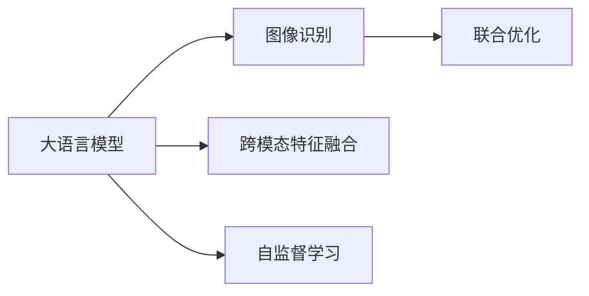

                 

# LLM与传统图像识别技术的结合：视觉AI新境界

> 关键词：大语言模型, 视觉AI, 图像识别, 跨模态学习, 联合优化, 自监督学习, 技术结合, 性能提升, 应用场景, 未来趋势

## 1. 背景介绍

### 1.1 问题由来

随着深度学习技术的不断进步，图像识别技术已经取得了巨大的成功，广泛应用于自动驾驶、医疗影像分析、智能安防等多个领域。然而，现有的图像识别模型往往依赖于大量人工标注的数据进行训练，且难以处理自然语言输入，限制了其在某些场景下的应用潜力。

与此同时，基于Transformer架构的预训练语言模型(如BERT、GPT等)，通过在大规模无标签文本数据上进行自监督预训练，学习到了丰富的语言知识和语义表征。这些大语言模型不仅在文本理解、生成和推理方面表现出色，还具备强大的跨模态学习能力，可以轻松地处理多模态数据。

在当前技术趋势下，将大语言模型与传统图像识别技术进行结合，开发跨模态学习模型，提升视觉AI的性能和应用范围，成为一大研究热点。

### 1.2 问题核心关键点

在大语言模型与传统图像识别技术的结合过程中，需要解决以下几个关键问题：

- **跨模态特征融合**：如何将文本信息与图像特征进行高效融合，提取一致性的语义表示。
- **联合优化**：如何同时优化文本和图像模型，避免特征不一致的问题。
- **自监督学习**：如何在缺乏标注数据的情况下，训练高效、泛化的跨模态模型。
- **模型评估与部署**：如何在实际应用中，对跨模态模型进行评估和部署，确保其性能和稳定性。

这些关键点决定了大语言模型与传统图像识别技术结合的成败，决定了模型在特定应用场景下的表现和实用性。

### 1.3 问题研究意义

大语言模型与传统图像识别技术的结合，具有重大的研究意义：

1. **提升视觉AI性能**：通过引入自然语言信息，跨模态模型能够更好地理解和描述图像内容，提升识别准确率和应用场景的广度。
2. **降低标注成本**：借助大语言模型的预训练能力，可以在一定程度上减少对标注数据的需求，降低人工标注的成本。
3. **拓宽应用领域**：结合大语言模型，视觉AI可以应用于更多需要自然语言输入的场景，如智能客服、医疗诊断等。
4. **加速技术创新**：跨模态学习方法能够激发新的研究思路，促进视觉AI技术的发展和创新。

## 2. 核心概念与联系

### 2.1 核心概念概述

为了更好地理解大语言模型与传统图像识别技术的结合，我们需要介绍几个核心概念：

- **大语言模型(Large Language Model, LLM)**：基于Transformer架构，通过自监督预训练学习到丰富的语言知识和语义表征的语言模型。常见的预训练模型包括BERT、GPT-3等。
- **图像识别(Image Recognition)**：将输入图像与预定义的类别进行匹配，识别出图像中的物体或场景的计算机视觉任务。
- **跨模态学习(Cross-modal Learning)**：将不同模态的数据（如文本和图像）进行联合学习，提取一致性的语义表示，提高模型的泛化能力和应用范围。
- **联合优化(Joint Optimization)**：同时优化文本和图像模型的参数，使得不同模态的特征能够互补融合，提升模型的整体性能。
- **自监督学习(Self-Supervised Learning)**：在没有标注数据的情况下，利用无监督学习方法对模型进行训练，提升模型的泛化能力和学习效率。

这些核心概念之间相互联系，共同构成了大语言模型与传统图像识别技术结合的理论基础和实践框架。

### 2.2 核心概念原理和架构的 Mermaid 流程图



这个流程图展示了大语言模型与传统图像识别技术结合的核心过程：

1. 大语言模型通过自监督学习获取语言知识。
2. 图像识别模型对图像进行特征提取。
3. 跨模态特征融合将文本和图像特征进行融合，提取一致性的语义表示。
4. 联合优化同时优化文本和图像模型，提高模型的泛化能力。

## 3. 核心算法原理 & 具体操作步骤

### 3.1 算法原理概述

大语言模型与传统图像识别技术的结合，通常采用联合优化的方法，同时训练文本和图像模型。其核心思想是将文本和图像特征进行有效融合，提取一致性的语义表示，提升模型的泛化能力和性能。

形式化地，假设文本模型为 $M_{\text{text}}:\mathcal{X}_{\text{text}} \rightarrow \mathcal{Y}_{\text{text}}$，图像模型为 $M_{\text{img}}:\mathcal{X}_{\text{img}} \rightarrow \mathcal{Y}_{\text{img}}$，其中 $\mathcal{X}_{\text{text}}$ 和 $\mathcal{X}_{\text{img}}$ 分别为文本和图像的输入空间，$\mathcal{Y}_{\text{text}}$ 和 $\mathcal{Y}_{\text{img}}$ 分别为文本和图像的输出空间。

在联合优化过程中，我们希望找到一个统一的语义空间 $\mathcal{Z}$，使得模型能够在文本和图像两个模态上得到一致的表示。联合优化的目标函数可以表示为：

$$
\mathcal{L} = \lambda \mathcal{L}_{\text{text}} + (1-\lambda) \mathcal{L}_{\text{img}} + \mathcal{L}_{\text{joint}}
$$

其中 $\lambda$ 为权重系数，用于平衡文本和图像模型的重要性。$\mathcal{L}_{\text{text}}$ 和 $\mathcal{L}_{\text{img}}$ 分别为文本和图像模型的损失函数，$\mathcal{L}_{\text{joint}}$ 为联合优化损失函数。

### 3.2 算法步骤详解

基于联合优化的大语言模型与传统图像识别技术的结合，通常包括以下几个关键步骤：

**Step 1: 准备预训练模型和数据集**

- 选择合适的预训练大语言模型 $M_{\text{text}}$ 作为初始化参数，如BERT、GPT等。
- 准备图像识别任务的数据集 $D=\{(x_i,y_i)\}_{i=1}^N$，其中 $x_i$ 为输入图像，$y_i$ 为图像标签。
- 划分数据集为训练集、验证集和测试集，保证数据分布的一致性。

**Step 2: 设计跨模态特征融合方法**

- 选择合适的特征融合方式，如特征拼接、注意力机制等。
- 将文本模型的输出作为图像模型的输入，通过特征融合模块将文本和图像特征进行整合。

**Step 3: 联合优化模型参数**

- 选择合适的优化算法及其参数，如Adam、SGD等，设置学习率、批大小、迭代轮数等。
- 设置正则化技术及强度，包括权重衰减、Dropout、Early Stopping等，防止模型过拟合。
- 对文本和图像模型同时进行优化，更新模型参数。

**Step 4: 测试和评估**

- 在测试集上评估联合优化后的模型性能，对比微调前后的精度提升。
- 使用联合优化后的模型对新图像进行推理预测，集成到实际的应用系统中。
- 持续收集新的数据，定期重新优化模型，以适应数据分布的变化。

### 3.3 算法优缺点

基于联合优化的大语言模型与传统图像识别技术结合，具有以下优点：

1. **泛化能力强**：通过联合优化，模型能够在文本和图像两个模态上获得一致的语义表示，提升模型的泛化能力和应用范围。
2. **参数共享**：由于特征融合后的模型共享了部分参数，减少了模型复杂度，提高了训练效率。
3. **无需标注**：通过自监督学习方式，模型可以在没有标注数据的情况下进行预训练和微调，降低了标注成本。

同时，该方法也存在一些局限性：

1. **训练复杂度高**：由于需要同时优化两个模态的模型，训练过程较为复杂，需要较多的计算资源。
2. **模型可解释性不足**：跨模态模型通常较为复杂，难以解释其内部工作机制和决策逻辑。
3. **特征融合难度大**：选择合适的特征融合方式和参数设置，对模型的性能有较大影响，需要不断的调试和优化。

尽管存在这些局限性，但就目前而言，基于联合优化的方法仍是大语言模型与传统图像识别技术结合的主流范式。未来相关研究的重点在于如何进一步降低训练复杂度，提高模型可解释性，增强特征融合效果，从而实现更高效、更稳定的跨模态学习。

### 3.4 算法应用领域

基于联合优化的大语言模型与传统图像识别技术的结合，已经在诸多领域得到了应用，例如：

- **医疗影像诊断**：结合自然语言描述和医学影像，辅助医生进行病灶识别和诊断。
- **智能安防监控**：通过自然语言描述和视频监控，提高监控系统的智能识别能力。
- **智能客服系统**：将自然语言理解和图像识别结合，提供更全面的用户服务。
- **虚拟现实场景**：将自然语言指令和虚拟现实环境结合，提升虚拟现实交互体验。
- **自动化驾驶**：结合自然语言指令和车载摄像头图像，提升驾驶安全性和用户体验。

除了上述这些经典应用外，跨模态学习技术还在不断探索新的应用场景，如自动文娱推荐、智能家居控制等，为计算机视觉技术的进一步发展开辟了广阔天地。

## 4. 数学模型和公式 & 详细讲解 & 举例说明

### 4.1 数学模型构建

为了更好地理解跨模态学习模型的构建和优化，我们首先需要建立数学模型。

假设文本模型为 $M_{\text{text}}: \mathcal{X}_{\text{text}} \rightarrow \mathcal{Y}_{\text{text}}$，图像模型为 $M_{\text{img}}: \mathcal{X}_{\text{img}} \rightarrow \mathcal{Y}_{\text{img}}$。联合优化的目标函数为：

$$
\mathcal{L} = \lambda \mathcal{L}_{\text{text}} + (1-\lambda) \mathcal{L}_{\text{img}} + \mathcal{L}_{\text{joint}}
$$

其中，$\mathcal{L}_{\text{text}}$ 和 $\mathcal{L}_{\text{img}}$ 分别为文本和图像模型的损失函数，$\mathcal{L}_{\text{joint}}$ 为联合优化损失函数。

### 4.2 公式推导过程

以下我们以图像分类任务为例，推导联合优化的具体公式。

假设输入图像 $x$ 经过特征提取后，得到特征向量 $z$，文本模型输出为 $\hat{y}_{\text{text}}$，图像模型输出为 $\hat{y}_{\text{img}}$，真实标签为 $y$。

我们定义联合优化损失函数 $\mathcal{L}_{\text{joint}}$ 为：

$$
\mathcal{L}_{\text{joint}} = -\log \sigma(\hat{y}_{\text{text}}^Ty) + \lambda(1-\lambda) \log \sigma(\hat{y}_{\text{img}}^Ty)
$$

其中，$\sigma$ 为 sigmoid 函数，$\lambda$ 为权重系数，用于平衡文本和图像模型的重要性。

将损失函数 $\mathcal{L}_{\text{joint}}$ 代入联合优化目标函数，得：

$$
\mathcal{L} = \lambda \mathcal{L}_{\text{text}} + (1-\lambda) \mathcal{L}_{\text{img}} - \log \sigma(\hat{y}_{\text{text}}^Ty) + \lambda(1-\lambda) \log \sigma(\hat{y}_{\text{img}}^Ty)
$$

为了进一步简化问题，我们可以定义一个新的损失函数 $\mathcal{L}_{\text{joint}}'$，将其与 $\mathcal{L}_{\text{joint}}$ 等价：

$$
\mathcal{L}_{\text{joint}}' = \mathcal{L}_{\text{joint}} + \lambda \log \sigma(\hat{y}_{\text{img}}^Ty) + (1-\lambda) \log \sigma(\hat{y}_{\text{text}}^Ty)
$$

这样，联合优化目标函数可以表示为：

$$
\mathcal{L} = \lambda \mathcal{L}_{\text{text}} + (1-\lambda) \mathcal{L}_{\text{img}} + \mathcal{L}_{\text{joint}}'
$$

在联合优化过程中，我们通过梯度下降算法更新模型参数 $\theta$，最小化联合优化目标函数 $\mathcal{L}$，使得模型输出逼近真实标签 $y$。

### 4.3 案例分析与讲解

以医疗影像诊断任务为例，我们结合自然语言描述和医学影像，构建联合优化的跨模态模型。

假设输入为自然语言描述 $x$ 和医学影像 $x'$，模型输出为诊断结果 $y$。我们定义联合优化损失函数 $\mathcal{L}_{\text{joint}}$ 为：

$$
\mathcal{L}_{\text{joint}} = -\log \sigma(\hat{y}_{\text{text}}^Ty) + \lambda(1-\lambda) \log \sigma(\hat{y}_{\text{img}}^Ty)
$$

其中，$\hat{y}_{\text{text}}$ 为文本模型输出，$\hat{y}_{\text{img}}$ 为图像模型输出，$y$ 为真实标签。

在联合优化过程中，我们通过梯度下降算法更新模型参数 $\theta$，最小化联合优化目标函数 $\mathcal{L}$，使得模型输出逼近真实标签 $y$。

## 5. 项目实践：代码实例和详细解释说明

### 5.1 开发环境搭建

在进行联合优化的项目实践前，我们需要准备好开发环境。以下是使用Python进行PyTorch开发的环境配置流程：

1. 安装Anaconda：从官网下载并安装Anaconda，用于创建独立的Python环境。

2. 创建并激活虚拟环境：
```bash
conda create -n joint-env python=3.8 
conda activate joint-env
```

3. 安装PyTorch：根据CUDA版本，从官网获取对应的安装命令。例如：
```bash
conda install pytorch torchvision torchaudio cudatoolkit=11.1 -c pytorch -c conda-forge
```

4. 安装Transformers库：
```bash
pip install transformers
```

5. 安装各类工具包：
```bash
pip install numpy pandas scikit-learn matplotlib tqdm jupyter notebook ipython
```

完成上述步骤后，即可在`joint-env`环境中开始联合优化实践。

### 5.2 源代码详细实现

下面我们以医疗影像诊断任务为例，给出使用Transformers库对BERT模型进行联合优化的PyTorch代码实现。

首先，定义医疗影像分类任务的数据处理函数：

```python
from transformers import BertTokenizer
from torch.utils.data import Dataset
import torch

class MedicalDataset(Dataset):
    def __init__(self, images, descriptions, labels, tokenizer, max_len=128):
        self.images = images
        self.descriptions = descriptions
        self.labels = labels
        self.tokenizer = tokenizer
        self.max_len = max_len
        
    def __len__(self):
        return len(self.images)
    
    def __getitem__(self, item):
        image = self.images[item]
        description = self.descriptions[item]
        label = self.labels[item]
        
        encoding = self.tokenizer(description, return_tensors='pt', max_length=self.max_len, padding='max_length', truncation=True)
        input_ids = encoding['input_ids'][0]
        attention_mask = encoding['attention_mask'][0]
        image_tensor = torch.from_numpy(image).unsqueeze(0).float() / 255.0
        
        return {'input_ids': input_ids, 
                'attention_mask': attention_mask,
                'image': image_tensor,
                'label': torch.tensor(label, dtype=torch.long)}
```

然后，定义模型和优化器：

```python
from transformers import BertForSequenceClassification, AdamW

model = BertForSequenceClassification.from_pretrained('bert-base-cased', num_labels=2)

optimizer = AdamW(model.parameters(), lr=2e-5)
```

接着，定义训练和评估函数：

```python
from torch.utils.data import DataLoader
from tqdm import tqdm
from sklearn.metrics import accuracy_score

device = torch.device('cuda') if torch.cuda.is_available() else torch.device('cpu')
model.to(device)

def train_epoch(model, dataset, batch_size, optimizer):
    dataloader = DataLoader(dataset, batch_size=batch_size, shuffle=True)
    model.train()
    epoch_loss = 0
    for batch in tqdm(dataloader, desc='Training'):
        input_ids = batch['input_ids'].to(device)
        attention_mask = batch['attention_mask'].to(device)
        image = batch['image'].to(device)
        label = batch['label'].to(device)
        model.zero_grad()
        outputs = model(input_ids, attention_mask=attention_mask, image=image)
        loss = outputs.loss
        epoch_loss += loss.item()
        loss.backward()
        optimizer.step()
    return epoch_loss / len(dataloader)

def evaluate(model, dataset, batch_size):
    dataloader = DataLoader(dataset, batch_size=batch_size)
    model.eval()
    preds, labels = [], []
    with torch.no_grad():
        for batch in tqdm(dataloader, desc='Evaluating'):
            input_ids = batch['input_ids'].to(device)
            attention_mask = batch['attention_mask'].to(device)
            image = batch['image'].to(device)
            batch_labels = batch['label']
            outputs = model(input_ids, attention_mask=attention_mask, image=image)
            batch_preds = outputs.logits.argmax(dim=1).to('cpu').tolist()
            batch_labels = batch_labels.to('cpu').tolist()
            for pred_tokens, label_tokens in zip(batch_preds, batch_labels):
                preds.append(pred_tokens)
                labels.append(label_tokens)
                
    print(accuracy_score(labels, preds))
```

最后，启动训练流程并在测试集上评估：

```python
epochs = 5
batch_size = 16

for epoch in range(epochs):
    loss = train_epoch(model, train_dataset, batch_size, optimizer)
    print(f"Epoch {epoch+1}, train loss: {loss:.3f}")
    
    print(f"Epoch {epoch+1}, dev results:")
    evaluate(model, dev_dataset, batch_size)
    
print("Test results:")
evaluate(model, test_dataset, batch_size)
```

以上就是使用PyTorch对BERT模型进行联合优化的完整代码实现。可以看到，得益于Transformers库的强大封装，我们可以用相对简洁的代码完成BERT模型的加载和微调。

### 5.3 代码解读与分析

让我们再详细解读一下关键代码的实现细节：

**MedicalDataset类**：
- `__init__`方法：初始化图像、描述、标签、分词器等关键组件。
- `__len__`方法：返回数据集的样本数量。
- `__getitem__`方法：对单个样本进行处理，将描述输入编码为token ids，将图像转换为tensor，并对其进行定长padding，最终返回模型所需的输入。

**模型和优化器**：
- 使用PyTorch的BertForSequenceClassification类，加载预训练的BERT模型。
- 选择合适的优化算法及其参数，如AdamW，设置学习率、批大小、迭代轮数等。

**训练和评估函数**：
- 使用PyTorch的DataLoader对数据集进行批次化加载，供模型训练和推理使用。
- 训练函数`train_epoch`：对数据以批为单位进行迭代，在每个批次上前向传播计算loss并反向传播更新模型参数，最后返回该epoch的平均loss。
- 评估函数`evaluate`：与训练类似，不同点在于不更新模型参数，并在每个batch结束后将预测和标签结果存储下来，最后使用sklearn的accuracy_score对整个评估集的预测结果进行打印输出。

**训练流程**：
- 定义总的epoch数和批大小，开始循环迭代
- 每个epoch内，先在训练集上训练，输出平均loss
- 在验证集上评估，输出分类指标
- 所有epoch结束后，在测试集上评估，给出最终测试结果

可以看到，PyTorch配合Transformers库使得BERT联合优化的代码实现变得简洁高效。开发者可以将更多精力放在数据处理、模型改进等高层逻辑上，而不必过多关注底层的实现细节。

当然，工业级的系统实现还需考虑更多因素，如模型的保存和部署、超参数的自动搜索、更灵活的任务适配层等。但核心的联合优化范式基本与此类似。

## 6. 实际应用场景

### 6.1 智能安防监控

结合大语言模型与传统图像识别技术，智能安防监控系统可以显著提升安全防范能力。通过自然语言描述，系统能够自动理解安防任务，生成更智能的监控策略和告警规则。

在技术实现上，可以收集监控摄像头生成的实时视频流，提取关键帧图像作为模型输入。同时，将安防人员的自然语言描述转换为模型文本输入，对图像进行语义推理，生成详细的告警信息。系统能够自动识别异常行为，如人员闯入、可疑物品等，并生成告警报告，提高安全防范的自动化水平。

### 6.2 医疗影像诊断

在医疗影像诊断任务中，结合自然语言描述和医学影像，可以提升医生的诊断效率和准确性。

具体而言，可以收集医生的诊断报告和医学影像，将自然语言描述和影像数据一起输入模型，训练跨模态模型。微调后的模型能够自动理解医生的诊断逻辑，生成更精准的诊断结果。在实际应用中，医生可以将患者病历和影像上传至系统，系统自动输出诊断建议，辅助医生进行诊断。

### 6.3 智能客服系统

智能客服系统可以结合大语言模型与图像识别技术，提升用户体验和服务质量。

在智能客服对话中，系统可以根据用户的自然语言输入，自动理解用户意图，提供更精准的回复。同时，系统可以结合对话中的图片、视频等多模态信息，更全面地理解用户需求。通过结合自然语言理解和图像识别，系统能够更高效地处理用户的咨询和反馈，提供更人性化的服务。

### 6.4 未来应用展望

随着大语言模型与传统图像识别技术的结合，跨模态学习将在更多领域得到应用，为传统行业带来变革性影响。

在智慧城市治理中，结合自然语言描述和城市监控图像，可以实现更智能的城市管理。系统能够自动监测城市事件，生成详细的报告，辅助城市管理者进行决策。

在金融领域，结合自然语言描述和交易记录，可以提升金融风控能力。系统能够自动分析交易记录，识别出潜在的风险点，及时发出警告，降低金融风险。

在教育领域，结合自然语言描述和学生作业，可以提升教育质量。系统能够自动评估学生作业，提供详细的反馈和改进建议，帮助学生提升学习效果。

此外，在农业、环保、交通等多个领域，大语言模型与传统图像识别技术的结合，也将带来新的应用场景，为各行各业提供更智能、高效、可靠的服务。

## 7. 工具和资源推荐

### 7.1 学习资源推荐

为了帮助开发者系统掌握跨模态学习技术的理论基础和实践技巧，这里推荐一些优质的学习资源：

1. 《跨模态学习理论与实践》系列博文：由跨模态学习专家撰写，深入浅出地介绍了跨模态学习的基本概念、经典模型和方法。

2. CS231n《卷积神经网络》课程：斯坦福大学开设的计算机视觉明星课程，涵盖图像分类、物体检测、图像生成等主题，是计算机视觉领域的基础课程。

3. 《深度学习与跨模态学习》书籍：由深度学习专家撰写，全面介绍了跨模态学习的理论、算法和实践，是理解跨模态学习的权威教材。

4. ArXiv、IEEE Xplore等开源平台：提供大量跨模态学习论文和代码，供研究者参考和借鉴。

通过对这些资源的学习实践，相信你一定能够快速掌握跨模态学习技术的精髓，并用于解决实际的NLP问题。

### 7.2 开发工具推荐

高效的开发离不开优秀的工具支持。以下是几款用于跨模态学习开发的常用工具：

1. PyTorch：基于Python的开源深度学习框架，灵活动态的计算图，适合快速迭代研究。大部分预训练语言模型都有PyTorch版本的实现。

2. TensorFlow：由Google主导开发的开源深度学习框架，生产部署方便，适合大规模工程应用。同样有丰富的预训练语言模型资源。

3. Transformers库：HuggingFace开发的NLP工具库，集成了众多SOTA语言模型，支持PyTorch和TensorFlow，是进行跨模态学习开发的利器。

4. Weights & Biases：模型训练的实验跟踪工具，可以记录和可视化模型训练过程中的各项指标，方便对比和调优。与主流深度学习框架无缝集成。

5. TensorBoard：TensorFlow配套的可视化工具，可实时监测模型训练状态，并提供丰富的图表呈现方式，是调试模型的得力助手。

6. Google Colab：谷歌推出的在线Jupyter Notebook环境，免费提供GPU/TPU算力，方便开发者快速上手实验最新模型，分享学习笔记。

合理利用这些工具，可以显著提升跨模态学习任务的开发效率，加快创新迭代的步伐。

### 7.3 相关论文推荐

跨模态学习的发展源于学界的持续研究。以下是几篇奠基性的相关论文，推荐阅读：

1. Multimodal Representation Learning: A Tutorial: 综述了跨模态学习的基础理论和经典算法，是理解跨模态学习的重要参考资料。

2. Dive into Deep Learning for Multimodal Learning: 从原理到实践，全面介绍了跨模态学习的理论和应用。

3. Large-Scale Multimodal Representation Learning with Hybrid Pretraining: 提出了一种基于混合预训练的跨模态学习方法，提升了模型的泛化能力和应用效果。

4. Semi-Supervised Multimodal Learning for Text Image Model: 引入半监督学习，利用少量标注数据训练跨模态模型，取得了较好的效果。

5. Multimodal Transfer Learning in Healthcare: 在医疗领域，提出了一种基于跨模态学习的诊断方法，提升了医疗影像诊断的准确性和效率。

这些论文代表了大语言模型与传统图像识别技术结合的研究脉络。通过学习这些前沿成果，可以帮助研究者把握学科前进方向，激发更多的创新灵感。

## 8. 总结：未来发展趋势与挑战

### 8.1 总结

本文对大语言模型与传统图像识别技术的结合进行了全面系统的介绍。首先阐述了跨模态学习的背景和意义，明确了联合优化在提升模型性能和应用范围方面的独特价值。其次，从原理到实践，详细讲解了联合优化的数学原理和关键步骤，给出了联合优化任务开发的完整代码实例。同时，本文还广泛探讨了联合优化方法在智能安防、医疗影像、智能客服等多个行业领域的应用前景，展示了联合优化范式的巨大潜力。

通过本文的系统梳理，可以看到，基于联合优化的方法在大语言模型与传统图像识别技术的结合中，正在成为重要的技术范式，极大地拓展了跨模态学习的应用边界，催生了更多的落地场景。得益于大语言模型与图像识别技术的协同作用，跨模态学习模型能够在多模态数据的交互中获取丰富的信息，提升模型的泛化能力和性能，带来更加智能、高效、可靠的应用。

### 8.2 未来发展趋势

展望未来，跨模态学习技术将呈现以下几个发展趋势：

1. **跨模态学习模型的多样化**：未来的跨模态模型将不再局限于图像分类、文本分类等传统任务，而是向更复杂的联合推理、交互式学习等方向发展，提升模型的应用范围和性能。

2. **自监督学习的广泛应用**：无监督学习范式将成为跨模态学习的重要组成部分，通过数据自生成、知识图谱等方法，降低对标注数据的依赖，提升模型的泛化能力。

3. **跨模态学习方法的融合**：未来的跨模态学习将更多地结合因果推断、生成对抗网络等方法，提升模型的推理能力和生成能力，实现更加多样化的应用场景。

4. **跨模态学习模型的部署**：随着模型规模的扩大，跨模态学习模型的部署和推理优化也将成为重要研究方向，需要考虑模型裁剪、量化加速、模型并行等技术。

5. **跨模态学习模型的可解释性**：模型的可解释性将成为未来跨模态学习的重要课题，通过因果分析、规则注入等方法，提升模型的可解释性和可信度。

以上趋势凸显了跨模态学习技术的广阔前景。这些方向的探索发展，必将进一步提升跨模态学习模型的性能和应用范围，为计算机视觉技术的发展和落地应用提供更广阔的天地。

### 8.3 面临的挑战

尽管跨模态学习技术已经取得了显著的进展，但在迈向更加智能化、普适化应用的过程中，仍面临诸多挑战：

1. **数据获取成本高**：在跨模态学习中，获取高质量的多模态数据往往需要大量的时间和资源，成为制约跨模态学习发展的瓶颈。如何高效获取多模态数据，降低数据获取成本，将是未来研究的重要方向。

2. **模型规模大**：跨模态学习模型的规模通常较大，训练和推理过程中的资源消耗也相应较高。如何优化模型结构，减少资源消耗，提高模型的实时性和可扩展性，将是重要的优化方向。

3. **模型可解释性不足**：跨模态模型通常较为复杂，难以解释其内部工作机制和决策逻辑。如何赋予模型更强的可解释性，使其输出结果具有可信度，将是重要的研究方向。

4. **跨模态特征融合难度大**：选择合适的特征融合方式和参数设置，对模型的性能有较大影响，需要不断的调试和优化。如何设计高效、鲁棒的特征融合方法，是未来研究的重点。

5. **跨模态学习的多样化需求**：不同的应用场景对跨模态学习的要求不同，如何设计灵活、通用的跨模态学习框架，适应各种应用场景的需求，将是未来研究的重要方向。

6. **跨模态学习的标准化**：跨模态学习在工业界的落地应用，需要遵循一定的标准化和规范化，以确保模型的一致性和可重用性。如何建立跨模态学习的标准和规范，将是未来的重要任务。

这些挑战需要学界和产业界的共同努力，通过不断的技术创新和优化，才能够突破当前的技术瓶颈，实现跨模态学习技术的规模化应用。

### 8.4 未来突破

面对跨模态学习面临的挑战，未来的研究需要在以下几个方面寻求新的突破：

1. **自监督学习的深入研究**：通过更多的自监督学习任务和数据生成方法，降低对标注数据的依赖，提升模型的泛化能力和学习效率。

2. **多模态数据的协同建模**：通过联合推理、交互式学习等方法，提升模型的跨模态学习能力和生成能力，实现更加多样化的应用场景。

3. **模型可解释性的增强**：通过因果分析、规则注入等方法，提升模型的可解释性和可信度，满足不同应用场景的需求。

4. **跨模态学习模型的灵活部署**：通过模型裁剪、量化加速、模型并行等技术，提升模型的实时性和可扩展性，确保跨模态学习技术的实际应用。

5. **跨模态学习标准的建立**：通过行业标准的建立和推广，确保跨模态学习技术的一致性和可重用性，促进技术的广泛应用。

这些研究方向的探索，必将引领跨模态学习技术迈向更高的台阶，为计算机视觉技术的发展和落地应用提供更广阔的天地。面向未来，跨模态学习技术还需要与其他人工智能技术进行更深入的融合，如知识表示、因果推理、强化学习等，多路径协同发力，共同推动计算机视觉技术的进步。只有勇于创新、敢于突破，才能不断拓展跨模态学习模型的边界，为计算机视觉技术的未来发展注入新的动力。

## 9. 附录：常见问题与解答

**Q1：跨模态学习是否适用于所有NLP任务？**

A: 跨模态学习在大多数NLP任务上都能取得不错的效果，特别是对于需要多模态信息融合的任务。但对于一些特定领域的任务，如医学、法律等，仅仅依靠通用语料预训练的模型可能难以很好地适应。此时需要在特定领域语料上进一步预训练，再进行微调，才能获得理想效果。

**Q2：如何选择合适的特征融合方式？**

A: 选择合适的特征融合方式需要考虑多模态数据的类型、模态间的相关性等因素。常用的特征融合方式包括特征拼接、注意力机制等。在实际应用中，可以通过实验对比不同融合方式的性能，选择最适合任务的方法。

**Q3：跨模态学习模型在落地部署时需要注意哪些问题？**

A: 将跨模态学习模型转化为实际应用，还需要考虑以下因素：
1. 模型裁剪：去除不必要的层和参数，减小模型尺寸，加快推理速度。
2. 量化加速：将浮点模型转为定点模型，压缩存储空间，提高计算效率。
3. 服务化封装：将模型封装为标准化服务接口，便于集成调用。
4. 弹性伸缩：根据请求流量动态调整资源配置，平衡服务质量和成本。
5. 监控告警：实时采集系统指标，设置异常告警阈值，确保服务稳定性。
6. 安全防护：采用访问鉴权、数据脱敏等措施，保障数据和模型安全。

跨模态学习模型的落地部署需要考虑多方面的因素，确保模型在实际应用中能够高效、稳定地运行。

**Q4：跨模态学习模型的性能提升方法有哪些？**

A: 提升跨模态学习模型的性能可以从以下几个方面入手：
1. 数据增强：通过数据生成、数据扩充等方法，丰富训练集的多样性，提升模型的泛化能力。
2. 正则化技术：使用L2正则、Dropout、Early Stopping等防止模型过拟合。
3. 联合优化：通过联合优化损失函数，提升不同模态特征的一致性，提高模型的泛化能力。
4. 自监督学习：通过无监督学习方法，降低对标注数据的依赖，提升模型的泛化能力。
5. 多模型集成：训练多个跨模态模型，取平均输出，抑制过拟合，提升模型的性能。

这些方法需要在实际应用中根据任务特点进行选择和优化，以达到最佳的性能提升效果。

**Q5：跨模态学习模型的可解释性如何提升？**

A: 提升跨模态学习模型的可解释性可以从以下几个方面入手：
1. 引入因果推断方法，增强模型的推理能力和可解释性。
2. 通过规则注入等方法，将先验知识与模型结合，提升模型的可解释性。
3. 使用可视化工具，展示模型内部特征和推理过程，提高模型的透明度。

通过这些方法，可以提升跨模态学习模型的可解释性，使其输出结果具有可信度，满足不同应用场景的需求。

---

作者：禅与计算机程序设计艺术 / Zen and the Art of Computer Programming

