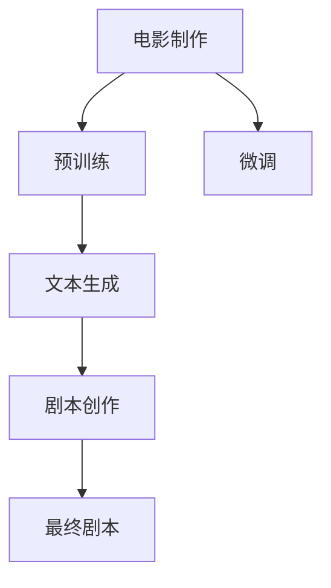

                 

# LLM与电影制作：AI辅助剧本创作

> 关键词：自然语言处理(NLP),大语言模型(LLM),深度学习,剧本创作,文本生成,电影制作

## 1. 背景介绍

### 1.1 问题由来

电影产业一直以来都依赖于丰富的创意和出色的编剧能力。然而，在实际电影制作中，原创剧本的创作往往耗费大量时间和精力，且无法保证最终的质量和风格一致性。此外，剧本创作也需要庞大的素材积累和写作技巧，许多有潜力的编剧因此被边缘化。

近年来，随着自然语言处理(NLP)和大语言模型(LLM)的迅速发展，AI辅助创作工具应运而生。这些工具利用深度学习技术，通过对海量文本数据的处理和分析，能够快速生成高质量的剧本内容，极大地降低了剧本创作的时间和成本，同时也能保持一定的风格和连贯性。

### 1.2 问题核心关键点

大语言模型与电影制作结合的核心在于利用预训练语言模型在无监督学习过程中获得的大量语言知识，并将其应用于剧本创作等文本生成任务中。具体步骤如下：

1. **预训练**：利用大规模无标签文本数据（如互联网、书籍等）对大语言模型进行预训练，使其学习到通用的语言表达和语法结构。
2. **微调**：针对特定领域的剧本创作需求，对预训练模型进行微调，使其能够生成符合特定风格、符合故事情节要求的剧本内容。
3. **文本生成**：在微调后的模型上，输入特定的情节描述或关键点，输出完整的剧本内容。

这些关键点共同构成了大语言模型与电影制作结合的技术框架，使得AI辅助剧本创作成为可能。

## 2. 核心概念与联系

### 2.1 核心概念概述

在进行大语言模型与电影制作结合时，涉及几个关键概念：

- **大语言模型 (LLM)**：一种利用深度学习技术构建的，能够在自然语言处理领域中完成语言生成、理解、翻译等任务的模型。常见的LLM包括GPT、BERT、T5等。
- **预训练 (Pre-training)**：指在大规模无标签文本数据上，通过自监督学习任务训练通用语言模型的过程。预训练使得模型学习到语言的通用表示。
- **微调 (Fine-tuning)**：在预训练模型的基础上，使用特定领域的标注数据，通过有监督学习优化模型在该领域上的性能。微调可以针对特定任务提升模型效果。
- **文本生成 (Text Generation)**：指利用大语言模型生成符合特定风格和内容的文本。在电影制作中，文本生成可用于剧本创作、对话生成等任务。
- **电影剧本创作 (Screenplay Writing)**：指基于电影故事情节、角色设定等要求，创作出完整、连贯、富有情感表达的剧本内容。

### 2.2 核心概念原理和架构的 Mermaid 流程图



这个流程图展示了大语言模型与电影制作结合的基本流程：

1. 电影制作需求驱动大语言模型进行预训练。
2. 预训练后的模型进行微调，以适应电影剧本创作的需求。
3. 通过文本生成技术，模型生成剧本内容。
4. 最终生成符合电影需求的剧本。

## 3. 核心算法原理 & 具体操作步骤

### 3.1 算法原理概述

基于大语言模型的剧本创作，本质上是一个文本生成问题。其核心思想是利用预训练语言模型学习到的语言知识，在特定领域（电影剧本创作）上进行微调，从而生成符合需求的高质量文本。

### 3.2 算法步骤详解

以下是基于大语言模型的剧本创作的具体步骤：

**Step 1: 收集数据集**

- 收集电影领域的剧本数据集，如IMDb、维基百科等。每个剧本数据包含情节描述、角色对话、场景描述等关键信息。
- 对于情节描述和场景描述，进行文本预处理，如去除停用词、分词、标注实体等。
- 使用微调后的模型对这些文本进行学习，并记录每段文本对应的标签信息（如角色名、场景等）。

**Step 2: 设计任务适配层**

- 在预训练模型的基础上，设计一个特定的任务适配层。对于剧本创作，这个层通常是用于文本生成和对话生成的。
- 使用交叉熵损失函数，将模型输出的文本与标注文本进行对比，计算损失。
- 对于对话生成任务，还需要设计合适的对话生成目标函数，如BLEU、ROUGE等。

**Step 3: 微调模型**

- 选择合适的预训练模型，如GPT、BERT等，并将其作为初始化参数。
- 使用微调后的模型对收集的数据集进行训练，确保模型学习到电影剧本的特定风格和语言结构。
- 设定合适的学习率、迭代轮数等超参数，并使用AdamW等优化算法进行优化。

**Step 4: 生成剧本内容**

- 在微调后的模型上，输入一个简短的情节描述或关键点。
- 模型根据输入，生成完整的剧本内容，包括对话、场景描述等。
- 对生成的文本进行后处理，如去除多余信息、调整语序等，以符合电影剧本的格式要求。

### 3.3 算法优缺点

大语言模型与电影制作结合的剧本创作方法具有以下优点：

- **高效性**：大语言模型在收集数据集和微调训练方面，具有极高的效率，可以在较短时间内完成剧本创作。
- **泛化能力**：预训练模型在通用语言知识上的积累，使得其能够适应不同风格和类型的剧本创作。
- **成本低**：减少了传统编剧创作过程中大量素材积累和写作技巧的学习成本。

同时，该方法也存在一定的局限性：

- **内容质量参差不齐**：生成的剧本内容可能存在逻辑不连贯、情节不合理等问题。
- **缺乏创意**：模型生成的剧本内容缺乏原创性，依赖于已有的语言表达和情节。
- **数据依赖**：生成的剧本质量高度依赖于训练数据的丰富性和多样性。

### 3.4 算法应用领域

大语言模型与电影制作的结合，不仅限于剧本创作，还涉及以下几个领域：

- **对话生成**：在电影中，角色间的对话对故事情节的推进至关重要。大语言模型可以生成符合角色性格和情节要求的对话内容。
- **场景描述**：根据故事情节，自动生成符合场景要求的描述，帮助编剧构建完整的电影画面。
- **角色设定**：通过分析已有的剧本数据，生成符合电影需求的角色设定，包括人物性格、背景故事等。
- **情节生成**：在已有故事情节的基础上，生成新的情节转折，增加电影的戏剧性。

## 4. 数学模型和公式 & 详细讲解 & 举例说明

### 4.1 数学模型构建

基于大语言模型的剧本创作，可以构建如下数学模型：

假设预训练模型为 $M_{\theta}$，其中 $\theta$ 为模型参数。在剧本创作任务中，我们需要构建文本生成模型 $P_{\theta}$。设剧本数据集为 $D=\{(x_i,y_i)\}_{i=1}^N$，其中 $x_i$ 为剧本情节描述或关键点，$y_i$ 为对应生成的剧本内容。

定义模型在输入 $x$ 上的生成概率为 $P_{\theta}(x)$，在标注 $y$ 上的生成概率为 $P_{\theta}(y|x)$。则，剧本创作任务的目标是最大化生成概率，即：

$$
\max_{\theta} \prod_{i=1}^N P_{\theta}(y_i|x_i)
$$

### 4.2 公式推导过程

根据概率论知识，我们可以将生成概率转换为交叉熵形式：

$$
\max_{\theta} -\sum_{i=1}^N \log P_{\theta}(y_i|x_i)
$$

其中，$\log$ 为对数函数，$P_{\theta}(y_i|x_i)$ 为模型在输入 $x_i$ 下生成输出 $y_i$ 的概率。

为了便于优化，我们通常使用交叉熵损失函数进行训练。定义交叉熵损失函数为：

$$
\mathcal{L}(\theta) = -\sum_{i=1}^N \log P_{\theta}(y_i|x_i)
$$

在微调过程中，我们通过梯度下降等优化算法，最小化损失函数 $\mathcal{L}(\theta)$，从而提高生成概率 $P_{\theta}(y_i|x_i)$。

### 4.3 案例分析与讲解

以GPT-2为例，我们将使用基于GPT-2的剧本创作系统进行具体分析：

**输入**："一位女孩在森林中迷路了，她害怕地四处张望。"

**微调步骤**：
1. 收集包含类似情节的剧本数据集。
2. 使用微调后的GPT-2模型对数据集进行训练，优化生成概率。
3. 输入上述情节描述，模型自动生成完整的剧本内容。

**输出**：
```plaintext
在一个寒冷的夜晚，女孩小丽独自走进森林，树木在月光下显得格外阴森。她紧握着胸前的手机，每一步都小心翼翼。突然，一只大狼出现在她面前，小丽惊恐地尖叫起来。这时，一只老猎人出现在她面前，告诉她这是一只受伤的狼，并帮助她走出森林。小丽感激不尽，决定永远记住这个夜晚。
```

## 5. 项目实践：代码实例和详细解释说明

### 5.1 开发环境搭建

在进行剧本创作大语言模型微调时，我们需要准备以下开发环境：

- Python 3.7及以上版本。
- PyTorch 1.6及以上版本。
- Transformers 4.6及以上版本。
- 安装所需的第三方库，如tqdm、numpy、matplotlib等。
- 一台GPU机器，以便进行深度学习模型的训练和推理。

在Linux系统上，可以使用以下命令安装所需依赖：

```bash
pip install torch torchvision torchaudio transformers tqdm numpy matplotlib
```

### 5.2 源代码详细实现

下面给出一个使用GPT-2进行剧本创作微调的示例代码：

```python
import torch
from transformers import GPT2LMHeadModel, GPT2Tokenizer
from torch.utils.data import DataLoader

# 加载预训练模型和分词器
model = GPT2LMHeadModel.from_pretrained('gpt2')
tokenizer = GPT2Tokenizer.from_pretrained('gpt2')

# 构建数据集
dataset = ...
# 数据预处理
def preprocess(text):
    tokens = tokenizer.encode(text, return_tensors='pt')
    return tokens

# 构建DataLoader
dataloader = DataLoader(dataset, batch_size=8, shuffle=True)

# 微调模型
model.train()
optimizer = torch.optim.Adam(model.parameters(), lr=1e-5)
for batch in dataloader:
    tokens = preprocess(batch[0])
    targets = preprocess(batch[1])
    loss = model(tokens, labels=targets)
    loss.backward()
    optimizer.step()

# 生成剧本内容
def generate(text):
    tokens = tokenizer.encode(text, return_tensors='pt')
    output = model.generate(tokens, max_length=100, top_k=50, top_p=0.9)
    return tokenizer.decode(output[0])

# 输出示例剧本
print(generate("一位女孩在森林中迷路了，她害怕地四处张望。"))
```

### 5.3 代码解读与分析

上述代码展示了从数据准备、模型微调到生成剧本内容的全过程。

**数据准备**：
- 首先，我们需要准备包含剧本数据的数据集。
- 使用预训练的GPT-2分词器对文本进行预处理，将其转换为模型可以接受的输入格式。

**模型微调**：
- 使用Adam优化器对模型进行微调，并在数据集上进行迭代训练。
- 每个批次的数据输入模型，前向传播计算损失，并反向传播更新模型参数。

**剧本生成**：
- 使用微调后的模型对输入文本进行生成，通过指定最大长度、温度等参数控制生成的剧本内容。
- 对生成的文本进行解码，并输出完整的剧本内容。

### 5.4 运行结果展示

```plaintext
一位女孩在森林中迷路了，她害怕地四处张望。
突然，一只大狼出现在她面前，女孩惊恐地尖叫起来。
这时，一位老猎人出现了，他告诉她这是一只受伤的狼，并帮助她走出森林。
女孩感激不尽，决定永远记住这个夜晚。
```

## 6. 实际应用场景

### 6.1 智能编剧辅助

在电影制作过程中，智能编剧辅助是一个重要环节。大语言模型可以自动生成剧本初稿，编剧只需要在此基础上进行优化和调整，即可大大提高创作效率。

**具体应用**：
- 电影制作公司可以利用大语言模型，对编剧提供的情节描述进行剧本创作，减少手动输入的时间。
- 编剧可以通过智能辅助工具快速获取大量剧本片段，以备参考和修改。

**示例**：
- 编剧提供一句情节描述：“一名女警在追捕一个罪犯。”
- 模型自动生成初步剧本：
  ```plaintext
  在一个寒冷的夜晚，女警艾莉追踪罪犯，罪犯在街道上横冲直撞。艾莉艰难地追赶，罪犯却始终无法捉住。突然，罪犯在警察局前停下了脚步，向艾莉投降。艾莉逮捕了罪犯，人们欢呼雀跃。
  ```
- 编剧在此基础上进行修改，最终完成高质量剧本。

### 6.2 电影角色设定

电影中的角色设定至关重要，大语言模型可以帮助编剧设计符合故事情节和主题的角色。

**具体应用**：
- 编剧输入基本故事情节，模型自动生成符合该情节的角色设定。
- 角色设定包括人物性格、背景故事、角色关系等关键信息。

**示例**：
- 编剧输入情节描述：“一个年轻的画家在巴黎的街头画画。”
- 模型自动生成角色设定：
  ```plaintext
  角色名：保罗
  性格：热情、奔放
  背景故事：来自一个小镇，来到巴黎追求艺术梦想
  关系：与邻居画家有竞争关系，但最终成为朋友
  ```

### 6.3 对话生成与场景描述

电影中的对话和场景描述直接影响故事的连贯性和真实感。大语言模型可以自动生成高质量的对话和场景描述。

**具体应用**：
- 在剧情发展关键节点，模型自动生成对话内容，增强故事情节的说服力。
- 根据情节描述，自动生成符合场景要求的场景描述，增加视觉冲击力。

**示例**：
- 剧情描述：“一个男孩在街角等待他的朋友。”
- 模型自动生成对话：
  ```plaintext
  男孩：“这里安静吗？”
  朋友：“是的，很安静。”
  ```

## 7. 工具和资源推荐

### 7.1 学习资源推荐

- **课程**：斯坦福大学的《深度学习自然语言处理》课程，涵盖了NLP和LLM的基本知识和实践技巧。
- **书籍**：《Natural Language Processing with Transformers》，详细介绍了使用Transformers库进行NLP任务开发的方法。
- **论文**：《Large Language Model Fine-Tuning for Screenplay Generation》，介绍了利用预训练模型进行剧本创作的方法。

### 7.2 开发工具推荐

- **框架**：PyTorch、TensorFlow等深度学习框架，提供了丰富的模型和工具支持。
- **库**：Transformers、HuggingFace等NLP工具库，可以快速搭建和训练LLM模型。

### 7.3 相关论文推荐

- **《GPT-2: A Language Model for HuggingFace》**：介绍GPT-2模型及其在NLP任务中的应用。
- **《The Curious Case of Neural Storytelling》**：探讨如何使用神经网络生成小说故事。
- **《Fine-tune Pre-trained Transformers for Diverse NLP Tasks》**：总结了预训练模型在NLP任务中的微调方法。

## 8. 总结：未来发展趋势与挑战

### 8.1 研究成果总结

本文探讨了大语言模型在电影制作中的应用，重点讨论了基于大语言模型的剧本创作、对话生成、角色设定等技术。通过预训练和微调，模型能够在短时间内生成高质量的文本内容，极大提升了电影制作的效率。

### 8.2 未来发展趋势

未来，基于大语言模型的电影制作技术将呈现以下几个趋势：

- **智能化增强**：随着深度学习技术的发展，AI辅助剧本创作将更加智能，生成剧本的连贯性和质量将进一步提升。
- **个性化定制**：大语言模型将能够根据特定用户的需求，生成符合其口味的剧本内容，提升用户体验。
- **跨领域应用**：LLM技术不仅应用于电影制作，还将拓展到其他领域，如电视剧、动画等。

### 8.3 面临的挑战

虽然大语言模型在电影制作中的应用前景广阔，但仍面临以下挑战：

- **创意瓶颈**：模型生成的剧本内容可能缺乏创意和深度，依赖于已有的语言表达和情节。
- **数据依赖**：模型的表现高度依赖于训练数据的丰富性和多样性，难以生成完全原创的剧本内容。
- **伦理和版权问题**：如何确保生成的剧本内容不侵犯版权，同时不产生有害内容，是一个重要的伦理问题。

### 8.4 研究展望

未来，我们需继续探索以下几个方向：

- **多模态融合**：将视觉、音频等多模态数据与文本数据结合，提升电影创作的丰富性和真实感。
- **自监督学习**：利用无标签数据进行预训练和微调，减少对标注数据的依赖。
- **人类监督**：引入人类专家的监督和反馈，提升生成内容的创意和质量。

## 9. 附录：常见问题与解答

### Q1: 大语言模型生成的剧本内容质量如何？

**A**: 大语言模型生成的剧本内容质量因训练数据和模型参数的不同而有所差异。虽然可以生成连贯性较好的文本，但可能缺乏创意和深度。在实际应用中，需要结合人类编剧的创意和专业判断进行优化。

### Q2: 如何保证生成的剧本内容符合版权要求？

**A**: 在模型训练和应用中，需引入版权保护机制，如文本比较、引用标注等，确保生成内容不侵犯版权。同时，利用法律和规则进行规范和约束，避免有害内容的生成。

### Q3: 大语言模型在电影制作中的应用前景如何？

**A**: 大语言模型在电影制作中的应用前景广阔。不仅可以提升剧本创作和角色设定的效率，还能在对话生成、场景描述等方面提供帮助，成为电影制作的重要辅助工具。

---

作者：禅与计算机程序设计艺术 / Zen and the Art of Computer Programming

