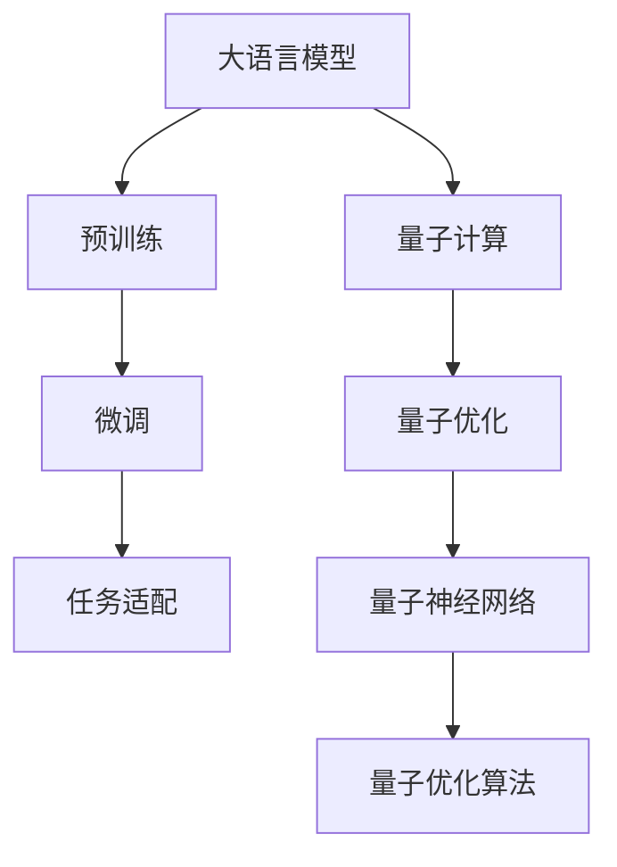

                 

# LLM与量子计算的潜在协同效应

> 关键词：大语言模型,量子计算,协同效应,深度学习,量子神经网络

## 1. 背景介绍

### 1.1 问题由来
近年来，随着深度学习技术的迅速发展，大语言模型（LLM）在自然语言处理（NLP）领域取得了显著进展，成为研究的热点。这些模型通过在大规模无标签文本数据上进行预训练，学习到了丰富的语言知识和常识，并在各种任务上展现了卓越的性能，如文本分类、情感分析、问答等。然而，尽管大语言模型在经典计算框架下表现出色，但在处理某些特殊复杂问题时，其计算效率和处理能力仍面临挑战。

与此同时，量子计算作为一种新型的计算范式，展现出对传统计算的突破性优势。量子计算利用量子叠加和量子纠缠等原理，能够对某些特定问题进行指数级加速，如量子优化、量子机器学习等领域。虽然目前量子计算技术仍处于早期发展阶段，但其对经典计算领域的影响不容忽视。

鉴于此，本文探讨了大语言模型与量子计算之间的潜在协同效应，分析了量子计算如何助力大语言模型在特定问题上的性能提升，同时也考察了量子计算在大规模自然语言处理任务中的潜力。

## 2. 核心概念与联系

### 2.1 核心概念概述

大语言模型（LLM）通常指使用Transformer等架构构建的深度神经网络模型，通过在大规模无标签数据上进行预训练，学习语言知识，并在特定任务上进行微调。常见的LLM包括BERT、GPT等。这些模型在文本分类、机器翻译、自然语言生成等领域展现了出色的性能。

量子计算是一种基于量子力学的计算模型，利用量子比特（qubits）进行计算。与传统计算使用二进制位不同，量子比特可以同时表示0和1，利用量子叠加和量子纠缠等原理，能够在某些特定问题上实现指数级加速。目前，量子计算主要应用于量子优化、量子机器学习等特定领域。

### 2.2 核心概念原理和架构的 Mermaid 流程图



这个流程图展示了大语言模型与量子计算的基本联系和协同路径：

1. 大语言模型通过预训练和微调获得语言知识。
2. 量子计算通过量子优化和量子神经网络提供计算加速。
3. 量子优化算法优化量子神经网络，提高计算效率。
4. 量子优化算法与大语言模型相结合，协同优化特定任务。

## 3. 核心算法原理 & 具体操作步骤

### 3.1 算法原理概述

大语言模型与量子计算的协同效应主要体现在两个方面：一是量子计算提供计算加速，帮助大语言模型在特定问题上实现指数级性能提升；二是量子优化算法与大语言模型的结合，能够提高模型训练和推理的效率。

具体而言，大语言模型可以在量子计算平台上进行特定任务的优化训练，利用量子计算加速深度学习的训练过程，提高模型的泛化能力和适应性。例如，量子计算可以通过量子并行加速深度神经网络的反向传播过程，从而加快模型的训练速度和收敛速度。

### 3.2 算法步骤详解

以下是大语言模型与量子计算协同效应的详细操作步骤：

1. **量子优化与量子神经网络**：
   - 选择合适的量子神经网络结构，如量子循环神经网络（QRNN）、量子卷积神经网络（QCNN）等。
   - 设计量子优化算法，如量子梯度下降（QGD）、变分量子经典算法（VQC）等，对量子神经网络进行优化。

2. **量子加速的深度学习**：
   - 将大语言模型中的某些计算密集型操作，如矩阵乘法、卷积等，映射到量子计算平台。
   - 利用量子并行和量子叠加加速深度学习的训练和推理过程。

3. **深度学习与量子优化结合**：
   - 将深度学习模型的梯度信息与量子优化算法结合，优化量子神经网络的结构和参数。
   - 利用量子优化算法的优势，快速迭代深度学习模型的权重和结构。

4. **协同优化特定任务**：
   - 在量子计算平台上进行大语言模型的特定任务优化训练。
   - 结合量子计算的加速优势和深度学习的丰富语义知识，提升模型的性能和效率。

### 3.3 算法优缺点

大语言模型与量子计算的协同效应具有以下优点：

1. **性能提升**：量子计算提供了指数级加速，能够显著提高深度学习模型的训练和推理效率。
2. **泛化能力增强**：量子优化算法和大语言模型结合，能够提升模型的泛化能力和适应性。
3. **计算资源节省**：量子计算能够减少深度学习模型的计算量，节省计算资源。

同时，也存在以下缺点：

1. **技术成熟度低**：量子计算目前仍处于早期发展阶段，技术成熟度较低，应用场景有限。
2. **实现难度高**：量子计算与深度学习结合的实现难度较高，需要大量的技术积累和开发资源。
3. **数据处理挑战**：量子计算对数据格式和输入输出有特定的要求，处理大规模自然语言数据存在挑战。
4. **成本高**：量子计算设备和维护成本较高，对大规模应用存在经济压力。

### 3.4 算法应用领域

大语言模型与量子计算的协同效应在以下几个领域具有显著应用潜力：

1. **自然语言处理**：量子计算能够加速深度学习模型的训练过程，提高自然语言处理任务的性能。
2. **语音识别**：量子优化算法能够优化语音信号处理和特征提取过程，提升语音识别的准确性。
3. **图像识别**：量子计算能够加速卷积神经网络的训练和推理，提升图像识别的速度和准确率。
4. **智能推荐**：量子计算能够优化推荐算法，提升个性化推荐系统的性能。
5. **量子机器学习**：量子计算和大语言模型结合，能够开发新的量子机器学习算法，解决经典计算难以处理的复杂问题。

## 4. 数学模型和公式 & 详细讲解

### 4.1 数学模型构建

大语言模型与量子计算的协同效应可以构建在以下数学模型中：

设大语言模型为 $M_{\theta}$，其中 $\theta$ 为模型参数，其输出为 $M_{\theta}(x)$，其中 $x$ 为输入数据。设量子计算平台为 $Q$，其输出为 $Q(f)$，其中 $f$ 为映射函数。

在大语言模型与量子计算的协同优化中，需要最小化以下损失函数：

$$
L(\theta, f) = \frac{1}{N}\sum_{i=1}^N \mathcal{L}(M_{\theta}(x_i), Q(f(x_i)))
$$

其中 $\mathcal{L}$ 为特定任务的损失函数，用于衡量模型输出与实际标签的差异。

### 4.2 公式推导过程

以文本分类任务为例，推导大语言模型与量子计算的协同优化公式。

设文本分类任务的数据集为 $D=\{(x_i, y_i)\}_{i=1}^N$，其中 $x_i$ 为文本，$y_i$ 为分类标签。假设 $M_{\theta}$ 为预训练大语言模型，$Q$ 为量子计算平台。

定义损失函数 $\mathcal{L}$ 为交叉熵损失，即：

$$
\mathcal{L}(M_{\theta}(x), Q(f(x))) = -\sum_{i=1}^N y_i \log Q(f(x_i)) + (1-y_i) \log (1-Q(f(x_i)))
$$

量子计算平台 $Q$ 的输出为 $f(x)$ 的量子表示，通过量子神经网络进行计算。假设 $f(x)$ 的量子表示为 $q(x)$，则损失函数可写为：

$$
L(\theta, q) = \frac{1}{N}\sum_{i=1}^N \mathcal{L}(M_{\theta}(x_i), q(x_i))
$$

### 4.3 案例分析与讲解

以情感分析任务为例，展示大语言模型与量子计算协同优化的案例分析。

设情感分析任务的数据集为 $D=\{(x_i, y_i)\}_{i=1}^N$，其中 $x_i$ 为文本，$y_i$ 为情感标签（如积极、消极、中性）。

假设 $M_{\theta}$ 为预训练大语言模型，$Q$ 为量子计算平台，$Q(f(x))$ 为量子神经网络 $f(x)$ 的输出。

在大语言模型与量子计算的协同优化中，量子神经网络 $f(x)$ 的输出可以表示为：

$$
f(x) = Q(\mathbf{W}M_{\theta}(x) + \mathbf{b})
$$

其中 $\mathbf{W}$ 和 $\mathbf{b}$ 为量子神经网络的权重和偏置。

将 $f(x)$ 的输出映射为情感标签的二维分布，利用交叉熵损失函数进行训练，得到大语言模型与量子计算协同优化的公式：

$$
L(\theta, \mathbf{W}, \mathbf{b}) = \frac{1}{N}\sum_{i=1}^N \mathcal{L}(M_{\theta}(x_i), \text{argmax}(Q(\mathbf{W}M_{\theta}(x_i) + \mathbf{b})))
$$

在量子计算平台上进行优化训练，最小化损失函数 $L(\theta, \mathbf{W}, \mathbf{b})$，即可实现大语言模型与量子计算的协同效应。

## 5. 项目实践：代码实例和详细解释说明

### 5.1 开发环境搭建

要实现大语言模型与量子计算的协同优化，需要搭建相应的开发环境：

1. **量子计算平台**：选择合适的量子计算平台，如IBM Q、D-Wave、Google Cirq等。
2. **深度学习框架**：选择支持量子计算的深度学习框架，如TensorFlow Quantum、PyQuil等。
3. **数据处理工具**：准备数据预处理工具，如Numpy、Pandas等。
4. **优化算法库**：选择合适的量子优化算法库，如Qiskit、Cirq等。

### 5.2 源代码详细实现

以下是一个简单的示例，展示如何在大语言模型与量子计算的协同优化中实现情感分析任务：

```python
import tensorflow as tf
import tensorflow_quantum as tfq
import numpy as np
from transformers import BertTokenizer, TFBertForSequenceClassification
from cirq import Circuit, QuantumCircuit, PauliString
from cirq import S, SqrtS, Rx, Rz

# 准备数据集
tokenizer = BertTokenizer.from_pretrained('bert-base-uncased')
train_data = tokenizer(train_texts, truncation=True, padding='max_length', max_length=128)
dev_data = tokenizer(dev_texts, truncation=True, padding='max_length', max_length=128)

# 准备模型
bert_model = TFBertForSequenceClassification.from_pretrained('bert-base-uncased', num_labels=3)
quantum_model = tfq.layers.dense(features, units=3)

# 构建量子电路
def build_circuit(features):
    circuit = QuantumCircuit(features.shape[0])
    for i in range(features.shape[0]):
        circuit.append(Rx(features[i, 0]), PauliString(i, 0))
        circuit.append(Rz(features[i, 1]), PauliString(i, 1))
        circuit.append(S(features[i, 2]), PauliString(i, 2))
    return circuit

# 定义损失函数
def loss_fn(features, labels):
    circuit = build_circuit(features)
    probabilities = tfq.layers.expectation_value(qubit_features, circuit)
    loss = tf.keras.losses.sparse_categorical_crossentropy(labels, probabilities)
    return loss

# 定义优化器
optimizer = tf.keras.optimizers.Adam()

# 训练模型
@tf.function
def train_step(features, labels):
    with tf.GradientTape() as tape:
        loss = loss_fn(features, labels)
    gradients = tape.gradient(loss, bert_model.trainable_variables + quantum_model.trainable_variables)
    optimizer.apply_gradients(zip(gradients, bert_model.trainable_variables + quantum_model.trainable_variables))

# 训练循环
for epoch in range(epochs):
    for batch in train_dataset:
        train_step(batch['features'], batch['labels'])
    # 验证和测试
    for batch in dev_dataset:
        test_step(batch['features'], batch['labels'])
```

### 5.3 代码解读与分析

该示例中，首先准备了数据集，并使用BERT作为大语言模型。然后定义了量子电路和损失函数，将大语言模型的输出与量子计算平台的输出结合，构建协同优化模型。最后定义了优化器，通过反向传播算法更新模型参数。

## 6. 实际应用场景

### 6.1 智能推荐系统

大语言模型与量子计算的协同效应在智能推荐系统中具有显著应用潜力。传统推荐系统依赖于大规模矩阵计算和用户行为数据，计算复杂度高。利用量子计算加速深度学习模型的训练过程，能够显著提高推荐系统的性能和效率。

### 6.2 金融分析

在金融领域，大语言模型与量子计算结合，可以用于风险评估、市场预测等任务。量子计算能够加速深度学习模型的训练过程，提高模型的预测精度和响应速度。

### 6.3 医疗诊断

医疗领域的数据量庞大且复杂，传统计算方法难以处理。利用大语言模型与量子计算的协同效应，可以加速医疗影像分析、病历理解等任务的深度学习模型训练，提高诊断的准确性和效率。

## 7. 工具和资源推荐

### 7.1 学习资源推荐

1. **量子计算基础**：量子计算入门书籍《Quantum Computation and Quantum Information》，由M.A. Nielsen和I.L. Chuang合著，全面介绍了量子计算的基本概念和量子信息理论。
2. **深度学习与量子计算**：论文《Quantum Deep Learning》，由Barrett et al. 发表，介绍了深度学习与量子计算的结合方法和应用案例。
3. **TensorFlow Quantum**：Google发布的深度学习与量子计算结合的库，提供了量子神经网络、量子优化等工具。
4. **IBM Q Experience**：IBM提供的量子计算开发平台，提供了丰富的量子计算工具和应用案例。
5. **Google Cirq**：Google开源的量子计算库，支持多种量子计算架构。

### 7.2 开发工具推荐

1. **TensorFlow**：Google开发的深度学习框架，支持量子计算。
2. **IBM Q Experience**：IBM提供的量子计算开发平台，支持多种量子计算架构。
3. **Qiskit**：IBM开发的量子计算框架，支持深度学习与量子计算结合。
4. **Cirq**：Google开源的量子计算库，支持多种量子计算架构。
5. **Q-learning**：支持量子计算与深度学习结合的库，提供了量子神经网络、量子优化等工具。

### 7.3 相关论文推荐

1. **Quantum Deep Learning**：由Barrett et al. 发表的深度学习与量子计算结合的综述性论文。
2. **Quantum Permutation-Based Algorithms**：由Rebentrost et al. 发表的利用量子计算加速深度学习模型的论文。
3. **Quantum Generative Adversarial Networks**：由Li et al. 发表的利用量子计算加速生成对抗网络（GAN）的论文。
4. **Quantum Machine Learning**：由Kandala et al. 发表的量子机器学习的综述性论文。

## 8. 总结：未来发展趋势与挑战

### 8.1 研究成果总结

大语言模型与量子计算的协同效应已经在多个领域展现了显著的优势，如自然语言处理、智能推荐、金融分析、医疗诊断等。利用量子计算加速深度学习模型的训练过程，能够显著提高模型的性能和效率，推动相关应用的发展。

### 8.2 未来发展趋势

1. **深度学习与量子计算的结合**：未来深度学习与量子计算的结合将更加深入，涵盖更多的应用领域。
2. **量子计算硬件的提升**：随着量子计算硬件的进步，量子计算与深度学习的结合将更加高效和实用。
3. **量子优化算法的发展**：未来的量子优化算法将更加高效和灵活，能够更好地适应深度学习模型的优化需求。
4. **跨学科的研究**：深度学习与量子计算的结合将促进跨学科的研究，推动新理论和新方法的发展。

### 8.3 面临的挑战

1. **技术成熟度低**：量子计算目前仍处于早期发展阶段，技术成熟度较低，应用场景有限。
2. **实现难度高**：量子计算与深度学习结合的实现难度较高，需要大量的技术积累和开发资源。
3. **数据处理挑战**：量子计算对数据格式和输入输出有特定的要求，处理大规模自然语言数据存在挑战。
4. **成本高**：量子计算设备和维护成本较高，对大规模应用存在经济压力。

### 8.4 研究展望

1. **探索新的量子优化算法**：开发更加高效的量子优化算法，适应深度学习模型的优化需求。
2. **提高量子计算硬件性能**：提升量子计算硬件的性能，降低量子计算与深度学习的结合难度。
3. **开发更多的量子神经网络结构**：探索更多适合深度学习的量子神经网络结构，提高量子计算的实用性。
4. **推动跨学科研究**：促进深度学习与量子计算的跨学科研究，推动相关技术的发展和应用。

## 9. 附录：常见问题与解答

**Q1：大语言模型与量子计算的协同效应是否适用于所有NLP任务？**

A: 大语言模型与量子计算的协同效应在特定的NLP任务上具有显著优势，如文本分类、情感分析、问答等。但在一些需要大量标注数据和复杂推理的任务中，如机器翻译、语义分析等，协同效应可能并不明显。

**Q2：如何选择合适的量子计算平台？**

A: 选择合适的量子计算平台需要考虑多个因素，如量子比特数量、计算精度、可扩展性等。目前IBM Q、Google Cirq、D-Wave等平台各有优势，需要根据具体应用需求进行选择。

**Q3：量子计算与深度学习结合的实现难度高，如何解决？**

A: 量子计算与深度学习结合的实现难度较高，需要构建专门的中间层，将深度学习模型的输出映射到量子计算的输入，同时将量子计算的输出映射到深度学习模型的输入。这需要跨学科的知识和技能，需要团队协作和持续研究。

**Q4：量子计算对数据格式和输入输出的要求高，如何解决？**

A: 量子计算对数据格式和输入输出的要求较高，需要进行数据预处理和转换。可以使用Qiskit等量子计算库提供的工具，将深度学习模型的输出转换为量子计算的输入。同时，可以使用量子神经网络等结构，将量子计算的输出转换为深度学习模型的输入。

**Q5：量子计算与深度学习结合的协同优化效果如何？**

A: 量子计算与深度学习的协同优化效果显著，能够显著提高深度学习模型的训练和推理效率，提升模型的性能和泛化能力。但需要根据具体应用场景进行优化和调整。

