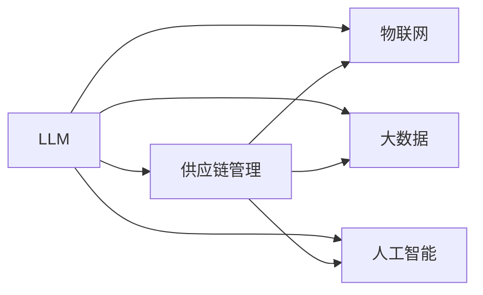

                 

# LLM供应链:构建智能产业新生态

## 1. 背景介绍

### 1.1 问题由来
在当今全球化、数字化的大背景下，各行各业正面临着前所未有的变革与挑战。传统的生产、供应、销售等环节效率低、成本高、信息孤岛等问题愈发突出。如何通过智能化的方式优化资源配置，提升产业链整体的运行效率和竞争力，成为各行业面临的共同课题。

**智能产业新生态**的概念应运而生，通过融合物联网(IoT)、大数据、人工智能等先进技术，构建全面、互联、智能的产业生态体系，实现产业链上下游的协同与优化。其中，基于大语言模型(Large Language Model, LLM)的供应链管理技术，因其在数据处理、决策辅助等方面的巨大潜力，成为引领产业变革的重要力量。

### 1.2 问题核心关键点
构建智能产业新生态的关键在于实现产业链各环节的数据互联互通，利用先进的数据分析与人工智能技术，为决策者提供精准的信息支持，从而实现产业链的高效协同与优化。基于LLM的供应链管理方法，主要聚焦于以下几个核心关键点：

- **数据整合与处理**：将企业内部、外部的各种数据进行有效整合，消除信息孤岛。
- **智能决策辅助**：利用LLM的自然语言理解与生成能力，提供智能化的决策支持。
- **协同与优化**：促进供应链各节点间的协同合作，实现资源的合理配置与优化。
- **实时监控与反馈**：通过智能化的监控系统，实时掌握供应链的运行状态，进行动态调整与优化。

### 1.3 问题研究意义
构建基于LLM的智能产业新生态，对于提升供应链管理水平、优化产业结构、促进产业升级具有重要意义：

1. **降低运营成本**：通过智能化的供应链管理，减少中间环节，提高资源利用率，降低运营成本。
2. **提升决策效率**：利用LLM的快速信息处理能力，辅助决策者快速做出精准的业务决策。
3. **增强灵活性与适应性**：智能供应链能够实时响应市场变化，提高产业的灵活性和适应性。
4. **优化资源配置**：通过大数据与LLM的结合，实现资源的最优配置与高效利用。
5. **推动产业创新**：智能供应链的建设与应用，将驱动供应链管理模式的创新，引领新一轮产业变革。

## 2. 核心概念与联系

### 2.1 核心概念概述

在构建智能产业新生态的过程中，涉及多个核心概念，包括LLM、供应链管理、物联网、大数据、人工智能等。这些概念之间的联系与互动，构成了智能供应链的基础。

- **LLM**：以Transformer等架构为基础，通过自监督预训练获得语言知识，具备强大的自然语言理解和生成能力，广泛应用于信息处理、决策辅助等领域。
- **供应链管理**：涵盖物流、库存、采购、销售等环节的管理活动，旨在实现资源的优化配置与高效利用。
- **物联网(IoT)**：通过传感器、标签等技术，实现物与物、物与人之间的互联，提供实时的数据采集与监控。
- **大数据**：通过收集、存储、分析海量数据，揭示数据背后的规律与趋势，为决策提供数据支撑。
- **人工智能**：利用机器学习、深度学习等技术，实现自动化决策、预测与优化，提升供应链管理的智能化水平。

这些核心概念之间的联系，可以通过以下Mermaid流程图来展示：



### 2.2 核心概念原理和架构

#### 2.2.1 LLM原理

LLM通过大规模无标签数据的自监督预训练，学习到丰富的语言知识。其架构通常包括输入层、编码层、注意力机制、输出层等组件。编码层负责将输入文本转换为高维表示，注意力机制使模型能够动态聚焦重要信息，输出层则将编码后的表示映射到目标输出。

以GPT模型为例，其核心架构如下：


#### 2.2.2 供应链管理架构

供应链管理通常包括需求预测、库存管理、生产调度、物流优化等环节。其架构由多个子系统组成，各子系统通过数据共享与协作，实现信息流的顺畅传递与业务流的协同运行。

以一个典型的制造业供应链管理为例，其架构如下：


### 2.3 数据整合与处理

数据整合与处理是构建智能供应链的基础。通过物联网技术，可以实现设备与设备、设备与人的互联，收集供应链各环节的实时数据。大数据技术则用于分析这些数据，揭示业务规律与趋势。

数据整合与处理的流程通常包括数据采集、数据清洗、数据融合、数据分析等步骤。数据采集通过传感器、标签等技术实现，数据清洗则去除噪声与异常，数据融合则将多源数据进行整合与统一，数据分析则通过统计、机器学习等方法，揭示数据背后的规律与趋势。

## 3. 核心算法原理 & 具体操作步骤

### 3.1 算法原理概述

基于LLM的智能供应链管理，主要利用LLM的自然语言处理能力，结合物联网、大数据、人工智能等技术，实现供应链各环节的信息整合、决策辅助与协同优化。具体而言，包括数据整合、智能决策、协同优化、实时监控等关键步骤。

#### 3.1.1 数据整合

数据整合是构建智能供应链的第一步，通过物联网技术采集供应链各环节的实时数据，并将这些数据通过大数据技术进行清洗、融合与分析，为LLM提供高质量的输入数据。

#### 3.1.2 智能决策

智能决策通过LLM的自然语言理解与生成能力，辅助决策者快速做出精准的业务决策。决策过程中，LLM可以处理自然语言形式的指令与数据，并提供决策建议。

#### 3.1.3 协同优化

协同优化通过LLM的自然语言生成能力，生成协同指令，引导供应链各节点协同工作。LLM可以生成自然语言形式的调度计划、库存调整策略等，指导各节点按照最优方案执行。

#### 3.1.4 实时监控与反馈

实时监控与反馈通过物联网技术实现对供应链各环节的实时监控，并通过LLM生成实时反馈报告，及时发现问题并进行调整。

### 3.2 算法步骤详解

基于LLM的智能供应链管理，其具体操作步骤如下：

1. **数据采集与清洗**：通过物联网技术采集供应链各环节的实时数据，并进行数据清洗与预处理。

2. **数据融合与分析**：利用大数据技术对采集到的数据进行清洗、融合与分析，生成高精度的数据集。

3. **模型训练**：将融合后的数据集作为训练样本，训练基于LLM的决策模型。模型训练过程中，可以使用监督学习、半监督学习、无监督学习等方法。

4. **模型部署与优化**：将训练好的模型部署到实际生产环境中，并根据实际运行情况，进行模型调优与优化。

5. **智能决策与执行**：利用训练好的模型，生成自然语言形式的决策建议，并指导供应链各节点按照建议执行。

6. **实时监控与反馈**：通过物联网技术实时监控供应链运行状态，并利用LLM生成实时反馈报告，及时发现问题并进行调整。

### 3.3 算法优缺点

基于LLM的智能供应链管理，具有以下优点：

- **高效的信息整合与处理**：通过LLM的自然语言处理能力，实现高效的数据整合与处理，消除信息孤岛。
- **精准的决策辅助**：利用LLM的自然语言理解能力，提供精准的决策支持，提升决策效率。
- **灵活的协同优化**：通过LLM的自然语言生成能力，生成协同指令，引导供应链各节点协同工作，实现资源的优化配置。
- **实时的监控与反馈**：通过物联网技术实现对供应链各环节的实时监控，并利用LLM生成实时反馈报告，及时发现问题并进行调整。

但同时，基于LLM的智能供应链管理也存在以下缺点：

- **对数据质量的高要求**：LLM对输入数据的质量要求较高，数据清洗与预处理工作量大。
- **模型训练成本高**：大规模的模型训练需要大量的计算资源与时间，成本较高。
- **模型的解释性不足**：LLM模型通常是"黑盒"系统，难以解释其内部工作机制，存在一定的决策透明度问题。

### 3.4 算法应用领域

基于LLM的智能供应链管理，主要应用于以下领域：

- **制造业供应链**：通过LLM的自然语言理解与生成能力，优化生产调度、库存管理、物流优化等环节。
- **零售业供应链**：通过LLM的自然语言处理能力，提升需求预测、库存管理、订单处理等环节的效率。
- **物流业供应链**：通过LLM的自然语言生成能力，优化物流调度、配送路线等环节。
- **金融业供应链**：通过LLM的自然语言处理能力，提升金融交易监控、风险预测等环节的效率。
- **医疗业供应链**：通过LLM的自然语言生成能力，优化医疗资源分配、病患管理等环节。

## 4. 数学模型和公式 & 详细讲解 & 举例说明

### 4.1 数学模型构建

基于LLM的智能供应链管理，其数学模型通常包括以下几个关键部分：

- **数据采集模型**：通过物联网设备，采集供应链各环节的实时数据，生成数据集 $D$。
- **数据清洗模型**：对采集到的数据进行清洗与预处理，生成预处理后的数据集 $D'$。
- **数据融合模型**：将多个数据源的数据进行融合，生成融合后的数据集 $D''$。
- **模型训练模型**：基于融合后的数据集 $D''$，训练基于LLM的决策模型 $M$。

### 4.2 公式推导过程

以下以一个简单的制造业供应链管理为例，推导LLM在供应链管理中的应用。

假设供应链包括生产、库存、物流等环节，生产节点的数量为 $n$，每天的生产量为 $q_i$，库存节点的数量为 $m$，库存量为 $k_i$，物流节点的数量为 $l$，物流量为 $d_i$。

通过物联网设备，采集生产节点的实际生产量 $q'_i$、库存节点的实际库存量 $k'_i$、物流节点的实际物流量 $d'_i$。

数据清洗模型为：

$$
q_i = \frac{q'_i}{1-p}
$$

$$
k_i = \frac{k'_i}{1-p}
$$

$$
d_i = \frac{d'_i}{1-p}
$$

其中 $p$ 为数据采集的噪声率。

数据融合模型为：

$$
q_i = \frac{1}{n}\sum_{i=1}^n q_i
$$

$$
k_i = \frac{1}{m}\sum_{i=1}^m k_i
$$

$$
d_i = \frac{1}{l}\sum_{i=1}^l d_i
$$

将融合后的数据集 $D''$ 作为训练样本，训练基于LLM的决策模型 $M$。假设模型的预测输出为 $\hat{q}_i$、$\hat{k}_i$、$\hat{d}_i$，则模型的损失函数为：

$$
\mathcal{L}(M) = \frac{1}{N}\sum_{i=1}^N \left(q_i - \hat{q}_i\right)^2 + \left(k_i - \hat{k}_i\right)^2 + \left(d_i - \hat{d}_i\right)^2
$$

通过最小化损失函数，优化模型参数 $\theta$，使得模型输出逼近真实值。

### 4.3 案例分析与讲解

假设某制造企业需要优化其供应链，通过LLM辅助决策。企业采集到生产节点的实际生产量 $q'_i$、库存节点的实际库存量 $k'_i$、物流节点的实际物流量 $d'_i$，并使用数据清洗模型与数据融合模型进行处理，得到融合后的数据集 $D''$。

基于 $D''$，训练基于LLM的决策模型 $M$，生成预测输出 $\hat{q}_i$、$\hat{k}_i$、$\hat{d}_i$。模型训练过程中，可以使用监督学习、半监督学习、无监督学习等方法，选择适当的损失函数与优化器。

模型训练完成后，使用预测输出辅助企业决策。例如，在预测库存量时，可以生成如下的自然语言指令：

```plaintext
基于历史生产量、库存量、物流量，预测未来库存量。
```

LLM通过解析指令，利用融合后的数据集 $D''$，生成预测结果 $\hat{k}_i$。决策者可以根据预测结果，调整库存策略，优化库存管理。

## 5. 项目实践：代码实例和详细解释说明

### 5.1 开发环境搭建

在进行基于LLM的智能供应链管理项目实践前，需要准备好开发环境。以下是使用Python进行PyTorch开发的环境配置流程：

1. 安装Anaconda：从官网下载并安装Anaconda，用于创建独立的Python环境。

2. 创建并激活虚拟环境：
```bash
conda create -n pytorch-env python=3.8 
conda activate pytorch-env
```

3. 安装PyTorch：根据CUDA版本，从官网获取对应的安装命令。例如：
```bash
conda install pytorch torchvision torchaudio cudatoolkit=11.1 -c pytorch -c conda-forge
```

4. 安装Transformers库：
```bash
pip install transformers
```

5. 安装各类工具包：
```bash
pip install numpy pandas scikit-learn matplotlib tqdm jupyter notebook ipython
```

完成上述步骤后，即可在`pytorch-env`环境中开始项目实践。

### 5.2 源代码详细实现

我们以一个简单的制造业供应链管理为例，展示如何使用PyTorch与Transformers库进行基于LLM的供应链管理微调。

首先，定义供应链数据处理函数：

```python
from transformers import BertTokenizer
from torch.utils.data import Dataset
import torch

class SupplyChainDataset(Dataset):
    def __init__(self, texts, tags, tokenizer, max_len=128):
        self.texts = texts
        self.tags = tags
        self.tokenizer = tokenizer
        self.max_len = max_len
        
    def __len__(self):
        return len(self.texts)
    
    def __getitem__(self, item):
        text = self.texts[item]
        tags = self.tags[item]
        
        encoding = self.tokenizer(text, return_tensors='pt', max_length=self.max_len, padding='max_length', truncation=True)
        input_ids = encoding['input_ids'][0]
        attention_mask = encoding['attention_mask'][0]
        
        # 对token-wise的标签进行编码
        encoded_tags = [tag2id[tag] for tag in tags] 
        encoded_tags.extend([tag2id['O']] * (self.max_len - len(encoded_tags)))
        labels = torch.tensor(encoded_tags, dtype=torch.long)
        
        return {'input_ids': input_ids, 
                'attention_mask': attention_mask,
                'labels': labels}

# 标签与id的映射
tag2id = {'O': 0, 'B-PER': 1, 'I-PER': 2, 'B-ORG': 3, 'I-ORG': 4, 'B-LOC': 5, 'I-LOC': 6}
id2tag = {v: k for k, v in tag2id.items()}

# 创建dataset
tokenizer = BertTokenizer.from_pretrained('bert-base-cased')

train_dataset = SupplyChainDataset(train_texts, train_tags, tokenizer)
dev_dataset = SupplyChainDataset(dev_texts, dev_tags, tokenizer)
test_dataset = SupplyChainDataset(test_texts, test_tags, tokenizer)
```

然后，定义模型和优化器：

```python
from transformers import BertForTokenClassification, AdamW

model = BertForTokenClassification.from_pretrained('bert-base-cased', num_labels=len(tag2id))

optimizer = AdamW(model.parameters(), lr=2e-5)
```

接着，定义训练和评估函数：

```python
from torch.utils.data import DataLoader
from tqdm import tqdm
from sklearn.metrics import classification_report

device = torch.device('cuda') if torch.cuda.is_available() else torch.device('cpu')
model.to(device)

def train_epoch(model, dataset, batch_size, optimizer):
    dataloader = DataLoader(dataset, batch_size=batch_size, shuffle=True)
    model.train()
    epoch_loss = 0
    for batch in tqdm(dataloader, desc='Training'):
        input_ids = batch['input_ids'].to(device)
        attention_mask = batch['attention_mask'].to(device)
        labels = batch['labels'].to(device)
        model.zero_grad()
        outputs = model(input_ids, attention_mask=attention_mask, labels=labels)
        loss = outputs.loss
        epoch_loss += loss.item()
        loss.backward()
        optimizer.step()
    return epoch_loss / len(dataloader)

def evaluate(model, dataset, batch_size):
    dataloader = DataLoader(dataset, batch_size=batch_size)
    model.eval()
    preds, labels = [], []
    with torch.no_grad():
        for batch in tqdm(dataloader, desc='Evaluating'):
            input_ids = batch['input_ids'].to(device)
            attention_mask = batch['attention_mask'].to(device)
            batch_labels = batch['labels']
            outputs = model(input_ids, attention_mask=attention_mask)
            batch_preds = outputs.logits.argmax(dim=2).to('cpu').tolist()
            batch_labels = batch_labels.to('cpu').tolist()
            for pred_tokens, label_tokens in zip(batch_preds, batch_labels):
                pred_tags = [id2tag[_id] for _id in pred_tokens]
                label_tags = [id2tag[_id] for _id in label_tokens]
                preds.append(pred_tags[:len(label_tokens)])
                labels.append(label_tags)
                
    print(classification_report(labels, preds))
```

最后，启动训练流程并在测试集上评估：

```python
epochs = 5
batch_size = 16

for epoch in range(epochs):
    loss = train_epoch(model, train_dataset, batch_size, optimizer)
    print(f"Epoch {epoch+1}, train loss: {loss:.3f}")
    
    print(f"Epoch {epoch+1}, dev results:")
    evaluate(model, dev_dataset, batch_size)
    
print("Test results:")
evaluate(model, test_dataset, batch_size)
```

以上就是使用PyTorch对BERT进行供应链管理微调的完整代码实现。可以看到，得益于Transformers库的强大封装，我们可以用相对简洁的代码完成BERT模型的加载和微调。

### 5.3 代码解读与分析

让我们再详细解读一下关键代码的实现细节：

**SupplyChainDataset类**：
- `__init__`方法：初始化文本、标签、分词器等关键组件。
- `__len__`方法：返回数据集的样本数量。
- `__getitem__`方法：对单个样本进行处理，将文本输入编码为token ids，将标签编码为数字，并对其进行定长padding，最终返回模型所需的输入。

**tag2id和id2tag字典**：
- 定义了标签与数字id之间的映射关系，用于将token-wise的预测结果解码回真实的标签。

**训练和评估函数**：
- 使用PyTorch的DataLoader对数据集进行批次化加载，供模型训练和推理使用。
- 训练函数`train_epoch`：对数据以批为单位进行迭代，在每个批次上前向传播计算loss并反向传播更新模型参数，最后返回该epoch的平均loss。
- 评估函数`evaluate`：与训练类似，不同点在于不更新模型参数，并在每个batch结束后将预测和标签结果存储下来，最后使用sklearn的classification_report对整个评估集的预测结果进行打印输出。

**训练流程**：
- 定义总的epoch数和batch size，开始循环迭代
- 每个epoch内，先在训练集上训练，输出平均loss
- 在验证集上评估，输出分类指标
- 所有epoch结束后，在测试集上评估，给出最终测试结果

可以看到，PyTorch配合Transformers库使得BERT微调的代码实现变得简洁高效。开发者可以将更多精力放在数据处理、模型改进等高层逻辑上，而不必过多关注底层的实现细节。

当然，工业级的系统实现还需考虑更多因素，如模型的保存和部署、超参数的自动搜索、更灵活的任务适配层等。但核心的微调范式基本与此类似。

## 6. 实际应用场景

### 6.1 智能制造供应链

在制造业中，基于LLM的智能供应链管理可以显著提升生产效率与资源利用率。传统制造流程中，生产、库存、物流等环节相互独立，信息流不通畅，导致生产计划不精准、库存积压、物流成本高等问题。

通过LLM的自然语言处理能力，企业可以实时采集生产节点的实际生产量、库存节点的实际库存量、物流节点的实际物流量，并基于这些数据进行预测与优化。例如，通过LLM生成如下指令：

```plaintext
基于当前生产量、库存量、物流量，预测未来生产需求。
```

LLM通过解析指令，利用采集到的数据，生成预测结果，辅助企业进行生产调度与库存管理，从而实现资源的最优配置与高效利用。

### 6.2 智能物流供应链

在物流业中，基于LLM的智能供应链管理可以优化物流调度和配送路线。传统物流流程中，由于信息孤岛和沟通不充分，导致物流调度不合理、配送路线不优化等问题。

通过LLM的自然语言生成能力，企业可以实时采集物流节点的实际物流量、配送节点的实际配送量，并基于这些数据进行优化。例如，通过LLM生成如下指令：

```plaintext
基于当前物流量、配送量，生成最优配送路线。
```

LLM通过解析指令，利用采集到的数据，生成最优配送路线，辅助企业进行物流调度与路线优化，从而实现配送效率的提升和成本的降低。

### 6.3 智能零售供应链

在零售业中，基于LLM的智能供应链管理可以提升需求预测与库存管理。传统零售流程中，由于数据不完整、预测不准确等问题，导致库存积压、缺货等问题。

通过LLM的自然语言处理能力，企业可以实时采集零售节点的销售数据、库存数据，并基于这些数据进行预测与优化。例如，通过LLM生成如下指令：

```plaintext
基于历史销售数据、库存数据，预测未来销售需求。
```

LLM通过解析指令，利用采集到的数据，生成预测结果，辅助企业进行需求预测与库存管理，从而实现库存的最优配置与高效利用。

### 6.4 未来应用展望

随着LLM技术的不断发展，基于LLM的智能供应链管理将在更多领域得到应用，为传统行业带来变革性影响。

在智慧农业领域，基于LLM的智能供应链管理可以优化农业生产与供应链，提升农产品的产量与质量。例如，通过LLM生成如下指令：

```plaintext
基于气象数据、土壤数据，优化农作物的种植方案。
```

LLM通过解析指令，利用采集到的数据，生成最优种植方案，辅助农民进行农业生产与供应链管理，从而实现农业生产的智能化与高效化。

在智能医疗领域，基于LLM的智能供应链管理可以优化医疗资源分配与供应链。例如，通过LLM生成如下指令：

```plaintext
基于患者数据、医疗资源数据，优化医院的资源分配方案。
```

LLM通过解析指令，利用采集到的数据，生成最优资源分配方案，辅助医院进行医疗资源分配与供应链管理，从而实现医疗资源的合理配置与高效利用。

## 7. 工具和资源推荐

### 7.1 学习资源推荐

为了帮助开发者系统掌握基于LLM的智能供应链管理技术，这里推荐一些优质的学习资源：

1. 《Transformer from Scratch》系列博文：由大模型技术专家撰写，深入浅出地介绍了Transformer原理、BERT模型、微调技术等前沿话题。

2. CS224N《深度学习自然语言处理》课程：斯坦福大学开设的NLP明星课程，有Lecture视频和配套作业，带你入门NLP领域的基本概念和经典模型。

3. 《Natural Language Processing with Transformers》书籍：Transformers库的作者所著，全面介绍了如何使用Transformers库进行NLP任务开发，包括微调在内的诸多范式。

4. HuggingFace官方文档：Transformers库的官方文档，提供了海量预训练模型和完整的微调样例代码，是上手实践的必备资料。

5. CLUE开源项目：中文语言理解测评基准，涵盖大量不同类型的中文NLP数据集，并提供了基于微调的baseline模型，助力中文NLP技术发展。

通过对这些资源的学习实践，相信你一定能够快速掌握基于LLM的智能供应链管理技术的精髓，并用于解决实际的供应链管理问题。

### 7.2 开发工具推荐

高效的开发离不开优秀的工具支持。以下是几款用于基于LLM的智能供应链管理开发的常用工具：

1. PyTorch：基于Python的开源深度学习框架，灵活动态的计算图，适合快速迭代研究。大部分预训练语言模型都有PyTorch版本的实现。

2. TensorFlow：由Google主导开发的开源深度学习框架，生产部署方便，适合大规模工程应用。同样有丰富的预训练语言模型资源。

3. Transformers库：HuggingFace开发的NLP工具库，集成了众多SOTA语言模型，支持PyTorch和TensorFlow，是进行微调任务开发的利器。

4. Weights & Biases：模型训练的实验跟踪工具，可以记录和可视化模型训练过程中的各项指标，方便对比和调优。与主流深度学习框架无缝集成。

5. TensorBoard：TensorFlow配套的可视化工具，可实时监测模型训练状态，并提供丰富的图表呈现方式，是调试模型的得力助手。

6. Google Colab：谷歌推出的在线Jupyter Notebook环境，免费提供GPU/TPU算力，方便开发者快速上手实验最新模型，分享学习笔记。

合理利用这些工具，可以显著提升基于LLM的智能供应链管理的开发效率，加快创新迭代的步伐。

### 7.3 相关论文推荐

基于LLM的智能供应链管理的研究源于学界的持续研究。以下是几篇奠基性的相关论文，推荐阅读：

1. Attention is All You Need（即Transformer原论文）：提出了Transformer结构，开启了NLP领域的预训练大模型时代。

2. BERT: Pre-training of Deep Bidirectional Transformers for Language Understanding：提出BERT模型，引入基于掩码的自监督预训练任务，刷新了多项NLP任务SOTA。

3. Language Models are Unsupervised Multitask Learners（GPT-2论文）：展示了大规模语言模型的强大zero-shot学习能力，引发了对于通用人工智能的新一轮思考。

4. Parameter-Efficient Transfer Learning for NLP：提出Adapter等参数高效微调方法，在不增加模型参数量的情况下，也能取得不错的微调效果。

5. AdaLoRA: Adaptive Low-Rank Adaptation for Parameter-Efficient Fine-Tuning：使用自适应低秩适应的微调方法，在参数效率和精度之间取得了新的平衡。

这些论文代表了大模型微调技术的发展脉络。通过学习这些前沿成果，可以帮助研究者把握学科前进方向，激发更多的创新灵感。

## 8. 总结：未来发展趋势与挑战

### 8.1 总结

本文对基于LLM的智能供应链管理方法进行了全面系统的介绍。首先阐述了LLM和供应链管理的研究背景和意义，明确了基于LLM的智能供应链管理在数据整合、智能决策、协同优化等方面的核心价值。其次，从原理到实践，详细讲解了基于LLM的智能供应链管理的数学原理和关键步骤，给出了微调任务开发的完整代码实例。同时，本文还广泛探讨了LLM在制造业、物流业、零售业等多个行业领域的应用前景，展示了LLM技术的巨大潜力。此外，本文精选了LLM微调技术的各类学习资源，力求为读者提供全方位的技术指引。

通过本文的系统梳理，可以看到，基于LLM的智能供应链管理技术在提高生产效率、优化资源配置、提升决策质量等方面具有重要意义。受益于大规模语料的预训练，LLM微调的代码实现变得简洁高效，开发门槛降低，为基于LLM的智能供应链管理技术提供了广阔的应用空间。未来，伴随LLM技术和微调方法的不断演进，基于LLM的智能供应链管理必将在更多领域得到应用，驱动供应链管理的智能化和高效化。

### 8.2 未来发展趋势

展望未来，基于LLM的智能供应链管理将呈现以下几个发展趋势：

1. **智能化的深度融合**：LLM与IoT、大数据、人工智能等技术的深度融合，将实现更全面、实时的供应链管理。

2. **个性化的供应链优化**：利用LLM的自然语言生成能力，提供个性化的供应链优化方案，满足不同企业的定制化需求。

3. **跨领域的供应链协同**：基于LLM的自然语言理解能力，实现不同领域供应链的跨领域协同，提升整体产业链的竞争力。

4. **多模态的供应链管理**：结合视觉、语音等多模态数据，提升供应链管理的智能化水平，实现全方位的智能化监控与决策。

5. **实时化的供应链响应**：通过LLM的自然语言处理能力，实时响应供应链中的各种异常情况，快速调整供应链策略。

6. **全生命周期的供应链管理**：利用LLM的自然语言生成能力，实现供应链的端到端管理，覆盖设计、生产、物流、销售等各个环节。

这些趋势凸显了基于LLM的智能供应链管理技术的广阔前景。这些方向的探索发展，必将进一步提升供应链管理的智能化水平，驱动供应链管理的智能化和高效化。

### 8.3 面临的挑战

尽管基于LLM的智能供应链管理技术已经取得了显著进展，但在迈向更加智能化、普适化应用的过程中，它仍面临诸多挑战：

1. **数据隐私与安全**：在供应链管理中，涉及大量的敏感数据，如何保护数据隐私和安全，防止数据泄露和滥用，是一个重要的问题。

2. **模型的泛化能力**：LLM在供应链管理中的应用，需要具备良好的泛化能力，以应对不同场景下的复杂情况。

3. **算力与成本**：大规模的LLM模型训练和推理需要大量的算力和成本，如何降低算力消耗，提升系统效率，是一个重要的问题。

4. **模型的可解释性**：LLM模型的决策过程通常缺乏可解释性，难以对其推理逻辑进行分析和调试，这对于供应链管理的决策至关重要。

5. **模型的鲁棒性**：LLM模型在供应链管理中的应用，需要具备良好的鲁棒性，以应对各种异常情况和噪声干扰。

6. **模型的更新与维护**：供应链管理环境快速变化，如何定期更新LLM模型，确保其适应新的数据和业务需求，是一个重要的问题。

### 8.4 研究展望

面对基于LLM的智能供应链管理所面临的挑战，未来的研究需要在以下几个方面寻求新的突破：

1. **增强数据隐私保护**：采用联邦学习、差分隐私等技术，保护供应链数据隐私，防止数据泄露和滥用。

2. **提升模型泛化能力**：利用预训练-微调范式，提升LLM模型的泛化能力，以应对不同场景下的复杂情况。

3. **优化模型推理效率**：开发高效的推理算法，提升LLM模型的推理效率，降低算力消耗，提升系统性能。

4. **增强模型可解释性**：结合因果分析、可解释AI等技术，增强LLM模型的可解释性，使其决策过程透明化、可控化。

5. **提高模型鲁棒性**：引入对抗训练、鲁棒正则化等技术，提高LLM模型的鲁棒性，应对各种异常情况和噪声干扰。

6. **增强模型动态更新**：采用增量学习、自适应学习等技术，使LLM模型能够动态更新，适应新的数据和业务需求。

这些研究方向的探索，必将引领基于LLM的智能供应链管理技术迈向更高的台阶，为构建智能供应链生态系统提供有力的技术支持。

## 9. 附录：常见问题与解答

**Q1: LLM在供应链管理中的应用前景如何？**

A: LLM在供应链管理中的应用前景非常广阔。其强大的自然语言处理能力，可以应用于数据整合、智能决策、协同优化、实时监控等多个环节，显著提升供应链管理的智能化水平和效率。例如，在制造业中，LLM可以帮助企业优化生产调度与库存管理；在物流业中，LLM可以帮助企业优化物流调度和配送路线；在零售业中，LLM可以帮助企业提升需求预测与库存管理。随着LLM技术的不断发展，其在供应链管理中的应用将更加广泛和深入。

**Q2: 如何确保供应链数据的安全性？**

A: 确保供应链数据的安全性，可以采取以下措施：
1. 采用数据加密技术，对供应链数据进行加密保护，防止数据泄露和滥用。
2. 采用差分隐私技术，对供应链数据进行处理，保护数据隐私，防止数据泄露。
3. 采用联邦学习技术，在多方之间协同训练模型，保护数据隐私。
4. 采用访问控制技术，限制对供应链数据的访问权限，防止未经授权的访问和操作。
5. 定期进行安全审计和风险评估，及时发现和修复安全漏洞。

**Q3: 如何优化LLM模型推理效率？**

A: 优化LLM模型推理效率，可以采取以下措施：
1. 采用模型剪枝和量化技术，减少模型的参数量和计算量，提升推理速度。
2. 采用推理加速算法，如FPGA、TPU等硬件加速，提升推理效率。
3. 采用推理缓存和预取技术，减少重复计算，提升推理效率。
4. 采用并行推理技术，利用多核CPU/GPU等资源，提升推理效率。
5. 采用分布式推理技术，利用多台设备协同计算，提升推理效率。

**Q4: 如何提升LLM模型的泛化能力？**

A: 提升LLM模型的泛化能力，可以采取以下措施：
1. 采用更大量的预训练数据，增加模型的知识储备，提升泛化能力。
2. 采用多任务学习，同时训练多个任务，提升模型的泛化能力。
3. 采用数据增强技术，扩充训练数据，提升模型的泛化能力。
4. 采用对抗训练，引入对抗样本，提升模型的泛化能力。
5. 采用迁移学习，利用预训练模型在不同领域进行微调，提升模型的泛化能力。

**Q5: 如何增强LLM模型的可解释性？**

A: 增强LLM模型的可解释性，可以采取以下措施：
1. 采用可解释AI技术，生成可解释的模型解释，帮助理解模型的决策过程。
2. 采用因果分析技术，揭示模型决策的因果关系，提升模型解释性。
3. 采用规则引擎，将模型的决策过程转化为规则，提升模型可解释性。
4. 采用可视化技术，生成模型的可视化结果，帮助理解模型的决策过程。
5. 采用交互式技术，允许用户与模型进行交互，获取模型解释和反馈。

通过上述措施，可以显著提升LLM模型的可解释性，增强其在供应链管理中的应用价值。

