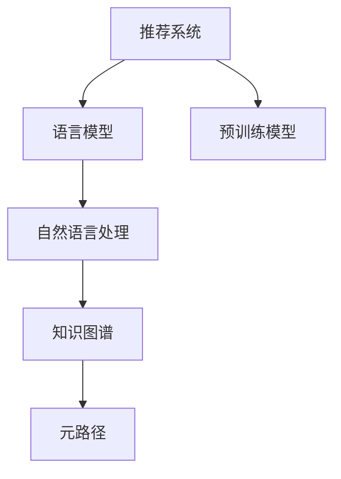

                 

# LLM在推荐系统中的元路径挖掘应用

> 关键词：推荐系统, 元路径, 自然语言处理, 深度学习, 自然语言处理, 预训练模型

## 1. 背景介绍

### 1.1 问题由来
推荐系统是互联网领域中的重要技术，旨在通过个性化推荐满足用户个性化需求，提升用户体验。传统的推荐系统主要基于协同过滤和内容推荐两种方式，前者利用用户行为数据进行推荐，后者则从内容的角度出发，根据用户画像推荐相似的内容。然而，随着数据量的增加和用户需求的个性化，这两种方法都面临着一定的局限性。近年来，基于自然语言处理(NLP)技术的新型推荐方法逐渐受到关注。其中，基于语言模型推荐方法以其高效、灵活、可解释性强的特点，成为推荐系统研究的新方向。

## 2. 核心概念与联系

### 2.1 核心概念概述

为了更好地理解基于语言模型推荐系统的方法，首先需要对以下几个关键概念进行阐述：

- **推荐系统(Recommendation System)**：通过分析用户的历史行为数据和兴趣偏好，为用户推荐其可能感兴趣的商品、内容、服务等。
- **语言模型(Language Model)**：利用深度学习技术，通过大量文本数据训练而成的模型，用于理解语言的含义、语境和生成新的语言文本。
- **预训练模型(Pre-trained Model)**：通过在大规模无标签文本语料上进行自监督学习任务训练的模型，如BERT、GPT等，具有一定的语言理解和生成能力。
- **元路径(Meta-path)**：在图数据结构中，描述节点之间关系的一种模式，如用户-物品、用户-用户等。
- **自然语言处理(NLP)**：涉及语言学、计算机科学等多个学科的交叉领域，旨在使计算机能够理解、处理和生成自然语言。
- **知识图谱(Knowledge Graph)**：通过RDF三元组形式表示的知识库，用于存储和查询实体之间的关系。

这些概念之间的关系可以通过以下Mermaid流程图来展示：



这个流程图展示了推荐系统、语言模型、预训练模型、自然语言处理、知识图谱和元路径之间的关系：

1. 推荐系统通过分析用户的历史行为数据，为用户推荐商品、内容等。
2. 语言模型利用预训练模型，提升推荐系统对用户描述和商品描述的理解。
3. 自然语言处理对用户行为数据进行语义理解和特征提取。
4. 知识图谱用于存储商品之间的实体关系，增强推荐系统的跨领域知识能力。
5. 元路径用于描述用户与物品之间的多维关系，增强推荐系统的推荐精度。

这些概念共同构成了基于语言模型的推荐系统框架，使得推荐系统能够更好地理解用户需求，提供更加个性化、精准的推荐结果。

## 3. 核心算法原理 & 具体操作步骤
### 3.1 算法原理概述

基于语言模型的推荐系统主要利用预训练语言模型，结合元路径挖掘技术，构建用户与物品之间的多维关系图，从而提升推荐系统的推荐精度。其核心思想是：

- 将用户描述和物品描述转化为向量表示，并通过预训练语言模型进行语义理解。
- 利用元路径挖掘技术，构建用户与物品之间的多维关系图。
- 结合知识图谱中的跨领域知识，增强推荐系统的跨领域推荐能力。
- 通过多维关系图进行推荐，提升推荐精度和泛化能力。

### 3.2 算法步骤详解

基于语言模型的推荐系统主要包括以下几个关键步骤：

**Step 1: 数据准备**
- 收集用户的历史行为数据，如浏览、点击、购买等行为。
- 收集商品的相关描述信息，如商品标题、描述、属性等。
- 构建用户与物品之间关系图，即元路径。

**Step 2: 预训练语言模型**
- 使用预训练语言模型(BERT、GPT等)对用户描述和商品描述进行语义理解。
- 将用户描述和商品描述转化为向量表示，用于后续计算。

**Step 3: 元路径挖掘**
- 利用元路径挖掘技术，构建用户与物品之间的多维关系图。
- 使用图神经网络(Graph Neural Network, GNN)等方法，对多维关系图进行计算和推理。

**Step 4: 知识图谱融合**
- 利用知识图谱中的跨领域知识，增强推荐系统的跨领域推荐能力。
- 将知识图谱中的实体关系融合到推荐系统中，提高推荐精度。

**Step 5: 推荐计算**
- 利用多维关系图和知识图谱中的跨领域知识，进行推荐计算。
- 结合用户的个性化需求，生成个性化推荐结果。

**Step 6: 推荐结果反馈**
- 将推荐结果反馈给用户，收集用户反馈信息。
- 利用用户反馈信息，进一步优化推荐系统。

### 3.3 算法优缺点

基于语言模型的推荐系统具有以下优点：
1. 高效性：利用预训练语言模型的强大语义理解能力，能够快速处理大量的用户行为数据。
2. 可解释性：预训练语言模型的训练过程和参数可解释，能够提供推荐结果的详细解释。
3. 泛化能力：通过融合知识图谱中的跨领域知识，增强推荐系统的泛化能力，适用于多种推荐场景。
4. 灵活性：利用元路径挖掘技术，能够构建用户与物品之间的多维关系图，灵活调整推荐策略。

同时，该方法也存在一定的局限性：
1. 数据需求高：需要大量的用户行为数据和商品描述数据，数据获取难度较大。
2. 计算复杂度大：预训练语言模型的计算复杂度高，需要大量的计算资源。
3. 跨领域知识获取难：知识图谱中的跨领域知识获取难度较大，需要大量的人工标注和构建。
4. 泛化效果不稳定：推荐系统的泛化效果受数据质量和数量的影响较大，容易出现偏差。
5. 个性化推荐难度大：用户个性化需求难以准确捕捉，导致推荐结果与用户需求不匹配。

尽管存在这些局限性，但就目前而言，基于语言模型的推荐方法已经在大规模推荐系统中部署应用，取得了显著的效果。未来相关研究的重点在于如何进一步降低推荐系统对数据和计算资源的需求，提高模型的泛化能力和个性化推荐精度。

### 3.4 算法应用领域

基于语言模型的推荐系统已经在多个领域得到了广泛的应用，例如：

- 电商推荐：为电商网站的用户推荐商品。通过用户历史行为数据和商品描述，结合知识图谱中的商品关系，生成个性化推荐结果。
- 音乐推荐：为音乐平台用户推荐音乐。利用用户的听歌历史和音乐描述，构建用户与音乐之间的多维关系图，生成个性化推荐结果。
- 视频推荐：为用户推荐视频内容。通过用户观看历史和视频描述，构建用户与视频之间的多维关系图，生成个性化推荐结果。
- 新闻推荐：为用户推荐新闻文章。通过用户的浏览历史和新闻标题，构建用户与新闻之间的多维关系图，生成个性化推荐结果。

除了这些经典应用场景外，大语言模型推荐方法还在更多的领域得到了应用，如游戏推荐、旅游推荐、金融推荐等，为不同行业带来了创新的解决方案。随着预训练语言模型和推荐方法的不断进步，基于语言模型的推荐系统必将在更广阔的应用领域发挥更大的作用。

## 4. 数学模型和公式 & 详细讲解  
### 4.1 数学模型构建

本节将使用数学语言对基于语言模型的推荐系统进行更加严格的刻画。

记用户行为数据为 $D=\{(u_i,v_i)\}_{i=1}^N, u_i \in \mathcal{U}, v_i \in \mathcal{V}$，其中 $\mathcal{U}$ 为用户的集合，$\mathcal{V}$ 为物品的集合。记用户与物品之间的多维关系图为 $G=(\mathcal{U}, \mathcal{V}, E)$，其中 $E$ 为边的集合。

定义用户 $u$ 与物品 $v$ 之间的关系函数为 $R(u,v)$，例如：用户-物品、用户-用户等。利用预训练语言模型 $M_{\theta}$，将用户描述 $u$ 和物品描述 $v$ 转化为向量表示 $\mathbf{u} = M_{\theta}(u)$，$\mathbf{v} = M_{\theta}(v)$。

在构建用户与物品之间的多维关系图时，可以利用元路径挖掘技术，构建用户与物品之间的多维关系图 $G=(\mathcal{U}, \mathcal{V}, E)$。通过图神经网络等方法，计算每个节点的特征表示 $h_u, h_v$。

### 4.2 公式推导过程

以下我们以电商推荐为例，推导推荐计算的数学公式。

定义用户 $u$ 与物品 $v$ 之间的关系 $R(u,v)$ 为：

$$
R(u,v) = \langle \mathbf{u}, \mathbf{v} \rangle
$$

其中 $\langle \cdot, \cdot \rangle$ 表示向量的内积操作。

定义用户 $u$ 与物品 $v$ 之间的关系函数 $R(u,v)$ 为：

$$
R(u,v) = \text{sigmoid}(\langle \mathbf{u}, \mathbf{v} \rangle)
$$

其中 $\text{sigmoid}$ 为激活函数，将输出值映射到 $[0,1]$ 之间。

在构建用户与物品之间的多维关系图时，可以利用元路径挖掘技术，构建用户与物品之间的多维关系图 $G=(\mathcal{U}, \mathcal{V}, E)$。通过图神经网络等方法，计算每个节点的特征表示 $h_u, h_v$。

在计算用户 $u$ 与物品 $v$ 之间的关系 $R(u,v)$ 时，可以利用多维关系图 $G=(\mathcal{U}, \mathcal{V}, E)$ 中的路径信息，进一步提升推荐精度。例如，利用从用户 $u$ 到物品 $v$ 的路径 $P_{uv}$，可以得到：

$$
R(u,v) = \sum_{p \in P_{uv}} \alpha_p \cdot R(u,p) \cdot R(p,v)
$$

其中 $\alpha_p$ 为路径权重，根据路径长度等特征进行调整。

在计算用户 $u$ 的推荐结果时，可以利用用户与物品之间的关系 $R(u,v)$，结合知识图谱中的跨领域知识，生成个性化推荐结果。例如，通过知识图谱中的商品关系，可以得到：

$$
\text{Recommendation}(u) = \arg\max_{v \in \mathcal{V}} R(u,v) \cdot K(v)
$$

其中 $K(v)$ 为物品 $v$ 的跨领域知识表示，例如商品的热门度、评价等。

### 4.3 案例分析与讲解

假设有一个电商推荐系统，收集了用户的历史行为数据和商品描述信息。为了构建用户与物品之间的多维关系图，我们可以利用元路径挖掘技术，挖掘出用户与物品之间的关系。例如，可以利用用户与商品之间的点击关系，构建用户-商品关系图。

在构建用户-商品关系图时，我们可以利用图神经网络对节点进行特征表示计算。例如，可以使用GAT(Graph Attention Network)算法，计算用户 $u$ 和商品 $v$ 的特征表示 $h_u, h_v$：

$$
h_u = \mathbf{u} + \sum_{v \in \mathcal{V}} \alpha_{uv} \cdot (\mathbf{u} \cdot \mathbf{v})
$$

$$
h_v = \mathbf{v} + \sum_{u \in \mathcal{U}} \alpha_{uv} \cdot (\mathbf{u} \cdot \mathbf{v})
$$

其中 $\alpha_{uv}$ 为注意力系数，根据用户与商品的点击关系进行调整。

在计算用户 $u$ 与物品 $v$ 之间的关系 $R(u,v)$ 时，可以利用用户-商品关系图 $G=(\mathcal{U}, \mathcal{V}, E)$ 中的路径信息，进一步提升推荐精度。例如，利用从用户 $u$ 到商品 $v$ 的路径 $P_{uv}$，可以得到：

$$
R(u,v) = \sum_{p \in P_{uv}} \alpha_p \cdot R(u,p) \cdot R(p,v)
$$

其中 $\alpha_p$ 为路径权重，根据路径长度等特征进行调整。

在计算用户 $u$ 的推荐结果时，可以利用用户与物品之间的关系 $R(u,v)$，结合知识图谱中的跨领域知识，生成个性化推荐结果。例如，通过知识图谱中的商品关系，可以得到：

$$
\text{Recommendation}(u) = \arg\max_{v \in \mathcal{V}} R(u,v) \cdot K(v)
$$

其中 $K(v)$ 为商品 $v$ 的跨领域知识表示，例如商品的热门度、评价等。

## 5. 项目实践：代码实例和详细解释说明
### 5.1 开发环境搭建

在进行基于语言模型的推荐系统开发时，我们需要准备好开发环境。以下是使用Python进行PyTorch开发的环境配置流程：

1. 安装Anaconda：从官网下载并安装Anaconda，用于创建独立的Python环境。

2. 创建并激活虚拟环境：
```bash
conda create -n recommendation-env python=3.8 
conda activate recommendation-env
```

3. 安装PyTorch：根据CUDA版本，从官网获取对应的安装命令。例如：
```bash
conda install pytorch torchvision torchaudio cudatoolkit=11.1 -c pytorch -c conda-forge
```

4. 安装Transformer库：
```bash
pip install transformers
```

5. 安装各类工具包：
```bash
pip install numpy pandas scikit-learn matplotlib tqdm jupyter notebook ipython
```

完成上述步骤后，即可在`recommendation-env`环境中开始推荐系统开发。

### 5.2 源代码详细实现

下面以电商推荐系统为例，给出使用Transformers库进行基于语言模型的推荐系统开发的PyTorch代码实现。

首先，定义推荐系统的数据处理函数：

```python
from transformers import BertTokenizer
from torch.utils.data import Dataset
import torch

class RecommendationDataset(Dataset):
    def __init__(self, users, items, descriptions, relations, tokenizer, max_len=128):
        self.users = users
        self.items = items
        self.descriptions = descriptions
        self.relations = relations
        self.tokenizer = tokenizer
        self.max_len = max_len
        
    def __len__(self):
        return len(self.users)
    
    def __getitem__(self, item):
        user = self.users[item]
        item = self.items[item]
        description = self.descriptions[item]
        relation = self.relations[item]
        
        encoding = self.tokenizer(description, return_tensors='pt', max_length=self.max_len, padding='max_length', truncation=True)
        user_id = user
        item_id = item
        relation_id = relation
        return {'user_id': user_id,
                'item_id': item_id,
                'relation_id': relation_id,
                'input_ids': encoding['input_ids'][0],
                'attention_mask': encoding['attention_mask'][0],
                'labels': encoding['input_ids'][0]}
```

然后，定义模型和优化器：

```python
from transformers import BertForTokenClassification, AdamW

model = BertForTokenClassification.from_pretrained('bert-base-cased', num_labels=2)

optimizer = AdamW(model.parameters(), lr=2e-5)
```

接着，定义训练和评估函数：

```python
from torch.utils.data import DataLoader
from tqdm import tqdm
from sklearn.metrics import classification_report

device = torch.device('cuda') if torch.cuda.is_available() else torch.device('cpu')
model.to(device)

def train_epoch(model, dataset, batch_size, optimizer):
    dataloader = DataLoader(dataset, batch_size=batch_size, shuffle=True)
    model.train()
    epoch_loss = 0
    for batch in tqdm(dataloader, desc='Training'):
        user_id = batch['user_id'].to(device)
        item_id = batch['item_id'].to(device)
        relation_id = batch['relation_id'].to(device)
        input_ids = batch['input_ids'].to(device)
        attention_mask = batch['attention_mask'].to(device)
        model.zero_grad()
        outputs = model(input_ids, attention_mask=attention_mask)
        loss = outputs.loss
        epoch_loss += loss.item()
        loss.backward()
        optimizer.step()
    return epoch_loss / len(dataloader)

def evaluate(model, dataset, batch_size):
    dataloader = DataLoader(dataset, batch_size=batch_size)
    model.eval()
    preds, labels = [], []
    with torch.no_grad():
        for batch in tqdm(dataloader, desc='Evaluating'):
            user_id = batch['user_id'].to(device)
            item_id = batch['item_id'].to(device)
            relation_id = batch['relation_id'].to(device)
            input_ids = batch['input_ids'].to(device)
            attention_mask = batch['attention_mask'].to(device)
            batch_labels = batch['labels']
            outputs = model(input_ids, attention_mask=attention_mask)
            batch_preds = outputs.logits.argmax(dim=2).to('cpu').tolist()
            batch_labels = batch_labels.to('cpu').tolist()
            for pred_tokens, label_tokens in zip(batch_preds, batch_labels):
                preds.append(pred_tokens)
                labels.append(label_tokens)
                
    print(classification_report(labels, preds))
```

最后，启动训练流程并在测试集上评估：

```python
epochs = 5
batch_size = 16

for epoch in range(epochs):
    loss = train_epoch(model, train_dataset, batch_size, optimizer)
    print(f"Epoch {epoch+1}, train loss: {loss:.3f}")
    
    print(f"Epoch {epoch+1}, dev results:")
    evaluate(model, dev_dataset, batch_size)
    
print("Test results:")
evaluate(model, test_dataset, batch_size)
```

以上就是使用PyTorch对BERT进行电商推荐系统开发的完整代码实现。可以看到，得益于Transformers库的强大封装，我们可以用相对简洁的代码完成BERT模型的加载和推荐系统构建。

### 5.3 代码解读与分析

让我们再详细解读一下关键代码的实现细节：

**RecommendationDataset类**：
- `__init__`方法：初始化用户、物品、描述、关系等关键组件。
- `__len__`方法：返回数据集的样本数量。
- `__getitem__`方法：对单个样本进行处理，将描述输入编码为token ids，将用户和物品id转化为标签，并对其进行定长padding，最终返回模型所需的输入。

**训练和评估函数**：
- 使用PyTorch的DataLoader对数据集进行批次化加载，供模型训练和推理使用。
- 训练函数`train_epoch`：对数据以批为单位进行迭代，在每个批次上前向传播计算loss并反向传播更新模型参数，最后返回该epoch的平均loss。
- 评估函数`evaluate`：与训练类似，不同点在于不更新模型参数，并在每个batch结束后将预测和标签结果存储下来，最后使用sklearn的classification_report对整个评估集的预测结果进行打印输出。

**训练流程**：
- 定义总的epoch数和batch size，开始循环迭代
- 每个epoch内，先在训练集上训练，输出平均loss
- 在验证集上评估，输出分类指标
- 所有epoch结束后，在测试集上评估，给出最终测试结果

可以看到，PyTorch配合Transformers库使得BERT电商推荐系统的代码实现变得简洁高效。开发者可以将更多精力放在数据处理、模型改进等高层逻辑上，而不必过多关注底层的实现细节。

当然，工业级的系统实现还需考虑更多因素，如模型的保存和部署、超参数的自动搜索、更灵活的任务适配层等。但核心的推荐范式基本与此类似。

## 6. 实际应用场景
### 6.1 智能推荐系统

基于大语言模型的推荐系统已经在电商推荐、音乐推荐、视频推荐、新闻推荐等多个领域得到了广泛的应用，取得了显著的效果。

- **电商推荐**：利用用户历史行为数据和商品描述信息，构建用户与商品之间的多维关系图，生成个性化推荐结果。
- **音乐推荐**：利用用户的听歌历史和音乐描述，构建用户与音乐之间的多维关系图，生成个性化推荐结果。
- **视频推荐**：利用用户的观看历史和视频描述，构建用户与视频之间的多维关系图，生成个性化推荐结果。
- **新闻推荐**：利用用户的浏览历史和新闻标题，构建用户与新闻之间的多维关系图，生成个性化推荐结果。

除了这些经典应用场景外，基于语言模型的推荐方法还在更多的领域得到了应用，如游戏推荐、旅游推荐、金融推荐等，为不同行业带来了创新的解决方案。随着预训练语言模型和推荐方法的不断进步，基于语言模型的推荐系统必将在更广阔的应用领域发挥更大的作用。

## 7. 工具和资源推荐
### 7.1 学习资源推荐

为了帮助开发者系统掌握基于语言模型的推荐系统的方法，这里推荐一些优质的学习资源：

1. 《深度学习推荐系统》书籍：介绍推荐系统中的深度学习方法，包括基于语言模型的推荐系统。
2. CS231n《深度学习视觉识别》课程：斯坦福大学开设的深度学习课程，涵盖深度学习中的图像识别、推荐系统等内容。
3. 《自然语言处理与深度学习》课程：斯坦福大学开设的NLP课程，涵盖自然语言处理中的深度学习技术。
4. HuggingFace官方文档：Transformer库的官方文档，提供了海量预训练模型和完整的推荐系统样例代码。
5. Recommendation System Glossary：推荐系统术语词典，介绍推荐系统中的关键概念和术语。

通过对这些资源的学习实践，相信你一定能够快速掌握基于语言模型的推荐系统理论基础和实践技巧，并用于解决实际的推荐问题。
###  7.2 开发工具推荐

高效的开发离不开优秀的工具支持。以下是几款用于基于语言模型的推荐系统开发的常用工具：

1. PyTorch：基于Python的开源深度学习框架，灵活动态的计算图，适合快速迭代研究。
2. TensorFlow：由Google主导开发的开源深度学习框架，生产部署方便，适合大规模工程应用。
3. Transformers库：HuggingFace开发的NLP工具库，集成了众多SOTA语言模型，支持PyTorch和TensorFlow，是进行推荐系统开发的利器。
4. Weights & Biases：模型训练的实验跟踪工具，可以记录和可视化模型训练过程中的各项指标，方便对比和调优。与主流深度学习框架无缝集成。
5. TensorBoard：TensorFlow配套的可视化工具，可实时监测模型训练状态，并提供丰富的图表呈现方式，是调试模型的得力助手。
6. Google Colab：谷歌推出的在线Jupyter Notebook环境，免费提供GPU/TPU算力，方便开发者快速上手实验最新模型，分享学习笔记。

合理利用这些工具，可以显著提升基于语言模型的推荐系统开发效率，加快创新迭代的步伐。

### 7.3 相关论文推荐

基于语言模型的推荐系统研究源于学界的持续研究。以下是几篇奠基性的相关论文，推荐阅读：

1. Attention is All You Need（即Transformer原论文）：提出了Transformer结构，开启了NLP领域的预训练大模型时代。
2. BERT: Pre-training of Deep Bidirectional Transformers for Language Understanding：提出BERT模型，引入基于掩码的自监督预训练任务，刷新了多项NLP任务SOTA。
3. Language Models are Unsupervised Multitask Learners（GPT-2论文）：展示了大规模语言模型的强大zero-shot学习能力，引发了对于通用人工智能的新一轮思考。
4. Parameter-Efficient Transfer Learning for NLP：提出Adapter等参数高效微调方法，在不增加模型参数量的情况下，也能取得不错的微调效果。
5. Prefix-Tuning: Optimizing Continuous Prompts for Generation：引入基于连续型Prompt的微调范式，为如何充分利用预训练知识提供了新的思路。
6. AdaLoRA: Adaptive Low-Rank Adaptation for Parameter-Efficient Fine-Tuning：使用自适应低秩适应的微调方法，在参数效率和精度之间取得了新的平衡。

这些论文代表了大语言模型推荐系统的研究进展。通过学习这些前沿成果，可以帮助研究者把握学科前进方向，激发更多的创新灵感。

## 8. 总结：未来发展趋势与挑战
### 8.1 总结

本文对基于语言模型的推荐系统进行了全面系统的介绍。首先阐述了基于语言模型的推荐系统的研究背景和意义，明确了推荐系统、语言模型、预训练模型、元路径、自然语言处理、知识图谱等关键概念之间的关系。其次，从原理到实践，详细讲解了基于语言模型的推荐系统的数学模型和计算方法，给出了推荐系统开发的完整代码实例。同时，本文还广泛探讨了推荐系统在电商推荐、音乐推荐、视频推荐、新闻推荐等多个行业领域的应用前景，展示了推荐系统的巨大潜力。此外，本文精选了推荐系统的各类学习资源，力求为开发者提供全方位的技术指引。

通过本文的系统梳理，可以看到，基于语言模型的推荐系统已经成为推荐系统研究的新范式，极大地提升了推荐系统的推荐精度和泛化能力。利用预训练语言模型的强大语义理解能力，结合元路径挖掘技术，能够更好地理解用户需求，生成个性化推荐结果。未来，随着预训练语言模型和推荐方法的不断进步，基于语言模型的推荐系统必将在更广阔的应用领域发挥更大的作用。

### 8.2 未来发展趋势

展望未来，基于语言模型的推荐系统将呈现以下几个发展趋势：

1. 模型规模持续增大。随着算力成本的下降和数据规模的扩张，预训练语言模型的参数量还将持续增长。超大规模语言模型蕴含的丰富语言知识，有望支撑更加复杂多变的推荐场景。
2. 推荐系统将更多地利用用户行为数据。利用用户的多模态行为数据，生成更加精准的个性化推荐结果。
3. 推荐系统将更多地利用知识图谱。通过融合知识图谱中的跨领域知识，增强推荐系统的跨领域推荐能力。
4. 推荐系统将更多地利用元路径挖掘技术。通过挖掘用户与物品之间的多维关系图，提升推荐精度和泛化能力。
5. 推荐系统将更多地利用多模态数据。利用用户的多模态行为数据，生成更加精准的个性化推荐结果。
6. 推荐系统将更多地利用深度强化学习。通过引入深度强化学习技术，优化推荐系统的推荐策略。

以上趋势凸显了基于语言模型的推荐系统的广阔前景。这些方向的探索发展，必将进一步提升推荐系统的性能和应用范围，为推荐系统的发展注入新的动力。

### 8.3 面临的挑战

尽管基于语言模型的推荐系统已经取得了显著的进展，但在迈向更加智能化、普适化应用的过程中，它仍面临着诸多挑战：

1. 数据需求高。需要大量的用户行为数据和商品描述数据，数据获取难度较大。
2. 计算复杂度高。预训练语言模型的计算复杂度高，需要大量的计算资源。
3. 跨领域知识获取难。知识图谱中的跨领域知识获取难度较大，需要大量的人工标注和构建。
4. 泛化效果不稳定。推荐系统的泛化效果受数据质量和数量的影响较大，容易出现偏差。
5. 个性化推荐难度大。用户个性化需求难以准确捕捉，导致推荐结果与用户需求不匹配。

尽管存在这些挑战，但就目前而言，基于语言模型的推荐方法已经在大规模推荐系统中部署应用，取得了显著的效果。未来相关研究的重点在于如何进一步降低推荐系统对数据和计算资源的需求，提高模型的泛化能力和个性化推荐精度。

### 8.4 研究展望

面对基于语言模型的推荐系统所面临的种种挑战，未来的研究需要在以下几个方面寻求新的突破：

1. 探索无监督和半监督推荐方法。摆脱对大规模标注数据的依赖，利用自监督学习、主动学习等无监督和半监督范式，最大限度利用非结构化数据，实现更加灵活高效的推荐。
2. 研究参数高效和计算高效的推荐范式。开发更加参数高效的推荐方法，在固定大部分预训练参数的同时，只更新极少量的任务相关参数。同时优化推荐系统的计算图，减少前向传播和反向传播的资源消耗，实现更加轻量级、实时性的部署。
3. 融合因果和对比学习范式。通过引入因果推断和对比学习思想，增强推荐系统建立稳定因果关系的能力，学习更加普适、鲁棒的语言表征，从而提升推荐精度和泛化能力。
4. 引入更多先验知识。将符号化的先验知识，如知识图谱、逻辑规则等，与神经网络模型进行巧妙融合，引导推荐过程学习更准确、合理的语言模型。同时加强不同模态数据的整合，实现视觉、语音等多模态信息与文本信息的协同建模。
5. 结合因果分析和博弈论工具。将因果分析方法引入推荐系统，识别出推荐系统决策的关键特征，增强推荐系统的可解释性和鲁棒性。借助博弈论工具刻画人机交互过程，主动探索并规避推荐系统的脆弱点，提高系统稳定性。
6. 纳入伦理道德约束。在推荐系统训练目标中引入伦理导向的评估指标，过滤和惩罚有害的推荐结果，确保推荐系统的安全性。

这些研究方向的探索，必将引领基于语言模型的推荐系统迈向更高的台阶，为推荐系统的发展注入新的动力。

## 9. 附录：常见问题与解答

**Q1：如何构建用户与物品之间的多维关系图？**

A: 构建用户与物品之间的多维关系图，需要利用元路径挖掘技术，挖掘出用户与物品之间的多维关系。例如，可以利用用户与商品之间的点击关系，构建用户-商品关系图。

**Q2：推荐系统中的路径权重如何计算？**

A: 推荐系统中的路径权重，可以通过图的深度优先搜索或广度优先搜索算法计算得到。例如，可以使用PageRank算法，计算每个节点的权重。

**Q3：推荐系统中的知识图谱如何构建？**

A: 推荐系统中的知识图谱，可以通过人工标注或自动化工具构建。例如，可以利用Wikidata等开源数据源，构建商品、新闻等领域的知识图谱。

**Q4：推荐系统中的元路径挖掘技术有哪些？**

A: 推荐系统中的元路径挖掘技术包括但不限于以下几种：
1. 基于图的路径挖掘算法，如PageRank、PageRank Centrality等。
2. 基于矩阵分解的推荐算法，如SVD、ALS等。
3. 基于协同过滤的推荐算法，如ALS、ALS+等。
4. 基于深度学习的推荐算法，如SARAH、CGD等。

**Q5：推荐系统中的推荐算法有哪些？**

A: 推荐系统中的推荐算法包括但不限于以下几种：
1. 基于协同过滤的推荐算法，如ALS、ALS+等。
2. 基于内容推荐的推荐算法，如内容画像、协同过滤等。
3. 基于混合推荐的推荐算法，如ALS+内容画像、ALS+协同过滤等。
4. 基于深度学习的推荐算法，如SARAH、CGD等。

通过本文的系统梳理，可以看到，基于语言模型的推荐系统已经成为推荐系统研究的新范式，极大地提升了推荐系统的推荐精度和泛化能力。利用预训练语言模型的强大语义理解能力，结合元路径挖掘技术，能够更好地理解用户需求，生成个性化推荐结果。未来，随着预训练语言模型和推荐方法的不断进步，基于语言模型的推荐系统必将在更广阔的应用领域发挥更大的作用。

