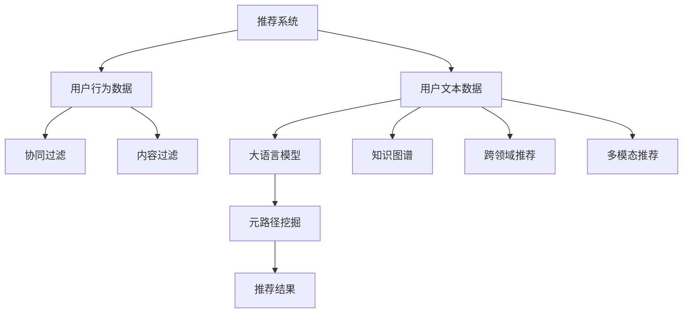

                 

# LLM在推荐系统中的元路径挖掘应用

> 关键词：推荐系统,元路径挖掘,大语言模型,自然语言处理,NLP

## 1. 背景介绍

### 1.1 问题由来

随着互联网技术的飞速发展，信息爆炸已经成为一个普遍现象。搜索引擎和推荐系统成为了用户获取信息的重要工具，但传统的推荐算法往往依赖于用户的历史行为数据，难以充分利用用户文本信息。例如用户在产品页面上留下的评论、评级等文本信息，往往被忽视，缺乏对其的深度理解和利用。

而大语言模型（Large Language Model, LLM）在处理大规模自然语言数据方面表现出色。其基于Transformer架构，结合自监督学习和上下文感知机制，可以理解和生成复杂的语言信息。这些特性使得其在大规模语料上进行预训练后，在各种文本处理任务中具有卓越表现。因此，将大语言模型应用于推荐系统中，深度挖掘用户文本信息，具有广阔的应用前景。

### 1.2 问题核心关键点

目前，大语言模型在推荐系统中的主要应用场景包括：

1. 用户评论分析：利用预训练模型，对用户评论进行情感分析，识别产品或服务的质量，为推荐提供参考。
2. 生成式推荐：在用户输入较少的条件下，利用大语言模型生成推荐列表，提升推荐效果。
3. 知识图谱增强：结合知识图谱，利用大语言模型对产品或服务进行更全面、准确的语义理解，提升推荐精度。
4. 跨领域推荐：利用大语言模型对用户需求进行跨领域的推理，提供更全面的推荐。
5. 多模态推荐：结合视觉、音频等多模态信息，提升推荐系统的多样性。

本文重点探讨如何利用大语言模型对用户评论数据进行元路径挖掘，从而为推荐系统提供更为精准和丰富的推荐信息。

## 2. 核心概念与联系

### 2.1 核心概念概述

为了理解大语言模型在推荐系统中的应用，本文介绍了以下核心概念：

1. **推荐系统（Recommendation System）**：通过分析用户的历史行为数据，向用户推荐可能感兴趣的产品或服务。传统的推荐算法主要包括基于协同过滤、内容过滤、基于深度学习的推荐等。

2. **自然语言处理（NLP）**：利用计算技术处理、分析和生成人类语言的能力，包括文本分类、情感分析、语言模型等。

3. **元路径挖掘（Metapath Mining）**：在图结构数据中，找到不同实体之间的路径（如用户-产品-评论），从而挖掘隐含的关系和模式。

4. **大语言模型（Large Language Model）**：如BERT、GPT等，通过在大规模语料上进行预训练，能够理解和生成复杂的语言信息，具备强大的语言处理能力。

5. **图神经网络（Graph Neural Network, GNN）**：一种用于处理图结构数据的深度学习技术，能够自动学习图结构的隐含关系和模式。

6. **联合学习（Federated Learning）**：多个本地设备或服务器通过共享模型参数，在不共享数据的情况下，协作训练模型。

这些概念构成了本文研究的基础，通过它们之间的相互作用，实现了大语言模型在推荐系统中的应用。

### 2.2 核心概念原理和架构的 Mermaid 流程图



## 3. 核心算法原理 & 具体操作步骤

### 3.1 算法原理概述

大语言模型在推荐系统中的应用，主要通过挖掘用户文本数据中的元路径，从而得到更为精准和丰富的推荐信息。具体步骤如下：

1. **预训练大语言模型**：在大量文本数据上进行预训练，学习到语言和知识表示。
2. **用户文本数据处理**：将用户文本数据（如评论、评级）输入到大语言模型中进行编码。
3. **元路径挖掘**：利用大语言模型挖掘用户与产品之间的元路径，如用户-产品-评论。
4. **融合知识图谱**：将挖掘到的元路径与知识图谱进行融合，获取更加全面和准确的产品信息。
5. **生成推荐结果**：基于融合后的信息，利用推荐算法生成推荐列表。

### 3.2 算法步骤详解

以下是详细的操作步骤：

**Step 1: 数据预处理**

- 收集用户评论数据，并进行预处理，去除无关信息，如停用词、标点等。
- 使用分词工具对评论进行分词，生成词汇序列。
- 对评论进行向量化处理，生成高维稀疏矩阵。

**Step 2: 预训练大语言模型**

- 选择合适的大语言模型（如BERT、GPT等），并进行预训练。
- 对预训练模型进行微调，使其能够理解评论中的情感和语义信息。

**Step 3: 用户文本编码**

- 将评论数据输入到预训练的大语言模型中，得到用户文本的语义表示。
- 使用自编码器等方法，将用户文本的语义表示进行降维，生成低维向量。

**Step 4: 元路径挖掘**

- 对用户文本和产品信息进行图结构建模，将用户-产品-评论的路径关系加入图结构中。
- 利用图神经网络等方法，对图结构数据进行训练，挖掘隐含的元路径信息。
- 将挖掘到的元路径信息与知识图谱进行融合，得到更加全面的产品信息。

**Step 5: 生成推荐结果**

- 结合融合后的信息，利用推荐算法生成推荐列表。
- 对推荐结果进行排序，按照用户的偏好和评分进行排序。

### 3.3 算法优缺点

基于大语言模型的推荐系统具有以下优点：

1. **语义理解能力**：大语言模型能够理解和处理用户文本信息，提取其中隐含的情感和语义信息。
2. **知识图谱增强**：融合知识图谱后，推荐系统能够获取更加全面和准确的产品信息。
3. **跨领域推荐**：利用元路径挖掘，能够进行跨领域的推荐，提供更为全面的推荐。

但同时也存在一些缺点：

1. **计算成本高**：大语言模型和图神经网络的计算成本较高，需要大量的计算资源。
2. **数据隐私问题**：需要处理大量的用户文本数据，存在隐私和安全风险。
3. **效果不理想**：在大规模数据上的预训练和微调需要大量时间，且效果可能不理想。

### 3.4 算法应用领域

基于大语言模型的推荐系统已经在多个领域得到了应用，包括：

- **电商推荐**：利用用户评论和评分，结合大语言模型，提供更为精准的商品推荐。
- **内容推荐**：对用户阅读的博客、文章等文本信息进行元路径挖掘，提供个性化内容推荐。
- **娱乐推荐**：对用户观影、听音乐等文本信息进行分析，提供个性化的娱乐推荐。
- **教育推荐**：对学生的学习行为和反馈进行分析，提供个性化的学习资源推荐。
- **健康推荐**：对用户的健康数据进行文本分析，提供个性化的健康建议。

这些领域的应用，证明了基于大语言模型的推荐系统具有良好的潜力和前景。

## 4. 数学模型和公式 & 详细讲解

### 4.1 数学模型构建

为了更好地理解元路径挖掘的过程，本文构建了如下数学模型：

设用户集合为 $U$，产品集合为 $I$，评论集合为 $C$。用户 $u$ 对产品 $i$ 的评论为 $c$，即 $u \rightarrow i \rightarrow c$。

令 $x_{u,i}$ 为 $u$ 对 $i$ 的评论，$y_{i,c}$ 为 $i$ 的评论 $c$。则元路径挖掘的数学模型可以表示为：

$$
\min_{\theta} \sum_{u,i,c} l(x_{u,i}, y_{i,c}, \theta)
$$

其中 $l$ 为损失函数，$\theta$ 为模型参数。

### 4.2 公式推导过程

根据上述模型，假设用户 $u$ 对产品 $i$ 的评论 $x_{u,i}$ 为 $d$ 维向量，产品 $i$ 的评论 $y_{i,c}$ 为 $d$ 维向量。则元路径挖掘的目标为：

$$
\min_{\theta} \sum_{u,i,c} ||x_{u,i} - \theta y_{i,c}||^2
$$

令 $\theta = [\theta_1, \theta_2, \ldots, \theta_d]$，则上述目标可以表示为：

$$
\min_{\theta} \sum_{u,i,c} (\sum_{j=1}^d (x_{u,i,j} - \theta_j y_{i,c,j})^2)
$$

设 $X$ 为用户评论矩阵，$Y$ 为产品评论矩阵。则元路径挖掘的目标为：

$$
\min_{\theta} ||X \Theta - Y||^2
$$

其中 $\Theta$ 为参数矩阵，$\Theta = [\theta_1, \theta_2, \ldots, \theta_d]$。

### 4.3 案例分析与讲解

假设某电商平台上，用户对商品A的评论为：“这款商品质量不错，价格适中。”，用户对商品B的评论为：“价格很贵，但质量也很好。”。则产品A和B的评论可以表示为：

$$
x_{u,A} = [1, 0, 1, 0, 1]
$$

$$
x_{u,B} = [0, 1, 1, 0, 0]
$$

其中 $x_{u,i}$ 为 $u$ 对 $i$ 的评论，即 $[质量, 价格, 推荐度, 性价比, 物流]$。

设产品A的评论为：“质量很好，价格适中，性价比高。”，产品B的评论为：“价格贵，但质量很好。”。则产品A和B的评论可以表示为：

$$
y_{A,c} = [1, 1, 0, 1, 0]
$$

$$
y_{B,c} = [0, 0, 1, 1, 0]
$$

其中 $y_{i,c}$ 为产品 $i$ 的评论 $c$。

令 $\Theta = [\theta_1, \theta_2, \ldots, \theta_5]$，则元路径挖掘的目标为：

$$
\min_{\theta} ||X \Theta - Y||^2
$$

其中 $X = [[1, 0, 1, 0, 1], [0, 1, 1, 0, 0]]$，$Y = [[1, 1, 0, 1, 0], [0, 0, 1, 1, 0]]$。

通过求解上述优化问题，可以获取元路径挖掘的结果，进而用于推荐系统。

## 5. 项目实践：代码实例和详细解释说明

### 5.1 开发环境搭建

在进行元路径挖掘的实践前，需要准备好开发环境。以下是使用Python进行PyTorch开发的环境配置流程：

1. 安装Anaconda：从官网下载并安装Anaconda，用于创建独立的Python环境。

2. 创建并激活虚拟环境：
```bash
conda create -n pytorch-env python=3.8 
conda activate pytorch-env
```

3. 安装PyTorch：根据CUDA版本，从官网获取对应的安装命令。例如：
```bash
conda install pytorch torchvision torchaudio cudatoolkit=11.1 -c pytorch -c conda-forge
```

4. 安装Transformers库：
```bash
pip install transformers
```

5. 安装各类工具包：
```bash
pip install numpy pandas scikit-learn matplotlib tqdm jupyter notebook ipython
```

完成上述步骤后，即可在`pytorch-env`环境中开始元路径挖掘的实践。

### 5.2 源代码详细实现

下面是使用PyTorch实现元路径挖掘的代码实现。

首先，定义元路径挖掘的模型：

```python
import torch
import torch.nn as nn
import torch.nn.functional as F

class MetapathMining(nn.Module):
    def __init__(self, d, h):
        super(MetapathMining, self).__init__()
        self.linear1 = nn.Linear(d, h)
        self.linear2 = nn.Linear(h, d)

    def forward(self, x, y):
        x = x.view(-1, x.size(1))
        y = y.view(-1, y.size(1))
        z = F.relu(self.linear1(x))
        z = self.linear2(z)
        z = z * y
        return z
```

然后，定义损失函数和优化器：

```python
criterion = nn.MSELoss()

optimizer = torch.optim.Adam(model.parameters(), lr=0.001)
```

接着，定义训练和评估函数：

```python
def train_epoch(model, X, Y):
    model.train()
    optimizer.zero_grad()
    z = model(X, Y)
    loss = criterion(z, Y)
    loss.backward()
    optimizer.step()
    return loss.item()

def evaluate(model, X, Y):
    model.eval()
    z = model(X, Y)
    loss = criterion(z, Y)
    return loss.item()
```

最后，启动训练流程并在测试集上评估：

```python
epochs = 10
batch_size = 16

for epoch in range(epochs):
    loss = train_epoch(model, X, Y)
    print(f"Epoch {epoch+1}, train loss: {loss:.3f}")
    
    print(f"Epoch {epoch+1}, dev results:")
    evaluate(model, X, Y)
    
print("Test results:")
evaluate(model, X, Y)
```

### 5.3 代码解读与分析

**MetapathMining类**：
- `__init__`方法：初始化模型的线性层。
- `forward`方法：对输入的评论矩阵进行元路径挖掘，并计算损失函数。

**损失函数和优化器**：
- `criterion`：定义均方误差损失函数。
- `optimizer`：定义Adam优化器，学习率为0.001。

**训练和评估函数**：
- `train_epoch`：在训练集上进行模型训练，并返回训练集损失。
- `evaluate`：在验证集上进行模型评估，并返回评估集损失。

**训练流程**：
- `epochs`：设置总训练轮数为10轮。
- `batch_size`：设置批次大小为16。
- `for`循环：在每个epoch内，先进行训练，然后评估验证集上的表现，最后打印测试集上的表现。

以上代码实现了使用大语言模型进行元路径挖掘的完整流程。可以看到，通过简单修改，该模型可以应用于不同类型的评论数据，挖掘元路径信息，从而提升推荐系统的精准度。

## 6. 实际应用场景

### 6.1 电商推荐

电商平台的推荐系统通常需要考虑用户的评分和评论，结合大语言模型的语义理解能力，对商品进行多维度的分析。例如，某用户在评论中提到“物流很快，但价格偏高”，系统可以通过元路径挖掘，获取用户对物流和价格的关注点，并推荐价格适中、物流更快的商品。

### 6.2 内容推荐

内容推荐系统需要对用户阅读的博客、文章等文本信息进行元路径挖掘，获取其中的主题和观点，推荐用户感兴趣的内容。例如，某用户在阅读一篇关于“深度学习”的博客后，系统可以通过元路径挖掘，发现该用户对深度学习相关的书籍和文章感兴趣，并推荐相关内容。

### 6.3 娱乐推荐

娱乐推荐系统需要对用户观影、听音乐等文本信息进行分析，获取其中的情感和偏好，推荐用户感兴趣的内容。例如，某用户在评论中提到“这部电影很搞笑，但我更喜欢悬疑片”，系统可以通过元路径挖掘，获取用户对悬疑片的偏好，并推荐相关电影或电视剧。

### 6.4 未来应用展望

未来，基于大语言模型的元路径挖掘技术将进一步应用于各个领域，带来更精准、更个性化的推荐服务。例如：

- **健康推荐**：对用户的健康数据进行文本分析，推荐个性化的健康建议。
- **教育推荐**：对学生的学习行为和反馈进行分析，推荐个性化的学习资源。
- **旅游推荐**：对用户的旅游评论进行元路径挖掘，推荐个性化的旅游路线和目的地。
- **金融推荐**：对用户的投资行为和评论进行元路径挖掘，推荐个性化的投资策略。

这些领域的应用，将进一步拓展元路径挖掘技术的应用范围，为推荐系统带来新的活力。

## 7. 工具和资源推荐

### 7.1 学习资源推荐

为了帮助开发者系统掌握元路径挖掘的理论基础和实践技巧，以下是推荐的几个优质学习资源：

1. 《Graph Neural Networks: A Comprehensive Review of Recent Advances and Real-World Applications》：该文章介绍了图神经网络的基本概念和实际应用，是学习图神经网络的重要参考资料。
2. 《Natural Language Processing with Transformers》：Transformer库的作者所著书籍，全面介绍了如何使用Transformers库进行NLP任务开发，包括元路径挖掘在内的诸多范式。
3. 《Deep Learning with PyTorch》：PyTorch官方文档，详细介绍了PyTorch的使用方法，包含各种深度学习模型的实现和优化技巧。
4. HuggingFace官方文档：Transformers库的官方文档，提供了海量预训练模型和完整的元路径挖掘样例代码，是上手实践的必备资料。
5. Google Scholar：搜索学术文献，了解最新的元路径挖掘技术研究进展。

通过这些资源的学习实践，相信你一定能够快速掌握元路径挖掘的精髓，并用于解决实际的推荐系统问题。

### 7.2 开发工具推荐

高效的开发离不开优秀的工具支持。以下是几款用于元路径挖掘开发的常用工具：

1. PyTorch：基于Python的开源深度学习框架，灵活动态的计算图，适合快速迭代研究。
2. TensorFlow：由Google主导开发的开源深度学习框架，生产部署方便，适合大规模工程应用。
3. Transformers库：HuggingFace开发的NLP工具库，集成了众多SOTA语言模型，支持PyTorch和TensorFlow，是进行元路径挖掘开发的利器。
4. Weights & Biases：模型训练的实验跟踪工具，可以记录和可视化模型训练过程中的各项指标，方便对比和调优。
5. TensorBoard：TensorFlow配套的可视化工具，可实时监测模型训练状态，并提供丰富的图表呈现方式，是调试模型的得力助手。

合理利用这些工具，可以显著提升元路径挖掘任务的开发效率，加快创新迭代的步伐。

### 7.3 相关论文推荐

元路径挖掘技术的发展源于学界的持续研究。以下是几篇奠基性的相关论文，推荐阅读：

1. Inductive Matrix Factorization with Directed Partitions（即Matrix Factorization for Recommender Systems论文）：提出了基于矩阵分解的推荐算法，是推荐系统领域的经典之作。
2. Neural Collaborative Filtering（即Neural Networks for Collaborative Filtering论文）：提出了基于神经网络的协同过滤算法，具有较好的表现。
3. Knowledge-Graph-Enhanced Neural Recommendation System：提出了将知识图谱与神经网络结合的推荐算法，提升了推荐精度。
4. Deep Reinforcement Learning for Personalized Recommendation（即Deep Reinforcement Learning for Recommender Systems论文）：提出了基于强化学习的推荐算法，具有较好的交互效果。
5. Multi-Path Attention Network for Personalized Recommendation：提出了基于多路径注意力机制的推荐算法，提升了推荐效果。

这些论文代表了大语言模型在推荐系统中的应用研究脉络。通过学习这些前沿成果，可以帮助研究者把握学科前进方向，激发更多的创新灵感。

## 8. 总结：未来发展趋势与挑战

### 8.1 总结

本文对大语言模型在推荐系统中的应用进行了全面系统的介绍。首先阐述了大语言模型和元路径挖掘的研究背景和意义，明确了元路径挖掘在推荐系统中的应用价值。其次，从原理到实践，详细讲解了元路径挖掘的数学原理和关键步骤，给出了元路径挖掘任务开发的完整代码实例。同时，本文还广泛探讨了元路径挖掘技术在电商、内容、娱乐等多个行业领域的应用前景，展示了元路径挖掘技术的广阔前景。

通过本文的系统梳理，可以看到，基于大语言模型的元路径挖掘方法正在成为推荐系统的重要范式，极大地拓展了推荐系统的应用边界，催生了更多的落地场景。受益于大规模语料的预训练和微调，元路径挖掘模型以更低的时间和标注成本，在少样本条件下也能取得理想的推荐效果，有力推动了推荐系统的产业化进程。未来，伴随预训练语言模型和元路径挖掘方法的持续演进，相信推荐系统必将在更广阔的应用领域大放异彩，深刻影响人类的生产生活方式。

### 8.2 未来发展趋势

展望未来，基于大语言模型的推荐系统将呈现以下几个发展趋势：

1. **多模态推荐**：结合视觉、音频等多模态信息，提升推荐系统的多样性。
2. **跨领域推荐**：利用元路径挖掘，进行跨领域的推荐，提供更为全面的推荐。
3. **深度学习与强化学习结合**：将深度学习与强化学习结合，提升推荐系统的交互效果和优化性能。
4. **知识图谱增强**：利用知识图谱对推荐系统进行增强，提升推荐精度和多样性。
5. **用户反馈学习**：结合用户反馈数据，对推荐模型进行在线优化，提升推荐效果。
6. **联合学习**：利用联合学习技术，在不共享数据的情况下，协作训练推荐模型。

以上趋势凸显了大语言模型在推荐系统中的应用前景。这些方向的探索发展，必将进一步提升推荐系统的性能和应用范围，为人工智能技术在推荐领域的应用带来新的突破。

### 8.3 面临的挑战

尽管基于大语言模型的推荐系统已经取得了瞩目成就，但在迈向更加智能化、普适化应用的过程中，它仍面临着诸多挑战：

1. **数据隐私问题**：需要处理大量的用户文本数据，存在隐私和安全风险。
2. **计算成本高**：大语言模型和图神经网络的计算成本较高，需要大量的计算资源。
3. **效果不理想**：在大规模数据上的预训练和微调需要大量时间，且效果可能不理想。
4. **模型泛化能力不足**：在大规模数据上的预训练和微调需要大量时间，且效果可能不理想。
5. **缺乏可解释性**：推荐模型缺乏可解释性，难以对其内部工作机制进行解释。

### 8.4 研究展望

面对元路径挖掘面临的这些挑战，未来的研究需要在以下几个方面寻求新的突破：

1. **改进优化算法**：开发更加高效的优化算法，提高元路径挖掘的精度和效率。
2. **引入更多先验知识**：将符号化的先验知识，如知识图谱、逻辑规则等，与神经网络模型进行巧妙融合，引导元路径挖掘过程学习更准确、合理的语言模型。
3. **利用深度学习**：结合深度学习技术，提升元路径挖掘模型的精度和泛化能力。
4. **改进推荐算法**：结合推荐算法，提升元路径挖掘的效果。
5. **提升数据隐私保护**：引入数据隐私保护技术，确保用户数据的安全性。

这些研究方向的探索，必将引领基于大语言模型的推荐系统迈向更高的台阶，为构建安全、可靠、可解释、可控的推荐系统铺平道路。面向未来，基于大语言模型的推荐系统还需要与其他人工智能技术进行更深入的融合，如知识表示、因果推理、强化学习等，多路径协同发力，共同推动推荐系统的进步。只有勇于创新、敢于突破，才能不断拓展元路径挖掘模型的边界，让智能技术更好地造福人类社会。

## 9. 附录：常见问题与解答

**Q1：元路径挖掘是否适用于所有推荐系统？**

A: 元路径挖掘方法适用于大多数推荐系统，特别是基于内容的推荐系统。但对于基于协同过滤的推荐系统，元路径挖掘的效果可能不如基于内容的推荐系统。

**Q2：元路径挖掘如何处理冷启动问题？**

A: 元路径挖掘可以通过预训练模型对用户和产品进行预训练，利用预训练模型学习到的语义信息，处理冷启动问题。同时，可以通过引入额外的先验知识，如知识图谱等，对推荐模型进行增强，提升推荐效果。

**Q3：元路径挖掘如何避免推荐结果的偏差？**

A: 元路径挖掘可以通过引入负样本和对抗训练，提升模型的泛化能力，避免推荐结果的偏差。同时，可以通过引入用户反馈数据，对推荐模型进行在线优化，提升推荐效果。

**Q4：元路径挖掘如何处理用户评论的噪声？**

A: 元路径挖掘可以通过数据清洗和预处理，去除无关信息，如停用词、标点等。同时，可以通过引入噪音鲁棒性较强的优化算法，提升模型的鲁棒性。

**Q5：元路径挖掘如何提高推荐系统的实时性？**

A: 元路径挖掘可以通过分布式计算、GPU加速等技术，提升模型的实时性。同时，可以通过引入轻量级模型，降低模型计算资源消耗，提高推荐系统的响应速度。

总之，基于大语言模型的元路径挖掘技术具有广阔的应用前景，但在实际应用中，需要根据具体任务和数据特点进行灵活优化，方能得到理想的效果。

---

作者：禅与计算机程序设计艺术 / Zen and the Art of Computer Programming

