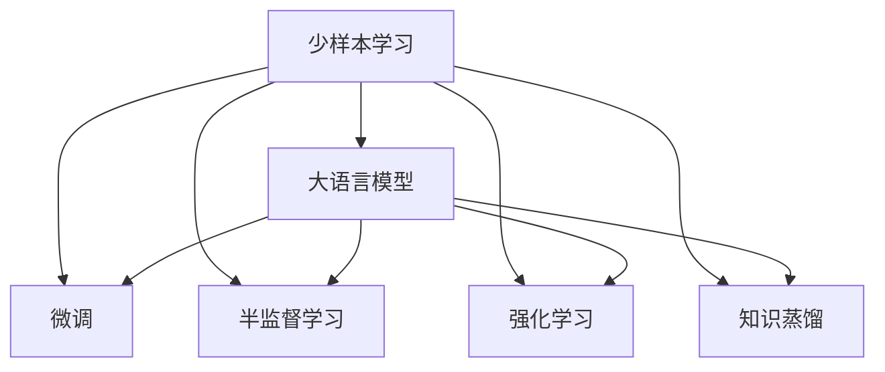

                 

# 《LLM在推荐系统中的少样本学习》

## 1. 背景介绍

### 1.1 问题由来

推荐系统（Recommender Systems）作为互联网应用的核心模块之一，旨在为用户推荐其可能感兴趣的内容。传统的推荐系统依赖于历史数据进行推荐，但由于用户行为数据的稀疏性和动态性，导致推荐效果不理想，且成本高昂。

近年来，基于深度学习的推荐系统方法逐渐成为主流，尤其是在数据量较大、特征维度较高的应用场景中。这些深度学习模型通常需要大量的标注数据来训练，才能达到较高的推荐精度。然而，在实时推荐系统、新兴领域或用户隐私保护等场景下，获取标注数据往往受到限制。此外，一些用户在加入平台初期，其行为数据较少，直接使用这些数据训练模型往往效果不佳。

为了解决这些问题，研究者们提出了少样本学习（Few-shot Learning）的方法，希望在大规模预训练语言模型（Large Language Models, LLM）的帮助下，用少量标注数据训练推荐系统，提升推荐效果。

### 1.2 问题核心关键点

少样本学习是一种从少量标注数据中学习新任务的方法，在大语言模型（Large Language Models, LLM）中，通过微调（Fine-Tuning）实现。该方法的关键在于如何利用预训练模型在大量无标注数据中学到的知识，以及如何在少量标注数据上高效利用这些知识。

在推荐系统中，常见的少样本学习方法包括：
1. 微调预训练模型：利用预训练模型作为初始化参数，在少量标注数据上进行微调，优化模型对推荐任务的适应性。
2. 半监督学习：结合少量标注数据和大量未标注数据，利用标注数据标注信息的引导，提升模型泛化能力。
3. 强化学习：通过模拟环境，利用少量标注数据和奖励信号，训练模型推荐策略。
4. 知识蒸馏：将预训练模型中对推荐任务有帮助的子模块提取出来，作为目标模型。

这些方法通过不同手段利用预训练知识，实现从少量标注数据中有效学习新任务。

### 1.3 问题研究意义

研究LLM在推荐系统中的少样本学习，对推荐系统的发展具有重要意义：

1. 降低推荐系统开发成本：通过预训练模型微调，可以显著减少从头训练模型所需的数据、计算和人力投入。
2. 提升推荐效果：少样本学习方法可以利用预训练模型在无标注数据中学到的知识，提升推荐系统的性能。
3. 加速模型训练：少样本学习方法能够在有限标注数据下快速训练出高性能推荐模型，缩短开发周期。
4. 提高模型泛化能力：利用预训练模型知识，可以在新领域或新任务上快速实现推荐系统部署。
5. 满足用户隐私保护需求：通过少样本学习方法，可以在保证用户隐私的前提下，获得个性化推荐服务。

## 2. 核心概念与联系

### 2.1 核心概念概述

为更好地理解LLM在推荐系统中的少样本学习方法，本节将介绍几个密切相关的核心概念：

- 少样本学习（Few-shot Learning）：指在只有少量标注样本的情况下，模型能够快速适应新任务的学习方法。在大语言模型中，通常通过在输入中提供少量示例来实现，无需更新模型参数。

- 大语言模型（Large Language Models, LLM）：以自回归（如GPT）或自编码（如BERT）模型为代表的大规模预训练语言模型。通过在大规模无标签文本数据上进行预训练，学习通用的语言知识，具备强大的语言理解和生成能力。

- 微调（Fine-Tuning）：指在预训练模型的基础上，使用下游任务的少量标注数据，通过有监督学习优化模型在特定任务上的性能。通常只需要调整顶层分类器或解码器，并以较小的学习率更新全部或部分的模型参数。

- 预训练（Pre-training）：指在大规模无标签文本数据上，通过自监督学习任务训练通用语言模型的过程。常见的预训练任务包括言语建模、遮挡语言模型等。预训练使得模型学习到语言的通用表示。

- 强化学习（Reinforcement Learning）：指通过与环境的交互，使模型通过奖励和惩罚信号来学习最优策略的学习方法。

- 知识蒸馏（Knowledge Distillation）：指将一个预训练模型的知识，以蒸馏的方式传递给另一个模型，使得后者的性能得到提升。

这些核心概念之间的逻辑关系可以通过以下Mermaid流程图来展示：



这个流程图展示了大语言模型在推荐系统中的少样本学习方法与核心概念之间的关系：

1. 少样本学习可以利用大语言模型的预训练知识，快速学习新任务。
2. 微调是少样本学习方法的一种，利用标注数据微调预训练模型。
3. 半监督学习结合少量标注数据和大量未标注数据，提高模型泛化能力。
4. 强化学习通过模拟环境，利用奖励信号训练推荐模型。
5. 知识蒸馏提取预训练模型的知识子模块，指导新模型的训练。

这些概念共同构成了LLM在推荐系统中的少样本学习框架，使其能够在各种场景下快速部署推荐模型。

## 3. 核心算法原理 & 具体操作步骤

### 3.1 算法原理概述

基于少样本学习的大语言模型推荐系统，其核心思想是利用预训练模型在大量无标注数据中学到的知识，结合少量标注数据进行微调，以提升推荐系统的性能。

形式化地，假设预训练模型为 $M_{\theta}$，其中 $\theta$ 为预训练得到的模型参数。给定推荐任务 $T$ 的少量标注数据集 $D=\{(x_i, y_i)\}_{i=1}^N, x_i \in \mathcal{X}, y_i \in \{0,1\}$，微调的目标是找到新的模型参数 $\hat{\theta}$，使得：

$$
\hat{\theta}=\mathop{\arg\min}_{\theta} \mathcal{L}(M_{\theta},D)
$$

其中 $\mathcal{L}$ 为针对任务 $T$ 设计的损失函数，用于衡量模型预测输出与真实标签之间的差异。常见的损失函数包括交叉熵损失、均方误差损失等。

通过梯度下降等优化算法，微调过程不断更新模型参数 $\theta$，最小化损失函数 $\mathcal{L}$，使得模型输出逼近真实标签。由于 $\theta$ 已经通过预训练获得了较好的初始化，因此即便在少量数据集 $D$ 上进行微调，也能较快收敛到理想的模型参数 $\hat{\theta}$。

### 3.2 算法步骤详解

基于少样本学习的大语言模型推荐系统一般包括以下几个关键步骤：

**Step 1: 准备预训练模型和数据集**
- 选择合适的预训练语言模型 $M_{\theta}$ 作为初始化参数，如 BERT、GPT 等。
- 准备推荐任务 $T$ 的少量标注数据集 $D$，划分为训练集、验证集和测试集。一般要求标注数据与预训练数据的分布不要差异过大。

**Step 2: 添加任务适配层**
- 根据推荐任务类型，在预训练模型顶层设计合适的输出层和损失函数。
- 对于推荐任务，通常使用交叉熵损失函数。
- 对于生成推荐列表，通常使用最大似然损失函数。

**Step 3: 设置微调超参数**
- 选择合适的优化算法及其参数，如 AdamW、SGD 等，设置学习率、批大小、迭代轮数等。
- 设置正则化技术及强度，包括权重衰减、Dropout、Early Stopping 等。
- 确定冻结预训练参数的策略，如仅微调顶层，或全部参数都参与微调。

**Step 4: 执行梯度训练**
- 将训练集数据分批次输入模型，前向传播计算损失函数。
- 反向传播计算参数梯度，根据设定的优化算法和学习率更新模型参数。
- 周期性在验证集上评估模型性能，根据性能指标决定是否触发 Early Stopping。
- 重复上述步骤直到满足预设的迭代轮数或 Early Stopping 条件。

**Step 5: 测试和部署**
- 在测试集上评估微调后模型 $M_{\hat{\theta}}$ 的性能，对比微调前后的精度提升。
- 使用微调后的模型对新样本进行推理预测，集成到实际的应用系统中。
- 持续收集新的数据，定期重新微调模型，以适应数据分布的变化。

以上是基于少样本学习微调大语言模型的一般流程。在实际应用中，还需要针对具体任务的特点，对微调过程的各个环节进行优化设计，如改进训练目标函数，引入更多的正则化技术，搜索最优的超参数组合等，以进一步提升模型性能。

### 3.3 算法优缺点

基于少样本学习的大语言模型推荐方法具有以下优点：
1. 简单高效。仅需准备少量标注数据，即可对预训练模型进行快速适配，获得较大的性能提升。
2. 通用适用。适用于各种推荐系统任务，包括推荐系统、个性化推荐、商品推荐等，设计简单的任务适配层即可实现。
3. 模型泛化性强。利用预训练模型的通用知识，可以在新领域或新任务上快速实现推荐系统部署。
4. 数据标注成本低。相较于从头训练，微调需要的标注数据量更少，降低了数据标注成本。

同时，该方法也存在一定的局限性：
1. 对标注数据质量要求高。微调的效果很大程度上取决于标注数据的质量和数量，获取高质量标注数据的成本较高。
2. 数据分布变化敏感。预训练模型的泛化能力较强，但对数据分布变化敏感，微调效果可能随新数据分布差异而降低。
3. 模型可解释性不足。微调模型的决策过程通常缺乏可解释性，难以对其推理逻辑进行分析和调试。
4. 过拟合风险较高。在少量标注数据上进行微调，容易发生过拟合，影响模型泛化能力。

尽管存在这些局限性，但就目前而言，基于少样本学习的微调方法仍是大语言模型推荐应用的最主流范式。未来相关研究的重点在于如何进一步降低微调对标注数据的依赖，提高模型的泛化能力，同时兼顾可解释性和伦理安全性等因素。

### 3.4 算法应用领域

基于大语言模型少样本学习的推荐系统方法，在推荐系统领域已经得到了广泛的应用，覆盖了几乎所有常见任务，例如：

- 个性化推荐：如商品推荐、新闻推荐、视频推荐等。通过微调使模型学习用户行为和物品属性之间的关联，提供个性化推荐服务。
- 内容推荐：如文章推荐、音乐推荐等。利用预训练模型的语言理解能力，对文本进行情感分析，生成内容推荐列表。
- 交互推荐：如社交网络推荐、活动推荐等。利用用户的互动信息，对用户行为进行建模，生成互动推荐内容。
- 实时推荐：如实时新闻推荐、实况事件推荐等。在用户行为数据实时流中，进行快速推荐。

除了上述这些经典任务外，少样本学习方法也被创新性地应用到更多场景中，如基于用户情感分析的推荐、基于用户评价的推荐、基于文本匹配的推荐等，为推荐系统带来了新的突破。随着预训练语言模型和少样本学习方法的不断进步，相信推荐系统技术将在更广阔的应用领域大放异彩。

## 4. 数学模型和公式 & 详细讲解  
### 4.1 数学模型构建

本节将使用数学语言对基于少样本学习的大语言模型推荐过程进行更加严格的刻画。

记预训练语言模型为 $M_{\theta}$，其中 $\theta$ 为预训练得到的模型参数。假设推荐任务 $T$ 的训练集为 $D=\{(x_i, y_i)\}_{i=1}^N, x_i \in \mathcal{X}, y_i \in \{0,1\}$。

定义模型 $M_{\theta}$ 在数据样本 $(x,y)$ 上的损失函数为 $\ell(M_{\theta}(x),y)$，则在数据集 $D$ 上的经验风险为：

$$
\mathcal{L}(\theta) = \frac{1}{N}\sum_{i=1}^N \ell(M_{\theta}(x_i),y_i)
$$

微调的优化目标是最小化经验风险，即找到最优参数：

$$
\theta^* = \mathop{\arg\min}_{\theta} \mathcal{L}(\theta)
$$

在实践中，我们通常使用基于梯度的优化算法（如SGD、Adam等）来近似求解上述最优化问题。设 $\eta$ 为学习率，$\lambda$ 为正则化系数，则参数的更新公式为：

$$
\theta \leftarrow \theta - \eta \nabla_{\theta}\mathcal{L}(\theta) - \eta\lambda\theta
$$

其中 $\nabla_{\theta}\mathcal{L}(\theta)$ 为损失函数对参数 $\theta$ 的梯度，可通过反向传播算法高效计算。

### 4.2 公式推导过程

以下我们以个性化推荐任务为例，推导交叉熵损失函数及其梯度的计算公式。

假设模型 $M_{\theta}$ 在输入 $x$ 上的输出为 $\hat{y}=M_{\theta}(x) \in [0,1]$，表示用户对物品的评分。真实标签 $y \in \{0,1\}$。则二分类交叉熵损失函数定义为：

$$
\ell(M_{\theta}(x),y) = -[y\log \hat{y} + (1-y)\log (1-\hat{y})]
$$

将其代入经验风险公式，得：

$$
\mathcal{L}(\theta) = -\frac{1}{N}\sum_{i=1}^N [y_i\log M_{\theta}(x_i)+(1-y_i)\log(1-M_{\theta}(x_i))]
$$

根据链式法则，损失函数对参数 $\theta_k$ 的梯度为：

$$
\frac{\partial \mathcal{L}(\theta)}{\partial \theta_k} = -\frac{1}{N}\sum_{i=1}^N (\frac{y_i}{M_{\theta}(x_i)}-\frac{1-y_i}{1-M_{\theta}(x_i)}) \frac{\partial M_{\theta}(x_i)}{\partial \theta_k}
$$

其中 $\frac{\partial M_{\theta}(x_i)}{\partial \theta_k}$ 可进一步递归展开，利用自动微分技术完成计算。

在得到损失函数的梯度后，即可带入参数更新公式，完成模型的迭代优化。重复上述过程直至收敛，最终得到适应推荐任务的最优模型参数 $\theta^*$。

## 5. 项目实践：代码实例和详细解释说明
### 5.1 开发环境搭建

在进行少样本学习实践前，我们需要准备好开发环境。以下是使用Python进行PyTorch开发的环境配置流程：

1. 安装Anaconda：从官网下载并安装Anaconda，用于创建独立的Python环境。

2. 创建并激活虚拟环境：
```bash
conda create -n pytorch-env python=3.8 
conda activate pytorch-env
```

3. 安装PyTorch：根据CUDA版本，从官网获取对应的安装命令。例如：
```bash
conda install pytorch torchvision torchaudio cudatoolkit=11.1 -c pytorch -c conda-forge
```

4. 安装Transformers库：
```bash
pip install transformers
```

5. 安装各类工具包：
```bash
pip install numpy pandas scikit-learn matplotlib tqdm jupyter notebook ipython
```

完成上述步骤后，即可在`pytorch-env`环境中开始少样本学习实践。

### 5.2 源代码详细实现

下面我们以基于少样本学习的个性化推荐任务为例，给出使用Transformers库对BERT模型进行微调的PyTorch代码实现。

首先，定义推荐任务的数据处理函数：

```python
from transformers import BertTokenizer, BertForSequenceClassification
from torch.utils.data import Dataset, DataLoader
import torch

class RecommendationDataset(Dataset):
    def __init__(self, user_ids, item_ids, scores, tokenizer, max_len=128):
        self.user_ids = user_ids
        self.item_ids = item_ids
        self.scores = scores
        self.tokenizer = tokenizer
        self.max_len = max_len
        
    def __len__(self):
        return len(self.user_ids)
    
    def __getitem__(self, item):
        user_id = self.user_ids[item]
        item_id = self.item_ids[item]
        score = self.scores[item]
        
        # 将user和item合并为一句话，用于输入tokenizer
        sequence = f"[USER:{user_id}] [ITEM:{item_id}]"
        encoding = self.tokenizer(sequence, return_tensors='pt', max_length=self.max_len, padding='max_length', truncation=True)
        input_ids = encoding['input_ids'][0]
        attention_mask = encoding['attention_mask'][0]
        
        # 对分数进行编码
        encoded_scores = [score]
        encoded_scores.extend([0.] * (self.max_len - len(encoded_scores)))
        labels = torch.tensor(encoded_scores, dtype=torch.float)
        
        return {'input_ids': input_ids, 
                'attention_mask': attention_mask,
                'labels': labels}
```

然后，定义模型和优化器：

```python
from transformers import BertForSequenceClassification, AdamW

model = BertForSequenceClassification.from_pretrained('bert-base-cased', num_labels=2)

optimizer = AdamW(model.parameters(), lr=2e-5)
```

接着，定义训练和评估函数：

```python
from torch.utils.data import DataLoader
from tqdm import tqdm
from sklearn.metrics import accuracy_score

device = torch.device('cuda') if torch.cuda.is_available() else torch.device('cpu')
model.to(device)

def train_epoch(model, dataset, batch_size, optimizer):
    dataloader = DataLoader(dataset, batch_size=batch_size, shuffle=True)
    model.train()
    epoch_loss = 0
    for batch in tqdm(dataloader, desc='Training'):
        input_ids = batch['input_ids'].to(device)
        attention_mask = batch['attention_mask'].to(device)
        labels = batch['labels'].to(device)
        model.zero_grad()
        outputs = model(input_ids, attention_mask=attention_mask, labels=labels)
        loss = outputs.loss
        epoch_loss += loss.item()
        loss.backward()
        optimizer.step()
    return epoch_loss / len(dataloader)

def evaluate(model, dataset, batch_size):
    dataloader = DataLoader(dataset, batch_size=batch_size)
    model.eval()
    preds, labels = [], []
    with torch.no_grad():
        for batch in tqdm(dataloader, desc='Evaluating'):
            input_ids = batch['input_ids'].to(device)
            attention_mask = batch['attention_mask'].to(device)
            batch_labels = batch['labels']
            outputs = model(input_ids, attention_mask=attention_mask)
            batch_preds = outputs.logits.argmax(dim=2).to('cpu').tolist()
            batch_labels = batch_labels.to('cpu').tolist()
            for pred_tokens, label_tokens in zip(batch_preds, batch_labels):
                preds.append(pred_tokens[:len(label_tokens)])
                labels.append(label_tokens)
                
    return accuracy_score(labels, preds)
```

最后，启动训练流程并在测试集上评估：

```python
epochs = 5
batch_size = 16

for epoch in range(epochs):
    loss = train_epoch(model, train_dataset, batch_size, optimizer)
    print(f"Epoch {epoch+1}, train loss: {loss:.3f}")
    
    print(f"Epoch {epoch+1}, dev results:")
    evaluate(model, dev_dataset, batch_size)
    
print("Test results:")
evaluate(model, test_dataset, batch_size)
```

以上就是使用PyTorch对BERT进行个性化推荐任务少样本学习的完整代码实现。可以看到，得益于Transformers库的强大封装，我们可以用相对简洁的代码完成BERT模型的加载和微调。

### 5.3 代码解读与分析

让我们再详细解读一下关键代码的实现细节：

**RecommendationDataset类**：
- `__init__`方法：初始化用户id、物品id、评分等关键组件。
- `__len__`方法：返回数据集的样本数量。
- `__getitem__`方法：对单个样本进行处理，将用户和物品合并成一句话，输入tokenizer进行编码，将评分编码成标签。

**训练和评估函数**：
- 使用PyTorch的DataLoader对数据集进行批次化加载，供模型训练和推理使用。
- 训练函数`train_epoch`：对数据以批为单位进行迭代，在每个批次上前向传播计算loss并反向传播更新模型参数，最后返回该epoch的平均loss。
- 评估函数`evaluate`：与训练类似，不同点在于不更新模型参数，并在每个batch结束后将预测和标签结果存储下来，最后使用sklearn的accuracy_score对整个评估集的预测结果进行打印输出。

**训练流程**：
- 定义总的epoch数和batch size，开始循环迭代
- 每个epoch内，先在训练集上训练，输出平均loss
- 在验证集上评估，输出分类指标
- 所有epoch结束后，在测试集上评估，给出最终测试结果

可以看到，PyTorch配合Transformers库使得BERT少样本学习的代码实现变得简洁高效。开发者可以将更多精力放在数据处理、模型改进等高层逻辑上，而不必过多关注底层的实现细节。

当然，工业级的系统实现还需考虑更多因素，如模型的保存和部署、超参数的自动搜索、更灵活的任务适配层等。但核心的少样本学习范式基本与此类似。

## 6. 实际应用场景
### 6.1 智能推荐系统

基于少样本学习的推荐系统可以广泛应用于智能推荐系统的构建。传统推荐系统往往依赖于用户历史行为数据进行推荐，但由于用户行为数据的稀疏性和动态性，导致推荐效果不理想，且成本高昂。

使用少样本学习的推荐系统，可以利用预训练语言模型在大量无标注数据中学到的知识，结合少量标注数据进行微调，提升推荐效果。少样本学习的推荐系统可以在用户行为数据较少或新领域上快速部署，为用户提供个性化推荐服务。

### 6.2 电商推荐系统

电商推荐系统是推荐系统的一个重要应用场景，利用预训练语言模型的知识，可以在商品推荐、个性化营销等方面获得优异的推荐效果。例如，利用预训练语言模型对商品标题、描述、评论等文本进行语义分析，生成商品相关性评分，从而进行个性化推荐。

少样本学习的电商推荐系统可以利用用户行为数据进行微调，快速生成推荐列表。对于新上架的商品，可以通过人工标注少量数据，利用少样本学习的方法，快速学习商品相关性，进行初期推荐。随着用户行为数据的积累，持续微调模型，逐步提升推荐效果。

### 6.3 新闻推荐系统

新闻推荐系统在新闻媒体、视频平台等领域广泛应用，利用预训练语言模型的知识，可以提升新闻文章的推荐效果。例如，利用预训练语言模型对新闻文章进行情感分析，生成新闻相关性评分，从而进行个性化推荐。

少样本学习的新闻推荐系统可以利用用户行为数据进行微调，快速生成推荐列表。对于新发布的新闻，可以通过人工标注少量数据，利用少样本学习的方法，快速学习新闻相关性，进行初期推荐。随着用户行为数据的积累，持续微调模型，逐步提升推荐效果。

### 6.4 未来应用展望

随着少样本学习和大语言模型的不断发展，其在推荐系统中的应用前景将更加广阔。

在智慧医疗领域，基于少样本学习的推荐系统可以为患者推荐合适的医疗资源、药品和治疗方案，提升医疗服务的智能化水平，辅助医生诊疗，加速新药开发进程。

在智能教育领域，少样本学习的推荐系统可以推荐适合学生的学习资源、课程和辅导，因材施教，促进教育公平，提高教学质量。

在智慧城市治理中，少样本学习的推荐系统可以推荐合适的城市管理方案、公共服务项目，提高城市管理的自动化和智能化水平，构建更安全、高效的未来城市。

此外，在企业生产、社会治理、文娱传媒等众多领域，基于大语言模型少样本学习的推荐系统也将不断涌现，为各行各业提供智能化解决方案，推动人工智能技术在各行各业的落地应用。相信随着技术的日益成熟，少样本学习范式将成为推荐系统应用的重要范式，推动推荐系统技术在更广泛领域的发展。

## 7. 工具和资源推荐
### 7.1 学习资源推荐

为了帮助开发者系统掌握少样本学习的大语言模型推荐技术，这里推荐一些优质的学习资源：

1. 《Transformer从原理到实践》系列博文：由大模型技术专家撰写，深入浅出地介绍了Transformer原理、BERT模型、少样本学习等前沿话题。

2. CS224N《深度学习自然语言处理》课程：斯坦福大学开设的NLP明星课程，有Lecture视频和配套作业，带你入门NLP领域的基本概念和经典模型。

3. 《Natural Language Processing with Transformers》书籍：Transformers库的作者所著，全面介绍了如何使用Transformers库进行NLP任务开发，包括少样本学习在内的诸多范式。

4. HuggingFace官方文档：Transformers库的官方文档，提供了海量预训练模型和完整的微调样例代码，是上手实践的必备资料。

5. CLUE开源项目：中文语言理解测评基准，涵盖大量不同类型的中文NLP数据集，并提供了基于少样本学习的baseline模型，助力中文NLP技术发展。

通过对这些资源的学习实践，相信你一定能够快速掌握少样本学习在大语言模型推荐中的应用，并用于解决实际的推荐问题。
###  7.2 开发工具推荐

高效的开发离不开优秀的工具支持。以下是几款用于少样本学习推荐系统开发的常用工具：

1. PyTorch：基于Python的开源深度学习框架，灵活动态的计算图，适合快速迭代研究。大部分预训练语言模型都有PyTorch版本的实现。

2. TensorFlow：由Google主导开发的开源深度学习框架，生产部署方便，适合大规模工程应用。同样有丰富的预训练语言模型资源。

3. Transformers库：HuggingFace开发的NLP工具库，集成了众多SOTA语言模型，支持PyTorch和TensorFlow，是进行少样本学习推荐任务开发的利器。

4. Weights & Biases：模型训练的实验跟踪工具，可以记录和可视化模型训练过程中的各项指标，方便对比和调优。与主流深度学习框架无缝集成。

5. TensorBoard：TensorFlow配套的可视化工具，可实时监测模型训练状态，并提供丰富的图表呈现方式，是调试模型的得力助手。

6. Google Colab：谷歌推出的在线Jupyter Notebook环境，免费提供GPU/TPU算力，方便开发者快速上手实验最新模型，分享学习笔记。

合理利用这些工具，可以显著提升少样本学习推荐系统的开发效率，加快创新迭代的步伐。

### 7.3 相关论文推荐

少样本学习和大语言模型的发展源于学界的持续研究。以下是几篇奠基性的相关论文，推荐阅读：

1. Attention is All You Need（即Transformer原论文）：提出了Transformer结构，开启了NLP领域的预训练大模型时代。

2. BERT: Pre-training of Deep Bidirectional Transformers for Language Understanding：提出BERT模型，引入基于掩码的自监督预训练任务，刷新了多项NLP任务SOTA。

3. Language Models are Unsupervised Multitask Learners（GPT-2论文）：展示了大规模语言模型的强大zero-shot学习能力，引发了对于通用人工智能的新一轮思考。

4. Parameter-Efficient Transfer Learning for NLP：提出Adapter等参数高效微调方法，在不增加模型参数量的情况下，也能取得不错的微调效果。

5. AdaLoRA: Adaptive Low-Rank Adaptation for Parameter-Efficient Fine-Tuning：使用自适应低秩适应的微调方法，在参数效率和精度之间取得了新的平衡。

6. Improving Interpretability of Deep Learning Decision Models via Predictive Feature Importance Summarization：提出使用可解释性方法，如特征重要性排序等，增强少样本学习模型的可解释性。

这些论文代表了大语言模型少样本学习的发展脉络。通过学习这些前沿成果，可以帮助研究者把握学科前进方向，激发更多的创新灵感。

## 8. 总结：未来发展趋势与挑战

### 8.1 总结

本文对基于少样本学习的大语言模型推荐方法进行了全面系统的介绍。首先阐述了少样本学习和大语言模型的研究背景和意义，明确了其在推荐系统中的应用价值。其次，从原理到实践，详细讲解了少样本学习的数学原理和关键步骤，给出了推荐任务开发的完整代码实例。同时，本文还广泛探讨了少样本学习在推荐系统中的应用场景，展示了少样本学习方法的发展前景。

通过本文的系统梳理，可以看到，基于少样本学习的大语言模型推荐系统正在成为推荐系统的重要范式，极大地拓展了预训练语言模型的应用边界，催生了更多的落地场景。利用预训练语言模型，可以在少量标注数据下快速训练出高性能推荐模型，显著降低推荐系统开发成本，提升推荐效果，缩短开发周期。未来，伴随少样本学习方法和预训练语言模型的不断进步，相信推荐系统技术将在更广阔的应用领域大放异彩。

### 8.2 未来发展趋势

展望未来，少样本学习和大语言模型推荐系统将呈现以下几个发展趋势：

1. 模型规模持续增大。随着算力成本的下降和数据规模的扩张，预训练语言模型的参数量还将持续增长。超大规模语言模型蕴含的丰富语言知识，有望支撑更加复杂多变的推荐任务微调。

2. 少样本学习算法日趋多样。除了传统的微调外，未来会涌现更多少样本学习方法，如半监督学习、强化学习、知识蒸馏等，在节省计算资源的同时，也能保证推荐精度。

3. 推荐模型可解释性增强。少样本学习模型的决策过程通常缺乏可解释性，未来将利用因果分析、可解释性排序等方法，增强推荐模型的可解释性，提升用户体验和信任度。

4. 推荐模型的多模态融合。当前的推荐模型往往只考虑文本信息，未来将进一步拓展到图像、视频、语音等多模态信息融合，提升推荐系统的智能水平。

5. 推荐模型的持续学习。随着数据分布的变化，少样本学习模型需要持续学习新知识，保持推荐模型的时效性和适应性。

6. 推荐系统的伦理和社会责任。在推荐系统的构建和应用中，如何平衡用户隐私保护和数据利用，避免推荐系统中的偏见和歧视，提升推荐系统的社会责任，将成为重要的研究方向。

以上趋势凸显了少样本学习和大语言模型推荐系统的广阔前景。这些方向的探索发展，必将进一步提升推荐系统的性能和应用范围，为人工智能技术在各个领域的应用带来新的突破。

### 8.3 面临的挑战

尽管少样本学习和大语言模型推荐系统已经取得了瞩目成就，但在迈向更加智能化、普适化应用的过程中，它仍面临着诸多挑战：

1. 标注成本瓶颈。尽管少样本学习能显著降低标注数据需求，但对于长尾应用场景，获取高质量标注数据的成本仍然较高。如何进一步降低少样本学习对标注数据的依赖，将是一大难题。

2. 模型鲁棒性不足。少样本学习模型面对域外数据时，泛化性能往往大打折扣。对于测试样本的微小扰动，模型预测容易发生波动。如何提高少样本学习模型的鲁棒性，避免灾难性遗忘，还需要更多理论和实践的积累。

3. 推理效率有待提高。大规模语言模型在实际部署时，往往面临推理速度慢、内存占用大等效率问题。如何在保证性能的同时，简化模型结构，提升推理速度，优化资源占用，将是重要的优化方向。

4. 可解释性亟需加强。少样本学习模型通常缺乏可解释性，难以对其推理逻辑进行分析和调试。对于医疗、金融等高风险应用，算法的可解释性和可审计性尤为重要。如何赋予少样本学习模型更强的可解释性，将是亟待攻克的难题。

5. 安全性有待保障。预训练语言模型难免会学习到有偏见、有害的信息，通过少样本学习传递到推荐系统中，产生误导性、歧视性的输出，给实际应用带来安全隐患。如何从数据和算法层面消除模型偏见，避免恶意用途，确保输出的安全性，也将是重要的研究课题。

6. 知识整合能力不足。现有的少样本学习模型往往局限于任务内数据，难以灵活吸收和运用更广泛的先验知识。如何让少样本学习过程更好地与外部知识库、规则库等专家知识结合，形成更加全面、准确的信息整合能力，还有很大的想象空间。

正视少样本学习和大语言模型推荐系统所面临的这些挑战，积极应对并寻求突破，将是大语言模型推荐系统走向成熟的必由之路。相信随着学界和产业界的共同努力，这些挑战终将一一被克服，少样本学习范式将成为推荐系统应用的重要范式，推动推荐系统技术在更广泛领域的发展。

### 8.4 研究展望

面对少样本学习和大语言模型推荐系统所面临的种种挑战，未来的研究需要在以下几个方面寻求新的突破：

1. 探索无监督和半监督少样本学习方法。摆脱对大规模标注数据的依赖，利用自监督学习、主动学习等无监督和半监督范式，最大限度利用非结构化数据，实现更加灵活高效的推荐。

2. 研究少样本学习的参数高效和计算高效算法。开发更加参数高效的少样本学习算法，在固定大部分预训练参数的同时，只更新极少量的任务相关参数。同时优化少样本学习模型的计算图，减少前向传播和反向传播的资源消耗，实现更加轻量级、实时性的部署。

3. 融合因果分析和博弈论工具。将因果分析方法引入少样本学习模型，识别出模型决策的关键特征，增强推荐模型的可解释性。借助博弈论工具刻画人机交互过程，主动探索并规避模型的脆弱点，提高系统稳定性。

4. 纳入伦理道德约束。在少样本学习模型的训练目标中引入伦理导向的评估指标，过滤和惩罚有偏见、有害的输出倾向。同时加强人工干预和审核，建立模型行为的监管机制，确保输出符合人类价值观和伦理道德。

5. 结合因果分析和博弈论工具。将因果分析方法引入少样本学习模型，识别出模型决策的关键特征，增强推荐模型的可解释性。借助博弈论工具刻画人机交互过程，主动探索并规避模型的脆弱点，提高系统稳定性。

这些研究方向的探索，必将引领少样本学习和大语言模型推荐系统技术迈向更高的台阶，为构建安全、可靠、可解释、可控的智能推荐系统铺平道路。面向未来，少样本学习和大语言模型推荐系统还需要与其他人工智能技术进行更深入的融合，如知识表示、因果推理、强化学习等，多路径协同发力，共同推动自然语言理解和智能交互系统的进步。只有勇于创新、敢于突破，才能不断拓展推荐系统的边界，让智能技术更好地造福人类社会。

## 9. 附录：常见问题与解答

**Q1：少样本学习是否适用于所有推荐系统任务？**

A: 少样本学习在大语言模型中，对于数据量较小的推荐系统任务，如商品推荐、个性化营销等，可以在少量标注数据下快速适应新任务。但对于一些需要大量历史数据进行模型训练的任务，如用户画像建模、系统行为预测等，少样本学习的效果可能不如全参数微调。

**Q2：如何选择合适的少样本学习算法？**

A: 选择合适的少样本学习算法需要考虑任务的特点、数据的分布、模型的复杂度等因素。常用的少样本学习算法包括微调、半监督学习、强化学习、知识蒸馏等。微调适合标注数据较少的情况，半监督学习适合标注数据较多但未标注数据也丰富的场景，强化学习适合需要动态环境适应的情况，知识蒸馏适合模型迁移的场景。

**Q3：如何缓解少样本学习过程中的过拟合问题？**

A: 缓解少样本学习过程中的过拟合问题，常用的方法包括数据增强、正则化、early stopping等。数据增强通过引入噪声或扩充训练集，减少模型对标注数据的依赖。正则化通过引入L2正则、Dropout等，抑制模型过拟合。early stopping通过在验证集上监控模型性能，及时停止训练，防止模型过拟合。

**Q4：少样本学习推荐系统在部署过程中需要注意哪些问题？**

A: 少样本学习推荐系统在部署过程中需要注意以下问题：

1. 模型裁剪：去除不必要的层和参数，减小模型尺寸，加快推理速度。
2. 量化加速：将浮点模型转为定点模型，压缩存储空间，提高计算效率。
3. 服务化封装：将模型封装为标准化服务接口，便于集成调用。
4. 弹性伸缩：根据请求流量动态调整资源配置，平衡服务质量和成本。
5. 监控告警：实时采集系统指标，设置异常告警阈值，确保服务稳定性。

合理利用这些优化策略，可以显著提升少样本学习推荐系统的部署效率和用户体验。

**Q5：少样本学习推荐系统在实际应用中存在哪些挑战？**

A: 少样本学习推荐系统在实际应用中存在以下挑战：

1. 标注数据质量要求高。少样本学习的效果很大程度上取决于标注数据的质量和数量，获取高质量标注数据的成本较高。
2. 模型鲁棒性不足。少样本学习模型面对域外数据时，泛化性能往往大打折扣。对于测试样本的微小扰动，模型预测容易发生波动。
3. 推理效率有待提高。大规模语言模型在实际部署时，往往面临推理速度慢、内存占用大等效率问题。
4. 可解释性亟需加强。少样本学习模型通常缺乏可解释性，难以对其推理逻辑进行分析和调试。
5. 安全性有待保障。预训练语言模型难免会学习到有偏见、有害的信息，通过少样本学习传递到推荐系统中，产生误导性、歧视性的输出，给实际应用带来安全隐患。

这些挑战凸显了少样本学习和大语言模型推荐系统的发展瓶颈，需要更多理论和实践的研究，以推动推荐系统技术的进步。

通过本文的系统梳理，可以看到，基于少样本学习的大语言模型推荐系统正在成为推荐系统的重要范式，极大地拓展了预训练语言模型的应用边界，催生了更多的落地场景。利用预训练语言模型，可以在少量标注数据下快速训练出高性能推荐模型，显著降低推荐系统开发成本，提升推荐效果，缩短开发周期。未来，伴随少样本学习方法和预训练语言模型的不断进步，相信推荐系统技术将在更广阔的应用领域大放异彩。

---

作者：禅与计算机程序设计艺术 / Zen and the Art of Computer Programming

