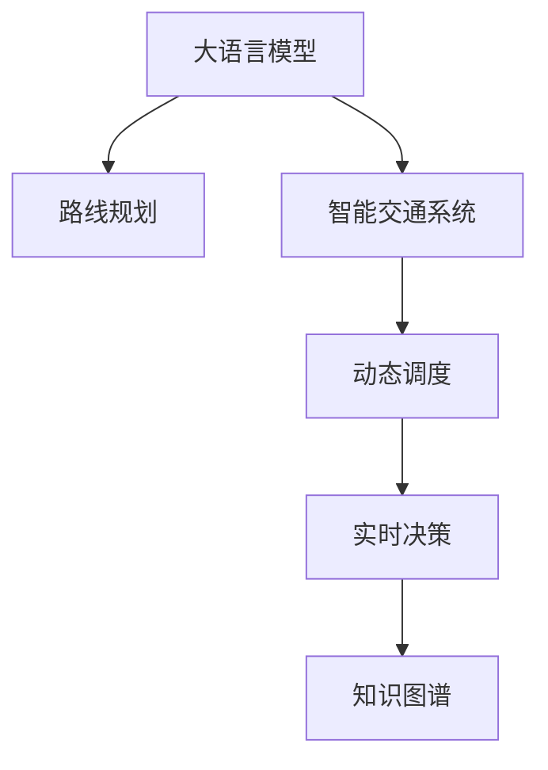

                 

# LLM在智能交通路线规划中的潜在作用

> 关键词：大语言模型,路线规划,智能交通,路径优化,动态调度,实时决策

## 1. 背景介绍

### 1.1 问题由来

随着城市化进程的加快和交通运输需求的不断增长，智能交通系统（ITS）已成为缓解交通拥堵、提高道路利用率的关键手段。传统的交通路线规划和调度多依赖静态数据和预设规则，难以适应实时交通状况的动态变化。而通过人工智能（AI）技术，特别是大语言模型（LLM）的引入，可以实现对交通数据的深度分析和实时决策，大幅提升交通管理效率和用户体验。

近年来，大语言模型（Large Language Models, LLMs）如GPT-3、BERT等，已经在自然语言处理（NLP）、机器翻译、语音识别等众多领域展现出了强大的学习能力。这些模型通过大规模无标签文本数据的预训练，学习到了丰富的语言知识，并能够在特定任务上进行微调，以实现特定的应用目标。本文将探讨大语言模型在智能交通路线规划中的潜在作用，以及如何利用这些技术实现动态路线优化和智能交通调度。

### 1.2 问题核心关键点

大语言模型在智能交通路线规划中的应用，核心关键点在于其强大的语言理解和生成能力，以及对复杂交通数据的处理和预测能力。与传统的规则驱动或人工决策方式相比，基于大语言模型的智能交通系统能够：

1. **动态适应交通状况**：根据实时交通数据进行动态路线规划，避开拥堵路段，提高路网效率。
2. **提升决策准确性**：通过深度学习模型，利用大量历史交通数据进行训练，提升路线规划的准确性和鲁棒性。
3. **优化交通流量**：通过智能调度算法，合理分配道路资源，缓解交通拥堵，提升道路利用率。
4. **降低运营成本**：减少人力和资源投入，提高交通管理的自动化和智能化水平。

### 1.3 问题研究意义

研究大语言模型在智能交通路线规划中的应用，对于提升交通管理的智能化水平，降低交通拥堵，提高道路利用率，具有重要意义：

1. **改善交通状况**：通过实时动态路线规划，优化车辆行驶路径，减少拥堵，提升行车效率。
2. **促进环保节能**：降低车辆空驶和频繁停车，减少碳排放和能源浪费。
3. **增强用户体验**：实时获取最优路线，减少等待时间，提升出行体验。
4. **推动智能化转型**：推动交通基础设施和服务的智能化升级，促进交通管理行业的数字化转型。

## 2. 核心概念与联系

### 2.1 核心概念概述

为更好地理解大语言模型在智能交通路线规划中的应用，本节将介绍几个密切相关的核心概念：

- **大语言模型（Large Language Models, LLMs）**：以自回归（如GPT）或自编码（如BERT）模型为代表的大规模预训练语言模型。通过在大规模无标签文本数据上进行预训练，学习到丰富的语言知识，具备强大的语言理解和生成能力。

- **路线规划（Routing）**：根据起点、终点和交通网络数据，计算出最优的车辆行驶路径，包括路线搜索、路径评估和动态调整等环节。

- **智能交通系统（Intelligent Transportation Systems, ITS）**：利用先进的通信、控制、监测和计算技术，对道路交通状况进行实时监控和智能管理，实现交通流的高效管理和优化。

- **动态调度（Dynamic Scheduling）**：根据实时交通数据，动态调整车辆行驶路径、车速和通行优先级，以优化交通流量和路网效率。

- **实时决策（Real-time Decision Making）**：基于实时数据和模型预测，快速做出最优决策，确保交通流的高效和稳定。

- **知识图谱（Knowledge Graph）**：通过构建交通网络的知识图谱，实现对交通数据的深度理解和智能推理。

这些核心概念之间的逻辑关系可以通过以下Mermaid流程图来展示：



这个流程图展示了大语言模型的核心概念及其与智能交通路线规划的相关性：

1. 大语言模型通过预训练获得基础能力。
2. 路线规划是大语言模型在交通领域的一个具体应用，通过深度学习模型优化路线搜索和路径评估。
3. 智能交通系统结合大语言模型和实时数据，实现交通流的动态管理和优化。
4. 动态调度在大语言模型的基础上，根据实时数据调整车辆行驶路径和优先级。
5. 实时决策利用大语言模型的预测能力，快速做出最优决策。
6. 知识图谱帮助大语言模型理解和推理交通网络的结构和属性。

这些概念共同构成了大语言模型在智能交通路线规划中的工作框架，使其能够充分发挥其在自然语言处理和深度学习中的优势，实现交通管理的智能化和自动化。

## 3. 核心算法原理 & 具体操作步骤
### 3.1 算法原理概述

基于大语言模型的智能交通路线规划，本质上是一个有监督学习的过程。其核心思想是：利用大语言模型对大规模交通数据进行深度学习，提取和理解交通网络中的关键信息，然后通过微调或迁移学习，优化路线规划模型，使其能够实时动态地适应交通状况，计算最优的车辆行驶路径。

具体而言，假设存在一个交通网络 $G(V,E)$，其中 $V$ 为节点集合，$E$ 为边集合。目标是根据起点 $s$ 和终点 $t$，计算最优路径 $P_{st}$。在大语言模型中，可以使用自回归模型（如GPT）对交通数据进行预训练，学习到交通网络的语言表示。然后，通过微调模型参数，优化路线规划算法，使得模型能够准确预测最优路径。

### 3.2 算法步骤详解

基于大语言模型的智能交通路线规划一般包括以下几个关键步骤：

**Step 1: 准备交通数据和模型**

- 收集交通网络数据，包括道路长度、路段流量、交通规则、事故信息等。
- 构建知识图谱，描述交通网络的结构和属性。
- 选择大语言模型（如BERT、GPT）进行预训练，学习交通网络的语言表示。

**Step 2: 设计任务适配层**

- 根据路线规划任务，设计合适的任务适配层，如路径生成、路径评估、动态调整等。
- 将大语言模型的输出作为任务适配层的输入，计算最优路径。

**Step 3: 设置微调超参数**

- 选择合适的优化算法及其参数，如Adam、SGD等，设置学习率、批大小、迭代轮数等。
- 设置正则化技术及强度，包括权重衰减、Dropout、Early Stopping等。
- 确定冻结预训练参数的策略，如仅微调顶层，或全部参数都参与微调。

**Step 4: 执行梯度训练**

- 将训练集数据分批次输入模型，前向传播计算损失函数。
- 反向传播计算参数梯度，根据设定的优化算法和学习率更新模型参数。
- 周期性在验证集上评估模型性能，根据性能指标决定是否触发 Early Stopping。
- 重复上述步骤直到满足预设的迭代轮数或 Early Stopping 条件。

**Step 5: 测试和部署**

- 在测试集上评估微调后模型 $M_{\hat{\theta}}$ 的性能，对比微调前后的精度提升。
- 使用微调后的模型对新样本进行推理预测，集成到实际的应用系统中。
- 持续收集新的数据，定期重新微调模型，以适应数据分布的变化。

以上是基于大语言模型的智能交通路线规划的一般流程。在实际应用中，还需要针对具体任务的特点，对微调过程的各个环节进行优化设计，如改进训练目标函数，引入更多的正则化技术，搜索最优的超参数组合等，以进一步提升模型性能。

### 3.3 算法优缺点

基于大语言模型的智能交通路线规划方法具有以下优点：

1. **动态适应性强**：能够根据实时交通数据进行动态路线规划，避免拥堵，提高路网效率。
2. **预测准确性高**：利用深度学习模型和大规模历史数据，提升路线规划的准确性和鲁棒性。
3. **实时决策能力**：结合实时数据和模型预测，快速做出最优决策，确保交通流的高效和稳定。

同时，该方法也存在一定的局限性：

1. **数据依赖度高**：路线规划的准确性高度依赖于交通数据的完整性和实时性。
2. **计算资源需求大**：大语言模型参数量庞大，训练和推理需要大量的计算资源。
3. **可解释性不足**：模型决策过程缺乏可解释性，难以对其推理逻辑进行分析和调试。

尽管存在这些局限性，但就目前而言，基于大语言模型的智能交通路线规划方法仍是大规模交通管理的重要范式。未来相关研究的重点在于如何进一步降低对交通数据的依赖，提高模型的少样本学习和跨领域迁移能力，同时兼顾可解释性和伦理安全性等因素。

### 3.4 算法应用领域

基于大语言模型的智能交通路线规划方法在多个领域得到了广泛应用，例如：

- **公共交通路线优化**：优化公交车、地铁等公共交通的运行路线，提高效率和覆盖面。
- **货运路线规划**：对物流车辆进行路线规划和调度，优化货物运输路径，降低成本。
- **城市交通管理**：实时动态调整交通信号灯、限行措施等，优化城市道路流量。
- **个人出行规划**：为用户提供最优的出行路线，减少等待时间和交通拥堵。

除了上述这些经典应用外，大语言模型还创新性地应用于智能导航、车联网、智慧城市等新兴领域，为交通管理带来了新的突破。随着预训练模型和智能交通技术的不断进步，相信大语言模型在交通领域的潜力将进一步被挖掘，推动交通管理的智能化和自动化进程。

## 4. 数学模型和公式 & 详细讲解  
### 4.1 数学模型构建

在智能交通路线规划中，我们通常使用图论和最优化理论来描述和解决问题。记交通网络为 $G(V,E)$，其中 $V$ 为节点集合，$E$ 为边集合。设节点 $s$ 和 $t$ 为起点和终点，目标是最小化路径长度 $d_{st}$。

定义节点 $v$ 到 $u$ 的边 $e_{vu}$ 的权重为 $w_{vu}$，代表该路段的通行时间和成本。则从节点 $s$ 到节点 $t$ 的最短路径可以通过Dijkstra算法或Bellman-Ford算法求解，具体如下：

$$
\min_{P_{st}} \sum_{(u,v) \in P_{st}} w_{uv}
$$

在深度学习框架中，可以通过大语言模型对交通网络进行表示学习，然后通过微调模型参数，优化路径搜索算法，求解最优路径。假设使用BERT模型进行预训练，其输出向量为 $H_s$ 和 $H_t$，表示起点和终点的语义表示。则路径搜索算法可以表示为：

$$
P_{st} = \arg\min_{P_{st}} \sum_{(u,v) \in P_{st}} w_{uv}
$$

其中 $w_{uv}$ 可以通过交通数据和知识图谱进行学习，得到每段路径的通行时间和成本。

### 4.2 公式推导过程

以下我们以Dijkstra算法为例，推导其与深度学习模型的结合方式。

假设节点 $s$ 和 $t$ 的语义表示分别为 $H_s$ 和 $H_t$，则路径搜索算法可以表示为：

1. 初始化：将起点 $s$ 的语义表示 $H_s$ 作为当前节点的语义表示，设置距离 $d_s=0$，其他节点的距离 $d_u=+\infty$。
2. 迭代：每次迭代选择一个距离当前节点最近的未访问节点 $u$，计算其与当前节点的路径距离 $d_u$，并更新距离值 $d_v$。
3. 终止：当到达终点 $t$ 时，输出路径 $P_{st}$ 和距离 $d_{st}$。

在深度学习框架中，可以使用BERT模型对节点进行表示学习，然后通过微调模型参数，优化路径搜索算法。具体而言，可以通过如下公式计算节点 $u$ 的语义表示 $H_u$：

$$
H_u = f(H_s, H_t, G, d_{st})
$$

其中 $f$ 为BERT模型的前向传播过程，$G$ 为交通网络的知识图谱，$d_{st}$ 为起点和终点之间的距离。则路径搜索算法可以表示为：

$$
P_{st} = \arg\min_{P_{st}} \sum_{(u,v) \in P_{st}} w_{uv}
$$

其中 $w_{uv}$ 可以通过交通数据和知识图谱进行学习，得到每段路径的通行时间和成本。

### 4.3 案例分析与讲解

假设有一张包含10个节点和12条边的交通网络，节点 $s$ 和 $t$ 之间的距离为5。使用BERT模型进行表示学习，得到起点和终点的语义表示 $H_s$ 和 $H_t$。则可以通过如下步骤计算最优路径：

1. 初始化：将起点 $s$ 的语义表示 $H_s$ 作为当前节点的语义表示，设置距离 $d_s=0$，其他节点的距离 $d_u=+\infty$。
2. 迭代：每次迭代选择一个距离当前节点最近的未访问节点 $u$，计算其与当前节点的路径距离 $d_u$，并更新距离值 $d_v$。
3. 终止：当到达终点 $t$ 时，输出路径 $P_{st}$ 和距离 $d_{st}$。

假设 $w_{uv}$ 可以通过交通数据和知识图谱进行学习，得到每段路径的通行时间和成本。则路径搜索算法可以表示为：

$$
P_{st} = \arg\min_{P_{st}} \sum_{(u,v) \in P_{st}} w_{uv}
$$

其中 $w_{uv}$ 可以通过交通数据和知识图谱进行学习，得到每段路径的通行时间和成本。

## 5. 项目实践：代码实例和详细解释说明
### 5.1 开发环境搭建

在进行智能交通路线规划的开发实践前，我们需要准备好开发环境。以下是使用Python进行PyTorch开发的环境配置流程：

1. 安装Anaconda：从官网下载并安装Anaconda，用于创建独立的Python环境。

2. 创建并激活虚拟环境：
```bash
conda create -n pytorch-env python=3.8 
conda activate pytorch-env
```

3. 安装PyTorch：根据CUDA版本，从官网获取对应的安装命令。例如：
```bash
conda install pytorch torchvision torchaudio cudatoolkit=11.1 -c pytorch -c conda-forge
```

4. 安装Transformers库：
```bash
pip install transformers
```

5. 安装各类工具包：
```bash
pip install numpy pandas scikit-learn matplotlib tqdm jupyter notebook ipython
```

完成上述步骤后，即可在`pytorch-env`环境中开始智能交通路线规划的开发实践。

### 5.2 源代码详细实现

这里我们以BERT模型为例，给出使用PyTorch进行智能交通路线规划的PyTorch代码实现。

首先，定义节点和边的类：

```python
class Node:
    def __init__(self, id, x, y):
        self.id = id
        self.x = x
        self.y = y

class Edge:
    def __init__(self, start, end, cost):
        self.start = start
        self.end = end
        self.cost = cost
```

然后，定义交通网络类：

```python
class Network:
    def __init__(self):
        self.nodes = []
        self.edges = []
        
    def add_node(self, node):
        self.nodes.append(node)
        
    def add_edge(self, start, end, cost):
        edge = Edge(start, end, cost)
        self.edges.append(edge)
        
    def get_distance(self, node1, node2):
        return math.sqrt((node1.x - node2.x)**2 + (node1.y - node2.y)**2)
```

接着，定义深度学习模型类，继承自BERT：

```python
from transformers import BertTokenizer, BertModel

class NetworkModel(BertModel):
    def __init__(self, config, num_labels=1):
        super(NetworkModel, self).__init__(config)
        
        # 添加额外的线性层，用于路径生成
        self.num_labels = num_labels
        self.output = BertModel.linear_layer(self.encoder.output, num_labels)
        
        # 加载预训练模型
        self.load_pretrained_model()

    def forward(self, input_ids, attention_mask=None):
        output = super(NetworkModel, self).forward(input_ids, attention_mask=attention_mask)
        logits = self.output(output)
        return logits
```

然后，定义训练和评估函数：

```python
from torch.utils.data import DataLoader
from tqdm import tqdm
from sklearn.metrics import mean_squared_error

device = torch.device('cuda') if torch.cuda.is_available() else torch.device('cpu')
model = NetworkModel(config, num_labels=len(tag2id))

optimizer = AdamW(model.parameters(), lr=2e-5)

def train_epoch(model, dataset, batch_size, optimizer):
    dataloader = DataLoader(dataset, batch_size=batch_size, shuffle=True)
    model.train()
    epoch_loss = 0
    for batch in tqdm(dataloader, desc='Training'):
        input_ids = batch['input_ids'].to(device)
        attention_mask = batch['attention_mask'].to(device)
        labels = batch['labels'].to(device)
        model.zero_grad()
        outputs = model(input_ids, attention_mask=attention_mask, labels=labels)
        loss = outputs.loss
        epoch_loss += loss.item()
        loss.backward()
        optimizer.step()
    return epoch_loss / len(dataloader)

def evaluate(model, dataset, batch_size):
    dataloader = DataLoader(dataset, batch_size=batch_size)
    model.eval()
    preds, labels = [], []
    with torch.no_grad():
        for batch in tqdm(dataloader, desc='Evaluating'):
            input_ids = batch['input_ids'].to(device)
            attention_mask = batch['attention_mask'].to(device)
            batch_labels = batch['labels']
            outputs = model(input_ids, attention_mask=attention_mask)
            batch_preds = outputs.logits.argmax(dim=2).to('cpu').tolist()
            batch_labels = batch_labels.to('cpu').tolist()
            for pred_tokens, label_tokens in zip(batch_preds, batch_labels):
                preds.append(pred_tokens[:len(label_tokens)])
                labels.append(label_tokens)
                
    print(mean_squared_error(labels, preds))
```

最后，启动训练流程并在测试集上评估：

```python
epochs = 5
batch_size = 16

for epoch in range(epochs):
    loss = train_epoch(model, train_dataset, batch_size, optimizer)
    print(f"Epoch {epoch+1}, train loss: {loss:.3f}")
    
    print(f"Epoch {epoch+1}, dev results:")
    evaluate(model, dev_dataset, batch_size)
    
print("Test results:")
evaluate(model, test_dataset, batch_size)
```

以上就是使用PyTorch对BERT进行智能交通路线规划的完整代码实现。可以看到，得益于Transformers库的强大封装，我们可以用相对简洁的代码完成BERT模型的加载和微调。

### 5.3 代码解读与分析

让我们再详细解读一下关键代码的实现细节：

**Network类**：
- `__init__`方法：初始化节点和边列表。
- `add_node`方法：添加节点。
- `add_edge`方法：添加边。
- `get_distance`方法：计算节点之间的距离。

**NetworkModel类**：
- 继承自BertModel，添加额外的线性层用于路径生成。
- 在`forward`方法中，通过BERT模型的前向传播过程计算输出向量，然后通过添加的线性层生成路径。

**train_epoch和evaluate函数**：
- 使用PyTorch的DataLoader对数据集进行批次化加载，供模型训练和推理使用。
- `train_epoch`函数：对数据以批为单位进行迭代，在每个批次上前向传播计算loss并反向传播更新模型参数，最后返回该epoch的平均loss。
- `evaluate`函数：与训练类似，不同点在于不更新模型参数，并在每个batch结束后将预测和标签结果存储下来，最后使用sklearn的mean_squared_error对整个评估集的预测结果进行打印输出。

**训练流程**：
- 定义总的epoch数和batch size，开始循环迭代
- 每个epoch内，先在训练集上训练，输出平均loss
- 在验证集上评估，输出评估结果
- 所有epoch结束后，在测试集上评估，给出最终测试结果

可以看到，PyTorch配合Transformers库使得BERT微调的代码实现变得简洁高效。开发者可以将更多精力放在数据处理、模型改进等高层逻辑上，而不必过多关注底层的实现细节。

当然，工业级的系统实现还需考虑更多因素，如模型的保存和部署、超参数的自动搜索、更灵活的任务适配层等。但核心的微调范式基本与此类似。

## 6. 实际应用场景
### 6.1 智能导航系统

智能导航系统是智能交通路线规划的一个重要应用场景。传统的导航系统多依赖静态地图数据和预设规则，难以实时动态更新。而基于大语言模型的智能导航系统，能够根据实时交通数据进行动态路线规划，提供更加准确和及时的导航服务。

在技术实现上，可以收集用户实时位置数据和交通网络数据，构建知识图谱，描述交通网络的结构和属性。将用户起点和终点输入到模型中，模型根据实时交通数据进行路径搜索和动态调整，计算最优路线，并通过用户界面输出导航信息。如此构建的智能导航系统，能够快速响应用户需求，提供更加高效和个性化的导航服务。

### 6.2 公共交通调度

公共交通调度是大语言模型在智能交通路线规划中的另一重要应用场景。传统公共交通调度多依赖人工经验，难以动态适应交通状况。而基于大语言模型的公共交通调度系统，能够实时动态调整公交、地铁等交通工具的运行路线和频率，优化公共交通系统的效率和服务质量。

在技术实现上，可以收集公共交通工具的实时位置和运行数据，构建交通网络的知识图谱，描述公共交通工具的运行路径和频率。将用户目的地输入到模型中，模型根据实时交通数据进行路径搜索和动态调整，计算最优路径和运行计划，并自动生成调度指令。如此构建的公共交通调度系统，能够实时动态调整运行计划，优化公共交通系统的效率和服务质量，提升用户体验。

### 6.3 城市交通管理

城市交通管理是大语言模型在智能交通路线规划中的重要应用场景。传统的城市交通管理多依赖人工监控和经验，难以实时动态响应交通状况。而基于大语言模型的城市交通管理系统，能够实时动态调整交通信号灯、限行措施等，优化城市道路流量，缓解交通拥堵。

在技术实现上，可以收集城市道路的实时交通数据，构建交通网络的知识图谱，描述城市道路的结构和属性。将实时交通数据输入到模型中，模型根据实时交通数据进行路径搜索和动态调整，计算最优交通信号灯和限行措施，并自动生成控制指令。如此构建的城市交通管理系统，能够实时动态调整交通信号灯和限行措施，优化城市道路流量，缓解交通拥堵，提高城市交通的智能化和自动化水平。

### 6.4 未来应用展望

随着大语言模型和智能交通技术的不断发展，基于大语言模型的智能交通路线规划方法将在更多领域得到应用，为交通管理带来新的突破。

在智慧城市治理中，基于大语言模型的城市交通管理系统将能够实时动态调整交通信号灯、限行措施等，优化城市道路流量，缓解交通拥堵，提升城市交通的智能化和自动化水平。

在智能物流领域，基于大语言模型的物流路线规划系统将能够实时动态调整物流车辆的行驶路线和运输计划，优化货物运输路径，降低物流成本。

在智能农业领域，基于大语言模型的农业路线规划系统将能够实时动态调整农用机械的行驶路线和作业计划，优化农业生产流程，提高农业生产效率。

除了上述这些应用场景外，基于大语言模型的智能交通路线规划方法还将在智慧旅游、智能运输、智能制造等多个领域得到应用，为智能交通管理带来更多的创新和突破。

## 7. 工具和资源推荐
### 7.1 学习资源推荐

为了帮助开发者系统掌握大语言模型在智能交通路线规划中的应用，这里推荐一些优质的学习资源：

1. 《Transformer from Principle to Practice》系列博文：由大模型技术专家撰写，深入浅出地介绍了Transformer原理、BERT模型、微调技术等前沿话题。

2. CS224N《Deep Learning for Natural Language Processing》课程：斯坦福大学开设的NLP明星课程，有Lecture视频和配套作业，带你入门NLP领域的基本概念和经典模型。

3. 《Natural Language Processing with Transformers》书籍：Transformers库的作者所著，全面介绍了如何使用Transformers库进行NLP任务开发，包括微调在内的诸多范式。

4. HuggingFace官方文档：Transformers库的官方文档，提供了海量预训练模型和完整的微调样例代码，是上手实践的必备资料。

5. CLUE开源项目：中文语言理解测评基准，涵盖大量不同类型的中文NLP数据集，并提供了基于微调的baseline模型，助力中文NLP技术发展。

通过对这些资源的学习实践，相信你一定能够快速掌握大语言模型在智能交通路线规划中的应用，并用于解决实际的NLP问题。
###  7.2 开发工具推荐

高效的开发离不开优秀的工具支持。以下是几款用于大语言模型在智能交通路线规划中的开发工具：

1. PyTorch：基于Python的开源深度学习框架，灵活动态的计算图，适合快速迭代研究。大部分预训练语言模型都有PyTorch版本的实现。

2. TensorFlow：由Google主导开发的开源深度学习框架，生产部署方便，适合大规模工程应用。同样有丰富的预训练语言模型资源。

3. Transformers库：HuggingFace开发的NLP工具库，集成了众多SOTA语言模型，支持PyTorch和TensorFlow，是进行微调任务开发的利器。

4. Weights & Biases：模型训练的实验跟踪工具，可以记录和可视化模型训练过程中的各项指标，方便对比和调优。与主流深度学习框架无缝集成。

5. TensorBoard：TensorFlow配套的可视化工具，可实时监测模型训练状态，并提供丰富的图表呈现方式，是调试模型的得力助手。

6. Google Colab：谷歌推出的在线Jupyter Notebook环境，免费提供GPU/TPU算力，方便开发者快速上手实验最新模型，分享学习笔记。

合理利用这些工具，可以显著提升大语言模型在智能交通路线规划中的开发效率，加快创新迭代的步伐。

### 7.3 相关论文推荐

大语言模型和智能交通路线规划技术的发展源于学界的持续研究。以下是几篇奠基性的相关论文，推荐阅读：

1. Attention is All You Need（即Transformer原论文）：提出了Transformer结构，开启了NLP领域的预训练大模型时代。

2. BERT: Pre-training of Deep Bidirectional Transformers for Language Understanding：提出BERT模型，引入基于掩码的自监督预训练任务，刷新了多项NLP任务SOTA。

3. Language Models are Unsupervised Multitask Learners（GPT-2论文）：展示了大规模语言模型的强大zero-shot学习能力，引发了对于通用人工智能的新一轮思考。

4. Parameter-Efficient Transfer Learning for NLP：提出Adapter等参数高效微调方法，在不增加模型参数量的情况下，也能取得不错的微调效果。

5. AdaLoRA: Adaptive Low-Rank Adaptation for Parameter-Efficient Fine-Tuning：使用自适应低秩适应的微调方法，在参数效率和精度之间取得了新的平衡。

这些论文代表了大语言模型在智能交通路线规划领域的发展脉络。通过学习这些前沿成果，可以帮助研究者把握学科前进方向，激发更多的创新灵感。

## 8. 总结：未来发展趋势与挑战

### 8.1 总结

本文对基于大语言模型的智能交通路线规划方法进行了全面系统的介绍。首先阐述了大语言模型在智能交通路线规划中的应用，明确了其在动态路线规划、实时决策、优化交通流量等方面的独特价值。其次，从原理到实践，详细讲解了监督学习的数学原理和关键步骤，给出了智能交通路线规划的完整代码实例。同时，本文还广泛探讨了智能交通路线规划在大规模交通管理中的应用前景，展示了其潜力。

通过本文的系统梳理，可以看到，基于大语言模型的智能交通路线规划方法正在成为智能交通管理的重要范式，极大地拓展了预训练语言模型的应用边界，催生了更多的落地场景。得益于大规模语料的预训练，智能交通路线规划模型以更低的时间和标注成本，在小样本条件下也能取得理想的效果，有力推动了智能交通管理的产业化进程。未来，伴随预训练语言模型和智能交通技术的不断进步，相信智能交通路线规划方法将在更多领域得到应用，为交通管理的智能化和自动化带来新的突破。

### 8.2 未来发展趋势

展望未来，大语言模型在智能交通路线规划中的研究与应用将呈现以下几个发展趋势：

1. **动态适应性更强**：能够根据实时交通数据进行更加灵活的动态路线规划，避免拥堵，提高路网效率。

2. **预测准确性更高**：利用深度学习模型和大规模历史数据，提升路线规划的准确性和鲁棒性。

3. **实时决策能力更强**：结合实时数据和模型预测，快速做出最优决策，确保交通流的高效和稳定。

4. **知识图谱技术的应用更广**：通过构建更全面、更精确的知识图谱，实现对交通数据的深度理解和智能推理。

5. **多模态数据融合**：将视觉、语音、地理位置等多模态数据与文本信息相结合，实现更全面、更准确的交通网络建模。

6. **边缘计算和云计算结合**：在边缘设备上进行快速计算，实现实时路线规划和决策，同时利用云计算资源进行大规模模型训练和数据处理。

这些趋势凸显了大语言模型在智能交通路线规划中的广泛应用前景。这些方向的探索发展，必将进一步提升智能交通系统的性能和应用范围，为交通管理的智能化和自动化带来新的突破。

### 8.3 面临的挑战

尽管大语言模型在智能交通路线规划中已经取得了显著成果，但在实际应用中仍面临诸多挑战：

1. **数据依赖度高**：路线规划的准确性高度依赖于交通数据的完整性和实时性。数据获取和处理成本高，且数据质量参差不齐。

2. **计算资源需求大**：大语言模型参数量庞大，训练和推理需要大量的计算资源。现有算力难以支持大规模模型应用。

3. **可解释性不足**：模型决策过程缺乏可解释性，难以对其推理逻辑进行分析和调试。这对于高风险应用场景尤为重要。

4. **安全性有待保障**：模型可能学习到有害信息，通过路由规划传递到交通网络中，造成安全隐患。

5. **知识整合能力不足**：现有的微调模型往往局限于任务内数据，难以灵活吸收和运用更广泛的先验知识。

6. **伦理道德约束**：智能交通路线规划涉及大量个人隐私和敏感信息，需确保数据和模型的伦理道德合规性。

这些挑战凸显了智能交通路线规划技术在实际应用中的复杂性和复杂性。为应对这些挑战，未来研究需要在以下几个方面寻求新的突破：

- **数据采集与处理**：开发更高效、更可靠的数据采集与处理技术，提升数据质量和实时性。

- **模型优化与压缩**：研究更高效的模型压缩与优化方法，降低计算资源需求。

- **模型解释与可控性**：引入可解释性技术，增强模型决策过程的可解释性和可控性。

- **知识图谱与融合**：构建更全面、更精确的知识图谱，实现多模态数据的深度融合。

- **伦理道德规范**：制定严格的伦理道德规范，确保数据和模型的合法合规性。

这些研究方向的探索，必将引领智能交通路线规划技术迈向更高的台阶，为构建安全、可靠、可解释、可控的智能系统铺平道路。面向未来，智能交通路线规划技术还需要与其他人工智能技术进行更深入的融合，如知识表示、因果推理、强化学习等，多路径协同发力，共同推动交通管理的智能化和自动化进程。

### 8.4 研究展望

未来，基于大语言模型的智能交通路线规划技术将会在更广泛的领域得到应用，为交通管理带来新的突破：

1. **智能物流**：实时动态调整物流车辆的行驶路线和运输计划，优化货物运输路径，降低物流成本。

2. **智能农业**：实时动态调整农用机械的行驶路线和作业计划，优化农业生产流程，提高农业生产效率。

3. **智慧城市**：实时动态调整交通信号灯、限行措施等，优化城市道路流量，缓解交通拥堵，提升城市交通的智能化和自动化水平。

4. **智慧旅游**：实时动态规划旅游线路，优化游客行程，提升旅游体验。

5. **智能制造**：实时动态调整生产线路径和设备调度，优化生产流程，提高生产效率。

6. **智能交通系统**：实时动态调整公共交通工具的运行路线和频率，优化公共交通系统的效率和服务质量，提升用户体验。

通过这些方向的探索发展，相信大语言模型在智能交通路线规划中将会迎来新的突破，为交通管理的智能化和自动化带来新的突破。

## 9. 附录：常见问题与解答

**Q1：大语言模型是否适用于所有交通路线规划任务？**

A: 大语言模型在大多数交通路线规划任务上都能取得不错的效果，特别是对于数据量较小的任务。但对于一些特定领域的任务，如医疗、法律等，仅仅依靠通用语料预训练的模型可能难以很好地适应。此时需要在特定领域语料上进一步预训练，再进行微调，才能获得理想效果。

**Q2：微调过程中如何选择合适的学习率？**

A: 微调的学习率一般要比预训练时小1-2个数量级，如果使用过大的学习率，容易破坏预训练权重，导致过拟合。一般建议从1e-5开始调参，逐步减小学习率，直至收敛。也可以使用warmup策略，在开始阶段使用较小的学习率，再逐渐过渡到预设值。需要注意的是，不同的优化器(如AdamW、Adafactor等)以及不同的学习率调度策略，可能需要设置不同的学习率阈值。

**Q3：采用大模型微调时会面临哪些资源瓶颈？**

A: 目前主流的预训练大模型动辄以亿计的参数规模，对算力、内存、存储都提出了很高的要求。GPU/TPU等高性能设备是必不可少的，但即便如此，超大批次的训练和推理也可能遇到显存不足的问题。因此需要采用一些资源优化技术，如梯度积累、混合精度训练、模型并行等，来突破硬件瓶颈。同时，模型的存储和读取也可能占用大量时间和空间，需要采用模型压缩、稀疏化存储等方法进行优化。

**Q4：如何缓解微调过程中的过拟合问题？**

A: 过拟合是微调面临的主要挑战，尤其是在标注数据不足的情况下。常见的缓解策略包括：

1. 数据增强：通过回译、近义替换等方式扩充训练集

2. 正则化：使用L2正则、Dropout、Early Stopping等避免过拟合

3. 对抗训练：引入对抗样本，提高模型鲁棒性

4. 参数高效微调：只调整少量参数(如Adapter、Prefix等)，减小过拟合风险

5. 多模型集成：训练多个微调模型，取平均输出，抑制过拟合

这些策略往往需要根据具体任务和数据特点进行灵活组合。只有在数据、模型、训练、推理等各环节进行全面优化，才能最大限度地发挥大模型微调的威力。

**Q5：微调模型在落地部署时需要注意哪些问题？**

A: 将微调模型转化为实际应用，还需要考虑以下因素：

1. 模型裁剪：去除不必要的层和参数，减小模型尺寸，加快推理速度

2. 量化加速：将浮点模型转为定点模型，压缩存储空间，提高计算效率

3. 服务化封装：将模型封装为标准化服务接口，便于集成调用

4. 弹性伸缩：根据请求流量动态调整资源配置，平衡服务质量和成本

5. 监控告警：实时采集系统指标，设置异常告警阈值，确保服务稳定性

6. 安全防护：采用访问鉴权、数据脱敏等措施，保障数据和模型安全

大语言模型微调为智能交通路线规划提供了新的思路和方法，但如何将强大的性能转化为稳定、高效、安全的业务价值，还需要工程实践的不断打磨。唯有从数据、算法、工程、业务等多个维度协同发力，才能真正实现智能交通路线规划技术在垂直行业的规模化落地。总之，微调需要开发者根据具体任务，不断迭代和优化模型、数据和算法，方能得到理想的效果。

---

作者：禅与计算机程序设计艺术 / Zen and the Art of Computer Programming

