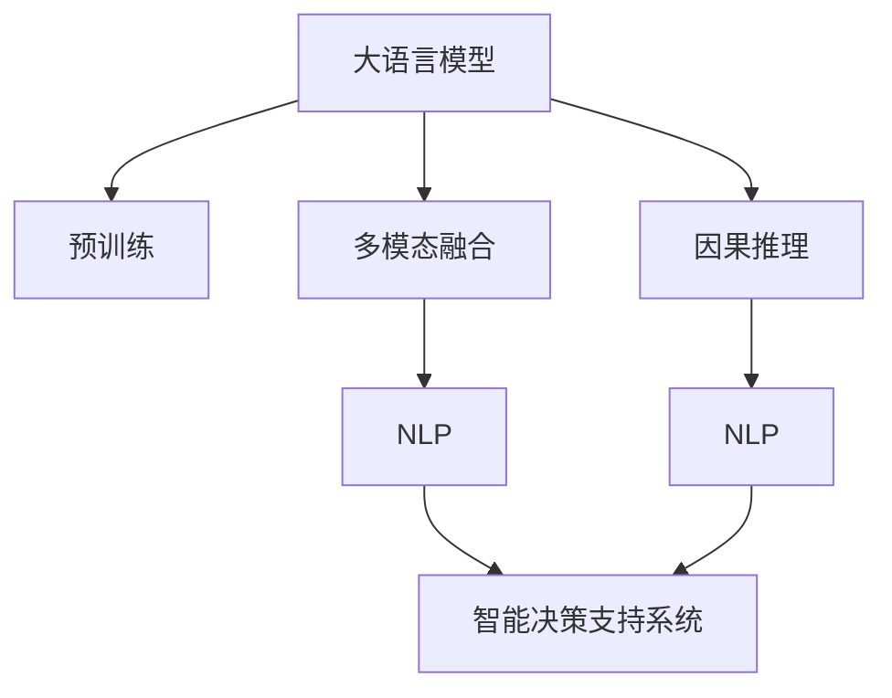

                 

# LLM在智能决策支持中的应用

> 关键词：大语言模型, 智能决策支持系统, 预测模型, 多模态融合, 因果推理, 自然语言处理(NLP)

## 1. 背景介绍

### 1.1 问题由来
随着大数据和人工智能技术的迅猛发展，智能决策支持系统（Intelligent Decision Support System, IDSS）在企业经营管理、医疗健康、金融保险等众多领域得到了广泛应用。传统IDSS系统往往依赖于专家知识和规则库，存在数据缺乏动态性、决策过程复杂、结果可解释性差等问题。

近年来，预训练大语言模型（Large Language Model, LLM）的兴起为这些问题提供了新的解决思路。通过利用大规模无标签文本语料预训练，LLM模型学习到了丰富的语言知识，具备强大的自然语言理解与生成能力。将其应用到智能决策支持系统中，可极大地提升系统的智能性和适用性。

### 1.2 问题核心关键点
LLM在智能决策支持系统中的核心作用在于：
- **知识提取**：从自然语言文本中自动提取关键信息，如统计数据、市场趋势、新闻资讯等。
- **知识整合**：将各类知识源进行整合，形成一致、统一的语义表示。
- **知识推理**：基于语义理解，进行逻辑推理和因果推断，形成预测和决策依据。
- **知识生成**：生成文本报告、预测报告、建议书等，支持人机交互。

## 2. 核心概念与联系

### 2.1 核心概念概述

为更好地理解LLM在智能决策支持系统中的应用，本节将介绍几个密切相关的核心概念：

- **大语言模型(Large Language Model, LLM)**：指基于自回归或自编码模型，通过大规模无标签文本语料进行预训练，学习通用的语言表示，具备强大的自然语言理解和生成能力。
- **预训练(Pre-training)**：指在大规模无标签文本语料上，通过自监督学习任务训练通用语言模型的过程。常见的预训练任务包括掩码语言模型、下一句预测等。
- **多模态融合(Multimodal Fusion)**：指将不同模态的数据（如文本、图像、声音等）进行融合，以提升决策支持的准确性和全面性。
- **因果推理(Causal Reasoning)**：指通过逻辑推理和因果推断，理解和预测因果关系，提升决策支持的逻辑性和准确性。
- **自然语言处理(Natural Language Processing, NLP)**：指通过计算算法，让计算机理解和生成自然语言，从而支持智能决策和自动化处理。

这些核心概念之间的逻辑关系可以通过以下Mermaid流程图来展示：



这个流程图展示了大语言模型在智能决策支持系统中的核心作用：

1. 大语言模型通过预训练获得基础能力。
2. 在智能决策支持系统中，与多模态数据和因果推理结合，进行知识提取、整合、推理和生成。
3. 最终支持系统实现自动决策和辅助决策。

## 3. 核心算法原理 & 具体操作步骤
### 3.1 算法原理概述

LLM在智能决策支持系统中的主要算法原理基于以下两个步骤：

1. **知识提取**：通过预训练模型，将输入的自然语言文本转换为语义表示，提取关键信息。
2. **知识推理**：基于提取到的知识进行因果推理，形成决策依据。

### 3.2 算法步骤详解

#### 3.2.1 知识提取

以股票市场决策为例，首先收集历史交易数据、新闻报道、分析师评论等文本信息，使用LLM模型进行知识提取：

1. **数据预处理**：清洗、归一化文本数据，分词、去除停用词，转换为模型输入格式。
2. **预训练模型**：使用预训练好的LLM模型（如BERT、GPT等），输入文本数据，提取语义表示。
3. **特征提取**：将LLM输出的语义表示进行特征提取，得到关键特征向量。

#### 3.2.2 知识推理

将提取的关键特征向量输入到预测模型中，进行因果推理：

1. **选择预测模型**：选择适合的预测模型，如线性回归、决策树、深度神经网络等，作为知识推理的工具。
2. **模型训练**：使用历史数据对预测模型进行训练，调整模型参数。
3. **预测决策**：将当前时间点的关键特征向量输入到训练好的模型中，预测市场趋势、股票价格等，生成决策依据。

### 3.3 算法优缺点

LLM在智能决策支持系统中的优势：
1. **高效性**：预训练模型可以快速处理大量文本数据，提取关键信息。
2. **普适性**：LLM可以应用于多种领域和场景，实现领域知识的自动化抽取和整合。
3. **灵活性**：LLM可以通过微调，适应特定领域和任务的需求。

但同时也存在以下局限性：
1. **数据依赖性**：预训练模型的性能依赖于数据质量，低质量的数据会导致模型提取信息的偏差。
2. **复杂性**：知识推理过程复杂，需要设计合适的模型和算法。
3. **可解释性差**：LLM模型的决策过程缺乏可解释性，难以理解其内部机制。

### 3.4 算法应用领域

LLM在智能决策支持系统中的应用主要包括以下几个领域：

- **金融预测**：通过分析历史交易数据、新闻报道、分析师评论等文本，进行股票市场、债券市场、外汇市场等预测。
- **医疗诊断**：利用患者病历、临床数据、医学文献等文本，进行疾病诊断、治疗方案推荐等。
- **企业运营**：通过分析销售数据、市场调研报告、客户反馈等文本，进行市场趋势预测、产品优化等。
- **安全监控**：利用监控视频、日志、传感器数据等，进行异常行为检测、网络攻击识别等。

## 4. 数学模型和公式 & 详细讲解  
### 4.1 数学模型构建

假设输入的文本数据为 $x$，通过预训练模型提取的语义表示为 $h$，预测模型为 $M$，输出为 $y$，则知识推理过程可以表示为：

$$
y = M(h)
$$

其中 $M$ 为预测模型，可以是任何能够将语义表示转换为预测结果的模型。

### 4.2 公式推导过程

以线性回归模型为例，公式推导如下：

设 $h \in \mathbb{R}^d$，$y \in \mathbb{R}^n$，则线性回归模型为：

$$
y = W h + b
$$

其中 $W \in \mathbb{R}^{n \times d}$ 为权重矩阵，$b \in \mathbb{R}^n$ 为偏置向量。

将输入 $x$ 转换为语义表示 $h$，代入上述公式，得：

$$
y = W \phi(x) + b
$$

其中 $\phi(x)$ 为文本转换器，将输入 $x$ 转换为语义表示 $h$。

### 4.3 案例分析与讲解

以股票市场预测为例，假设输入为前N天的交易数据 $D = [d_1, d_2, ..., d_N]$，其中 $d_i = [P_i, V_i]$，$P_i$ 为价格，$V_i$ 为成交量。使用BERT模型进行预训练，得到语义表示 $h$。假设输出为当前股票价格 $y$，则线性回归模型为：

$$
y = W h + b
$$

其中 $W \in \mathbb{R}^{1 \times 2d}$，$b \in \mathbb{R}^1$。

使用历史数据 $D_h = [d_1, d_2, ..., d_M]$（$M>N$）进行模型训练，得到权重矩阵 $W$ 和偏置向量 $b$。将当前日期的语义表示 $h_t$ 代入线性回归模型，即可预测当前股票价格 $y_t$。

## 5. 项目实践：代码实例和详细解释说明
### 5.1 开发环境搭建

在进行智能决策支持系统的开发前，需要先搭建开发环境。以下是使用Python进行TensorFlow开发的环境配置流程：

1. 安装Anaconda：从官网下载并安装Anaconda，用于创建独立的Python环境。

2. 创建并激活虚拟环境：
```bash
conda create -n tf-env python=3.8 
conda activate tf-env
```

3. 安装TensorFlow：根据CUDA版本，从官网获取对应的安装命令。例如：
```bash
pip install tensorflow
```

4. 安装各类工具包：
```bash
pip install numpy pandas scikit-learn matplotlib tqdm jupyter notebook ipython
```

完成上述步骤后，即可在`tf-env`环境中开始智能决策支持系统的开发。

### 5.2 源代码详细实现

下面我们以金融市场预测为例，给出使用TensorFlow对BERT模型进行预测的代码实现。

首先，定义输入和输出的数据结构：

```python
import tensorflow as tf

# 输入数据
X = tf.keras.Input(shape=(N, 2), name='Input')
# 输出数据
Y = tf.keras.Input(shape=(1,), name='Output')
```

然后，定义BERT模型：

```python
from transformers import TFBertModel

# BERT模型
bert_model = TFBertModel.from_pretrained('bert-base-uncased', output_attentions=False, output_hidden_states=False)
```

接着，定义预训练模型层：

```python
# 预训练模型层
pretrain_layer = bert_model(tf.expand_dims(X, axis=1), return_dict=True)
```

将预训练模型的输出作为输入，定义预测模型：

```python
# 预测模型层
linear_layer = tf.keras.layers.Dense(1, name='Linear')
```

将预测模型与预训练模型输出进行连接，定义模型：

```python
# 模型
model = tf.keras.Model(inputs=[X, Y], outputs=[linear_layer(pretrain_layer[0])])
```

最后，定义训练函数：

```python
def train_step(x, y):
    with tf.GradientTape() as tape:
        predictions = model(x, y)
        loss = tf.keras.losses.MSE(y, predictions)
    gradients = tape.gradient(loss, model.trainable_variables)
    optimizer.apply_gradients(zip(gradients, model.trainable_variables))
    return loss

# 训练
for epoch in range(EPOCHS):
    for batch in train_dataset:
        x_batch, y_batch = batch
        loss = train_step(x_batch, y_batch)
        print(f'Epoch {epoch+1}, loss: {loss:.4f}')
```

以上代码实现了使用BERT模型进行金融市场预测的完整过程。可以看到，使用TensorFlow和Transformers库，可以很方便地将预训练模型集成到预测系统中。

### 5.3 代码解读与分析

让我们再详细解读一下关键代码的实现细节：

**TensorFlow和Transformers库**：
- TensorFlow：深度学习框架，提供丰富的层和优化器。
- Transformers库：NLP模型库，提供了预训练语言模型和模型构建工具。

**输入和输出数据**：
- `tf.keras.Input`：定义输入和输出数据结构，支持多维输入和输出。
- `X` 和 `Y`：分别表示输入数据和输出数据。

**BERT模型层**：
- `TFBertModel.from_pretrained`：从HuggingFace预训练模型库中加载BERT模型。
- `return_dict=False`：表示只返回模型输出，不返回内部中间层的表示。

**预训练模型层**：
- `pretrain_layer = bert_model(tf.expand_dims(X, axis=1))`：将输入数据 $X$ 进行转换，以匹配BERT模型的输入格式。

**预测模型层**：
- `linear_layer = tf.keras.layers.Dense(1, name='Linear')`：定义线性回归层，将预训练模型的输出转换为预测结果。

**模型定义**：
- `model = tf.keras.Model(inputs=[X, Y], outputs=[linear_layer(pretrain_layer[0])])`：定义完整的模型，将预训练模型和预测模型层进行连接。

**训练函数**：
- `train_step(x, y)`：定义训练函数，计算损失并更新模型参数。
- `optimizer`：定义优化器，如Adam或SGD。

训练函数通过循环迭代，在每个epoch内对数据集进行批量训练，更新模型参数，并实时输出损失值。

## 6. 实际应用场景
### 6.1 智能投资决策

在金融领域，智能投资决策是大语言模型在智能决策支持系统中的重要应用场景。智能投资系统能够实时分析市场数据，预测股票价格走势，辅助投资者进行决策。

具体而言，系统首先收集历史交易数据、新闻报道、分析师评论等文本信息，通过BERT等预训练模型进行知识提取和语义表示。然后将提取的关键特征输入到预测模型中，进行因果推理和预测，生成投资建议。投资者可以根据系统推荐，进行买入、卖出等操作，提高投资效率和收益。

### 6.2 医疗诊断和治疗方案推荐

医疗领域对智能决策支持系统也有着广泛需求。医生可以通过输入病人的病历、医学文献等文本，利用大语言模型进行知识提取和整合。然后，将提取的信息输入到预测模型中，生成诊断报告和治疗方案推荐。系统还可以根据医生的反馈，不断优化算法和知识库，提高诊断和治疗的准确性。

### 6.3 企业战略规划

企业在进行战略规划时，需要收集市场数据、行业报告、客户反馈等文本信息。通过大语言模型进行知识提取和整合，形成市场趋势分析和竞争对手分析报告。管理者可以根据报告建议，制定企业战略规划，提升企业竞争力。

### 6.4 未来应用展望

随着大语言模型的不断发展，其在智能决策支持系统中的应用将更加广泛。未来可以预见以下趋势：

- **多模态融合**：系统将更多地融合图像、视频、声音等多种模态的数据，提升决策支持的全面性和准确性。
- **因果推理**：引入因果推断方法，提升决策支持的逻辑性和可信度。
- **联邦学习**：通过联邦学习技术，保护数据隐私和安全，实现分布式决策支持。
- **实时数据处理**：利用边缘计算和云服务，实现实时数据处理和决策支持。
- **自适应学习**：通过自适应学习算法，不断优化模型和算法，适应不同的决策场景。

## 7. 工具和资源推荐
### 7.1 学习资源推荐

为了帮助开发者系统掌握大语言模型在智能决策支持系统中的应用，这里推荐一些优质的学习资源：

1. 《深度学习理论与实践》系列博文：由大模型技术专家撰写，深入浅出地介绍了深度学习理论和实践，包括大语言模型在智能决策支持系统中的应用。

2. 《自然语言处理基础》课程：斯坦福大学开设的NLP明星课程，提供丰富的理论知识和实战案例。

3. 《BigQuery Machine Learning》书籍：介绍如何使用Google Cloud进行大数据分析和机器学习，包含多种预训练语言模型的应用实例。

4. TensorFlow官方文档：提供丰富的TensorFlow使用示例和API文档，方便开发者进行模型构建和训练。

5. TensorFlow Model Garden：TensorFlow官方提供的模型库，包含大量预训练模型和工具，方便开发者进行模型选择和集成。

通过对这些资源的学习实践，相信你一定能够快速掌握大语言模型在智能决策支持系统中的应用精髓，并用于解决实际的决策问题。
###  7.2 开发工具推荐

高效的开发离不开优秀的工具支持。以下是几款用于大语言模型在智能决策支持系统中应用的常用工具：

1. TensorFlow：基于Python的开源深度学习框架，适合构建大规模的智能决策支持系统。

2. PyTorch：灵活的深度学习框架，支持多种模型架构和优化器。

3. Transformers库：NLP工具库，提供丰富的预训练语言模型和模型构建工具。

4. Weights & Biases：模型训练的实验跟踪工具，可以记录和可视化模型训练过程中的各项指标，方便对比和调优。

5. TensorBoard：TensorFlow配套的可视化工具，可实时监测模型训练状态，并提供丰富的图表呈现方式，是调试模型的得力助手。

6. Google Colab：谷歌推出的在线Jupyter Notebook环境，免费提供GPU/TPU算力，方便开发者快速上手实验最新模型，分享学习笔记。

合理利用这些工具，可以显著提升大语言模型在智能决策支持系统中的应用效率，加快创新迭代的步伐。

### 7.3 相关论文推荐

大语言模型在智能决策支持系统中的应用源于学界的持续研究。以下是几篇奠基性的相关论文，推荐阅读：

1. Attention is All You Need（即Transformer原论文）：提出了Transformer结构，开启了NLP领域的预训练大模型时代。

2. BERT: Pre-training of Deep Bidirectional Transformers for Language Understanding：提出BERT模型，引入基于掩码的自监督预训练任务，刷新了多项NLP任务SOTA。

3. Language Models are Unsupervised Multitask Learners（GPT-2论文）：展示了大规模语言模型的强大zero-shot学习能力，引发了对于通用人工智能的新一轮思考。

4. Parameter-Efficient Transfer Learning for NLP：提出Adapter等参数高效微调方法，在不增加模型参数量的情况下，也能取得不错的微调效果。

5. Causal Reasoning in Deep Learning：介绍因果推断方法在机器学习中的应用，帮助理解因果推理的逻辑和算法。

6. BigQuery Machine Learning：介绍如何使用Google Cloud进行大数据分析和机器学习，包含多种预训练语言模型的应用实例。

这些论文代表了大语言模型在智能决策支持系统中的应用发展脉络。通过学习这些前沿成果，可以帮助研究者把握学科前进方向，激发更多的创新灵感。

## 8. 总结：未来发展趋势与挑战

### 8.1 总结

本文对大语言模型在智能决策支持系统中的应用进行了全面系统的介绍。首先阐述了智能决策支持系统的发展背景和需求，明确了LLM在其中的核心作用。其次，从原理到实践，详细讲解了LLM在智能决策支持系统中的核心算法，给出了知识提取和知识推理的完整代码实例。同时，本文还广泛探讨了LLM在金融、医疗、企业运营等多个领域的应用前景，展示了其巨大的潜力。此外，本文精选了LLM相关的学习资源，力求为读者提供全方位的技术指引。

通过本文的系统梳理，可以看到，LLM在智能决策支持系统中的应用正在成为热门趋势，为传统决策支持系统带来了全新的突破。受益于大语言模型强大的自然语言理解和生成能力，系统能够从海量的文本数据中提取关键信息，进行因果推理，支持高效、准确的决策支持。未来，伴随LLM模型的不断演进，智能决策支持系统将具备更强的适应性和智能性，为各行各业提供更强大的决策支持工具。

### 8.2 未来发展趋势

展望未来，LLM在智能决策支持系统中的发展趋势将呈现以下几个方面：

1. **多模态融合**：系统将融合多种模态的数据，提升决策支持的全面性和准确性。
2. **因果推理**：引入因果推断方法，提升决策支持的逻辑性和可信度。
3. **联邦学习**：通过联邦学习技术，保护数据隐私和安全，实现分布式决策支持。
4. **实时数据处理**：利用边缘计算和云服务，实现实时数据处理和决策支持。
5. **自适应学习**：通过自适应学习算法，不断优化模型和算法，适应不同的决策场景。

这些趋势凸显了LLM在智能决策支持系统中的广阔前景。这些方向的探索发展，必将进一步提升系统的智能性和适用性，为各行各业提供更强大的决策支持工具。

### 8.3 面临的挑战

尽管大语言模型在智能决策支持系统中已经取得了显著进展，但在迈向更加智能化、普适化应用的过程中，仍面临诸多挑战：

1. **数据质量瓶颈**：预训练模型的性能依赖于数据质量，低质量的数据会导致模型提取信息的偏差。
2. **复杂性高**：知识推理过程复杂，需要设计合适的模型和算法。
3. **可解释性差**：LLM模型的决策过程缺乏可解释性，难以理解其内部机制。
4. **资源消耗大**：模型规模大，推理速度快，需要大量计算资源和存储空间。
5. **隐私保护**：系统需要处理大量敏感数据，如何保护数据隐私和安全，是一个重要的问题。

正视这些挑战，积极应对并寻求突破，将是大语言模型在智能决策支持系统中迈向成熟的关键。

### 8.4 研究展望

面向未来，大语言模型在智能决策支持系统中的研究需要在以下几个方面寻求新的突破：

1. **提高数据质量**：通过数据清洗、数据增强等技术，提升数据质量，减少模型提取信息的偏差。
2. **简化知识推理**：引入因果推断、逻辑推理等技术，简化知识推理过程，提升推理效率。
3. **增强可解释性**：通过可解释性算法，增强LLM模型的可解释性，提高决策支持的透明度。
4. **优化资源消耗**：通过模型压缩、量化等技术，优化模型规模和推理效率，提升系统的实时性。
5. **保护数据隐私**：通过联邦学习、差分隐私等技术，保护数据隐私和安全，实现分布式决策支持。

这些研究方向将为大语言模型在智能决策支持系统中的应用带来新的突破，推动其向更广阔的领域扩展，为各行各业提供更强大的决策支持工具。

## 9. 附录：常见问题与解答

**Q1：大语言模型在智能决策支持系统中应用有哪些局限性？**

A: 大语言模型在智能决策支持系统中应用存在以下局限性：
1. **数据依赖性**：预训练模型的性能依赖于数据质量，低质量的数据会导致模型提取信息的偏差。
2. **复杂性高**：知识推理过程复杂，需要设计合适的模型和算法。
3. **可解释性差**：LLM模型的决策过程缺乏可解释性，难以理解其内部机制。
4. **资源消耗大**：模型规模大，推理速度快，需要大量计算资源和存储空间。
5. **隐私保护**：系统需要处理大量敏感数据，如何保护数据隐私和安全，是一个重要的问题。

**Q2：大语言模型在智能决策支持系统中如何进行多模态融合？**

A: 大语言模型在智能决策支持系统中进行多模态融合，通常通过以下步骤实现：
1. **数据采集**：收集不同模态的数据，如文本、图像、声音等。
2. **数据预处理**：对不同模态的数据进行预处理，转换为模型输入格式。
3. **特征提取**：使用不同的特征提取器，将不同模态的数据转换为语义表示。
4. **融合方法**：使用不同的融合方法，将不同模态的语义表示进行整合。
5. **知识推理**：将融合后的语义表示输入到预测模型中，进行因果推理和预测。

常用的多模态融合方法包括拼接、融合注意力、卷积神经网络等。具体选择哪种方法，需要根据具体任务和数据特点进行灵活组合。

**Q3：大语言模型在智能决策支持系统中如何进行因果推理？**

A: 大语言模型在智能决策支持系统中进行因果推理，通常通过以下步骤实现：
1. **因果建模**：使用因果图、因果模型等方法，构建因果关系图。
2. **知识提取**：通过预训练模型，提取文本数据中的关键信息。
3. **知识推理**：将提取的知识输入到因果模型中，进行因果推断，生成预测结果。
4. **效果评估**：对推理结果进行效果评估，不断优化因果模型。

常用的因果推理方法包括贝叶斯网络、深度因果模型等。具体选择哪种方法，需要根据具体任务和数据特点进行灵活组合。

**Q4：大语言模型在智能决策支持系统中如何进行实时数据处理？**

A: 大语言模型在智能决策支持系统中进行实时数据处理，通常通过以下步骤实现：
1. **数据采集**：实时采集不同模态的数据，如文本、图像、声音等。
2. **数据预处理**：对实时数据进行预处理，转换为模型输入格式。
3. **知识提取**：使用预训练模型，提取实时数据的语义表示。
4. **知识推理**：将提取的知识输入到预测模型中，进行实时预测。
5. **结果反馈**：将预测结果反馈到数据采集环节，进行实时调整。

常用的实时数据处理技术包括边缘计算、流式计算、云服务等。具体选择哪种方法，需要根据具体任务和数据特点进行灵活组合。

**Q5：大语言模型在智能决策支持系统中如何进行自适应学习？**

A: 大语言模型在智能决策支持系统中进行自适应学习，通常通过以下步骤实现：
1. **在线学习**：系统在运行过程中，不断收集用户反馈和实时数据，进行在线学习。
2. **模型更新**：使用在线学习算法，更新模型的参数和结构，提升模型的性能。
3. **效果评估**：对更新后的模型进行效果评估，选择最优模型。
4. **知识整合**：将新知识整合到模型中，提升模型的知识表示能力。

常用的在线学习算法包括梯度下降、增量学习、自适应学习等。具体选择哪种方法，需要根据具体任务和数据特点进行灵活组合。

---

作者：禅与计算机程序设计艺术 / Zen and the Art of Computer Programming

