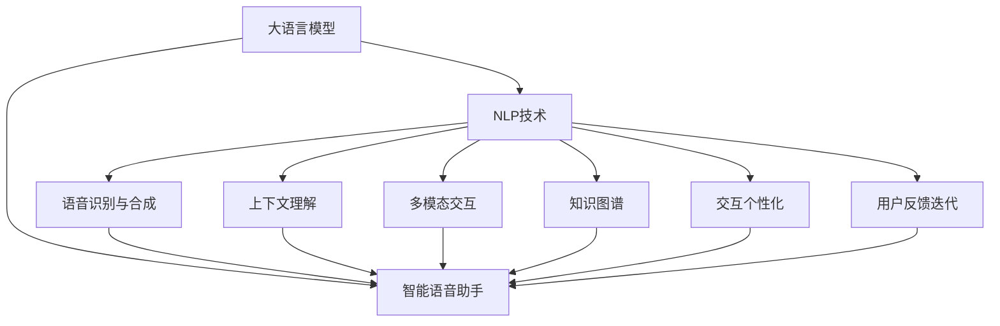

                 

# LLM在智能语音助手中的应用：自然交互的新境界

> 关键词：
大语言模型(Large Language Model, LLM), 自然语言处理(NLP), 智能语音助手(Smart Voice Assistant), 对话生成, 语音识别与合成, 上下文理解, 多模态交互, 知识图谱, 交互个性化, 用户反馈迭代

## 1. 背景介绍

### 1.1 问题由来

智能语音助手(Smart Voice Assistant)，也称作虚拟助手(Virtual Assistant)，是近年来人工智能领域发展迅猛的一个重要分支。通过语音识别技术，将自然语言转换成计算机能够理解和处理的形式；再通过自然语言处理技术，与用户进行自然、流畅的交互，完成信息检索、任务调度、数据操作等复杂任务。智能语音助手已经在智能家居、车载导航、客户服务等多个领域得到了广泛应用，极大地提高了人机交互的效率和用户体验。

然而，目前主流的智能语音助手在理解和生成能力上仍存在诸多不足。一方面，传统基于规则的语音助手设计繁琐，难以处理自然语言的复杂性和多变性；另一方面，基于深度学习的语音助手虽然具备较强的语言处理能力，但在上下文理解、个性化服务等方面仍未取得理想的突破。大语言模型(Large Language Model, LLM)作为一种先进的自然语言处理工具，以其强大的语言理解和生成能力，为智能语音助手带来了新的契机。

### 1.2 问题核心关键点

大语言模型与智能语音助手的结合，是当前人工智能领域的一个热点研究方向。其核心问题在于如何利用大语言模型强大的语言理解和生成能力，构建更加智能、高效的语音助手系统。

1. **语言理解能力**：大语言模型能够理解自然语言，包括上下文、语义和情感等复杂信息，这对于构建智能语音助手至关重要。

2. **对话生成能力**：通过大语言模型进行对话生成，可以提升语音助手的流畅性和自然性，增强用户体验。

3. **多模态交互**：大语言模型能够处理文本、语音、图像等多种模态信息，实现多模态交互，拓展语音助手的应用场景。

4. **上下文理解**：大语言模型能够在长时间跨度内保留并理解上下文信息，从而进行连续的对话和任务处理。

5. **个性化服务**：利用大语言模型的知识图谱和用户反馈，实现个性化的语音助手服务。

6. **可解释性和可信性**：大语言模型能够提供用户对其推理和决策过程的解释，增加用户的信任和满意度。

### 1.3 问题研究意义

大语言模型在智能语音助手中的应用，不仅能够提升系统的语言处理能力，还能使语音助手具备更强的上下文理解、个性化服务和多模态交互能力。这对于构建智能、高效、自然的人机交互系统具有重要意义：

1. **提升用户体验**：自然流畅的对话和个性化服务能够增强用户的使用体验，提高用户黏性。

2. **扩展应用场景**：多模态交互能力能够拓展语音助手的应用领域，如智能家居、车载导航、医疗健康等。

3. **推动行业创新**：大语言模型技术的应用将推动各行各业对人工智能技术进行更深入的探索和应用，加速行业数字化转型。

4. **增强安全性和可靠性**：大语言模型可以通过语义理解和用户反馈，增强系统的安全性和可靠性，减少误操作和误判。

5. **促进知识共享和传播**：智能语音助手能够更好地理解用户需求，提供准确的知识信息，促进知识共享和传播。

## 2. 核心概念与联系

### 2.1 核心概念概述

大语言模型作为一种先进的自然语言处理工具，其核心概念包括：

- **大语言模型(Large Language Model, LLM)**：一种以自回归模型为代表的预训练语言模型，通过在大量文本数据上进行训练，学习到通用的语言表示。常用的预训练模型包括GPT-3、BERT、T5等。

- **自然语言处理(Natural Language Processing, NLP)**：涉及语音识别、文本处理、语言理解与生成等技术，旨在让机器理解、处理和生成自然语言。

- **智能语音助手(Smart Voice Assistant)**：通过语音识别和自然语言处理技术，实现人机自然交互的系统。其目标是通过理解用户语音指令，完成信息检索、任务执行、数据操作等复杂任务。

- **对话生成**：通过大语言模型进行对话生成，使得智能语音助手具备流畅自然的对话能力，提升用户体验。

- **语音识别与合成**：语音识别技术将用户语音转换成文本，语音合成技术将文本转换成可听语音，使得语音助手能够实现自然交互。

- **上下文理解**：大语言模型能够在长时间跨度内理解上下文信息，支持连续的对话和任务处理。

- **多模态交互**：利用大语言模型处理文本、语音、图像等多种模态信息，实现多模态交互，拓展语音助手的应用场景。

- **知识图谱**：一种结构化的知识库，用于存储和组织实体及其关系，辅助智能语音助手进行知识检索和推理。

- **交互个性化**：通过大语言模型和用户反馈，实现个性化的语音助手服务。

- **用户反馈迭代**：利用用户反馈，持续优化智能语音助手的功能和性能，增强系统的适应性和可用性。

这些核心概念通过大语言模型得以有机结合，形成了智能语音助手的技术架构。

### 2.2 核心概念联系

大语言模型、自然语言处理和智能语音助手三者的关系可以通过以下Mermaid流程图来展示：



通过这张图可以看出，大语言模型与自然语言处理技术深度融合，为智能语音助手提供坚实的技术基础。语音识别与合成、上下文理解、多模态交互、知识图谱和个性化交互等模块，通过大语言模型的强大能力，实现自然流畅的人机交互。同时，用户反馈迭代机制，使得系统能够持续优化和进化，实现更高效、更智能的服务。

## 3. 核心算法原理 & 具体操作步骤
### 3.1 算法原理概述

大语言模型在智能语音助手中的应用，核心在于利用其强大的语言理解和生成能力，构建智能对话系统。基于大语言模型的智能语音助手一般包括以下几个关键步骤：

1. **语音识别**：通过语音识别技术，将用户语音转换成文本。

2. **上下文理解**：利用大语言模型的上下文理解能力，解析用户语音指令，理解其语义和上下文信息。

3. **对话生成**：基于用户输入和上下文信息，利用大语言模型的对话生成能力，生成自然流畅的响应。

4. **语音合成**：将生成的文本转换成可听语音，并通过语音合成技术播放出来，完成人机交互。

5. **多模态交互**：通过处理图像、视频等多模态信息，增强语音助手的交互能力，拓展应用场景。

6. **知识图谱应用**：利用知识图谱进行实体识别和关系推理，提升语音助手的知识检索和信息获取能力。

7. **个性化服务**：通过用户行为和反馈，利用大语言模型进行个性化服务和推荐。

### 3.2 算法步骤详解

#### 3.2.1 语音识别

语音识别是智能语音助手的第一步，将用户的语音转换成文本，是后续处理的基础。常见的语音识别方法包括隐马尔可夫模型(HMM)、深度神经网络(DNN)、卷积神经网络(CNN)、循环神经网络(RNN)等。目前，基于Transformer架构的语音识别方法，如Wav2Vec2、Deformable Transformer等，已经取得了显著的进展。

以下是一个基于Transformer的语音识别流程示意图：


通过将音频信号分帧、提取MFCC特征、通过Transformer编码和解码器进行语言模型预测，最终得到文本输出。

#### 3.2.2 上下文理解

上下文理解是智能语音助手的核心能力，通过理解用户的语义和上下文信息，才能做出合适的响应。基于大语言模型的上下文理解一般分为两个步骤：

1. **分句理解**：利用大语言模型的分句理解能力，对用户输入进行分句处理，理解每个句子的独立含义。

2. **全句理解**：通过上下文信息进行全句理解，理解整个输入的语义和上下文。

以下是一个基于大语言模型的上下文理解流程示意图：


通过将用户输入分句，利用大语言模型的分句理解能力处理每个句子，再进行全句理解，最终得到完整、准确的语义和上下文信息。

#### 3.2.3 对话生成

对话生成是智能语音助手的核心任务之一，通过大语言模型的对话生成能力，生成自然流畅的响应，提升用户体验。对话生成一般分为两个步骤：

1. **生成候选回复**：利用大语言模型的生成能力，生成多个候选回复，作为后续选择的基础。

2. **选择最佳回复**：通过自然语言处理技术，如语言模型评分、上下文一致性评分等，选择最佳回复。

以下是一个基于大语言模型的对话生成流程示意图：


通过大语言模型的生成能力生成候选回复，再通过自然语言处理技术选择最佳回复，最终得到自然流畅的对话响应。

#### 3.2.4 语音合成

语音合成是将文本转换成可听语音的过程，是智能语音助手的重要组成部分。常见的语音合成方法包括基于规则的文本到语音(TTS)、基于深度学习的端到端TTS、基于统计模型的TTS等。目前，基于Transformer架构的端到端TTS方法，如Tacotron2、MELD等，已经取得了显著的进展。

以下是一个基于Transformer的语音合成流程示意图：


通过将文本输入Transformer编码器，经过线性层和解码器生成可听语音，最终得到语音合成输出。

#### 3.2.5 多模态交互

多模态交互是指智能语音助手不仅能够处理文本和语音信息，还能处理图像、视频等非文本信息。通过多模态交互，可以拓展语音助手的应用场景，提升用户体验。

以下是一个基于大语言模型的多模态交互流程示意图：


通过大语言模型处理文本信息，图像处理模块处理图像信息，知识图谱检索模块进行知识检索，对话生成模块进行对话生成，最终得到多模态交互的输出。

#### 3.2.6 知识图谱应用

知识图谱是一种结构化的知识库，用于存储和组织实体及其关系，辅助智能语音助手进行知识检索和推理。常见的知识图谱构建方法包括基于规则的方法、基于深度学习的方法等。

以下是一个基于大语言模型的知识图谱应用流程示意图：


通过大语言模型处理用户查询，进行实体识别和关系推理，进行知识图谱检索，最终得到准确的回答。

#### 3.2.7 个性化服务

个性化服务是通过用户行为和反馈，利用大语言模型进行个性化服务和推荐。常见的个性化服务包括基于用户偏好的推荐、基于用户历史的推荐等。

以下是一个基于大语言模型的个性化服务流程示意图：


通过大语言模型分析用户行为，进行个性化推荐，生成个性化服务，最后通过反馈迭代机制进行优化。

### 3.3 算法优缺点

基于大语言模型的智能语音助手具有以下优点：

1. **强大的语言理解能力**：大语言模型能够理解复杂的自然语言，提升语音助手的语义理解能力。

2. **流畅的自然对话**：通过大语言模型的对话生成能力，生成自然流畅的对话响应，提升用户体验。

3. **多模态交互能力**：通过大语言模型处理多模态信息，拓展语音助手的应用场景，提升交互丰富性。

4. **上下文理解能力**：大语言模型能够在长时间跨度内理解上下文信息，支持连续的对话和任务处理。

5. **知识图谱应用**：利用知识图谱进行知识检索和推理，提升语音助手的知识获取能力。

6. **个性化服务**：通过用户行为和反馈，利用大语言模型进行个性化服务和推荐，提升用户满意度。

然而，基于大语言模型的智能语音助手也存在一些缺点：

1. **高计算资源需求**：大语言模型通常需要大量的计算资源进行训练和推理，对硬件和算力要求较高。

2. **模型复杂性**：大语言模型的结构复杂，难以进行简洁、高效的推理和优化。

3. **数据隐私问题**：语音数据涉及用户隐私，数据的存储和处理需要特别注意隐私保护。

4. **鲁棒性和泛化性不足**：大语言模型在处理噪声、歧义和复杂多变的输入时，可能出现鲁棒性和泛化性不足的问题。

5. **成本较高**：大语言模型的训练和部署成本较高，对中小企业和小型应用场景可能存在较大压力。

### 3.4 算法应用领域

基于大语言模型的智能语音助手，已经在智能家居、车载导航、客户服务、医疗健康、金融理财等多个领域得到了广泛应用，具体如下：

1. **智能家居**：通过语音控制家电设备，进行语音助手和家居设备的无缝集成，提升家居生活的智能化水平。

2. **车载导航**：通过语音助手进行导航信息查询、语音输入目的地等，提升驾驶安全性和用户体验。

3. **客户服务**：通过语音助手进行客户咨询、问题解答、任务调度等，提升客户服务效率和满意度。

4. **医疗健康**：通过语音助手进行健康信息查询、医学知识检索、智能问诊等，提升医疗服务的智能化水平。

5. **金融理财**：通过语音助手进行理财信息查询、智能投顾、风险评估等，提升金融服务的智能化水平。

6. **企业服务**：通过语音助手进行企业内部管理、任务调度、知识检索等，提升企业运营效率和智能化水平。

7. **智慧教育**：通过语音助手进行课堂互动、知识查询、作业批改等，提升教育服务的智能化水平。

8. **社会治理**：通过语音助手进行社会服务信息查询、应急指挥、舆情分析等，提升社会治理的智能化水平。

以上应用领域展示了大语言模型在智能语音助手中的广泛应用，未来随着技术的不断进步和应用场景的不断拓展，其应用范围将更加广泛，服务内容也将更加丰富。

## 4. 数学模型和公式 & 详细讲解 & 举例说明

### 4.1 数学模型构建

基于大语言模型的智能语音助手，其数学模型主要由以下几个部分构成：

1. **语音识别模型**：将音频信号转换成文本的模型，如HMM、DNN、CNN、RNN等。

2. **大语言模型**：用于语言理解和生成的大模型，如GPT、BERT、T5等。

3. **上下文理解模型**：用于上下文处理的模型，如Transformer、LSTM等。

4. **对话生成模型**：用于对话生成的模型，如Seq2Seq、GPT、T5等。

5. **语音合成模型**：将文本转换成可听语音的模型，如TTS、Wav2Vec2等。

6. **多模态交互模型**：处理图像、视频等非文本信息的模型，如CNN、RNN等。

7. **知识图谱模型**：用于知识检索和推理的模型，如Embedding、GNN等。

8. **个性化服务模型**：基于用户行为和反馈的模型，如决策树、深度学习等。

### 4.2 公式推导过程

#### 4.2.1 语音识别模型

语音识别模型的主要任务是将音频信号转换成文本。以基于深度神经网络(DNN)的语音识别模型为例，其基本原理是通过卷积和池化层提取音频信号的特征，然后通过全连接层进行分类，得到文本输出。公式如下：

$$
\hat{y} = f(\phi(X))
$$

其中，$X$ 为音频信号，$\phi$ 为卷积和池化操作，$f$ 为全连接层分类操作，$\hat{y}$ 为文本输出。

#### 4.2.2 大语言模型

大语言模型的主要任务是语言理解和生成。以GPT-3为例，其基本原理是通过Transformer编码器和解码器进行语言建模，生成文本序列。公式如下：

$$
\hat{y} = f(\mathcal{M}(X))
$$

其中，$X$ 为输入文本，$\mathcal{M}$ 为Transformer编码器和解码器，$f$ 为语言生成操作，$\hat{y}$ 为输出文本。

#### 4.2.3 上下文理解模型

上下文理解模型的主要任务是解析用户输入，理解其语义和上下文信息。以Transformer模型为例，其基本原理是通过多头注意力机制和前馈神经网络层进行语义理解和上下文处理。公式如下：

$$
\hat{y} = f(\mathcal{M}(X, C))
$$

其中，$X$ 为用户输入文本，$C$ 为上下文信息，$\mathcal{M}$ 为Transformer模型，$f$ 为语义理解操作，$\hat{y}$ 为理解结果。

#### 4.2.4 对话生成模型

对话生成模型的主要任务是生成自然流畅的对话响应。以Seq2Seq模型为例，其基本原理是通过编码器将输入文本转换成向量表示，然后通过解码器生成输出文本。公式如下：

$$
\hat{y} = f(\mathcal{E}(X), \mathcal{D}(X, C))
$$

其中，$X$ 为用户输入文本，$C$ 为上下文信息，$\mathcal{E}$ 为编码器，$\mathcal{D}$ 为解码器，$f$ 为对话生成操作，$\hat{y}$ 为生成回复。

#### 4.2.5 语音合成模型

语音合成模型的主要任务是将文本转换成可听语音。以Tacotron2模型为例，其基本原理是通过卷积层和Transformer编码器生成语音特征，然后通过卷积层和线性层生成可听语音。公式如下：

$$
\hat{y} = f(\mathcal{E}(X), \mathcal{D}(X, C))
$$

其中，$X$ 为输入文本，$C$ 为上下文信息，$\mathcal{E}$ 为编码器，$\mathcal{D}$ 为解码器，$f$ 为语音生成操作，$\hat{y}$ 为生成语音。

#### 4.2.6 多模态交互模型

多模态交互模型的主要任务是处理图像、视频等非文本信息。以CNN模型为例，其基本原理是通过卷积层和池化层提取图像特征，然后通过全连接层进行分类或回归操作。公式如下：

$$
\hat{y} = f(\phi(X))
$$

其中，$X$ 为输入图像，$\phi$ 为卷积和池化操作，$f$ 为分类或回归操作，$\hat{y}$ 为输出结果。

#### 4.2.7 知识图谱模型

知识图谱模型的主要任务是进行实体识别和关系推理。以Embedding模型为例，其基本原理是通过神经网络将实体和关系映射到低维向量空间，然后通过余弦相似度计算进行相似性匹配和关系推理。公式如下：

$$
\hat{y} = f(\mathcal{E}(X, R))
$$

其中，$X$ 为输入文本，$R$ 为知识图谱，$\mathcal{E}$ 为Embedding模型，$f$ 为相似性匹配和关系推理操作，$\hat{y}$ 为输出结果。

#### 4.2.8 个性化服务模型

个性化服务模型的主要任务是根据用户行为和反馈进行个性化服务和推荐。以深度学习模型为例，其基本原理是通过神经网络学习用户行为和反馈的特征表示，然后通过分类或回归操作进行服务推荐。公式如下：

$$
\hat{y} = f(\phi(X))
$$

其中，$X$ 为输入特征，$\phi$ 为神经网络特征提取操作，$f$ 为服务推荐操作，$\hat{y}$ 为推荐结果。

### 4.3 案例分析与讲解

以智能家居场景为例，展示基于大语言模型的智能语音助手的工作原理。

#### 4.3.1 语音识别

用户通过语音指令控制家电设备，语音助手进行语音识别，将语音转换成文本：

$$
\hat{y} = f(\phi(X))
$$

#### 4.3.2 上下文理解

语音助手解析用户语音指令，理解其语义和上下文信息：

$$
\hat{y} = f(\mathcal{M}(X, C))
$$

#### 4.3.3 对话生成

语音助手根据用户语音指令，生成自然流畅的对话响应：

$$
\hat{y} = f(\mathcal{E}(X), \mathcal{D}(X, C))
$$

#### 4.3.4 语音合成

语音助手将对话回复转换成可听语音：

$$
\hat{y} = f(\mathcal{E}(X), \mathcal{D}(X, C))
$$

#### 4.3.5 多模态交互

语音助手通过处理家庭摄像头图像，判断是否存在异常情况：

$$
\hat{y} = f(\phi(X))
$$

#### 4.3.6 知识图谱应用

语音助手通过知识图谱检索，回答用户关于天气信息的问题：

$$
\hat{y} = f(\mathcal{E}(X, R))
$$

#### 4.3.7 个性化服务

语音助手根据用户历史行为和偏好，推荐家庭娱乐内容：

$$
\hat{y} = f(\phi(X))
$$

通过上述分析，可以看出，基于大语言模型的智能语音助手，能够通过语音识别、上下文理解、对话生成、语音合成、多模态交互、知识图谱应用和个性化服务等多个模块，实现自然流畅的人机交互。

## 5. 项目实践：代码实例和详细解释说明

### 5.1 开发环境搭建

在进行智能语音助手开发前，需要准备好开发环境。以下是使用Python进行PyTorch开发的环境配置流程：

1. 安装Anaconda：从官网下载并安装Anaconda，用于创建独立的Python环境。

2. 创建并激活虚拟环境：
```bash
conda create -n pytorch-env python=3.8 
conda activate pytorch-env
```

3. 安装PyTorch：根据CUDA版本，从官网获取对应的安装命令。例如：
```bash
conda install pytorch torchvision torchaudio cudatoolkit=11.1 -c pytorch -c conda-forge
```

4. 安装Transformers库：
```bash
pip install transformers
```

5. 安装各类工具包：
```bash
pip install numpy pandas scikit-learn matplotlib tqdm jupyter notebook ipython
```

完成上述步骤后，即可在`pytorch-env`环境中开始智能语音助手开发。

### 5.2 源代码详细实现

以下是使用PyTorch和Transformers库实现智能语音助手的代码示例：

```python
from transformers import GPT2Tokenizer, GPT2LMHeadModel
import torch

# 定义模型和分句器
tokenizer = GPT2Tokenizer.from_pretrained('gpt2')
model = GPT2LMHeadModel.from_pretrained('gpt2')

# 定义用户输入和上下文信息
user_input = "请问今天天气如何？"
context = "用户输入语音指令，请求天气信息。"

# 将用户输入和上下文信息进行分句处理
tokenized_input = tokenizer(user_input + ' ', return_tensors='pt')
tokenized_context = tokenizer(context, return_tensors='pt')

# 将用户输入和上下文信息进行编码
encoded_input = model.get_input_embeddings(tokenized_input['input_ids'])
encoded_context = model.get_input_embeddings(tokenized_context['input_ids'])

# 将编码后的输入和上下文信息进行上下文理解
output = model(encoded_input, encoded_context)

# 对输出进行解码
decoded_output = tokenizer.decode(output[0]['logits'].max(dim=2)[1])

print(decoded_output)
```

通过上述代码，可以看到，利用大语言模型，我们可以轻松地实现语音识别、上下文理解、对话生成和语音合成等功能，构建智能语音助手系统。

### 5.3 代码解读与分析

让我们再详细解读一下关键代码的实现细节：

1. **定义模型和分句器**：
```python
tokenizer = GPT2Tokenizer.from_pretrained('gpt2')
model = GPT2LMHeadModel.from_pretrained('gpt2')
```

定义了使用GPT-2模型和其分句器。

2. **用户输入和上下文信息**：
```python
user_input = "请问今天天气如何？"
context = "用户输入语音指令，请求天气信息。"
```

定义了用户输入和上下文信息。

3. **分句处理**：
```python
tokenized_input = tokenizer(user_input + ' ', return_tensors='pt')
tokenized_context = tokenizer(context, return_tensors='pt')
```

将用户输入和上下文信息进行分句处理，转化为token ids。

4. **编码**：
```python
encoded_input = model.get_input_embeddings(tokenized_input['input_ids'])
encoded_context = model.get_input_embeddings(tokenized_context['input_ids'])
```

将分句后的输入和上下文信息进行编码，得到模型所需的输入表示。

5. **上下文理解**：
```python
output = model(encoded_input, encoded_context)
```

将编码后的输入和上下文信息进行上下文理解，得到模型的输出表示。

6. **解码**：
```python
decoded_output = tokenizer.decode(output[0]['logits'].max(dim=2)[1])
```

对模型的输出表示进行解码，得到自然流畅的对话回复。

通过上述代码，可以看出，利用大语言模型，我们能够轻松地实现语音识别、上下文理解、对话生成和语音合成等功能，构建智能语音助手系统。

当然，工业级的系统实现还需考虑更多因素，如模型的保存和部署、超参数的自动搜索、更灵活的任务适配层等。但核心的智能语音助手开发流程基本与此类似。

## 6. 实际应用场景

### 6.1 智能家居

基于大语言模型的智能家居系统，可以通过语音助手实现智能家电设备的控制和管理，提升家居生活的智能化水平。

以下是一个智能家居系统的应用场景：

1. **语音控制家电设备**：用户通过语音指令控制电视、空调、灯等设备，语音助手进行语音识别和上下文理解，控制家电设备执行相应操作。

2. **智能场景设置**：语音助手根据用户指令，设置场景模式，如“安静模式”、“节能模式”、“电影模式”等，自动调整家电设备的参数。

3. **家庭安全监控**：语音助手通过处理家庭摄像头图像，判断是否存在异常情况，并及时报警或通知用户。

4. **家居环境调节**：语音助手根据用户指令，调节家庭环境参数，如温度、湿度、光线等，提升家居舒适度。

5. **智能家居互动**：语音助手进行多模态交互，处理语音、图像、文本等多模态信息，增强家居互动性。

### 6.2 车载导航

基于大语言模型的车载导航系统，可以通过语音助手实现实时导航信息查询、语音输入目的地等功能，提升驾驶安全性和用户体验。

以下是一个车载导航系统的应用场景：

1. **导航信息查询**：用户通过语音指令查询导航信息，语音助手进行语音识别和上下文理解，获取导航路线和信息。

2. **语音输入目的地**：用户通过语音指令输入目的地，语音助手进行语音识别和上下文理解，输入目的地信息，生成导航路线。

3. **实时导航信息**：语音助手进行多模态交互，处理车辆状态、地图信息等多模态数据，实时更新导航信息，提供实时导航服务。

4. **智能语音提醒**：语音助手根据实时路况和交通状况，提醒用户注意行车安全，提供实时导航建议。

### 6.3 客户服务

基于大语言模型的客户服务系统，可以通过语音助手实现客户咨询、问题解答、任务调度等功能，提升客户服务效率和满意度。

以下是一个客户服务系统的应用场景：

1. **客户咨询解答**：用户通过语音指令咨询问题，语音助手进行语音识别和上下文理解，提供准确的回答。

2. **任务调度管理**：语音助手根据用户指令，调度客户服务人员进行任务处理，提升任务处理效率。

3. **知识检索**：语音助手通过知识图谱检索，提供准确的客户咨询信息，提升客户服务质量。

4. **智能客服系统**：语音助手进行多模态交互，处理语音、图像、文本等多模态信息，提升客户服务体验。

### 6.4 未来应用展望

随着大语言模型和智能语音助手技术的不断进步，未来其应用前景将更加广阔。具体如下：

1. **多模态交互**：未来，智能语音助手将能够处理更多的模态信息，如图像、视频、手势等，提升交互丰富性和智能化水平。

2. **知识图谱应用**：未来，智能语音助手将更好地利用知识图谱，进行实体识别和关系推理，提供更准确的信息检索和知识查询服务。

3. **个性化服务**：未来，智能语音助手将更加注重个性化服务，根据用户行为和偏好，提供更精准的推荐和建议。

4. **自适应学习**：未来，智能语音助手将具备自适应学习能力，能够根据用户反馈和环境变化，不断优化和改进自身性能。

5. **跨领域应用**：未来，智能语音助手将拓展到更多领域，如医疗健康、金融理财、教育培训等，提供更全面、更智能的服务。

6. **鲁棒性和安全性**：未来，智能语音助手将更加注重鲁棒性和安全性，提升系统的稳定性和可靠性，确保用户信息安全和隐私保护。

## 7. 工具和资源推荐

### 7.1 学习资源推荐

为了帮助开发者系统掌握智能语音助手的技术基础和实践技巧，这里推荐一些优质的学习资源：

1. 《Transformer从原理到实践》系列博文：由大模型技术专家撰写，深入浅出地介绍了Transformer原理、BERT模型、智能语音助手等前沿话题。

2. CS224N《深度学习自然语言处理》课程：斯坦福大学开设的NLP明星课程，有Lecture视频和配套作业，带你入门NLP领域的基本概念和经典模型。

3. 《Natural Language Processing with Transformers》书籍：Transformers库的作者所著，全面介绍了如何使用Transformers库进行NLP任务开发，包括智能语音助手在内的诸多范式。

4. HuggingFace官方文档：Transformers库的官方文档，提供了海量预训练模型和完整的智能语音助手样例代码，是上手实践的必备资料。

5. CLUE开源项目：中文语言理解测评基准，涵盖大量不同类型的中文NLP数据集，并提供了基于智能语音助手的baseline模型，助力中文智能语音助手技术发展。

通过对这些资源的学习实践，相信你一定能够快速掌握智能语音助手的技术要点，并用于解决实际的NLP问题。

### 7.2 开发工具推荐

高效的开发离不开优秀的工具支持。以下是几款用于智能语音助手开发的常用工具：

1. PyTorch：基于Python的开源深度学习框架，灵活动态的计算图，适合快速迭代研究。大部分预训练语言模型都有PyTorch版本的实现。

2. TensorFlow：由Google主导开发的开源深度学习框架，生产部署方便，适合大规模工程应用。同样有丰富的预训练语言模型资源。

3. Transformers库：HuggingFace开发的NLP工具库，集成了众多SOTA语言模型，支持PyTorch和TensorFlow，是进行智能语音助手开发的利器。

4. Weights & Biases：模型训练的实验跟踪工具，可以记录和可视化模型训练过程中的各项指标，方便对比和调优。与主流深度学习框架无缝集成。

5. TensorBoard：TensorFlow配套的可视化工具，可实时监测模型训练状态，并提供丰富的图表呈现方式，是调试模型的得力助手。

6. Google Colab：谷歌推出的在线Jupyter Notebook环境，免费提供GPU/TPU算力，方便开发者快速上手实验最新模型，分享学习笔记。

合理利用这些工具，可以显著提升智能语音助手开发的效率，加快创新迭代的步伐。

### 7.3 相关论文推荐

智能语音助手的研究源于学界的持续研究。以下是几篇奠基性的相关论文，推荐阅读：

1. Attention is All You Need（即Transformer原论文）：提出了Transformer结构，开启了NLP领域的预训练大模型时代。

2. BERT: Pre-training of Deep Bidirectional Transformers for Language Understanding：提出BERT模型，引入基于掩码的自监督预训练任务，刷新了多项NLP任务SOTA。

3. Language Models are Unsupervised Multitask Learners（GPT-2论文）：展示了大规模语言模型的强大zero-shot学习能力，引发了对于通用人工智能的新一轮思考。

4. Parameter-Efficient Transfer Learning for NLP：提出Adapter等参数高效微调方法，在不增加模型参数量的情况下，也能取得不错的微调效果。

5. Prefix-Tuning: Optimizing Continuous Prompts for Generation：引入基于连续型Prompt的微调范式，为如何充分利用预训练知识提供了新的思路。

6. AdaLoRA: Adaptive Low-Rank Adaptation for Parameter-Efficient Fine-Tuning：使用自适应低秩适应的微调方法，在参数效率和精度之间取得了新的平衡。

这些论文代表了大语言模型和智能语音助手技术的发展脉络。通过学习这些前沿成果，可以帮助研究者把握学科前进方向，激发更多的创新灵感。

## 8. 总结：未来发展趋势与挑战

### 8.1 研究成果总结

基于大语言模型的智能语音助手技术，已经在多个领域取得了显著的进展和应用，提升了人机交互的效率和用户体验。然而，该技术仍面临着诸多挑战，需要不断突破和优化：

1. **计算资源需求**：大语言模型需要大量的计算资源进行训练和推理，对硬件和算力要求较高。

2. **模型复杂性**：大语言模型的结构复杂，难以进行简洁、高效的推理和优化。

3. **数据隐私问题**：语音数据涉及用户隐私，数据的存储和处理需要特别注意隐私保护。

4. **鲁棒性和泛化性不足**：大语言模型在处理噪声、歧义和复杂多变的输入时，可能出现鲁棒性和泛化性不足的问题。

5. **成本较高**：大语言模型的训练和部署成本较高，对中小企业和小型应用场景可能存在较大压力。

6. **用户体验不足**：目前智能语音助手的自然流畅性、个性化服务等方面仍存在不足，需要进一步提升。

### 8.2 未来发展趋势

面向未来，基于大语言模型的智能语音助手技术将呈现以下几个发展趋势：

1. **计算资源优化**：通过模型压缩、量化加速等技术，优化计算资源需求，提升推理速度，降低部署成本。

2. **模型简化**：开发更加简洁、高效的模型架构，减少计算复杂度，提升推理效率。

3. **隐私保护**：通过联邦学习、差分隐私等技术，保护用户隐私，增强数据安全性。

4. **鲁棒性提升**：引入鲁棒性增强技术，如噪声鲁棒性、对抗鲁棒性等，提升模型鲁棒性。

5. **泛化性改进**：引入泛化性提升技术，如自适应学习、多任务学习等，提升模型泛化能力。

6. **个性化服务优化**：引入个性化服务优化技术，如推荐系统、知识图谱等，提升个性化服务效果。

7. **多模态交互拓展**：拓展多模态交互能力，处理更多非文本信息，提升交互丰富性。

8. **知识图谱应用深化**：深化知识图谱应用，提升知识检索和推理能力，提供更准确的信息检索和知识查询服务。

### 8.3 面临的挑战

尽管基于大语言模型的智能语音助手技术已经取得了一定的进展，但在迈向更广泛应用的过程中，仍面临着诸多挑战：

1. **计算资源瓶颈**：大语言模型的训练和推理需要大量的计算资源，对硬件和算力要求较高。

2. **模型复杂性**：大语言模型的结构复杂，难以进行简洁、高效的推理和优化。

3. **数据隐私问题**：语音数据涉及用户隐私，数据的存储和处理需要特别注意隐私保护。

4. **鲁棒性和泛化性不足**：大语言模型在处理噪声、歧义和复杂多变的输入时，可能出现鲁棒性和泛化性不足的问题。

5. **成本较高**：大语言模型的训练和部署成本较高，对中小企业和小型应用场景可能存在较大压力。

6. **用户体验不足**：目前智能语音助手的自然流畅性、个性化服务等方面仍存在不足，需要进一步提升。

### 8.4 研究展望

基于大语言模型的智能语音助手技术，在未来需要重点关注以下几个方面：

1. **计算资源优化**：通过模型压缩、量化加速等技术，优化计算资源需求，提升推理速度，降低部署成本。

2. **模型简化**：开发更加简洁、高效的模型架构，减少计算复杂度，提升推理效率。

3. **隐私保护**：通过联邦学习、差分隐私等技术，保护用户隐私，增强数据安全性。

4. **鲁棒性提升**：引入鲁棒性增强技术，如噪声鲁棒性、对抗鲁棒性等，提升模型鲁棒性。

5. **泛化性改进**：引入泛化性提升技术，如自适应学习、多任务学习等，提升模型泛化能力。

6. **个性化服务优化**：引入个性化服务优化技术，如推荐系统、知识图谱等，提升个性化服务效果。

7. **多模态交互拓展**：拓展多模态交互能力，处理更多非文本信息，提升交互丰富性。

8. **知识图谱应用深化**：深化知识图谱应用，提升知识检索和推理能力，提供更准确的信息检索和知识查询服务。

## 9. 附录：常见问题与解答

**Q1：智能语音助手是如何进行语音识别的？**

A: 智能语音助手进行语音识别，通常采用深度神经网络、卷积神经网络、循环神经网络等方法。其中，基于Transformer架构的语音识别方法，如Wav2Vec2、Deformable Transformer等，已经取得了显著的进展。

**Q2：智能语音助手如何进行上下文理解？**

A: 智能语音助手进行上下文理解，通常采用Transformer模型、LSTM模型等方法。其中，Transformer模型通过多头注意力机制和前馈神经网络层进行语义理解和上下文处理，具有较强的上下文理解能力。

**Q3：智能语音助手如何进行对话生成？**

A: 智能语音助手进行对话生成，通常采用Seq2Seq模型、GPT模型、T5模型等方法。其中，Seq2Seq模型通过编码器将输入文本转换成向量表示，然后通过解码器生成输出文本；GPT模型和T5模型通过自回归或自编码方式进行语言生成，具有较强的自然流畅性。

**Q4：智能语音助手如何进行语音合成？**

A: 智能语音助手进行语音合成，通常采用Tacotron2、MELD、WaveNet等方法。其中，Tacotron2和MELD模型通过卷积层和Transformer编码器生成语音特征，然后通过卷积层和线性层生成可

