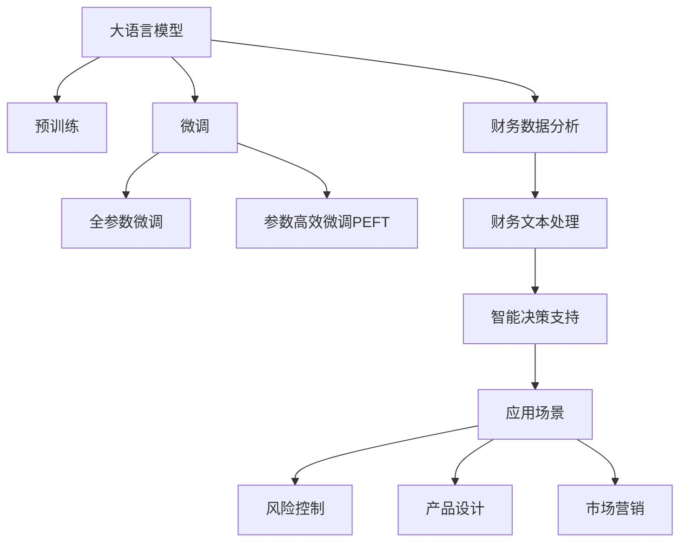

                 

## 1. 背景介绍

### 1.1 问题由来
随着金融科技的迅猛发展，金融机构需要处理海量复杂的财务数据。传统的财务分析方法，如手工报表分析、简单统计分析等，已无法满足日益增长的需求。利用先进的人工智能技术，尤其是基于大语言模型(Large Language Model, LLM)的智能财务分析，将成为提升金融机构决策效率和质量的关键手段。

### 1.2 问题核心关键点
智能财务分析的核心在于如何高效、准确地处理和分析财务数据，并提供有价值的决策支持。传统方法依赖大量经验丰富的分析师，成本高、周期长、易出错。而基于大语言模型的方法，可以通过预训练和微调获取知识丰富的模型，在自然语言处理的基础上，自动完成复杂的财务数据分析和推理，助力金融机构的智能化转型。

### 1.3 问题研究意义
研究大语言模型在智能财务分析中的应用，对于提升金融机构的数据处理效率、降低分析成本、增强决策科学性和风险控制能力，具有重要意义：

1. 提高处理效率。基于大语言模型的智能分析，能够自动从大量财务文本中提取有价值的信息，显著缩短分析周期。
2. 降低分析成本。减少对人力的依赖，降低传统分析方法中的人为误差和成本。
3. 增强决策科学性。利用语言模型强大的知识整合能力，从多维度、多视角分析财务数据，提升决策的全面性和准确性。
4. 加强风险控制。识别潜在的财务风险，通过自然语言推理和模式识别技术，辅助风险评估和预警。
5. 推动金融创新。智能财务分析技术，可以应用于金融产品的设计、市场营销、客户服务等各个环节，为金融创新提供技术支持。

## 2. 核心概念与联系

### 2.1 核心概念概述

为更好地理解大语言模型在智能财务分析中的应用，本节将介绍几个密切相关的核心概念：

- 大语言模型(Large Language Model, LLM)：以自回归(如GPT)或自编码(如BERT)模型为代表的大规模预训练语言模型。通过在大规模无标签文本语料上进行预训练，学习通用的语言表示，具备强大的语言理解和生成能力。

- 预训练(Pre-training)：指在大规模无标签文本语料上，通过自监督学习任务训练通用语言模型的过程。常见的预训练任务包括言语建模、遮挡语言模型等。预训练使得模型学习到语言的通用表示。

- 微调(Fine-tuning)：指在预训练模型的基础上，使用下游任务的少量标注数据，通过有监督学习优化模型在该任务上的性能。通常只需要调整顶层分类器或解码器，并以较小的学习率更新全部或部分的模型参数。

- 迁移学习(Transfer Learning)：指将一个领域学习到的知识，迁移应用到另一个不同但相关的领域的学习范式。大模型的预训练-微调过程即是一种典型的迁移学习方式。

- 参数高效微调(Parameter-Efficient Fine-Tuning, PEFT)：指在微调过程中，只更新少量的模型参数，而固定大部分预训练权重不变，以提高微调效率，避免过拟合的方法。

- 财务数据分析：对财务数据进行清洗、分析、可视化，提取有价值的财务信息和洞察，辅助决策制定。

- 财务文本处理：处理财务报告、公告、新闻等文本数据，提取其中的关键财务指标和业务信息。

- 智能决策支持：利用机器学习和自然语言处理技术，结合专家知识和数据，为财务决策提供科学依据。

这些核心概念之间的逻辑关系可以通过以下Mermaid流程图来展示：



这个流程图展示了大语言模型在智能财务分析中的核心概念及其之间的关系：

1. 大语言模型通过预训练获得基础能力。
2. 微调是对预训练模型进行任务特定的优化，可以在有限标注数据上获得较好的表现。
3. 财务数据分析、财务文本处理、智能决策支持等任务，都可以通过微调技术，利用预训练模型进行自动化处理。
4. 风险控制、产品设计、市场营销等实际应用场景，都可以结合智能决策支持系统，实现业务智能化转型。

## 3. 核心算法原理 & 具体操作步骤
### 3.1 算法原理概述

基于大语言模型的智能财务分析，本质上是一个有监督的细粒度迁移学习过程。其核心思想是：将预训练的大语言模型视作一个强大的"特征提取器"，通过在财务领域的标注数据上进行有监督微调，使得模型输出能够匹配特定的财务指标和业务信息，从而获得针对特定财务任务优化的模型。

形式化地，假设预训练模型为 $M_{\theta}$，其中 $\theta$ 为预训练得到的模型参数。给定财务任务 $T$ 的标注数据集 $D=\{(x_i, y_i)\}_{i=1}^N$，微调的目标是找到新的模型参数 $\hat{\theta}$，使得：

$$
\hat{\theta}=\mathop{\arg\min}_{\theta} \mathcal{L}(M_{\theta},D)
$$

其中 $\mathcal{L}$ 为针对任务 $T$ 设计的损失函数，用于衡量模型预测输出与真实标签之间的差异。常见的损失函数包括交叉熵损失、均方误差损失等。

通过梯度下降等优化算法，微调过程不断更新模型参数 $\theta$，最小化损失函数 $\mathcal{L}$，使得模型输出逼近真实标签。由于 $\theta$ 已经通过预训练获得了较好的初始化，因此即便在少量标注数据集 $D$ 上进行微调，也能较快收敛到理想的模型参数 $\hat{\theta}$。

### 3.2 算法步骤详解

基于大语言模型的智能财务分析微调一般包括以下几个关键步骤：

**Step 1: 准备预训练模型和数据集**
- 选择合适的预训练语言模型 $M_{\theta}$ 作为初始化参数，如 BERT、GPT 等。
- 准备财务任务 $T$ 的标注数据集 $D$，划分为训练集、验证集和测试集。一般要求标注数据与预训练数据的分布不要差异过大。

**Step 2: 添加任务适配层**
- 根据财务任务类型，在预训练模型顶层设计合适的输出层和损失函数。
- 对于分类任务，通常在顶层添加线性分类器和交叉熵损失函数。
- 对于生成任务，通常使用语言模型的解码器输出概率分布，并以负对数似然为损失函数。

**Step 3: 设置微调超参数**
- 选择合适的优化算法及其参数，如 AdamW、SGD 等，设置学习率、批大小、迭代轮数等。
- 设置正则化技术及强度，包括权重衰减、Dropout、Early Stopping等。
- 确定冻结预训练参数的策略，如仅微调顶层，或全部参数都参与微调。

**Step 4: 执行梯度训练**
- 将训练集数据分批次输入模型，前向传播计算损失函数。
- 反向传播计算参数梯度，根据设定的优化算法和学习率更新模型参数。
- 周期性在验证集上评估模型性能，根据性能指标决定是否触发 Early Stopping。
- 重复上述步骤直到满足预设的迭代轮数或 Early Stopping 条件。

**Step 5: 测试和部署**
- 在测试集上评估微调后模型 $M_{\hat{\theta}}$ 的性能，对比微调前后的精度提升。
- 使用微调后的模型对新样本进行推理预测，集成到实际的应用系统中。
- 持续收集新的财务数据，定期重新微调模型，以适应数据分布的变化。

以上是基于大语言模型微调在智能财务分析中的一般流程。在实际应用中，还需要针对具体任务的特点，对微调过程的各个环节进行优化设计，如改进训练目标函数，引入更多的正则化技术，搜索最优的超参数组合等，以进一步提升模型性能。

### 3.3 算法优缺点

基于大语言模型的智能财务分析微调方法具有以下优点：
1. 提高分析效率。基于预训练模型，能够在短时间内处理大量财务数据，大幅缩短分析周期。
2. 降低分析成本。减少了对人力的依赖，降低传统分析方法中的人为误差和成本。
3. 增强分析科学性。利用语言模型强大的知识整合能力，从多维度、多视角分析财务数据，提升决策的全面性和准确性。
4. 强化风险控制。识别潜在的财务风险，通过自然语言推理和模式识别技术，辅助风险评估和预警。
5. 促进业务创新。智能财务分析技术，可以应用于金融产品的设计、市场营销、客户服务等各个环节，为金融创新提供技术支持。

同时，该方法也存在一定的局限性：
1. 数据质量要求高。财务数据的准确性和完整性对模型性能有直接影响。
2. 模型泛化能力有限。当财务任务与预训练数据的分布差异较大时，微调的性能提升有限。
3. 可解释性不足。微调模型的决策过程通常缺乏可解释性，难以对其推理逻辑进行分析和调试。
4. 对标注数据的依赖。微调的效果很大程度上取决于标注数据的质量和数量，获取高质量标注数据的成本较高。

尽管存在这些局限性，但就目前而言，基于大语言模型的微调方法仍是目前智能财务分析的主流范式。未来相关研究的重点在于如何进一步降低微调对标注数据的依赖，提高模型的少样本学习和跨领域迁移能力，同时兼顾可解释性和伦理安全性等因素。

### 3.4 算法应用领域

基于大语言模型的智能财务分析方法，已经在财务报告分析、风险评估、客户服务等多个财务领域得到广泛应用，具体包括：

- 财务报表分析：自动从财务报告中提取关键财务指标和业务信息，辅助理解财务状况。
- 财务预警系统：利用模型识别异常财务数据，预测财务风险，辅助风险管理。
- 客户服务智能问答：构建智能客服系统，自动解答客户财务咨询，提升服务体验。
- 金融产品设计：根据市场趋势和用户需求，辅助设计金融产品，提升产品竞争力。
- 市场营销智能化：分析市场反馈和消费者行为，辅助制定营销策略，提升市场响应速度和效果。

除了上述这些经典应用外，智能财务分析还被创新性地应用到更多场景中，如财务数据清洗、财务文本摘要、财务文本分类、财务情感分析等，为财务管理带来新的突破。

## 4. 数学模型和公式 & 详细讲解  
### 4.1 数学模型构建

本节将使用数学语言对基于大语言模型的智能财务分析微调过程进行更加严格的刻画。

记预训练语言模型为 $M_{\theta}$，其中 $\theta$ 为预训练得到的模型参数。假设智能财务分析任务为 $T$ 的标注数据集为 $D=\{(x_i,y_i)\}_{i=1}^N$，其中 $x_i$ 为财务文本，$y_i$ 为财务指标或业务信息。

定义模型 $M_{\theta}$ 在数据样本 $(x,y)$ 上的损失函数为 $\ell(M_{\theta}(x),y)$，则在数据集 $D$ 上的经验风险为：

$$
\mathcal{L}(\theta) = \frac{1}{N} \sum_{i=1}^N \ell(M_{\theta}(x_i),y_i)
$$

微调的优化目标是最小化经验风险，即找到最优参数：

$$
\theta^* = \mathop{\arg\min}_{\theta} \mathcal{L}(\theta)
$$

在实践中，我们通常使用基于梯度的优化算法（如SGD、Adam等）来近似求解上述最优化问题。设 $\eta$ 为学习率，$\lambda$ 为正则化系数，则参数的更新公式为：

$$
\theta \leftarrow \theta - \eta \nabla_{\theta}\mathcal{L}(\theta) - \eta\lambda\theta
$$

其中 $\nabla_{\theta}\mathcal{L}(\theta)$ 为损失函数对参数 $\theta$ 的梯度，可通过反向传播算法高效计算。

### 4.2 公式推导过程

以下我们以财务报表分析任务为例，推导交叉熵损失函数及其梯度的计算公式。

假设模型 $M_{\theta}$ 在输入 $x$ 上的输出为 $\hat{y}=M_{\theta}(x) \in [0,1]$，表示样本属于某一财务指标的概率。真实标签 $y \in \{0,1\}$。则二分类交叉熵损失函数定义为：

$$
\ell(M_{\theta}(x),y) = -[y\log \hat{y} + (1-y)\log (1-\hat{y})]
$$

将其代入经验风险公式，得：

$$
\mathcal{L}(\theta) = -\frac{1}{N}\sum_{i=1}^N [y_i\log M_{\theta}(x_i)+(1-y_i)\log(1-M_{\theta}(x_i))]
$$

根据链式法则，损失函数对参数 $\theta_k$ 的梯度为：

$$
\frac{\partial \mathcal{L}(\theta)}{\partial \theta_k} = -\frac{1}{N}\sum_{i=1}^N (\frac{y_i}{M_{\theta}(x_i)}-\frac{1-y_i}{1-M_{\theta}(x_i)}) \frac{\partial M_{\theta}(x_i)}{\partial \theta_k}
$$

其中 $\frac{\partial M_{\theta}(x_i)}{\partial \theta_k}$ 可进一步递归展开，利用自动微分技术完成计算。

在得到损失函数的梯度后，即可带入参数更新公式，完成模型的迭代优化。重复上述过程直至收敛，最终得到适应智能财务分析任务的最优模型参数 $\theta^*$。

## 5. 项目实践：代码实例和详细解释说明
### 5.1 开发环境搭建

在进行智能财务分析微调实践前，我们需要准备好开发环境。以下是使用Python进行PyTorch开发的环境配置流程：

1. 安装Anaconda：从官网下载并安装Anaconda，用于创建独立的Python环境。

2. 创建并激活虚拟环境：
```bash
conda create -n pytorch-env python=3.8 
conda activate pytorch-env
```

3. 安装PyTorch：根据CUDA版本，从官网获取对应的安装命令。例如：
```bash
conda install pytorch torchvision torchaudio cudatoolkit=11.1 -c pytorch -c conda-forge
```

4. 安装Transformers库：
```bash
pip install transformers
```

5. 安装各类工具包：
```bash
pip install numpy pandas scikit-learn matplotlib tqdm jupyter notebook ipython
```

完成上述步骤后，即可在`pytorch-env`环境中开始智能财务分析微调实践。

### 5.2 源代码详细实现

这里我们以财务报表分析任务为例，给出使用Transformers库对BERT模型进行智能财务分析微调的PyTorch代码实现。

首先，定义财务报表分析任务的数据处理函数：

```python
from transformers import BertTokenizer
from torch.utils.data import Dataset
import torch

class FinancialReportDataset(Dataset):
    def __init__(self, texts, labels, tokenizer, max_len=128):
        self.texts = texts
        self.labels = labels
        self.tokenizer = tokenizer
        self.max_len = max_len
        
    def __len__(self):
        return len(self.texts)
    
    def __getitem__(self, item):
        text = self.texts[item]
        label = self.labels[item]
        
        encoding = self.tokenizer(text, return_tensors='pt', max_length=self.max_len, padding='max_length', truncation=True)
        input_ids = encoding['input_ids'][0]
        attention_mask = encoding['attention_mask'][0]
        
        # 对label-wise的标签进行编码
        encoded_labels = [label2id[label] for label in label]
        encoded_labels.extend([label2id['O']] * (self.max_len - len(encoded_labels)))
        labels = torch.tensor(encoded_labels, dtype=torch.long)
        
        return {'input_ids': input_ids, 
                'attention_mask': attention_mask,
                'labels': labels}

# 标签与id的映射
label2id = {'O': 0, 'REVENUE': 1, 'EXPENSE': 2, 'PROFIT': 3, 'ASSET': 4, 'LIABILITY': 5}
id2label = {v: k for k, v in label2id.items()}

# 创建dataset
tokenizer = BertTokenizer.from_pretrained('bert-base-cased')

train_dataset = FinancialReportDataset(train_texts, train_labels, tokenizer)
dev_dataset = FinancialReportDataset(dev_texts, dev_labels, tokenizer)
test_dataset = FinancialReportDataset(test_texts, test_labels, tokenizer)
```

然后，定义模型和优化器：

```python
from transformers import BertForTokenClassification, AdamW

model = BertForTokenClassification.from_pretrained('bert-base-cased', num_labels=len(label2id))

optimizer = AdamW(model.parameters(), lr=2e-5)
```

接着，定义训练和评估函数：

```python
from torch.utils.data import DataLoader
from tqdm import tqdm
from sklearn.metrics import classification_report

device = torch.device('cuda') if torch.cuda.is_available() else torch.device('cpu')
model.to(device)

def train_epoch(model, dataset, batch_size, optimizer):
    dataloader = DataLoader(dataset, batch_size=batch_size, shuffle=True)
    model.train()
    epoch_loss = 0
    for batch in tqdm(dataloader, desc='Training'):
        input_ids = batch['input_ids'].to(device)
        attention_mask = batch['attention_mask'].to(device)
        labels = batch['labels'].to(device)
        model.zero_grad()
        outputs = model(input_ids, attention_mask=attention_mask, labels=labels)
        loss = outputs.loss
        epoch_loss += loss.item()
        loss.backward()
        optimizer.step()
    return epoch_loss / len(dataloader)

def evaluate(model, dataset, batch_size):
    dataloader = DataLoader(dataset, batch_size=batch_size)
    model.eval()
    preds, labels = [], []
    with torch.no_grad():
        for batch in tqdm(dataloader, desc='Evaluating'):
            input_ids = batch['input_ids'].to(device)
            attention_mask = batch['attention_mask'].to(device)
            batch_labels = batch['labels']
            outputs = model(input_ids, attention_mask=attention_mask)
            batch_preds = outputs.logits.argmax(dim=2).to('cpu').tolist()
            batch_labels = batch_labels.to('cpu').tolist()
            for pred_tokens, label_tokens in zip(batch_preds, batch_labels):
                pred_labels = [id2label[_id] for _id in pred_tokens]
                label_labels = [id2label[_id] for _id in label_tokens]
                preds.append(pred_labels[:len(label_labels)])
                labels.append(label_labels)
                
    print(classification_report(labels, preds))
```

最后，启动训练流程并在测试集上评估：

```python
epochs = 5
batch_size = 16

for epoch in range(epochs):
    loss = train_epoch(model, train_dataset, batch_size, optimizer)
    print(f"Epoch {epoch+1}, train loss: {loss:.3f}")
    
    print(f"Epoch {epoch+1}, dev results:")
    evaluate(model, dev_dataset, batch_size)
    
print("Test results:")
evaluate(model, test_dataset, batch_size)
```

以上就是使用PyTorch对BERT进行财务报表分析任务微调的完整代码实现。可以看到，得益于Transformers库的强大封装，我们可以用相对简洁的代码完成BERT模型的加载和微调。

### 5.3 代码解读与分析

让我们再详细解读一下关键代码的实现细节：

**FinancialReportDataset类**：
- `__init__`方法：初始化文本、标签、分词器等关键组件。
- `__len__`方法：返回数据集的样本数量。
- `__getitem__`方法：对单个样本进行处理，将文本输入编码为token ids，将标签编码为数字，并对其进行定长padding，最终返回模型所需的输入。

**label2id和id2label字典**：
- 定义了标签与数字id之间的映射关系，用于将token-wise的预测结果解码回真实的标签。

**训练和评估函数**：
- 使用PyTorch的DataLoader对数据集进行批次化加载，供模型训练和推理使用。
- 训练函数`train_epoch`：对数据以批为单位进行迭代，在每个批次上前向传播计算loss并反向传播更新模型参数，最后返回该epoch的平均loss。
- 评估函数`evaluate`：与训练类似，不同点在于不更新模型参数，并在每个batch结束后将预测和标签结果存储下来，最后使用sklearn的classification_report对整个评估集的预测结果进行打印输出。

**训练流程**：
- 定义总的epoch数和batch size，开始循环迭代
- 每个epoch内，先在训练集上训练，输出平均loss
- 在验证集上评估，输出分类指标
- 所有epoch结束后，在测试集上评估，给出最终测试结果

可以看到，PyTorch配合Transformers库使得BERT微调的代码实现变得简洁高效。开发者可以将更多精力放在数据处理、模型改进等高层逻辑上，而不必过多关注底层的实现细节。

当然，工业级的系统实现还需考虑更多因素，如模型的保存和部署、超参数的自动搜索、更灵活的任务适配层等。但核心的微调范式基本与此类似。

## 6. 实际应用场景
### 6.1 智能财务报表分析

智能财务报表分析系统可以帮助财务人员快速准确地从大量的财务报告中提取出关键财务指标和业务信息，辅助财务决策。基于预训练语言模型的智能财务报表分析系统，能够在短时间内处理海量财务数据，自动生成分析报告，节省人力成本，提高分析效率。

在技术实现上，可以收集财务报告中的关键财务数据，如收入、支出、资产、负债等，并对其进行分词和编码。将编码后的财务数据作为输入，用微调后的模型进行分析和预测，自动生成财务报表分析和预测结果。智能财务报表分析系统可以集成到财务管理系统，实现自动化分析与报告生成。

### 6.2 财务预警系统

传统的财务预警系统主要依赖人工分析财务报表和公告等文本数据，容易出现误差，且响应速度较慢。利用大语言模型微调技术，可以构建智能财务预警系统，实时监测市场财务信息，自动识别异常财务数据，提前预警财务风险。

具体而言，可以收集新闻、公告、财务报告等文本数据，用微调后的模型提取其中的关键财务指标和业务信息，分析其变化趋势和异常情况。一旦发现异常数据，系统便会自动发出预警，帮助企业及时应对潜在的财务风险。

### 6.3 客户服务智能问答

传统的客户服务方式主要依赖人工客服，响应速度慢且成本高。利用大语言模型微调技术，可以构建智能客服系统，自动解答客户的财务咨询问题，提升服务体验。

在智能客服系统的构建过程中，可以收集常见财务咨询问题及其答案，用微调后的模型自动匹配用户输入，输出相应的答案。智能客服系统可以集成到银行的APP或官方网站，实现实时客服和智能回答。

### 6.4 未来应用展望

随着大语言模型微调技术的发展，智能财务分析将涵盖更多的应用场景，带来更加智能化的财务管理。

在智慧税务领域，智能财务分析系统可以帮助纳税人自动申报、自动匹配、自动审核，提高税务管理的自动化和智能化水平，减轻税务部门的工作负担。

在金融产品设计领域，利用智能财务分析技术，可以实时监测市场动态，分析消费者需求，辅助设计个性化的金融产品，提升产品竞争力。

在金融风险控制领域，智能财务分析系统可以自动监测市场财务数据，识别潜在的财务风险，辅助风险预警和评估。

此外，智能财务分析还将被应用于金融市场分析、资产配置、投资决策等多个领域，为金融行业带来更全面的智能支持。未来，随着技术的不断进步，智能财务分析将逐渐成为金融行业的重要工具，为金融创新和金融治理带来新的机遇。

## 7. 工具和资源推荐
### 7.1 学习资源推荐

为了帮助开发者系统掌握大语言模型在智能财务分析中的应用，这里推荐一些优质的学习资源：

1. 《Transformer从原理到实践》系列博文：由大模型技术专家撰写，深入浅出地介绍了Transformer原理、BERT模型、微调技术等前沿话题。

2. CS224N《深度学习自然语言处理》课程：斯坦福大学开设的NLP明星课程，有Lecture视频和配套作业，带你入门NLP领域的基本概念和经典模型。

3. 《Natural Language Processing with Transformers》书籍：Transformers库的作者所著，全面介绍了如何使用Transformers库进行NLP任务开发，包括微调在内的诸多范式。

4. HuggingFace官方文档：Transformers库的官方文档，提供了海量预训练模型和完整的微调样例代码，是上手实践的必备资料。

5. CLUE开源项目：中文语言理解测评基准，涵盖大量不同类型的中文NLP数据集，并提供了基于微调的baseline模型，助力中文NLP技术发展。

通过对这些资源的学习实践，相信你一定能够快速掌握大语言模型在智能财务分析中的精髓，并用于解决实际的财务问题。
###  7.2 开发工具推荐

高效的开发离不开优秀的工具支持。以下是几款用于大语言模型智能财务分析开发的常用工具：

1. PyTorch：基于Python的开源深度学习框架，灵活动态的计算图，适合快速迭代研究。大部分预训练语言模型都有PyTorch版本的实现。

2. TensorFlow：由Google主导开发的开源深度学习框架，生产部署方便，适合大规模工程应用。同样有丰富的预训练语言模型资源。

3. Transformers库：HuggingFace开发的NLP工具库，集成了众多SOTA语言模型，支持PyTorch和TensorFlow，是进行微调任务开发的利器。

4. Weights & Biases：模型训练的实验跟踪工具，可以记录和可视化模型训练过程中的各项指标，方便对比和调优。与主流深度学习框架无缝集成。

5. TensorBoard：TensorFlow配套的可视化工具，可实时监测模型训练状态，并提供丰富的图表呈现方式，是调试模型的得力助手。

6. Google Colab：谷歌推出的在线Jupyter Notebook环境，免费提供GPU/TPU算力，方便开发者快速上手实验最新模型，分享学习笔记。

合理利用这些工具，可以显著提升大语言模型在智能财务分析中的开发效率，加快创新迭代的步伐。

### 7.3 相关论文推荐

大语言模型和智能财务分析的发展源于学界的持续研究。以下是几篇奠基性的相关论文，推荐阅读：

1. Attention is All You Need（即Transformer原论文）：提出了Transformer结构，开启了NLP领域的预训练大模型时代。

2. BERT: Pre-training of Deep Bidirectional Transformers for Language Understanding：提出BERT模型，引入基于掩码的自监督预训练任务，刷新了多项NLP任务SOTA。

3. Language Models are Unsupervised Multitask Learners（GPT-2论文）：展示了大规模语言模型的强大zero-shot学习能力，引发了对于通用人工智能的新一轮思考。

4. Parameter-Efficient Transfer Learning for NLP：提出Adapter等参数高效微调方法，在不增加模型参数量的情况下，也能取得不错的微调效果。

5. Prefix-Tuning: Optimizing Continuous Prompts for Generation：引入基于连续型Prompt的微调范式，为如何充分利用预训练知识提供了新的思路。

6. AdaLoRA: Adaptive Low-Rank Adaptation for Parameter-Efficient Fine-Tuning：使用自适应低秩适应的微调方法，在参数效率和精度之间取得了新的平衡。

这些论文代表了大语言模型在智能财务分析中的应用前景。通过学习这些前沿成果，可以帮助研究者把握学科前进方向，激发更多的创新灵感。

## 8. 总结：未来发展趋势与挑战

### 8.1 总结

本文对基于大语言模型的智能财务分析方法进行了全面系统的介绍。首先阐述了大语言模型和智能财务分析的研究背景和意义，明确了智能财务分析在提升财务决策效率、降低分析成本、增强决策科学性等方面的重要价值。其次，从原理到实践，详细讲解了基于大语言模型的智能财务分析的数学原理和关键步骤，给出了智能财务分析任务微调的完整代码实例。同时，本文还广泛探讨了智能财务分析方法在智能财务报表分析、财务预警系统、客户服务智能问答等多个财务领域的应用前景，展示了智能财务分析技术的广阔前景。

通过本文的系统梳理，可以看到，基于大语言模型的智能财务分析方法，已经在智能财务报表分析、财务预警系统、客户服务智能问答等多个财务领域得到广泛应用，为金融机构的数据处理效率、风险控制和客户服务体验带来了显著提升。未来，随着大语言模型微调技术的不断演进，智能财务分析将进一步扩展其应用范围，为金融行业的智能化转型提供新的助力。

### 8.2 未来发展趋势

展望未来，大语言模型在智能财务分析中的应用将呈现以下几个发展趋势：

1. 智能分析工具化。基于大语言模型的智能财务分析技术，将逐渐工具化，形成易于使用的产品和服务，使得更多的财务人员能够便捷地使用。

2. 业务场景智能化。智能财务分析将进一步深入到具体的业务场景中，如税务申报、资产配置、投资决策等，提供更全面、更智能化的分析支持。

3. 实时分析能力提升。实时财务数据流分析将成为智能财务分析的重要应用方向，实时监测市场动态，提供及时的财务预警和分析报告。

4. 多模态融合。智能财务分析将不再局限于财务文本，将与图像、音频、视频等多模态数据融合，提升财务信息提取的全面性和准确性。

5. 跨领域迁移能力增强。智能财务分析将更加关注跨领域迁移能力，即能够在不同的财务任务和行业领域中快速迁移应用，提升模型泛化性能。

6. 智能系统集成。智能财务分析将与智能财务管理系统、智能客服系统等集成，形成智能财务管理生态，为金融行业的全面智能化提供支持。

以上趋势凸显了大语言模型在智能财务分析中的巨大潜力。这些方向的探索发展，必将进一步提升智能财务分析技术的性能和应用范围，为金融行业的智能化转型提供更强大的支持。

### 8.3 面临的挑战

尽管大语言模型在智能财务分析中的应用已经取得了显著成果，但在迈向更加智能化、普适化应用的过程中，它仍面临着诸多挑战：

1. 数据质量要求高。智能财务分析依赖高质量、规范化的财务数据，但现实中财务数据往往存在缺失、错误和不一致等问题，影响模型性能。

2. 模型泛化能力有限。智能财务分析模型需要具有较强的泛化能力，能够适应不同类型的财务报表和市场环境。当前模型在泛化能力上仍有不足。

3. 可解释性不足。智能财务分析模型通常是黑盒模型，难以解释其内部工作机制和决策逻辑，影响模型的可信任度和应用可靠性。

4. 对标注数据的依赖。智能财务分析仍然依赖标注数据，获取高质量标注数据成本较高，且标注数据的变化可能会影响模型性能。

5. 实时分析资源消耗大。实时财务分析需要处理海量数据，对计算资源和存储资源要求较高，资源消耗大，对系统架构和部署提出挑战。

6. 模型鲁棒性不足。智能财务分析模型在面对异常数据和噪声干扰时，可能会产生误判，影响模型的稳定性和可靠性。

尽管存在这些挑战，但通过不断优化算法、改进数据处理流程、增强模型泛化能力、提升模型可解释性等手段，相信大语言模型在智能财务分析中的应用将会不断突破，带来更加智能化的财务管理体验。

### 8.4 研究展望

面向未来，大语言模型在智能财务分析中的应用，需要在以下几个方面寻求新的突破：

1. 探索无监督和半监督智能财务分析方法。摆脱对标注数据的依赖，利用自监督学习、主动学习等方法，从非结构化数据中提取财务信息，降低数据采集和标注成本。

2. 研究多模态智能财务分析方法。将财务报表、新闻、公告等文本数据与图像、音频、视频等非文本数据结合，提升财务信息提取的全面性和准确性。

3. 引入因果推断和博弈论工具。通过引入因果推断方法，识别财务数据间的因果关系，增强模型预测的准确性和鲁棒性。结合博弈论工具，对金融市场行为进行建模，预测市场变化趋势。

4. 结合专家知识和数据驱动的智能财务分析。将专家知识与数据驱动的模型结合，利用专家知识对模型进行引导，提升模型预测的科学性和可靠性。

5. 引入可解释性技术。在模型设计中加入可解释性技术，如可解释性算法、可视化工具等，提升模型的透明性和可信度。

6. 优化实时分析架构。研究分布式计算、边缘计算等技术，优化实时财务数据的处理和存储，提高实时财务分析的效率和可靠性。

这些研究方向的探索，必将引领大语言模型在智能财务分析中的应用进入新的高度，为金融行业的智能化转型提供更强大的技术支撑。面向未来，大语言模型在智能财务分析中的应用将更加广泛和深入，为金融行业的智能化发展注入新的活力。

## 9. 附录：常见问题与解答

**Q1：智能财务分析依赖大量标注数据，获取这些数据成本较高。如何解决这一问题？**

A: 目前，智能财务分析的标注数据获取成本确实较高，需要投入大量人力和时间。一种可行的方法是利用半监督学习和无监督学习技术，在有限标注数据的基础上，利用未标注数据进行模型训练和预测。具体来说，可以使用自监督学习技术，如掩码语言模型、无监督分类等，在无标注数据上预训练模型，然后在有少量标注数据的情况下进行微调。此外，可以采用主动学习策略，优先标注对模型提升最大的数据，提高标注效率。

**Q2：智能财务分析模型的泛化能力有限，如何提高模型的泛化性能？**

A: 提高智能财务分析模型的泛化能力，可以从以下几个方面入手：
1. 数据增强：通过数据清洗、数据扩充、数据合成等方法，增强数据多样性，提高模型泛化性能。
2. 模型集成：通过集成多个模型，结合其优势，提升模型泛化能力。
3. 迁移学习：将模型在多个财务任务上进行微调，提高模型在不同财务场景下的泛化能力。
4. 对抗训练：引入对抗样本，提高模型鲁棒性，从而提升泛化能力。
5. 模型优化：优化模型架构和训练方法，如引入稀疏化、量化等技术，减少模型复杂度，提高泛化能力。

**Q3：智能财务分析模型通常缺乏可解释性，如何增强模型的可解释性？**

A: 增强智能财务分析模型的可解释性，可以从以下几个方面入手：
1. 引入可解释性算法：如LIME、SHAP等，生成模型的局部解释，帮助用户理解模型预测的依据。
2. 可视化工具：利用可视化工具，如Grad-CAM、Attention Visualization等，展示模型在输入上的关注点，提升模型的透明性。
3. 可解释性指标：引入可解释性指标，如Calibration、Fidelity等，评估模型的可解释性水平。
4. 模型设计：在模型设计中加入可解释性技术，如可解释性模块、可解释性正则化等，提升模型的透明性和可信度。

**Q4：智能财务分析模型的实时性要求较高，如何优化实时分析架构？**

A: 优化智能财务分析模型的实时分析架构，可以从以下几个方面入手：
1. 分布式计算：利用分布式计算框架，如Spark、Hadoop等，对财务数据进行并行处理，提高实时分析速度。
2. 边缘计算：利用边缘计算技术，将数据处理任务转移到靠近数据源的设备上，减少数据传输和处理时间，提高实时分析性能。
3. 数据压缩：利用数据压缩技术，减少数据存储和传输的带宽消耗，提高实时分析效率。
4. 模型压缩：利用模型压缩技术，如剪枝、量化等，减小模型大小，提高实时推理速度。
5. 硬件加速：利用GPU、TPU等硬件加速设备，提高模型推理速度，满足实时分析需求。

通过以上方法的综合应用，可以显著提升智能财务分析模型的实时性能，满足金融行业对实时分析的需求。

**Q5：智能财务分析模型在面对异常数据时容易产生误判，如何提高模型的鲁棒性？**

A: 提高智能财务分析模型的鲁棒性，可以从以下几个方面入手：
1. 数据清洗：通过数据清洗技术，如异常值检测、噪声过滤等，提高数据质量，减少误判。
2. 对抗训练：引入对抗样本，提高模型对异常数据的鲁棒性，减少误判。
3. 多模型融合：通过集成多个模型，结合其优势，提高模型鲁棒性。
4. 知识图谱：利用知识图谱技术，将财务知识进行结构化表示，辅助模型进行推理和决策，提高模型鲁棒性。
5. 模型优化：优化模型架构和训练方法，如引入稀疏化、量化等技术，减小模型复杂度，提高鲁棒性。

通过以上方法的综合应用，可以显著提升智能财务分析模型的鲁棒性，增强其在面对异常数据和噪声干扰时的稳定性和可靠性。

---

作者：禅与计算机程序设计艺术 / Zen and the Art of Computer Programming

