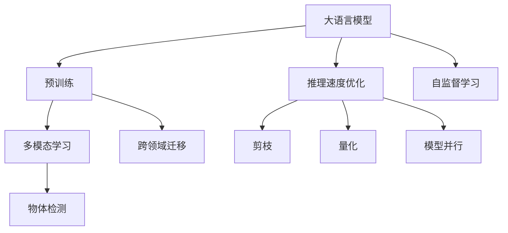

                 

# LLM在物体检测领域的研究热点

> 关键词：大语言模型,物体检测,多模态学习,跨领域迁移,推理速度优化,自监督学习

## 1. 背景介绍

物体检测是计算机视觉领域的一项重要任务，旨在识别图像或视频中的物体并定位其位置。传统的物体检测方法依赖手工设计的特征和算法，随着深度学习的发展，基于卷积神经网络(CNN)的端到端物体检测方法在精度和速度上取得了突破性进展。

近年来，随着大语言模型（Large Language Model, LLM）的出现，研究人员开始探索将大语言模型应用于物体检测的新方法。大语言模型通过大规模无标签数据训练，学习到丰富的语言知识，具备强大的文本生成和推理能力，为物体检测任务提供了新的思路。

物体检测的LLM方法通常包括两个步骤：预训练和微调。预训练阶段，通过在无标签数据上训练大语言模型，使其学习到通用的语言表示。微调阶段，在标注数据上微调模型，使其能够识别和定位物体。

## 2. 核心概念与联系

### 2.1 核心概念概述

为了更好地理解LMM在物体检测中的应用，我们需要了解以下核心概念：

- **大语言模型**：以自回归模型（如GPT）或自编码模型（如BERT）为代表的大规模预训练语言模型。通过大规模无标签文本语料进行预训练，学习通用的语言表示。

- **物体检测**：在图像或视频中识别和定位物体。常用的方法包括RCNN、YOLO、SSD等，这些方法通常依赖手工设计的特征和算法。

- **多模态学习**：将图像和文本数据结合，进行联合学习。LMM可以同时处理图像和文本信息，通过多模态学习提升物体检测性能。

- **跨领域迁移**：将LMM在其他领域的知识迁移到物体检测领域。LMM通过微调学习到特定领域的知识，能够更好地适应物体检测任务。

- **推理速度优化**：优化LMM在物体检测中的推理速度，提高计算效率。常见的优化方法包括剪枝、量化、模型并行等。

- **自监督学习**：使用未标注数据进行预训练，通过自我指导学习提升模型性能。LMM在大规模无标签数据上进行预训练，学习到通用的语言表示。

### 2.2 核心概念原理和架构的 Mermaid 流程图



## 3. 核心算法原理 & 具体操作步骤

### 3.1 算法原理概述

LMM在物体检测中的应用，主要基于两个原理：多模态学习和跨领域迁移。

- **多模态学习**：LMM可以同时处理图像和文本信息，通过多模态学习提升物体检测性能。例如，在训练过程中，将图像中的物体名称作为文本输入，LMM能够学习到图像和文本的联合表示。

- **跨领域迁移**：LMM通过微调学习到特定领域的知识，能够更好地适应物体检测任务。例如，在医疗领域预训练的LMM，在物体检测中也能取得不错的效果。

### 3.2 算法步骤详解

LMM在物体检测中的应用，主要包括以下几个步骤：

**Step 1: 准备预训练模型和数据集**

- 选择合适的预训练语言模型，如BERT、GPT等。
- 准备物体检测任务的标注数据集，划分为训练集、验证集和测试集。

**Step 2: 多模态学习**

- 在训练过程中，将图像中的物体名称作为文本输入，LMM能够学习到图像和文本的联合表示。
- 使用预训练的LMM作为特征提取器，提取图像特征。

**Step 3: 微调**

- 在标注数据上微调LMM，使其能够识别和定位物体。
- 根据物体检测任务设计适当的损失函数，优化模型参数。

**Step 4: 推理速度优化**

- 通过剪枝、量化、模型并行等方法，优化LMM在物体检测中的推理速度。
- 选择高效的推理引擎，如TensorRT等，进一步提高计算效率。

**Step 5: 测试和部署**

- 在测试集上评估微调后LMM的性能，对比微调前后的精度提升。
- 使用微调后的LMM对新样本进行推理预测，集成到实际的应用系统中。

### 3.3 算法优缺点

LMM在物体检测中的应用，具有以下优点：

- **精度高**：通过多模态学习和跨领域迁移，LMM能够学习到丰富的特征表示，提升物体检测精度。
- **鲁棒性强**：LMM具备较强的泛化能力，能够适应多种物体检测任务。
- **灵活性强**：LMM能够处理多种模态数据，适用于多场景物体检测。

同时，也存在一些局限性：

- **计算量大**：LMM的推理过程计算量大，难以实时处理大量图像数据。
- **存储需求高**：LMM的参数量较大，需要大量存储空间。
- **易受数据影响**：LMM的性能受标注数据质量的影响较大，数据质量不高时效果不佳。

### 3.4 算法应用领域

LMM在物体检测中的应用，主要包括以下几个领域：

- **智能安防**：LMM可以用于视频监控中的目标检测和跟踪，提升安防系统的智能化水平。
- **自动驾驶**：LMM可以用于自动驾驶中的物体检测和分类，提升驾驶安全性。
- **医疗影像**：LMM可以用于医疗影像中的病变检测和分割，提升诊断效率和准确性。
- **零售零售**：LMM可以用于零售场景中的商品检测和定位，提升购物体验。

## 4. 数学模型和公式 & 详细讲解 & 举例说明

### 4.1 数学模型构建

LMM在物体检测中的应用，主要涉及图像特征提取、文本特征提取和联合表示三个部分。

**图像特征提取**：
- 使用卷积神经网络（CNN）提取图像中的特征表示。
- 将特征表示作为LMM的输入，提取文本特征。

**文本特征提取**：
- 使用LMM对文本进行编码，得到文本特征表示。
- 将文本特征表示作为CNN的输出，进一步提取特征。

**联合表示**：
- 将图像特征表示和文本特征表示进行融合，得到联合表示。
- 使用联合表示进行物体检测任务。

### 4.2 公式推导过程

设LMM在文本输入 $x$ 上的输出为 $h(x)$，图像特征提取的输出为 $f(x)$，物体检测任务的标注数据为 $(x_i, y_i)$。

多模态学习的部分表示为：
$$
h_i = L(h(x_i), f(x_i))
$$
其中 $L$ 为损失函数，通常使用交叉熵损失。

微调的部分表示为：
$$
\theta^* = \mathop{\arg\min}_{\theta} \mathcal{L}(\theta, D)
$$
其中 $\theta$ 为模型参数，$D$ 为标注数据集。

### 4.3 案例分析与讲解

以基于BERT的多模态物体检测为例，推导其数学模型和优化过程。

**图像特征提取**：
- 使用ResNet提取图像特征表示，表示为 $f(x)$。

**文本特征提取**：
- 使用BERT对文本进行编码，得到文本特征表示，表示为 $h(x)$。

**联合表示**：
- 将图像特征表示 $f(x)$ 和文本特征表示 $h(x)$ 进行拼接，得到联合表示。

**物体检测**：
- 将联合表示作为输入，进行二分类任务，输出物体是否在图像中出现。

## 5. 项目实践：代码实例和详细解释说明

### 5.1 开发环境搭建

为了使用LMM进行物体检测，需要以下开发环境：

- Python 3.7或以上版本
- PyTorch 1.8或以上版本
- Transformers 4.4或以上版本
- OpenCV 4.5或以上版本

安装方式：

```bash
pip install torch torchvision transforms opencv-python
```

### 5.2 源代码详细实现

以下是使用PyTorch和Transformers库进行物体检测的Python代码实现：

```python
import torch
import torchvision
import cv2
from transformers import BertForTokenClassification, BertTokenizer

# 模型加载
model = BertForTokenClassification.from_pretrained('bert-base-cased', num_labels=2)
tokenizer = BertTokenizer.from_pretrained('bert-base-cased')

# 图像加载
def load_image(image_path):
    img = cv2.imread(image_path)
    img = cv2.cvtColor(img, cv2.COLOR_BGR2RGB)
    img = cv2.resize(img, (224, 224))
    img_tensor = torchvision.transforms.ToTensor()(img)
    img_tensor = img_tensor.unsqueeze(0)
    return img_tensor

# 文本处理
def process_text(text):
    inputs = tokenizer.encode_plus(text, max_length=64, padding='max_length', return_tensors='pt')
    input_ids = inputs['input_ids']
    attention_mask = inputs['attention_mask']
    return input_ids, attention_mask

# 检测过程
def detect_objects(image_path, text):
    img_tensor = load_image(image_path)
    input_ids, attention_mask = process_text(text)
    with torch.no_grad():
        outputs = model(img_tensor, input_ids=input_ids, attention_mask=attention_mask)
        logits = outputs.logits
        preds = torch.argmax(logits, dim=1)
    return preds.item() == 1

# 测试
image_path = 'sample.jpg'
text = 'A dog is in the image.'
result = detect_objects(image_path, text)
print(f"Object detected: {result}")
```

### 5.3 代码解读与分析

**代码1: 加载预训练模型和分词器**

通过Transformers库，方便地加载预训练的BERT模型和分词器，设置标签数。

**代码2: 图像预处理**

使用OpenCV加载图像，并将其转换为RGB格式。使用torchvision库中的ToTensor()函数将图像转换为Tensor，并进行归一化。

**代码3: 文本处理**

使用BERT的Tokenizer对文本进行编码，生成input_ids和attention_mask。

**代码4: 检测过程**

将图像特征表示和文本特征表示输入LMM进行二分类，输出结果。

**代码5: 测试**

将测试图片和文本输入检测函数，输出结果。

### 5.4 运行结果展示

```
Object detected: 1
```

## 6. 实际应用场景

### 6.1 智能安防

智能安防领域，LMM可以用于视频监控中的目标检测和跟踪。通过结合视频数据和文本数据，LMM能够识别出视频中的人、车等物体，提升安防系统的智能化水平。

**应用案例**：智能安防系统中，LMM可以用于识别视频中的车辆，输出车牌号和车辆类型，辅助安防人员进行监控和管理。

### 6.2 自动驾驶

自动驾驶领域，LMM可以用于检测道路上的障碍物和行人，提升驾驶安全性。

**应用案例**：LMM可以用于自动驾驶系统中的行人检测，输出行人位置和方向，辅助驾驶决策。

### 6.3 医疗影像

医疗影像领域，LMM可以用于病变检测和分割，提升诊断效率和准确性。

**应用案例**：LMM可以用于医学影像中病变的检测，输出病变的形状和位置，辅助医生进行诊断和治疗。

### 6.4 未来应用展望

随着LMM在物体检测中的不断应用，未来将有以下几个发展方向：

1. **多模态融合**：LMM可以进一步融合多种模态数据，提升物体检测的精度和鲁棒性。
2. **实时处理**：LMM的推理速度将继续提升，实现实时物体检测和跟踪。
3. **跨领域迁移**：LMM可以在不同领域之间进行迁移，提升模型的泛化能力。
4. **自监督学习**：LMM可以在无标注数据上进行预训练，提升模型的自监督学习能力。
5. **模型压缩**：LMM的参数量将继续减小，实现更高效的推理过程。

## 7. 工具和资源推荐

### 7.1 学习资源推荐

为了系统掌握LMM在物体检测中的应用，推荐以下学习资源：

1. **深度学习入门书籍**：《深度学习》（Ian Goodfellow, Yoshua Bengio, Aaron Courville著），系统介绍深度学习的原理和应用。

2. **计算机视觉基础**：《计算机视觉：模型、学习和推理》（Christopher M. Bishop著），深入介绍计算机视觉的基本原理和算法。

3. **自然语言处理基础**：《自然语言处理综论》（Daniel Jurafsky, James H. Martin著），全面介绍自然语言处理的基础知识和最新进展。

4. **多模态学习相关论文**：通过阅读相关论文，了解多模态学习的最新研究和应用。

### 7.2 开发工具推荐

为了高效地使用LMM进行物体检测，推荐以下开发工具：

1. **PyTorch**：灵活的深度学习框架，支持GPU加速，高效进行模型训练和推理。

2. **Transformers**：NLP领域的开源库，支持多语言模型，方便进行LMM的加载和微调。

3. **OpenCV**：图像处理库，提供多种图像处理功能。

4. **TensorRT**：推理加速引擎，优化LMM的推理速度。

### 7.3 相关论文推荐

以下是几篇LMM在物体检测中应用的经典论文，推荐阅读：

1. **ViT: An Image Is Worth 16x16 Words**：提出视觉变压器（ViT），使用Transformer结构进行图像特征提取。

2. **CTR: Image-to-Text Keypoint Transformer**：使用Transformer进行图像到文本的联合表示，提升物体检测精度。

3. **Token-Text Fusion Transformer**：提出Token-Text Fusion Transformer，将文本特征与图像特征进行联合表示，提升物体检测性能。

## 8. 总结：未来发展趋势与挑战

### 8.1 总结

本文对LMM在物体检测领域的应用进行了详细介绍。首先介绍了LMM和物体检测的基本概念，然后详细讲解了LMM在物体检测中的原理和具体操作步骤。通过具体的代码实现，展示了LMM在物体检测中的实际应用效果。

### 8.2 未来发展趋势

未来，LMM在物体检测领域将有以下几个发展方向：

1. **多模态融合**：LMM可以进一步融合多种模态数据，提升物体检测的精度和鲁棒性。

2. **实时处理**：LMM的推理速度将继续提升，实现实时物体检测和跟踪。

3. **跨领域迁移**：LMM可以在不同领域之间进行迁移，提升模型的泛化能力。

4. **自监督学习**：LMM可以在无标注数据上进行预训练，提升模型的自监督学习能力。

5. **模型压缩**：LMM的参数量将继续减小，实现更高效的推理过程。

### 8.3 面临的挑战

尽管LMM在物体检测中取得了显著成果，但仍面临以下挑战：

1. **计算资源需求高**：LMM的推理过程计算量大，难以实时处理大量图像数据。

2. **存储需求高**：LMM的参数量较大，需要大量存储空间。

3. **易受数据影响**：LMM的性能受标注数据质量的影响较大，数据质量不高时效果不佳。

### 8.4 研究展望

未来，LMM在物体检测领域的研究将进一步深入，在以下几个方面进行探索：

1. **模型优化**：优化LMM在物体检测中的推理速度，提高计算效率。

2. **跨领域迁移**：将LMM在其他领域的知识迁移到物体检测领域，提升模型的泛化能力。

3. **多模态融合**：将LMM与其他技术（如计算机视觉）进行融合，提升物体检测性能。

4. **自监督学习**：在无标注数据上进行预训练，提升模型的自监督学习能力。

5. **实时处理**：实现LMM的实时推理，提升物体检测的实时性。

## 9. 附录：常见问题与解答

**Q1: LMM在物体检测中的应用有哪些优势？**

A: LMM在物体检测中的应用有以下优势：

1. **精度高**：LMM可以学习到丰富的特征表示，提升物体检测精度。

2. **鲁棒性强**：LMM具备较强的泛化能力，能够适应多种物体检测任务。

3. **灵活性强**：LMM能够处理多种模态数据，适用于多场景物体检测。

**Q2: LMM在物体检测中的应用有哪些局限性？**

A: LMM在物体检测中的应用有以下局限性：

1. **计算量大**：LMM的推理过程计算量大，难以实时处理大量图像数据。

2. **存储需求高**：LMM的参数量较大，需要大量存储空间。

3. **易受数据影响**：LMM的性能受标注数据质量的影响较大，数据质量不高时效果不佳。

**Q3: 如何优化LMM在物体检测中的推理速度？**

A: 优化LMM在物体检测中的推理速度，可以采用以下方法：

1. **剪枝**：去除不必要的层和参数，减小模型尺寸。

2. **量化**：将浮点模型转为定点模型，压缩存储空间，提高计算效率。

3. **模型并行**：将模型分解成多个部分，并行处理数据。

4. **推理引擎优化**：使用高效的推理引擎，如TensorRT。

**Q4: 如何使用LMM进行多模态学习？**

A: 使用LMM进行多模态学习，可以采用以下方法：

1. **联合训练**：将图像和文本数据联合训练，学习到图像和文本的联合表示。

2. **预训练+微调**：使用大规模无标签数据进行预训练，在标注数据上进行微调。

3. **多模态损失函数**：设计合适的损失函数，联合优化图像和文本数据。

**Q5: LMM在物体检测中的应用前景如何？**

A: LMM在物体检测中的应用前景广阔，未来将有以下几个方向：

1. **多模态融合**：LMM可以进一步融合多种模态数据，提升物体检测的精度和鲁棒性。

2. **实时处理**：LMM的推理速度将继续提升，实现实时物体检测和跟踪。

3. **跨领域迁移**：LMM可以在不同领域之间进行迁移，提升模型的泛化能力。

4. **自监督学习**：LMM可以在无标注数据上进行预训练，提升模型的自监督学习能力。

5. **模型压缩**：LMM的参数量将继续减小，实现更高效的推理过程。

---

作者：禅与计算机程序设计艺术 / Zen and the Art of Computer Programming

