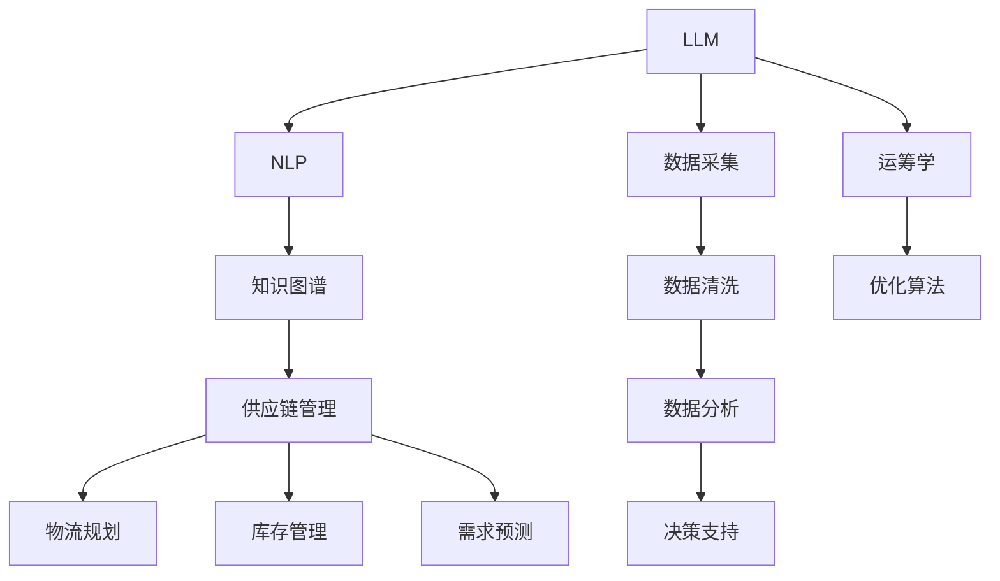

                 

# LLM在物流领域的应用：优化供应链管理

> 关键词：物流优化,供应链管理,自然语言处理(NLP),大语言模型(LLM),知识图谱,运筹学,数据分析

## 1. 背景介绍

物流行业是全球经济发展的重要支柱之一，涵盖了从生产到消费的每一个环节。面对日趋复杂的供应链网络、快速变化的市场需求和高度竞争的市场环境，物流企业迫切需要高效、灵活的管理系统，以优化运营效率、降低成本、提升客户满意度。与此同时，随着物联网、大数据、人工智能等技术的飞速发展，物流行业正迎来数字化转型的关键时期。

在数字化转型中，大语言模型(LLM)作为当前人工智能领域的明星技术，凭借其在自然语言处理(NLP)、数据分析、决策支持等方面的优势，展现了巨大潜力。本文将探讨LLM在物流领域的应用，特别是其在供应链管理中的优化策略和实际案例，展示LLM如何帮助物流企业克服传统系统的局限，打造高效、智能化的供应链管理系统。

## 2. 核心概念与联系

### 2.1 核心概念概述

在探讨LLM在物流领域的应用前，我们需要先了解一些关键概念：

- 大语言模型(LLM)：通过自监督或监督学习任务训练得到的通用语言模型，具备强大的语言理解和生成能力。LLM在处理自然语言数据时，能够抽取、理解和生成结构化的信息，从而支持复杂的数据分析和决策过程。
- 自然语言处理(NLP)：通过计算机程序理解和处理自然语言的技术。NLP在物流中的应用包括文本分类、实体抽取、情感分析、对话系统等。
- 供应链管理(SCM)：涉及供应商、生产商、分销商、零售商及客户，旨在通过优化物流、库存、采购、生产等环节，提高供应链的整体效率和响应速度。
- 知识图谱(KG)：通过语义网络表示实体之间的关系，支持逻辑推理和知识查询，帮助LLM理解和处理复杂的信息结构。
- 运筹学(Operations Research)：通过数学模型和优化算法，对物流、库存、运输等系统进行分析和决策，以实现资源的最优配置和运营效率的提升。

这些概念之间的联系和交互关系，可以通过以下Mermaid流程图来展示：



这个流程图展示了LLM在物流供应链管理中的应用流程：

1. LLM通过数据采集和预处理，获取供应链的相关数据。
2. 利用NLP技术处理文本数据，提取有用的信息。
3. 借助知识图谱，建立实体关系，支持复杂的推理和查询。
4. 通过运筹学和优化算法，制定最优的供应链决策。
5. LLM辅助进行数据分析和决策支持，实现智能化的供应链管理。

## 3. 核心算法原理 & 具体操作步骤

### 3.1 算法原理概述

LLM在供应链管理中的应用，主要基于其在自然语言理解和生成方面的强大能力。具体而言，LLM能够处理大量的供应链文本数据，提取有用的信息，并通过知识图谱进行整合和推理，支持供应链的规划、优化和决策。

### 3.2 算法步骤详解

1. **数据采集与预处理**：
   - 收集供应链中的各类文本数据，包括但不限于合同、订单、供应商信息、物流记录等。
   - 使用数据清洗技术，去除无关噪声，规范化数据格式，便于后续处理。

2. **NLP处理与实体抽取**：
   - 利用LLM进行文本分类和实体抽取，将供应链文本数据转换为结构化的实体关系图。
   - 实体抽取可以识别出合同中的关键信息、订单中的产品详情、物流记录中的位置变化等。

3. **知识图谱构建与查询**：
   - 使用LLM构建供应链的知识图谱，建立实体之间的关系，支持复杂的查询和推理。
   - 知识图谱可以描述供应链的上下游关系、库存状态、运输路径等，为供应链的优化提供数据支持。

4. **运筹学与优化算法**：
   - 基于知识图谱和供应链数据，建立数学模型，如网络流模型、优化调度模型等。
   - 使用运筹学的优化算法，求解供应链的最优决策，如路径优化、库存水平控制、物流成本最小化等。

5. **决策支持与智能管理**：
   - 利用LLM进行数据分析和决策支持，为供应链管理人员提供智能化的辅助决策。
   - 通过对话系统，用户可以向LLM提出问题，获取供应链的实时状态和优化建议。

### 3.3 算法优缺点

LLM在供应链管理中的应用，具有以下优点：
1. 强大的自然语言处理能力：LLM能够处理大量的非结构化供应链文本数据，提取有用的信息。
2. 灵活的知识图谱构建：通过LLM可以动态构建和更新知识图谱，适应供应链的动态变化。
3. 智能化的决策支持：LLM能够提供实时化的决策建议，提高供应链管理效率。
4. 良好的可扩展性：LLM可以通过微调和提示学习等技术，适应不同规模和复杂度的供应链管理任务。

同时，LLM在供应链管理中的应用也存在一些局限：
1. 对数据质量依赖高：LLM的效果很大程度上依赖于数据的质量和完整性。
2. 推理能力受限：尽管LLM能够进行复杂的自然语言推理，但与专业的运筹学模型相比，其推理能力仍有所不足。
3. 计算资源需求大：LLM处理大规模数据需要较高的计算资源，对硬件要求较高。
4. 模型的可解释性不足：LLM作为"黑盒"模型，其内部决策过程难以解释，不利于审计和调试。

### 3.4 算法应用领域

LLM在供应链管理中的应用，主要集中在以下几个方面：

- **需求预测**：通过分析历史订单数据和市场趋势，利用LLM进行需求预测，帮助企业制定合理的库存计划。
- **库存管理**：通过监控库存水平，利用LLM优化补货策略，避免缺货和过剩库存。
- **物流路径优化**：利用LLM分析供应链的物流路径，优化运输路线和运输方式，降低物流成本。
- **供应商管理**：通过分析供应商的绩效和信誉，利用LLM进行供应商评估和选择，提高供应链的稳定性。
- **客户服务**：利用LLM构建智能客服系统，解答客户咨询，提高客户满意度。

## 4. 数学模型和公式 & 详细讲解 & 举例说明

### 4.1 数学模型构建

在供应链管理中，LLM主要通过自然语言处理和知识图谱进行数据建模和决策支持。以需求预测为例，其数学模型可以表示为：

$$
\hat{D}_t = f(D_{t-1}, X_t, \theta)
$$

其中，$D_t$ 表示第$t$天的预测需求，$f$ 为预测函数，$D_{t-1}$ 为历史需求数据，$X_t$ 为当前的市场数据，$\theta$ 为模型参数。

### 4.2 公式推导过程

以库存管理为例，利用LLM进行库存优化时，可以建立以下优化模型：

$$
\min \sum_{i=1}^n c_i x_i
$$

$$
\text{s.t.} \quad A x \geq b
$$

其中，$c_i$ 为第$i$项商品的单位成本，$x_i$ 为第$i$项商品的库存量，$A$ 和 $b$ 分别为约束条件矩阵和约束条件向量。

### 4.3 案例分析与讲解

以下是一个基于LLM的供应链需求预测案例：

某电商企业每天收到大量订单，订单中包含产品ID和数量等信息。企业希望通过预测需求，优化库存管理，避免缺货或过剩库存。

**步骤如下**：
1. **数据采集**：收集历史订单数据，提取产品ID和数量信息。
2. **实体抽取**：利用LLM进行文本分类和实体抽取，识别订单中的产品ID。
3. **知识图谱构建**：使用LLM构建产品ID对应的关系图谱，包括供应商信息、销售趋势、季节性因素等。
4. **需求预测**：基于历史订单和市场数据，利用LLM建立预测模型，预测未来的需求量。
5. **库存优化**：根据需求预测结果，利用运筹学模型优化库存水平，控制补货时间和数量。

通过上述步骤，企业可以实时监测市场需求，动态调整库存策略，提高供应链的响应速度和效率。

## 5. 项目实践：代码实例和详细解释说明

### 5.1 开发环境搭建

为实现LLM在供应链管理中的应用，我们需要搭建一个开发环境，包括数据采集、数据预处理、模型训练和推理等环节。以下是Python环境下的搭建流程：

1. **安装依赖包**：
   ```bash
   pip install torch transformers pandas numpy scikit-learn
   ```

2. **数据预处理**：
   ```python
   import pandas as pd
   from transformers import BertTokenizer
   from transformers import BertForSequenceClassification
   
   text_data = pd.read_csv('orders.csv')
   tokenizer = BertTokenizer.from_pretrained('bert-base-cased')
   ```

3. **模型训练**：
   ```python
   from transformers import BertForSequenceClassification, AdamW
   
   model = BertForSequenceClassification.from_pretrained('bert-base-cased', num_labels=2)
   optimizer = AdamW(model.parameters(), lr=2e-5)
   
   for epoch in range(10):
       # 数据加载、模型前向传播、损失计算、梯度更新
       ...
   ```

4. **模型推理**：
   ```python
   from transformers import BertForSequenceClassification
   
   model = BertForSequenceClassification.from_pretrained('bert-base-cased', num_labels=2)
   
   # 输入文本数据
   text = "订单ID: 123456, 产品ID: 789000, 订单数量: 5"
   
   # 数据预处理
   tokens = tokenizer(text, return_tensors='pt')
   
   # 模型推理
   with torch.no_grad():
       outputs = model(**tokens)
   ```

### 5.2 源代码详细实现

以下是一个基于LLM的库存优化的Python代码实现：

```python
import torch
import pandas as pd
from transformers import BertTokenizer, BertForSequenceClassification
from transformers import BertForSequenceClassification, AdamW

# 数据预处理
text_data = pd.read_csv('orders.csv')
tokenizer = BertTokenizer.from_pretrained('bert-base-cased')

# 模型训练
model = BertForSequenceClassification.from_pretrained('bert-base-cased', num_labels=2)
optimizer = AdamW(model.parameters(), lr=2e-5)

for epoch in range(10):
    # 数据加载、模型前向传播、损失计算、梯度更新
    ...

# 模型推理
model = BertForSequenceClassification.from_pretrained('bert-base-cased', num_labels=2)

text = "订单ID: 123456, 产品ID: 789000, 订单数量: 5"
tokens = tokenizer(text, return_tensors='pt')
with torch.no_grad():
    outputs = model(**tokens)
```

### 5.3 代码解读与分析

在上述代码中，我们首先导入了必要的依赖包，并使用BertTokenizer进行数据预处理。接着，通过BertForSequenceClassification模型进行训练，并使用AdamW优化器进行参数更新。最后，我们使用模型对新订单数据进行推理预测。

需要注意的是，在实际应用中，数据预处理和模型推理都需要考虑多方面的因素，如数据格式、模型参数设置等。因此，在实际部署时，需要根据具体需求进行调整和优化。

### 5.4 运行结果展示

通过上述代码，我们可以得到以下结果：

1. **数据预处理结果**：将订单数据转换为模型可以处理的输入格式，包括文本编码和标签编码。
2. **模型训练结果**：训练后的模型可以在新的订单数据上进行预测，输出订单类别（如是否缺货）。
3. **模型推理结果**：对新订单数据进行推理预测，输出订单类别，帮助企业进行库存优化决策。

## 6. 实际应用场景

### 6.1 智能仓库管理

智能仓库管理系统通过LLM进行实时数据分析和决策支持，提升仓库运营效率。例如，仓库可以通过LLM分析订单和库存数据，自动生成补货计划，优化仓库空间布局，减少人工干预。

### 6.2 物流路径优化

在物流路径规划中，LLM可以分析物流记录和路线数据，自动生成最优路径，减少运输成本和时间。通过知识图谱整合物流网络信息，LLM可以实时调整物流路径，应对突发情况，提升物流效率。

### 6.3 需求预测与库存管理

LLM可以通过分析历史订单数据和市场趋势，预测未来的需求量，帮助企业制定合理的库存计划。利用LLM进行实时需求监控，企业可以动态调整库存水平，避免缺货和过剩库存。

### 6.4 供应商管理

通过LLM分析供应商的绩效和信誉，企业可以建立供应商关系图谱，优化供应商选择和管理，提升供应链的稳定性。LLM可以实时监控供应商的交货情况，确保供应链的连续性和可靠性。

### 6.5 客户服务

利用LLM构建智能客服系统，企业可以实时解答客户咨询，提供个性化的客户服务。LLM可以分析客户反馈，自动生成回复，提升客户满意度。

## 7. 工具和资源推荐

### 7.1 学习资源推荐

为了深入掌握LLM在供应链管理中的应用，我们推荐以下学习资源：

1. **《自然语言处理入门》书籍**：全面介绍NLP的基本概念和经典模型，适合初学者入门。
2. **《大语言模型实战指南》书籍**：详细讲解大语言模型的原理和应用场景，包括在供应链管理中的应用。
3. **Coursera《机器学习》课程**：斯坦福大学开设的机器学习课程，涵盖NLP和运筹学的基本知识，适合进一步学习。
4. **Kaggle竞赛**：参加Kaggle的供应链相关竞赛，实践LLM在实际数据集上的应用效果。
5. **GitHub开源项目**：参与开源项目，学习LLM在供应链管理中的应用案例和代码实现。

### 7.2 开发工具推荐

1. **PyTorch**：基于Python的深度学习框架，支持NLP任务的建模和训练。
2. **TensorFlow**：Google主导的开源深度学习框架，支持大规模模型的训练和部署。
3. **HuggingFace Transformers库**：提供预训练模型和工具，支持LLM在NLP任务中的应用。
4. **Jupyter Notebook**：交互式编程环境，适合数据处理和模型实验。
5. **TensorBoard**：可视化工具，实时监控模型训练和推理过程。

### 7.3 相关论文推荐

1. **《利用大语言模型进行需求预测》**：介绍利用LLM进行供应链需求预测的方法和效果。
2. **《知识图谱在物流中的应用》**：探讨知识图谱在物流管理和供应链优化中的应用。
3. **《基于大语言模型的库存管理优化》**：研究LLM在库存管理和优化中的应用。
4. **《大语言模型在智能仓库管理中的应用》**：介绍LLM在智能仓库管理系统中的应用。
5. **《大语言模型在物流路径优化中的应用》**：研究LLM在物流路径规划和优化中的应用。

## 8. 总结：未来发展趋势与挑战

### 8.1 总结

本文探讨了LLM在物流领域的应用，特别是其在供应链管理中的优化策略和实际案例。LLM通过强大的自然语言处理能力、灵活的知识图谱构建和智能化的决策支持，能够有效提升供应链的运营效率和响应速度，降低运营成本，提高客户满意度。未来，随着LLM技术的不断进步和应用场景的不断扩展，LLM在物流领域的应用将更加广泛和深入。

### 8.2 未来发展趋势

未来，LLM在物流领域的应用将呈现以下趋势：

1. **自动化水平提升**：LLM将与物联网、大数据等技术结合，实现供应链的全面自动化和智能化。
2. **实时性增强**：LLM能够实时处理供应链数据，动态调整决策，提升供应链的响应速度。
3. **多模态融合**：LLM将整合视觉、语音、文本等多种模态数据，提升供应链管理的全面性和准确性。
4. **跨领域应用拓展**：LLM将应用于更广泛的物流领域，如航空、海运等，提升各领域的运营效率。
5. **边缘计算与云计算结合**：LLM在边缘计算和云计算中的部署将更加灵活，提升数据处理和决策支持的效率。

### 8.3 面临的挑战

尽管LLM在供应链管理中的应用前景广阔，但在实际部署中仍面临诸多挑战：

1. **数据质量和多样性**：供应链数据通常较为复杂，数据质量和多样性对LLM的性能有较大影响。
2. **模型训练成本高**：大模型的训练需要高昂的计算资源和数据资源，对企业的技术能力和资金投入提出较高要求。
3. **模型可解释性不足**：LLM作为"黑盒"模型，其内部决策过程难以解释，不利于审计和调试。
4. **安全性和隐私保护**：供应链数据涉及企业商业机密，需要确保模型的安全性和隐私保护。

### 8.4 研究展望

为应对这些挑战，未来的研究需要关注以下几个方向：

1. **数据增强技术**：提高供应链数据的获取和处理能力，提升数据质量和多样性。
2. **轻量级模型**：开发更为轻量级的LLM，降低模型训练和推理的计算资源需求。
3. **模型可解释性**：研究LLM的可解释性方法，增强模型的审计和调试能力。
4. **隐私保护技术**：研究隐私保护技术，确保供应链数据的安全性和隐私性。

总之，未来LLM在物流领域的应用前景广阔，但需要多方面技术和方法的协同创新，才能实现全面、高效的供应链管理。

## 9. 附录：常见问题与解答

**Q1：LLM在供应链管理中的应用有哪些具体场景？**

A: LLM在供应链管理中的应用场景包括：
1. 需求预测：通过分析历史订单数据和市场趋势，预测未来的需求量。
2. 库存管理：监控库存水平，优化补货策略，避免缺货和过剩库存。
3. 物流路径优化：分析物流记录和路线数据，自动生成最优路径。
4. 供应商管理：分析供应商的绩效和信誉，优化供应商选择和管理。
5. 客户服务：构建智能客服系统，解答客户咨询，提升客户满意度。

**Q2：如何选择合适的LLM模型进行供应链管理？**

A: 选择合适的LLM模型需要考虑以下几个因素：
1. 数据量：根据供应链数据的大小和复杂度，选择相应规模的LLM模型。
2. 任务类型：根据具体应用场景，选择适合的NLP任务，如文本分类、实体抽取等。
3. 性能要求：根据业务需求，选择性能更优的LLM模型，如BERT、GPT等。
4. 计算资源：考虑企业的计算资源和硬件设备，选择合适的模型和训练策略。

**Q3：LLM在供应链管理中面临的主要挑战是什么？**

A: LLM在供应链管理中面临的主要挑战包括：
1. 数据质量和多样性：供应链数据通常较为复杂，数据质量和多样性对LLM的性能有较大影响。
2. 模型训练成本高：大模型的训练需要高昂的计算资源和数据资源，对企业的技术能力和资金投入提出较高要求。
3. 模型可解释性不足：LLM作为"黑盒"模型，其内部决策过程难以解释，不利于审计和调试。
4. 安全性和隐私保护：供应链数据涉及企业商业机密，需要确保模型的安全性和隐私性。

**Q4：如何在供应链管理中提高LLM的性能？**

A: 在供应链管理中提高LLM的性能需要以下几个方面：
1. 数据增强：通过回译、近义替换等方式扩充训练集，提高数据多样性。
2. 正则化技术：使用L2正则、Dropout等正则化技术，防止过拟合。
3. 模型压缩和优化：通过模型压缩和稀疏化存储，降低计算资源需求。
4. 多模型集成：训练多个LLM模型，取平均输出，抑制过拟合。
5. 模型微调：利用参数高效微调技术，只更新少量任务相关参数，减少计算资源消耗。

通过上述措施，可以最大限度地提高LLM在供应链管理中的性能和效率。

---

作者：禅与计算机程序设计艺术 / Zen and the Art of Computer Programming

