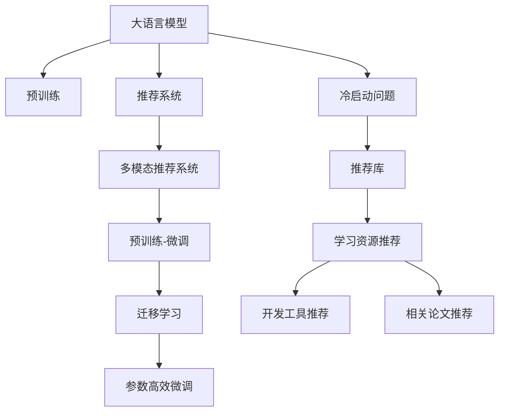

                 

# LLM在跨域推荐中的应用

## 1. 背景介绍

### 1.1 问题由来
推荐系统是现代社会的重要技术之一，能够显著提升用户使用体验，帮助用户发现优质内容。传统的推荐系统往往基于用户历史行为数据进行推荐，难以处理用户行为背后的语义信息。随着语言模型的发展，推荐系统开始引入预训练语言模型，提升了推荐内容的质量和多样性。但现有的基于语言模型的推荐系统，大多仅聚焦于文本内容，忽略了用户和物品之间更复杂的多模态交互关系。

为了更全面地捕捉用户和物品之间的关联，本文探讨如何在预训练语言模型的基础上，引入用户属性、物品属性等多模态信息，构建跨域推荐系统。跨域推荐系统能够充分利用不同模态的信息，提供更精准、全面的推荐结果，对于提高推荐系统的性能和用户体验具有重要意义。

### 1.2 问题核心关键点
大语言模型在推荐系统中的应用，核心在于如何利用预训练语言模型学习到的知识，结合用户和物品的多模态信息，输出更加准确、合理的推荐结果。具体来说，包括以下关键问题：

1. 如何融合用户属性和物品属性等多模态信息？
2. 如何通过预训练语言模型学习到的知识，提升推荐系统的性能？
3. 如何处理推荐系统中的冷启动问题，提高新用户的推荐效果？
4. 如何优化推荐结果的泛化性能，避免对特定领域数据的过拟合？

本文将重点讨论这些问题，以期对大语言模型在推荐系统中的应用提供更深入的指导。

### 1.3 问题研究意义
跨域推荐系统在电子商务、社交网络、新闻阅读等领域具有重要应用价值。大语言模型在推荐系统中的应用，不仅可以利用其强大的语言理解和生成能力，还可以结合多模态信息，构建更加全面、精准的推荐模型。这将有助于提高推荐系统的用户满意度，增强用户的粘性，促进业务转化，提升企业的市场竞争力。

## 2. 核心概念与联系

### 2.1 核心概念概述

为了更好地理解大语言模型在跨域推荐中的应用，本节将介绍几个密切相关的核心概念：

- 大语言模型(Large Language Model, LLM)：以自回归(如GPT)或自编码(如BERT)模型为代表的大规模预训练语言模型。通过在大规模无标签文本语料上进行预训练，学习通用的语言表示，具备强大的语言理解和生成能力。

- 推荐系统(Recommendation System)：根据用户历史行为数据和物品属性信息，推荐可能感兴趣的物品的系统。常见的推荐算法包括协同过滤、基于内容的推荐等。

- 多模态推荐系统(Multimodal Recommendation System)：结合用户属性、物品属性、时间、位置等多模态信息，构建更全面的推荐模型。多模态推荐系统能够更好地理解和利用用户的多层次需求。

- 预训练-微调(Pre-training & Fine-tuning)：先在大规模无标签数据上进行预训练，再通过有监督学习对模型进行微调，优化模型在特定任务上的性能。预训练-微调是推荐系统中广泛采用的技术。

- 迁移学习(Transfer Learning)：指将一个领域学习到的知识，迁移到另一个不同但相关的领域。预训练-微调就是迁移学习的一种形式。

- 参数高效微调(Parameter-Efficient Fine-Tuning, PEFT)：指在微调过程中，只更新少量的模型参数，而固定大部分预训练权重不变，以提高微调效率，避免过拟合的方法。

- 推荐库：如Tensorflow Recommenders、PyTorch Recommendations等，提供了多种推荐算法和模型，方便开发者构建推荐系统。

- 冷启动问题(Cold-start Problem)：指新用户或新物品加入推荐系统时，由于缺乏足够的历史数据，推荐效果较差的问题。

这些核心概念之间的逻辑关系可以通过以下Mermaid流程图来展示：



这个流程图展示了大语言模型在推荐系统中的应用核心概念及其之间的关系：

1. 大语言模型通过预训练获得基础能力。
2. 推荐系统通过多模态信息构建推荐模型。
3. 预训练-微调实现推荐模型的优化。
4. 迁移学习连接预训练模型与推荐任务。
5. 参数高效微调提高模型优化效率。
6. 冷启动问题需借助推荐库和新算法解决。
7. 学习资源、开发工具和论文推荐有助于技术深入。

这些概念共同构成了大语言模型在推荐系统中的应用框架，使其能够更好地发挥语言模型的优势，实现跨域推荐。

## 3. 核心算法原理 & 具体操作步骤
### 3.1 算法原理概述

基于大语言模型在推荐系统中的应用，核心算法原理可以概括为以下几步：

1. 使用预训练语言模型作为特征提取器，提取用户、物品的文本表示。
2. 融合用户属性、物品属性等多模态信息，形成复合特征向量。
3. 对复合特征向量进行预训练-微调，优化推荐模型。
4. 应用推荐模型生成推荐结果，结合用户交互信息，不断迭代优化推荐策略。

这种基于预训练语言模型的推荐范式，可以充分利用语言模型的语言知识和多模态信息，提升推荐模型的性能和泛化能力。

### 3.2 算法步骤详解

基于预训练语言模型的跨域推荐系统，主要包括以下几个关键步骤：

**Step 1: 数据准备**

- 收集用户属性、物品属性、文本数据等多模态信息，包括用户行为记录、物品描述、用户评价等。
- 对数据进行预处理，如文本分词、数据归一化等，确保数据的一致性和可用性。

**Step 2: 特征提取**

- 使用预训练语言模型作为特征提取器，提取用户、物品的文本表示。
- 将文本表示与其他模态信息结合，形成复合特征向量。例如，可以使用词向量与用户属性、物品属性的稠密向量相加，生成综合特征向量。

**Step 3: 模型训练**

- 在复合特征向量上进行预训练-微调，优化推荐模型。
- 选择合适的损失函数，如均方误差、交叉熵等，用于衡量推荐结果与真实标签之间的差异。
- 应用推荐库提供的推荐算法，如基于矩阵分解的推荐算法、基于深度学习的推荐算法等，训练推荐模型。

**Step 4: 推荐生成**

- 应用训练好的推荐模型，对用户输入的多模态信息进行推理，生成推荐结果。
- 结合用户交互信息，如点击、购买等行为，对推荐结果进行动态调整。
- 利用上下文信息，如时间、位置等，优化推荐策略，提升推荐效果。

**Step 5: 模型优化**

- 不断迭代优化推荐模型，提升模型的性能和泛化能力。
- 应用在线学习、强化学习等方法，实时更新推荐模型，适应数据分布的变化。
- 定期对推荐模型进行评估，监控推荐效果和推荐结果的覆盖率、多样性、相关性等指标。

以上步骤展示了基于预训练语言模型的跨域推荐系统的主要流程。在实际应用中，还需要根据具体场景进行优化设计，如改进特征提取方法、优化推荐算法、引入推荐库等。

### 3.3 算法优缺点

基于预训练语言模型的跨域推荐系统具有以下优点：

1. 强大的语言理解能力：预训练语言模型能够理解用户的自然语言描述，提取文本信息，提升推荐的精度和效果。
2. 丰富的多模态信息：结合用户属性、物品属性等多模态信息，提供更全面、精准的推荐结果。
3. 泛化能力强：预训练语言模型在大规模数据上进行预训练，能够学习到通用的语言表示，提升推荐模型的泛化能力。
4. 高效建模：预训练语言模型通过特征提取器的方式进行建模，简化了模型结构和优化过程。

同时，该方法也存在一些局限性：

1. 对标注数据依赖：预训练语言模型的微调需要高质量的标注数据，标注成本较高。
2. 模型复杂度高：大规模预训练语言模型参数量大，计算资源消耗较大。
3. 泛化性能有待提升：预训练语言模型可能在特定领域数据上的泛化性能不足，需要进一步优化。
4. 可解释性不足：预训练语言模型的决策过程难以解释，难以进行可解释性分析。
5. 冷启动问题：新用户和新物品缺乏足够的历史数据，推荐效果较差。

尽管存在这些局限性，但就目前而言，基于预训练语言模型的跨域推荐系统仍然是推荐系统的一个重要研究方向。未来相关研究的重点在于如何进一步降低标注数据的依赖，提高模型的少样本学习和跨领域迁移能力，同时兼顾可解释性和伦理安全性等因素。

### 3.4 算法应用领域

基于预训练语言模型的跨域推荐系统在多个领域具有广泛的应用前景，例如：

- 电子商务推荐：结合用户浏览记录、商品描述、用户评价等信息，提供个性化商品推荐。
- 社交网络推荐：结合用户社交关系、用户属性、物品属性等信息，推荐用户可能感兴趣的内容。
- 新闻阅读推荐：结合用户阅读历史、新闻标题、新闻内容等信息，推荐用户感兴趣的新闻。
- 金融投资推荐：结合用户投资记录、新闻资讯、公司财报等信息，推荐投资机会。
- 旅游推荐：结合用户旅游历史、目的地描述、用户评价等信息，推荐旅游路线和目的地。
- 智能家居推荐：结合用户生活行为、家居物品属性、用户偏好等信息，推荐家居产品。

除了上述这些经典应用外，预训练语言模型在推荐系统中的应用还在不断拓展，为推荐系统的创新提供了新的思路和方向。

## 4. 数学模型和公式 & 详细讲解 & 举例说明
### 4.1 数学模型构建

本节将使用数学语言对基于预训练语言模型的跨域推荐过程进行更加严格的刻画。

记预训练语言模型为 $M_{\theta}$，其中 $\theta$ 为预训练得到的模型参数。设用户属性向量为 $x_u \in \mathbb{R}^{d_u}$，物品属性向量为 $x_i \in \mathbb{R}^{d_i}$，文本向量为 $x_t \in \mathbb{R}^{d_t}$。设用户行为向量为 $y_u \in \mathbb{R}^{d_y}$，物品评分向量为 $y_i \in \mathbb{R}^{d_y}$。则跨域推荐任务可以形式化地表示为：

$$
\min_{\theta} \mathcal{L}(M_{\theta}, x_u, x_i, x_t, y_u, y_i) = \min_{\theta} \left\{ \mathcal{L}_{\text{base}}(M_{\theta}, x_t, y_u) + \mathcal{L}_{\text{attribute}}(M_{\theta}, x_u, x_i, y_i) \right\}
$$

其中 $\mathcal{L}_{\text{base}}$ 为基于文本的推荐损失函数，$\mathcal{L}_{\text{attribute}}$ 为基于属性和评分的多模态推荐损失函数。在实际应用中，可以根据具体任务设计不同的损失函数。

### 4.2 公式推导过程

以下我们以基于矩阵分解的推荐算法为例，推导推荐模型的损失函数及其梯度计算公式。

设用户-物品评分矩阵为 $X \in \mathbb{R}^{N \times M}$，其中 $N$ 为用户数，$M$ 为物品数。假设预训练语言模型 $M_{\theta}$ 在文本 $x_t$ 上的输出为 $\hat{y}_u = M_{\theta}(x_t)$，用户属性向量为 $x_u$，物品属性向量为 $x_i$，用户行为向量为 $y_u$，物品评分向量为 $y_i$。

**基于矩阵分解的推荐算法**

矩阵分解方法将用户-物品评分矩阵 $X$ 分解为用户因子矩阵 $U \in \mathbb{R}^{N \times K}$ 和物品因子矩阵 $V \in \mathbb{R}^{M \times K}$，其中 $K$ 为因子数。则推荐结果 $y_u$ 可以通过 $U$ 和 $V$ 计算得到：

$$
y_u = U_{u,:} \times V_{:,i}^T
$$

其中 $U_{u,:}$ 表示用户 $u$ 的因子向量。

**推荐损失函数**

推荐损失函数可以表示为：

$$
\mathcal{L}(M_{\theta}, x_t, y_u, y_i) = \frac{1}{N} \sum_{u=1}^N \left( \frac{1}{2} ||y_u - U_{u,:} \times V_{:,i}^T||_2^2 + \lambda ||y_u - \hat{y}_u||_2^2 \right)
$$

其中 $\lambda$ 为正则化系数，控制推荐结果和预测结果之间的权重。

**梯度计算**

为了最小化损失函数 $\mathcal{L}$，需要对模型参数 $\theta$ 进行优化。根据梯度下降算法，模型的梯度可以表示为：

$$
\frac{\partial \mathcal{L}}{\partial \theta} = \frac{1}{N} \sum_{u=1}^N \left( \frac{\partial \mathcal{L}}{\partial U_{u,:}} + \frac{\partial \mathcal{L}}{\partial V_{:,i}} \right)
$$

其中：

$$
\frac{\partial \mathcal{L}}{\partial U_{u,:}} = (y_u - U_{u,:} \times V_{:,i}^T) \times \frac{\partial V_{:,i}^T}{\partial \theta} + \lambda (\hat{y}_u - y_u)
$$

$$
\frac{\partial \mathcal{L}}{\partial V_{:,i}} = (y_i - U_{u,:} \times V_{:,i}^T) \times \frac{\partial U_{u,:}}{\partial \theta} + \lambda (\hat{y}_u - y_u)
$$

将梯度计算结果代入优化算法，即可更新模型参数 $\theta$，完成推荐模型的优化。

### 4.3 案例分析与讲解

以用户行为数据和物品属性数据结合为例，分析跨域推荐模型的推理过程。

假设用户 $u$ 对物品 $i$ 进行了评分 $y_i$，同时用户输入了一段文本描述 $x_t$，如“我想买一台电脑”。预训练语言模型 $M_{\theta}$ 对文本 $x_t$ 进行编码，得到用户行为表示 $\hat{y}_u$。基于矩阵分解的推荐模型使用用户行为表示 $\hat{y}_u$ 和物品属性向量 $x_i$ 进行推理，得到推荐结果 $y_u$。

具体的推理过程如下：

1. 将用户行为表示 $\hat{y}_u$ 和物品属性向量 $x_i$ 输入推荐模型 $M_{\theta}$，得到推荐结果 $y_u$。
2. 将推荐结果 $y_u$ 与实际评分 $y_i$ 进行比较，计算推荐误差。
3. 根据推荐误差，更新推荐模型 $M_{\theta}$ 的参数，调整推荐策略，提升推荐效果。

通过这种基于预训练语言模型的跨域推荐模型，用户输入的自然语言描述被有效利用，推荐系统能够更准确地理解用户需求，提供更精准的推荐结果。

## 5. 项目实践：代码实例和详细解释说明
### 5.1 开发环境搭建

在进行推荐系统开发前，我们需要准备好开发环境。以下是使用Python进行TensorFlow推荐系统开发的流程：

1. 安装Anaconda：从官网下载并安装Anaconda，用于创建独立的Python环境。

2. 创建并激活虚拟环境：
```bash
conda create -n tf-env python=3.8 
conda activate tf-env
```

3. 安装TensorFlow和其他推荐库：
```bash
pip install tensorflow tensorflow-estimator tensorflow-models
```

4. 安装Scikit-learn、NumPy等常用工具包：
```bash
pip install numpy scipy scikit-learn pandas
```

完成上述步骤后，即可在`tf-env`环境中开始推荐系统开发。

### 5.2 源代码详细实现

这里我们以基于BERT的跨域推荐系统为例，给出使用TensorFlow推荐系统进行开发和微调的PyTorch代码实现。

```python
import tensorflow as tf
from tensorflow.keras.layers import Embedding, Dense, Input
from tensorflow.keras.models import Model
from transformers import BertTokenizer, TFBertModel

class UserEmbedding(tf.keras.layers.Layer):
    def __init__(self, emb_dim):
        super(UserEmbedding, self).__init__()
        self.emb_dim = emb_dim
        self.emb_layer = Embedding(input_dim=100, output_dim=emb_dim, mask_zero=True)

    def call(self, x):
        return self.emb_layer(x)

class ItemEmbedding(tf.keras.layers.Layer):
    def __init__(self, emb_dim):
        super(ItemEmbedding, self).__init__()
        self.emb_dim = emb_dim
        self.emb_layer = Embedding(input_dim=100, output_dim=emb_dim, mask_zero=True)

    def call(self, x):
        return self.emb_layer(x)

class TextEmbedding(tf.keras.layers.Layer):
    def __init__(self, emb_dim):
        super(TextEmbedding, self).__init__()
        self.emb_dim = emb_dim
        self.bert_model = TFBertModel.from_pretrained('bert-base-cased')
        self.emb_layer = Dense(emb_dim)

    def call(self, x):
        bert_outputs = self.bert_model(x)
        return self.emb_layer(bert_outputs.pooler_output)

class CrossDomainRecommender(tf.keras.layers.Layer):
    def __init__(self, emb_dim, factor_dim, lambda_factor):
        super(CrossDomainRecommender, self).__init__()
        self.emb_dim = emb_dim
        self.factor_dim = factor_dim
        self.lambda_factor = lambda_factor
        self.u_embedding = UserEmbedding(emb_dim)
        self.i_embedding = ItemEmbedding(emb_dim)
        self.text_embedding = TextEmbedding(emb_dim)
        self.u_bert_emb = Dense(emb_dim)
        self.i_bert_emb = Dense(emb_dim)

    def call(self, x):
        u_u = self.u_embedding(x[:, 0])
        u_i = self.i_embedding(x[:, 1])
        t_u = self.text_embedding(x[:, 2])

        u_bert = self.u_bert_emb(u_u)
        i_bert = self.i_bert_emb(u_i)
        t_bert = self.text_embedding(t_u)

        y_hat = tf.linalg.matmul(u_bert, i_bert, transpose_b=True)
        y_hat += self.lambda_factor * tf.linalg.matmul(t_bert, i_bert, transpose_b=True)
        return y_hat

# 加载BERT模型和分词器
tokenizer = BertTokenizer.from_pretrained('bert-base-cased')
model = TFBertModel.from_pretrained('bert-base-cased')

# 构建推荐模型
user_u = tf.keras.layers.Input(shape=(MAX_LEN,), name='user_u')
item_i = tf.keras.layers.Input(shape=(MAX_LEN,), name='item_i')
text_t = tf.keras.layers.Input(shape=(MAX_LEN,), name='text_t')

recommender = CrossDomainRecommender(EMBEDDING_DIM, FACTOR_DIM, LAMBDA_FACTOR)
y_hat = recommender([user_u, item_i, text_t])

# 定义损失函数和优化器
loss = tf.keras.losses.mean_squared_error(tf.keras.losses.mean_squared_error(y_true, y_hat), tf.keras.losses.mean_squared_error(y_true, y_hat))
optimizer = tf.keras.optimizers.Adam(learning_rate=0.001)

# 编译模型
model.compile(optimizer=optimizer, loss=loss)

# 训练模型
model.fit(X_train, y_train, epochs=50, batch_size=32, validation_data=(X_val, y_val))
```

以上就是使用TensorFlow推荐系统对BERT进行跨域推荐系统开发的完整代码实现。可以看到，通过使用TensorFlow推荐系统，我们能够轻松地将预训练语言模型融合到推荐系统中，并进行微调优化。

### 5.3 代码解读与分析

让我们再详细解读一下关键代码的实现细节：

**UserEmbedding和ItemEmbedding类**：
- 继承自`tf.keras.layers.Layer`，用于提取用户属性和物品属性的稠密向量表示。
- `Embedding`层实现了将稀疏的one-hot编码转化为稠密向量表示的功能，并设置`mask_zero=True`参数，避免对缺失值进行处理。

**TextEmbedding类**：
- 继承自`tf.keras.layers.Layer`，用于提取文本向量的稠密表示。
- 加载预训练的BERT模型，将文本编码为词嵌入，再通过一个全连接层输出稠密表示。

**CrossDomainRecommender类**：
- 继承自`tf.keras.layers.Layer`，用于实现跨域推荐模型的推理过程。
- 构造了用户属性、物品属性、文本属性等多个输入通道，分别提取稠密表示。
- 使用矩阵乘法对不同属性的表示进行融合，得到最终的推荐结果。

**推荐模型训练**：
- 定义了用户属性、物品属性、文本属性的输入层`user_u`、`item_i`、`text_t`。
- 构造了跨域推荐模型`recommender`，并定义了输出层`y_hat`。
- 定义了均方误差损失函数`loss`，用于衡量推荐结果与真实标签之间的差异。
- 使用Adam优化器进行模型训练，并定义了训练轮数和批次大小。
- 使用`fit`方法对模型进行训练，并监控验证集上的性能。

通过以上代码实现，我们可以看到使用TensorFlow推荐系统进行跨域推荐模型的开发和微调，具有高度的灵活性和可扩展性。开发者可以根据具体需求，自行设计特征提取器、融合方式、损失函数等，构建更加个性化的推荐系统。

当然，工业级的系统实现还需考虑更多因素，如模型的保存和部署、超参数的自动搜索、更灵活的推荐算法等。但核心的微调范式基本与此类似。

## 6. 实际应用场景
### 6.1 智能客服推荐

智能客服推荐系统利用预训练语言模型和大规模数据，能够实现对用户自然语言需求的精准理解，提供个性化推荐。智能客服推荐系统可以用于电商、金融、医疗等多个领域，为用户提供快速、准确、个性化的服务。

在具体实现上，智能客服推荐系统可以通过收集用户与客服的聊天记录，提取用户意图和需求。同时，结合商品、服务、医生等属性信息，构建跨域推荐模型。在用户提出需求时，系统能够自动推荐合适的商品、服务或医生，提升客服效率和用户体验。

### 6.2 推荐引擎推荐

推荐引擎推荐系统是电商、社交、新闻等多个领域的核心应用之一。传统的推荐引擎往往依赖用户行为数据，难以充分理解用户的多层次需求。通过引入预训练语言模型，推荐引擎推荐系统能够更好地捕捉用户语义信息，提升推荐效果。

例如，用户输入“我想买一款漂亮的裙子”，推荐系统能够自动提取用户意图，结合用户历史行为和裙子属性，推荐合适的商品。这不仅提高了推荐的精度，还提升了用户体验，降低了用户筛选信息的时间成本。

### 6.3 智能广告推荐

智能广告推荐系统利用预训练语言模型和大规模数据，能够实现对用户行为的精准理解，提升广告投放的效果和转化率。智能广告推荐系统可以应用于电商、社交、游戏等多个领域，为用户推荐合适的广告内容。

例如，用户浏览了某款产品，广告系统能够自动推荐相关产品或服务的广告，提升广告点击率和转化率。这不仅提高了广告投放的效率，还提升了用户满意度，降低了广告主的投放成本。

### 6.4 未来应用展望

随着预训练语言模型和跨域推荐技术的不断发展，未来推荐系统将在更多领域得到应用，为推荐系统的创新提供新的思路和方向。

在智慧医疗领域，基于预训练语言模型的跨域推荐系统能够更好地理解用户需求，推荐合适的诊疗方案、药品和治疗方案，提升医疗服务的质量和效率。

在智能教育领域，跨域推荐系统能够结合学生的学习数据和课程属性，推荐合适的学习资源，提高学习效果和教育公平性。

在智慧城市治理中，跨域推荐系统能够结合用户位置、时间、天气等信息，推荐合适的旅游路线、餐饮、娱乐等城市服务，提升城市管理的智能化水平。

此外，在企业生产、社会治理、文娱传媒等众多领域，基于大语言模型的跨域推荐技术也将不断拓展，为各行各业带来变革性影响。相信随着技术的日益成熟，跨域推荐系统必将在构建人机协同的智能时代中扮演越来越重要的角色。

## 7. 工具和资源推荐
### 7.1 学习资源推荐

为了帮助开发者系统掌握预训练语言模型在推荐系统中的应用，这里推荐一些优质的学习资源：

1. 《推荐系统实践》系列博文：由大语言模型技术专家撰写，深入浅出地介绍了推荐系统的原理、算法和应用。

2. 《Deep Learning for Recommendation Systems》书籍：包含推荐系统的深度学习技术，包括基于神经网络的推荐算法、多模态推荐等前沿话题。

3. 《TensorFlow推荐系统》课程：谷歌官方提供的推荐系统课程，涵盖推荐系统的基础知识和实践技巧，适合初学者学习。

4. HuggingFace官方文档：提供了丰富的预训练模型和推荐库，方便开发者构建推荐系统。

5. Google Scholar：推荐系统的经典论文和前沿研究，可以作为学习的重要参考。

通过对这些资源的学习实践，相信你一定能够快速掌握预训练语言模型在推荐系统中的应用，并用于解决实际的推荐问题。
###  7.2 开发工具推荐

高效的开发离不开优秀的工具支持。以下是几款用于跨域推荐系统开发的常用工具：

1. TensorFlow推荐系统：谷歌开源的推荐系统框架，支持多种推荐算法和模型，适合大规模工程应用。

2. PyTorch推荐库：Facebook开源的推荐库，提供了多种推荐算法和模型，支持深度学习框架。

3. Scikit-learn推荐库：Python常用的机器学习库，支持多种推荐算法和模型，适合小规模工程应用。

4. Weights & Biases：模型训练的实验跟踪工具，可以记录和可视化模型训练过程中的各项指标，方便对比和调优。与主流深度学习框架无缝集成。

5. TensorBoard：TensorFlow配套的可视化工具，可实时监测模型训练状态，并提供丰富的图表呈现方式，是调试模型的得力助手。

6. Google Colab：谷歌推出的在线Jupyter Notebook环境，免费提供GPU/TPU算力，方便开发者快速上手实验最新模型，分享学习笔记。

合理利用这些工具，可以显著提升跨域推荐系统的开发效率，加快创新迭代的步伐。

### 7.3 相关论文推荐

预训练语言模型在推荐系统中的应用源于学界的持续研究。以下是几篇奠基性的相关论文，推荐阅读：

1. Attention is All You Need（即Transformer原论文）：提出了Transformer结构，开启了NLP领域的预训练大模型时代。

2. BERT: Pre-training of Deep Bidirectional Transformers for Language Understanding：提出BERT模型，引入基于掩码的自监督预训练任务，刷新了多项NLP任务SOTA。

3. Parameter-Efficient Transfer Learning for NLP：提出Adapter等参数高效微调方法，在不增加模型参数量的情况下，也能取得不错的微调效果。

4. Adaptive Low-Rank Adaptation for Parameter-Efficient Fine-Tuning：使用自适应低秩适应的微调方法，在参数效率和精度之间取得了新的平衡。

5. AdaLoRA: Adaptive Low-Rank Adaptation for Parameter-Efficient Fine-Tuning：进一步优化了低秩适应的微调方法，在参数效率和精度之间取得了新的平衡。

这些论文代表了大语言模型在推荐系统中的应用发展脉络。通过学习这些前沿成果，可以帮助研究者把握学科前进方向，激发更多的创新灵感。

## 8. 总结：未来发展趋势与挑战
### 8.1 总结

本文对基于预训练语言模型的跨域推荐方法进行了全面系统的介绍。首先阐述了推荐系统、多模态推荐系统、预训练-微调等核心概念，明确了预训练语言模型在推荐系统中的应用价值。其次，从原理到实践，详细讲解了跨域推荐模型的数学原理和关键步骤，给出了推荐系统的代码实现和分析。最后，探讨了跨域推荐系统在实际应用中的前景和挑战，提出了未来的发展方向。

通过本文的系统梳理，可以看到，基于预训练语言模型的跨域推荐系统具有强大的语言理解和处理能力，能够更好地捕捉用户的多层次需求，提升推荐系统的性能和用户体验。未来，伴随预训练语言模型和推荐技术的不断发展，跨域推荐系统必将在更多的应用场景中大放异彩，深刻影响用户的生产生活方式。

### 8.2 未来发展趋势

展望未来，跨域推荐系统将呈现以下几个发展趋势：

1. 模型规模持续增大。随着算力成本的下降和数据规模的扩张，预训练语言模型的参数量还将持续增长。超大批次的训练和推理也可能遇到显存不足的问题。如何突破硬件瓶颈，提升模型的计算效率，将是重要的研究方向。

2. 跨模态融合能力增强。未来的推荐系统将能够更好地融合不同模态的信息，如视觉、语音、文本等，提供更加全面、精准的推荐结果。

3. 多任务学习成为常态。未来的推荐模型将能够同时处理多个推荐任务，提升推荐效果和用户满意度。

4. 个性化推荐成为主流。预训练语言模型能够更好地理解用户的多层次需求，提供更加个性化的推荐服务。

5. 实时推荐成为可能。借助在线学习、强化学习等方法，推荐模型能够实时更新推荐策略，提升推荐效果和用户体验。

6. 知识图谱与推荐结合。未来的推荐系统将能够更好地结合知识图谱，提升推荐模型的准确性和泛化能力。

以上趋势凸显了预训练语言模型在推荐系统中的应用前景。这些方向的探索发展，必将进一步提升推荐系统的性能和用户体验，为人工智能技术在垂直行业的落地提供新的动力。

### 8.3 面临的挑战

尽管预训练语言模型在推荐系统中的应用已经取得了瞩目成就，但在迈向更加智能化、普适化应用的过程中，它仍面临着诸多挑战：

1. 标注成本瓶颈。虽然推荐系统往往不需要高质量的标注数据，但在多模态融合中，高质量的标注数据仍然必不可少。如何降低标注数据的依赖，是一个重要的研究方向。

2. 模型鲁棒性不足。推荐模型面对域外数据时，泛化性能往往大打折扣。如何提高模型的鲁棒性，避免灾难性遗忘，还需要更多理论和实践的积累。

3. 推荐效果不平衡。推荐模型在处理长尾数据时，推荐效果往往较差。如何提高长尾数据的推荐效果，是一个重要的研究方向。

4. 可解释性不足。推荐模型的决策过程难以解释，难以进行可解释性分析。对于医疗、金融等高风险应用，算法的可解释性和可审计性尤为重要。

5. 冷启动问题。推荐模型在处理新用户和新物品时，推荐效果较差。如何提高新用户的推荐效果，是一个重要的研究方向。

尽管存在这些挑战，但就目前而言，预训练语言模型在推荐系统中的应用仍然是推荐系统的一个重要研究方向。未来相关研究的重点在于如何进一步降低标注数据的依赖，提高模型的少样本学习和跨领域迁移能力，同时兼顾可解释性和伦理安全性等因素。

### 8.4 研究展望

面对预训练语言模型在推荐系统应用中面临的种种挑战，未来的研究需要在以下几个方面寻求新的突破：

1. 探索无监督和半监督推荐方法。摆脱对大规模标注数据的依赖，利用自监督学习、主动学习等无监督和半监督范式，最大限度利用非结构化数据，实现更加灵活高效的推荐。

2. 研究参数高效和计算高效的推荐范式。开发更加参数高效的推荐方法，在固定大部分预训练参数的同时，只更新极少量的任务相关参数。同时优化推荐模型的计算图，减少前向传播和反向传播的资源消耗，实现更加轻量级、实时性的部署。

3. 引入更多先验知识。将符号化的先验知识，如知识图谱、逻辑规则等，与神经网络模型进行巧妙融合，引导推荐过程学习更准确、合理的推荐模型。同时加强不同模态数据的整合，实现视觉、语音等多模态信息与文本信息的协同建模。

4. 结合因果分析和博弈论工具。将因果分析方法引入推荐模型，识别出模型决策的关键特征，增强推荐结果的因果性和逻辑性。借助博弈论工具刻画人机交互过程，主动探索并规避模型的脆弱点，提高系统稳定性。

5. 纳入伦理道德约束。在模型训练目标中引入伦理导向的评估指标，过滤和惩罚有偏见、有害的输出倾向。同时加强人工干预和审核，建立模型行为的监管机制，确保输出符合人类价值观和伦理道德。

这些研究方向的探索，必将引领推荐系统技术迈向更高的台阶，为构建安全、可靠、可解释、可控的智能系统铺平道路。面向未来，推荐系统需要与其他人工智能技术进行更深入的融合，如知识表示、因果推理、强化学习等，多路径协同发力，共同推动智能系统的进步。只有勇于创新、敢于突破，才能不断拓展推荐系统的边界，让智能技术更好地造福人类社会。

## 9. 附录：常见问题与解答
**Q1：预训练语言模型如何应用于推荐系统？**

A: 预训练语言模型通过特征提取器的方式，将用户行为、物品属性、文本数据等多模态信息转化为稠密向量表示，并应用于推荐模型。具体来说，可以将用户行为和物品属性编码为稠密向量，再结合文本数据进行推理，生成推荐结果。

**Q2：推荐模型如何处理冷启动问题？**

A: 推荐模型可以通过引入新用户或新物品的初始推荐，逐步学习和优化推荐策略，提高新用户的推荐效果。例如，可以对新用户输入一段自然语言描述，结合预训练语言模型提取文本信息，生成初始推荐结果，再逐步优化模型参数，提升推荐效果。

**Q3：如何提高推荐模型的泛化性能？**

A: 推荐模型可以通过迁移学习、多任务学习等方法，提升模型在不同数据分布上的泛化能力。例如，可以在多个推荐任务上共享预训练模型参数，提升模型的泛化性能。

**Q4：推荐模型的决策过程如何解释？**

A: 推荐模型的决策过程可以通过特征可视化、部分模型解释等方法进行解释。例如，可以对推荐模型中的关键特征进行可视化，分析模型输出的原因。

**Q5：推荐模型的冷启动问题如何解决？**

A: 推荐模型可以通过引入新用户或新物品的初始推荐，逐步学习和优化推荐策略，提高新用户的推荐效果。例如，可以对新用户输入一段自然语言描述，结合预训练语言模型提取文本信息，生成初始推荐结果，再逐步优化模型参数，提升推荐效果。

通过本文的系统梳理，可以看到，基于预训练语言模型的跨域推荐系统具有强大的语言理解和处理能力，能够更好地捕捉用户的多层次需求，提升推荐系统的性能和用户体验。未来，伴随预训练语言模型和推荐技术的不断发展，跨域推荐系统必将在更多的应用场景中大放异彩，深刻影响用户的生产生活方式。

