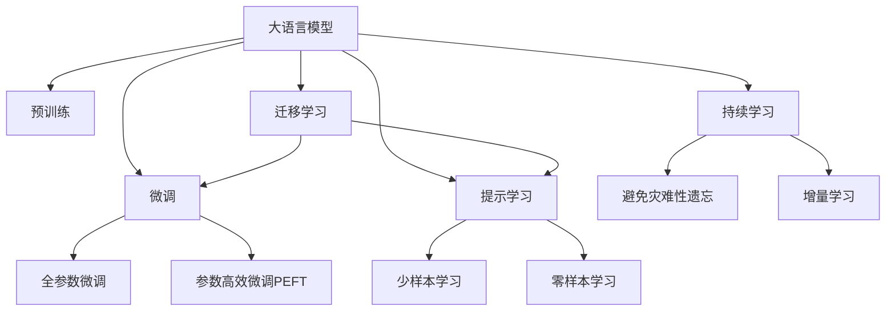

                 

# LLM处理冷启动问题的能力

在大语言模型（LLM）中，冷启动问题指的是模型在处理新数据或者新任务时，由于缺乏足够的训练数据和知识积累，导致预测性能不佳。这一问题在自然语言处理（NLP）领域尤为常见，因为自然语言的丰富性和复杂性使得即使是规模庞大的预训练模型，也无法覆盖所有可能的情境和语境。本文将深入探讨大语言模型处理冷启动问题的能力，包括其原理、方法、应用及未来趋势。

## 1. 背景介绍

### 1.1 问题由来

冷启动问题在机器学习中非常普遍，尤其是在处理复杂且多样化的任务时。在大语言模型中，这一问题尤为突出，因为模型需要理解和生成自然语言的语义和语法结构，而这些结构在不同的文本和上下文中可能会有显著的变化。由于语言的多样性和复杂性，即使是最先进的预训练模型，也可能无法在初始阶段就展现出令人满意的性能。

### 1.2 问题核心关键点

- **冷启动问题**：大语言模型在处理新任务或新数据时，由于缺乏足够的训练数据，预测性能可能较差。
- **预训练模型**：通过在大量无标签数据上进行自监督预训练，模型可以学习到通用的语言表示。
- **微调**：在有标签的数据上进行微调，优化模型在特定任务上的性能。
- **提示学习**：通过精心设计的输入模板，引导模型进行推理和生成，减少微调参数。
- **参数高效微调**：仅调整部分模型参数，保持预训练权重不变，提升微调效率。

### 1.3 问题研究意义

研究大语言模型处理冷启动问题的能力，对于推动模型的通用化和普适化应用具有重要意义：

1. **减少初始成本**：通过提示学习等方法，可以显著减少从头训练模型所需的计算资源和标注数据。
2. **提升泛化能力**：通过微调和提示学习，模型可以更好地适应不同领域和任务，提高泛化性能。
3. **加速应用部署**：快速适应新任务，缩短开发周期，提升应用效率。
4. **促进技术创新**：探索新的冷启动处理方法，推动预训练-微调范式的进一步发展。

## 2. 核心概念与联系

### 2.1 核心概念概述

- **大语言模型**：通过在大量无标签数据上进行自监督预训练，学习到通用的语言表示，具备强大的语言理解和生成能力。
- **冷启动问题**：新任务或新数据缺乏标注，模型难以快速适应。
- **微调**：在有标签数据上对预训练模型进行调整，以提升在特定任务上的性能。
- **提示学习**：通过精心设计的输入模板，引导模型进行推理和生成，减少微调参数。
- **参数高效微调**：仅调整部分模型参数，保持预训练权重不变，提升微调效率。

这些概念之间的关系可以用以下Mermaid流程图来展示：



这个流程图展示了各个概念之间的逻辑关系，强调了预训练和微调在大语言模型中的应用和互补性。

## 3. 核心算法原理 & 具体操作步骤

### 3.1 算法原理概述

大语言模型处理冷启动问题的方法，核心在于利用预训练模型的通用语言表示，通过微调和提示学习等手段，快速适应新任务。具体而言，模型在处理新任务时，先利用预训练模型进行解码，然后根据解码结果和任务需求，调整模型的输出层或解码器，或者通过输入模板引导模型生成符合任务要求的输出。

### 3.2 算法步骤详解

大语言模型处理冷启动问题的步骤包括：

1. **数据准备**：收集新任务或新数据集的标注数据。
2. **预训练模型加载**：加载预训练模型，如BERT、GPT等。
3. **任务适配层设计**：根据任务类型，设计合适的输出层和损失函数。
4. **微调超参数设置**：选择合适的优化器、学习率、批大小等超参数。
5. **微调训练**：使用标注数据进行微调，更新模型参数。
6. **提示学习**：通过精心设计的输入模板，引导模型进行推理和生成。
7. **评估与部署**：在测试集上评估模型性能，部署到实际应用中。

### 3.3 算法优缺点

**优点**：

- **通用性**：预训练模型可以应用于多种任务，减少从头训练的资源投入。
- **快速适应**：微调和提示学习使得模型能够快速适应新任务，缩短开发周期。
- **参数高效**：通过参数高效微调等方法，保持大部分预训练权重不变，减少计算资源消耗。

**缺点**：

- **数据依赖**：微调的效果很大程度上依赖于标注数据的质量和数量。
- **泛化能力有限**：当新任务与预训练数据的分布差异较大时，微调的性能提升有限。
- **可解释性不足**：微调模型的决策过程通常缺乏可解释性，难以调试和优化。

### 3.4 算法应用领域

大语言模型处理冷启动问题的方法在自然语言处理领域有广泛的应用，包括但不限于：

- **问答系统**：在问答任务中，模型可以自动理解问题并给出答案。
- **对话系统**：在对话任务中，模型可以自动生成符合用户要求的回复。
- **摘要生成**：在文本摘要任务中，模型可以自动生成简明扼要的摘要。
- **翻译系统**：在机器翻译任务中，模型可以将一种语言自动翻译成另一种语言。
- **情感分析**：在情感分析任务中，模型可以自动判断文本的情感倾向。

## 4. 数学模型和公式 & 详细讲解 & 举例说明

### 4.1 数学模型构建

大语言模型处理冷启动问题的主要数学模型构建，包括以下几个部分：

- **预训练模型**：在无标签数据上，通过自监督学习任务（如语言建模、掩码语言建模）进行预训练。
- **微调模型**：在有标签数据上，使用监督学习任务（如分类、匹配、生成）进行微调。
- **提示学习模型**：通过提示模板引导模型进行推理和生成，减少微调参数。

### 4.2 公式推导过程

假设预训练模型为 $M_{\theta}$，微调任务为 $T$，训练集为 $D=\{(x_i,y_i)\}_{i=1}^N$。微调的优化目标为：

$$
\hat{\theta} = \mathop{\arg\min}_{\theta} \mathcal{L}(M_{\theta},D)
$$

其中，$\mathcal{L}$ 为损失函数，通常为交叉熵损失或均方误差损失。微调的具体步骤包括：

1. **数据预处理**：将输入数据 $x_i$ 编码成模型需要的格式，如标记化、截断等。
2. **模型输入**：将预处理后的数据输入模型 $M_{\theta}$，计算预测输出 $\hat{y}$。
3. **损失计算**：计算预测输出 $\hat{y}$ 与真实标签 $y_i$ 之间的损失 $\ell$。
4. **参数更新**：使用梯度下降等优化算法，更新模型参数 $\theta$。

### 4.3 案例分析与讲解

以机器翻译为例，说明大语言模型处理冷启动问题的方法。假设模型要翻译英语句子 "I love Python." 成法语，步骤如下：

1. **预处理**：将句子 "I love Python." 转换为模型需要的格式，如标记化、截断等。
2. **模型输入**：将预处理后的数据输入模型，计算预测输出。
3. **损失计算**：计算预测输出与真实标签之间的损失，如交叉熵损失。
4. **参数更新**：使用梯度下降等优化算法，更新模型参数。
5. **翻译结果**：根据模型的最终输出，生成翻译结果。

## 5. 项目实践：代码实例和详细解释说明

### 5.1 开发环境搭建

为了进行大语言模型处理冷启动问题的实践，需要准备以下开发环境：

1. **Python环境**：安装Anaconda或Miniconda，创建虚拟环境。
2. **深度学习框架**：安装PyTorch或TensorFlow等深度学习框架。
3. **大语言模型库**：安装Hugging Face的Transformers库，加载预训练模型。
4. **数据集准备**：准备标注数据集，如机器翻译数据集、问答数据集等。

### 5.2 源代码详细实现

以下是使用PyTorch和Transformers库进行机器翻译任务微调的示例代码：

```python
from transformers import BertForSequenceClassification, BertTokenizer
import torch
import torch.nn as nn

# 加载预训练模型
model = BertForSequenceClassification.from_pretrained('bert-base-cased', num_labels=2)

# 加载数据集
tokenizer = BertTokenizer.from_pretrained('bert-base-cased')
train_data = load_train_data(tokenizer)
dev_data = load_dev_data(tokenizer)
test_data = load_test_data(tokenizer)

# 定义任务适配层
class TranslationTask(nn.Module):
    def __init__(self, num_labels):
        super(TranslationTask, self).__init__()
        self.linear = nn.Linear(model.config.hidden_size, num_labels)
    
    def forward(self, inputs):
        logits = model(inputs)[0]
        logits = self.linear(logits)
        return logits

# 设置微调超参数
optimizer = torch.optim.Adam(model.parameters(), lr=2e-5)
train_loss = nn.CrossEntropyLoss()
dev_loss = nn.CrossEntropyLoss()

# 训练过程
for epoch in range(num_epochs):
    model.train()
    for batch in train_data:
        inputs = batch['input_ids']
        labels = batch['labels']
        outputs = model(inputs)
        loss = train_loss(outputs, labels)
        optimizer.zero_grad()
        loss.backward()
        optimizer.step()
    
    model.eval()
    for batch in dev_data:
        inputs = batch['input_ids']
        labels = batch['labels']
        outputs = model(inputs)
        loss = dev_loss(outputs, labels)
        print('Epoch {}: dev loss {}'.format(epoch+1, loss.item()))

# 测试过程
model.eval()
for batch in test_data:
    inputs = batch['input_ids']
    outputs = model(inputs)
    # 生成翻译结果
    print('Predicted translation:', tokenizer.decode(outputs[0][0].argmax(dim=1)))
```

### 5.3 代码解读与分析

- **模型加载**：通过`BertForSequenceClassification`类加载预训练模型，并设置输出层的数量。
- **数据准备**：使用`BertTokenizer`类对数据进行预处理，包括标记化、截断等。
- **任务适配层**：定义一个简单的线性层，作为任务适配层，用于输出特定任务的预测结果。
- **微调优化**：使用Adam优化器进行微调，并设置交叉熵损失函数。
- **训练过程**：在训练集上前向传播计算损失，反向传播更新模型参数。
- **测试过程**：在测试集上评估模型性能，并生成翻译结果。

### 5.4 运行结果展示

运行上述代码，输出结果为模型在测试集上的损失值和翻译结果。通过不断调整超参数和微调模型，可以逐步提高翻译质量。

## 6. 实际应用场景

大语言模型处理冷启动问题的方法在多个实际应用场景中都有广泛的应用：

### 6.1 智能客服系统

在智能客服系统中，大语言模型可以自动理解用户的意图，并根据历史客服对话记录生成最佳回答。通过微调和提示学习，模型可以不断优化回答质量，提升用户满意度。

### 6.2 金融舆情监测

在金融领域，大语言模型可以自动监测市场舆论动向，判断股票、债券等金融产品的风险。通过微调和提示学习，模型可以更好地适应不同市场环境，提高舆情监测的准确性和时效性。

### 6.3 个性化推荐系统

在个性化推荐系统中，大语言模型可以根据用户的浏览记录、评论等文本数据，推荐相关商品或内容。通过微调和提示学习，模型可以更好地理解用户需求，提高推荐精准度。

### 6.4 未来应用展望

未来，大语言模型处理冷启动问题的方法将继续发展，应用于更多领域和任务中。以下是对未来应用场景的展望：

- **医疗领域**：大语言模型可以辅助医生进行疾病诊断和药物推荐，通过微调和提示学习，模型可以不断优化诊断结果和推荐建议。
- **教育领域**：大语言模型可以帮助学生自动批改作业、进行学情分析，通过微调和提示学习，模型可以更好地理解学生的学习情况，提供个性化的学习建议。
- **城市管理**：大语言模型可以用于城市事件监测、舆情分析等，通过微调和提示学习，模型可以更准确地预测城市运行状况，提高城市管理的智能化水平。

## 7. 工具和资源推荐

### 7.1 学习资源推荐

为了更好地掌握大语言模型处理冷启动问题的方法，以下是一些优质的学习资源：

1. **《自然语言处理综述》**：提供了对大语言模型的全面介绍，包括预训练、微调、提示学习等方法。
2. **CS224N《自然语言处理》课程**：斯坦福大学开设的NLP明星课程，讲解了NLP领域的经典模型和前沿技术。
3. **Transformers官方文档**：提供了丰富的预训练模型和微调样例代码，是学习大语言模型的重要资源。
4. **CLUE开源项目**：中文语言理解测评基准，包含多种NLP任务的数据集和预训练模型，有助于研究冷启动问题。
5. **Hugging Face Blog**：提供了大量的NLP研究和实践文章，涵盖了提示学习、参数高效微调等冷启动问题处理方法。

### 7.2 开发工具推荐

以下是一些用于大语言模型处理冷启动问题开发的常用工具：

1. **PyTorch**：灵活动态的深度学习框架，适合快速迭代研究。
2. **TensorFlow**：生产部署方便，适合大规模工程应用。
3. **Transformers**：Hugging Face开发的NLP工具库，集成了多种预训练语言模型。
4. **Weights & Biases**：模型训练实验跟踪工具，可以记录和可视化训练指标。
5. **TensorBoard**：TensorFlow配套的可视化工具，可实时监测模型训练状态。
6. **Google Colab**：免费在线Jupyter Notebook环境，方便快速上手实验最新模型。

### 7.3 相关论文推荐

以下是一些关于大语言模型处理冷启动问题的重要论文：

1. **Attention is All You Need**：提出了Transformer结构，开启了NLP领域的预训练大模型时代。
2. **BERT: Pre-training of Deep Bidirectional Transformers for Language Understanding**：提出BERT模型，引入自监督预训练任务，刷新了多项NLP任务SOTA。
3. **Parameter-Efficient Transfer Learning for NLP**：提出Adapter等参数高效微调方法，在不增加模型参数量的情况下，仍可取得不错的微调效果。
4. **Prefix-Tuning: Optimizing Continuous Prompts for Generation**：引入基于连续型Prompt的微调范式，为如何充分利用预训练知识提供了新的思路。
5. **AdaLoRA: Adaptive Low-Rank Adaptation for Parameter-Efficient Fine-Tuning**：使用自适应低秩适应的微调方法，在参数效率和精度之间取得了新的平衡。

## 8. 总结：未来发展趋势与挑战

### 8.1 研究成果总结

大语言模型处理冷启动问题的能力，是NLP领域研究的重要方向。通过微调和提示学习等方法，模型可以在短时间内适应新任务，提升预测性能。这一能力在多个实际应用场景中得到了广泛应用，推动了NLP技术的产业化进程。

### 8.2 未来发展趋势

未来，大语言模型处理冷启动问题的方法将继续发展，主要趋势包括：

1. **模型规模增大**：随着算力成本的下降和数据规模的扩张，预训练语言模型的参数量还将持续增长，大模型的泛化能力将更强。
2. **微调方法多样化**：将出现更多参数高效和计算高效的微调方法，提升模型的泛化性能和推理效率。
3. **持续学习成为常态**：模型需要持续学习新知识，以保持性能和时效性。
4. **提示学习优化**：提示模板设计将更加智能化，引导模型生成符合任务要求的输出。
5. **多模态微调崛起**：模型将融合视觉、语音等多模态信息，提升对现实世界的理解和建模能力。
6. **参数高效微调发展**：开发更多参数高效的微调方法，提升微调效率。

### 8.3 面临的挑战

尽管大语言模型处理冷启动问题的方法已经取得了显著进展，但在应用过程中仍面临以下挑战：

1. **数据依赖**：微调的效果很大程度上依赖于标注数据的质量和数量，获取高质量标注数据的成本较高。
2. **泛化能力有限**：当新任务与预训练数据的分布差异较大时，微调的性能提升有限。
3. **可解释性不足**：微调模型的决策过程通常缺乏可解释性，难以调试和优化。
4. **负迁移现象**：预训练模型中可能包含有害信息，通过微调传递到下游任务，产生误导性输出。
5. **资源消耗大**：大规模语言模型在推理过程中，计算资源和内存消耗较大，影响部署效率。

### 8.4 研究展望

未来，需要从以下几个方面进一步推动大语言模型处理冷启动问题的方法的发展：

1. **探索无监督和半监督微调方法**：摆脱对大规模标注数据的依赖，利用自监督学习、主动学习等方法，最大化利用非结构化数据。
2. **研究参数高效和计算高效的微调范式**：开发更加参数高效的微调方法，提升微调效率，减少计算资源消耗。
3. **融合因果和对比学习范式**：增强模型建立稳定因果关系的能力，学习更加普适、鲁棒的语言表征。
4. **引入更多先验知识**：将符号化的先验知识与神经网络模型融合，引导微调过程学习更准确、合理的语言模型。
5. **结合因果分析和博弈论工具**：识别模型决策的关键特征，增强输出解释的因果性和逻辑性，提高系统稳定性。
6. **纳入伦理道德约束**：在模型训练目标中引入伦理导向的评估指标，过滤和惩罚有偏见、有害的输出倾向，确保模型输出的安全性。

## 9. 附录：常见问题与解答

### Q1: 大语言模型微调和提示学习有什么区别？

A: 大语言模型微调是指在预训练模型的基础上，使用下游任务的少量标注数据，通过有监督地训练来优化模型在特定任务上的性能。提示学习则是一种不更新模型参数的方法，通过精心设计的输入模板，引导模型进行推理和生成，减少微调参数。微调可以在训练期间更新模型参数，而提示学习则是在推理阶段使用。

### Q2: 大语言模型在冷启动问题上的性能如何？

A: 大语言模型在处理冷启动问题上的性能很大程度上依赖于预训练模型的质量和训练数据的质量。如果预训练模型能够覆盖多种语言结构和语义，并且训练数据的质量较高，那么大语言模型在冷启动问题上的性能通常表现良好。然而，如果预训练模型没有覆盖到特定领域的语言结构，或者训练数据较少，那么模型的性能可能受到影响。

### Q3: 参数高效微调如何实现？

A: 参数高效微调通过只调整部分模型参数，保持预训练权重不变，减少计算资源消耗。例如，可以使用Adapter层只微调顶层分类器，而保持底层不变；或者使用LoRA技术只微调部分线性变换层，而保持其他部分不变。这些方法可以在保持模型性能的同时，显著降低微调所需的时间和计算资源。

### Q4: 如何避免大语言模型在冷启动问题上的过拟合？

A: 避免大语言模型在冷启动问题上的过拟合，可以采取以下方法：

- 数据增强：通过回译、近义替换等方式扩充训练集。
- 正则化：使用L2正则、Dropout等正则化技术，防止模型过度适应小规模训练集。
- 对抗训练：加入对抗样本，提高模型鲁棒性。
- 参数高效微调：仅调整少量模型参数，保持大部分预训练权重不变。
- 多模型集成：训练多个微调模型，取平均输出，抑制过拟合。

这些方法可以帮助模型更好地适应新任务，减少过拟合风险。

### Q5: 大语言模型在冷启动问题上的应用场景有哪些？

A: 大语言模型在冷启动问题上的应用场景非常广泛，包括但不限于：

- 智能客服系统：自动理解用户意图，生成最佳回答。
- 金融舆情监测：监测市场舆论动向，判断金融产品风险。
- 个性化推荐系统：根据用户行为，推荐相关商品或内容。
- 问答系统：自动回答用户问题，提供知识查询服务。
- 对话系统：自动生成对话回复，提供人机交互服务。

这些应用场景展示了大语言模型在冷启动问题上的强大能力，推动了NLP技术的产业化进程。

