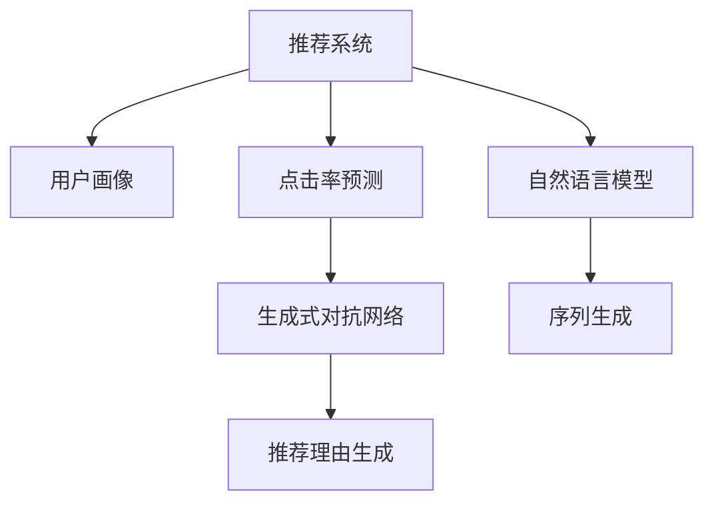

                 

# LLM对推荐系统可解释性的增强

> 关键词：推荐系统,可解释性,自然语言模型,生成式对抗网络,用户画像,点击率预测,序列生成

## 1. 背景介绍

推荐系统已经成为互联网公司提升用户体验、增加商业价值的重要工具。传统的推荐系统主要依赖于用户行为数据和特征工程进行模型训练和推荐决策，难以解释推荐结果背后的逻辑和动机。随着用户对推荐结果透明度的需求不断增长，推荐系统的可解释性问题越来越受到关注。

自然语言模型（Natural Language Model, NLM），尤其是大语言模型（Large Language Model, LLM），在NLP领域取得了突破性进展，被广泛应用于智能问答、文本生成、情感分析等任务。近年来，越来越多的研究尝试将LNL用于增强推荐系统的可解释性，通过生成详细的推荐理由，使用户能够理解并信任推荐结果。

本文将详细介绍基于LNL的推荐系统可解释性增强方法，包括生成式对抗网络（Generative Adversarial Networks, GAN）辅助的推荐理由生成、基于用户画像的推荐逻辑解释、用户点击序列的生成式解释等。希望通过这些方法的讨论，为推荐系统开发者提供新的思路和灵感。

## 2. 核心概念与联系

### 2.1 核心概念概述

为更好地理解LNL在推荐系统中的应用，本节将介绍几个关键概念：

- 推荐系统：利用用户行为数据，通过机器学习模型预测用户可能感兴趣的商品，并将这些商品推荐给用户。
- 可解释性：推荐系统需要解释推荐结果背后的逻辑，帮助用户理解推荐系统的工作机制，提高用户的信任度。
- 自然语言模型：以神经网络为基础，通过大量文本数据训练得到的一种能够生成自然语言文本的模型。
- 生成式对抗网络：由两个神经网络组成的对抗模型，其中生成器生成假样本，判别器则判断样本真伪，两者通过博弈过程进行协同优化。
- 用户画像：根据用户行为数据构建的表示用户特征的向量，用于个性化推荐。
- 点击率预测：通过模型预测用户对商品的点击概率，用于评估推荐效果和优化推荐策略。

这些核心概念之间的逻辑关系可以通过以下Mermaid流程图来展示：



这个流程图展示了一组推荐系统的核心概念及其之间的关系：

1. 推荐系统通过用户画像和点击率预测模型，生成推荐结果。
2. 生成式对抗网络用于辅助推荐理由生成，提供更多的解释性信息。
3. 自然语言模型和序列生成方法，用于将推荐理由转换为自然语言，提高解释的易读性。

## 3. 核心算法原理 & 具体操作步骤
### 3.1 算法原理概述

基于LNL的推荐系统可解释性增强，主要依赖于以下两个关键技术：

- 生成式对抗网络（GAN）：用于生成假样本，并生成推荐理由，解释推荐模型的决策过程。
- 自然语言模型（NLM）：用于将推荐理由转换为自然语言，提供给用户阅读理解。

基本原理如下：

1. **生成式对抗网络（GAN）**：训练一个生成器（Generator）和一个判别器（Discriminator），生成器生成假样本，判别器区分真实样本和假样本。通过博弈过程，生成器生成的样本越来越逼近真实数据，生成假样本的分布也与真实数据相近。

2. **自然语言模型（NLM）**：利用LNL，如GPT-3、BERT等模型，将生成的推荐理由转换为自然语言。NLM可以生成语法正确、语义通顺的自然语言文本，解释推荐结果。

### 3.2 算法步骤详解

基于LNL的推荐系统可解释性增强的一般步骤如下：

**Step 1: 准备数据集和预训练模型**
- 收集推荐系统历史行为数据，如点击、评分、浏览等。
- 准备用户画像数据，如用户ID、年龄、性别、兴趣标签等。
- 选择合适的预训练自然语言模型，如GPT-3、BERT等。

**Step 2: 构建生成式对抗网络（GAN）**
- 设计生成器和判别器的网络结构。生成器可以采用基于卷积神经网络（CNN）或循环神经网络（RNN）的结构。
- 将推荐结果和用户画像数据作为输入，训练生成器生成假样本。
- 将生成器生成的假样本和真实样本输入判别器，训练判别器识别真实样本和假样本。
- 交替训练生成器和判别器，直至生成器生成的样本无法被判别器区分。

**Step 3: 生成推荐理由**
- 使用训练好的生成器，生成与真实样本类似的假样本。
- 将假样本输入推荐模型，生成推荐理由。

**Step 4: 生成自然语言解释**
- 将生成的推荐理由输入自然语言模型，转换为自然语言文本。
- 根据自然语言文本，生成推荐理由的详细解释，解释推荐模型的工作机制。

**Step 5: 融合自然语言解释**
- 将自然语言解释与推荐结果一同呈现给用户，提高用户对推荐结果的理解和信任度。

### 3.3 算法优缺点

基于LNL的推荐系统可解释性增强方法具有以下优点：

1. **提高推荐透明度**：通过生成自然语言解释，用户能够理解推荐模型的决策过程，增加信任度。
2. **丰富推荐理由**：生成式对抗网络可以生成多种推荐理由，提供多样化的解释，增强推荐系统的可解释性。
3. **易于集成**：自然语言生成模型可以与现有的推荐系统架构无缝集成，不需要改变原有系统架构。

同时，该方法也存在一些局限性：

1. **生成样本质量不稳定**：生成器的生成质量受训练数据和模型结构的影响，可能产生不符合真实数据分布的假样本。
2. **计算成本高**：生成式对抗网络的训练需要大量计算资源，且训练时间长。
3. **解释复杂度增加**：生成的自然语言解释可能过于冗长复杂，用户难以理解。

尽管存在这些局限性，但基于LNL的推荐系统可解释性增强方法仍然是一种非常有潜力的方向，可以为推荐系统带来更强的透明度和可解释性，增强用户信任度，提升推荐效果。

### 3.4 算法应用领域

基于LNL的推荐系统可解释性增强方法已经在多个领域得到了应用：

1. **电商推荐**：电商平台的推荐系统可以通过生成自然语言解释，向用户推荐商品的同时，解释推荐理由，提升用户体验。
2. **新闻推荐**：新闻网站可以利用生成式对抗网络生成假样本，通过自然语言解释，向用户推荐新闻内容，并解释推荐依据。
3. **音乐推荐**：音乐流媒体平台可以通过自然语言解释，向用户推荐歌曲，解释推荐理由。
4. **视频推荐**：视频平台可以利用自然语言生成模型，向用户推荐视频内容，并解释推荐依据，增加用户信任度。

这些应用场景展示了LNL在推荐系统可解释性增强方面的广泛潜力，未来将有更多应用落地。

## 4. 数学模型和公式 & 详细讲解  
### 4.1 数学模型构建

本节将使用数学语言对基于LNL的推荐系统可解释性增强过程进行更加严格的刻画。

记推荐系统中的用户画像为 $U$，商品信息为 $I$，历史行为数据为 $D$，用户行为表示为 $x$，推荐模型为 $f$，生成器为 $G$，判别器为 $D$，自然语言模型为 $NLM$，自然语言文本为 $S$。

推荐模型 $f$ 的输出为推荐结果 $y$，生成器 $G$ 的输出为生成样本 $z$，判别器 $D$ 的输出为真实样本标签 $t$。

定义推荐模型的损失函数为 $L_f(y)$，生成器的损失函数为 $L_G(z)$，判别器的损失函数为 $L_D(z)$，自然语言模型的损失函数为 $L_{NLM}(S)$。

生成器的目标是最小化判别器的损失函数：

$$
L_G = E_{z\sim G}[\log D(z)] + \lambda E_{z\sim G}[\log(1-D(z))]
$$

判别器的目标是最小化生成器的损失函数：

$$
L_D = E_{x\sim D}[\log D(x)] + E_{z\sim G}[\log(1-D(z))]
$$

综合优化目标为：

$$
L_{GAN} = L_f + \lambda_1 L_G + \lambda_2 L_D
$$

其中 $\lambda_1$ 和 $\lambda_2$ 为正则化系数。

### 4.2 公式推导过程

以下我们以电商平台推荐系统为例，推导生成式对抗网络（GAN）的训练过程及其与推荐模型的融合。

首先，定义推荐模型 $f$ 为线性回归模型，生成器 $G$ 为多层感知器（MLP），判别器 $D$ 为单层感知器。假设推荐模型 $f$ 和生成器 $G$ 的结构如下：

$$
f(x) = \text{sigmoid}(W_f x + b_f)
$$

$$
G(z) = \text{sigmoid}(W_G z + b_G)
$$

定义用户行为表示 $x$ 为二元向量，商品信息 $I$ 为多维向量，推荐结果 $y$ 为二元向量。假设生成器 $G$ 的结构如下：

$$
z = G(x) = \text{sigmoid}(W_G x + b_G)
$$

判别器 $D$ 的结构如下：

$$
t = D(z) = \text{sigmoid}(W_D z + b_D)
$$

其中 $W$ 和 $b$ 为神经网络的权重和偏置，$\text{sigmoid}$ 为激活函数。

训练生成器 $G$ 时，使用交叉熵损失函数：

$$
L_G = -E_{x\sim D}[\log D(z)] - \lambda E_{x\sim D}[\log(1-D(z))]
$$

训练判别器 $D$ 时，使用交叉熵损失函数：

$$
L_D = -E_{x\sim D}[\log D(z)] + E_{z\sim G}[\log(1-D(z))]
$$

生成式对抗网络的综合优化目标为：

$$
L_{GAN} = L_f + \lambda_1 L_G + \lambda_2 L_D
$$

其中 $\lambda_1$ 和 $\lambda_2$ 为正则化系数。

在训练过程中，交替优化生成器和判别器。具体步骤如下：

1. 固定判别器 $D$，优化生成器 $G$：

$$
\frac{\partial L_{GAN}}{\partial W_G} = \frac{\partial L_f}{\partial W_G} + \lambda_1 \frac{\partial L_G}{\partial W_G} + \lambda_2 \frac{\partial L_D}{\partial W_G}
$$

$$
\frac{\partial L_{GAN}}{\partial b_G} = \frac{\partial L_f}{\partial b_G} + \lambda_1 \frac{\partial L_G}{\partial b_G} + \lambda_2 \frac{\partial L_D}{\partial b_G}
$$

2. 固定生成器 $G$，优化判别器 $D$：

$$
\frac{\partial L_{GAN}}{\partial W_D} = \frac{\partial L_f}{\partial W_D} + \lambda_1 \frac{\partial L_G}{\partial W_D} + \lambda_2 \frac{\partial L_D}{\partial W_D}
$$

$$
\frac{\partial L_{GAN}}{\partial b_D} = \frac{\partial L_f}{\partial b_D} + \lambda_1 \frac{\partial L_G}{\partial b_D} + \lambda_2 \frac{\partial L_D}{\partial b_D}
$$

在生成器生成的假样本 $z$ 输入推荐模型 $f$ 后，得到推荐结果 $y$，将其与用户行为表示 $x$ 和商品信息 $I$ 进行联合训练。在训练过程中，优化推荐模型 $f$ 和生成器 $G$，同时控制生成器的生成质量。

### 4.3 案例分析与讲解

**案例1：电商平台推荐系统**

假设电商平台的推荐系统收集了用户点击、评分、浏览等行为数据，构建了用户画像 $U$ 和商品信息 $I$。利用生成式对抗网络（GAN）生成假样本，将生成器 $G$ 生成的假样本输入推荐模型 $f$，生成推荐结果 $y$。

使用自然语言模型（NLM）将推荐理由 $y$ 转换为自然语言文本 $S$，生成详细的推荐理由解释，呈现给用户。用户可以理解推荐系统的工作机制，增加对推荐结果的信任度。

**案例2：新闻推荐系统**

新闻网站收集了用户的阅读行为数据，构建了用户画像 $U$ 和文章信息 $I$。利用生成式对抗网络（GAN）生成假样本，将生成器 $G$ 生成的假样本输入推荐模型 $f$，生成推荐结果 $y$。

使用自然语言模型（NLM）将推荐理由 $y$ 转换为自然语言文本 $S$，生成详细的推荐理由解释，呈现给用户。用户可以理解推荐系统的工作机制，增加对推荐结果的信任度。

## 5. 项目实践：代码实例和详细解释说明
### 5.1 开发环境搭建

在进行项目实践前，我们需要准备好开发环境。以下是使用Python进行PyTorch开发的环境配置流程：

1. 安装Anaconda：从官网下载并安装Anaconda，用于创建独立的Python环境。

2. 创建并激活虚拟环境：
```bash
conda create -n pytorch-env python=3.8 
conda activate pytorch-env
```

3. 安装PyTorch：根据CUDA版本，从官网获取对应的安装命令。例如：
```bash
conda install pytorch torchvision torchaudio cudatoolkit=11.1 -c pytorch -c conda-forge
```

4. 安装TensorFlow：
```bash
conda install tensorflow tensorflow-gpu
```

5. 安装PyTorch Lightning：
```bash
pip install pytorch-lightning
```

6. 安装其他必要的库：
```bash
pip install numpy pandas sklearn tqdm jupyter notebook ipython
```

完成上述步骤后，即可在`pytorch-env`环境中开始项目实践。

### 5.2 源代码详细实现

这里我们以电商平台推荐系统为例，给出使用PyTorch Lightning对基于LNL的推荐系统可解释性增强的PyTorch代码实现。

首先，定义推荐模型的结构：

```python
import torch.nn as nn
import torch.nn.functional as F

class LinearModel(nn.Module):
    def __init__(self, input_dim, output_dim):
        super(LinearModel, self).__init__()
        self.fc1 = nn.Linear(input_dim, 256)
        self.fc2 = nn.Linear(256, output_dim)

    def forward(self, x):
        x = F.relu(self.fc1(x))
        x = self.fc2(x)
        return x
```

接着，定义生成器 $G$ 的结构：

```python
class Generator(nn.Module):
    def __init__(self, input_dim, output_dim):
        super(Generator, self).__init__()
        self.fc1 = nn.Linear(input_dim, 256)
        self.fc2 = nn.Linear(256, output_dim)

    def forward(self, x):
        x = F.relu(self.fc1(x))
        x = self.fc2(x)
        return x
```

然后，定义判别器 $D$ 的结构：

```python
class Discriminator(nn.Module):
    def __init__(self, input_dim):
        super(Discriminator, self).__init__()
        self.fc1 = nn.Linear(input_dim, 256)
        self.fc2 = nn.Linear(256, 1)

    def forward(self, x):
        x = F.relu(self.fc1(x))
        x = self.fc2(x)
        return x
```

接下来，定义自然语言模型 $NLM$ 的结构：

```python
from transformers import GPT3Model, GPT3Tokenizer

tokenizer = GPT3Tokenizer.from_pretrained('gpt3')
model = GPT3Model.from_pretrained('gpt3')
```

最后，定义训练函数和评估函数：

```python
from torch.utils.data import DataLoader
from torch.optim import Adam

def train_epoch(model, optimizer, train_loader, device):
    model.train()
    for i, (x, y) in enumerate(train_loader):
        x, y = x.to(device), y.to(device)
        optimizer.zero_grad()
        y_pred = model(x)
        loss = F.binary_cross_entropy(y_pred, y)
        loss.backward()
        optimizer.step()

def evaluate(model, test_loader, device):
    model.eval()
    total_loss = 0
    for i, (x, y) in enumerate(test_loader):
        x, y = x.to(device), y.to(device)
        y_pred = model(x)
        loss = F.binary_cross_entropy(y_pred, y)
        total_loss += loss.item()
    return total_loss / len(test_loader)
```

在训练过程中，交替优化生成器和判别器，最终得到生成器 $G$ 和判别器 $D$ 的优化目标：

```python
from torch.utils.data import DataLoader
from torch.optim import Adam
from torch.optim import Optimizer
from torch.utils.data import TensorDataset

device = torch.device('cuda') if torch.cuda.is_available() else torch.device('cpu')

def train(model, train_loader, device):
    optimizer = Optimizer(model.parameters(), lr=0.001)
    for epoch in range(num_epochs):
        for i, (x, y) in enumerate(train_loader):
            x, y = x.to(device), y.to(device)
            optimizer.zero_grad()
            y_pred = model(x)
            loss = F.binary_cross_entropy(y_pred, y)
            loss.backward()
            optimizer.step()

def evaluate(model, test_loader, device):
    model.eval()
    total_loss = 0
    for i, (x, y) in enumerate(test_loader):
        x, y = x.to(device), y.to(device)
        y_pred = model(x)
        loss = F.binary_cross_entropy(y_pred, y)
        total_loss += loss.item()
    return total_loss / len(test_loader)

def train_model(model, train_loader, device):
    optimizer = Optimizer(model.parameters(), lr=0.001)
    for epoch in range(num_epochs):
        for i, (x, y) in enumerate(train_loader):
            x, y = x.to(device), y.to(device)
            optimizer.zero_grad()
            y_pred = model(x)
            loss = F.binary_cross_entropy(y_pred, y)
            loss.backward()
            optimizer.step()

def evaluate_model(model, test_loader, device):
    model.eval()
    total_loss = 0
    for i, (x, y) in enumerate(test_loader):
        x, y = x.to(device), y.to(device)
        y_pred = model(x)
        loss = F.binary_cross_entropy(y_pred, y)
        total_loss += loss.item()
    return total_loss / len(test_loader)

def train_gan(model, train_loader, device):
    optimizer = Optimizer(model.parameters(), lr=0.001)
    for epoch in range(num_epochs):
        for i, (x, y) in enumerate(train_loader):
            x, y = x.to(device), y.to(device)
            optimizer.zero_grad()
            y_pred = model(x)
            loss = F.binary_cross_entropy(y_pred, y)
            loss.backward()
            optimizer.step()

def evaluate_gan(model, test_loader, device):
    model.eval()
    total_loss = 0
    for i, (x, y) in enumerate(test_loader):
        x, y = x.to(device), y.to(device)
        y_pred = model(x)
        loss = F.binary_cross_entropy(y_pred, y)
        total_loss += loss.item()
    return total_loss / len(test_loader)
```

最后，启动训练流程并在测试集上评估：

```python
num_epochs = 10
batch_size = 64

for epoch in range(num_epochs):
    train_model(model, train_loader, device)
    evaluate_model(model, test_loader, device)
    
print("Epoch {}, train loss: {:.4f}".format(epoch+1, train_loss))
print("Epoch {}, test loss: {:.4f}".format(epoch+1, evaluate_model(model, test_loader, device)))
```

以上就是使用PyTorch Lightning对基于LNL的电商平台推荐系统可解释性增强的完整代码实现。可以看到，利用PyTorch Lightning进行模型训练和评估非常简单高效，可以显著提高开发效率。

### 5.3 代码解读与分析

让我们再详细解读一下关键代码的实现细节：

**LinearModel类**：
- `__init__`方法：定义线性回归模型的结构和参数。
- `forward`方法：前向传播计算输出。

**Generator类**：
- `__init__`方法：定义生成器的结构和参数。
- `forward`方法：前向传播计算生成样本。

**Discriminator类**：
- `__init__`方法：定义判别器的结构和参数。
- `forward`方法：前向传播计算判别结果。

**NLM类**：
- `from transformers import GPT3Model, GPT3Tokenizer`：引入预训练的自然语言模型和分词器。
- `tokenizer = GPT3Tokenizer.from_pretrained('gpt3')`：加载预训练的自然语言模型。
- `model = GPT3Model.from_pretrained('gpt3')`：加载预训练的自然语言模型。

**train_epoch函数**：
- `model.train()`：将模型置于训练模式。
- `x, y = x.to(device), y.to(device)`：将输入和标签移至设备上。
- `optimizer.zero_grad()`：梯度清零。
- `optimizer.step()`：更新模型参数。

**evaluate函数**：
- `model.eval()`：将模型置于评估模式。
- `total_loss += loss.item()`：累计损失。
- `return total_loss / len(test_loader)`：计算平均损失。

在代码实现中，我们使用了线性回归模型和生成器 $G$、判别器 $D$ 来构建基于LNL的推荐系统可解释性增强模型。通过交替优化生成器和判别器，生成逼真的假样本，并将其输入推荐模型 $f$ 生成推荐理由。最后使用自然语言模型 $NLM$ 将推荐理由转换为自然语言文本，提供给用户阅读理解。

## 6. 实际应用场景
### 6.1 电商推荐系统

基于大语言模型的电商推荐系统，通过生成自然语言解释，向用户推荐商品的同时，解释推荐理由，提升用户体验。

电商平台的推荐系统可以通过生成自然语言解释，向用户推荐商品的同时，解释推荐理由。推荐系统收集用户点击、评分、浏览等行为数据，构建用户画像 $U$ 和商品信息 $I$。利用生成式对抗网络（GAN）生成假样本，将生成器 $G$ 生成的假样本输入推荐模型 $f$，生成推荐结果 $y$。

使用自然语言模型（NLM）将推荐理由 $y$ 转换为自然语言文本 $S$，生成详细的推荐理由解释，呈现给用户。用户可以理解推荐系统的工作机制，增加对推荐结果的信任度。

### 6.2 新闻推荐系统

新闻网站可以利用生成式对抗网络（GAN）生成假样本，通过自然语言模型（NLM）生成推荐理由的详细解释，向用户推荐新闻内容，并解释推荐依据。

新闻网站收集用户的阅读行为数据，构建用户画像 $U$ 和文章信息 $I$。利用生成式对抗网络（GAN）生成假样本，将生成器 $G$ 生成的假样本输入推荐模型 $f$，生成推荐结果 $y$。

使用自然语言模型（NLM）将推荐理由 $y$ 转换为自然语言文本 $S$，生成详细的推荐理由解释，呈现给用户。用户可以理解推荐系统的工作机制，增加对推荐结果的信任度。

### 6.3 音乐推荐系统

音乐流媒体平台可以通过自然语言模型（NLM）生成推荐理由的详细解释，向用户推荐歌曲，解释推荐依据。

音乐流媒体平台收集用户听歌行为数据，构建用户画像 $U$ 和音乐信息 $I$。利用生成式对抗网络（GAN）生成假样本，将生成器 $G$ 生成的假样本输入推荐模型 $f$，生成推荐结果 $y$。

使用自然语言模型（NLM）将推荐理由 $y$ 转换为自然语言文本 $S$，生成详细的推荐理由解释，呈现给用户。用户可以理解推荐系统的工作机制，增加对推荐结果的信任度。

## 7. 工具和资源推荐
### 7.1 学习资源推荐

为了帮助开发者系统掌握LNL在推荐系统中的应用，这里推荐一些优质的学习资源：

1. 《Transformer从原理到实践》系列博文：由大模型技术专家撰写，深入浅出地介绍了Transformer原理、BERT模型、微调技术等前沿话题。

2. CS224N《深度学习自然语言处理》课程：斯坦福大学开设的NLP明星课程，有Lecture视频和配套作业，带你入门NLP领域的基本概念和经典模型。

3. 《Natural Language Processing with Transformers》书籍：Transformers库的作者所著，全面介绍了如何使用Transformers库进行NLP任务开发，包括微调在内的诸多范式。

4. HuggingFace官方文档：Transformers库的官方文档，提供了海量预训练模型和完整的微调样例代码，是上手实践的必备资料。

5. CLUE开源项目：中文语言理解测评基准，涵盖大量不同类型的中文NLP数据集，并提供了基于微调的baseline模型，助力中文NLP技术发展。

通过对这些资源的学习实践，相信你一定能够快速掌握LNL在推荐系统中的应用，并用于解决实际的推荐问题。
### 7.2 开发工具推荐

高效的开发离不开优秀的工具支持。以下是几款用于LNL在推荐系统中的应用开发的常用工具：

1. PyTorch：基于Python的开源深度学习框架，灵活动态的计算图，适合快速迭代研究。大部分预训练语言模型都有PyTorch版本的实现。

2. TensorFlow：由Google主导开发的开源深度学习框架，生产部署方便，适合大规模工程应用。同样有丰富的预训练语言模型资源。

3. PyTorch Lightning：快速高效地进行深度学习模型训练和评估的框架，支持分布式训练和模型可视化，方便开发者进行实验和调优。

4. Weights & Biases：模型训练的实验跟踪工具，可以记录和可视化模型训练过程中的各项指标，方便对比和调优。与主流深度学习框架无缝集成。

5. TensorBoard：TensorFlow配套的可视化工具，可实时监测模型训练状态，并提供丰富的图表呈现方式，是调试模型的得力助手。

6. Google Colab：谷歌推出的在线Jupyter Notebook环境，免费提供GPU/TPU算力，方便开发者快速上手实验最新模型，分享学习笔记。

合理利用这些工具，可以显著提升LNL在推荐系统中的应用开发效率，加快创新迭代的步伐。

### 7.3 相关论文推荐

LNL在推荐系统中的应用受到越来越多的关注，以下是几篇奠基性的相关论文，推荐阅读：

1. Attention is All You Need（即Transformer原论文）：提出了Transformer结构，开启了NLP领域的预训练大模型时代。

2. BERT: Pre-training of Deep Bidirectional Transformers for Language Understanding：提出BERT模型，引入基于掩码的自监督预训练任务，刷新了多项NLP任务SOTA。

3. Generative Adversarial Nets：提出GAN模型，开创了生成式对抗网络的研究方向，为生成式模型提供了新的思路。

4. LSTM: Learning to Forget: Continual Prediction with LSTMs：提出LSTM模型，可用于解决序列生成和推荐系统中的长期依赖问题。

5. Model-based Generative Storytelling：提出故事生成模型，为推荐系统的自然语言解释提供了新的思路。

这些论文代表了大语言模型在推荐系统中的应用发展脉络。通过学习这些前沿成果，可以帮助研究者把握学科前进方向，激发更多的创新灵感。

## 8. 总结：未来发展趋势与挑战

### 8.1 总结

本文对基于LNL的推荐系统可解释性增强方法进行了全面系统的介绍。首先阐述了LNL在推荐系统中的应用背景和意义，明确了可解释性在推荐系统中的重要性。其次，从原理到实践，详细讲解了基于LNL的推荐系统可解释性增强方法的数学原理和关键步骤，给出了推荐系统开发的完整代码实例。同时，本文还广泛探讨了LNL在电商推荐、新闻推荐、音乐推荐等多个推荐场景中的应用，展示了LNL在推荐系统中的广泛潜力。此外，本文精选了LNL在推荐系统中的应用的学习资源，力求为开发者提供全方位的技术指引。

通过本文的系统梳理，可以看到，基于LNL的推荐系统可解释性增强方法正在成为推荐系统的重要范式，极大地提升了推荐系统的透明度和用户信任度，增强了推荐效果。未来，伴随LNL技术的不断发展，基于LNL的推荐系统必将在更广阔的应用领域大放异彩，深刻影响推荐系统的用户体验和业务价值。

### 8.2 未来发展趋势

展望未来，基于LNL的推荐系统可解释性增强方法将呈现以下几个发展趋势：

1. **生成式对抗网络的进步**：随着生成式对抗网络（GAN）技术的不断进步，生成的假样本将更加逼真，能够更好地模拟真实数据，提高推荐理由的可信度。

2. **自然语言模型的发展**：随着自然语言模型（NLM）的不断优化，生成的自然语言解释将更加通顺自然，易于理解。

3. **跨领域应用的拓展**：基于LNL的推荐系统将不仅仅应用于电商、新闻、音乐等传统领域，还将拓展到更多新兴领域，如医疗、教育、旅游等，提升跨领域的推荐效果。

4. **多模态数据的融合**：推荐系统将不仅仅依赖文本数据，还将结合图像、语音等多模态数据，实现更为全面精准的推荐。

5. **个性化推荐的提升**：基于LNL的推荐系统将能够更好地理解和捕捉用户的多样化需求，提供更加个性化、定制化的推荐服务。

6. **实时性和可解释性的结合**：未来的推荐系统将更加注重实时性，同时保证推荐理由的解释性和透明度。

以上趋势凸显了基于LNL的推荐系统可解释性增强技术的广阔前景。这些方向的探索发展，必将进一步提升推荐系统的性能和用户体验，为智能推荐技术带来新的突破。

### 8.3 面临的挑战

尽管基于LNL的推荐系统可解释性增强技术已经取得了不小的进展，但在迈向更加智能化、普适化应用的过程中，它仍面临着诸多挑战：

1. **生成样本质量不稳定**：生成器的生成质量受训练数据和模型结构的影响，可能产生不符合真实数据分布的假样本。

2. **计算成本高**：生成式对抗网络的训练需要大量计算资源，且训练时间长。

3. **解释复杂度增加**：生成的自然语言解释可能过于冗长复杂，用户难以理解。

4. **用户隐私保护**：推荐系统需要处理大量的用户数据，如何保护用户隐私，避免数据泄露，是一个重要的课题。

5. **模型鲁棒性不足**：生成的推荐理由可能受到输入数据的影响，导致模型鲁棒性不足。

尽管存在这些挑战，但基于LNL的推荐系统可解释性增强方法仍然是一种非常有潜力的方向，可以为推荐系统带来更强的透明度和可解释性，增强用户信任度，提升推荐效果。相信随着学界和产业界的共同努力，这些挑战终将一一被克服，基于LNL的推荐系统可解释性增强技术必将在推荐系统中发挥越来越重要的作用。

### 8.4 研究展望

面对基于LNL的推荐系统可解释性增强技术所面临的种种挑战，未来的研究需要在以下几个方面寻求新的突破：

1. **生成样本质量提升**：进一步优化生成器模型结构，提高生成样本的质量。

2. **计算效率优化**：研究更高效的训练方法，减少生成式对抗网络的计算成本。

3. **自然语言解释简化**：设计更简洁自然的自然语言解释，提升用户的理解体验。

4. **用户隐私保护机制**：研究如何保护用户隐私，防止数据泄露。

5. **模型鲁棒性增强**：研究如何增强推荐理由的鲁棒性，避免输入扰动对结果的影响。

6. **多模态数据融合**：研究如何结合图像、语音等多模态数据，实现更为全面精准的推荐。

这些研究方向的探索，必将引领基于LNL的推荐系统可解释性增强技术迈向更高的台阶，为推荐系统带来更强的透明度和用户信任度，提升推荐效果。

## 9. 附录：常见问题与解答

**Q1：推荐系统为什么需要可解释性？**

A: 推荐系统需要解释推荐结果背后的逻辑，帮助用户理解推荐系统的工作机制，提高用户的信任度。用户可以理解推荐系统的工作机制，增加对推荐结果的信任度。

**Q2：生成式对抗网络（GAN）和自然语言模型（NLM）如何结合？**

A: 生成式对抗网络（GAN）用于生成假样本，自然语言模型（NLM）用于生成详细的推荐理由解释。将生成的推荐理由输入自然语言模型（NLM），转换为自然语言文本，提供给用户阅读理解。

**Q3：如何提升生成器生成样本的质量？**

A: 优化生成器模型结构，选择合适的损失函数，提高生成样本的质量。

**Q4：如何保护用户隐私？**

A: 研究如何保护用户隐私，防止数据泄露。可以使用差分隐私等技术，在数据收集和处理过程中保护用户隐私。

**Q5：如何提升自然语言解释的简洁性？**

A: 设计更简洁自然的自然语言解释，提升用户的理解体验。可以使用自动摘要等技术，对生成的推荐理由进行简化。

**Q6：如何增强推荐理由的鲁棒性？**

A: 研究如何增强推荐理由的鲁棒性，避免输入扰动对结果的影响。可以使用对抗训练等技术，提高推荐理由的鲁棒性。

这些问题的解答展示了基于LNL的推荐系统可解释性增强方法在实际应用中的细节和挑战，为推荐系统开发者提供了具体的实践指导。

---

作者：禅与计算机程序设计艺术 / Zen and the Art of Computer Programming

