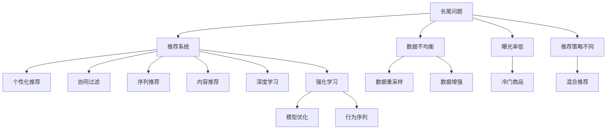

                 

# LLM对推荐系统长尾问题的改进策略

> 关键词：长尾问题,推荐系统,大语言模型,个性化推荐,协同过滤,序列推荐,内容推荐,深度学习,强化学习

## 1. 背景介绍

### 1.1 问题由来

推荐系统旨在通过用户的历史行为数据，为用户推荐感兴趣的内容。在实际应用中，推荐系统面临着诸多挑战，其中长尾问题（Long Tail Problem）尤为显著。长尾问题是指在推荐系统中，少数热门商品/内容吸引大量用户，而大部分冷门商品/内容难以获得足够的曝光和点击。这一现象使得传统的基于协同过滤、内容推荐等方法难以兼顾长尾数据，推荐结果可能不平衡、不全面，无法满足用户的需求。

### 1.2 问题核心关键点

长尾问题在推荐系统中尤为突出，其核心原因在于：

1. **数据不均衡**：用户行为数据分布不均，热门商品/内容远多于冷门商品/内容，导致模型训练偏向于热门数据。
2. **冷门商品曝光率低**：由于点击率和互动率低，冷门商品难以积累足够的数据，无法进行有效的推荐。
3. **热门与冷门商品推荐策略不同**：热门商品需更多地曝光和展示，而冷门商品需更精准地推荐。

解决长尾问题，需要推荐系统能够在同时兼顾热门和冷门商品的同时，提升长尾商品的曝光和点击。长尾问题解决方案的研究已经成为推荐系统领域的一个重要方向。

## 2. 核心概念与联系

### 2.1 核心概念概述

为更好地理解如何通过大语言模型（Large Language Model, LLM）改进推荐系统的长尾问题，本节将介绍几个关键概念及其联系：

- **大语言模型（LLM）**：以自回归（如GPT）或自编码（如BERT）模型为代表的大规模预训练语言模型。通过在大规模无标签文本语料上进行预训练，学习通用的语言表示，具备强大的语言理解和生成能力。

- **推荐系统**：根据用户的历史行为数据，为用户推荐感兴趣的内容或商品的系统。主要分为协同过滤、内容推荐、混合推荐等类型。

- **长尾问题**：指推荐系统中热门商品/内容远多于冷门商品/内容的现象，导致长尾商品的曝光率低，推荐效果不理想。

- **个性化推荐**：根据用户的历史行为和兴趣，为其推荐个性化内容或商品，提升用户体验和满意度。

- **协同过滤**：通过分析用户与商品/内容之间的交互行为，推断用户之间的相似性，推荐与已喜欢商品/内容相似的新商品/内容。

- **序列推荐**：关注用户行为序列的时间序列特征，通过预测下一时刻的行为来推荐商品/内容。

- **内容推荐**：基于商品/内容的属性特征，使用内容相似度等方法，推荐相关商品/内容。

- **深度学习**：通过多层神经网络结构，学习数据的复杂非线性关系，在推荐系统中广泛应用。

- **强化学习**：通过奖励机制，学习如何做出最优决策，优化推荐系统的性能。

这些核心概念之间的逻辑关系可以通过以下Mermaid流程图来展示：



这个流程图展示了大语言模型在推荐系统中的应用场景和优化方法，其中：

- **长尾问题**是大语言模型需要解决的核心问题。
- **个性化推荐、协同过滤、序列推荐、内容推荐、深度学习、强化学习**是推荐系统中的主要技术手段。
- **模型优化**和**行为序列**是优化推荐系统的关键环节。

这些概念共同构成了大语言模型在推荐系统中的应用框架，使其能够在各种场景下提升推荐效果，解决长尾问题。

## 3. 核心算法原理 & 具体操作步骤
### 3.1 算法原理概述

大语言模型通过预训练学习到丰富的语言知识，可以用于推荐系统的多个环节。通过优化长尾商品的曝光和点击，提升推荐系统的性能。以下是基于大语言模型的推荐系统改进策略的总体算法原理：

1. **数据增强**：通过生成性大语言模型对长尾商品生成描述文本，扩展长尾商品的数据集。
2. **关键词抽取**：利用大语言模型的词汇语义理解能力，抽取长尾商品的关键信息，提升其可解释性。
3. **序列生成**：使用大语言模型生成与用户行为序列相关的上下文信息，优化序列推荐。
4. **协同过滤**：结合大语言模型的语义理解能力，改进协同过滤算法，增强用户兴趣的表示和推荐效果。
5. **内容推荐**：使用大语言模型提取商品/内容的语义特征，提升内容推荐的效果。

### 3.2 算法步骤详解

以下是详细的操作步骤，以序列推荐和内容推荐为例：

**步骤1：数据准备**

- 收集长尾商品的数据集 $D_L$ 和热门商品的数据集 $D_H$。
- 使用大语言模型预训练得到的文本生成模型 $G_{LLM}$ 作为文本生成器。

**步骤2：数据增强**

- 使用文本生成器 $G_{LLM}$ 对长尾商品 $D_L$ 生成描述文本 $T_L$，扩展长尾商品的数据集。
- 将长尾商品的原始数据 $D_L$ 和生成文本 $T_L$ 合并，得到增强后的长尾商品数据集 $D_L^+$。

**步骤3：关键词抽取**

- 使用大语言模型预训练得到的文本抽取模型 $A_{LLM}$ 抽取长尾商品的关键信息，生成关键词列表 $K_L$。
- 将关键词列表 $K_L$ 作为长尾商品的属性特征，提升其可解释性。

**步骤4：序列生成**

- 使用大语言模型预训练得到的文本生成模型 $G_{LLM}$ 生成与用户行为序列相关的上下文信息 $C_L$。
- 将上下文信息 $C_L$ 与用户行为序列 $S_U$ 结合，得到增强后的用户行为序列 $S_U^+$。
- 使用协同过滤算法对增强后的用户行为序列 $S_U^+$ 进行推荐。

**步骤5：内容推荐**

- 使用大语言模型预训练得到的文本抽取模型 $A_{LLM}$ 提取长尾商品和热门商品的语义特征 $F_L$ 和 $F_H$。
- 将语义特征 $F_L$ 和 $F_H$ 作为内容推荐模型的输入，得到推荐结果。

**步骤6：模型评估与优化**

- 使用评估指标（如精确度、召回率、F1分数等）对推荐结果进行评估。
- 根据评估结果对推荐系统进行优化，如调整协同过滤算法的参数、改进文本生成模型等。

### 3.3 算法优缺点

大语言模型在推荐系统中的应用具有以下优点：

1. **数据生成能力**：能够生成高质量的文本数据，扩展长尾商品的数据集。
2. **语义理解能力**：通过提取长尾商品的关键信息，提升其可解释性和推荐效果。
3. **序列生成能力**：能够生成与用户行为序列相关的上下文信息，优化序列推荐。
4. **协同过滤能力**：结合语义理解能力，改进协同过滤算法，增强推荐效果。
5. **内容推荐能力**：提取商品/内容的语义特征，提升内容推荐的效果。

同时，大语言模型在推荐系统中也存在一些局限性：

1. **计算资源消耗大**：大语言模型的训练和推理需要大量计算资源，可能影响推荐系统的实时性。
2. **数据质量依赖高**：生成的文本数据质量依赖于大语言模型的预训练效果和数据分布。
3. **模型可解释性不足**：大语言模型通常是黑盒模型，难以解释其内部决策过程。
4. **冷门商品难以保证曝光**：生成的文本可能难以完全覆盖冷门商品的特性，影响推荐效果。

### 3.4 算法应用领域

大语言模型在推荐系统中的应用领域广泛，包括但不限于以下几个方面：

1. **电商平台**：提升长尾商品的曝光和点击，提高用户的购物体验。
2. **视频平台**：推荐用户感兴趣的长尾视频，丰富视频内容。
3. **社交媒体**：推荐用户关注的长尾内容，提升用户黏性。
4. **内容网站**：推荐长尾文章、书籍等，增加网站的用户流量和互动率。
5. **娱乐行业**：推荐电影、电视剧、音乐等长尾内容，增加用户的多样化体验。

## 4. 数学模型和公式 & 详细讲解 & 举例说明

### 4.1 数学模型构建

在推荐系统中，大语言模型主要用于数据增强、关键词抽取、序列生成、协同过滤和内容推荐。

- **数据增强模型**：基于大语言模型的文本生成模型 $G_{LLM}$，生成与长尾商品相关的高质量文本 $T_L$。
- **关键词抽取模型**：基于大语言模型的文本抽取模型 $A_{LLM}$，提取长尾商品的关键信息 $K_L$。
- **序列生成模型**：基于大语言模型的文本生成模型 $G_{LLM}$，生成与用户行为序列相关的上下文信息 $C_L$。
- **协同过滤模型**：使用协同过滤算法 $C_{CF}$，结合用户行为序列 $S_U^+$ 和商品特征 $F_L$ 进行推荐。
- **内容推荐模型**：使用内容推荐算法 $C_{CR}$，结合商品语义特征 $F_L$ 和 $F_H$ 进行推荐。

### 4.2 公式推导过程

以下是序列推荐和内容推荐的数学模型和公式推导过程：

**序列推荐**

- **输入**：用户行为序列 $S_U$ 和长尾商品数据集 $D_L$。
- **输出**：推荐商品 $I_R$。

**模型**：

- **数据增强**：使用大语言模型生成长尾商品的描述文本 $T_L$。
- **关键词抽取**：使用大语言模型抽取长尾商品的关键信息 $K_L$。
- **序列生成**：使用大语言模型生成与用户行为序列相关的上下文信息 $C_L$。
- **协同过滤**：结合上下文信息和用户行为序列，进行协同过滤推荐。

**公式**：

$$
\begin{aligned}
&T_L = G_{LLM}(D_L) \\
&K_L = A_{LLM}(D_L) \\
&C_L = G_{LLM}(S_U) \\
&I_R = C_{CF}(S_U^+, F_L)
\end{aligned}
$$

**内容推荐**

- **输入**：长尾商品数据集 $D_L$ 和热门商品数据集 $D_H$。
- **输出**：推荐商品 $I_R$。

**模型**：

- **数据增强**：使用大语言模型生成长尾商品的描述文本 $T_L$。
- **关键词抽取**：使用大语言模型抽取长尾商品的关键信息 $K_L$。
- **序列生成**：使用大语言模型生成与用户行为序列相关的上下文信息 $C_L$。
- **协同过滤**：结合上下文信息和用户行为序列，进行协同过滤推荐。
- **内容推荐**：结合商品语义特征，进行内容推荐。

**公式**：

$$
\begin{aligned}
&T_L = G_{LLM}(D_L) \\
&K_L = A_{LLM}(D_L) \\
&C_L = G_{LLM}(S_U) \\
&F_L = A_{LLM}(T_L) \\
&F_H = A_{LLM}(T_H) \\
&I_R = C_{CR}(F_L, F_H)
\end{aligned}
$$

### 4.3 案例分析与讲解

以一个简单的电商推荐系统为例，展示如何利用大语言模型解决长尾问题：

- **数据准备**：收集长尾商品数据集 $D_L$ 和热门商品数据集 $D_H$。
- **数据增强**：使用大语言模型生成长尾商品的描述文本 $T_L$，扩展长尾商品的数据集 $D_L^+$。
- **关键词抽取**：使用大语言模型抽取长尾商品的关键信息 $K_L$。
- **序列生成**：使用大语言模型生成与用户行为序列相关的上下文信息 $C_L$。
- **协同过滤**：结合上下文信息和用户行为序列，进行协同过滤推荐。
- **内容推荐**：结合商品语义特征，进行内容推荐。
- **模型评估**：使用评估指标（如精确度、召回率、F1分数等）对推荐结果进行评估。

例如，一个用户浏览了若干商品，行为序列为 $S_U = \{商品1, 商品2, 商品3\}$。通过上述步骤，可以得到推荐商品列表 $I_R = \{商品4, 商品5, 商品6\}$。

## 5. 项目实践：代码实例和详细解释说明

### 5.1 开发环境搭建

在进行项目实践前，我们需要准备好开发环境。以下是使用Python进行PyTorch开发的环境配置流程：

1. 安装Anaconda：从官网下载并安装Anaconda，用于创建独立的Python环境。

2. 创建并激活虚拟环境：
```bash
conda create -n pytorch-env python=3.8 
conda activate pytorch-env
```

3. 安装PyTorch：根据CUDA版本，从官网获取对应的安装命令。例如：
```bash
conda install pytorch torchvision torchaudio cudatoolkit=11.1 -c pytorch -c conda-forge
```

4. 安装Transformers库：
```bash
pip install transformers
```

5. 安装各类工具包：
```bash
pip install numpy pandas scikit-learn matplotlib tqdm jupyter notebook ipython
```

完成上述步骤后，即可在`pytorch-env`环境中开始项目实践。

### 5.2 源代码详细实现

下面以序列推荐为例，给出使用Transformers库对BERT模型进行序列推荐微调的PyTorch代码实现。

首先，定义序列推荐的数据处理函数：

```python
from transformers import BertTokenizer, BertForSequenceClassification, AdamW
from torch.utils.data import Dataset, DataLoader
import torch

class SequenceRecommendationDataset(Dataset):
    def __init__(self, sequences, labels, tokenizer, max_len=128):
        self.sequences = sequences
        self.labels = labels
        self.tokenizer = tokenizer
        self.max_len = max_len
        
    def __len__(self):
        return len(self.sequences)
    
    def __getitem__(self, item):
        sequence = self.sequences[item]
        label = self.labels[item]
        
        encoding = self.tokenizer(sequence, return_tensors='pt', max_length=self.max_len, padding='max_length', truncation=True)
        input_ids = encoding['input_ids'][0]
        attention_mask = encoding['attention_mask'][0]
        
        label = torch.tensor(label, dtype=torch.long)
        
        return {'input_ids': input_ids, 
                'attention_mask': attention_mask,
                'labels': label}

# 准备数据
sequences = [...]
labels = [...]
tokenizer = BertTokenizer.from_pretrained('bert-base-cased')
train_dataset = SequenceRecommendationDataset(sequences, labels, tokenizer)
test_dataset = SequenceRecommendationDataset(sequences, labels, tokenizer)
```

然后，定义模型和优化器：

```python
model = BertForSequenceClassification.from_pretrained('bert-base-cased', num_labels=len(set(labels)))
optimizer = AdamW(model.parameters(), lr=2e-5)
```

接着，定义训练和评估函数：

```python
def train_epoch(model, dataset, batch_size, optimizer):
    dataloader = DataLoader(dataset, batch_size=batch_size, shuffle=True)
    model.train()
    epoch_loss = 0
    for batch in dataloader:
        input_ids = batch['input_ids'].to(device)
        attention_mask = batch['attention_mask'].to(device)
        labels = batch['labels'].to(device)
        model.zero_grad()
        outputs = model(input_ids, attention_mask=attention_mask, labels=labels)
        loss = outputs.loss
        epoch_loss += loss.item()
        loss.backward()
        optimizer.step()
    return epoch_loss / len(dataloader)

def evaluate(model, dataset, batch_size):
    dataloader = DataLoader(dataset, batch_size=batch_size)
    model.eval()
    preds, labels = [], []
    with torch.no_grad():
        for batch in dataloader:
            input_ids = batch['input_ids'].to(device)
            attention_mask = batch['attention_mask'].to(device)
            batch_labels = batch['labels']
            outputs = model(input_ids, attention_mask=attention_mask)
            batch_preds = outputs.logits.argmax(dim=2).to('cpu').tolist()
            batch_labels = batch_labels.to('cpu').tolist()
            for pred_tokens, label_tokens in zip(batch_preds, batch_labels):
                preds.append(pred_tokens[:len(label_tokens)])
                labels.append(label_tokens)
                
    print(classification_report(labels, preds))
```

最后，启动训练流程并在测试集上评估：

```python
epochs = 5
batch_size = 16

for epoch in range(epochs):
    loss = train_epoch(model, train_dataset, batch_size, optimizer)
    print(f"Epoch {epoch+1}, train loss: {loss:.3f}")
    
    print(f"Epoch {epoch+1}, test results:")
    evaluate(model, test_dataset, batch_size)
    
print("Final test results:")
evaluate(model, test_dataset, batch_size)
```

以上就是使用PyTorch对BERT模型进行序列推荐微调的完整代码实现。可以看到，得益于Transformers库的强大封装，我们可以用相对简洁的代码完成BERT模型的加载和微调。

### 5.3 代码解读与分析

让我们再详细解读一下关键代码的实现细节：

**SequenceRecommendationDataset类**：
- `__init__`方法：初始化序列数据、标签、分词器等关键组件。
- `__len__`方法：返回数据集的样本数量。
- `__getitem__`方法：对单个样本进行处理，将序列输入编码为token ids，将标签编码为数字，并对其进行定长padding，最终返回模型所需的输入。

**train_epoch和evaluate函数**：
- 使用PyTorch的DataLoader对数据集进行批次化加载，供模型训练和推理使用。
- 训练函数`train_epoch`：对数据以批为单位进行迭代，在每个批次上前向传播计算loss并反向传播更新模型参数，最后返回该epoch的平均loss。
- 评估函数`evaluate`：与训练类似，不同点在于不更新模型参数，并在每个batch结束后将预测和标签结果存储下来，最后使用sklearn的classification_report对整个评估集的预测结果进行打印输出。

**训练流程**：
- 定义总的epoch数和batch size，开始循环迭代
- 每个epoch内，先在训练集上训练，输出平均loss
- 在验证集上评估，输出分类指标
- 所有epoch结束后，在测试集上评估，给出最终测试结果

可以看到，PyTorch配合Transformers库使得BERT微调的代码实现变得简洁高效。开发者可以将更多精力放在数据处理、模型改进等高层逻辑上，而不必过多关注底层的实现细节。

当然，工业级的系统实现还需考虑更多因素，如模型的保存和部署、超参数的自动搜索、更灵活的任务适配层等。但核心的微调范式基本与此类似。

## 6. 实际应用场景
### 6.1 电商推荐

基于大语言模型微调的推荐系统在电商推荐中表现优异，通过生成高质量的文本数据，提升了长尾商品的曝光和点击。电商平台可以利用这一技术，解决热门和冷门商品的推荐问题，提升用户的购物体验。

在技术实现上，可以收集电商平台的商品数据，将热门商品和冷门商品分别作为训练集和测试集，对BERT模型进行微调。微调后的模型能够根据用户的历史行为序列，生成与用户兴趣相关的商品描述文本，提高长尾商品的推荐效果。

### 6.2 视频推荐

视频推荐系统面临的数据不均衡问题更为显著。热门视频吸引大量用户，而冷门视频难以获得足够的曝光。通过大语言模型的数据生成能力和关键词抽取能力，视频平台可以提升冷门视频的推荐效果。

在技术实现上，可以收集视频平台的用户行为数据，对热门视频和冷门视频分别进行微调。微调后的模型能够生成与用户行为序列相关的上下文信息，结合协同过滤算法，提高冷门视频的推荐效果。

### 6.3 音乐推荐

音乐推荐系统也存在长尾问题。热门歌曲占据用户听歌的大部分时间，而冷门歌曲难以获得足够的曝光。通过大语言模型的数据生成能力和关键词抽取能力，音乐平台可以提升冷门歌曲的推荐效果。

在技术实现上，可以收集音乐平台的用户听歌行为数据，对热门歌曲和冷门歌曲分别进行微调。微调后的模型能够生成与用户行为序列相关的上下文信息，结合协同过滤算法，提高冷门歌曲的推荐效果。

### 6.4 未来应用展望

随着大语言模型微调技术的发展，其在推荐系统中的应用将不断扩展，为各领域带来更智能、更高效的推荐服务。

- **内容网站**：通过大语言模型生成与用户兴趣相关的文章、书籍等，提高用户的阅读体验。
- **娱乐行业**：推荐用户感兴趣的电影、电视剧、音乐等长尾内容，丰富用户的多样化体验。
- **医疗健康**：推荐用户感兴趣的健康知识、疾病预防等信息，提升用户的健康意识。
- **教育培训**：推荐用户感兴趣的在线课程、学习资源，提高用户的学习效率和效果。

随着大语言模型微调技术的不断演进，推荐系统将能够更加智能、全面地服务用户，提升用户体验和满意度。未来，大语言模型在推荐系统中的应用将不断拓展，为各领域带来更多创新的应用场景。

## 7. 工具和资源推荐
### 7.1 学习资源推荐

为了帮助开发者系统掌握大语言模型微调的理论基础和实践技巧，这里推荐一些优质的学习资源：

1. 《Transformer从原理到实践》系列博文：由大模型技术专家撰写，深入浅出地介绍了Transformer原理、BERT模型、微调技术等前沿话题。

2. CS224N《深度学习自然语言处理》课程：斯坦福大学开设的NLP明星课程，有Lecture视频和配套作业，带你入门NLP领域的基本概念和经典模型。

3. 《Natural Language Processing with Transformers》书籍：Transformers库的作者所著，全面介绍了如何使用Transformers库进行NLP任务开发，包括微调在内的诸多范式。

4. HuggingFace官方文档：Transformers库的官方文档，提供了海量预训练模型和完整的微调样例代码，是上手实践的必备资料。

5. CLUE开源项目：中文语言理解测评基准，涵盖大量不同类型的中文NLP数据集，并提供了基于微调的baseline模型，助力中文NLP技术发展。

通过对这些资源的学习实践，相信你一定能够快速掌握大语言模型微调的精髓，并用于解决实际的NLP问题。
###  7.2 开发工具推荐

高效的开发离不开优秀的工具支持。以下是几款用于大语言模型微调开发的常用工具：

1. PyTorch：基于Python的开源深度学习框架，灵活动态的计算图，适合快速迭代研究。大部分预训练语言模型都有PyTorch版本的实现。

2. TensorFlow：由Google主导开发的开源深度学习框架，生产部署方便，适合大规模工程应用。同样有丰富的预训练语言模型资源。

3. Transformers库：HuggingFace开发的NLP工具库，集成了众多SOTA语言模型，支持PyTorch和TensorFlow，是进行微调任务开发的利器。

4. Weights & Biases：模型训练的实验跟踪工具，可以记录和可视化模型训练过程中的各项指标，方便对比和调优。与主流深度学习框架无缝集成。

5. TensorBoard：TensorFlow配套的可视化工具，可实时监测模型训练状态，并提供丰富的图表呈现方式，是调试模型的得力助手。

6. Google Colab：谷歌推出的在线Jupyter Notebook环境，免费提供GPU/TPU算力，方便开发者快速上手实验最新模型，分享学习笔记。

合理利用这些工具，可以显著提升大语言模型微调任务的开发效率，加快创新迭代的步伐。

### 7.3 相关论文推荐

大语言模型在推荐系统中的应用源于学界的持续研究。以下是几篇奠基性的相关论文，推荐阅读：

1. Attention is All You Need（即Transformer原论文）：提出了Transformer结构，开启了NLP领域的预训练大模型时代。

2. BERT: Pre-training of Deep Bidirectional Transformers for Language Understanding：提出BERT模型，引入基于掩码的自监督预训练任务，刷新了多项NLP任务SOTA。

3. Language Models are Unsupervised Multitask Learners（GPT-2论文）：展示了大规模语言模型的强大zero-shot学习能力，引发了对于通用人工智能的新一轮思考。

4. Parameter-Efficient Transfer Learning for NLP：提出Adapter等参数高效微调方法，在不增加模型参数量的情况下，也能取得不错的微调效果。

5. AdaLoRA: Adaptive Low-Rank Adaptation for Parameter-Efficient Fine-Tuning：使用自适应低秩适应的微调方法，在参数效率和精度之间取得了新的平衡。

这些论文代表了大语言模型微调技术的发展脉络。通过学习这些前沿成果，可以帮助研究者把握学科前进方向，激发更多的创新灵感。

## 8. 总结：未来发展趋势与挑战

### 8.1 总结

本文对基于大语言模型微调推荐系统的方法进行了全面系统的介绍。首先阐述了推荐系统面临的长尾问题，明确了微调在解决长尾问题中的独特价值。其次，从原理到实践，详细讲解了微调模型的数学模型和操作步骤，给出了微调任务开发的完整代码实例。同时，本文还广泛探讨了微调方法在电商、视频、音乐等多个推荐场景中的应用前景，展示了微调范式的巨大潜力。此外，本文精选了微调技术的各类学习资源，力求为读者提供全方位的技术指引。

通过本文的系统梳理，可以看到，基于大语言模型的微调方法在推荐系统中的应用前景广阔，能够显著提升长尾商品的曝光和点击，带来更加丰富和多样化的推荐内容。未来，随着预训练语言模型和微调方法的持续演进，推荐系统将能够更加智能、全面地服务用户，提升用户体验和满意度。

### 8.2 未来发展趋势

展望未来，大语言模型微调推荐系统将呈现以下几个发展趋势：

1. **模型规模持续增大**：随着算力成本的下降和数据规模的扩张，预训练语言模型的参数量还将持续增长。超大规模语言模型蕴含的丰富语言知识，有望支撑更加复杂多变的推荐系统。

2. **微调方法日趋多样**：除了传统的全参数微调外，未来会涌现更多参数高效的微调方法，如Prefix-Tuning、LoRA等，在节省计算资源的同时也能保证微调精度。

3. **持续学习成为常态**：随着数据分布的不断变化，微调模型也需要持续学习新知识以保持性能。如何在不遗忘原有知识的同时，高效吸收新样本信息，将成为重要的研究课题。

4. **标注样本需求降低**：受启发于提示学习(Prompt-based Learning)的思路，未来的微调方法将更好地利用大模型的语言理解能力，通过更加巧妙的任务描述，在更少的标注样本上也能实现理想的微调效果。

5. **多模态微调崛起**：当前的微调主要聚焦于纯文本数据，未来会进一步拓展到图像、视频、语音等多模态数据微调。多模态信息的融合，将显著提升语言模型对现实世界的理解和建模能力。

6. **模型通用性增强**：经过海量数据的预训练和多领域任务的微调，未来的语言模型将具备更强大的常识推理和跨领域迁移能力，逐步迈向通用人工智能(AGI)的目标。

以上趋势凸显了大语言模型微调推荐系统的广阔前景。这些方向的探索发展，必将进一步提升推荐系统的性能和应用范围，为各领域带来更多创新的应用场景。

### 8.3 面临的挑战

尽管大语言模型微调推荐系统已经取得了瞩目成就，但在迈向更加智能化、普适化应用的过程中，它仍面临着诸多挑战：

1. **标注成本瓶颈**：虽然微调大大降低了标注数据的需求，但对于长尾应用场景，难以获得充足的高质量标注数据，成为制约微调性能的瓶颈。如何进一步降低微调对标注样本的依赖，将是一大难题。

2. **模型鲁棒性不足**：当前微调模型面对域外数据时，泛化性能往往大打折扣。对于测试样本的微小扰动，微调模型的预测也容易发生波动。如何提高微调模型的鲁棒性，避免灾难性遗忘，还需要更多理论和实践的积累。

3. **推理效率有待提高**：大规模语言模型虽然精度高，但在实际部署时往往面临推理速度慢、内存占用大等效率问题。如何在保证性能的同时，简化模型结构，提升推理速度，优化资源占用，将是重要的优化方向。

4. **可解释性亟需加强**：当前微调模型更像是"黑盒"系统，难以解释其内部工作机制和决策逻辑。对于医疗、金融等高风险应用，算法的可解释性和可审计性尤为重要。如何赋予微调模型更强的可解释性，将是亟待攻克的难题。

5. **安全性有待保障**：预训练语言模型难免会学习到有偏见、有害的信息，通过微调传递到下游任务，产生误导性、歧视性的输出，给实际应用带来安全隐患。如何从数据和算法层面消除模型偏见，避免恶意用途，确保输出的安全性，也将是重要的研究课题。

6. **知识整合能力不足**：现有的微调模型往往局限于任务内数据，难以灵活吸收和运用更广泛的先验知识。如何让微调过程更好地与外部知识库、规则库等专家知识结合，形成更加全面、准确的信息整合能力，还有很大的想象空间。

正视微调推荐系统面临的这些挑战，积极应对并寻求突破，将是大语言模型微调走向成熟的必由之路。相信随着学界和产业界的共同努力，这些挑战终将一一被克服，大语言模型微调推荐系统必将在构建人机协同的智能推荐中扮演越来越重要的角色。

### 8.4 研究展望

面对大语言模型微调推荐系统所面临的种种挑战，未来的研究需要在以下几个方面寻求新的突破：

1. **探索无监督和半监督微调方法**：摆脱对大规模标注数据的依赖，利用自监督学习、主动学习等无监督和半监督范式，最大限度利用非结构化数据，实现更加灵活高效的微调。

2. **研究参数高效和计算高效的微调范式**：开发更加参数高效的微调方法，在固定大部分预训练参数的同时，只更新极少量的任务相关参数。同时优化微调模型的计算图，减少前向传播和反向传播的资源消耗，实现更加轻量级、实时性的部署。

3. **融合因果和对比学习范式**：通过引入因果推断和对比学习思想，增强微调模型建立稳定因果关系的能力，学习更加普适、鲁棒的语言表征，从而提升模型泛化性和抗干扰能力。

4. **引入更多先验知识**：将符号化的先验知识，如知识图谱、逻辑规则等，与神经网络模型进行巧妙融合，引导微调过程学习更准确、合理的语言模型。同时加强不同模态数据的整合，实现视觉、语音等多模态信息与文本信息的协同建模。

5. **结合因果分析和博弈论工具**：将因果分析方法引入微调模型，识别出模型决策的关键特征，增强输出解释的因果性和逻辑性。借助博弈论工具刻画人机交互过程，主动探索并规避模型的脆弱点，提高系统稳定性。

6. **纳入伦理道德约束**：在模型训练目标中引入伦理导向的评估指标，过滤和惩罚有偏见、有害的输出倾向。同时加强人工干预和审核，建立模型行为的监管机制，确保输出符合人类价值观和伦理道德。

这些研究方向的探索，必将引领大语言模型微调推荐系统迈向更高的台阶，为构建安全、可靠、可解释、可控的智能推荐系统铺平道路。面向未来，大语言模型微调推荐系统还需要与其他人工智能技术进行更深入的融合，如知识表示、因果推理、强化学习等，多路径协同发力，共同推动自然语言理解和智能交互系统的进步。只有勇于创新、敢于突破，才能不断拓展语言模型的边界，让智能技术更好地造福人类社会。

## 9. 附录：常见问题与解答

**Q1：大语言模型微调推荐系统是否适用于所有推荐场景？**

A: 大语言模型微调推荐系统在电商、视频、音乐等多个推荐场景中表现优异，能够提升长尾商品的曝光和点击。但对于一些特殊领域的推荐场景，如医疗、法律等，可能存在数据不均衡、领域专有知识等问题，需要针对性的优化。

**Q2：如何选择合适的学习率？**

A: 微调的学习率一般要比预训练时小1-2个数量级，如果使用过大的学习率，容易破坏预训练权重，导致过拟合。一般建议从1e-5开始调参，逐步减小学习率，直至收敛。也可以使用warmup策略，在开始阶段使用较小的学习率，再逐渐过渡到预设值。需要注意的是，不同的优化器(如AdamW、Adafactor等)以及不同的学习率调度策略，可能需要设置不同的学习率阈值。

**Q3：采用大语言模型微调推荐系统时会面临哪些资源瓶颈？**

A: 大语言模型训练和推理需要大量计算资源，可能影响推荐系统的实时性。如何通过模型压缩、稀疏化存储等方法，优化模型结构，提升推理速度和资源利用率，是大语言模型推荐系统需要解决的关键问题。

**Q4：如何缓解微调推荐系统的过拟合问题？**

A: 过拟合是微调面临的主要挑战，尤其是在长尾数据不均衡的情况下。常见的缓解策略包括：
1. 数据增强：通过生成性大语言模型对长尾商品生成描述文本，扩展长尾商品的数据集。
2. 正则化：使用L2正则、Dropout、Early Stopping等避免过拟合。
3. 对抗训练：引入对抗样本，提高模型鲁棒性。
4. 参数高效微调：只调整少量参数，减小过拟合风险。

这些策略往往需要根据具体任务和数据特点进行灵活组合。只有在数据、模型、训练、推理等各环节进行全面优化，才能最大限度地发挥大语言模型微调的威力。

**Q5：如何提高微调推荐系统的鲁棒性？**

A: 提高微调推荐系统的鲁棒性，需要从数据、模型和算法三个方面入手：
1. 数据鲁棒性：使用多样化的数据来源，避免模型过度依赖单一数据源，增加数据多样性。
2. 模型鲁棒性：使用对抗训练、模型压缩等方法，增强模型的鲁棒性。
3. 算法鲁棒性：设计鲁棒性更强的推荐算法，如引入因果推断和对比学习思想，提升模型的泛化性和抗干扰能力。

**Q6：大语言模型微调推荐系统在实际部署时需要注意哪些问题？**

A: 将微调模型转化为实际应用，还需要考虑以下因素：
1. 模型裁剪：去除不必要的层和参数，减小模型尺寸，加快推理速度。
2. 量化加速：将浮点模型转为定点模型，压缩存储空间，提高计算效率。
3. 服务化封装：将模型封装为标准化服务接口，便于集成调用。
4. 弹性伸缩：根据请求流量动态调整资源配置，平衡服务质量和成本。
5. 监控告警：实时采集系统指标，设置异常告警阈值，确保服务稳定性。
6. 安全防护：采用访问鉴权、数据脱敏等措施，保障数据和模型安全。

合理利用这些工具，可以显著提升大语言模型微调推荐系统的开发效率，加快创新迭代的步伐。只有从数据、算法、工程、业务等多个维度协同发力，才能真正实现人工智能技术在推荐系统中的规模化落地。

总之，大语言模型微调推荐系统虽然能够显著提升长尾商品的曝光和点击，但在实际部署和应用中仍需克服诸多挑战，通过不断优化和改进，才能真正实现智能化、普适化的推荐服务。

