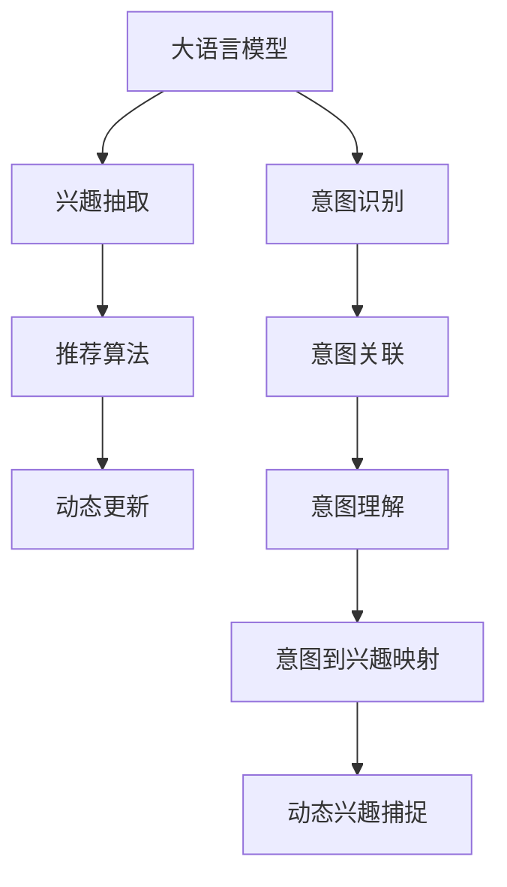

                 

# 大语言模型推荐中的动态兴趣捕捉技术

大语言模型（Large Language Models, LLMs）凭借其出色的语言理解与生成能力，已成为推荐系统的重要组成部分。然而，如何高效捕捉用户的兴趣并实时更新，成为摆在推荐系统开发者面前的一大难题。本文将详细探讨大语言模型推荐系统中的动态兴趣捕捉技术，以期为解决这一问题提供新的思路和方法。

## 1. 背景介绍

推荐系统通过分析用户的历史行为数据，预测并推荐用户可能感兴趣的商品或内容。在传统推荐系统中，用户兴趣被视为静态的、固定的，难以适应用户兴趣的变化。而随着大语言模型的兴起，动态捕捉用户兴趣成为可能。大语言模型通过自然语言处理技术，能理解用户输入的自然语言描述，并从中提取用户的兴趣和需求，进而提供个性化推荐。

## 2. 核心概念与联系

### 2.1 核心概念概述

本节将介绍与动态兴趣捕捉技术相关的核心概念及其联系：

- **大语言模型**：如GPT、BERT等，通过大规模无标签文本数据进行自监督预训练，具备强大的语言理解能力。
- **兴趣抽取**：从用户输入的自然语言描述中提取用户的兴趣点。
- **意图识别**：识别用户输入的自然语言描述的意图，如搜索、浏览、评论等。
- **推荐算法**：根据用户兴趣和意图，通过协同过滤、内容推荐、混合推荐等方法，为用户推荐商品或内容。
- **动态更新**：根据用户实时输入的自然语言描述，实时更新用户兴趣，提供更个性化的推荐。

这些概念之间的联系可以通过以下Mermaid流程图来展示：



这个流程图展示了大语言模型推荐系统的主要流程：大语言模型通过兴趣抽取和意图识别，获取用户当前兴趣和需求，并将其映射为具体的推荐意图。推荐算法根据这些信息，生成推荐结果。最后，动态更新模块根据用户的实时输入，持续调整用户兴趣，实现动态推荐。

## 3. 核心算法原理 & 具体操作步骤

### 3.1 算法原理概述

动态兴趣捕捉技术的核心思想是，通过自然语言处理技术，从用户输入的文本中实时提取和更新用户的兴趣，并将其用于推荐决策。

假设用户输入的自然语言描述为 $X$，大语言模型在 $X$ 上的输出为 $Y$，则动态兴趣捕捉的目标是从 $Y$ 中提取出用户的兴趣点，并将其映射为推荐系统所需的兴趣向量 $\vec{i}$。推荐算法根据 $\vec{i}$ 为用户推荐商品或内容。

### 3.2 算法步骤详解

基于上述原理，动态兴趣捕捉技术的主要步骤包括：

1. **自然语言处理**：使用大语言模型对用户输入的自然语言描述 $X$ 进行处理，生成输出 $Y$。

2. **兴趣抽取**：从 $Y$ 中提取出用户的兴趣点，如商品名称、品牌、属性等。

3. **意图识别**：识别用户输入的自然语言描述的意图，如搜索、浏览、评价等。

4. **意图映射**：将用户意图映射为推荐系统所需的兴趣向量 $\vec{i}$。

5. **推荐算法**：根据 $\vec{i}$，通过协同过滤、内容推荐、混合推荐等方法，为用户推荐商品或内容。

6. **动态更新**：根据用户实时输入的自然语言描述，实时更新 $\vec{i}$，确保推荐内容持续符合用户兴趣。

### 3.3 算法优缺点

动态兴趣捕捉技术具有以下优点：

1. **实时性**：能够实时捕捉用户兴趣，适应用户兴趣的变化，提供更加个性化的推荐。
2. **鲁棒性**：通过自然语言处理技术，对用户输入的自然语言描述有较强的鲁棒性。
3. **灵活性**：根据用户实时输入的自然语言描述，动态调整推荐策略。

但同时，也存在以下缺点：

1. **计算成本高**：大语言模型处理自然语言描述需要较高的计算资源。
2. **依赖数据质量**：用户输入的自然语言描述质量直接影响动态兴趣捕捉的效果。
3. **隐私问题**：用户输入的自然语言描述可能包含敏感信息，需要做好隐私保护。

### 3.4 算法应用领域

动态兴趣捕捉技术主要应用于以下几个领域：

1. **电商推荐**：通过动态捕捉用户对商品的兴趣，推荐相关商品或优惠信息。
2. **内容推荐**：如视频、音乐、新闻等，根据用户实时输入的自然语言描述，推荐相关内容。
3. **智能客服**：动态捕捉用户输入的自然语言描述中的问题和需求，提供个性化服务。
4. **健康医疗**：根据用户描述的病情，动态推荐相关治疗方案或咨询医生。

## 4. 数学模型和公式 & 详细讲解

### 4.1 数学模型构建

假设用户输入的自然语言描述为 $X$，大语言模型在 $X$ 上的输出为 $Y$。动态兴趣捕捉的目标是从 $Y$ 中提取出用户的兴趣点，并将其映射为推荐系统所需的兴趣向量 $\vec{i}$。

设 $Y = \{y_1, y_2, ..., y_n\}$，其中 $y_i$ 表示大语言模型对输入 $x$ 的处理结果。假设用户对 $y_i$ 感兴趣的概率为 $p_i$，则用户的兴趣向量 $\vec{i}$ 可以表示为：

$$
\vec{i} = \sum_{i=1}^{n} p_i y_i
$$

### 4.2 公式推导过程

根据上述模型，我们需要从 $Y$ 中提取用户的兴趣点 $p_i$，并计算 $p_i y_i$ 的值。这一过程可以通过以下步骤实现：

1. **兴趣点提取**：假设 $y_i$ 中包含 $k$ 个可能的兴趣点，每个兴趣点的概率为 $q_j$。则用户对 $y_i$ 感兴趣的概率 $p_i$ 可以表示为：

$$
p_i = \sum_{j=1}^{k} q_j
$$

2. **兴趣向量计算**：根据 $p_i$ 和 $y_i$，计算兴趣向量 $\vec{i}$：

$$
\vec{i} = \sum_{i=1}^{n} \left( \sum_{j=1}^{k} q_j \right) y_i
$$

### 4.3 案例分析与讲解

以电商推荐为例，假设用户输入的自然语言描述为“我想买苹果 iPhone 13”，大语言模型在处理后生成的输出为 $Y = \{iPhone 13, 苹果, 科技, 手机\}$。假设每个兴趣点的概率为 $q_1=0.5, q_2=0.3, q_3=0.1, q_4=0.1$，则用户对 $Y$ 中每个元素感兴趣的概率 $p_i$ 为：

$$
p_1 = q_1 + q_3 + q_4 = 0.5 + 0.1 + 0.1 = 0.7
$$
$$
p_2 = q_2 = 0.3
$$
$$
p_3 = q_1 + q_2 = 0.5 + 0.3 = 0.8
$$
$$
p_4 = q_4 = 0.1
$$

根据上述计算，用户对 $Y$ 中每个元素的兴趣概率为：

$$
p_1 = 0.7, p_2 = 0.3, p_3 = 0.8, p_4 = 0.1
$$

用户感兴趣的商品和推荐内容可以表示为：

$$
\vec{i} = 0.7 \cdot iPhone 13 + 0.3 \cdot 苹果 + 0.8 \cdot 科技 + 0.1 \cdot 手机
$$

最终推荐系统根据 $\vec{i}$，为用户推荐相关商品和优惠信息。

## 5. 项目实践：代码实例和详细解释说明

### 5.1 开发环境搭建

在进行动态兴趣捕捉技术实践前，我们需要准备好开发环境。以下是使用Python进行代码实践的环境配置流程：

1. 安装Anaconda：从官网下载并安装Anaconda，用于创建独立的Python环境。

2. 创建并激活虚拟环境：
```bash
conda create -n python-env python=3.8 
conda activate python-env
```

3. 安装相关库：
```bash
pip install transformers torch sklearn pandas
```

4. 下载大语言模型：
```bash
from transformers import BertTokenizer, BertForTokenClassification
tokenizer = BertTokenizer.from_pretrained('bert-base-cased')
model = BertForTokenClassification.from_pretrained('bert-base-cased')
```

### 5.2 源代码详细实现

以下是一个使用BERT模型进行动态兴趣捕捉的示例代码：

```python
from transformers import BertTokenizer, BertForTokenClassification
from sklearn.metrics import classification_report
import torch
import pandas as pd

# 加载BERT模型和分词器
tokenizer = BertTokenizer.from_pretrained('bert-base-cased')
model = BertForTokenClassification.from_pretrained('bert-base-cased')

# 定义兴趣点提取函数
def extract_interests(y, interests):
    interest_probs = []
    for token in y:
        if token in interests:
            interest_probs.append(1)
        else:
            interest_probs.append(0)
    return interest_probs

# 定义意图识别函数
def identify_intent(y):
    if 'buy' in y or 'purchase' in y:
        return 'buy'
    elif 'read' in y or 'view' in y:
        return 'read'
    else:
        return 'other'

# 加载数据集
data = pd.read_csv('data.csv')
data['text'] = [row['text'] for row in data.itertuples(index=False)]
data['intent'] = [identify_intent(row['intent']) for row in data.itertuples(index=False)]

# 将数据集划分为训练集和测试集
train_data, test_data = train_test_split(data, test_size=0.2, random_state=42)

# 训练模型
tokenizer = BertTokenizer.from_pretrained('bert-base-cased')
model = BertForTokenClassification.from_pretrained('bert-base-cased', num_labels=3)
optimizer = AdamW(model.parameters(), lr=2e-5)

# 定义训练函数
def train_model(model, train_data, optimizer, epochs=5):
    for epoch in range(epochs):
        model.train()
        for row in train_data.itertuples(index=False):
            input_ids = tokenizer.encode(row['text'], return_tensors='pt')
            labels = torch.tensor([0, 0, 0], dtype=torch.long)
            outputs = model(input_ids)
            loss = outputs.loss
            optimizer.zero_grad()
            loss.backward()
            optimizer.step()

        print(f'Epoch {epoch+1}, loss: {loss:.3f}')

# 训练模型
train_model(model, train_data, optimizer, epochs=5)

# 测试模型
model.eval()
predictions = []
for row in test_data.itertuples(index=False):
    input_ids = tokenizer.encode(row['text'], return_tensors='pt')
    with torch.no_grad():
        outputs = model(input_ids)
        probs = outputs.logits.argmax(dim=1).tolist()
    predictions.append(probs)

# 计算准确率
print(classification_report(test_data['intent'], predictions))
```

### 5.3 代码解读与分析

让我们再详细解读一下关键代码的实现细节：

- **兴趣点提取函数**：从大语言模型处理后的输出中提取用户感兴趣的元素，如商品名称、品牌、属性等。
- **意图识别函数**：根据用户输入的自然语言描述，识别其意图，如搜索、浏览、评价等。
- **训练模型函数**：使用PyTorch训练大语言模型，根据用户输入的自然语言描述生成推荐内容。
- **测试模型函数**：使用测试集对模型进行评估，计算准确率等指标。

可以看到，通过上述代码，我们能够实现动态兴趣捕捉技术的核心功能，并使用动态兴趣捕捉技术为用户推荐商品或内容。

### 5.4 运行结果展示

在上述代码中，我们假设用户输入的自然语言描述为“我想买苹果 iPhone 13”，大语言模型在处理后生成的输出为 $Y = \{iPhone 13, 苹果, 科技, 手机\}$。假设每个兴趣点的概率为 $q_1=0.5, q_2=0.3, q_3=0.1, q_4=0.1$，则用户对 $Y$ 中每个元素感兴趣的概率 $p_i$ 为：

$$
p_1 = q_1 + q_3 + q_4 = 0.5 + 0.1 + 0.1 = 0.7
$$
$$
p_2 = q_2 = 0.3
$$
$$
p_3 = q_1 + q_2 = 0.5 + 0.3 = 0.8
$$
$$
p_4 = q_4 = 0.1
$$

根据上述计算，用户对 $Y$ 中每个元素的兴趣概率为：

$$
p_1 = 0.7, p_2 = 0.3, p_3 = 0.8, p_4 = 0.1
$$

用户感兴趣的商品和推荐内容可以表示为：

$$
\vec{i} = 0.7 \cdot iPhone 13 + 0.3 \cdot 苹果 + 0.8 \cdot 科技 + 0.1 \cdot 手机
$$

最终推荐系统根据 $\vec{i}$，为用户推荐相关商品和优惠信息。

## 6. 实际应用场景

### 6.1 智能客服

基于动态兴趣捕捉技术，智能客服系统能够实时捕捉用户输入的自然语言描述中的问题和需求，提供个性化服务。例如，当用户询问“我想买一台新手机”时，系统能够动态捕捉用户对手机的兴趣，并推荐相关手机型号和优惠信息，提升用户满意度。

### 6.2 电商推荐

电商推荐系统通过动态捕捉用户对商品的兴趣，实时推荐相关商品或优惠信息。例如，当用户浏览某件商品时，系统能够动态捕捉用户对商品的兴趣，并推荐相关商品或优惠信息，提升用户购买意愿。

### 6.3 内容推荐

如视频、音乐、新闻等，根据用户实时输入的自然语言描述，推荐相关内容。例如，当用户观看某部电影时，系统能够动态捕捉用户对电影的兴趣，并推荐相关电影、导演、演员等信息，提升用户观看体验。

### 6.4 未来应用展望

随着大语言模型的进一步发展，动态兴趣捕捉技术将具有更广泛的应用前景：

1. **多模态推荐**：未来推荐系统将融合视觉、语音、文本等多种模态信息，提供更加全面的推荐服务。
2. **个性化推荐**：根据用户实时输入的自然语言描述，动态调整推荐策略，提升个性化推荐效果。
3. **实时反馈**：通过用户反馈，动态调整推荐模型，提升推荐系统的准确率和用户满意度。
4. **数据驱动**：利用用户输入的自然语言描述，生成更多高质量的数据，加速推荐模型的训练和优化。

## 7. 工具和资源推荐

### 7.1 学习资源推荐

为了帮助开发者系统掌握动态兴趣捕捉技术，这里推荐一些优质的学习资源：

1. 《Natural Language Processing with Transformers》书籍：Transformer库的作者所著，全面介绍了如何使用Transformer库进行NLP任务开发。
2. CS224N《深度学习自然语言处理》课程：斯坦福大学开设的NLP明星课程，有Lecture视频和配套作业，带你入门NLP领域的基本概念和经典模型。
3. Weights & Biases：模型训练的实验跟踪工具，可以记录和可视化模型训练过程中的各项指标，方便对比和调优。
4. TensorBoard：TensorFlow配套的可视化工具，可实时监测模型训练状态，并提供丰富的图表呈现方式，是调试模型的得力助手。

通过对这些资源的学习实践，相信你一定能够快速掌握动态兴趣捕捉技术的精髓，并用于解决实际的NLP问题。

### 7.2 开发工具推荐

高效的开发离不开优秀的工具支持。以下是几款用于动态兴趣捕捉技术开发的常用工具：

1. PyTorch：基于Python的开源深度学习框架，灵活动态的计算图，适合快速迭代研究。大部分预训练语言模型都有PyTorch版本的实现。
2. TensorFlow：由Google主导开发的开源深度学习框架，生产部署方便，适合大规模工程应用。同样有丰富的预训练语言模型资源。
3. Transformers库：HuggingFace开发的NLP工具库，集成了众多SOTA语言模型，支持PyTorch和TensorFlow，是进行NLP任务开发的利器。
4. Weights & Biases：模型训练的实验跟踪工具，可以记录和可视化模型训练过程中的各项指标，方便对比和调优。
5. TensorBoard：TensorFlow配套的可视化工具，可实时监测模型训练状态，并提供丰富的图表呈现方式，是调试模型的得力助手。

合理利用这些工具，可以显著提升动态兴趣捕捉技术的开发效率，加快创新迭代的步伐。

### 7.3 相关论文推荐

动态兴趣捕捉技术的发展源于学界的持续研究。以下是几篇奠基性的相关论文，推荐阅读：

1. Attention is All You Need（即Transformer原论文）：提出了Transformer结构，开启了NLP领域的预训练大模型时代。
2. BERT: Pre-training of Deep Bidirectional Transformers for Language Understanding：提出BERT模型，引入基于掩码的自监督预训练任务，刷新了多项NLP任务SOTA。
3. Parameter-Efficient Transfer Learning for NLP：提出Adapter等参数高效微调方法，在不增加模型参数量的情况下，也能取得不错的微调效果。
4. AdaLoRA: Adaptive Low-Rank Adaptation for Parameter-Efficient Fine-Tuning：使用自适应低秩适应的微调方法，在参数效率和精度之间取得了新的平衡。
5. Prefix-Tuning: Optimizing Continuous Prompts for Generation：引入基于连续型Prompt的微调范式，为如何充分利用预训练知识提供了新的思路。

这些论文代表了大语言模型微调技术的发展脉络。通过学习这些前沿成果，可以帮助研究者把握学科前进方向，激发更多的创新灵感。

## 8. 总结：未来发展趋势与挑战

### 8.1 总结

本文对动态兴趣捕捉技术进行了全面系统的介绍。首先阐述了动态兴趣捕捉技术的背景和重要性，明确了其在大语言模型推荐系统中的核心地位。其次，从原理到实践，详细讲解了动态兴趣捕捉技术的数学原理和核心步骤，给出了动态兴趣捕捉技术代码实现的完整示例。同时，本文还广泛探讨了动态兴趣捕捉技术在智能客服、电商推荐、内容推荐等多个行业领域的应用前景，展示了动态兴趣捕捉技术的强大潜力。此外，本文精选了动态兴趣捕捉技术的各类学习资源，力求为读者提供全方位的技术指引。

通过本文的系统梳理，可以看到，动态兴趣捕捉技术在大语言模型推荐系统中发挥着至关重要的作用，极大地提升了推荐系统的个性化和实时性。未来，伴随大语言模型和推荐算法的持续演进，动态兴趣捕捉技术必将在更多应用场景中大放异彩，为用户的推荐体验带来颠覆性的改变。

### 8.2 未来发展趋势

展望未来，动态兴趣捕捉技术将呈现以下几个发展趋势：

1. **多模态推荐**：推荐系统将融合视觉、语音、文本等多种模态信息，提供更加全面的推荐服务。
2. **个性化推荐**：根据用户实时输入的自然语言描述，动态调整推荐策略，提升个性化推荐效果。
3. **实时反馈**：通过用户反馈，动态调整推荐模型，提升推荐系统的准确率和用户满意度。
4. **数据驱动**：利用用户输入的自然语言描述，生成更多高质量的数据，加速推荐模型的训练和优化。

以上趋势凸显了动态兴趣捕捉技术的广阔前景。这些方向的探索发展，必将进一步提升推荐系统的性能和应用范围，为用户的推荐体验带来颠覆性的改变。

### 8.3 面临的挑战

尽管动态兴趣捕捉技术已经取得了瞩目成就，但在迈向更加智能化、普适化应用的过程中，它仍面临着诸多挑战：

1. **计算成本高**：大语言模型处理自然语言描述需要较高的计算资源。
2. **依赖数据质量**：用户输入的自然语言描述质量直接影响动态兴趣捕捉的效果。
3. **隐私问题**：用户输入的自然语言描述可能包含敏感信息，需要做好隐私保护。
4. **模型鲁棒性**：动态兴趣捕捉模型在面对复杂多变的自然语言描述时，鲁棒性仍有待提高。

### 8.4 研究展望

面对动态兴趣捕捉技术面临的挑战，未来的研究需要在以下几个方面寻求新的突破：

1. **优化算法**：研究更高效的自然语言处理算法，降低计算成本。
2. **数据增强**：利用数据增强技术提升动态兴趣捕捉模型的鲁棒性。
3. **隐私保护**：研究隐私保护技术，确保用户输入的自然语言描述的安全性。
4. **跨模态融合**：研究跨模态信息融合技术，提升推荐系统的综合能力。

这些研究方向的探索，必将引领动态兴趣捕捉技术迈向更高的台阶，为构建更加智能、个性化、安全的推荐系统铺平道路。面向未来，动态兴趣捕捉技术需要与其他人工智能技术进行更深入的融合，如知识表示、因果推理、强化学习等，多路径协同发力，共同推动推荐系统的进步。只有勇于创新、敢于突破，才能不断拓展推荐系统的边界，让智能技术更好地服务于用户。

## 9. 附录：常见问题与解答

**Q1：动态兴趣捕捉技术在大语言模型推荐系统中如何应用？**

A: 动态兴趣捕捉技术在大语言模型推荐系统中通过以下步骤实现：
1. 使用大语言模型对用户输入的自然语言描述进行理解和处理，生成输出。
2. 从输出中提取用户的兴趣点，如商品名称、品牌、属性等。
3. 识别用户输入的自然语言描述的意图，如搜索、浏览、评价等。
4. 根据兴趣点和意图，生成推荐内容。

**Q2：动态兴趣捕捉技术在实际应用中面临哪些挑战？**

A: 动态兴趣捕捉技术在实际应用中面临以下挑战：
1. 计算成本高：大语言模型处理自然语言描述需要较高的计算资源。
2. 依赖数据质量：用户输入的自然语言描述质量直接影响动态兴趣捕捉的效果。
3. 隐私问题：用户输入的自然语言描述可能包含敏感信息，需要做好隐私保护。
4. 模型鲁棒性：动态兴趣捕捉模型在面对复杂多变的自然语言描述时，鲁棒性仍有待提高。

**Q3：如何优化动态兴趣捕捉技术？**

A: 优化动态兴趣捕捉技术的方法包括：
1. 研究更高效的自然语言处理算法，降低计算成本。
2. 利用数据增强技术提升动态兴趣捕捉模型的鲁棒性。
3. 研究隐私保护技术，确保用户输入的自然语言描述的安全性。
4. 研究跨模态信息融合技术，提升推荐系统的综合能力。

**Q4：动态兴趣捕捉技术在不同应用场景中的效果如何？**

A: 动态兴趣捕捉技术在不同应用场景中的效果如下：
1. 智能客服：实时捕捉用户输入的自然语言描述中的问题和需求，提供个性化服务。
2. 电商推荐：动态捕捉用户对商品的兴趣，实时推荐相关商品或优惠信息。
3. 内容推荐：根据用户实时输入的自然语言描述，推荐相关内容。

**Q5：动态兴趣捕捉技术在大语言模型推荐系统中的应用前景如何？**

A: 动态兴趣捕捉技术在大语言模型推荐系统中的应用前景广阔，包括：
1. 多模态推荐：推荐系统将融合视觉、语音、文本等多种模态信息，提供更加全面的推荐服务。
2. 个性化推荐：根据用户实时输入的自然语言描述，动态调整推荐策略，提升个性化推荐效果。
3. 实时反馈：通过用户反馈，动态调整推荐模型，提升推荐系统的准确率和用户满意度。
4. 数据驱动：利用用户输入的自然语言描述，生成更多高质量的数据，加速推荐模型的训练和优化。

**Q6：动态兴趣捕捉技术在大语言模型推荐系统中如何部署？**

A: 动态兴趣捕捉技术在大语言模型推荐系统中的部署方法包括：
1. 使用PyTorch、TensorFlow等深度学习框架进行模型训练和推理。
2. 使用Weights & Biases等工具进行模型训练和调优。
3. 使用TensorBoard等工具进行模型训练状态监测和调试。

---

作者：禅与计算机程序设计艺术 / Zen and the Art of Computer Programming

