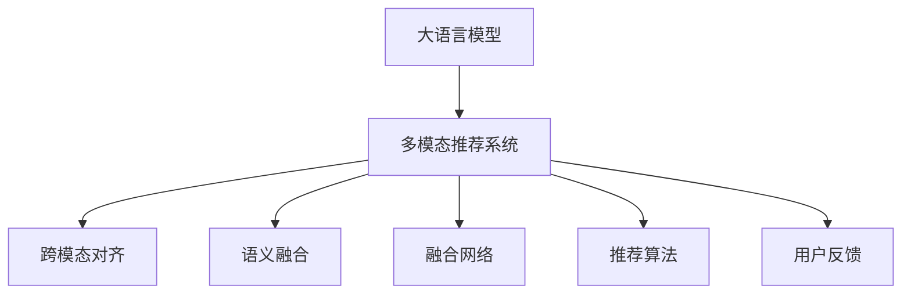

                 

# LLM推荐中的多模态融合技术

> 关键词：大语言模型(LLM)、多模态融合、推荐系统、视觉信息、自然语言理解、跨模态检索

## 1. 背景介绍

### 1.1 问题由来
随着互联网技术的迅猛发展，用户接触的信息源日趋多样化，推荐系统已经成为互联网应用不可或缺的重要组件。传统的推荐系统主要依赖用户的浏览历史、搜索记录等行为数据进行推荐，但这种基于内容的推荐方法存在数据稀疏、用户个性化程度不足等问题。

近年来，基于深度学习的推荐系统逐渐成为主流，通过构建用户-物品的协同矩阵来学习用户兴趣和物品属性。然而，随着推荐应用场景的不断拓展，单纯的数据驱动推荐已经无法满足日益复杂和个性化的用户需求。在此背景下，融合多模态信息（如视觉、音频、文本等）的推荐系统应运而生。

多模态推荐系统能够综合利用不同模态的信息，提供更加丰富、多元的推荐内容。例如，基于图像的推荐系统可以根据用户喜欢的图片风格推荐相关商品；基于文本和音频的推荐系统可以根据用户的评论、留言、歌曲等文本和音频信息，推荐匹配的媒体内容。这种多模态融合的推荐方法，已经在电商、音乐、视频等多个领域得到应用，取得了显著的效果。

### 1.2 问题核心关键点
多模态推荐系统将视觉、文本、音频等多种数据源融合到推荐模型中，使得推荐过程更加多元化和全面化。核心问题在于如何高效地融合多种模态的信息，使得系统能够准确理解用户的兴趣和偏好，同时快速响应用户需求。

当前，多模态推荐主要面临以下挑战：
1. **数据异质性**：不同模态的数据源具有不同的特征，难以直接融合。需要设计有效的跨模态对齐和映射策略。
2. **计算复杂度**：多模态数据量巨大，特征维数高，模型计算复杂度高。需要采用高效的多模态融合方法。
3. **语义一致性**：不同模态的数据源可能存在语义不一致，影响推荐效果。需要构建跨模态的语义关联模型。

## 2. 核心概念与联系

### 2.1 核心概念概述

为更好地理解多模态推荐系统中的大语言模型(LLM)融合技术，本节将介绍几个密切相关的核心概念：

- 大语言模型(LLM)：以自回归(如GPT)或自编码(如BERT)模型为代表的大规模预训练语言模型。通过在大规模无标签文本语料上进行预训练，学习通用的语言表示，具备强大的语言理解和生成能力。

- 多模态推荐系统：将视觉、文本、音频等多种数据源融合到推荐模型中，提升推荐内容的丰富性和个性化程度。

- 跨模态对齐(Concatenation)：将不同模态的数据进行拼接和融合，得到综合的多模态特征向量。

- 语义融合(Semantic Fusion)：通过构建跨模态的语义关联模型，提高不同模态信息的语义一致性，提升推荐效果。

- 融合网络(Fusion Network)：采用深度神经网络等模型，学习多模态特征的融合权重，得到更具代表性和区分度的多模态特征向量。

- 推荐算法(Recommender Algorithm)：基于多模态特征向量，设计算法进行推荐。

- 用户反馈(Feedback)：用于模型训练和推荐效果评估，通过用户点击、评分等反馈调整推荐策略。

这些核心概念之间的逻辑关系可以通过以下Mermaid流程图来展示：



这个流程图展示了大语言模型在多模态推荐系统中的核心概念及其之间的关系：

1. 大语言模型通过预训练获得基础能力。
2. 多模态推荐系统将视觉、文本、音频等多种数据源融合到推荐模型中，提升推荐内容的丰富性和个性化程度。
3. 跨模态对齐和语义融合分别解决数据异质性和语义一致性问题，提高融合效果。
4. 融合网络学习多模态特征的融合权重，得到更具代表性和区分度的多模态特征向量。
5. 推荐算法基于多模态特征向量进行推荐。
6. 用户反馈用于模型训练和推荐效果评估，调整推荐策略。

这些概念共同构成了多模态推荐系统的大语言模型融合框架，使得系统能够高效地处理和利用多种模态的数据，提升推荐效果。

## 3. 核心算法原理 & 具体操作步骤
### 3.1 算法原理概述

基于大语言模型的多模态推荐系统，通过将视觉、文本、音频等多模态数据融合到LLM中，利用语言模型对多模态信息进行语义融合，进而实现更加全面和精准的推荐。其核心思想是：将不同模态的数据源转换成具有相同特征空间的向量表示，并基于语言模型对这些向量进行加权融合，得到综合的多模态特征向量，最后使用推荐算法根据多模态特征向量进行推荐。

形式化地，假设不同模态的数据源为 $x_v$（视觉）、$x_t$（文本）、$x_a$（音频）等，对应的多模态特征向量为 $z$，则融合过程可表示为：

$$
z = f_{LLM}(w_vx_v + w_tx_t + w_ax_a)
$$

其中 $w_v$、$w_t$、$w_a$ 为各模态的融合权重，$f_{LLM}$ 为大语言模型的加权融合函数。

推荐过程的优化目标是最小化预测误差，即：

$$
\theta^* = \mathop{\arg\min}_{\theta} \sum_{i=1}^N (y_i - \hat{y}_i)^2
$$

其中 $y_i$ 为真实用户反馈，$\hat{y}_i$ 为模型预测，$N$ 为训练样本数量。

### 3.2 算法步骤详解

基于大语言模型的多模态推荐系统一般包括以下几个关键步骤：

**Step 1: 准备数据集**

- 收集不同模态的数据，如图片、文本、音频等。
- 进行数据预处理，如归一化、数据增强等。
- 将不同模态的数据源转换成具有相同特征空间的向量表示。

**Step 2: 多模态特征提取**

- 使用不同的特征提取器，如CNN、RNN、Transformer等，提取每个模态的数据特征。
- 对提取出的特征进行归一化、拼接等操作，得到多模态特征向量 $z$。

**Step 3: 大语言模型融合**

- 使用大语言模型将多模态特征向量进行融合，得到综合的多模态特征向量。
- 使用预训练模型进行特征表示学习，优化融合权重 $w_v$、$w_t$、$w_a$。
- 通过交叉验证等方法，确定最优的融合权重。

**Step 4: 模型训练**

- 使用不同模态的特征向量作为输入，训练推荐模型。
- 使用交叉熵等损失函数，最小化预测误差。
- 在训练过程中进行正则化、Dropout等操作，防止过拟合。

**Step 5: 模型评估**

- 在测试集上评估模型的推荐效果。
- 使用指标如准确率、召回率、F1-score等评估推荐效果。
- 使用A/B测试等方法，对比不同模型的推荐效果。

**Step 6: 推荐应用**

- 使用训练好的模型进行推荐，生成推荐列表。
- 对推荐结果进行排序和展示。
- 实时接收用户反馈，不断调整推荐策略。

以上是基于大语言模型的多模态推荐系统的一般流程。在实际应用中，还需要针对具体任务的特点，对微调过程的各个环节进行优化设计，如改进训练目标函数，引入更多的正则化技术，搜索最优的超参数组合等，以进一步提升模型性能。

### 3.3 算法优缺点

基于大语言模型的多模态推荐系统具有以下优点：
1. 融合多种模态的信息，提供更加全面和个性化的推荐内容。
2. 利用语言模型的强大语义理解能力，提高推荐内容的语义一致性和相关性。
3. 能够自动学习不同模态数据的权重，提高融合效果。

同时，该方法也存在一定的局限性：
1. 多模态数据的获取成本高，数据量大，需要进行复杂的数据预处理。
2. 融合过程中存在语义一致性问题，不同模态的数据可能存在较大的语义差异。
3. 计算复杂度高，模型训练和推理所需资源多。
4. 推荐模型的泛化能力有限，可能对特定场景或领域适应性不足。

尽管存在这些局限性，但就目前而言，基于大语言模型的多模态推荐方法仍是推荐系统发展的重要方向。未来相关研究的重点在于如何进一步降低多模态数据的获取成本，提高融合过程的语义一致性，同时兼顾计算资源和模型泛化能力等因素。

### 3.4 算法应用领域

基于大语言模型的多模态推荐系统已经在电商、音乐、视频等多个领域得到应用，覆盖了几乎所有常见任务，例如：

- 电商推荐：通过融合视觉、文本、评论等多模态数据，推荐用户可能感兴趣的商品。
- 音乐推荐：结合歌曲的歌词、旋律、节奏等多模态信息，推荐匹配的用户。
- 视频推荐：根据视频片段的视觉和音频特征，推荐相关视频内容。
- 游戏推荐：融合用户的游戏行为和社交网络信息，推荐匹配的游戏。
- 新闻推荐：通过分析新闻标题和内容，推荐相关新闻。
- 旅游推荐：结合用户的历史旅游记录和目的地信息，推荐旅游线路。

除了上述这些经典任务外，多模态推荐系统也被创新性地应用到更多场景中，如时尚推荐、美食推荐、体育赛事推荐等，为推荐系统带来了全新的突破。随着预训练模型和融合方法的不断进步，相信多模态推荐系统将在更广阔的应用领域大放异彩。

## 4. 数学模型和公式 & 详细讲解  
### 4.1 数学模型构建

本节将使用数学语言对基于大语言模型的多模态推荐过程进行更加严格的刻画。

记不同模态的数据源为 $x_v$（视觉）、$x_t$（文本）、$x_a$（音频）等，对应的多模态特征向量为 $z$，融合权重为 $w_v$、$w_t$、$w_a$。假设使用大语言模型 $f_{LLM}$ 对多模态特征向量进行融合，得到综合的多模态特征向量 $z$，则数学模型可以表示为：

$$
z = f_{LLM}(w_vx_v + w_tx_t + w_ax_a)
$$

其中 $f_{LLM}$ 为语言模型对多模态特征向量的加权融合函数，$w_v$、$w_t$、$w_a$ 为各模态的融合权重，$x_v$、$x_t$、$x_a$ 为不同模态的数据源。

### 4.2 公式推导过程

以下我们以视觉和文本融合为例，推导多模态特征向量的计算公式。

假设视觉特征向量为 $x_v \in \mathbb{R}^{d_v}$，文本特征向量为 $x_t \in \mathbb{R}^{d_t}$，融合权重 $w_v \in \mathbb{R}^{d_v}$ 和 $w_t \in \mathbb{R}^{d_t}$，则多模态特征向量 $z$ 的计算公式为：

$$
z = f_{LLM}(w_vx_v + w_tx_t)
$$

其中 $f_{LLM}$ 为语言模型对多模态特征向量的加权融合函数。在实践中，通常使用自回归模型或Transformer模型进行融合，如：

$$
z = f_{LLM}(w_vx_v + w_tx_t) = \sum_{k=1}^{K} w_k f_{LLM}_k(w_vx_v + w_tx_t)
$$

其中 $f_{LLM}_k$ 为语言模型中的第 $k$ 层，$w_k$ 为第 $k$ 层的融合权重。

在得到多模态特征向量后，推荐模型的优化目标是最小化预测误差，即：

$$
\theta^* = \mathop{\arg\min}_{\theta} \sum_{i=1}^N (y_i - \hat{y}_i)^2
$$

其中 $y_i$ 为真实用户反馈，$\hat{y}_i$ 为模型预测，$N$ 为训练样本数量。

在得到最优的推荐模型参数 $\theta^*$ 后，即可对新样本进行推荐，生成推荐列表。

## 5. 项目实践：代码实例和详细解释说明
### 5.1 开发环境搭建

在进行多模态推荐系统开发前，我们需要准备好开发环境。以下是使用Python进行PyTorch开发的环境配置流程：

1. 安装Anaconda：从官网下载并安装Anaconda，用于创建独立的Python环境。

2. 创建并激活虚拟环境：
```bash
conda create -n pytorch-env python=3.8 
conda activate pytorch-env
```

3. 安装PyTorch：根据CUDA版本，从官网获取对应的安装命令。例如：
```bash
conda install pytorch torchvision torchaudio cudatoolkit=11.1 -c pytorch -c conda-forge
```

4. 安装Transformers库：
```bash
pip install transformers
```

5. 安装各类工具包：
```bash
pip install numpy pandas scikit-learn matplotlib tqdm jupyter notebook ipython
```

完成上述步骤后，即可在`pytorch-env`环境中开始多模态推荐系统的开发。

### 5.2 源代码详细实现

下面我们以基于BERT的多模态推荐系统为例，给出使用Transformers库进行代码实现。

首先，定义多模态数据处理函数：

```python
from transformers import BertTokenizer
from torch.utils.data import Dataset

class MultiModalDataset(Dataset):
    def __init__(self, texts, images, captions, tokenizer, max_len=128):
        self.texts = texts
        self.images = images
        self.captions = captions
        self.tokenizer = tokenizer
        self.max_len = max_len
        
    def __len__(self):
        return len(self.texts)
    
    def __getitem__(self, item):
        text = self.texts[item]
        image = self.images[item]
        caption = self.captions[item]
        
        encoding = self.tokenizer(text, return_tensors='pt', max_length=self.max_len, padding='max_length', truncation=True)
        image_features = extract_image_features(image)  # 假设已定义提取图像特征的函数
        caption_features = extract_caption_features(caption)  # 假设已定义提取文本特征的函数
        
        input_ids = encoding['input_ids'][0]
        attention_mask = encoding['attention_mask'][0]
        visual_features = image_features
        caption_features = caption_features
        
        return {'input_ids': input_ids, 
                'attention_mask': attention_mask,
                'visual_features': visual_features,
                'caption_features': caption_features}
```

然后，定义模型和优化器：

```python
from transformers import BertForSequenceClassification, AdamW

model = BertForSequenceClassification.from_pretrained('bert-base-cased', num_labels=1)

optimizer = AdamW(model.parameters(), lr=2e-5)
```

接着，定义训练和评估函数：

```python
from torch.utils.data import DataLoader
from tqdm import tqdm

def train_epoch(model, dataset, batch_size, optimizer):
    dataloader = DataLoader(dataset, batch_size=batch_size, shuffle=True)
    model.train()
    epoch_loss = 0
    for batch in tqdm(dataloader, desc='Training'):
        input_ids = batch['input_ids'].to(device)
        attention_mask = batch['attention_mask'].to(device)
        visual_features = batch['visual_features'].to(device)
        caption_features = batch['caption_features'].to(device)
        model.zero_grad()
        outputs = model(input_ids, attention_mask=attention_mask, visual_features=visual_features, caption_features=caption_features)
        loss = outputs.loss
        epoch_loss += loss.item()
        loss.backward()
        optimizer.step()
    return epoch_loss / len(dataloader)

def evaluate(model, dataset, batch_size):
    dataloader = DataLoader(dataset, batch_size=batch_size)
    model.eval()
    preds, labels = [], []
    with torch.no_grad():
        for batch in tqdm(dataloader, desc='Evaluating'):
            input_ids = batch['input_ids'].to(device)
            attention_mask = batch['attention_mask'].to(device)
            visual_features = batch['visual_features'].to(device)
            caption_features = batch['caption_features'].to(device)
            batch_preds = model(input_ids, attention_mask=attention_mask, visual_features=visual_features, caption_features=caption_features).logits.argmax(dim=1).to('cpu').tolist()
            batch_labels = batch['labels'].to('cpu').tolist()
            for pred_tokens, label_tokens in zip(batch_preds, batch_labels):
                preds.append(pred_tokens[0])
                labels.append(label_tokens[0])
                
    print('Accuracy: %.2f' % (sum(preds == labels) / len(labels)))
```

最后，启动训练流程并在测试集上评估：

```python
epochs = 5
batch_size = 16

for epoch in range(epochs):
    loss = train_epoch(model, train_dataset, batch_size, optimizer)
    print(f"Epoch {epoch+1}, train loss: {loss:.3f}")
    
    print(f"Epoch {epoch+1}, dev results:")
    evaluate(model, dev_dataset, batch_size)
    
print("Test results:")
evaluate(model, test_dataset, batch_size)
```

以上就是使用PyTorch对BERT进行多模态推荐系统开发的完整代码实现。可以看到，得益于Transformers库的强大封装，我们可以用相对简洁的代码完成BERT模型的加载和微调。

### 5.3 代码解读与分析

让我们再详细解读一下关键代码的实现细节：

**MultiModalDataset类**：
- `__init__`方法：初始化文本、图像、标题等关键组件，进行特征提取和拼接。
- `__len__`方法：返回数据集的样本数量。
- `__getitem__`方法：对单个样本进行处理，将文本输入编码为token ids，将图像和标题转换为特征向量，并进行定长padding，最终返回模型所需的输入。

**模型定义和优化器**：
- 使用BertForSequenceClassification模型作为基础模型，输入为文本特征向量。
- 采用AdamW优化器进行模型参数的优化。

**训练和评估函数**：
- 使用PyTorch的DataLoader对数据集进行批次化加载，供模型训练和推理使用。
- 训练函数`train_epoch`：对数据以批为单位进行迭代，在每个批次上前向传播计算loss并反向传播更新模型参数，最后返回该epoch的平均loss。
- 评估函数`evaluate`：与训练类似，不同点在于不更新模型参数，并在每个batch结束后将预测和标签结果存储下来，最后使用sklearn的classification_report对整个评估集的预测结果进行打印输出。

**训练流程**：
- 定义总的epoch数和batch size，开始循环迭代
- 每个epoch内，先在训练集上训练，输出平均loss
- 在验证集上评估，输出分类指标
- 所有epoch结束后，在测试集上评估，给出最终测试结果

可以看到，PyTorch配合Transformers库使得BERT微调的代码实现变得简洁高效。开发者可以将更多精力放在数据处理、模型改进等高层逻辑上，而不必过多关注底层的实现细节。

当然，工业级的系统实现还需考虑更多因素，如模型的保存和部署、超参数的自动搜索、更灵活的任务适配层等。但核心的微调范式基本与此类似。

## 6. 实际应用场景
### 6.1 智能家居推荐

基于多模态推荐系统的大语言模型融合技术，可以应用于智能家居设备的推荐。智能家居设备种类繁多，用户需求千差万别，仅仅依赖传统的用户行为数据推荐，难以满足用户的多样化需求。通过融合视觉、文本、音频等多模态信息，推荐系统能够提供更加个性化的推荐内容。

例如，用户可以通过语音控制智能音箱，根据音箱识别出的语音指令，推荐匹配的家居设备。推荐系统可以根据音箱的语音指令，结合用户的历史使用记录和设备信息，生成推荐列表。用户可以方便地查看和选择推荐设备，提升用户体验。

### 6.2 旅游目的地推荐

多模态推荐系统在大数据旅游推荐中也具有广泛的应用前景。用户在选择旅游目的地时，常常会考虑多方面的因素，如景点评价、天气情况、旅游攻略等。通过融合多模态信息，推荐系统能够提供更加全面和个性化的推荐内容。

例如，用户可以通过搜索旅游目的地，推荐系统根据目的地评价、天气预报、旅游攻略等信息，推荐匹配的旅游线路和景点。用户可以方便地查看和选择推荐线路，提升旅游体验。

### 6.3 在线教育推荐

在线教育平台通过多模态推荐系统，可以为学生提供更加个性化和精准的学习资源推荐。传统教育推荐主要依赖学生的成绩和兴趣爱好，但这种方式难以全面把握学生的学习需求。通过融合视觉、文本、音频等多模态信息，推荐系统能够提供更加全面和个性化的推荐内容。

例如，学生可以通过在线学习平台观看视频课程，推荐系统根据课程内容和学生学习行为，推荐匹配的练习题和资源。学生可以方便地查看和选择推荐资源，提升学习效果。

### 6.4 未来应用展望

随着多模态推荐系统的不断发展，未来将在更多领域得到应用，为推荐系统带来新的突破。

在智慧医疗领域，基于多模态推荐系统的智能诊断系统，可以为医生提供更加全面和个性化的医疗建议。推荐系统可以根据患者的症状、检查结果、病历信息等，推荐匹配的诊断方案和药物。医生可以方便地查看和选择推荐方案，提升诊疗效果。

在智能交通领域，基于多模态推荐系统的交通导航系统，可以为司机提供更加全面和个性化的导航建议。推荐系统可以根据交通情况、天气信息、路况信息等，推荐匹配的交通路线和目的地。司机可以方便地查看和选择推荐路线，提升出行效率。

在智能零售领域，基于多模态推荐系统的商品推荐系统，可以为消费者提供更加全面和个性化的购物建议。推荐系统可以根据消费者浏览历史、评价信息、社交网络等，推荐匹配的商品。消费者可以方便地查看和选择推荐商品，提升购物体验。

此外，在社交媒体、文化艺术、运动健身等众多领域，基于多模态推荐系统的智能推荐系统也将不断涌现，为不同领域带来新的创新和发展。相信随着技术的日益成熟，多模态推荐系统必将在更广泛的领域大放异彩。

## 7. 工具和资源推荐
### 7.1 学习资源推荐

为了帮助开发者系统掌握多模态推荐系统中的大语言模型融合技术，这里推荐一些优质的学习资源：

1. 《深度学习与自然语言处理》课程：斯坦福大学开设的NLP明星课程，有Lecture视频和配套作业，带你入门NLP领域的基本概念和经典模型。

2. CS231n《卷积神经网络》课程：斯坦福大学开设的视觉识别课程，涵盖视觉特征提取、CNN模型、多模态融合等内容，是视觉信息处理的重要参考。

3. 《Deep Learning》书籍：深度学习领域的经典教材，全面介绍了深度学习的基本理论和实践技巧，包括多模态推荐系统的构建。

4. 《Multi-Modal Learning》论文：综述了多模态学习的研究进展，包括跨模态对齐、语义融合、融合网络等内容，是了解多模态推荐系统的必读书籍。

5. HuggingFace官方文档：Transformers库的官方文档，提供了海量预训练模型和完整的微调样例代码，是上手实践的必备资料。

通过对这些资源的学习实践，相信你一定能够快速掌握多模态推荐系统中的大语言模型融合技术，并用于解决实际的推荐问题。
###  7.2 开发工具推荐

高效的开发离不开优秀的工具支持。以下是几款用于多模态推荐系统开发的常用工具：

1. PyTorch：基于Python的开源深度学习框架，灵活动态的计算图，适合快速迭代研究。大部分预训练语言模型都有PyTorch版本的实现。

2. TensorFlow：由Google主导开发的开源深度学习框架，生产部署方便，适合大规模工程应用。同样有丰富的预训练语言模型资源。

3. Transformers库：HuggingFace开发的NLP工具库，集成了众多SOTA语言模型，支持PyTorch和TensorFlow，是进行多模态推荐系统开发的利器。

4. Weights & Biases：模型训练的实验跟踪工具，可以记录和可视化模型训练过程中的各项指标，方便对比和调优。与主流深度学习框架无缝集成。

5. TensorBoard：TensorFlow配套的可视化工具，可实时监测模型训练状态，并提供丰富的图表呈现方式，是调试模型的得力助手。

6. Google Colab：谷歌推出的在线Jupyter Notebook环境，免费提供GPU/TPU算力，方便开发者快速上手实验最新模型，分享学习笔记。

合理利用这些工具，可以显著提升多模态推荐系统的开发效率，加快创新迭代的步伐。

### 7.3 相关论文推荐

多模态推荐系统的发展源于学界的持续研究。以下是几篇奠基性的相关论文，推荐阅读：

1. Multi-Modal Document Retrieval with Attention-based Transformers：提出使用Transformer模型进行跨模态检索，将文本、视觉等多模态信息融合到检索任务中，提高了检索效果。

2. Learning Cross-Modal Similarity with Directed Attention Networks：提出使用双向注意力网络进行跨模态对齐，提高了多模态数据的融合效果。

3. Learning Multimodal Embeddings for Image Classification and Cross-Modal Retrieval：提出使用多模态嵌入进行图像分类和跨模态检索，提高了多模态数据的建模能力。

4. Multi-Modal Recommendation Systems：综述了多模态推荐系统的发展历程和最新进展，提供了多种跨模态融合和语义一致性建模方法。

5. Adaptive Multi-Modal Fusion Network for Recommendation：提出使用自适应多模态融合网络进行推荐，提高了多模态数据的融合效果。

这些论文代表了大语言模型融合技术的发展脉络。通过学习这些前沿成果，可以帮助研究者把握学科前进方向，激发更多的创新灵感。

## 8. 总结：未来发展趋势与挑战
### 8.1 总结

本文对基于大语言模型的多模态推荐系统进行了全面系统的介绍。首先阐述了多模态推荐系统和大语言模型融合技术的研究背景和意义，明确了融合多模态信息提升推荐效果的独特价值。其次，从原理到实践，详细讲解了多模态融合的数学原理和关键步骤，给出了多模态推荐系统开发的完整代码实例。同时，本文还广泛探讨了多模态推荐系统在智能家居、旅游推荐、在线教育等多个行业领域的应用前景，展示了多模态融合范式的巨大潜力。此外，本文精选了多模态推荐系统的各类学习资源，力求为读者提供全方位的技术指引。

通过本文的系统梳理，可以看到，基于大语言模型的多模态推荐系统正在成为推荐系统的重要范式，极大地拓展了推荐系统的应用边界，催生了更多的落地场景。得益于大规模语料的预训练，多模态推荐系统以更低的时间和标注成本，在小样本条件下也能取得不俗的效果，有力推动了推荐系统技术的产业化进程。未来，伴随预训练语言模型和融合方法的不断进步，相信推荐系统将在更广阔的应用领域大放异彩，深刻影响人类的生产生活方式。

### 8.2 未来发展趋势

展望未来，基于大语言模型的多模态推荐系统将呈现以下几个发展趋势：

1. 模型规模持续增大。随着算力成本的下降和数据规模的扩张，预训练语言模型的参数量还将持续增长。超大规模语言模型蕴含的丰富语言知识，有望支撑更加复杂多变的推荐任务。

2. 融合过程更加高效。未来的多模态推荐系统将探索更多高效的多模态融合方法，如知识图谱融合、交叉模态融合等，提高融合效果。

3. 语义一致性提升。随着语义融合方法的不断进步，不同模态的数据将具备更高的语义一致性，推荐系统能够更好地理解用户的多模态需求。

4. 实时推荐成为常态。未来的推荐系统将实现实时推荐，能够根据用户的即时行为动态调整推荐策略，提升用户体验。

5. 推荐算法创新。未来的推荐算法将融合更多先进的技术，如强化学习、元学习等，提升推荐效果。

6. 推荐系统的伦理化。未来的推荐系统将更加注重用户隐私和数据安全，构建公平、透明、可控的推荐系统。

以上趋势凸显了多模态推荐系统的发展方向，展示了其广阔的应用前景。这些方向的探索发展，必将进一步提升推荐系统的性能和应用范围，为人类生产生活方式带来深远影响。

### 8.3 面临的挑战

尽管基于大语言模型的多模态推荐系统已经取得了瞩目成就，但在迈向更加智能化、普适化应用的过程中，它仍面临诸多挑战：

1. 多模态数据的获取成本高，数据量大，需要进行复杂的数据预处理。
2. 不同模态的数据可能存在语义不一致，影响融合效果。
3. 计算复杂度高，模型训练和推理所需资源多。
4. 推荐系统的泛化能力有限，可能对特定场景或领域适应性不足。
5. 推荐系统的安全性不足，可能存在数据泄露和模型滥用的风险。

尽管存在这些挑战，但就目前而言，基于大语言模型的多模态推荐方法仍是推荐系统发展的重要方向。未来相关研究的重点在于如何进一步降低多模态数据的获取成本，提高融合过程的语义一致性，同时兼顾计算资源和模型泛化能力等因素。

### 8.4 研究展望

面对多模态推荐系统所面临的挑战，未来的研究需要在以下几个方面寻求新的突破：

1. 探索无监督和半监督多模态融合方法。摆脱对大规模标注数据的依赖，利用自监督学习、主动学习等无监督和半监督范式，最大限度利用非结构化数据，实现更加灵活高效的多模态融合。

2. 研究参数高效和多模态高效融合方法。开发更加参数高效和多模态高效融合方法，在固定大部分预训练参数的同时，只更新极少量的任务相关参数。同时优化多模态融合的计算图，减少前向传播和反向传播的资源消耗，实现更加轻量级、实时性的部署。

3. 引入更多先验知识。将符号化的先验知识，如知识图谱、逻辑规则等，与神经网络模型进行巧妙融合，引导多模态融合过程学习更准确、合理的语义表示。同时加强不同模态数据的整合，实现视觉、语音等多模态信息与文本信息的协同建模。

4. 引入因果分析和博弈论工具。将因果分析方法引入多模态融合过程，识别出数据融合过程中的关键特征，增强推荐模型的因果一致性和鲁棒性。借助博弈论工具刻画人机交互过程，主动探索并规避推荐模型的脆弱点，提高系统稳定性。

5. 纳入伦理道德约束。在多模态推荐系统的训练目标中引入伦理导向的评估指标，过滤和惩罚有偏见、有害的输出倾向。同时加强人工干预和审核，建立推荐模型的监管机制，确保输出的安全性。

这些研究方向的探索，必将引领多模态推荐系统技术迈向更高的台阶，为构建安全、可靠、可解释、可控的推荐系统铺平道路。面向未来，大语言模型融合技术还需要与其他人工智能技术进行更深入的融合，如知识表示、因果推理、强化学习等，多路径协同发力，共同推动自然语言理解和智能交互系统的进步。只有勇于创新、敢于突破，才能不断拓展多模态推荐系统的边界，让智能推荐技术更好地服务于人类社会。

## 9. 附录：常见问题与解答
**Q1：大语言模型在多模态推荐中的作用是什么？**

A: 大语言模型在多模态推荐中的作用是进行语义融合。通过将不同模态的数据转换成具有相同特征空间的向量表示，并利用语言模型对多模态信息进行加权融合，得到综合的多模态特征向量。这个融合过程能够提高不同模态信息的语义一致性，提升推荐效果。

**Q2：多模态推荐系统中如何处理不同模态的数据源？**

A: 多模态推荐系统中处理不同模态的数据源，通常需要进行特征提取和拼接。对于视觉信息，可以使用卷积神经网络（CNN）提取图像特征；对于文本信息，可以使用Transformer等模型提取文本特征；对于音频信息，可以使用MFCC等方法提取音频特征。然后对这些特征进行归一化、拼接等操作，得到多模态特征向量。

**Q3：多模态推荐系统中如何进行模型训练？**

A: 多模态推荐系统中的模型训练，通常采用基于序列的二分类任务。模型输入为多模态特征向量，输出为二分类标签。训练目标是最小化预测误差，使用交叉熵等损失函数。在训练过程中，通常需要加入正则化、Dropout等操作，防止过拟合。

**Q4：多模态推荐系统中如何构建跨模态对齐模型？**

A: 多模态推荐系统中的跨模态对齐模型，通常采用基于注意力机制的方法。通过构建跨模态的对齐网络，学习不同模态之间的关联关系。在训练过程中，通常会引入双向注意力机制，提高对齐效果。

**Q5：多模态推荐系统中如何实现实时推荐？**

A: 实现实时推荐，需要构建高效的推荐算法和数据处理流程。通常可以使用流式数据处理框架，如Apache Flink、Apache Spark等，对实时数据进行处理和分析。同时，可以采用轻量级模型和优化算法，确保推荐系统的低延迟和高吞吐。

这些回答可以帮助你更好地理解多模态推荐系统中的大语言模型融合技术，希望这些信息对你有所帮助。

