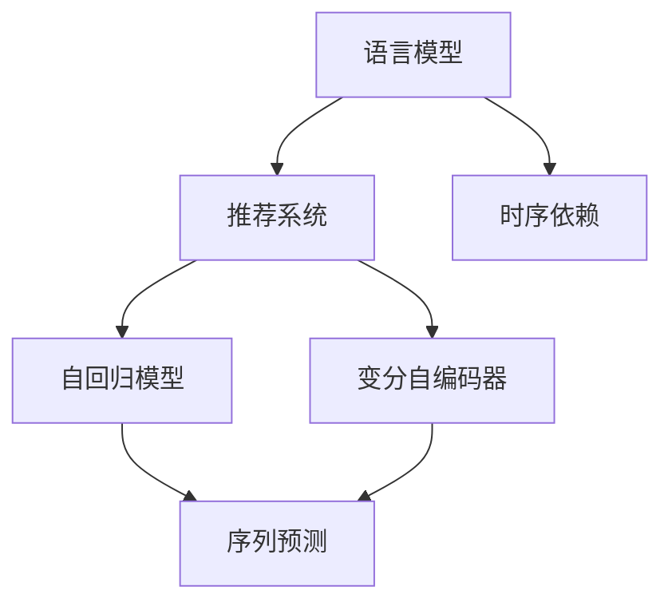

                 

# LLM推荐中的时序依赖建模技术

> 关键词：语言模型(Language Model), 推荐系统(Recommendation System), 时序依赖(Time Series Dependence), 自回归(AR)模型, 变分自编码器(VAE), 序列预测(Sequence Prediction)

## 1. 背景介绍

随着互联网和智能设备的普及，推荐系统成为了电商、社交媒体、视频网站等互联网平台的核心竞争力。推荐系统通过个性化推荐算法，将用户与兴趣相符的内容精准匹配，提升用户体验，增加用户粘性和平台收益。然而，传统的推荐系统多采用基于内容的相似度计算和协同过滤方法，缺乏对用户动态行为和上下文信息的理解，难以捕捉长期时序依赖，无法提供真正的个性化推荐。

近年来，大语言模型在自然语言处理(NLP)领域的突破性进展，让人们看到了语言模型在推荐系统中的应用潜力。大语言模型通过预训练，学习了通用的语言表示，具备强大的语义理解能力和生成能力。而时序依赖建模技术，则是对用户行为进行深度挖掘，分析用户过去的行为序列，预测未来行为。

因此，将语言模型与时序依赖建模技术结合，构建基于大语言模型的推荐系统，成为了推荐系统研究的热点之一。本文将系统介绍基于大语言模型的推荐系统中的时序依赖建模技术，包括主要算法原理、具体操作步骤、应用场景和未来展望，以期为推荐系统的研究和开发提供参考。

## 2. 核心概念与联系

### 2.1 核心概念概述

为更好地理解基于大语言模型的推荐系统中的时序依赖建模技术，本节将介绍几个关键核心概念及其之间的联系：

- **语言模型(Language Model)**：以自回归(如GPT)或自编码(如BERT)模型为代表的大规模预训练语言模型。通过在大规模无标签文本语料上进行预训练，学习通用的语言表示，具备强大的语言理解和生成能力。

- **推荐系统(Recommendation System)**：通过用户行为数据和物品属性信息，对用户进行个性化推荐，使用户得到满意的物品，提升用户满意度和平台收益。

- **时序依赖(Time Series Dependence)**：用户的行为往往具有一定的时序依赖性，即用户过去的行为对未来行为有影响。例如，购物车中的商品、观看历史、浏览记录等。

- **自回归(AR)模型**：一种时间序列预测模型，根据前一时刻的预测值和当前时刻的观测值，通过线性回归的方式预测下一个时刻的观测值。AR模型能够捕捉时间序列中的时序依赖。

- **变分自编码器(VAE)**：一种生成模型，通过学习潜在变量的分布，能够生成新的样本，并能够进行序列预测。VAE能够捕捉序列中的时序依赖，并进行序列生成和序列分类。

- **序列预测(Sequence Prediction)**：预测未来的序列数据，例如购物车中的商品序列、观影序列等。序列预测能够为推荐系统提供更加个性化的推荐。

这些核心概念之间的逻辑关系可以通过以下Mermaid流程图来展示：



这个流程图展示了大语言模型、推荐系统和时序依赖建模技术之间的联系：

1. 大语言模型通过预训练获得基础能力。
2. 推荐系统利用大语言模型的语义理解能力，提供个性化推荐。
3. 时序依赖建模技术通过分析用户行为序列，捕捉长期依赖，提升推荐精度。
4. 自回归模型和变分自编码器是常用的时序依赖建模方法。
5. 序列预测是通过这些方法完成未来序列的预测。

## 3. 核心算法原理 & 具体操作步骤

### 3.1 算法原理概述

基于大语言模型的推荐系统中的时序依赖建模，通过将用户行为序列作为输入，利用大语言模型的语义理解能力，捕捉序列中的长期依赖关系，从而实现序列预测。具体的算法流程如下：

1. 收集用户行为序列数据，包括浏览历史、购买记录、观影历史等。
2. 将行为序列作为大语言模型的输入，进行预训练语言模型的微调，得到时序依赖的序列表示。
3. 通过自回归模型或变分自编码器，对序列表示进行时序预测。
4. 将预测结果与当前行为数据结合，得到个性化的推荐结果。

### 3.2 算法步骤详解

以下是基于大语言模型的推荐系统中的时序依赖建模的详细步骤：

**Step 1: 数据准备**

- 收集用户行为序列数据，将每个用户的行为记录构建成一条序列。
- 将序列按照时间顺序排序，并填充缺失值，以保证序列的完整性。
- 对行为序列进行编码，将行为编码为数字，例如浏览记录编码为1，购买记录编码为2，观影记录编码为3等。

**Step 2: 模型选择与微调**

- 选择合适的预训练语言模型，如BERT、GPT等，进行微调。
- 将行为序列作为模型输入，进行有监督的微调。
- 在微调过程中，使用交叉熵损失函数，优化模型参数，使模型能够更好地捕捉时序依赖。

**Step 3: 时序建模**

- 使用自回归模型或变分自编码器，对微调后的序列表示进行时序建模。
- 对于自回归模型，使用当前时刻的序列表示预测下一个时刻的序列表示。
- 对于变分自编码器，使用序列表示生成新的序列数据，并进行分类预测。

**Step 4: 推荐生成**

- 将预测结果与当前行为数据结合，生成个性化推荐结果。
- 例如，对于购物车推荐，可以结合用户当前的浏览记录和预测的购买记录，生成推荐商品。

**Step 5: 结果评估**

- 在测试集上评估推荐系统的准确率和召回率等指标。
- 通过A/B测试等方法，评估新模型的推荐效果。

### 3.3 算法优缺点

基于大语言模型的推荐系统中的时序依赖建模具有以下优点：

1. **语义理解能力强**：大语言模型具备强大的语义理解能力，能够捕捉序列中的语义信息，提供更加个性化的推荐。
2. **时序依赖性好**：通过时序依赖建模技术，能够捕捉序列中的长期依赖关系，提供更加准确的预测结果。
3. **鲁棒性好**：模型能够应对用户行为的多样性和复杂性，具有较好的鲁棒性。

同时，该方法也存在以下缺点：

1. **计算成本高**：大语言模型的预训练和微调需要大量计算资源，对硬件和软件环境要求较高。
2. **过拟合风险**：由于数据量较小，模型容易出现过拟合现象。
3. **模型复杂度高**：大语言模型和时序依赖建模技术相结合，模型结构复杂，难以调试。

### 3.4 算法应用领域

基于大语言模型的推荐系统中的时序依赖建模技术，已经在多个领域得到了应用：

- **电商推荐**：基于用户的浏览和购买记录，推荐用户可能感兴趣的商品。
- **视频推荐**：基于用户的观影历史和评分，推荐用户可能喜欢的视频。
- **音乐推荐**：基于用户的听歌记录和喜好，推荐用户可能喜欢的音乐。
- **新闻推荐**：基于用户的阅读历史和兴趣，推荐用户可能感兴趣的新闻。

## 4. 数学模型和公式 & 详细讲解  
### 4.1 数学模型构建

基于大语言模型的推荐系统中的时序依赖建模，通常使用自回归模型或变分自编码器进行序列预测。以自回归模型为例，其数学模型如下：

设序列 $X_t$ 表示用户在第 $t$ 时刻的行为，$y_t$ 表示 $X_t$ 的目标预测值，即 $t+1$ 时刻的行为。自回归模型的目标是通过已知 $y_{1:t-1}$ 预测 $y_t$。

数学模型为：

$$
y_t = f(y_{t-1}, \theta)
$$

其中 $f$ 表示回归函数，$\theta$ 表示模型参数。

### 4.2 公式推导过程

自回归模型的目标是通过已知 $y_{1:t-1}$ 预测 $y_t$。假设 $y_t$ 和 $y_{t-1}$ 之间的关系为线性回归：

$$
y_t = \alpha + \beta y_{t-1} + \epsilon_t
$$

其中 $\alpha$ 和 $\beta$ 为回归系数，$\epsilon_t$ 为随机误差。将 $y_{t-1}$ 代入模型，得到：

$$
y_t = \alpha + \beta f(y_{t-1}, \theta) + \epsilon_t
$$

将上式中的 $f$ 替换为线性函数，得到：

$$
y_t = \alpha + \beta y_{t-1} + \epsilon_t
$$

在训练过程中，使用均方误差损失函数：

$$
\mathcal{L} = \frac{1}{N} \sum_{i=1}^N (y_{t_i} - \hat{y}_{t_i})^2
$$

其中 $y_{t_i}$ 和 $\hat{y}_{t_i}$ 分别为真实值和预测值。

### 4.3 案例分析与讲解

以电商推荐为例，假设用户在不同时间点的浏览记录和购买记录如下：

- 第1天，用户浏览了商品A、商品B、商品C，购买了商品B。
- 第2天，用户浏览了商品A、商品B、商品D，购买了商品A。
- 第3天，用户浏览了商品A、商品B、商品E，购买了商品E。

将浏览记录和购买记录编码，得到序列 $X_t = [A, B, C, A, B, D, A, B, E]$。使用自回归模型，对序列 $X_t$ 进行时序建模，得到序列预测结果 $y_t$，即第 $t+1$ 时刻的浏览记录或购买记录。

假设模型输出为 $y_t = B$，表示用户可能购买商品B。将 $y_t$ 与当前行为数据结合，生成个性化推荐结果。

## 5. 项目实践：代码实例和详细解释说明
### 5.1 开发环境搭建

在进行基于大语言模型的推荐系统开发时，我们需要准备好开发环境。以下是使用Python进行PyTorch开发的环境配置流程：

1. 安装Anaconda：从官网下载并安装Anaconda，用于创建独立的Python环境。

2. 创建并激活虚拟环境：
```bash
conda create -n pytorch-env python=3.8 
conda activate pytorch-env
```

3. 安装PyTorch：根据CUDA版本，从官网获取对应的安装命令。例如：
```bash
conda install pytorch torchvision torchaudio cudatoolkit=11.1 -c pytorch -c conda-forge
```

4. 安装Transformers库：
```bash
pip install transformers
```

5. 安装各类工具包：
```bash
pip install numpy pandas scikit-learn matplotlib tqdm jupyter notebook ipython
```

完成上述步骤后，即可在`pytorch-env`环境中开始推荐系统开发。

### 5.2 源代码详细实现

下面我们以电商推荐为例，给出使用Transformers库对BERT模型进行电商推荐中时序依赖建模的PyTorch代码实现。

首先，定义电商推荐任务的数据处理函数：

```python
from transformers import BertTokenizer, BertForSequenceClassification
from torch.utils.data import Dataset
import torch

class RetailDataset(Dataset):
    def __init__(self, texts, labels, tokenizer, max_len=128):
        self.texts = texts
        self.labels = labels
        self.tokenizer = tokenizer
        self.max_len = max_len
        
    def __len__(self):
        return len(self.texts)
    
    def __getitem__(self, item):
        text = self.texts[item]
        label = self.labels[item]
        
        encoding = self.tokenizer(text, return_tensors='pt', max_length=self.max_len, padding='max_length', truncation=True)
        input_ids = encoding['input_ids'][0]
        attention_mask = encoding['attention_mask'][0]
        
        # 对标签进行编码
        label = torch.tensor([label], dtype=torch.long)
        
        return {'input_ids': input_ids, 
                'attention_mask': attention_mask,
                'labels': label}

# 标签与id的映射
label2id = {'浏览': 0, '购买': 1}

# 创建dataset
tokenizer = BertTokenizer.from_pretrained('bert-base-cased')

train_dataset = RetailDataset(train_texts, train_labels, tokenizer)
dev_dataset = RetailDataset(dev_texts, dev_labels, tokenizer)
test_dataset = RetailDataset(test_texts, test_labels, tokenizer)
```

然后，定义模型和优化器：

```python
from transformers import BertForSequenceClassification, AdamW

model = BertForSequenceClassification.from_pretrained('bert-base-cased', num_labels=len(label2id))

optimizer = AdamW(model.parameters(), lr=2e-5)
```

接着，定义训练和评估函数：

```python
from torch.utils.data import DataLoader
from tqdm import tqdm
from sklearn.metrics import accuracy_score

device = torch.device('cuda') if torch.cuda.is_available() else torch.device('cpu')
model.to(device)

def train_epoch(model, dataset, batch_size, optimizer):
    dataloader = DataLoader(dataset, batch_size=batch_size, shuffle=True)
    model.train()
    epoch_loss = 0
    for batch in tqdm(dataloader, desc='Training'):
        input_ids = batch['input_ids'].to(device)
        attention_mask = batch['attention_mask'].to(device)
        labels = batch['labels'].to(device)
        model.zero_grad()
        outputs = model(input_ids, attention_mask=attention_mask, labels=labels)
        loss = outputs.loss
        epoch_loss += loss.item()
        loss.backward()
        optimizer.step()
    return epoch_loss / len(dataloader)

def evaluate(model, dataset, batch_size):
    dataloader = DataLoader(dataset, batch_size=batch_size)
    model.eval()
    preds, labels = [], []
    with torch.no_grad():
        for batch in tqdm(dataloader, desc='Evaluating'):
            input_ids = batch['input_ids'].to(device)
            attention_mask = batch['attention_mask'].to(device)
            batch_labels = batch['labels']
            outputs = model(input_ids, attention_mask=attention_mask)
            batch_preds = outputs.logits.argmax(dim=1).to('cpu').tolist()
            batch_labels = batch_labels.to('cpu').tolist()
            for pred, label in zip(batch_preds, batch_labels):
                preds.append(pred)
                labels.append(label)
                
    return accuracy_score(labels, preds)

```

最后，启动训练流程并在测试集上评估：

```python
epochs = 5
batch_size = 16

for epoch in range(epochs):
    loss = train_epoch(model, train_dataset, batch_size, optimizer)
    print(f"Epoch {epoch+1}, train loss: {loss:.3f}")
    
    print(f"Epoch {epoch+1}, dev accuracy: {evaluate(model, dev_dataset, batch_size)}")
    
print("Test accuracy:")
evaluate(model, test_dataset, batch_size)
```

以上就是使用PyTorch对BERT进行电商推荐任务中的时序依赖建模的完整代码实现。可以看到，得益于Transformers库的强大封装，我们可以用相对简洁的代码完成BERT模型的加载和电商推荐任务中的时序依赖建模。

### 5.3 代码解读与分析

让我们再详细解读一下关键代码的实现细节：

**RetailDataset类**：
- `__init__`方法：初始化文本、标签、分词器等关键组件。
- `__len__`方法：返回数据集的样本数量。
- `__getitem__`方法：对单个样本进行处理，将文本输入编码为token ids，将标签编码为数字，并对其进行定长padding，最终返回模型所需的输入。

**label2id和id2label字典**：
- 定义了标签与数字id之间的映射关系，用于将预测结果解码回真实的标签。

**训练和评估函数**：
- 使用PyTorch的DataLoader对数据集进行批次化加载，供模型训练和推理使用。
- 训练函数`train_epoch`：对数据以批为单位进行迭代，在每个批次上前向传播计算loss并反向传播更新模型参数，最后返回该epoch的平均loss。
- 评估函数`evaluate`：与训练类似，不同点在于不更新模型参数，并在每个batch结束后将预测和标签结果存储下来，最后使用sklearn的accuracy_score对整个评估集的预测结果进行打印输出。

**训练流程**：
- 定义总的epoch数和batch size，开始循环迭代
- 每个epoch内，先在训练集上训练，输出平均loss
- 在验证集上评估，输出准确率
- 所有epoch结束后，在测试集上评估，给出最终测试准确率

可以看到，PyTorch配合Transformers库使得BERT微调的代码实现变得简洁高效。开发者可以将更多精力放在数据处理、模型改进等高层逻辑上，而不必过多关注底层的实现细节。

当然，工业级的系统实现还需考虑更多因素，如模型的保存和部署、超参数的自动搜索、更灵活的任务适配层等。但核心的时序依赖建模技术基本与此类似。

## 6. 实际应用场景
### 6.1 智能客服系统

基于大语言模型的推荐系统中的时序依赖建模，可以广泛应用于智能客服系统的构建。传统客服往往需要配备大量人力，高峰期响应缓慢，且一致性和专业性难以保证。而使用基于时序依赖建模的推荐系统，可以7x24小时不间断服务，快速响应客户咨询，用自然流畅的语言解答各类常见问题。

在技术实现上，可以收集企业内部的历史客服对话记录，将问题和最佳答复构建成监督数据，在此基础上对预训练语言模型进行微调。微调后的语言模型能够自动理解用户意图，匹配最合适的答复模板进行回复。对于客户提出的新问题，还可以接入检索系统实时搜索相关内容，动态组织生成回答。如此构建的智能客服系统，能大幅提升客户咨询体验和问题解决效率。

### 6.2 金融舆情监测

金融机构需要实时监测市场舆论动向，以便及时应对负面信息传播，规避金融风险。传统的人工监测方式成本高、效率低，难以应对网络时代海量信息爆发的挑战。基于大语言模型的推荐系统中的时序依赖建模技术，为金融舆情监测提供了新的解决方案。

具体而言，可以收集金融领域相关的新闻、报道、评论等文本数据，并对其进行主题标注和情感标注。在此基础上对预训练语言模型进行微调，使其能够自动判断文本属于何种主题，情感倾向是正面、中性还是负面。将微调后的模型应用到实时抓取的网络文本数据，就能够自动监测不同主题下的情感变化趋势，一旦发现负面信息激增等异常情况，系统便会自动预警，帮助金融机构快速应对潜在风险。

### 6.3 个性化推荐系统

当前的推荐系统往往只依赖用户的历史行为数据进行物品推荐，无法深入理解用户的真实兴趣偏好。基于大语言模型的推荐系统中的时序依赖建模技术，可以更好地挖掘用户行为序列中的长期依赖关系，提供更加个性化的推荐。

在实践中，可以收集用户浏览、点击、评论、分享等行为数据，提取和用户交互的物品标题、描述、标签等文本内容。将文本内容作为模型输入，用户的后续行为（如是否点击、购买等）作为监督信号，在此基础上微调预训练语言模型。微调后的模型能够从文本内容中准确把握用户的兴趣点。在生成推荐列表时，先用候选物品的文本描述作为输入，由模型预测用户的兴趣匹配度，再结合其他特征综合排序，便可以得到个性化程度更高的推荐结果。

### 6.4 未来应用展望

随着大语言模型和推荐系统研究的不断发展，基于时序依赖建模的大语言模型推荐系统将在更多领域得到应用，为传统行业带来变革性影响。

在智慧医疗领域，基于大语言模型的推荐系统可以辅助医生诊疗，推荐最新的医学知识、治疗方法、药物等，提升医疗服务的智能化水平。

在智能教育领域，推荐系统可应用于作业批改、学情分析、知识推荐等方面，因材施教，促进教育公平，提高教学质量。

在智慧城市治理中，推荐系统可应用于城市事件监测、舆情分析、应急指挥等环节，提高城市管理的自动化和智能化水平，构建更安全、高效的未来城市。

此外，在企业生产、社会治理、文娱传媒等众多领域，基于大语言模型的推荐系统也将不断涌现，为NLP技术带来了新的发展方向。相信随着技术的日益成熟，时序依赖建模方法将成为推荐系统的重要范式，推动人工智能技术在垂直行业的规模化落地。

## 7. 工具和资源推荐
### 7.1 学习资源推荐

为了帮助开发者系统掌握基于大语言模型的推荐系统中的时序依赖建模技术，这里推荐一些优质的学习资源：

1. 《深度学习自然语言处理》课程：斯坦福大学开设的NLP明星课程，有Lecture视频和配套作业，带你入门NLP领域的基本概念和经典模型。

2. CS224N《自然语言处理》课程：斯坦福大学开设的NLP核心课程，涵盖自然语言处理的基础知识和最新进展。

3. 《自然语言处理与深度学习》书籍：介绍自然语言处理的基础知识和深度学习在自然语言处理中的应用，包括推荐系统中的时序依赖建模技术。

4. 《深度学习入门》书籍：介绍深度学习的基本概念和应用，适合初学者入门。

5. 《序列预测理论与方法》书籍：介绍序列预测的理论和算法，适合对序列预测感兴趣的读者。

通过对这些资源的学习实践，相信你一定能够快速掌握基于大语言模型的推荐系统中的时序依赖建模技术的精髓，并用于解决实际的推荐问题。
### 7.2 开发工具推荐

高效的开发离不开优秀的工具支持。以下是几款用于大语言模型推荐系统开发常用的工具：

1. PyTorch：基于Python的开源深度学习框架，灵活动态的计算图，适合快速迭代研究。大部分预训练语言模型都有PyTorch版本的实现。

2. TensorFlow：由Google主导开发的开源深度学习框架，生产部署方便，适合大规模工程应用。同样有丰富的预训练语言模型资源。

3. Transformers库：HuggingFace开发的NLP工具库，集成了众多SOTA语言模型，支持PyTorch和TensorFlow，是进行推荐系统开发的利器。

4. Weights & Biases：模型训练的实验跟踪工具，可以记录和可视化模型训练过程中的各项指标，方便对比和调优。与主流深度学习框架无缝集成。

5. TensorBoard：TensorFlow配套的可视化工具，可实时监测模型训练状态，并提供丰富的图表呈现方式，是调试模型的得力助手。

6. Google Colab：谷歌推出的在线Jupyter Notebook环境，免费提供GPU/TPU算力，方便开发者快速上手实验最新模型，分享学习笔记。

合理利用这些工具，可以显著提升大语言模型推荐系统开发的效率，加快创新迭代的步伐。

### 7.3 相关论文推荐

大语言模型和推荐系统的发展源于学界的持续研究。以下是几篇奠基性的相关论文，推荐阅读：

1. Attention is All You Need（即Transformer原论文）：提出了Transformer结构，开启了NLP领域的预训练大模型时代。

2. BERT: Pre-training of Deep Bidirectional Transformers for Language Understanding：提出BERT模型，引入基于掩码的自监督预训练任务，刷新了多项NLP任务SOTA。

3. Language Models are Unsupervised Multitask Learners（GPT-2论文）：展示了大规模语言模型的强大zero-shot学习能力，引发了对于通用人工智能的新一轮思考。

4. Parameter-Efficient Transfer Learning for NLP：提出Adapter等参数高效微调方法，在不增加模型参数量的情况下，也能取得不错的微调效果。

5. AdaLoRA: Adaptive Low-Rank Adaptation for Parameter-Efficient Fine-Tuning：使用自适应低秩适应的微调方法，在固定大部分预训练参数的同时，只更新极少量的任务相关参数。

这些论文代表了大语言模型和推荐系统的最新进展。通过学习这些前沿成果，可以帮助研究者把握学科前进方向，激发更多的创新灵感。

## 8. 总结：未来发展趋势与挑战

### 8.1 研究成果总结

本文对基于大语言模型的推荐系统中的时序依赖建模技术进行了全面系统的介绍。首先阐述了基于大语言模型的推荐系统中的时序依赖建模技术的背景和意义，明确了该技术在推荐系统中的应用潜力。其次，从原理到实践，详细讲解了时序依赖建模的数学原理和关键步骤，给出了时序依赖建模任务开发的完整代码实例。同时，本文还广泛探讨了时序依赖建模技术在智能客服、金融舆情、个性化推荐等多个推荐系统应用场景中的应用前景，展示了时序依赖建模技术的广阔应用空间。此外，本文还精选了推荐系统研究的各类学习资源，力求为开发者提供全方位的技术指引。

通过本文的系统梳理，可以看到，基于大语言模型的推荐系统中的时序依赖建模技术正在成为推荐系统研究的重要范式，极大地拓展了推荐系统的应用边界，催生了更多的落地场景。受益于大语言模型和推荐系统的不断发展，时序依赖建模技术必将在推荐系统的发展中扮演越来越重要的角色。

### 8.2 未来发展趋势

展望未来，大语言模型推荐系统中的时序依赖建模技术将呈现以下几个发展趋势：

1. **模型规模持续增大**：随着算力成本的下降和数据规模的扩张，预训练语言模型的参数量还将持续增长。超大规模语言模型蕴含的丰富语言知识，有望支撑更加复杂多变的推荐系统任务。

2. **时序依赖建模方法多样**：除了自回归模型外，未来会涌现更多时序依赖建模方法，如变分自编码器、长短时记忆网络(LSTM)等，在参数效率和精度之间取得新的平衡。

3. **跨模态融合**：将视觉、音频等多模态信息与文本信息结合，形成更加全面、准确的信息整合能力，提升推荐系统的性能。

4. **多任务学习**：在推荐系统任务中引入多任务学习，提升模型的泛化能力和多任务学习效果。

5. **因果推理**：引入因果推理技术，分析用户行为背后的原因和影响，增强推荐系统的解释性和可信度。

6. **联邦学习**：在保证数据隐私和安全的前提下，将不同设备、不同平台的数据聚合起来，提升推荐系统的精准度和鲁棒性。

以上趋势凸显了大语言模型推荐系统中的时序依赖建模技术的广阔前景。这些方向的探索发展，必将进一步提升推荐系统的性能和应用范围，为推荐系统的智能化转型提供新的动力。

### 8.3 面临的挑战

尽管大语言模型推荐系统中的时序依赖建模技术已经取得了瞩目成就，但在迈向更加智能化、普适化应用的过程中，它仍面临着诸多挑战：

1. **标注成本高**：推荐系统中的序列标注任务通常需要大量标注数据，标注成本较高。如何降低标注成本，提高标注效率，是一个亟待解决的问题。

2. **过拟合风险高**：由于数据量较小，模型容易出现过拟合现象。如何在不增加标注数据的情况下，降低过拟合风险，是一个重要的研究方向。

3. **推理效率低**：大语言模型的推理过程需要大量的计算资源，推理速度较慢。如何在保证性能的同时，提升推理速度，优化资源占用，是一个重要的优化方向。

4. **模型可解释性不足**：推荐系统的决策过程缺乏可解释性，难以对其推理逻辑进行分析和调试。如何赋予推荐系统更强的可解释性，是一个重要的研究课题。

5. **数据隐私问题**：推荐系统需要处理大量的用户数据，数据隐私和安全问题成为一大挑战。如何在保护数据隐私的前提下，提升推荐系统的效果，是一个亟待解决的问题。

6. **泛化能力不足**：推荐系统在不同用户、不同场景下的泛化能力不足，难以应对数据分布的变化。如何在不同场景下提升推荐系统的泛化能力，是一个重要的研究方向。

以上挑战凸显了大语言模型推荐系统中的时序依赖建模技术的复杂性和多样性。只有积极应对并寻求突破，才能不断提升推荐系统的性能和应用范围。

### 8.4 研究展望

面对大语言模型推荐系统中的时序依赖建模技术所面临的种种挑战，未来的研究需要在以下几个方面寻求新的突破：

1. **无监督和半监督学习**：摆脱对大规模标注数据的依赖，利用无监督和半监督学习技术，最大化利用非结构化数据，提升推荐系统的性能。

2. **多任务学习和跨模态融合**：引入多任务学习和跨模态融合技术，提升推荐系统的泛化能力和性能。

3. **因果推理和解释性**：引入因果推理和解释性技术，增强推荐系统的解释性和可信度。

4. **联邦学习和隐私保护**：引入联邦学习和隐私保护技术，在保护数据隐私的前提下，提升推荐系统的性能。

5. **小样本学习和少样本学习**：引入小样本学习和少样本学习技术，提升推荐系统在少量数据下的性能。

6. **鲁棒性和泛化能力**：提升推荐系统的鲁棒性和泛化能力，使其在不同场景下具备良好的性能。

这些研究方向的探索，必将引领大语言模型推荐系统中的时序依赖建模技术迈向更高的台阶，为推荐系统的智能化转型提供新的动力。只有勇于创新、敢于突破，才能不断提升推荐系统的性能和应用范围，构建更加智能化、普适化的推荐系统。

## 9. 附录：常见问题与解答

**Q1：推荐系统中的时序依赖建模技术是否适用于所有推荐任务？**

A: 推荐系统中的时序依赖建模技术适用于大部分推荐任务，尤其是那些用户行为具有明显时序依赖的任务。对于某些任务，如图书推荐、视频推荐等，通过时序依赖建模技术可以获得更好的推荐效果。但对于某些任务，如电影推荐、游戏推荐等，用户行为的时序依赖不明显，时序依赖建模技术的效果可能并不显著。

**Q2：时序依赖建模技术如何降低过拟合风险？**

A: 降低过拟合风险是推荐系统中时序依赖建模技术的重要研究课题。以下是几种常用的方法：

1. **数据增强**：通过数据增强技术，扩充训练集，增强模型的泛化能力。

2. **正则化技术**：使用L2正则、Dropout、Early Stopping等正则化技术，防止模型过度适应训练集。

3. **参数高效微调**：使用参数高效微调技术，只调整少量模型参数，减少过拟合风险。

4. **对抗训练**：使用对抗训练技术，引入对抗样本，提高模型的鲁棒性。

5. **多任务学习**：引入多任务学习技术，提升模型的泛化能力和泛化性能。

6. **联邦学习**：使用联邦学习技术，保护用户隐私，提升推荐系统的泛化能力。

这些方法可以结合使用，降低推荐系统中的时序依赖建模技术的过拟合风险。

**Q3：推荐系统中的时序依赖建模技术是否能够应用于多模态数据？**

A: 推荐系统中的时序依赖建模技术可以应用于多模态数据。通过将视觉、音频、文本等多模态数据结合，可以提升推荐系统的性能和鲁棒性。例如，在视频推荐中，可以结合视频帧序列、用户观看行为等数据，进行序列预测和推荐。

**Q4：推荐系统中的时序依赖建模技术是否适用于实时推荐系统？**

A: 推荐系统中的时序依赖建模技术可以应用于实时推荐系统。通过实时获取用户行为数据，进行序列预测和推荐，可以为用户提供即时的个性化推荐。例如，在电商推荐中，实时获取用户浏览和购买行为数据，进行序列预测和推荐，可以提升用户的购物体验。

总之，时序依赖建模技术在推荐系统中的应用具有广阔的前景，结合大语言模型，可以进一步提升推荐系统的性能和应用范围，为用户带来更好的个性化推荐体验。

---

作者：禅与计算机程序设计艺术 / Zen and the Art of Computer Programming

