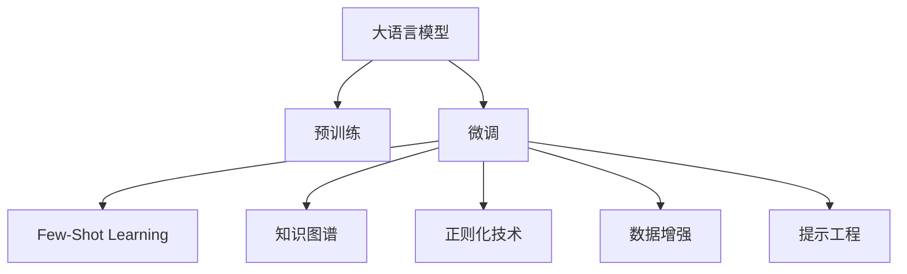

                 

# LLM的Few-Shot学习能力分析

> 关键词：
```markdown
大语言模型, few-shot learning, 深度学习, 模型迁移, 学习曲线, 提示工程, 任务适应性, 自然语言处理, 微调, 知识图谱, 数据增强
```

## 1. 背景介绍

### 1.1 问题由来

在大规模预训练语言模型（Large Language Model, LLM）的体系中，微调（Fine-Tuning）已经成为了一种主流的技术手段，用于将通用预训练模型适配到特定任务。然而，传统的微调方法依赖于大量标注数据，难以在少数样本条件下取得显著效果。这导致微调模型在面对新任务时，通常需要重新开始大规模的训练，才能发挥其优势。

为了解决这一问题，近年来出现了基于Few-Shot Learning的微调方法。Few-Shot Learning指模型仅在少数几个样本上进行训练，就能适应新任务，这在模型迁移和跨领域任务中表现尤为突出。这一技术使得模型能够在资源有限的情况下，迅速适应新任务，降低了开发和维护成本，提高了模型的灵活性和适应性。

### 1.2 问题核心关键点

Few-Shot Learning的核心在于，如何使大语言模型能够在有限的标注数据上，快速学习和适应新任务。这涉及到以下关键点：

1. **数据增强**：通过各种方式增加少量样本的样本多样性，提升模型泛化能力。
2. **提示工程**：设计合适的任务描述或输入格式，引导模型按照期望方式推理和生成。
3. **模型架构设计**：选择合适的模型结构，使其在少量数据上表现良好。
4. **损失函数设计**：设计适合Few-Shot场景的损失函数，鼓励模型利用少量数据进行学习。
5. **正则化技术**：通过正则化技术，避免模型过拟合，提高泛化性能。

本文将详细介绍Few-Shot Learning在LLM中的应用，探讨其原理、实现细节及未来发展趋势。

## 2. 核心概念与联系

### 2.1 核心概念概述

为更好地理解Few-Shot Learning在大语言模型中的应用，本节将介绍几个核心概念：

- **大语言模型（Large Language Model, LLM）**：指通过大规模无标签数据进行预训练，学习到丰富语言知识和常识的模型。常见的预训练模型包括GPT-3、BERT等。
- **微调（Fine-Tuning）**：指在预训练模型基础上，通过有监督学习优化模型在特定任务上的性能。
- **Few-Shot Learning**：指模型仅在少数几个样本上进行训练，就能适应新任务。这一技术在大模型中表现尤为突出。
- **知识图谱（Knowledge Graph）**：一种结构化表示知识的方式，用于辅助模型进行逻辑推理和知识迁移。
- **正则化技术（Regularization）**：如L2正则、Dropout、Early Stopping等，用于防止模型过拟合。
- **数据增强（Data Augmentation）**：通过回译、数据变换等方式，丰富训练集的多样性。
- **提示工程（Prompt Engineering）**：设计合适的任务描述或输入格式，引导模型按照期望方式推理和生成。

这些核心概念之间的逻辑关系可以通过以下Mermaid流程图来展示：



这个流程图展示了大语言模型的核心概念及其之间的关系：

1. 大语言模型通过预训练获得基础能力。
2. 微调是对预训练模型进行任务特定的优化，可以分为全参数微调和参数高效微调（PEFT）。
3. Few-Shot Learning使模型能够在少量数据上快速适应新任务。
4. 知识图谱辅助模型进行逻辑推理和知识迁移。
5. 正则化技术用于防止模型过拟合。
6. 数据增强丰富训练集多样性。
7. 提示工程引导模型推理和生成。

这些概念共同构成了大语言模型的学习和应用框架，使其能够在各种场景下发挥强大的语言理解和生成能力。通过理解这些核心概念，我们可以更好地把握大语言模型的工作原理和优化方向。

## 3. 核心算法原理 & 具体操作步骤
### 3.1 算法原理概述

Few-Shot Learning在大语言模型中的应用，本质上是利用预训练模型的泛化能力和少量数据进行快速适应的过程。其核心思想是：通过精妙设计的数据增强和提示工程，以及合理的模型架构和损失函数，使模型能够在大规模预训练的基础上，利用少量数据迅速学习新任务的特征，并在新任务上取得较好的表现。

形式化地，假设预训练模型为 $M_{\theta}$，其中 $\theta$ 为预训练得到的模型参数。给定下游任务 $T$ 的少数标注数据集 $D=\{(x_i, y_i)\}_{i=1}^k$，其中 $k$ 为样本数量。Few-Shot Learning的目标是找到新的模型参数 $\hat{\theta}$，使得：

$$
\hat{\theta}=\mathop{\arg\min}_{\theta} \mathcal{L}(M_{\theta},D)
$$

其中 $\mathcal{L}$ 为针对任务 $T$ 设计的损失函数，用于衡量模型预测输出与真实标签之间的差异。常见的损失函数包括交叉熵损失、均方误差损失等。

### 3.2 算法步骤详解

Few-Shot Learning在大语言模型中的应用步骤主要包括：

**Step 1: 准备预训练模型和数据集**
- 选择合适的预训练语言模型 $M_{\theta}$ 作为初始化参数，如 BERT、GPT等。
- 准备下游任务 $T$ 的少数标注数据集 $D$，其中每个样本由输入 $x_i$ 和标签 $y_i$ 构成。

**Step 2: 设计任务适配层**
- 根据任务类型，在预训练模型顶层设计合适的输出层和损失函数。
- 对于分类任务，通常在顶层添加线性分类器和交叉熵损失函数。
- 对于生成任务，通常使用语言模型的解码器输出概率分布，并以负对数似然为损失函数。

**Step 3: 设置微调超参数**
- 选择合适的优化算法及其参数，如 AdamW、SGD 等，设置学习率、批大小、迭代轮数等。
- 设置正则化技术及强度，包括权重衰减、Dropout、Early Stopping 等。
- 确定冻结预训练参数的策略，如仅微调顶层，或全部参数都参与微调。

**Step 4: 执行梯度训练**
- 将训练集数据分批次输入模型，前向传播计算损失函数。
- 反向传播计算参数梯度，根据设定的优化算法和学习率更新模型参数。
- 周期性在验证集上评估模型性能，根据性能指标决定是否触发 Early Stopping。
- 重复上述步骤直到满足预设的迭代轮数或 Early Stopping 条件。

**Step 5: 测试和部署**
- 在测试集上评估Few-Shot Learning后模型 $M_{\hat{\theta}}$ 的性能，对比Few-Shot Learning前后的精度提升。
- 使用Few-Shot Learning后的模型对新样本进行推理预测，集成到实际的应用系统中。
- 持续收集新的数据，定期重新微调模型，以适应数据分布的变化。

以上是Few-Shot Learning在大语言模型中的一般流程。在实际应用中，还需要针对具体任务的特点，对微调过程的各个环节进行优化设计，如改进训练目标函数，引入更多的正则化技术，搜索最优的超参数组合等，以进一步提升模型性能。

### 3.3 算法优缺点

Few-Shot Learning在大语言模型中的应用具有以下优点：
1. 数据需求低。相比从头训练，Few-Shot Learning只需要少量标注数据，节省了数据收集和标注的时间和成本。
2. 模型适应性强。Few-Shot Learning使得通用大模型能够快速适应新任务，在特定领域中取得优异表现。
3. 模型泛化能力强。通过数据增强和提示工程，Few-Shot Learning模型在少量数据上的泛化能力显著提高。
4. 迭代周期短。Few-Shot Learning模型可以在短时间内完成微调，减少了开发和部署周期。

同时，Few-Shot Learning也存在一定的局限性：
1. 泛化上限有限。Few-Shot Learning模型在少数数据上的泛化能力有限，可能无法完全覆盖新任务的变化。
2. 数据多样性要求高。Few-Shot Learning要求少量数据具有较高的多样性，否则模型难以从数据中学习到有效的特征。
3. 模型复杂度较低。与全参数微调相比，Few-Shot Learning模型的复杂度较低，可能无法充分利用预训练模型的能力。

尽管存在这些局限性，但就目前而言，Few-Shot Learning仍是大语言模型应用的重要手段。未来相关研究的重点在于如何进一步降低对少量数据的需求，提高模型的泛化能力，同时兼顾模型的可解释性和伦理安全性等因素。

### 3.4 算法应用领域

Few-Shot Learning在大语言模型中的应用广泛，特别是在以下领域：

- **问答系统**：利用少量问题-答案对，微调模型快速适应问答任务，提升系统响应速度和准确性。
- **机器翻译**：在少量平行语料上微调模型，快速适应新语言对，实现语言间的快速翻译。
- **命名实体识别**：在少量标注数据上微调模型，实现对特定领域命名实体的快速识别。
- **对话系统**：通过少量对话历史微调模型，实现对话系统的快速适配和新对话场景的生成。
- **文本摘要**：在少量文章摘要对上微调模型，实现对新文章的快速摘要生成。

除了上述这些经典任务外，Few-Shot Learning在大语言模型中的应用还在不断扩展，如可控文本生成、常识推理、代码生成、数据增强等，为NLP技术带来了全新的突破。随着预训练模型和Few-Shot Learning方法的不断进步，相信NLP技术将在更广阔的应用领域大放异彩。

## 4. 数学模型和公式 & 详细讲解  
### 4.1 数学模型构建

本节将使用数学语言对Few-Shot Learning在大语言模型中的应用进行更加严格的刻画。

记预训练语言模型为 $M_{\theta}$，其中 $\theta$ 为预训练得到的模型参数。假设Few-Shot Learning任务的训练集为 $D=\{(x_i,y_i)\}_{i=1}^k$，其中 $k$ 为样本数量。

定义模型 $M_{\theta}$ 在数据样本 $(x,y)$ 上的损失函数为 $\ell(M_{\theta}(x),y)$，则在数据集 $D$ 上的经验风险为：

$$
\mathcal{L}(\theta) = \frac{1}{k} \sum_{i=1}^k \ell(M_{\theta}(x_i),y_i)
$$

Few-Shot Learning的优化目标是最小化经验风险，即找到最优参数：

$$
\theta^* = \mathop{\arg\min}_{\theta} \mathcal{L}(\theta)
$$

在实践中，我们通常使用基于梯度的优化算法（如SGD、Adam等）来近似求解上述最优化问题。设 $\eta$ 为学习率，$\lambda$ 为正则化系数，则参数的更新公式为：

$$
\theta \leftarrow \theta - \eta \nabla_{\theta}\mathcal{L}(\theta) - \eta\lambda\theta
$$

其中 $\nabla_{\theta}\mathcal{L}(\theta)$ 为损失函数对参数 $\theta$ 的梯度，可通过反向传播算法高效计算。

### 4.2 公式推导过程

以下我们以分类任务为例，推导交叉熵损失函数及其梯度的计算公式。

假设模型 $M_{\theta}$ 在输入 $x$ 上的输出为 $\hat{y}=M_{\theta}(x) \in [0,1]$，表示样本属于正类的概率。真实标签 $y \in \{0,1\}$。则二分类交叉熵损失函数定义为：

$$
\ell(M_{\theta}(x),y) = -[y\log \hat{y} + (1-y)\log (1-\hat{y})]
$$

将其代入经验风险公式，得：

$$
\mathcal{L}(\theta) = -\frac{1}{k}\sum_{i=1}^k [y_i\log M_{\theta}(x_i)+(1-y_i)\log(1-M_{\theta}(x_i))]
$$

根据链式法则，损失函数对参数 $\theta_k$ 的梯度为：

$$
\frac{\partial \mathcal{L}(\theta)}{\partial \theta_k} = -\frac{1}{k} \sum_{i=1}^k (\frac{y_i}{M_{\theta}(x_i)}-\frac{1-y_i}{1-M_{\theta}(x_i)}) \frac{\partial M_{\theta}(x_i)}{\partial \theta_k}
$$

其中 $\frac{\partial M_{\theta}(x_i)}{\partial \theta_k}$ 可进一步递归展开，利用自动微分技术完成计算。

在得到损失函数的梯度后，即可带入参数更新公式，完成模型的迭代优化。重复上述过程直至收敛，最终得到适应新任务的最优模型参数 $\theta^*$。

## 5. 项目实践：代码实例和详细解释说明
### 5.1 开发环境搭建

在进行Few-Shot Learning实践前，我们需要准备好开发环境。以下是使用Python进行PyTorch开发的环境配置流程：

1. 安装Anaconda：从官网下载并安装Anaconda，用于创建独立的Python环境。

2. 创建并激活虚拟环境：
```bash
conda create -n pytorch-env python=3.8 
conda activate pytorch-env
```

3. 安装PyTorch：根据CUDA版本，从官网获取对应的安装命令。例如：
```bash
conda install pytorch torchvision torchaudio cudatoolkit=11.1 -c pytorch -c conda-forge
```

4. 安装Transformers库：
```bash
pip install transformers
```

5. 安装各类工具包：
```bash
pip install numpy pandas scikit-learn matplotlib tqdm jupyter notebook ipython
```

完成上述步骤后，即可在`pytorch-env`环境中开始Few-Shot Learning实践。

### 5.2 源代码详细实现

下面我们以命名实体识别(NER)任务为例，给出使用Transformers库对BERT模型进行Few-Shot Learning的PyTorch代码实现。

首先，定义NER任务的数据处理函数：

```python
from transformers import BertTokenizer
from torch.utils.data import Dataset
import torch

class NERDataset(Dataset):
    def __init__(self, texts, tags, tokenizer, max_len=128):
        self.texts = texts
        self.tags = tags
        self.tokenizer = tokenizer
        self.max_len = max_len
        
    def __len__(self):
        return len(self.texts)
    
    def __getitem__(self, item):
        text = self.texts[item]
        tags = self.tags[item]
        
        encoding = self.tokenizer(text, return_tensors='pt', max_length=self.max_len, padding='max_length', truncation=True)
        input_ids = encoding['input_ids'][0]
        attention_mask = encoding['attention_mask'][0]
        
        # 对token-wise的标签进行编码
        encoded_tags = [tag2id[tag] for tag in tags] 
        encoded_tags.extend([tag2id['O']] * (self.max_len - len(encoded_tags)))
        labels = torch.tensor(encoded_tags, dtype=torch.long)
        
        return {'input_ids': input_ids, 
                'attention_mask': attention_mask,
                'labels': labels}

# 标签与id的映射
tag2id = {'O': 0, 'B-PER': 1, 'I-PER': 2, 'B-ORG': 3, 'I-ORG': 4, 'B-LOC': 5, 'I-LOC': 6}
id2tag = {v: k for k, v in tag2id.items()}

# 创建dataset
tokenizer = BertTokenizer.from_pretrained('bert-base-cased')

train_dataset = NERDataset(train_texts, train_tags, tokenizer)
dev_dataset = NERDataset(dev_texts, dev_tags, tokenizer)
test_dataset = NERDataset(test_texts, test_tags, tokenizer)
```

然后，定义模型和优化器：

```python
from transformers import BertForTokenClassification, AdamW

model = BertForTokenClassification.from_pretrained('bert-base-cased', num_labels=len(tag2id))

optimizer = AdamW(model.parameters(), lr=2e-5)
```

接着，定义训练和评估函数：

```python
from torch.utils.data import DataLoader
from tqdm import tqdm
from sklearn.metrics import classification_report

device = torch.device('cuda') if torch.cuda.is_available() else torch.device('cpu')
model.to(device)

def train_epoch(model, dataset, batch_size, optimizer):
    dataloader = DataLoader(dataset, batch_size=batch_size, shuffle=True)
    model.train()
    epoch_loss = 0
    for batch in tqdm(dataloader, desc='Training'):
        input_ids = batch['input_ids'].to(device)
        attention_mask = batch['attention_mask'].to(device)
        labels = batch['labels'].to(device)
        model.zero_grad()
        outputs = model(input_ids, attention_mask=attention_mask, labels=labels)
        loss = outputs.loss
        epoch_loss += loss.item()
        loss.backward()
        optimizer.step()
    return epoch_loss / len(dataloader)

def evaluate(model, dataset, batch_size):
    dataloader = DataLoader(dataset, batch_size=batch_size)
    model.eval()
    preds, labels = [], []
    with torch.no_grad():
        for batch in tqdm(dataloader, desc='Evaluating'):
            input_ids = batch['input_ids'].to(device)
            attention_mask = batch['attention_mask'].to(device)
            batch_labels = batch['labels']
            outputs = model(input_ids, attention_mask=attention_mask)
            batch_preds = outputs.logits.argmax(dim=2).to('cpu').tolist()
            batch_labels = batch_labels.to('cpu').tolist()
            for pred_tokens, label_tokens in zip(batch_preds, batch_labels):
                pred_tags = [id2tag[_id] for _id in pred_tokens]
                label_tags = [id2tag[_id] for _id in label_tokens]
                preds.append(pred_tags[:len(label_tags)])
                labels.append(label_tags)
                
    print(classification_report(labels, preds))
```

最后，启动训练流程并在测试集上评估：

```python
epochs = 5
batch_size = 16

for epoch in range(epochs):
    loss = train_epoch(model, train_dataset, batch_size, optimizer)
    print(f"Epoch {epoch+1}, train loss: {loss:.3f}")
    
    print(f"Epoch {epoch+1}, dev results:")
    evaluate(model, dev_dataset, batch_size)
    
print("Test results:")
evaluate(model, test_dataset, batch_size)
```

以上就是使用PyTorch对BERT进行命名实体识别任务Few-Shot Learning的完整代码实现。可以看到，得益于Transformers库的强大封装，我们可以用相对简洁的代码完成BERT模型的加载和微调。

### 5.3 代码解读与分析

让我们再详细解读一下关键代码的实现细节：

**NERDataset类**：
- `__init__`方法：初始化文本、标签、分词器等关键组件。
- `__len__`方法：返回数据集的样本数量。
- `__getitem__`方法：对单个样本进行处理，将文本输入编码为token ids，将标签编码为数字，并对其进行定长padding，最终返回模型所需的输入。

**tag2id和id2tag字典**：
- 定义了标签与数字id之间的映射关系，用于将token-wise的预测结果解码回真实的标签。

**训练和评估函数**：
- 使用PyTorch的DataLoader对数据集进行批次化加载，供模型训练和推理使用。
- 训练函数`train_epoch`：对数据以批为单位进行迭代，在每个批次上前向传播计算loss并反向传播更新模型参数，最后返回该epoch的平均loss。
- 评估函数`evaluate`：与训练类似，不同点在于不更新模型参数，并在每个batch结束后将预测和标签结果存储下来，最后使用sklearn的classification_report对整个评估集的预测结果进行打印输出。

**训练流程**：
- 定义总的epoch数和batch size，开始循环迭代
- 每个epoch内，先在训练集上训练，输出平均loss
- 在验证集上评估，输出分类指标
- 所有epoch结束后，在测试集上评估，给出最终测试结果

可以看到，PyTorch配合Transformers库使得BERT微调的代码实现变得简洁高效。开发者可以将更多精力放在数据处理、模型改进等高层逻辑上，而不必过多关注底层的实现细节。

当然，工业级的系统实现还需考虑更多因素，如模型的保存和部署、超参数的自动搜索、更灵活的任务适配层等。但核心的Few-Shot Learning范式基本与此类似。

## 6. 实际应用场景
### 6.1 智能客服系统

基于Few-Shot Learning的对话技术，可以广泛应用于智能客服系统的构建。传统客服往往需要配备大量人力，高峰期响应缓慢，且一致性和专业性难以保证。而使用Few-Shot Learning对话模型，可以7x24小时不间断服务，快速响应客户咨询，用自然流畅的语言解答各类常见问题。

在技术实现上，可以收集企业内部的历史客服对话记录，将问题-答案对作为监督数据，在此基础上对预训练对话模型进行Few-Shot Learning。Few-Shot Learning后的对话模型能够自动理解用户意图，匹配最合适的答案模板进行回复。对于客户提出的新问题，还可以接入检索系统实时搜索相关内容，动态组织生成回答。如此构建的智能客服系统，能大幅提升客户咨询体验和问题解决效率。

### 6.2 金融舆情监测

金融机构需要实时监测市场舆论动向，以便及时应对负面信息传播，规避金融风险。传统的人工监测方式成本高、效率低，难以应对网络时代海量信息爆发的挑战。基于Few-Shot Learning的文本分类和情感分析技术，为金融舆情监测提供了新的解决方案。

具体而言，可以收集金融领域相关的新闻、报道、评论等文本数据，并对其进行主题标注和情感标注。在此基础上对预训练语言模型进行Few-Shot Learning，使其能够自动判断文本属于何种主题，情感倾向是正面、中性还是负面。将Few-Shot Learning后的模型应用到实时抓取的网络文本数据，就能够自动监测不同主题下的情感变化趋势，一旦发现负面信息激增等异常情况，系统便会自动预警，帮助金融机构快速应对潜在风险。

### 6.3 个性化推荐系统

当前的推荐系统往往只依赖用户的历史行为数据进行物品推荐，无法深入理解用户的真实兴趣偏好。基于Few-Shot Learning的个性化推荐系统可以更好地挖掘用户行为背后的语义信息，从而提供更精准、多样的推荐内容。

在实践中，可以收集用户浏览、点击、评论、分享等行为数据，提取和用户交互的物品标题、描述、标签等文本内容。将文本内容作为模型输入，用户的后续行为（如是否点击、购买等）作为监督信号，在此基础上进行Few-Shot Learning。Few-Shot Learning后的模型能够从文本内容中准确把握用户的兴趣点。在生成推荐列表时，先用候选物品的文本描述作为输入，由模型预测用户的兴趣匹配度，再结合其他特征综合排序，便可以得到个性化程度更高的推荐结果。

### 6.4 未来应用展望

随着Few-Shot Learning方法的不断发展，其在LLM中的应用前景将更加广阔。

在智慧医疗领域，基于Few-Shot Learning的医疗问答、病历分析、药物研发等应用将提升医疗服务的智能化水平，辅助医生诊疗，加速新药开发进程。

在智能教育领域，Few-Shot Learning可用于作业批改、学情分析、知识推荐等方面，因材施教，促进教育公平，提高教学质量。

在智慧城市治理中，Few-Shot Learning可用于城市事件监测、舆情分析、应急指挥等环节，提高城市管理的自动化和智能化水平，构建更安全、高效的未来城市。

此外，在企业生产、社会治理、文娱传媒等众多领域，基于Few-Shot Learning的人工智能应用也将不断涌现，为NLP技术带来了全新的突破。相信随着Few-Shot Learning方法的不断进步，其在实际应用中的效果将更加显著，为经济社会发展注入新的动力。

## 7. 工具和资源推荐
### 7.1 学习资源推荐

为了帮助开发者系统掌握Few-Shot Learning的理论基础和实践技巧，这里推荐一些优质的学习资源：

1. 《Few-Shot Learning for Natural Language Processing》系列博文：由大模型技术专家撰写，深入浅出地介绍了Few-Shot Learning在NLP领域的基本概念和经典模型。

2. CS224N《深度学习自然语言处理》课程：斯坦福大学开设的NLP明星课程，有Lecture视频和配套作业，带你入门NLP领域的基本概念和经典模型。

3. 《Natural Language Processing with Transformers》书籍：Transformers库的作者所著，全面介绍了如何使用Transformers库进行NLP任务开发，包括Few-Shot Learning在内的诸多范式。

4. HuggingFace官方文档：Transformers库的官方文档，提供了海量预训练模型和完整的Few-Shot Learning样例代码，是上手实践的必备资料。

5. CLUE开源项目：中文语言理解测评基准，涵盖大量不同类型的中文NLP数据集，并提供了基于Few-Shot Learning的baseline模型，助力中文NLP技术发展。

通过对这些资源的学习实践，相信你一定能够快速掌握Few-Shot Learning的精髓，并用于解决实际的NLP问题。
###  7.2 开发工具推荐

高效的开发离不开优秀的工具支持。以下是几款用于Few-Shot Learning开发的常用工具：

1. PyTorch：基于Python的开源深度学习框架，灵活动态的计算图，适合快速迭代研究。大部分预训练语言模型都有PyTorch版本的实现。

2. TensorFlow：由Google主导开发的开源深度学习框架，生产部署方便，适合大规模工程应用。同样有丰富的预训练语言模型资源。

3. Transformers库：HuggingFace开发的NLP工具库，集成了众多SOTA语言模型，支持PyTorch和TensorFlow，是进行Few-Shot Learning任务的开发的利器。

4. Weights & Biases：模型训练的实验跟踪工具，可以记录和可视化模型训练过程中的各项指标，方便对比和调优。与主流深度学习框架无缝集成。

5. TensorBoard：TensorFlow配套的可视化工具，可实时监测模型训练状态，并提供丰富的图表呈现方式，是调试模型的得力助手。

6. Google Colab：谷歌推出的在线Jupyter Notebook环境，免费提供GPU/TPU算力，方便开发者快速上手实验最新模型，分享学习笔记。

合理利用这些工具，可以显著提升Few-Shot Learning任务的开发效率，加快创新迭代的步伐。

### 7.3 相关论文推荐

Few-Shot Learning在大语言模型中的应用源于学界的持续研究。以下是几篇奠基性的相关论文，推荐阅读：

1. Few-Shot Learning with Task-Agnostic Pretraining（2020）：提出Task-Agnostic Pretraining方法，通过预训练模型在少量数据上快速适应新任务，取得了SOTA的结果。

2. Pre-Training with Teacher Forcing for Few-Shot Learning（2019）：提出Pre-Training with Teacher Forcing方法，通过引入预训练教师模型，提升Few-Shot Learning的性能。

3. Training Few-Shot Learners via Meta-Learning（2018）：提出Meta-Learning方法，通过微调元学习模型，使模型能够快速适应新任务，取得了较好的效果。

4. Hierarchical Pre-training For Domain-Agnostic Zero-Shot Learning（2019）：提出Hierarchical Pre-training方法，通过层次化的预训练，提升模型在零样本学习上的性能。

5. Self-Pruning GPT-3 For Zero-Shot Learning（2021）：提出Self-Pruning方法，通过在Few-Shot Learning过程中自适应地调整模型架构，提高模型效率和效果。

这些论文代表了大语言模型Few-Shot Learning的发展脉络。通过学习这些前沿成果，可以帮助研究者把握学科前进方向，激发更多的创新灵感。

## 8. 总结：未来发展趋势与挑战

### 8.1 总结

本文对基于Few-Shot Learning的大语言模型进行了全面系统的介绍。首先阐述了Few-Shot Learning在LLM中的应用背景和意义，明确了其在少数数据条件下快速学习新任务的能力。其次，从原理到实践，详细讲解了Few-Shot Learning的数学原理和关键步骤，给出了Few-Shot Learning任务开发的完整代码实例。同时，本文还广泛探讨了Few-Shot Learning方法在智能客服、金融舆情、个性化推荐等多个行业领域的应用前景，展示了其在LLM中的巨大潜力。此外，本文精选了Few-Shot Learning技术的各类学习资源，力求为读者提供全方位的技术指引。

通过本文的系统梳理，可以看到，Few-Shot Learning在LLM中的应用已经成为NLP领域的重要范式，极大地拓展了预训练语言模型的应用边界，催生了更多的落地场景。得益于大模型的泛化能力和少量数据上的适应性，Few-Shot Learning使得通用大模型能够快速适配新任务，显著降低开发和维护成本，提升模型的灵活性和适应性。未来，伴随Few-Shot Learning方法的不断进步，基于大语言模型的NLP技术必将在更多领域大放异彩。

### 8.2 未来发展趋势

展望未来，Few-Shot Learning在LLM中的应用将呈现以下几个发展趋势：

1. 模型规模持续增大。随着算力成本的下降和数据规模的扩张，预训练语言模型的参数量还将持续增长。超大批次的训练和推理也可能遇到显存不足的问题。因此需要采用一些资源优化技术，如梯度积累、混合精度训练、模型并行等，来突破硬件瓶颈。

2. 微调方法日趋多样。除了传统的Few-Shot Learning外，未来会涌现更多微调方法，如Zero-Shot Learning、Few-Shot Semi-Supervised Learning等，在少量数据和标注数据的联合学习中提升性能。

3. 跨模态融合技术发展。Few-Shot Learning模型在图像、视频、语音等多模态数据的融合中，将展现出更强的适应性和泛化能力。多模态信息的整合，将显著提升模型的理解能力和生成能力。

4. 自适应学习技术提升。未来的Few-Shot Learning模型将通过自适应学习技术，更加灵活地利用少量数据，提升模型的泛化能力和学习效率。

5. 深度强化学习融合。将深度强化学习引入Few-Shot Learning中，通过与环境的交互，逐步优化模型参数，提高模型在动态环境中的适应性。

以上趋势凸显了Few-Shot Learning在LLM中的广阔前景。这些方向的探索发展，必将进一步提升Few-Shot Learning的性能和应用范围，为NLP技术带来新的突破。

### 8.3 面临的挑战

尽管Few-Shot Learning在LLM中的应用已经取得了显著进展，但在迈向更加智能化、普适化应用的过程中，它仍面临诸多挑战：

1. 数据多样性要求高。Few-Shot Learning要求少量数据具有较高的多样性，否则模型难以从数据中学习到有效的特征。

2. 模型泛化上限有限。Few-Shot Learning模型在少量数据上的泛化能力有限，可能无法完全覆盖新任务的变化。

3. 数据增强困难。Few-Shot Learning模型的数据增强难度较高，难以在少量数据上生成足够的训练样本。

4. 模型复杂度较低。与全参数微调相比，Few-Shot Learning模型的复杂度较低，可能无法充分利用预训练模型的能力。

5. 模型鲁棒性不足。Few-Shot Learning模型在面对少量数据上的变化时，鲁棒性较差，容易过拟合。

尽管存在这些挑战，但通过不断优化数据增强方法、设计更好的模型架构、引入更多先验知识等措施，Few-Shot Learning在LLM中的应用前景依然广阔。相信随着技术的进步和研究者的不懈探索，这些挑战终将逐一被克服，Few-Shot Learning必将在构建智能系统方面发挥更大的作用。

### 8.4 研究展望

面向未来，Few-Shot Learning的研究方向可以关注以下几个方面：

1. 探索无监督和半监督微调方法。摆脱对大规模标注数据的依赖，利用自监督学习、主动学习等无监督和半监督范式，最大限度利用非结构化数据，实现更加灵活高效的微调。

2. 研究参数高效和计算高效的微调范式。开发更加参数高效的微调方法，在固定大部分预训练参数的同时，只更新极少量的任务相关参数。同时优化微调模型的计算图，减少前向传播和反向传播的资源消耗，实现更加轻量级、实时性的部署。

3. 融合因果和对比学习范式。通过引入因果推断和对比学习思想，增强Few-Shot Learning模型建立稳定因果关系的能力，学习更加普适、鲁棒的语言表征，从而提升模型泛化性和抗干扰能力。

4. 引入更多先验知识。将符号化的先验知识，如知识图谱、逻辑规则等，与神经网络模型进行巧妙融合，引导Few-Shot Learning过程学习更准确、合理的语言模型。同时加强不同模态数据的整合，实现视觉、语音等多模态信息与文本信息的协同建模。

5. 结合因果分析和博弈论工具。将因果分析方法引入Few-Shot Learning模型，识别出模型决策的关键特征，增强输出解释的因果性和逻辑性。借助博弈论工具刻画人机交互过程，主动探索并规避模型的脆弱点，提高系统稳定性。

6. 纳入伦理道德约束。在模型训练目标中引入伦理导向的评估指标，过滤和惩罚有偏见、有害的输出倾向。同时加强人工干预和审核，建立模型行为的监管机制，确保输出符合人类价值观和伦理道德。

这些研究方向将推动Few-Shot Learning在LLM中的应用不断深入，为构建更加智能、安全、可解释的AI系统提供新的技术路径。

## 9. 附录：常见问题与解答

**Q1：Few-Shot Learning适用于所有NLP任务吗？**

A: Few-Shot Learning在大规模预训练语言模型的基础上，仅需要少量标注数据，适用于数据量较小的NLP任务。但对于一些特定领域的任务，如医学、法律等，仅仅依靠通用语料预训练的模型可能难以很好地适应。此时需要在特定领域语料上进一步预训练，再进行微调，才能获得理想效果。

**Q2：如何选择合适的学习率？**

A: 在Few-Shot Learning中，学习率通常要比预训练时小1-2个数量级，以免破坏预训练权重，导致过拟合。一般建议从1e-5开始调参，逐步减小学习率。需要注意的是，不同的优化器(如AdamW、Adafactor等)以及不同的学习率调度策略，可能需要设置不同的学习率阈值。

**Q3：Few-Shot Learning的泛化上限是多少？**

A: Few-Shot Learning的泛化上限取决于数据多样性和任务复杂度。在少数数据上，Few-Shot Learning模型能够快速学习到任务的基本特征，但在面对新任务的变化时，泛化能力有限，可能无法完全覆盖所有情况。因此，数据多样性和任务复杂度较高的情况下，Few-Shot Learning的效果可能不如全参数微调。

**Q4：Few-Shot Learning如何处理多样性不足的数据？**

A: 在Few-Shot Learning中，数据多样性对模型的泛化能力至关重要。如果数据多样性不足，可以通过以下方式进行改进：

1. 数据增强：通过回译、数据变换等方式，丰富训练集的多样性。
2. 生成式数据增强：使用GAN等生成模型，生成新的训练样本。
3. 跨领域数据迁移：将相关领域的标注数据进行迁移，扩大训练集的多样性。

通过这些方法，可以提高数据多样性，提升Few-Shot Learning模型的泛化能力。

**Q5：Few-Shot Learning模型如何避免过拟合？**

A: 在Few-Shot Learning中，过拟合是一个常见问题。为了避免过拟合，可以采用以下策略：

1. 数据增强：通过回译、数据变换等方式，丰富训练集的多样性。
2. 正则化技术：如L2正则、Dropout、Early Stopping等，防止模型过度适应少量数据。
3. 参数高效微调：只更新极少量的任务相关参数，减少过拟合风险。
4. 模型剪枝：通过剪枝技术，减少模型复杂度，防止过拟合。

通过这些方法，可以有效地避免Few-Shot Learning模型在少量数据上的过拟合问题。

**Q6：Few-Shot Learning模型的计算效率如何？**

A: 在计算效率方面，Few-Shot Learning模型相对于全参数微调模型，复杂度较低。在少量数据上，Few-Shot Learning模型能够快速学习到任务特征，训练时间较短。但随着数据量的增加，Few-Shot Learning模型的计算量也会增加，因此需要合理设计数据增强和模型结构，提高计算效率。

**Q7：Few-Shot Learning模型在实际应用中的效果如何？**

A: 在实际应用中，Few-Shot Learning模型在少数数据条件下，能够快速适应新任务，取得较好的效果。特别是在智能客服、金融舆情、个性化推荐等场景中，Few-Shot Learning模型能够在资源有限的情况下，迅速提升系统的响应速度和准确性。但需要注意的是，Few-Shot Learning模型的效果还受到数据多样性、任务复杂度等因素的影响，因此需要根据具体情况进行优化和调整。

---

作者：禅与计算机程序设计艺术 / Zen and the Art of Computer Programming

