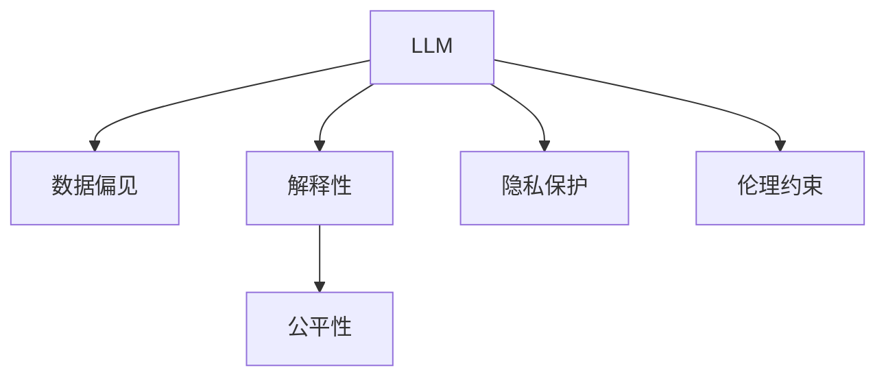

                 

# LLM的伦理挑战：如何约束AI行为

## 1. 背景介绍

随着人工智能（AI）技术的迅猛发展，尤其是大规模语言模型（LLM）的兴起，我们正逐步步入一个“智能新纪元”。然而，这项技术带来的不仅是便利，同时也伴随着一系列复杂的伦理挑战。LLM作为一种高度复杂的AI系统，其行为和决策过程往往难以完全透明、可解释，甚至在极端情况下可能与人类价值观和社会伦理产生冲突。这些问题迫切要求我们对LLM的伦理约束进行深入探讨，以确保其在实际应用中的安全性、公平性和透明性。

### 1.1 问题由来

LLM的伦理挑战源自其高度复杂且黑箱化的性质。LLM通过深度学习技术，从大量无标签数据中学习到复杂的语言模式和逻辑推理能力，能够自动理解和生成文本，解决许多复杂的NLP问题。然而，这种高度自治的学习过程也使得其行为难以预测和解释，带来一系列伦理风险：

1. **偏见与歧视**：如果训练数据中存在偏见，LLM可能在输出中反映并放大这些偏见，导致歧视性或有害的输出。
2. **虚假信息**：LLM可能被恶意利用，生成误导性、虚假信息，影响社会稳定和信息安全。
3. **隐私泄露**：LLM在处理个人数据时，可能因数据泄露而侵犯用户隐私。
4. **人身安全威胁**：在应用不当或被恶意操控的情况下，LLM可能对人类造成直接的身体伤害。
5. **知识产权侵害**：LLM可能在未经授权的情况下生成并传播他人的作品，侵犯知识产权。

这些问题不仅影响LLM的应用前景，还可能引发严重的社会和法律问题。因此，研究如何约束LLM的行为，确保其符合伦理规范，是当前AI领域的重要课题。

## 2. 核心概念与联系

### 2.1 核心概念概述

为更好地理解LLM伦理约束的机制，本节将介绍几个密切相关的核心概念：

- **LLM**：以自回归（如GPT）或自编码（如BERT）模型为代表的大规模预训练语言模型，通过在大规模无标签文本语料上进行预训练，学习通用的语言表示，具备强大的语言理解和生成能力。

- **数据偏见**：指训练数据中存在的系统性偏见，可能导致模型学习到并放大这些偏见，进而产生歧视性输出。

- **解释性**：指模型的决策过程是否能够被清晰、透明地解释，对于模型输出结果的可理解性和可信度具有重要影响。

- **公平性**：指模型在不同群体间的表现是否均衡，避免对某些群体的不公平对待。

- **隐私保护**：指在数据处理和模型训练过程中，如何保护用户隐私，避免个人信息的泄露和滥用。

- **伦理约束**：指对LLM的行为进行规范和限制，确保其符合社会伦理和法律要求，避免产生负面影响。

这些概念之间的逻辑关系可以通过以下Mermaid流程图来展示：



这个流程图展示了一些核心概念之间的联系：

1. LLM的输出可能受到数据偏见的影响，因此需要采取措施减少模型中的偏见。
2. 模型解释性越强，越容易发现和纠正数据偏见，确保模型的公平性。
3. 保护用户隐私是LLM伦理约束的重要组成部分。
4. 伦理约束不仅包括模型的输出结果，还涉及模型的训练和数据处理过程。

## 3. 核心算法原理 & 具体操作步骤

### 3.1 算法原理概述

约束LLM的伦理行为，可以通过多种方法实现。其中，最基础的是在训练和推理过程中，引入特定的约束机制，确保模型行为符合伦理规范。这些机制包括但不限于：

1. **数据清洗**：去除或修正训练数据中的偏见和有害信息，减少模型在训练过程中的负面影响。
2. **公平性约束**：在模型训练过程中，引入公平性约束，确保模型在不同群体间的表现均衡。
3. **解释性增强**：使用可解释性技术，增加模型输出的透明性和可信度。
4. **隐私保护技术**：在数据处理和模型训练过程中，采用隐私保护技术，如差分隐私、联邦学习等，确保用户隐私不受侵害。
5. **安全约束**：通过安全审计和技术手段，确保模型在应用过程中不受恶意攻击，避免人身安全威胁和知识产权侵害。

这些约束机制可以单独使用，也可以结合使用，具体取决于模型的应用场景和具体需求。

### 3.2 算法步骤详解

以下是约束LLM伦理行为的详细步骤：

**Step 1: 数据准备与清洗**

- 收集训练数据，并进行初步清洗，去除含有偏见和有害信息的样本。
- 对数据进行标注，确保数据集中各类样本数量均衡，避免数据偏见。
- 使用差分隐私等技术，对敏感信息进行去标识化处理，确保用户隐私不受侵害。

**Step 2: 模型训练与公平性约束**

- 使用公平性约束技术（如Fairness aware training），对模型进行训练，确保其在不同群体间的表现均衡。
- 引入对抗样本，进行对抗训练，提高模型的鲁棒性和安全性。
- 在训练过程中，加入可解释性模块，如LIME、SHAP等，增强模型的可解释性。

**Step 3: 模型部署与监控**

- 在实际应用中，将训练好的模型部署到生产环境，进行在线推理。
- 使用安全审计工具，对模型进行定期检查，发现潜在的安全漏洞和伦理风险。
- 定期更新模型参数，加入新的公平性约束和隐私保护技术，确保模型行为符合最新的伦理规范。

### 3.3 算法优缺点

约束LLM的伦理行为，具有一定的优势和局限性：

**优点**：
1. **增强公平性**：通过公平性约束，确保模型在不同群体间的表现均衡，避免歧视和偏见。
2. **提高可信度**：增加模型的可解释性，使决策过程透明，提高用户对模型输出的信任度。
3. **保护隐私**：采用隐私保护技术，确保用户隐私不受侵害，增强模型应用的合法性。

**局限性**：
1. **计算成本高**：公平性约束和隐私保护技术通常需要额外的计算资源和时间，增加了模型训练的复杂度。
2. **技术门槛高**：涉及的技术较为复杂，需要跨学科知识，对研究者和开发者提出了较高的要求。
3. **效果有限**：部分技术可能无法完全消除数据中的偏见，某些应用场景下仍然存在伦理风险。

尽管存在这些局限性，但通过合理的技术手段和管理措施，可以在很大程度上降低LLM带来的伦理风险，保障其安全、公平和透明。

### 3.4 算法应用领域

约束LLM伦理行为的方法在多个领域得到了广泛应用：

- **医疗**：确保医疗AI系统在诊断和治疗过程中公平、透明，避免因数据偏见导致误诊误治。
- **金融**：使用公平性约束和隐私保护技术，确保金融AI在信用评估、贷款审批等方面的公正性和合法性。
- **司法**：在司法决策中引入公平性约束和可解释性技术，确保司法判决的公正性和透明性。
- **教育**：使用公平性约束和隐私保护技术，确保教育AI系统在教学评估、推荐系统等方面的公平性和隐私保护。
- **媒体**：使用可解释性和隐私保护技术，确保新闻推荐、内容生成等应用的透明性和用户隐私保护。

## 4. 数学模型和公式 & 详细讲解

### 4.1 数学模型构建

约束LLM的伦理行为，可以通过构建数学模型来进行系统化的描述和优化。

假设LLM的训练数据为 $D=\{(x_i,y_i)\}_{i=1}^N$，其中 $x_i$ 为输入样本，$y_i$ 为标签。设模型参数为 $\theta$，公平性约束为 $C$，隐私保护机制为 $P$。则目标函数可以定义为：

$$
\min_{\theta} \mathcal{L}(\theta) + \lambda_C f_C(\theta) + \lambda_P p_P(\theta)
$$

其中 $\mathcal{L}(\theta)$ 为损失函数，$f_C(\theta)$ 为公平性约束函数，$p_P(\theta)$ 为隐私保护函数，$\lambda_C$ 和 $\lambda_P$ 为惩罚系数。

### 4.2 公式推导过程

以下我们以公平性约束为例，推导一个简单的公平性约束函数 $f_C(\theta)$：

假设模型在训练集 $D$ 上的平均输出为 $\hat{y}(\theta)=\mathbb{E}_{x\sim D} [M_{\theta}(x)]$，其中 $M_{\theta}(x)$ 为模型的预测函数。设 $S$ 为敏感属性，$S\in\{0,1\}$。则公平性约束函数可以定义为：

$$
f_C(\theta) = \mathbb{E}_{x\sim D, S} [(\hat{y}(\theta) - \hat{y}_S(\theta))^2]
$$

其中 $\hat{y}_S(\theta)$ 为模型在敏感属性 $S=1$ 的子集 $D_S$ 上的平均输出。$f_C(\theta)$ 衡量了模型在敏感属性上的输出差异，如果 $\hat{y}_S(\theta) \approx \hat{y}(\theta)$，则说明模型在处理敏感属性时不存在显著的偏见。

### 4.3 案例分析与讲解

假设我们使用Bert模型进行性别公平的贷款审批预测，模型参数为 $\theta$，训练集为 $D$，其中包含大量带有性别属性标签的贷款申请数据。

1. **数据准备**：将贷款申请数据划分为训练集 $D$ 和测试集 $D'$。对训练集进行公平性处理，去除或修正数据中的性别偏见。
2. **模型训练**：使用公平性约束函数 $f_C(\theta)$，优化模型参数 $\theta$。
3. **模型评估**：在测试集 $D'$ 上评估模型性能，确保其在处理性别属性时表现均衡。

通过这些步骤，我们可以确保模型在贷款审批等涉及性别公平的场景中，不因数据偏见而产生歧视性决策。

## 5. 项目实践：代码实例和详细解释说明

### 5.1 开发环境搭建

在进行LLM伦理约束的实践前，我们需要准备好开发环境。以下是使用Python进行PyTorch开发的环境配置流程：

1. 安装Anaconda：从官网下载并安装Anaconda，用于创建独立的Python环境。

2. 创建并激活虚拟环境：
```bash
conda create -n pytorch-env python=3.8 
conda activate pytorch-env
```

3. 安装PyTorch：根据CUDA版本，从官网获取对应的安装命令。例如：
```bash
conda install pytorch torchvision torchaudio cudatoolkit=11.1 -c pytorch -c conda-forge
```

4. 安装Transformers库：
```bash
pip install transformers
```

5. 安装各类工具包：
```bash
pip install numpy pandas scikit-learn matplotlib tqdm jupyter notebook ipython
```

完成上述步骤后，即可在`pytorch-env`环境中开始实践。

### 5.2 源代码详细实现

这里我们以性别公平的贷款审批预测为例，给出使用Transformers库对Bert模型进行公平性约束的PyTorch代码实现。

首先，定义数据处理函数：

```python
from transformers import BertTokenizer
from torch.utils.data import Dataset
import torch

class LoanDataset(Dataset):
    def __init__(self, texts, labels, tokenizer, max_len=128):
        self.texts = texts
        self.labels = labels
        self.tokenizer = tokenizer
        self.max_len = max_len
        
    def __len__(self):
        return len(self.texts)
    
    def __getitem__(self, item):
        text = self.texts[item]
        label = self.labels[item]
        
        encoding = self.tokenizer(text, return_tensors='pt', max_length=self.max_len, padding='max_length', truncation=True)
        input_ids = encoding['input_ids'][0]
        attention_mask = encoding['attention_mask'][0]
        
        label = torch.tensor(label, dtype=torch.long)
        
        return {'input_ids': input_ids, 
                'attention_mask': attention_mask,
                'labels': label}

# 将贷款申请数据按性别划分为训练集和测试集
train_dataset = LoanDataset(train_texts, train_labels, tokenizer)
dev_dataset = LoanDataset(dev_texts, dev_labels, tokenizer)
test_dataset = LoanDataset(test_texts, test_labels, tokenizer)
```

然后，定义模型和优化器：

```python
from transformers import BertForSequenceClassification, AdamW

model = BertForSequenceClassification.from_pretrained('bert-base-uncased', num_labels=2)

optimizer = AdamW(model.parameters(), lr=2e-5)
```

接着，定义公平性约束函数：

```python
from sklearn.metrics import confusion_matrix

def fairness_constraint(model, dataset, batch_size, device):
    model.to(device)
    model.eval()
    
    y_preds, y_true = [], []
    for batch in DataLoader(dataset, batch_size=batch_size, shuffle=False):
        input_ids = batch['input_ids'].to(device)
        attention_mask = batch['attention_mask'].to(device)
        batch_labels = batch['labels'].to(device)
        
        with torch.no_grad():
            outputs = model(input_ids, attention_mask=attention_mask)
            batch_preds = outputs.logits.argmax(dim=1)
            
        y_preds.extend(batch_preds.tolist())
        y_true.extend(batch_labels.tolist())
        
    confusion_mat = confusion_matrix(y_true, y_preds)
     fairness_constraint_score = confusion_mat.trace() / confusion_mat.sum()
     return fairness_constraint_score
```

最后，启动训练流程并在测试集上评估：

```python
epochs = 5
batch_size = 16

for epoch in range(epochs):
    train_epoch_loss = train_epoch(model, train_dataset, batch_size, optimizer)
    print(f"Epoch {epoch+1}, train loss: {train_epoch_loss:.3f}")
    
    print(f"Epoch {epoch+1}, dev results:")
    dev_fairness_score = fairness_constraint(model, dev_dataset, batch_size, 'cpu')
    print(f"Fairness constraint score on dev set: {dev_fairness_score}")
    
print("Test results:")
test_fairness_score = fairness_constraint(model, test_dataset, batch_size, 'cpu')
print(f"Fairness constraint score on test set: {test_fairness_score}")
```

以上就是使用PyTorch对Bert进行性别公平贷款审批预测的公平性约束代码实现。可以看到，通过公平性约束函数 $f_C(\theta)$，我们能够在模型训练过程中，确保模型在不同性别属性上的输出均衡，从而降低偏见和歧视的风险。

### 5.3 代码解读与分析

让我们再详细解读一下关键代码的实现细节：

**LoanDataset类**：
- `__init__`方法：初始化文本、标签、分词器等关键组件。
- `__len__`方法：返回数据集的样本数量。
- `__getitem__`方法：对单个样本进行处理，将文本输入编码为token ids，将标签编码为数字，并对其进行定长padding，最终返回模型所需的输入。

**fairness_constraint函数**：
- 定义在模型训练过程中，使用公平性约束函数 $f_C(\theta)$，计算模型在训练集上的公平性约束得分。
- 使用sklearn的confusion_matrix计算模型在不同性别属性上的输出差异。
- 计算公平性约束得分，并返回结果。

**训练流程**：
- 定义总的epoch数和batch size，开始循环迭代
- 每个epoch内，先在训练集上训练，输出平均loss
- 在验证集上评估，输出公平性约束得分
- 所有epoch结束后，在测试集上评估，给出最终测试结果

可以看到，通过公平性约束函数 $f_C(\theta)$，我们能够在模型训练过程中，确保模型在不同性别属性上的输出均衡，从而降低偏见和歧视的风险。

当然，工业级的系统实现还需考虑更多因素，如模型的保存和部署、超参数的自动搜索、更灵活的任务适配层等。但核心的公平性约束思想基本与此类似。

## 6. 实际应用场景

### 6.1 智能客服系统

基于大语言模型伦理约束的对话技术，可以广泛应用于智能客服系统的构建。传统客服往往需要配备大量人力，高峰期响应缓慢，且一致性和专业性难以保证。而使用伦理约束的对话模型，可以7x24小时不间断服务，快速响应客户咨询，用自然流畅的语言解答各类常见问题。

在技术实现上，可以收集企业内部的历史客服对话记录，将问题和最佳答复构建成监督数据，在此基础上对预训练模型进行公平性约束微调。伦理约束的对话模型能够自动理解用户意图，匹配最合适的答案模板进行回复。对于客户提出的新问题，还可以接入检索系统实时搜索相关内容，动态组织生成回答。如此构建的智能客服系统，能大幅提升客户咨询体验和问题解决效率。

### 6.2 金融舆情监测

金融机构需要实时监测市场舆论动向，以便及时应对负面信息传播，规避金融风险。传统的人工监测方式成本高、效率低，难以应对网络时代海量信息爆发的挑战。基于大语言模型伦理约束的文本分类和情感分析技术，为金融舆情监测提供了新的解决方案。

具体而言，可以收集金融领域相关的新闻、报道、评论等文本数据，并对其进行主题标注和情感标注。在此基础上对预训练语言模型进行伦理约束微调，使其能够自动判断文本属于何种主题，情感倾向是正面、中性还是负面。将伦理约束的模型应用到实时抓取的网络文本数据，就能够自动监测不同主题下的情感变化趋势，一旦发现负面信息激增等异常情况，系统便会自动预警，帮助金融机构快速应对潜在风险。

### 6.3 个性化推荐系统

当前的推荐系统往往只依赖用户的历史行为数据进行物品推荐，无法深入理解用户的真实兴趣偏好。基于大语言模型伦理约束的个性化推荐系统，可以更好地挖掘用户行为背后的语义信息，从而提供更精准、多样的推荐内容。

在实践中，可以收集用户浏览、点击、评论、分享等行为数据，提取和用户交互的物品标题、描述、标签等文本内容。将文本内容作为模型输入，用户的后续行为（如是否点击、购买等）作为监督信号，在此基础上伦理约束微调预训练语言模型。伦理约束的模型能够从文本内容中准确把握用户的兴趣点。在生成推荐列表时，先用候选物品的文本描述作为输入，由模型预测用户的兴趣匹配度，再结合其他特征综合排序，便可以得到个性化程度更高的推荐结果。

### 6.4 未来应用展望

随着大语言模型伦理约束技术的发展，LLM的应用前景将更加广阔：

- 在智慧医疗领域，基于伦理约束的医疗问答、病历分析、药物研发等应用将提升医疗服务的智能化水平，辅助医生诊疗，加速新药开发进程。
- 在智能教育领域，伦理约束的推荐系统可应用于作业批改、学情分析、知识推荐等方面，因材施教，促进教育公平，提高教学质量。
- 在智慧城市治理中，伦理约束的模型可应用于城市事件监测、舆情分析、应急指挥等环节，提高城市管理的自动化和智能化水平，构建更安全、高效的未来城市。
- 在企业生产、社会治理、文娱传媒等众多领域，基于伦理约束的AI应用也将不断涌现，为NLP技术带来全新的突破。

相信随着学界和产业界的共同努力，伦理约束技术将引领LLM走向更加智能化、普适化应用，为人工智能技术带来新的发展机遇。

## 7. 工具和资源推荐

### 7.1 学习资源推荐

为了帮助开发者系统掌握大语言模型伦理约束的理论基础和实践技巧，这里推荐一些优质的学习资源：

1. 《AI伦理》系列书籍：介绍了人工智能伦理的基本概念和核心问题，为深入探讨LLM伦理约束提供了理论基础。

2. 《机器学习伦理与隐私保护》课程：由知名高校开设的在线课程，涵盖机器学习伦理、隐私保护等多个方面的内容，帮助开发者全面理解伦理约束的实现机制。

3. 《深度学习伦理与公平性》书籍：详细讲解了深度学习模型中的公平性和隐私保护问题，提供了具体的实现方法和案例分析。

4. 《Transformer模型与公平性》论文：介绍了如何在Transformer模型中加入公平性约束，实现了公平性意识训练，为后续研究提供了可行的技术路径。

5. 《差分隐私保护》书籍：详细讲解了差分隐私的基本概念和应用方法，是保护用户隐私的重要参考资料。

通过对这些资源的学习实践，相信你一定能够快速掌握大语言模型伦理约束的精髓，并用于解决实际的NLP问题。

### 7.2 开发工具推荐

高效的开发离不开优秀的工具支持。以下是几款用于大语言模型伦理约束开发的常用工具：

1. PyTorch：基于Python的开源深度学习框架，灵活动态的计算图，适合快速迭代研究。

2. TensorFlow：由Google主导开发的开源深度学习框架，生产部署方便，适合大规模工程应用。

3. Transformers库：HuggingFace开发的NLP工具库，集成了众多SOTA语言模型，支持PyTorch和TensorFlow，是进行伦理约束微调任务开发的利器。

4. Weights & Biases：模型训练的实验跟踪工具，可以记录和可视化模型训练过程中的各项指标，方便对比和调优。

5. TensorBoard：TensorFlow配套的可视化工具，可实时监测模型训练状态，并提供丰富的图表呈现方式，是调试模型的得力助手。

6. Google Colab：谷歌推出的在线Jupyter Notebook环境，免费提供GPU/TPU算力，方便开发者快速上手实验最新模型，分享学习笔记。

合理利用这些工具，可以显著提升大语言模型伦理约束任务的开发效率，加快创新迭代的步伐。

### 7.3 相关论文推荐

大语言模型伦理约束技术的发展源于学界的持续研究。以下是几篇奠基性的相关论文，推荐阅读：

1. "Fairness in Machine Learning: From Principles to Practice"：提出了公平性约束的多个原则和实践方法，为伦理性约束提供了理论基础。

2. "Explaining and Auditing Black-box Models"：介绍了可解释性技术在模型中的重要性，并提供了多种可解释性方法，帮助开发者理解模型决策过程。

3. "The Fairness and Privacy of Transformer-based Methods"：讨论了Transformer模型中的公平性和隐私保护问题，并提出了具体的优化方法。

4. "A Survey on Privacy Preserving Deep Learning"：综述了深度学习中的隐私保护技术，包括差分隐私、联邦学习等方法，为隐私保护提供了全面的视角。

5. "AI and Ethics"：讨论了人工智能伦理的基本原则和实践问题，提供了多角度的伦理约束方法。

这些论文代表了大语言模型伦理约束技术的发展脉络。通过学习这些前沿成果，可以帮助研究者把握学科前进方向，激发更多的创新灵感。

## 8. 总结：未来发展趋势与挑战

### 8.1 总结

本文对基于大语言模型的伦理约束方法进行了全面系统的介绍。首先阐述了LLM带来的伦理挑战，明确了伦理约束在实现公平、透明、隐私保护等方面的重要性。其次，从原理到实践，详细讲解了伦理约束的数学模型和关键步骤，给出了伦理约束任务开发的完整代码实例。同时，本文还广泛探讨了伦理约束方法在智能客服、金融舆情、个性化推荐等多个行业领域的应用前景，展示了伦理约束范式的巨大潜力。此外，本文精选了伦理约束技术的各类学习资源，力求为读者提供全方位的技术指引。

通过本文的系统梳理，可以看到，基于大语言模型的伦理约束技术正在成为AI领域的重要范式，极大地提升了LLM的应用安全性、公平性和透明性。未来，伴随技术进步和政策法规的完善，LLM将更广泛地应用于各个领域，带来深远的影响。

### 8.2 未来发展趋势

展望未来，大语言模型伦理约束技术将呈现以下几个发展趋势：

1. **自动化伦理约束**：随着自动化工具和算法的不断进步，将出现更多的自动伦理约束方法，如自动化伦理检查、自动化伦理修复等，进一步简化伦理约束的实现流程。

2. **跨领域伦理约束**：伦理约束技术将突破单一领域的局限，应用于更多领域，如司法、医疗、教育等，确保模型在不同领域中的公平性和透明性。

3. **多模态伦理约束**：随着多模态数据的融合，伦理约束技术将扩展到视觉、语音等多模态数据的处理，实现更全面、均衡的伦理约束。

4. **全局视角伦理约束**：从全局视角考虑伦理约束，不仅关注单个模型的行为，还考虑模型在生态系统中的交互行为，确保整个生态系统的公平性和透明性。

5. **动态伦理约束**：在模型应用过程中，实时监测模型的伦理行为，发现问题及时修复，确保模型在运行过程中的持续合规。

这些趋势凸显了伦理约束技术的发展前景，为LLM的广泛应用提供了新的方向。

### 8.3 面临的挑战

尽管大语言模型伦理约束技术已经取得了一定进展，但在迈向更加智能化、普适化应用的过程中，它仍面临诸多挑战：

1. **数据质量问题**：高质量标注数据的获取难度大，可能导致模型在训练过程中学习到数据中的偏见和歧视。

2. **技术复杂性高**：涉及多个学科的知识，技术实现难度高，需要跨学科的协同合作。

3. **计算资源需求大**：伦理约束技术通常需要额外的计算资源和时间，增加了模型训练的复杂度。

4. **伦理规范变化快**：不同国家和地区对伦理约束的定义和要求不同，需要实时更新模型和算法，以适应不断变化的伦理规范。

5. **用户接受度低**：部分用户对基于伦理约束的AI技术可能存在抵触情绪，需要加强用户教育和沟通。

6. **伦理框架不健全**：当前伦理规范和法律框架尚未完全成熟，需要进一步研究和完善。

尽管存在这些挑战，但通过持续的研究和政策推动，相信未来能够逐步克服这些障碍，实现LLM的公平、透明和合法应用。

### 8.4 研究展望

面对大语言模型伦理约束所面临的种种挑战，未来的研究需要在以下几个方面寻求新的突破：

1. **数据质量提升**：研究高效的数据标注和清洗方法，提升数据质量，减少模型中的偏见和歧视。

2. **算法自动化**：研究自动化伦理约束方法，降低技术实现难度，提升伦理约束的普及性。

3. **模型透明化**：研究更强大的可解释性技术，增强模型的透明性和可信度。

4. **隐私保护技术**：研究更加高效的隐私保护技术，确保用户隐私不受侵害。

5. **动态伦理约束**：研究动态伦理约束方法，实时监测模型的伦理行为，确保模型在运行过程中的持续合规。

6. **伦理规范制定**：推动伦理规范和法律框架的完善，为伦理约束提供清晰的指导和保障。

这些研究方向的探索，必将引领大语言模型伦理约束技术迈向更高的台阶，为构建安全、可靠、可解释、可控的智能系统铺平道路。面向未来，大语言模型伦理约束技术还需要与其他人工智能技术进行更深入的融合，如知识表示、因果推理、强化学习等，多路径协同发力，共同推动自然语言理解和智能交互系统的进步。只有勇于创新、敢于突破，才能不断拓展语言模型的边界，让智能技术更好地造福人类社会。

## 9. 附录：常见问题与解答

**Q1：大语言模型中的数据偏见是如何产生的？**

A: 大语言模型中的数据偏见主要来源于训练数据。训练数据中可能包含历史数据中的系统性偏见，如性别、种族、地域等方面的不平等。如果模型在训练过程中没有对数据进行适当的清洗和处理，这些偏见就可能被模型学习并放大，导致模型输出中的歧视性表现。

**Q2：如何判断大语言模型中的数据偏见？**

A: 判断数据偏见通常通过评估模型在不同群体上的表现差异来进行。可以使用统计方法，如卡方检验、ANOVA等，计算模型在不同群体间的性能差异。如果模型在特定群体上的表现显著低于其他群体，则可能存在数据偏见。

**Q3：如何应对数据偏见？**

A: 应对数据偏见的方法主要有以下几种：

1. **数据清洗**：去除或修正训练数据中的偏见和有害信息，确保数据集中各类样本数量均衡。

2. **重采样**：对数据进行重采样，确保不同群体间的样本数量大致相同。

3. **公平性约束**：在模型训练过程中，引入公平性约束，确保模型在不同群体间的表现均衡。

4. **对抗训练**：引入对抗样本，进行对抗训练，提高模型的鲁棒性和安全性。

5. **多模型集成**：训练多个模型，取平均输出，抑制偏见的影响。

这些方法通常需要根据具体任务和数据特点进行灵活组合。只有在数据、模型、训练、推理等各环节进行全面优化，才能最大限度地消除数据偏见。

**Q4：大语言模型中的隐私保护技术有哪些？**

A: 大语言模型中的隐私保护技术主要包括：

1. **差分隐私**：通过添加噪声，确保模型无法反向追踪数据源，保护用户隐私。

2. **联邦学习**：在分布式数据环境中，模型在本地训练并共享更新权重，不直接共享数据，保护用户隐私。

3. **数据加密**：对数据进行加密处理，确保数据在传输和存储过程中的安全性。

4. **差分隐私评估**：评估模型在差分隐私保护下的隐私风险，确保模型输出在保护隐私的同时，仍具有可解释性和公平性。

这些技术可以单独使用，也可以结合使用，具体取决于模型的应用场景和具体需求。

**Q5：大语言模型中的伦理约束如何实现？**

A: 大语言模型中的伦理约束可以通过以下方法实现：

1. **数据清洗**：去除或修正训练数据中的偏见和有害信息，确保数据集中各类样本数量均衡。

2. **公平性约束**：在模型训练过程中，引入公平性约束，确保模型在不同群体间的表现均衡。

3. **可解释性增强**：使用可解释性技术，增加模型输出的透明性和可信度。

4. **隐私保护技术**：在数据处理和模型训练过程中，采用隐私保护技术，如差分隐私、联邦学习等，确保用户隐私不受侵害。

5. **安全约束**：通过安全审计和技术手段，确保模型在应用过程中不受恶意攻击，避免人身安全威胁和知识产权侵害。

这些约束机制可以单独使用，也可以结合使用，具体取决于模型的应用场景和具体需求。

通过本文的系统梳理，可以看到，基于大语言模型的伦理约束技术正在成为AI领域的重要范式，极大地提升了LLM的应用安全性、公平性和透明性。未来，伴随技术进步和政策法规的完善，LLM将更广泛地应用于各个领域，带来深远的影响。

---

作者：禅与计算机程序设计艺术 / Zen and the Art of Computer Programming

