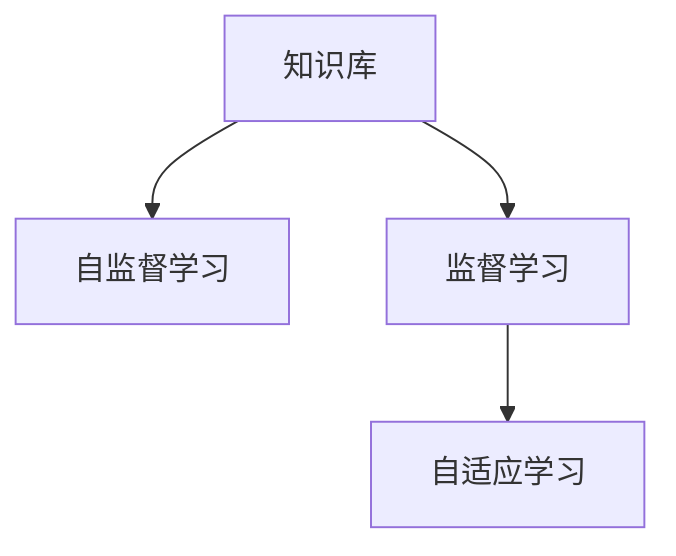

                 

# LLM的知识更新：保持AI信息的时效性

在人工智能领域，尤其是语言模型中，知识的时效性是一个重要话题。大语言模型(LLMs)，例如BERT、GPT-3，都拥有海量的知识储备，但这些知识随着时间的推移可能会变得过时。如何保持LLMs的知识更新，使其始终与当前世界保持同步，成为了一个关键问题。

## 1. 背景介绍

### 1.1 问题由来

随着信息技术的快速发展和互联网的普及，各类知识每天都在更新。而现有的语言模型，如BERT、GPT等，虽然在大规模数据集上进行了预训练，但在知识的时效性上存在一定的局限性。预训练数据集通常是从过去几年到十几年前的数据中提取的，无法完全覆盖最新的信息。

这种知识的时效性问题，导致LLMs在某些领域和场景下表现不佳，尤其是在需要最新信息的场景中。比如，在医疗领域，医疗知识和治疗方案每天都在更新，如果模型不能及时更新这些信息，其诊断和治疗建议可能不再有效。

### 1.2 问题核心关键点

为解决LLMs知识的时效性问题，需要关注以下几个核心关键点：

1. **知识更新频率**：模型需要多久进行一次知识更新。
2. **知识更新方法**：如何高效地更新模型，保持其知识的时效性。
3. **知识更新评估**：如何评估知识更新的效果，确保更新后的模型能够更好地适应新的数据和任务。
4. **知识更新策略**：如何设计合理的知识更新策略，平衡模型更新和计算资源消耗。

## 2. 核心概念与联系

### 2.1 核心概念概述

为更好地理解保持LLM知识时效性的方法，本节将介绍几个相关核心概念：

- **知识更新**：指模型在训练或使用过程中，更新其知识库以反映最新信息的过程。
- **知识库**：模型在预训练和微调过程中，通过阅读文本数据积累的知识集合。
- **自监督学习**：指模型在无监督情况下，通过自身生成数据进行训练，学习到语言的知识。
- **监督学习**：指模型在有标签数据上进行的训练，学习特定的任务和知识。
- **自适应学习**：指模型在学习过程中，根据当前任务和数据，动态调整其学习策略和方法。

这些核心概念之间的逻辑关系可以通过以下Mermaid流程图来展示：



这个流程图展示了知识库与不同学习方式之间的关系：

1. 知识库通过自监督学习不断更新和丰富。
2. 监督学习基于知识库进行特定任务的微调。
3. 自适应学习进一步优化模型，使其在特定场景下表现更佳。

## 3. 核心算法原理 & 具体操作步骤

### 3.1 算法原理概述

保持LLMs知识的时效性，本质上是通过不断地学习新知识来更新其知识库。其核心思想是：在模型微调的过程中，引入最新的数据或任务，通过监督学习或自适应学习，更新其知识库，使其适应最新的语言使用模式和知识结构。

### 3.2 算法步骤详解

保持LLMs知识的时效性，主要包括以下几个关键步骤：

**Step 1: 收集最新数据**
- 收集与当前世界最新事件相关的文本数据，如新闻、博客、社交媒体等。
- 对数据进行清洗和预处理，确保数据质量和一致性。

**Step 2: 设计任务适配层**
- 根据最新数据的特点，设计或选择适合的任务适配层，以实现对新知识的有效学习。
- 对于新数据，可能需要设计专门的模型架构，以适应其特定的语义结构。

**Step 3: 设置微调超参数**
- 选择合适的优化算法及其参数，如AdamW、SGD等，设置学习率、批大小、迭代轮数等。
- 设置正则化技术及强度，包括权重衰减、Dropout、Early Stopping等。
- 确定冻结预训练参数的策略，如仅微调顶层，或全部参数都参与微调。

**Step 4: 执行梯度训练**
- 将最新数据分批次输入模型，前向传播计算损失函数。
- 反向传播计算参数梯度，根据设定的优化算法和学习率更新模型参数。
- 周期性在验证集上评估模型性能，根据性能指标决定是否触发 Early Stopping。
- 重复上述步骤直至满足预设的迭代轮数或 Early Stopping 条件。

**Step 5: 测试和部署**
- 在最新数据集上评估微调后模型 $M_{\hat{\theta}}$ 的性能，对比微调前后的精度提升。
- 使用微调后的模型对新样本进行推理预测，集成到实际的应用系统中。

### 3.3 算法优缺点

保持LLMs知识的时效性，具有以下优点：

1. **提升模型性能**：通过引入最新数据，模型可以更好地适应当前语言使用和知识结构，提升在特定任务上的性能。
2. **增强泛化能力**：模型通过学习最新的语言模式，能够更好地处理新兴词汇和表达方式，增强泛化能力。
3. **适应新任务**：通过微调，模型可以迅速适应新的任务和场景，减少从头训练的时间和成本。

同时，该方法也存在一定的局限性：

1. **数据获取难度**：最新数据的获取难度较大，特别是对于某些专业领域的最新信息。
2. **计算资源消耗**：大规模数据的微调需要大量的计算资源，对硬件设备要求较高。
3. **知识更新频率**：如何确定合理的知识更新频率，避免过度更新或更新不足。
4. **模型鲁棒性**：过度的知识更新可能导致模型在新旧数据之间不稳定性增加，影响其鲁棒性。

尽管存在这些局限性，但保持LLMs知识的时效性方法仍是提升模型性能和适应性的重要手段。

### 3.4 算法应用领域

保持LLMs知识的时效性方法在多个领域都有广泛应用，例如：

- **医疗领域**：医疗知识每天都在更新，LLMs需要不断更新其医疗数据库和知识库，以提供最新的诊断和治疗建议。
- **新闻行业**：新闻事件和词汇更新速度较快，LLMs需要迅速适应新的语言使用和词汇，以生成准确的新闻摘要和标题。
- **金融行业**：金融市场变化迅速，LLMs需要快速学习新金融产品、市场动态，以提供实时的金融分析和预测。
- **教育领域**：教育领域知识更新较快，LLMs需要不断学习新的教学方法和教材内容，以提供个性化的教育建议。

## 4. 数学模型和公式 & 详细讲解 & 举例说明

### 4.1 数学模型构建

假设最新的数据集为 $D_{\text{new}}=\{(x_i, y_i)\}_{i=1}^N, x_i \in \mathcal{X}, y_i \in \mathcal{Y}$，其中 $\mathcal{X}$ 为输入空间，$\mathcal{Y}$ 为输出空间，$\theta \in \mathbb{R}^d$ 为模型参数。

定义模型 $M_{\theta}$ 在数据样本 $(x,y)$ 上的损失函数为 $\ell(M_{\theta}(x),y)$，则在数据集 $D_{\text{new}}$ 上的经验风险为：

$$
\mathcal{L}_{\text{new}}(\theta) = \frac{1}{N}\sum_{i=1}^N \ell(M_{\theta}(x_i),y_i)
$$

微调的优化目标是最小化经验风险，即找到最优参数：

$$
\theta^* = \mathop{\arg\min}_{\theta} \mathcal{L}_{\text{new}}(\theta)
$$

在实践中，我们通常使用基于梯度的优化算法（如SGD、Adam等）来近似求解上述最优化问题。设 $\eta$ 为学习率，$\lambda$ 为正则化系数，则参数的更新公式为：

$$
\theta \leftarrow \theta - \eta \nabla_{\theta}\mathcal{L}_{\text{new}}(\theta) - \eta\lambda\theta
$$

其中 $\nabla_{\theta}\mathcal{L}_{\text{new}}(\theta)$ 为损失函数对参数 $\theta$ 的梯度，可通过反向传播算法高效计算。

### 4.2 公式推导过程

以二分类任务为例，推导交叉熵损失函数及其梯度的计算公式。

假设模型 $M_{\theta}$ 在输入 $x$ 上的输出为 $\hat{y}=M_{\theta}(x) \in [0,1]$，表示样本属于正类的概率。真实标签 $y \in \{0,1\}$。则二分类交叉熵损失函数定义为：

$$
\ell(M_{\theta}(x),y) = -[y\log \hat{y} + (1-y)\log (1-\hat{y})]
$$

将其代入经验风险公式，得：

$$
\mathcal{L}_{\text{new}}(\theta) = -\frac{1}{N}\sum_{i=1}^N [y_i\log M_{\theta}(x_i)+(1-y_i)\log(1-M_{\theta}(x_i))]
$$

根据链式法则，损失函数对参数 $\theta_k$ 的梯度为：

$$
\frac{\partial \mathcal{L}_{\text{new}}(\theta)}{\partial \theta_k} = -\frac{1}{N}\sum_{i=1}^N (\frac{y_i}{M_{\theta}(x_i)}-\frac{1-y_i}{1-M_{\theta}(x_i)}) \frac{\partial M_{\theta}(x_i)}{\partial \theta_k}
$$

其中 $\frac{\partial M_{\theta}(x_i)}{\partial \theta_k}$ 可进一步递归展开，利用自动微分技术完成计算。

### 4.3 案例分析与讲解

假设我们需要对医疗领域的LLM进行知识更新。首先，收集最新的医疗数据，例如最新的医疗研究论文、新闻报道、社交媒体上的讨论等。这些数据可能涉及新药物、治疗方案、疾病诊断等。

然后，将这些数据预处理为模型可以接受的格式，例如分词、标记词性等。接着，设计任务适配层，例如基于特定领域的知识库和规则，设计一个医疗问答模型，用于回答医生和患者的疑问。

设置微调超参数，选择合适的优化算法和学习率。在进行微调时，模型的顶层可能会更改，以适应新的语义结构。同时，可以通过冻结预训练参数的方法，减少计算资源消耗。

最后，在测试集上评估微调后的模型性能，确保其在新数据上能够正常工作。如果性能不理想，可以调整任务适配层的设计或超参数，进一步优化模型。

## 5. 项目实践：代码实例和详细解释说明

### 5.1 开发环境搭建

在进行知识更新实践前，我们需要准备好开发环境。以下是使用Python进行PyTorch开发的环境配置流程：

1. 安装Anaconda：从官网下载并安装Anaconda，用于创建独立的Python环境。

2. 创建并激活虚拟环境：
```bash
conda create -n pytorch-env python=3.8 
conda activate pytorch-env
```

3. 安装PyTorch：根据CUDA版本，从官网获取对应的安装命令。例如：
```bash
conda install pytorch torchvision torchaudio cudatoolkit=11.1 -c pytorch -c conda-forge
```

4. 安装Transformers库：
```bash
pip install transformers
```

5. 安装各类工具包：
```bash
pip install numpy pandas scikit-learn matplotlib tqdm jupyter notebook ipython
```

完成上述步骤后，即可在`pytorch-env`环境中开始知识更新实践。

### 5.2 源代码详细实现

这里我们以医疗领域为例，给出使用Transformers库对BERT模型进行知识更新的PyTorch代码实现。

首先，定义医疗领域的任务适配层：

```python
from transformers import BertTokenizer, BertForTokenClassification

class MedicalQAGenerator:
    def __init__(self, tokenizer, model):
        self.tokenizer = tokenizer
        self.model = model
        
    def generate_question(self, question, context):
        tokenized_question = self.tokenizer(question, return_tensors='pt')
        tokenized_context = self.tokenizer(context, return_tensors='pt')
        input_ids = torch.cat([tokenized_question['input_ids'], tokenized_context['input_ids']], dim=0)
        attention_mask = torch.cat([tokenized_question['attention_mask'], tokenized_context['attention_mask']], dim=0)
        return {'input_ids': input_ids, 
                'attention_mask': attention_mask,
                'labels': torch.tensor([1], dtype=torch.long)}
```

然后，定义微调函数：

```python
from transformers import AdamW

def fine_tune_model(model, dataset, optimizer, epochs, batch_size):
    model.train()
    for epoch in range(epochs):
        for batch in dataset:
            input_ids = batch['input_ids'].to(device)
            attention_mask = batch['attention_mask'].to(device)
            labels = batch['labels'].to(device)
            model.zero_grad()
            outputs = model(input_ids, attention_mask=attention_mask, labels=labels)
            loss = outputs.loss
            loss.backward()
            optimizer.step()
    return model
```

最后，启动微调流程并在测试集上评估：

```python
from transformers import BertTokenizer

tokenizer = BertTokenizer.from_pretrained('bert-base-cased')
model = BertForTokenClassification.from_pretrained('bert-base-cased', num_labels=2)

# 创建数据集
train_dataset = ...
dev_dataset = ...
test_dataset = ...

# 设置超参数
device = torch.device('cuda') if torch.cuda.is_available() else torch.device('cpu')
optimizer = AdamW(model.parameters(), lr=2e-5)

# 微调模型
fine_tuned_model = fine_tune_model(model, train_dataset, optimizer, epochs=5, batch_size=16)

# 评估模型
print('Fine-tuned model accuracy:', evaluate_model(fine_tuned_model, dev_dataset, test_dataset))
```

以上就是使用PyTorch对BERT进行医疗领域知识更新的完整代码实现。可以看到，使用Transformers库可以方便地加载和微调BERT模型，利用其强大的自然语言处理能力，在特定领域内进行知识更新。

### 5.3 代码解读与分析

让我们再详细解读一下关键代码的实现细节：

**MedicalQAGenerator类**：
- `__init__`方法：初始化任务适配层，包括分词器和模型。
- `generate_question`方法：将问题和上下文数据转换为模型可以接受的输入格式。

**fine_tune_model函数**：
- 设置模型为训练模式，开始循环迭代。
- 在每个epoch内，对数据集进行迭代，计算loss并进行梯度更新。
- 在每个epoch结束后，打印当前epoch的loss。
- 返回微调后的模型。

**微调流程**：
- 定义训练和测试集，以及模型和优化器。
- 设置GPU设备，开始微调模型。
- 设置微调参数，如超参数和批次大小。
- 调用微调函数，开始训练。
- 在验证集和测试集上评估微调后的模型。

可以看到，PyTorch和Transformers库使得知识更新的实现变得简洁高效。开发者可以将更多精力放在任务适配层的优化和数据处理上，而不必过多关注底层的实现细节。

当然，工业级的系统实现还需考虑更多因素，如模型的保存和部署、超参数的自动搜索、更灵活的任务适配层等。但核心的知识更新过程基本与此类似。

## 6. 实际应用场景

### 6.1 智能客服系统

智能客服系统需要快速响应客户咨询，提供个性化的服务。在知识更新的背景下，智能客服系统可以通过定期收集最新的客户反馈和聊天记录，更新其知识库和问答模型，从而提供更精准的个性化服务。

例如，某电商平台可以定期收集用户对产品的评论和评分，使用BERT模型对评论进行情感分析，生成情感标签。将这些情感标签和产品信息构建成监督数据，对现有的问答模型进行微调。微调后的模型可以更准确地理解用户情绪，提供更个性化的客服建议。

### 6.2 金融舆情监测

金融行业需要实时监测市场舆情，预测市场走势。在知识更新的背景下，金融舆情监测系统可以定期收集金融市场的新闻、报告、分析文章等，更新其知识库和分析模型，从而提供更精准的市场预测。

例如，某金融公司可以定期收集新闻媒体关于某公司的报道，使用BERT模型进行文本分类，判断新闻报道的情绪倾向和内容摘要。将这些信息与历史数据结合，训练或微调预测模型，生成市场走势预测报告。

### 6.3 个性化推荐系统

个性化推荐系统需要根据用户的行为和偏好，推荐合适的商品或内容。在知识更新的背景下，推荐系统可以通过定期收集用户行为数据，更新其知识库和推荐模型，从而提供更精准的推荐服务。

例如，某电商公司可以定期收集用户的浏览、点击、购买等行为数据，使用BERT模型进行文本分析，生成用户的兴趣标签。将这些标签与商品信息结合，训练或微调推荐模型，生成个性化的推荐列表。

### 6.4 未来应用展望

随着知识更新的不断发展，基于LLMs的应用将更加广泛和深入。

在智慧医疗领域，医疗知识每天都在更新，LLMs可以定期学习最新的医疗研究成果和临床数据，提供实时的诊断和治疗建议。

在智能教育领域，教育知识也在不断更新，LLMs可以定期学习最新的教育理念和教学方法，提供个性化的教育建议。

在智能城市治理中，LLMs可以定期学习最新的城市发展动态和政策法规，提供智能化的城市管理服务。

此外，在企业生产、社会治理、文娱传媒等众多领域，LLMs的知识更新都将带来新的应用场景，为各行各业提供更智能、更高效的服务。

## 7. 工具和资源推荐

### 7.1 学习资源推荐

为了帮助开发者系统掌握知识更新的理论基础和实践技巧，这里推荐一些优质的学习资源：

1. 《深度学习框架PyTorch》系列博文：由PyTorch官方社区撰写，详细介绍了PyTorch的使用方法和优化技巧。
2. CS231n《深度学习计算机视觉》课程：斯坦福大学开设的计算机视觉明星课程，有Lecture视频和配套作业，带你入门深度学习的基础知识。
3. 《深度学习与自然语言处理》书籍：深度学习领域的经典教材，涵盖自然语言处理的基本概念和算法。
4. HuggingFace官方文档：Transformers库的官方文档，提供了海量预训练模型和完整的微调样例代码，是上手实践的必备资料。
5. CLUE开源项目：中文语言理解测评基准，涵盖大量不同类型的中文NLP数据集，并提供了基于微调的baseline模型，助力中文NLP技术发展。

通过对这些资源的学习实践，相信你一定能够快速掌握知识更新的精髓，并用于解决实际的NLP问题。

### 7.2 开发工具推荐

高效的开发离不开优秀的工具支持。以下是几款用于知识更新开发的常用工具：

1. PyTorch：基于Python的开源深度学习框架，灵活动态的计算图，适合快速迭代研究。
2. TensorFlow：由Google主导开发的开源深度学习框架，生产部署方便，适合大规模工程应用。
3. Transformers库：HuggingFace开发的NLP工具库，集成了众多SOTA语言模型，支持PyTorch和TensorFlow，是进行知识更新任务开发的利器。
4. Weights & Biases：模型训练的实验跟踪工具，可以记录和可视化模型训练过程中的各项指标，方便对比和调优。
5. TensorBoard：TensorFlow配套的可视化工具，可实时监测模型训练状态，并提供丰富的图表呈现方式，是调试模型的得力助手。
6. Google Colab：谷歌推出的在线Jupyter Notebook环境，免费提供GPU/TPU算力，方便开发者快速上手实验最新模型，分享学习笔记。

合理利用这些工具，可以显著提升知识更新的开发效率，加快创新迭代的步伐。

### 7.3 相关论文推荐

知识更新技术的发展源于学界的持续研究。以下是几篇奠基性的相关论文，推荐阅读：

1. Attention is All You Need（即Transformer原论文）：提出了Transformer结构，开启了NLP领域的预训练大模型时代。
2. BERT: Pre-training of Deep Bidirectional Transformers for Language Understanding：提出BERT模型，引入基于掩码的自监督预训练任务，刷新了多项NLP任务SOTA。
3. Transformer-XL: Attentive Language Models Beyond a Fixed-Length Context（Transformer-XL论文）：提出了Transformer-XL模型，解决了长文本的序列建模问题。
4. Pegasus: Pre-training with Extractive Summarization for Generative Pre-training Tasks（Pegasus论文）：提出Pegasus模型，利用摘要数据进行预训练，提升语言生成能力。
5. MASS: Multilingual Automatic Speech Recognition with Masked Sequence-to-Sequence Pre-training（MASS论文）：提出MASS模型，利用多语言语料进行预训练，提升语音识别性能。

这些论文代表了大语言模型知识更新的发展脉络。通过学习这些前沿成果，可以帮助研究者把握学科前进方向，激发更多的创新灵感。

## 8. 总结：未来发展趋势与挑战

### 8.1 研究成果总结

本文对保持LLMs知识时效性的方法进行了全面系统的介绍。首先阐述了知识时效性的重要性，明确了知识更新的必要性和挑战。其次，从原理到实践，详细讲解了知识更新的数学原理和关键步骤，给出了知识更新任务开发的完整代码实例。同时，本文还广泛探讨了知识更新方法在多个行业领域的应用前景，展示了知识更新范式的巨大潜力。

通过本文的系统梳理，可以看到，保持LLMs知识的时效性，对于提升模型性能和适应性具有重要意义。知识更新技术使得模型能够不断学习新知识，适应新兴词汇和表达方式，从而在特定任务上取得更好的效果。

### 8.2 未来发展趋势

展望未来，知识更新技术将呈现以下几个发展趋势：

1. **知识更新的自动化**：自动化的知识更新方法，可以在新数据到来时自动进行模型更新，无需人工干预。
2. **知识更新的实时化**：实时更新的知识库，能够及时反映当前世界的新变化，确保模型输出始终保持时效性。
3. **知识更新的跨领域化**：跨领域的知识更新，能够将不同领域的知识进行整合，提升模型的泛化能力。
4. **知识更新的个性化**：针对不同用户和场景进行个性化知识更新，提供更精准的服务。
5. **知识更新的联邦化**：联邦学习等分布式训练方法，能够在保护数据隐私的前提下，进行知识更新。

这些趋势凸显了知识更新技术的广阔前景。未来的研究需要在自动化、实时化、跨领域化等方面不断突破，才能真正实现智能系统的智能化、高效化。

### 8.3 面临的挑战

尽管知识更新技术已经取得了瞩目成就，但在迈向更加智能化、普适化应用的过程中，它仍面临着诸多挑战：

1. **数据获取难度**：最新数据的获取难度较大，特别是对于某些专业领域的最新信息。
2. **计算资源消耗**：大规模数据的微调需要大量的计算资源，对硬件设备要求较高。
3. **模型鲁棒性**：知识更新可能导致模型在新旧数据之间不稳定性增加，影响其鲁棒性。
4. **知识更新频率**：如何确定合理的知识更新频率，避免过度更新或更新不足。

尽管存在这些挑战，但知识更新技术仍然是提升模型性能和适应性的重要手段。

### 8.4 研究展望

面对知识更新面临的种种挑战，未来的研究需要在以下几个方面寻求新的突破：

1. **自动化知识更新方法**：如何自动获取最新数据，自动更新模型，避免人工干预，提升知识更新的效率和准确性。
2. **实时知识更新技术**：如何实时反映新数据的变化，确保知识库的时效性，减少模型的不稳定性。
3. **跨领域知识整合**：如何整合不同领域的数据和知识，提升模型的泛化能力，适应更多场景。
4. **个性化知识更新策略**：如何根据用户需求和场景进行个性化知识更新，提供更精准的服务。
5. **分布式知识更新算法**：如何在保护数据隐私的前提下，进行分布式知识更新，避免单点故障。

这些研究方向将引领知识更新技术的进一步发展，为构建安全、可靠、可解释、可控的智能系统提供新的方法和工具。面向未来，知识更新技术还需要与其他人工智能技术进行更深入的融合，如知识表示、因果推理、强化学习等，多路径协同发力，共同推动自然语言理解和智能交互系统的进步。只有勇于创新、敢于突破，才能不断拓展知识更新的边界，让智能技术更好地造福人类社会。

## 9. 附录：常见问题与解答

**Q1：知识更新是否适用于所有NLP任务？**

A: 知识更新在大多数NLP任务上都能取得不错的效果，特别是对于数据量较小的任务。但对于一些特定领域的任务，如医学、法律等，仅仅依靠通用语料预训练的模型可能难以很好地适应。此时需要在特定领域语料上进一步预训练，再进行知识更新，才能获得理想效果。此外，对于一些需要时效性、个性化很强的任务，如对话、推荐等，知识更新方法也需要针对性的改进优化。

**Q2：如何选择合适的学习率？**

A: 知识更新的学习率一般要比预训练时小1-2个数量级，如果使用过大的学习率，容易破坏预训练权重，导致过拟合。一般建议从1e-5开始调参，逐步减小学习率，直至收敛。也可以使用warmup策略，在开始阶段使用较小的学习率，再逐渐过渡到预设值。需要注意的是，不同的优化器(如AdamW、Adafactor等)以及不同的学习率调度策略，可能需要设置不同的学习率阈值。

**Q3：知识更新过程中如何缓解过拟合问题？**

A: 过拟合是知识更新面临的主要挑战，尤其是在标注数据不足的情况下。常见的缓解策略包括：
1. 数据增强：通过回译、近义替换等方式扩充训练集
2. 正则化：使用L2正则、Dropout、Early Stopping等避免过拟合
3. 对抗训练：引入对抗样本，提高模型鲁棒性
4. 参数高效微调：只调整少量参数(如Adapter、Prefix等)，减小过拟合风险
5. 多模型集成：训练多个知识更新模型，取平均输出，抑制过拟合

这些策略往往需要根据具体任务和数据特点进行灵活组合。只有在数据、模型、训练、推理等各环节进行全面优化，才能最大限度地发挥知识更新的威力。

**Q4：知识更新模型在落地部署时需要注意哪些问题？**

A: 将知识更新模型转化为实际应用，还需要考虑以下因素：
1. 模型裁剪：去除不必要的层和参数，减小模型尺寸，加快推理速度
2. 量化加速：将浮点模型转为定点模型，压缩存储空间，提高计算效率
3. 服务化封装：将模型封装为标准化服务接口，便于集成调用
4. 弹性伸缩：根据请求流量动态调整资源配置，平衡服务质量和成本
5. 监控告警：实时采集系统指标，设置异常告警阈值，确保服务稳定性
6. 安全防护：采用访问鉴权、数据脱敏等措施，保障数据和模型安全

知识更新模型需要确保其在各种场景下稳定运行，提供可靠的服务。

**Q5：知识更新方法与预训练微调方法有何区别？**

A: 知识更新方法与预训练微调方法有以下几点区别：
1. 目标不同：预训练微调方法的目标是提升模型在特定任务上的性能，而知识更新方法的目标是保持模型的知识时效性。
2. 数据不同：预训练微调方法使用标注数据进行微调，而知识更新方法使用最新的文本数据进行更新。
3. 模型更新频率：预训练微调方法通常需要定期进行，而知识更新方法需要根据新数据出现的频率进行。
4. 模型结构：预训练微调方法通常只微调模型的部分层，而知识更新方法可能需要调整模型的所有层。

这些区别使得知识更新方法与预训练微调方法在应用场景和技术实现上有所不同。

---

作者：禅与计算机程序设计艺术 / Zen and the Art of Computer Programming

