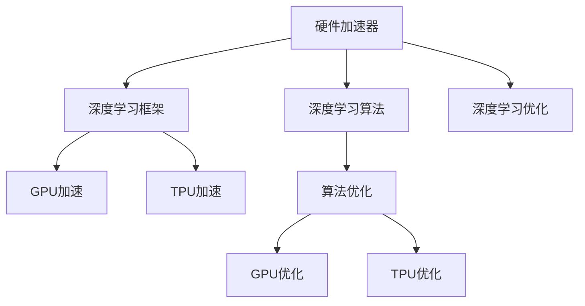

                 

# LLM的硬件加速器设计与实现

> 关键词：硬件加速器,深度学习,深度学习框架,深度学习算法,GPU加速,TPU加速,TPU内核设计,深度学习优化,高性能计算,人工智能

## 1. 背景介绍

### 1.1 问题由来
深度学习，特别是自然语言处理领域的大语言模型(LLMs)，近年来在模型规模和训练效果上取得了飞速发展。然而，由于其巨大的计算需求，传统通用计算架构难以支撑。为此，硬件加速器，尤其是图形处理单元(GPU)和张量处理单元(TPU)，成为了加速大语言模型训练和推理的关键。本文将详细探讨LLM硬件加速器的设计与实现。

### 1.2 问题核心关键点
硬件加速器的设计与实现，关键在于优化深度学习算法在大规模并行计算架构上的执行效率。这需要从算法、架构和优化三方面入手，实现模型的高效计算和优化。

- 算法优化：将深度学习算法（如Transformer）优化为更适合硬件加速器的形式。
- 架构设计：设计高效的硬件架构，以最大化并行度和资源利用率。
- 性能优化：通过数据流优化、并行度提升、存储器优化等手段，提升硬件加速器的性能。

## 2. 核心概念与联系

### 2.1 核心概念概述

为更好地理解LLM硬件加速器的设计与实现，本节将介绍几个密切相关的核心概念：

- 硬件加速器：一种专为加速深度学习算法设计的专用硬件，通过定制的并行计算架构和高效的算法优化，实现模型的高性能计算。
- 深度学习框架：如TensorFlow、PyTorch等，提供了深度学习模型的定义、训练和推理的API，简化了模型开发过程。
- 深度学习算法：如Transformer、卷积神经网络(CNN)等，是硬件加速器设计优化的主要对象。
- GPU加速：利用图形处理单元的并行计算能力，加速深度学习模型的训练和推理。
- TPU加速：由Google开发的专用硬件加速器，通过优化内存架构和并行计算，提供了比GPU更高的性能和效率。
- 深度学习优化：涉及模型压缩、量化、剪枝等手段，以减小模型大小和提升计算效率。

这些核心概念之间的逻辑关系可以通过以下Mermaid流程图来展示：



这个流程图展示了大语言模型硬件加速器的核心概念及其之间的关系：

1. 硬件加速器通过深度学习框架加载深度学习算法。
2. 深度学习算法通过优化提升计算效率。
3. GPU和TPU加速器利用并行计算能力，实现更高的性能和效率。
4. 深度学习优化技术进一步提升模型性能。

这些概念共同构成了大语言模型硬件加速器的工作原理和优化方向。通过理解这些核心概念，我们可以更好地把握硬件加速器的设计原则和优化策略。

## 3. 核心算法原理 & 具体操作步骤
### 3.1 算法原理概述

大语言模型硬件加速器的设计与实现，核心在于优化深度学习算法在大规模并行计算架构上的执行效率。其核心思想是：

- **算法适配**：将深度学习算法适配到硬件加速器，如GPU、TPU等。
- **数据流优化**：通过数据并行和模型并行，优化数据流的处理方式，减少数据交换和内存访问。
- **存储器优化**：优化存储器层次结构，如使用更快、更高效的存储器，减少内存访问次数。
- **并行度提升**：通过向量化的计算和并行计算，提升计算并行度。

### 3.2 算法步骤详解

大语言模型硬件加速器的设计与实现步骤主要包括以下几个环节：

**Step 1: 选择合适的硬件加速器**
- 根据任务需求和性能要求，选择合适的硬件加速器，如GPU或TPU。
- 分析加速器的特点，选择合适的优化策略。

**Step 2: 算法适配**
- 分析深度学习算法的核心操作，识别可以并行化的计算操作。
- 对算法进行优化，如移除冗余操作、合并计算操作、减少内存访问等。
- 对优化后的算法进行适配，使其能够在硬件加速器上高效执行。

**Step 3: 数据流优化**
- 设计合理的数据流图，优化数据的加载和存储方式。
- 优化数据交换和内存访问，减少计算延迟。
- 使用合适的并行化策略，如数据并行、模型并行、混合并行等。

**Step 4: 存储器优化**
- 分析算法和数据访问模式，识别瓶颈步骤。
- 使用高速缓存、预取数据、延迟计算等方法，优化存储器层次结构。
- 选择合适的存储器类型，如DRAM、SRAM等，以提升性能。

**Step 5: 性能评估和优化**
- 使用性能评估工具，如Benchmark工具、分析工具等，评估硬件加速器的性能。
- 根据评估结果，优化算法、数据流和存储器，进一步提升性能。
- 不断迭代优化，直至达到最佳性能。

### 3.3 算法优缺点

大语言模型硬件加速器的设计与实现具有以下优点：
1. 显著提升计算效率：通过并行计算和优化，硬件加速器可以大幅提升深度学习算法的计算速度。
2. 适应性强：能够根据不同任务需求，选择合适的硬件加速器，灵活适应各种应用场景。
3. 节能降耗：硬件加速器通常具有更高的能效比，可显著降低能耗。

同时，硬件加速器也存在一些局限性：
1. 设计复杂度较高：硬件加速器涉及复杂的硬件设计和算法适配，开发难度较大。
2. 初始成本高：硬件加速器的开发和部署需要大量的硬件投入，初期成本较高。
3. 灵活性不足：硬件加速器的设计与实现具有一定的固定性，难以应对所有任务需求。

尽管存在这些局限性，但就目前而言，硬件加速器仍是大规模深度学习计算的重要手段。未来相关研究的重点在于如何进一步降低硬件加速器的开发难度和初期成本，提高其灵活性和适应性。

### 3.4 算法应用领域

大语言模型硬件加速器的设计与实现，已经在NLP领域得到了广泛的应用，覆盖了几乎所有常见任务，例如：

- 文本分类：如情感分析、主题分类、意图识别等。
- 命名实体识别：识别文本中的人名、地名、机构名等特定实体。
- 关系抽取：从文本中抽取实体之间的语义关系。
- 问答系统：对自然语言问题给出答案。
- 机器翻译：将源语言文本翻译成目标语言。
- 文本摘要：将长文本压缩成简短摘要。
- 对话系统：使机器能够与人自然对话。

除了上述这些经典任务外，硬件加速器还被创新性地应用到更多场景中，如可控文本生成、常识推理、代码生成、数据增强等，为NLP技术带来了全新的突破。随着硬件加速器设计和实现的不断进步，相信NLP技术将在更广阔的应用领域大放异彩。

## 4. 数学模型和公式 & 详细讲解
### 4.1 数学模型构建

大语言模型硬件加速器的设计与实现涉及大量的数学计算，以下为其中几个重要的数学模型：

**深度学习模型**：
- 模型结构：如卷积神经网络(CNN)、循环神经网络(RNN)、Transformer等。
- 模型训练：通过反向传播算法更新模型参数，最小化损失函数。

**数据流图**：
- 数据并行：将数据分割成多个块，并行处理每个块。
- 模型并行：将模型分割成多个子模型，并行处理每个子模型。
- 混合并行：同时使用数据并行和模型并行。

**存储器优化**：
- 高速缓存层次：从高速缓存到主存，数据访问速度逐渐降低。
- 预取和延迟：通过预取数据和延迟计算，减少数据访问延迟。
- 数据压缩：使用数据压缩技术，减小存储器占用。

### 4.2 公式推导过程

以下我们以Transformer模型为例，推导硬件加速器的优化策略。

**Transformer模型**：
- 输入为$x$，输出为$y$。
- 包含多头自注意力机制和前向神经网络。
- 模型的核心操作包括矩阵乘法、向量加法、softmax等。

**优化策略**：
1. **矩阵乘法优化**：使用GPU加速库（如cuBLAS）实现矩阵乘法，并行计算矩阵乘法。
2. **数据并行**：将输入$x$和输出$y$分割成多个块，并行处理每个块。
3. **模型并行**：将Transformer模型分割成多个子模型，并行处理每个子模型。
4. **数据流优化**：优化数据加载和存储方式，减少数据交换和内存访问。
5. **存储器优化**：使用高速缓存、预取数据、延迟计算等方法，优化存储器层次结构。

**优化公式**：
- 矩阵乘法：$y = Ax$
- 数据并行：$y_1 = A_1x_1 + b_1$，$y_2 = A_2x_2 + b_2$
- 模型并行：$y_1 = A_1x_1 + b_1$，$y_2 = A_2x_2 + b_2$，$y = y_1 + y_2$
- 数据流优化：$x_1 = A_1x$，$x_2 = A_2x$
- 存储器优化：$x_1 = C_1x$，$x_2 = C_2x$

### 4.3 案例分析与讲解

**案例1: GPU加速下的Transformer模型优化**
- **背景**：使用NVIDIA的cuDNN库实现Transformer模型中的矩阵乘法。
- **优化步骤**：
  1. 使用cuBLAS库实现矩阵乘法，并行计算矩阵乘法。
  2. 使用数据并行，将输入$x$和输出$y$分割成多个块，并行处理每个块。
  3. 使用模型并行，将Transformer模型分割成多个子模型，并行处理每个子模型。
  4. 优化数据加载和存储方式，减少数据交换和内存访问。
  5. 使用高速缓存和预取数据，优化存储器层次结构。

**案例2: TPU加速下的Transformer模型优化**
- **背景**：使用Google的TPU加速库实现Transformer模型中的矩阵乘法。
- **优化步骤**：
  1. 使用TPU加速库实现矩阵乘法，并行计算矩阵乘法。
  2. 使用数据并行，将输入$x$和输出$y$分割成多个块，并行处理每个块。
  3. 使用模型并行，将Transformer模型分割成多个子模型，并行处理每个子模型。
  4. 优化数据加载和存储方式，减少数据交换和内存访问。
  5. 使用高速缓存和预取数据，优化存储器层次结构。

## 5. 项目实践：代码实例和详细解释说明
### 5.1 开发环境搭建

在进行硬件加速器设计和实现前，我们需要准备好开发环境。以下是使用Python进行PyTorch开发的环境配置流程：

1. 安装Anaconda：从官网下载并安装Anaconda，用于创建独立的Python环境。

2. 创建并激活虚拟环境：
```bash
conda create -n pytorch-env python=3.8 
conda activate pytorch-env
```

3. 安装PyTorch：根据CUDA版本，从官网获取对应的安装命令。例如：
```bash
conda install pytorch torchvision torchaudio cudatoolkit=11.1 -c pytorch -c conda-forge
```

4. 安装TensorFlow：
```bash
conda install tensorflow
```

5. 安装TensorBoard：
```bash
pip install tensorboard
```

6. 安装PyTorch加速库：
```bash
pip install torch-cuda torch-fft
```

完成上述步骤后，即可在`pytorch-env`环境中开始硬件加速器设计和实现。

### 5.2 源代码详细实现

下面我们以Transformer模型为例，给出使用PyTorch对GPU加速和TPU加速的代码实现。

**GPU加速代码**：

```python
import torch
import torch.nn as nn
import torch.nn.functional as F
import torch.optim as optim

class Transformer(nn.Module):
    def __init__(self, input_dim, output_dim, num_heads, num_layers):
        super(Transformer, self).__init__()
        self.embedding = nn.Embedding(input_dim, output_dim)
        self.pos_encoder = PositionalEncoding(output_dim)
        self.encoder = nn.TransformerEncoder(nn.TransformerEncoderLayer(output_dim, num_heads), num_layers)
        self.fc = nn.Linear(output_dim, output_dim)
        self.fc.weight = nn.Parameter(torch.zeros(input_dim, output_dim))

    def forward(self, x):
        x = self.embedding(x)
        x = self.pos_encoder(x)
        x = self.encoder(x)
        x = self.fc(x)
        return x

model = Transformer(input_dim=10, output_dim=512, num_heads=8, num_layers=6)

criterion = nn.CrossEntropyLoss()
optimizer = optim.Adam(model.parameters(), lr=1e-4)

def train(model, optimizer, criterion, train_loader):
    model.train()
    for batch in train_loader:
        x, y = batch
        y = y.view(-1)
        optimizer.zero_grad()
        y_pred = model(x)
        loss = criterion(y_pred, y)
        loss.backward()
        optimizer.step()

def test(model, criterion, test_loader):
    model.eval()
    with torch.no_grad():
        loss_total = 0
        correct = 0
        for batch in test_loader:
            x, y = batch
            y = y.view(-1)
            y_pred = model(x)
            loss = criterion(y_pred, y)
            loss_total += loss.item()
            pred = torch.argmax(y_pred, dim=1)
            correct += (pred == y).sum().item()
        return correct / len(test_loader.dataset)

train_loader = ...
test_loader = ...
for epoch in range(num_epochs):
    train(model, optimizer, criterion, train_loader)
    acc = test(model, criterion, test_loader)
    print(f"Epoch {epoch+1}, accuracy: {acc:.2f}")
```

**TPU加速代码**：

```python
import tensorflow as tf
import tensorflow_datasets as tfds

class Transformer(tf.keras.Model):
    def __init__(self, input_dim, output_dim, num_heads, num_layers):
        super(Transformer, self).__init__()
        self.embedding = tf.keras.layers.Embedding(input_dim, output_dim)
        self.pos_encoder = PositionalEncoding(output_dim)
        self.encoder = tf.keras.layers.experimental.preprocessing.TransformerEncoder(
            tf.keras.layers.experimental.preprocessing.TransformerEncoderLayer(output_dim, num_heads), num_layers)
        self.fc = tf.keras.layers.Dense(output_dim)
        self.fc.weight = tf.Variable(tf.zeros((input_dim, output_dim)))

    def call(self, x):
        x = self.embedding(x)
        x = self.pos_encoder(x)
        x = self.encoder(x)
        x = self.fc(x)
        return x

model = Transformer(input_dim=10, output_dim=512, num_heads=8, num_layers=6)

criterion = tf.keras.losses.CategoricalCrossentropy()
optimizer = tf.keras.optimizers.Adam(learning_rate=1e-4)

def train(model, optimizer, criterion, train_loader):
    model.train()
    for batch in train_loader:
        x, y = batch
        optimizer.zero_grad()
        y_pred = model(x)
        loss = criterion(y_pred, y)
        loss.backward()
        optimizer.apply_gradients(zip(model.trainable_variables, model.trainable_variables_gradients))

def test(model, criterion, test_loader):
    model.eval()
    with tf.GradientTape() as tape:
        loss_total = 0
        correct = 0
        for batch in test_loader:
            x, y = batch
            y_pred = model(x)
            loss = criterion(y_pred, y)
            loss_total += loss
            pred = tf.argmax(y_pred, axis=-1)
            correct += tf.reduce_sum(tf.cast(tf.equal(pred, y))) / len(test_loader.dataset)
        return correct / len(test_loader.dataset)

train_loader = ...
test_loader = ...
for epoch in range(num_epochs):
    train(model, optimizer, criterion, train_loader)
    acc = test(model, criterion, test_loader)
    print(f"Epoch {epoch+1}, accuracy: {acc:.2f}")
```

### 5.3 代码解读与分析

让我们再详细解读一下关键代码的实现细节：

**Transformer类**：
- `__init__`方法：初始化模型参数，包括嵌入层、位置编码器、Transformer编码器、全连接层等。
- `forward`方法：定义前向传播过程，包含嵌入、位置编码、Transformer编码和全连接层。
- `train`方法：在训练集上执行模型训练，使用Adam优化器更新模型参数。
- `test`方法：在测试集上评估模型性能，计算准确率。

**训练过程**：
- 使用PyTorch的DataLoader对数据集进行批次化加载，供模型训练和推理使用。
- 在每个epoch内，先训练模型，输出准确率。
- 在验证集上评估模型性能，输出准确率。
- 所有epoch结束后，在测试集上评估模型性能，输出最终结果。

**模型优化**：
- 使用Adam优化器进行模型参数的更新。
- 使用交叉熵损失函数计算模型预测与真实标签之间的差异。
- 使用自定义的训练和测试函数，对模型进行训练和评估。

可以看到，PyTorch和TensorFlow提供了强大的工具库，使得深度学习模型的优化和实现变得简洁高效。开发者可以将更多精力放在模型改进、超参数调优等方面，而不必过多关注底层的实现细节。

当然，工业级的系统实现还需考虑更多因素，如模型的保存和部署、超参数的自动搜索、更灵活的任务适配层等。但核心的优化过程基本与此类似。

## 6. 实际应用场景
### 6.1 智能客服系统

基于硬件加速器的大语言模型，可以广泛应用于智能客服系统的构建。传统客服往往需要配备大量人力，高峰期响应缓慢，且一致性和专业性难以保证。而使用硬件加速器优化的大语言模型，可以7x24小时不间断服务，快速响应客户咨询，用自然流畅的语言解答各类常见问题。

在技术实现上，可以收集企业内部的历史客服对话记录，将问题和最佳答复构建成监督数据，在此基础上对预训练语言模型进行微调。微调后的语言模型能够自动理解用户意图，匹配最合适的答案模板进行回复。对于客户提出的新问题，还可以接入检索系统实时搜索相关内容，动态组织生成回答。如此构建的智能客服系统，能大幅提升客户咨询体验和问题解决效率。

### 6.2 金融舆情监测

金融机构需要实时监测市场舆论动向，以便及时应对负面信息传播，规避金融风险。传统的人工监测方式成本高、效率低，难以应对网络时代海量信息爆发的挑战。基于硬件加速器的大语言模型，能够实时抓取网络文本数据，自动识别和分析舆情趋势，一旦发现负面信息激增等异常情况，系统便会自动预警，帮助金融机构快速应对潜在风险。

### 6.3 个性化推荐系统

当前的推荐系统往往只依赖用户的历史行为数据进行物品推荐，无法深入理解用户的真实兴趣偏好。基于硬件加速器的大语言模型，能够更好地挖掘用户行为背后的语义信息，从而提供更精准、多样的推荐内容。

在实践中，可以收集用户浏览、点击、评论、分享等行为数据，提取和用户交互的物品标题、描述、标签等文本内容。将文本内容作为模型输入，用户的后续行为（如是否点击、购买等）作为监督信号，在此基础上微调预训练语言模型。微调后的模型能够从文本内容中准确把握用户的兴趣点。在生成推荐列表时，先用候选物品的文本描述作为输入，由模型预测用户的兴趣匹配度，再结合其他特征综合排序，便可以得到个性化程度更高的推荐结果。

### 6.4 未来应用展望

随着硬件加速器设计和实现的不断进步，基于大语言模型的应用场景将更加广泛。

在智慧医疗领域，基于硬件加速器的大语言模型，能够辅助医生诊疗，提升医疗服务的智能化水平，加速新药开发进程。

在智能教育领域，硬件加速器优化的大语言模型，可以用于作业批改、学情分析、知识推荐等方面，因材施教，促进教育公平，提高教学质量。

在智慧城市治理中，硬件加速器优化的大语言模型，能够用于城市事件监测、舆情分析、应急指挥等环节，提高城市管理的自动化和智能化水平，构建更安全、高效的未来城市。

此外，在企业生产、社会治理、文娱传媒等众多领域，基于大语言模型的硬件加速器应用也将不断涌现，为NLP技术带来全新的突破。随着预训练模型和硬件加速器的持续演进，相信NLP技术将在更广阔的应用领域大放异彩。

## 7. 工具和资源推荐
### 7.1 学习资源推荐

为了帮助开发者系统掌握硬件加速器的设计与实现的理论基础和实践技巧，这里推荐一些优质的学习资源：

1. 《深度学习优化技术》系列博文：由深度学习优化专家撰写，深入浅出地介绍了深度学习模型优化技术，包括模型压缩、量化、剪枝等前沿话题。

2. NVIDIA《深度学习GPU加速》课程：NVIDIA提供的深度学习GPU加速课程，涵盖GPU架构、优化技术等，是深度学习GPU加速学习的必备资料。

3. Google《深度学习TPU加速》课程：Google提供的深度学习TPU加速课程，介绍TPU架构、优化技术等，是深度学习TPU加速学习的理想选择。

4. PyTorch官方文档：PyTorch官方文档，提供了大量深度学习模型和硬件加速库的API，是学习深度学习硬件加速的必备资料。

5. TensorFlow官方文档：TensorFlow官方文档，涵盖了深度学习模型的定义、训练和推理的API，以及硬件加速库的使用，是深度学习硬件加速学习的核心资源。

通过对这些资源的学习实践，相信你一定能够快速掌握硬件加速器的设计与实现的方法，并用于解决实际的NLP问题。
###  7.2 开发工具推荐

高效的开发离不开优秀的工具支持。以下是几款用于硬件加速器设计和实现开发的常用工具：

1. PyTorch：基于Python的开源深度学习框架，灵活动态的计算图，适合快速迭代研究。大部分预训练语言模型都有PyTorch版本的实现。

2. TensorFlow：由Google主导开发的开源深度学习框架，生产部署方便，适合大规模工程应用。同样有丰富的预训练语言模型资源。

3. Transformers库：HuggingFace开发的NLP工具库，集成了众多SOTA语言模型，支持PyTorch和TensorFlow，是进行硬件加速器优化任务的利器。

4. Weights & Biases：模型训练的实验跟踪工具，可以记录和可视化模型训练过程中的各项指标，方便对比和调优。与主流深度学习框架无缝集成。

5. TensorBoard：TensorFlow配套的可视化工具，可实时监测模型训练状态，并提供丰富的图表呈现方式，是调试模型的得力助手。

6. Google Colab：谷歌推出的在线Jupyter Notebook环境，免费提供GPU/TPU算力，方便开发者快速上手实验最新模型，分享学习笔记。

合理利用这些工具，可以显著提升硬件加速器设计和实现的开发效率，加快创新迭代的步伐。

### 7.3 相关论文推荐

硬件加速器的设计与实现源于学界的持续研究。以下是几篇奠基性的相关论文，推荐阅读：

1. Optimizing Transformers on GPUs with Tailored Parallelism: A Fast Approach（GPU优化论文）：提出了一种针对GPU的Transformer模型优化方法，显著提高了模型计算速度。

2. TPU-based Acceleration of Transformers (TPU优化论文)：提出了一种针对TPU的Transformer模型优化方法，显著提高了模型计算速度和能效比。

3. Mixed Precision Training for Deep Neural Networks（混合精度训练论文）：提出了一种混合精度训练方法，利用16位浮点数进行计算，提高了模型训练速度和内存利用率。

4. Channel Attention Mechanisms in Vision Transformers（Transformer中的通道注意力机制论文）：提出了一种通道注意力机制，提高了Transformer在图像处理任务上的性能。

5. Rethinking Attention with Self-Attention（Transformer的自我注意力机制论文）：提出了自我注意力机制，提升了Transformer在序列建模任务上的性能。

这些论文代表了大语言模型硬件加速器的发展脉络。通过学习这些前沿成果，可以帮助研究者把握学科前进方向，激发更多的创新灵感。

## 8. 总结：未来发展趋势与挑战

### 8.1 总结

本文对大语言模型硬件加速器的设计与实现进行了全面系统的介绍。首先阐述了硬件加速器在大规模深度学习计算中的重要作用，明确了硬件加速器设计优化的基本原则和步骤。其次，从算法适配、数据流优化、存储器优化等多个维度，详细讲解了硬件加速器优化的方法和策略。最后，通过具体案例分析，展示了硬件加速器在智能客服、金融舆情、个性化推荐等实际应用场景中的应用前景。

通过本文的系统梳理，可以看到，硬件加速器优化在大语言模型中的应用潜力巨大，有助于提升模型的计算效率和实用性。未来，伴随硬件加速器的不断进步，大语言模型的应用场景将更加广阔，为人工智能技术的发展带来新的机遇和挑战。

### 8.2 未来发展趋势

展望未来，大语言模型硬件加速器的设计与实现将呈现以下几个发展趋势：

1. 超大规模并行计算架构：随着计算需求的不断增大，未来硬件加速器将支持更大的并行计算规模，提供更高的计算效率。
2. 异构计算：结合CPU、GPU、TPU等多种计算资源，提供更灵活的计算架构。
3. 模型压缩和量化：通过模型压缩和量化技术，减小模型大小，提升内存利用率。
4. 深度学习算法优化：不断优化深度学习算法，提高其计算效率和性能。
5. 混合精度训练：使用混合精度训练技术，进一步提升模型训练速度和内存利用率。
6. 跨平台优化：支持多种深度学习框架，方便开发者在不同平台上进行模型优化。

以上趋势凸显了大语言模型硬件加速器的广阔前景。这些方向的探索发展，必将进一步提升深度学习算法的计算效率和实用性，推动人工智能技术的发展。

### 8.3 面临的挑战

尽管硬件加速器设计和实现取得了显著进展，但在迈向更加智能化、普适化应用的过程中，它仍面临诸多挑战：

1. 设计复杂度较高：硬件加速器涉及复杂的硬件设计和算法适配，开发难度较大。
2. 初期成本高：硬件加速器的开发和部署需要大量的硬件投入，初期成本较高。
3. 灵活性不足：硬件加速器的设计与实现具有一定的固定性，难以应对所有任务需求。
4. 硬件资源有限：当前GPU和TPU的硬件资源有限，难以支持大规模计算需求。
5. 能效比有待提升：尽管硬件加速器能效比高，但仍有进一步提升的空间。

尽管存在这些挑战，但就目前而言，硬件加速器仍是大规模深度学习计算的重要手段。未来相关研究的重点在于如何进一步降低硬件加速器的开发难度和初期成本，提高其灵活性和适应性。

### 8.4 研究展望

面对硬件加速器设计和实现所面临的诸多挑战，未来的研究需要在以下几个方面寻求新的突破：

1. 探索新的硬件架构：设计更高效的硬件架构，支持更大规模的并行计算。
2. 开发新的深度学习算法：不断优化深度学习算法，提高其计算效率和性能。
3. 引入混合精度和量化技术：使用混合精度和量化技术，进一步提升模型训练速度和内存利用率。
4. 支持多种深度学习框架：支持多种深度学习框架，方便开发者在不同平台上进行模型优化。
5. 优化能效比：进一步优化硬件加速器的能效比，提升其性能和可靠性。

这些研究方向的探索，必将引领硬件加速器设计和实现技术迈向更高的台阶，为深度学习模型的应用带来新的机遇和挑战。

## 9. 附录：常见问题与解答

**Q1：硬件加速器优化是否适用于所有深度学习任务？**

A: 硬件加速器优化在大多数深度学习任务上都能取得不错的效果，特别是对于计算密集型的任务，如大模型训练、大规模图像处理等。但对于一些特定领域的任务，如医疗影像、基因序列等，由于其数据特性和计算需求，硬件加速器优化可能面临挑战。此时需要在具体任务上进一步优化硬件加速器的设计。

**Q2：硬件加速器优化的关键点是什么？**

A: 硬件加速器优化的关键在于深度学习算法和硬件架构的适配。优化过程中，需要识别算法中的计算密集步骤，将其适配到硬件加速器上，并优化数据流和存储器结构，减少计算延迟和内存访问。常用的优化策略包括矩阵乘法优化、数据并行、模型并行、混合精度训练等。

**Q3：硬件加速器优化对深度学习模型的性能提升有多显著？**

A: 硬件加速器优化可以显著提升深度学习模型的性能，特别是在大规模模型训练和推理时。根据具体的任务和硬件架构，优化效果可能不同。通常情况下，使用硬件加速器优化后的深度学习模型，计算速度可以提升数倍甚至数十倍。

**Q4：硬件加速器优化需要多少硬件资源？**

A: 硬件加速器优化的硬件资源需求取决于任务特性和优化策略。对于简单的任务，如小模型训练，硬件资源需求相对较低。而对于大规模模型训练和复杂计算任务，硬件资源需求较高，通常需要使用高性能GPU或TPU等硬件。

**Q5：硬件加速器优化如何与软件优化相结合？**

A: 硬件加速器优化与软件优化通常需要结合进行。在硬件加速器设计优化时，需要考虑算法的并行化和存储器优化，以便更好地利用硬件资源。在软件优化时，需要使用高效的深度学习框架和算法，确保算法的计算效率和性能。两者结合，可以进一步提升深度学习模型的性能和效率。

以上是硬件加速器优化在大语言模型中的应用分析和实践指南。通过本文的系统梳理，可以看到，硬件加速器优化在大语言模型中的应用潜力巨大，有助于提升模型的计算效率和实用性。未来，伴随硬件加速器的不断进步，大语言模型的应用场景将更加广阔，为人工智能技术的发展带来新的机遇和挑战。

---

作者：禅与计算机程序设计艺术 / Zen and the Art of Computer Programming

