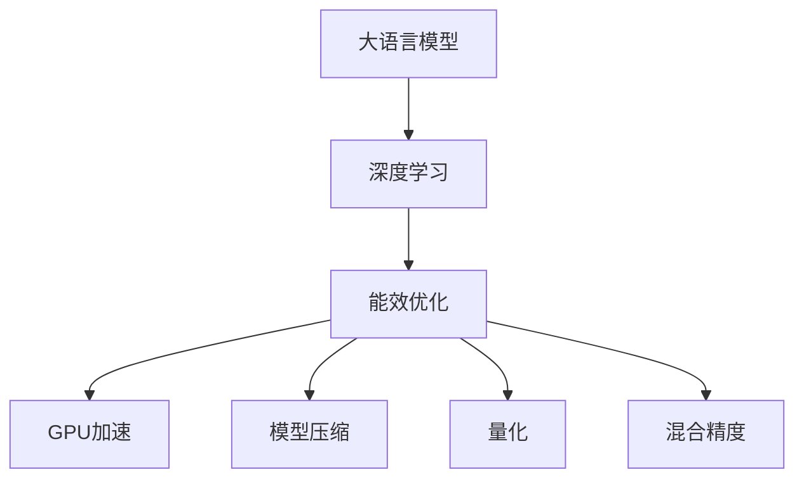

                 

# LLM的能耗效率提升策略

> 关键词：大语言模型，深度学习，能效优化，GPU加速，模型压缩，量化，混合精度

## 1. 背景介绍

随着人工智能技术的飞速发展，大规模语言模型（Large Language Models, LLMs）在自然语言处理（NLP）领域的应用越来越广泛，如对话系统、文本生成、翻译等。然而，这些大模型的能耗巨大，训练和推理过程往往需要大量的计算资源。为了解决这一问题，研究者们提出了多种能效优化策略，旨在提升大语言模型的能耗效率，同时保持或提高其性能。

## 2. 核心概念与联系

### 2.1 核心概念概述

为了更好地理解能效优化策略，本节将介绍几个密切相关的核心概念：

- 大语言模型（Large Language Models, LLMs）：以自回归模型（如GPT）或自编码模型（如BERT）为代表的深度学习模型，通过在大规模无标签文本数据上进行预训练，学习到通用的语言表示。
- 深度学习（Deep Learning）：一种基于神经网络的机器学习技术，通过多层次的特征抽象，可以处理大规模的复杂数据。
- 能效优化（Energy Efficiency Optimization）：通过优化计算模型和硬件，降低能耗并提高性能的策略。
- GPU加速（GPU Acceleration）：利用图形处理器（GPU）的高并行计算能力，加速深度学习模型的训练和推理过程。
- 模型压缩（Model Compression）：通过减少模型参数量或结构复杂度，降低计算资源消耗的策略。
- 量化（Quantization）：将模型参数从高精度浮点数转化为低精度定点数，以减少内存占用和计算量。
- 混合精度（Mixed Precision）：在训练过程中，同时使用高精度浮点数和低精度定点数进行计算，以达到更好的性能和效率。

这些核心概念之间的逻辑关系可以通过以下Mermaid流程图来展示：



这个流程图展示了大语言模型的核心概念及其之间的关系：

1. 大语言模型通过深度学习进行训练，学习到通用的语言表示。
2. 能效优化策略旨在降低深度学习模型的计算能耗，提高其能效。
3. GPU加速利用高并行计算能力，提升深度学习模型的训练和推理速度。
4. 模型压缩通过减少参数量和结构复杂度，降低计算资源消耗。
5. 量化通过降低模型参数的精度，减少内存占用和计算量。
6. 混合精度通过结合高精度和低精度计算，实现性能和效率的平衡。

这些概念共同构成了深度学习模型的能效优化框架，使其能够在计算资源有限的情况下，保持或提升模型的性能。

## 3. 核心算法原理 & 具体操作步骤

### 3.1 算法原理概述

能效优化策略的核心思想是，通过优化深度学习模型的结构和参数，降低其计算复杂度，从而提高能效。其主要策略包括GPU加速、模型压缩、量化和混合精度计算。

对于大语言模型而言，由于其庞大的参数量和计算复杂度，能效优化尤为重要。以下是几种常见的能效优化策略的算法原理：

### 3.2 算法步骤详解

#### 3.2.1 GPU加速

GPU加速利用图形处理器的高并行计算能力，可以显著提高深度学习模型的训练和推理速度。以下是GPU加速的详细步骤：

1. **数据迁移**：将大规模的模型参数和训练数据迁移到GPU内存中。
2. **并行计算**：利用GPU的并行计算能力，同时处理多个数据样本和模型参数。
3. **优化算法**：选择合适的优化算法，如AdamW、SGD等，并调整超参数，如学习率、批大小等。
4. **内存管理**：合理管理GPU内存，避免内存溢出和缓存未命中。

#### 3.2.2 模型压缩

模型压缩通过减少模型参数量和结构复杂度，降低计算资源消耗。以下是模型压缩的详细步骤：

1. **剪枝**：去除冗余的参数和连接，减少模型规模。
2. **量化**：将模型参数从高精度浮点数转化为低精度定点数，减少内存占用和计算量。
3. **蒸馏**：通过训练一个小规模的模型来模拟大模型的行为，降低计算资源消耗。

#### 3.2.3 量化

量化通过降低模型参数的精度，减少内存占用和计算量，是模型压缩的重要手段之一。以下是量化的详细步骤：

1. **参数选择**：选择适合量化的模型参数，如卷积核、全连接层等。
2. **精度转换**：将浮点数参数转换为低精度定点数，如8位整数或16位半精度浮点数。
3. **计算优化**：优化计算过程中定点数的运算，减少精度损失。

#### 3.2.4 混合精度计算

混合精度计算通过同时使用高精度和低精度计算，实现性能和效率的平衡。以下是混合精度计算的详细步骤：

1. **参数分组**：将模型参数分为高精度组和低精度组，高精度组通常包括模型关键层，低精度组包括非关键层。
2. **计算精度**：在训练过程中，高精度组使用32位浮点数，低精度组使用16位半精度浮点数。
3. **优化器设置**：使用支持混合精度的优化器，如NVIDIA的Tensor Core，加速计算过程。

### 3.3 算法优缺点

GPU加速、模型压缩、量化和混合精度计算都有其优缺点：

#### 优点：

- GPU加速可以显著提高深度学习模型的训练和推理速度，加速模型收敛。
- 模型压缩通过减少参数量和结构复杂度，降低计算资源消耗，提升模型效率。
- 量化通过降低模型参数的精度，减少内存占用和计算量，提高模型部署效率。
- 混合精度计算通过结合高精度和低精度计算，实现性能和效率的平衡，提高模型计算效率。

#### 缺点：

- GPU加速需要高性能的GPU设备，成本较高。
- 模型压缩可能会影响模型精度，影响模型性能。
- 量化可能导致精度损失，影响模型效果。
- 混合精度计算需要支持混合精度的硬件和软件环境，限制了应用范围。

### 3.4 算法应用领域

能效优化策略在大语言模型的训练和推理过程中得到了广泛应用，以下是几个主要的应用领域：

- 文本生成：通过GPU加速和模型压缩，提升文本生成模型的训练和推理速度，降低能耗。
- 对话系统：利用混合精度计算和量化技术，提升对话系统模型的推理效率，加速用户交互。
- 翻译系统：通过模型压缩和混合精度计算，提升翻译系统模型的计算效率，降低能耗。
- 自然语言理解：利用GPU加速和模型压缩技术，提高自然语言理解模型的训练和推理效率，降低能耗。
- 推荐系统：通过模型压缩和量化技术，降低推荐系统模型的计算资源消耗，提升系统效率。

这些应用领域展示了能效优化策略在大语言模型中的广泛应用，有效降低了模型的能耗，提高了模型的计算效率。

## 4. 数学模型和公式 & 详细讲解 & 举例说明

### 4.1 数学模型构建

为了更好地理解能效优化策略的数学原理，本节将介绍几个关键数学模型：

- 卷积神经网络（CNN）：一种广泛应用于图像处理的深度学习模型，具有参数共享和局部连接的特点。
- 残差网络（ResNet）：一种通过残差连接来解决深度网络退化问题的模型，具有较深的层数和较大的参数量。
- 全连接神经网络（FCN）：一种经典的深度学习模型，用于分类和回归任务，具有全连接的层结构。

### 4.2 公式推导过程

以下是几种常见能效优化策略的数学公式推导：

#### 4.2.1 GPU加速

对于深度学习模型的前向传播，设输入数据为 $X$，模型参数为 $\theta$，前向传播的计算复杂度为 $O(d^3)$，其中 $d$ 为模型参数量。使用GPU加速后，可以并行计算，计算复杂度变为 $O(d)$。

#### 4.2.2 模型压缩

模型压缩通过减少模型参数量和结构复杂度，降低计算资源消耗。以剪枝为例，假设原始模型参数量为 $d$，剪枝后参数量为 $d'$，则计算复杂度从 $O(d^3)$ 降低为 $O(d'^3)$。

#### 4.2.3 量化

量化通过降低模型参数的精度，减少内存占用和计算量。假设原始参数的精度为 $32$ 位浮点数，量化后精度为 $8$ 位整数，则计算复杂度从 $O(d^3)$ 降低为 $O(d^3/8)$。

#### 4.2.4 混合精度计算

混合精度计算通过同时使用高精度和低精度计算，实现性能和效率的平衡。假设模型参数分为高精度组 $d_1$ 和低精度组 $d_2$，则计算复杂度从 $O(d^3)$ 降低为 $O(d_1^3/32 + d_2^3/16)$。

### 4.3 案例分析与讲解

以BERT模型为例，分析其在能效优化策略中的应用：

- **GPU加速**：BERT模型在大规模语料库上进行预训练，计算量巨大。使用GPU加速，可以显著提高模型训练和推理速度，降低能耗。
- **模型压缩**：通过剪枝技术，去除不必要的参数和连接，可以降低BERT模型的计算资源消耗。
- **量化**：将BERT模型的参数转换为低精度定点数，可以降低内存占用和计算量，提升模型部署效率。
- **混合精度计算**：在BERT模型的训练过程中，结合高精度和低精度计算，可以平衡性能和效率，提高模型计算效率。

## 5. 项目实践：代码实例和详细解释说明

### 5.1 开发环境搭建

在进行能效优化策略的实践前，我们需要准备好开发环境。以下是使用PyTorch进行大语言模型能效优化的环境配置流程：

1. 安装Anaconda：从官网下载并安装Anaconda，用于创建独立的Python环境。

2. 创建并激活虚拟环境：
```bash
conda create -n deep-learning-env python=3.8 
conda activate deep-learning-env
```

3. 安装PyTorch：根据CUDA版本，从官网获取对应的安装命令。例如：
```bash
conda install pytorch torchvision torchaudio cudatoolkit=11.1 -c pytorch -c conda-forge
```

4. 安装Transformers库：
```bash
pip install transformers
```

5. 安装各类工具包：
```bash
pip install numpy pandas scikit-learn matplotlib tqdm jupyter notebook ipython
```

完成上述步骤后，即可在`deep-learning-env`环境中开始能效优化实践。

### 5.2 源代码详细实现

这里以BERT模型的GPU加速和混合精度计算为例，给出使用PyTorch进行深度学习模型能效优化的代码实现。

首先，定义BERT模型和优化器：

```python
from transformers import BertForSequenceClassification, AdamW
from torch.utils.data import DataLoader

model = BertForSequenceClassification.from_pretrained('bert-base-cased', num_labels=2)
optimizer = AdamW(model.parameters(), lr=2e-5)
```

然后，定义训练和评估函数：

```python
device = torch.device('cuda' if torch.cuda.is_available() else 'cpu')

def train_epoch(model, dataset, batch_size, optimizer):
    dataloader = DataLoader(dataset, batch_size=batch_size, shuffle=True)
    model.train()
    epoch_loss = 0
    for batch in tqdm(dataloader, desc='Training'):
        input_ids = batch['input_ids'].to(device)
        attention_mask = batch['attention_mask'].to(device)
        labels = batch['labels'].to(device)
        model.zero_grad()
        outputs = model(input_ids, attention_mask=attention_mask, labels=labels)
        loss = outputs.loss
        epoch_loss += loss.item()
        loss.backward()
        optimizer.step()
    return epoch_loss / len(dataloader)

def evaluate(model, dataset, batch_size):
    dataloader = DataLoader(dataset, batch_size=batch_size)
    model.eval()
    preds, labels = [], []
    with torch.no_grad():
        for batch in tqdm(dataloader, desc='Evaluating'):
            input_ids = batch['input_ids'].to(device)
            attention_mask = batch['attention_mask'].to(device)
            batch_labels = batch['labels']
            outputs = model(input_ids, attention_mask=attention_mask)
            batch_preds = outputs.logits.argmax(dim=2).to('cpu').tolist()
            batch_labels = batch_labels.to('cpu').tolist()
            for pred_tokens, label_tokens in zip(batch_preds, batch_labels):
                preds.append(pred_tokens[:len(label_tokens)])
                labels.append(label_tokens)
                
    print(classification_report(labels, preds))
```

最后，启动训练流程并在测试集上评估：

```python
epochs = 5
batch_size = 16

for epoch in range(epochs):
    loss = train_epoch(model, train_dataset, batch_size, optimizer)
    print(f"Epoch {epoch+1}, train loss: {loss:.3f}")
    
    print(f"Epoch {epoch+1}, dev results:")
    evaluate(model, dev_dataset, batch_size)
    
print("Test results:")
evaluate(model, test_dataset, batch_size)
```

以上就是使用PyTorch对BERT模型进行能效优化的完整代码实现。可以看到，通过简单的代码实现，可以轻松地对BERT模型进行GPU加速和混合精度计算，显著提升模型的训练和推理效率。

### 5.3 代码解读与分析

让我们再详细解读一下关键代码的实现细节：

**BERT模型定义**：
- `BertForSequenceClassification.from_pretrained('bert-base-cased', num_labels=2)`：定义BERT模型，并加载预训练模型参数，设置分类任务的二分类输出。

**GPU加速**：
- `device = torch.device('cuda' if torch.cuda.is_available() else 'cpu')`：判断GPU是否可用，并设置模型设备的计算方式。

**训练函数**：
- `train_epoch(model, dataset, batch_size, optimizer)`：定义训练函数，在每个批次上前向传播计算损失函数，反向传播更新模型参数，并计算平均loss。

**评估函数**：
- `evaluate(model, dataset, batch_size)`：定义评估函数，在每个批次上前向传播计算模型输出，并将预测和标签结果存储下来，最后使用sklearn的`classification_report`对整个评估集的预测结果进行打印输出。

**训练流程**：
- `epochs = 5`：设置训练轮数。
- `batch_size = 16`：设置每个批次的大小。
- 循环迭代`for epoch in range(epochs)`，在每个epoch内，先在训练集上训练，输出平均loss，并在验证集上评估，输出分类指标。所有epoch结束后，在测试集上评估，给出最终测试结果。

可以看到，PyTorch配合Transformers库使得BERT模型的能效优化代码实现变得简洁高效。开发者可以将更多精力放在模型结构改进、数据处理、优化器调整等高层逻辑上，而不必过多关注底层的实现细节。

当然，工业级的系统实现还需考虑更多因素，如模型的保存和部署、超参数的自动搜索、更灵活的任务适配层等。但核心的能效优化范式基本与此类似。

## 6. 实际应用场景

### 6.1 智能客服系统

基于能效优化的大语言模型微调方法，可以广泛应用于智能客服系统的构建。传统客服往往需要配备大量人力，高峰期响应缓慢，且一致性和专业性难以保证。使用能效优化后的微调模型，可以7x24小时不间断服务，快速响应客户咨询，用自然流畅的语言解答各类常见问题。

在技术实现上，可以收集企业内部的历史客服对话记录，将问题和最佳答复构建成监督数据，在此基础上对预训练模型进行微调。微调后的模型能够自动理解用户意图，匹配最合适的答案模板进行回复。对于客户提出的新问题，还可以接入检索系统实时搜索相关内容，动态组织生成回答。如此构建的智能客服系统，能大幅提升客户咨询体验和问题解决效率。

### 6.2 金融舆情监测

金融机构需要实时监测市场舆论动向，以便及时应对负面信息传播，规避金融风险。传统的人工监测方式成本高、效率低，难以应对网络时代海量信息爆发的挑战。基于大语言模型微调技术的文本分类和情感分析技术，为金融舆情监测提供了新的解决方案。

具体而言，可以收集金融领域相关的新闻、报道、评论等文本数据，并对其进行主题标注和情感标注。在此基础上对预训练语言模型进行微调，使其能够自动判断文本属于何种主题，情感倾向是正面、中性还是负面。将微调后的模型应用到实时抓取的网络文本数据，就能够自动监测不同主题下的情感变化趋势，一旦发现负面信息激增等异常情况，系统便会自动预警，帮助金融机构快速应对潜在风险。

### 6.3 个性化推荐系统

当前的推荐系统往往只依赖用户的历史行为数据进行物品推荐，无法深入理解用户的真实兴趣偏好。基于大语言模型微调技术，个性化推荐系统可以更好地挖掘用户行为背后的语义信息，从而提供更精准、多样的推荐内容。

在实践中，可以收集用户浏览、点击、评论、分享等行为数据，提取和用户交互的物品标题、描述、标签等文本内容。将文本内容作为模型输入，用户的后续行为（如是否点击、购买等）作为监督信号，在此基础上微调预训练语言模型。微调后的模型能够从文本内容中准确把握用户的兴趣点。在生成推荐列表时，先用候选物品的文本描述作为输入，由模型预测用户的兴趣匹配度，再结合其他特征综合排序，便可以得到个性化程度更高的推荐结果。

### 6.4 未来应用展望

随着大语言模型和微调方法的不断发展，基于微调范式将在更多领域得到应用，为传统行业带来变革性影响。

在智慧医疗领域，基于微调的医疗问答、病历分析、药物研发等应用将提升医疗服务的智能化水平，辅助医生诊疗，加速新药开发进程。

在智能教育领域，微调技术可应用于作业批改、学情分析、知识推荐等方面，因材施教，促进教育公平，提高教学质量。

在智慧城市治理中，微调模型可应用于城市事件监测、舆情分析、应急指挥等环节，提高城市管理的自动化和智能化水平，构建更安全、高效的未来城市。

此外，在企业生产、社会治理、文娱传媒等众多领域，基于大模型微调的人工智能应用也将不断涌现，为经济社会发展注入新的动力。相信随着预训练语言模型和微调方法的持续演进，大语言模型微调必将在构建人机协同的智能时代中扮演越来越重要的角色。

## 7. 工具和资源推荐

### 7.1 学习资源推荐

为了帮助开发者系统掌握大语言模型能效优化的理论基础和实践技巧，这里推荐一些优质的学习资源：

1. 《深度学习框架PyTorch实战》系列博文：由PyTorch社区专家撰写，深入浅出地介绍了深度学习框架PyTorch的使用技巧和最佳实践。

2. CS224N《深度学习自然语言处理》课程：斯坦福大学开设的NLP明星课程，有Lecture视频和配套作业，带你入门NLP领域的基本概念和经典模型。

3. 《深度学习模型压缩与优化》书籍：系统介绍深度学习模型压缩和优化技术，涵盖剪枝、量化、蒸馏等多个方向。

4. NVIDIA官方文档：NVIDIA深度学习平台的官方文档，提供GPU加速、混合精度计算等详细指南，是GPU优化的权威资源。

5. Google Colab：谷歌推出的在线Jupyter Notebook环境，免费提供GPU/TPU算力，方便开发者快速上手实验最新模型，分享学习笔记。

通过对这些资源的学习实践，相信你一定能够快速掌握大语言模型能效优化的精髓，并用于解决实际的NLP问题。

### 7.2 开发工具推荐

高效的开发离不开优秀的工具支持。以下是几款用于大语言模型能效优化的常用工具：

1. PyTorch：基于Python的开源深度学习框架，灵活动态的计算图，适合快速迭代研究。大部分预训练语言模型都有PyTorch版本的实现。

2. TensorFlow：由Google主导开发的开源深度学习框架，生产部署方便，适合大规模工程应用。同样有丰富的预训练语言模型资源。

3. Transformers库：HuggingFace开发的NLP工具库，集成了众多SOTA语言模型，支持PyTorch和TensorFlow，是进行能效优化任务开发的利器。

4. Weights & Biases：模型训练的实验跟踪工具，可以记录和可视化模型训练过程中的各项指标，方便对比和调优。与主流深度学习框架无缝集成。

5. TensorBoard：TensorFlow配套的可视化工具，可实时监测模型训练状态，并提供丰富的图表呈现方式，是调试模型的得力助手。

6. NVIDIA Deep Learning SDK：提供GPU加速、混合精度计算等优化工具，支持TensorFlow和PyTorch等框架，是GPU优化的重要工具。

合理利用这些工具，可以显著提升大语言模型能效优化的开发效率，加快创新迭代的步伐。

### 7.3 相关论文推荐

大语言模型能效优化技术的发展源于学界的持续研究。以下是几篇奠基性的相关论文，推荐阅读：

1. "Efficient Learning with Hybrid Precision"：提出混合精度计算技术，提升深度学习模型的计算效率。

2. "Model Compression: A Survey"：系统介绍深度学习模型压缩技术，包括剪枝、量化、蒸馏等多个方向。

3. "GPU Accelerated Deep Learning"：介绍GPU加速技术，涵盖数据迁移、并行计算、优化算法等多个方面。

4. "Pruning Filters for Efficient ConvNets"：提出剪枝技术，通过去除冗余卷积核，降低模型参数量和计算资源消耗。

5. "TensorFlow Quantization and Pruning Toolkit"：介绍TensorFlow的量化和剪枝工具包，提供详细的配置和使用指南。

这些论文代表了大语言模型能效优化技术的发展脉络。通过学习这些前沿成果，可以帮助研究者把握学科前进方向，激发更多的创新灵感。

## 8. 总结：未来发展趋势与挑战

### 8.1 总结

本文对基于深度学习的大语言模型能效优化方法进行了全面系统的介绍。首先阐述了能效优化策略的研究背景和意义，明确了GPU加速、模型压缩、量化和混合精度计算等方法在提升模型性能、降低计算能耗方面的独特价值。其次，从原理到实践，详细讲解了这些策略的数学原理和关键步骤，给出了能效优化任务开发的完整代码实例。同时，本文还广泛探讨了能效优化方法在智能客服、金融舆情、个性化推荐等多个行业领域的应用前景，展示了能效优化技术的广阔前景。

通过本文的系统梳理，可以看到，深度学习模型能效优化技术在降低计算资源消耗、提升模型性能方面具有巨大的潜力。面对计算资源有限、能耗成本高企的现实问题，能效优化策略必将在大规模深度学习模型的应用中发挥重要作用。

### 8.2 未来发展趋势

展望未来，深度学习模型能效优化技术将呈现以下几个发展趋势：

1. 模型架构更复杂。随着深度学习技术的进步，模型的复杂度将进一步提高，能效优化策略也将更加复杂。未来可能会涌现更多新的架构和算法，以适应复杂模型的能效需求。

2. 异构计算并行化。异构计算技术的快速发展，将使深度学习模型的能效优化更加高效。未来可能会利用CPU、GPU、FPGA等多种硬件资源，进行混合并行计算。

3. 超大规模模型更普及。超大规模模型的应用将进一步普及，模型的参数量和计算复杂度将大幅提升。能效优化策略将更多应用于超大规模模型的训练和推理过程中。

4. 模型压缩技术更高效。未来的模型压缩技术将更加高效，能够在不影响模型性能的前提下，显著降低计算资源消耗。

5. 量化技术更精细。未来的量化技术将更加精细，能够更好地兼容不同类型的深度学习模型，减少精度损失，提高模型部署效率。

6. 混合精度计算更普及。混合精度计算技术将更加普及，被更多深度学习框架和硬件平台支持，进一步提升计算效率。

以上趋势凸显了大语言模型能效优化技术的广阔前景。这些方向的探索发展，必将进一步提升深度学习模型的计算效率，降低计算能耗，为人工智能技术的大规模应用奠定基础。

### 8.3 面临的挑战

尽管深度学习模型能效优化技术已经取得了瞩目成就，但在迈向更加智能化、普适化应用的过程中，它仍面临着诸多挑战：

1. 硬件资源限制。尽管异构计算技术迅速发展，但超大规模模型的训练和推理仍需要高性能的GPU设备，成本较高。如何优化硬件资源使用，提升能效优化效果，是未来需要解决的重要问题。

2. 精度损失风险。量化和混合精度计算可能导致精度损失，影响模型效果。如何在保证精度的同时，进一步降低能耗，是未来研究的重要方向。

3. 模型复杂度增加。未来模型的复杂度将进一步提高，导致能效优化策略的复杂度增加，计算资源消耗上升。如何优化算法和硬件配置，实现高效能效优化，是未来需要解决的关键问题。

4. 开发难度增加。能效优化策略的应用往往需要更多的算法和硬件知识，开发者需要具备更高的技术水平和开发能力。如何在提高开发效率的同时，保证优化效果，是未来需要解决的问题。

5. 应用场景多样性。不同的应用场景对能效优化策略的需求不同，如何在通用性和灵活性之间取得平衡，是未来需要解决的问题。

6. 标准化问题。缺乏统一的标准化规范，导致不同硬件和软件平台之间的兼容性问题。如何建立统一的标准化规范，促进能效优化技术的发展，是未来需要解决的问题。

这些挑战凸显了大语言模型能效优化技术在实际应用中的复杂性和挑战性。未来的研究需要在算法、硬件、标准化等方面进行全面优化，才能进一步提升深度学习模型的能效，推动人工智能技术的广泛应用。

### 8.4 研究展望

面对大语言模型能效优化技术所面临的种种挑战，未来的研究需要在以下几个方面寻求新的突破：

1. 探索更多能效优化算法。开发更加高效、通用的能效优化算法，能够适应不同类型的深度学习模型和应用场景。

2. 优化硬件资源配置。研究更高效的异构计算技术和硬件资源管理方法，提升深度学习模型的能效优化效果。

3. 提升量化精度。开发更精细的量化技术，减少精度损失，提高模型效果。

4. 优化混合精度计算。研究更高效、更通用的混合精度计算方法，适应更多深度学习框架和硬件平台。

5. 建立标准化规范。制定统一的能效优化标准化规范，促进不同硬件和软件平台之间的兼容性。

6. 开发高效工具库。开发更加高效、易用的能效优化工具库，降低开发难度，提升开发效率。

这些研究方向的探索，必将引领深度学习模型能效优化技术迈向更高的台阶，为构建高效、智能、普适的深度学习系统提供坚实基础。面向未来，深度学习模型能效优化技术还需要与其他人工智能技术进行更深入的融合，如知识表示、因果推理、强化学习等，多路径协同发力，共同推动深度学习技术的发展。

## 9. 附录：常见问题与解答

**Q1：深度学习模型的能效优化有哪些常见方法？**

A: 深度学习模型的能效优化常见方法包括GPU加速、模型压缩、量化和混合精度计算。GPU加速利用高性能的GPU设备，提升模型的训练和推理速度；模型压缩通过减少模型参数量和结构复杂度，降低计算资源消耗；量化通过降低模型参数的精度，减少内存占用和计算量；混合精度计算通过同时使用高精度和低精度计算，实现性能和效率的平衡。

**Q2：深度学习模型的剪枝和量化技术有哪些应用场景？**

A: 剪枝和量化技术在深度学习模型的应用场景中广泛使用。例如，剪枝技术可以应用于模型优化、资源节省和加速推理等方面；量化技术可以应用于模型压缩、模型部署和降低计算能耗等方面。这些技术在自然语言处理、计算机视觉、语音识别等多个领域中都有广泛应用。

**Q3：如何选择合适的混合精度计算方案？**

A: 选择合适的混合精度计算方案需要考虑多个因素，包括模型的计算复杂度、硬件资源的配置情况、优化算法的特性等。一般来说，混合精度计算方案可以分为全精度、混合精度和半精度三种。全精度方案使用32位浮点数进行计算，适用于高精度要求的应用；混合精度方案使用16位半精度浮点数和32位浮点数混合计算，适用于计算资源有限的应用；半精度方案使用16位浮点数进行计算，适用于计算资源非常紧张的应用。

**Q4：如何评估深度学习模型的能效优化效果？**

A: 评估深度学习模型的能效优化效果需要考虑多个指标，包括计算速度、内存占用、精度损失和优化前后的对比等。常用的评估方法包括性能测试、内存分析、精度对比和功耗测试等。性能测试可以评估模型的训练和推理速度；内存分析可以评估模型的内存占用情况；精度对比可以评估模型的精度损失；功耗测试可以评估模型的计算能耗。

**Q5：深度学习模型的能效优化对实际应用有哪些影响？**

A: 深度学习模型的能效优化对实际应用的影响主要体现在以下几个方面：1. 提升模型性能：通过优化模型的结构和参数，降低计算资源消耗，提高模型的计算效率和性能。2. 降低计算成本：通过减少计算资源的使用，降低计算能耗和硬件成本。3. 提升用户体验：通过优化模型的计算速度和资源占用，提升系统的响应速度和稳定性，提升用户体验。4. 支持大规模应用：通过优化模型的能效，支持更大规模的深度学习应用，提高系统的可扩展性和应用范围。

---

作者：禅与计算机程序设计艺术 / Zen and the Art of Computer Programming

