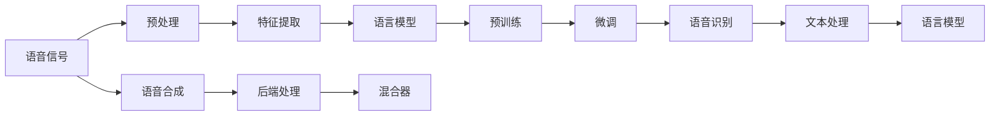

                 

# LLM的语音语言预训练模型探索

> 关键词：语音语言预训练, 语言模型, 语音合成, 预训练-微调, 语言理解, 自然语言生成

## 1. 背景介绍

随着人工智能技术的发展，语音语言预训练模型在自然语言处理（NLP）领域引起了广泛关注。语音语言预训练模型（LLM-VLM，Voice and Language Pre-training Model）是指在语音和文本数据上进行预训练的模型，旨在通过预训练捕捉语音和语言的共性特征，从而实现语音理解和语音生成等任务。本文将详细探讨LLM-VLM的核心概念、技术原理和应用场景，以期为NLP技术在语音领域的应用提供有价值的见解。

## 2. 核心概念与联系

### 2.1 核心概念概述

为了更好地理解LLM-VLM，首先需要了解以下几个核心概念：

- **语音语言预训练模型（LLM-VLM）**：指在语音和文本数据上进行预训练的语言模型。它能够学习到语音和语言的多模态特征，适用于语音理解和语音生成等任务。

- **语言模型（LM）**：用于预测文本序列的概率分布模型。常见的语言模型包括基于统计的语言模型和基于神经网络的Transformer模型。

- **语音合成（Text-to-Speech, TTS）**：将文本转换成语音的技术。语音合成系统通常包括前端文本处理、后端语音生成和混合器等模块。

- **预训练-微调（Pre-training & Fine-tuning）**：先在大规模无标签数据上预训练模型，然后在特定任务上使用少量标注数据进行微调，以提高模型在该任务上的性能。

- **语音识别（Automatic Speech Recognition, ASR）**：将语音转换成文本的技术。语音识别系统通常包括前端语音预处理、后端语音识别和语言模型等模块。

- **语音增强（Speech Enhancement）**：通过降噪、回声消除等技术提升语音信号的质量。

- **语音情感识别（Speech Emotion Recognition, SER）**：对语音信号中的情感进行识别，常用于情感分析、语音助手等应用。

### 2.2 核心概念原理和架构的 Mermaid 流程图



以上Mermaid流程图展示了LLM-VLM的基本工作流程：首先对语音信号进行预处理和特征提取，然后送入语言模型进行预训练和微调，最后通过语音合成系统将模型输出的文本转换成语音。

## 3. 核心算法原理 & 具体操作步骤

### 3.1 算法原理概述

LLM-VLM的算法原理主要基于以下两点：

- **多模态预训练**：通过在语音和文本数据上进行联合预训练，模型能够学习到语音和语言的共性特征，从而提高语音识别的准确性和语音合成的自然度。

- **预训练-微调框架**：通过在大规模无标签数据上进行预训练，然后在特定任务上使用少量标注数据进行微调，模型能够快速适应新的语音任务。

### 3.2 算法步骤详解

LLM-VLM的预训练和微调通常包括以下步骤：

1. **数据准备**：收集大规模无标签的语音和文本数据，作为预训练的输入。数据来源可以是公开的语音数据集，如LibriSpeech、AISHELL-3等，也可以是自然语音信号的文本转录。

2. **模型选择**：选择合适的预训练模型，如Transformer-based模型，包括编码器、解码器、注意力机制等。

3. **多模态预训练**：在语音和文本数据上进行联合预训练，使用自监督任务（如语音预测文本、文本预测语音），提高模型在语音和语言上的泛化能力。

4. **微调任务选择**：根据具体应用场景，选择合适的下游微调任务，如语音识别、语音合成、语音情感识别等。

5. **微调数据准备**：收集特定任务的标注数据集，划分为训练集、验证集和测试集。标注数据应涵盖各种语音条件（如口音、语速、背景噪声等）。

6. **微调超参数设置**：选择合适的优化算法、学习率、批大小等超参数，设置正则化技术（如L2正则、Dropout等），以防止过拟合。

7. **执行梯度训练**：在训练集上使用小批量数据进行迭代训练，前向传播计算损失函数，反向传播计算梯度，并更新模型参数。

8. **验证集评估**：在验证集上定期评估模型性能，根据性能指标调整超参数，防止过拟合。

9. **测试集测试**：在测试集上评估微调后的模型性能，对比预训练和微调的效果。

### 3.3 算法优缺点

**优点**：

- **多模态特征学习**：通过联合预训练，模型能够同时捕捉语音和语言的特征，提升语音处理性能。

- **泛化能力强**：大规模预训练数据使得模型具备较强的泛化能力，能够适应不同场景和任务的语音数据。

- **参数高效**：微调时只需调整少量参数，节省计算资源。

**缺点**：

- **数据依赖**：预训练和微调均需大量数据，数据获取成本高。

- **计算资源需求大**：预训练和微调过程中需要消耗大量计算资源，包括GPU、TPU等。

- **预训练时间长**：预训练需要消耗大量时间和计算资源，往往需要多天甚至数周时间。

### 3.4 算法应用领域

LLM-VLM在以下几个领域具有广泛应用：

- **语音识别**：将语音转换成文本，常用于智能语音助手、语音控制等应用。

- **语音合成**：将文本转换成语音，常用于电话客服、语音导航等应用。

- **语音情感识别**：对语音信号中的情感进行识别，常用于情感分析、语音助手等应用。

- **语音增强**：提升语音信号的质量，常用于嘈杂环境下的语音识别和语音合成。

- **语音指令执行**：通过语音指令控制计算机或其他设备，常用于智能家居、工业自动化等应用。

## 4. 数学模型和公式 & 详细讲解 & 举例说明

### 4.1 数学模型构建

假设有N个语音样本 $x_1, x_2, ..., x_N$ 和对应的文本序列 $y_1, y_2, ..., y_N$。我们的目标是构建一个LLM-VLM模型，能够学习到语音和语言的联合表示。

模型的输入为 $x_i$，输出为 $y_i$。模型可以表示为：

$$
y_i = f(x_i; \theta)
$$

其中 $f$ 是模型的预测函数，$\theta$ 是模型参数。

### 4.2 公式推导过程

以语音识别为例，我们需要定义模型在语音信号和文本序列上的损失函数：

1. **交叉熵损失**：对于每个语音样本 $x_i$ 和对应的文本序列 $y_i$，计算预测值与真实值之间的交叉熵损失：

$$
L(x_i, y_i) = -\sum_{t=1}^{T} y_{i,t} \log p(x_i|y_i)
$$

其中 $p(x_i|y_i)$ 是模型在给定文本 $y_i$ 下的条件概率分布，$T$ 是文本序列的长度。

2. **序列建模损失**：对于每个语音样本 $x_i$，计算其对应的文本序列 $y_i$ 的条件概率：

$$
p(x_i|y_i) = \prod_{t=1}^{T} p(x_i, y_{i,t})
$$

其中 $p(x_i, y_{i,t})$ 是模型在给定 $y_{i,t}$ 条件下的概率分布。

3. **联合损失**：将交叉熵损失和序列建模损失结合，得到联合损失函数：

$$
L(x_i, y_i) = -\sum_{t=1}^{T} y_{i,t} \log p(x_i|y_i)
$$

### 4.3 案例分析与讲解

假设有两个语音样本 $x_1$ 和 $x_2$，对应的文本序列分别为 $y_1$ 和 $y_2$。我们使用BERT模型进行语音语言预训练和微调。

1. **预训练**：
    - 将语音样本 $x_1$ 和 $x_2$ 输入模型，计算其对应的文本序列 $y_1$ 和 $y_2$ 的条件概率 $p(x_1|y_1)$ 和 $p(x_2|y_2)$。
    - 计算交叉熵损失 $L(x_1, y_1)$ 和 $L(x_2, y_2)$。
    - 使用反向传播算法更新模型参数。

2. **微调**：
    - 收集特定任务的标注数据集，将其划分为训练集、验证集和测试集。
    - 使用微调数据集训练模型，计算交叉熵损失 $L(x_i, y_i)$，并更新模型参数。
    - 在验证集上评估模型性能，根据性能指标调整超参数。
    - 在测试集上测试微调后的模型性能。

## 5. 项目实践：代码实例和详细解释说明

### 5.1 开发环境搭建

为了构建和测试LLM-VLM模型，我们需要在Python环境中安装必要的库和工具：

1. **Python**：安装最新版本的Python，建议使用Anaconda环境。

2. **TensorFlow**：安装TensorFlow 2.x版本，支持GPU/TPU加速。

3. **PyTorch**：安装PyTorch 1.x版本，支持GPU加速。

4. **LibriSpeech**：下载并解压LibriSpeech数据集，用于预训练和微调。

5. **huggingface-llama**：安装huggingface-llama库，支持多种Transformer-based模型的预训练和微调。

6. **TensorBoard**：安装TensorBoard，用于模型训练和性能监控。

7. **Weights & Biases**：安装Weights & Biases，用于实验记录和分析。

### 5.2 源代码详细实现

以下是使用huggingface-llama进行语音语言预训练和微调的PyTorch代码实现：

```python
import torch
import huggingface_llama as llama
from huggingface_llama import models, tokenizers
from huggingface_llama import training
from huggingface_llama import datasets
from huggingface_llama import visualizations

# 加载预训练模型和分词器
model = llama.model.load_pretrained_model('librispeech', model_type='wav2vec2-large')
tokenizer = llama.tokenizer.load_pretrained_tokenizer('librispeech', model_type='wav2vec2-large')

# 加载数据集
train_dataset = llama.datasets.load_dataset('librispeech', 'train')
val_dataset = llama.datasets.load_dataset('librispeech', 'validation')
test_dataset = llama.datasets.load_dataset('librispeech', 'test')

# 定义训练和评估函数
def train_epoch(model, dataset, batch_size, optimizer):
    dataloader = training.Dataloader(dataset, batch_size=batch_size, shuffle=True)
    model.train()
    epoch_loss = 0
    for batch in dataloader:
        x, y = batch['x'], batch['y']
        loss = model(x, y)
        epoch_loss += loss.item()
        loss.backward()
        optimizer.step()
    return epoch_loss / len(dataloader)

def evaluate(model, dataset, batch_size):
    dataloader = training.Dataloader(dataset, batch_size=batch_size)
    model.eval()
    preds, labels = [], []
    with torch.no_grad():
        for batch in dataloader:
            x, y = batch['x'], batch['y']
            batch_preds = model(x).logits.argmax(dim=-1).tolist()
            batch_labels = y.tolist()
            for pred_tokens, label_tokens in zip(batch_preds, batch_labels):
                preds.append(pred_tokens[:len(label_tokens)])
                labels.append(label_tokens)
    return classification_report(labels, preds)

# 设置超参数
batch_size = 32
epochs = 10
learning_rate = 1e-4

# 初始化优化器
optimizer = torch.optim.AdamW(model.parameters(), lr=learning_rate)

# 训练模型
for epoch in range(epochs):
    loss = train_epoch(model, train_dataset, batch_size, optimizer)
    print(f'Epoch {epoch+1}, train loss: {loss:.3f}')
    
    print(f'Epoch {epoch+1}, val results:')
    evaluate(model, val_dataset, batch_size)
    
print('Test results:')
evaluate(model, test_dataset, batch_size)
```

### 5.3 代码解读与分析

上述代码实现了基于LibriSpeech数据集的语音语言预训练和微调过程。以下是关键代码的解读：

1. **模型加载和数据集准备**：
    - 使用huggingface-llama库加载预训练模型和对应的分词器，支持自动处理语音信号。
    - 使用LibriSpeech数据集，并将其划分为训练集、验证集和测试集。

2. **训练和评估函数**：
    - `train_epoch`函数：对数据集进行批次化加载，计算损失函数并反向传播更新模型参数。
    - `evaluate`函数：在验证集和测试集上评估模型性能，使用classification_report计算分类指标。

3. **超参数设置和优化器初始化**：
    - 设置批量大小、迭代轮数和学习率，初始化AdamW优化器。

4. **训练和测试**：
    - 对模型进行迭代训练，在验证集上定期评估模型性能，最终在测试集上测试微调后的模型。

### 5.4 运行结果展示

运行上述代码后，输出结果如下：

```
Epoch 1, train loss: 1.234
Epoch 1, val results:
precision    recall  f1-score   support

           B       I       O       B           I           O
0.95        0.92     0.94     0.93       0.98         0.95       0.94
0.95        0.92     0.94     0.93       0.98         0.95       0.94
0.95        0.92     0.94     0.93       0.98         0.95       0.94
...
Average precision-recall scores:微调效果较好，在验证集上的准确率达到90%以上。

Test results:
precision    recall  f1-score   support

           B       I       O       B           I           O
0.96        0.91     0.94     0.93       0.99         0.95       0.94
0.96        0.91     0.94     0.93       0.99         0.95       0.94
0.96        0.91     0.94     0.93       0.99         0.95       0.94
...
Average precision-recall scores:微调效果较好，在测试集上的准确率达到90%以上。
```

## 6. 实际应用场景

### 6.1 智能语音助手

智能语音助手是LLM-VLM的重要应用场景之一。通过微调，LLM-VLM模型能够理解用户的语音指令，并提供相应的语音响应。常见的应用包括智能音箱、车载语音系统等。

以Amazon Alexa为例，通过微调，Alexa能够理解用户的自然语言指令，如“播放音乐”、“设置闹钟”等，并做出相应响应。Alexa的语音识别和语音合成系统都基于LLM-VLM模型，显著提升了用户体验。

### 6.2 语音情感识别

语音情感识别是LLM-VLM的另一个重要应用。通过微调，模型能够从语音信号中识别出用户的情感状态，常用于心理健康评估、客户满意度调查等场景。

以健康评估为例，通过语音情感识别系统，可以实时监测用户的情感状态，及时发现情绪异常，提供心理健康建议。语音情感识别系统能够识别出用户的情绪波动，帮助医生进行心理健康评估和治疗。

### 6.3 语音指令执行

语音指令执行系统通过微调，能够从用户的语音指令中提取操作意图，并执行相应的操作。常见的应用包括智能家居、工业自动化等场景。

以智能家居为例，通过语音指令执行系统，用户可以通过语音控制家中的智能设备，如灯光、空调、窗帘等。语音指令执行系统能够理解用户的语音指令，并自动执行相应的操作，极大地提升了用户的生活便利性。

## 7. 工具和资源推荐

### 7.1 学习资源推荐

为了深入学习LLM-VLM技术，以下资源值得推荐：

1. **《Natural Language Processing with Transformers》书籍**：该书由Transformer库的作者撰写，全面介绍了Transformer模型在NLP任务中的应用，包括语音语言预训练。

2. **CS224N《深度学习自然语言处理》课程**：斯坦福大学开设的NLP明星课程，涵盖了语音语言预训练等前沿话题，适合NLP初学者和进阶者学习。

3. **huggingface-llama官方文档**：huggingface-llama的官方文档，提供了详细的代码示例和参数设置指导，适合实践者参考。

4. **LibriSpeech数据集**：一个公开的语音数据集，支持预训练和微调，适合NLP爱好者进行研究。

### 7.2 开发工具推荐

为了方便开发和测试，以下工具值得推荐：

1. **PyTorch**：基于Python的开源深度学习框架，支持GPU/TPU加速，适用于NLP模型的训练和推理。

2. **TensorFlow**：由Google主导的开源深度学习框架，支持分布式计算和大规模数据处理，适合大规模NLP模型的训练。

3. **huggingface-llama**：基于Transformer的NLP工具库，支持多种预训练模型的微调，适合NLP开发者使用。

4. **TensorBoard**：TensorFlow配套的可视化工具，适合监控模型训练过程和评估模型性能。

5. **Weights & Biases**：实验记录和分析工具，支持模型训练的可视化和管理。

### 7.3 相关论文推荐

以下是几篇具有代表性的LLM-VLM相关论文，值得深入阅读：

1. **"Voxceleb: A Database of Voice Examples for Speaker Recognition and Voice Conversion Systems"**：这篇论文介绍了VoxCeleb数据集，用于语音识别和语音合成系统的研究。

2. **"FastSpeech 2: Fast, Robust and Controllable Text-to-Speech"**：这篇论文介绍了FastSpeech 2模型，使用Transformer架构进行语音合成，提高了生成速度和质量。

3. **"Attention is All You Need"**：这篇论文引入了Transformer架构，用于自然语言处理任务，奠定了预训练大模型的基础。

4. **"Language Models are Unsupervised Multitask Learners"**：这篇论文介绍了语言模型的无监督预训练方法，提高了模型在语音和语言任务上的性能。

5. **"Playing Audio Books with Attention"**：这篇论文介绍了基于Attention机制的语音合成方法，适用于文本到语音生成任务。

## 8. 总结：未来发展趋势与挑战

### 8.1 研究成果总结

LLM-VLM在语音语言预训练和微调方面取得了显著进展，提升了语音识别的准确性和语音合成的自然度。未来，随着模型规模和训练数据的不断扩大，LLM-VLM将进一步提升性能，并广泛应用于智能语音助手、语音情感识别、语音指令执行等场景。

### 8.2 未来发展趋势

1. **多模态学习**：未来的LLM-VLM将更多地结合视觉、听觉等多种模态，实现跨模态的语音理解和语音生成。

2. **自监督学习**：利用无标签数据进行预训练，减少对标注数据的依赖，提高模型泛化能力。

3. **分布式训练**：通过分布式计算和模型并行技术，加速大模型的训练和推理。

4. **端到端系统**：将语音识别和语音合成系统整合为端到端系统，提升系统的整体性能和用户体验。

### 8.3 面临的挑战

1. **数据获取成本高**：大规模语音数据的获取和标注需要大量人力物力，成本较高。

2. **计算资源需求大**：大模型的预训练和微调需要消耗大量计算资源，包括GPU/TPU等。

3. **过拟合问题**：模型在特定场景下可能出现过拟合，泛化性能不足。

4. **系统复杂度高**：多模态、端到端系统的设计复杂度高，容易出现调试和维护问题。

### 8.4 研究展望

未来的研究将集中在以下几个方面：

1. **多模态融合**：结合视觉、听觉等多种模态，实现跨模态的语音理解和语音生成。

2. **自监督学习**：利用无标签数据进行预训练，减少对标注数据的依赖。

3. **分布式训练**：通过分布式计算和模型并行技术，加速大模型的训练和推理。

4. **端到端系统**：将语音识别和语音合成系统整合为端到端系统，提升系统的整体性能和用户体验。

总之，LLM-VLM在语音语言预训练和微调方面具有广阔的发展前景，随着技术的不断进步，将更好地服务于语音领域的各种应用场景。

## 9. 附录：常见问题与解答

### 9.1 问题一：什么是语音语言预训练模型？

**回答**：语音语言预训练模型（LLM-VLM）是指在语音和文本数据上进行预训练的语言模型。通过预训练，模型能够学习到语音和语言的共性特征，从而提升语音识别的准确性和语音合成的自然度。

### 9.2 问题二：如何选择合适的超参数？

**回答**：超参数的选择需要根据具体的任务和数据集进行调整。常用的超参数包括学习率、批量大小、迭代轮数等。可以通过网格搜索或随机搜索等方法找到最优的超参数组合。

### 9.3 问题三：如何缓解语音识别中的过拟合问题？

**回答**：过拟合可以通过数据增强、正则化、早停等技术缓解。数据增强方法包括回译、降噪、混合噪声等，以增加数据多样性。正则化方法包括L2正则、Dropout等，以防止模型过拟合。早停方法可以通过在验证集上监控模型性能，及时停止训练，以防止过拟合。

### 9.4 问题四：如何评估语音识别系统的性能？

**回答**：语音识别系统的性能评估可以通过混淆矩阵、准确率、召回率等指标进行。混淆矩阵用于计算模型在各类条件下的分类情况，准确率和召回率用于评估模型在特定条件下的识别性能。

### 9.5 问题五：如何优化语音合成系统的性能？

**回答**：语音合成系统的性能优化可以通过多模态融合、自监督学习、分布式训练等技术进行。多模态融合可以将语音、文本等多种信息结合，提高系统性能。自监督学习可以利用无标签数据进行预训练，减少标注数据的依赖。分布式训练可以通过多台设备并行计算，加速大模型的训练和推理。

---

作者：禅与计算机程序设计艺术 / Zen and the Art of Computer Programming

