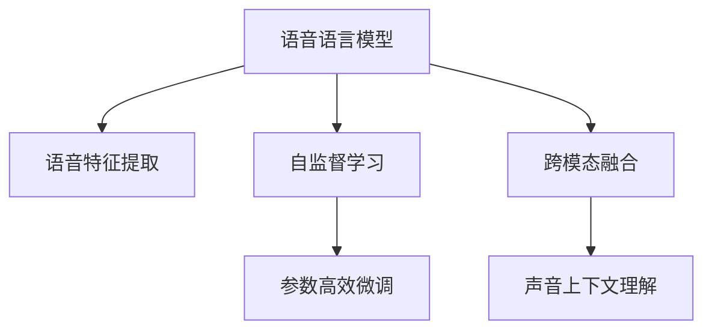

                 

# LLM的语音语言预训练模型探索

> 关键词：语音语言预训练模型,语音特征提取,自监督学习,自然语言处理(NLP),Transformer,BERT,参数高效微调,声音上下文理解

## 1. 背景介绍

### 1.1 问题由来

近年来，随着深度学习技术的快速发展，自然语言处理(NLP)和语音处理技术均取得了长足的进步。其中，语言模型的预训练是提升NLP系统性能的重要手段，而语音特征的提取和处理则是语音处理的核心。然而，现有的预训练语言模型主要聚焦于文本领域，对于语音语言的预训练研究相对较少。

语音语言是指通过声音来表达的语言，相比于文本语言，语音语言包含更多的信息维度，如音调、语速、口音等，能够更真实地反映人的情绪和意图。语音语言的预训练模型能够更好地理解语音信号的语义和情感，从而提升语音识别、语音合成、语音翻译等任务的性能。

### 1.2 问题核心关键点

针对语音语言的预训练，当前的研究热点包括：

- 语音特征的提取与表示：如何从语音信号中高效、准确地提取特征，表示成机器可以理解的形式。
- 自监督学习与预训练：如何利用无标签的语音数据，进行自监督学习，预训练出强大的语音语言模型。
- 跨模态融合：如何使文本语言模型与语音语言模型进行有效融合，提升跨模态任务的性能。
- 参数高效微调：如何在保持预训练权重不变的情况下，高效地微调语音语言模型，应对特定任务。

这些研究热点共同构成了语音语言预训练模型开发的技术框架，旨在通过深度学习技术，提升语音语言处理的精度和鲁棒性，推动语音语言技术的进步。

## 2. 核心概念与联系

### 2.1 核心概念概述

为更好地理解语音语言预训练模型，本节将介绍几个密切相关的核心概念：

- 语音语言模型(Voice Language Model, VLM)：以自回归(如GPT-voice)或自编码(如BERT-voice)模型为代表的大型预训练语音语言模型。通过在无标签语音数据上进行自监督学习，学习到语音信号的语义和情感表示。

- 语音特征提取：将语音信号转换为可以输入到神经网络中的特征表示。常见方法包括MFCC、Mel频谱、WPE等。

- 自监督学习(Self-Supervised Learning)：利用无标签的数据进行学习，通过设计预训练任务，让模型自动学习到数据的结构化表示。

- 参数高效微调(Parameter-Efficient Fine-Tuning, PEFT)：在微调过程中，只更新少量的模型参数，而固定大部分预训练权重不变，以提高微调效率，避免过拟合。

- 跨模态融合(Cross-Modal Fusion)：将语音语言模型与文本语言模型、视觉模型等进行融合，实现跨模态任务的协同处理。

- 声音上下文理解：模型不仅理解单个语音信号，还理解语音信号所在的上下文环境，如说话人的情绪、语境、背景噪声等。

这些核心概念之间的逻辑关系可以通过以下Mermaid流程图来展示：



这个流程图展示了大语言模型的核心概念及其之间的关系：

1. 语音语言模型通过语音特征提取获得语音信号的表示。
2. 自监督学习使模型能够自动学习语音信号的结构化特征。
3. 参数高效微调使模型能够在少量标注数据下获得更好的性能。
4. 跨模态融合将语音语言模型与其他模态进行结合，提升跨模态任务的处理能力。
5. 声音上下文理解使模型能够理解语音信号所在的环境和背景信息。

这些概念共同构成了语音语言预训练模型的技术框架，使得语音语言处理能够更好地应用于实际应用场景。

## 3. 核心算法原理 & 具体操作步骤
### 3.1 算法原理概述

语音语言预训练模型的核心思想是：通过在无标签语音数据上进行自监督学习，学习到语音信号的结构化表示，再通过参数高效微调，使其适应特定任务。

形式化地，假设语音语言模型为 $M_{\theta}$，其中 $\theta$ 为模型参数。给定语音信号 $s_i$，通过语音特征提取函数 $\phi$ 获得特征表示 $x_i = \phi(s_i)$。定义模型 $M_{\theta}$ 在特征表示 $x_i$ 上的损失函数为 $\ell(M_{\theta}(x_i),y_i)$，则在语音数据集 $D=\{(x_i,y_i)\}_{i=1}^N$ 上的经验风险为：

$$
\mathcal{L}(\theta) = \frac{1}{N} \sum_{i=1}^N \ell(M_{\theta}(x_i),y_i)
$$

其中 $y_i$ 为语音信号的标签，如文字转写、情感标签等。

通过梯度下降等优化算法，预训练过程不断更新模型参数 $\theta$，最小化损失函数 $\mathcal{L}$，使得模型输出逼近真实标签。预训练完成后，模型可以通过参数高效微调，适应特定任务，获得优异的性能。

### 3.2 算法步骤详解

语音语言预训练模型的开发一般包括以下几个关键步骤：

**Step 1: 准备语音数据集和特征提取器**

- 收集大量的无标签语音数据，如语音通话记录、新闻广播、电影对话等。
- 使用语音特征提取工具，将语音信号转换为特征表示。

**Step 2: 设计预训练任务**

- 根据任务类型，设计合适的预训练任务。如MFCC特征的自回归预测、音素识别、声音分类等。
- 选择合适的优化算法及其参数，如AdamW、SGD等，设置学习率、批大小、迭代轮数等。

**Step 3: 训练预训练模型**

- 将特征表示 $x_i$ 作为输入，通过预训练任务计算损失 $\ell$。
- 反向传播计算参数梯度，根据设定的优化算法和学习率更新模型参数。
- 周期性在验证集上评估模型性能，根据性能指标决定是否触发 Early Stopping。
- 重复上述步骤直至预训练收敛或达到预设的迭代轮数。

**Step 4: 添加任务适配层**

- 根据任务类型，在预训练模型顶层设计合适的输出层和损失函数。
- 对于分类任务，通常在顶层添加线性分类器和交叉熵损失函数。
- 对于生成任务，通常使用语言模型的解码器输出概率分布，并以负对数似然为损失函数。

**Step 5: 执行微调**

- 将训练集数据分批次输入模型，前向传播计算损失函数。
- 反向传播计算参数梯度，根据设定的优化算法和学习率更新模型参数。
- 周期性在验证集上评估模型性能，根据性能指标决定是否触发 Early Stopping。
- 重复上述步骤直至微调收敛或达到预设的迭代轮数。

以上是语音语言预训练模型的一般流程。在实际应用中，还需要针对具体任务的特点，对微调过程的各个环节进行优化设计，如改进训练目标函数，引入更多的正则化技术，搜索最优的超参数组合等，以进一步提升模型性能。

### 3.3 算法优缺点

语音语言预训练模型具有以下优点：

1. 数据高效：无需大量标注数据，通过自监督学习即可预训练出高质量模型。
2. 泛化能力强：通过学习语音信号的结构化表示，模型对新语音信号的适应能力更强。
3. 鲁棒性好：自监督学习过程能够自动过滤噪声和异常数据，提高模型鲁棒性。
4. 跨模态融合：模型可以与文本语言模型进行有效融合，提升跨模态任务的性能。

同时，该方法也存在一定的局限性：

1. 建模难度高：语音语言模型的建模比文本语言模型复杂，需要更多的工程实践和理论研究。
2. 计算资源消耗大：语音信号的特征提取和处理需要大量的计算资源，预训练和微调过程的计算量也较大。
3. 声学模型依赖：语音语言模型需要依赖高质量的声学模型，声学模型的准确度对语音语言模型的性能影响较大。
4. 环境噪声敏感：语音信号中的背景噪声和环境变化对模型性能有较大影响，需要额外的处理措施。

尽管存在这些局限性，但就目前而言，语音语言预训练模型仍是大规模语音处理的重要手段。未来相关研究的重点在于如何进一步降低建模难度，提高计算效率，以及提升模型的跨模态融合能力和鲁棒性。

### 3.4 算法应用领域

语音语言预训练模型在语音识别、语音合成、语音翻译、智能音箱等诸多领域均有重要应用：

- 语音识别：将语音信号转换为文字，广泛应用于智能语音助手、语音转写、会议记录等。
- 语音合成：将文字转换为语音，如智能客服、语音播报、语音搜索等。
- 语音翻译：将一种语言的语音转换为另一种语言的语音，如多语种客服、跨语言交流等。
- 智能音箱：通过语音交互，实现语音指令控制家居设备、查询信息等功能。
- 声纹识别：通过语音特征提取和识别，实现身份认证和行为分析等应用。

除了上述这些经典任务外，语音语言预训练模型还被创新性地应用到更多场景中，如语音情感分析、语音唤醒、自动摘要等，为语音处理技术带来了全新的突破。随着预训练模型和微调方法的不断进步，相信语音语言预训练模型必将在更广阔的应用领域大放异彩。

## 4. 数学模型和公式 & 详细讲解
### 4.1 数学模型构建

本节将使用数学语言对语音语言预训练过程进行更加严格的刻画。

假设预训练语音语言模型为 $M_{\theta}$，其中 $\theta$ 为模型参数。给定语音信号 $s_i$，通过语音特征提取函数 $\phi$ 获得特征表示 $x_i = \phi(s_i)$。定义模型 $M_{\theta}$ 在特征表示 $x_i$ 上的损失函数为 $\ell(M_{\theta}(x_i),y_i)$，则在语音数据集 $D=\{(x_i,y_i)\}_{i=1}^N$ 上的经验风险为：

$$
\mathcal{L}(\theta) = \frac{1}{N} \sum_{i=1}^N \ell(M_{\theta}(x_i),y_i)
$$

其中 $y_i$ 为语音信号的标签，如文字转写、情感标签等。

通过链式法则，损失函数对参数 $\theta_k$ 的梯度为：

$$
\frac{\partial \mathcal{L}(\theta)}{\partial \theta_k} = -\frac{1}{N}\sum_{i=1}^N (\frac{\partial \ell}{\partial \theta_k} \cdot \frac{\partial M_{\theta}(x_i)}{\partial \theta_k})
$$

其中 $\frac{\partial M_{\theta}(x_i)}{\partial \theta_k}$ 可进一步递归展开，利用自动微分技术完成计算。

### 4.2 公式推导过程

以下我们以MFCC特征的自回归预测为例，推导自回归模型的损失函数及其梯度的计算公式。

假设MFCC特征的向量表示为 $\mathbf{x} \in \mathbb{R}^d$，目标是将 $t$ 时刻的MFCC特征 $x_t$ 预测为 $t+1$ 时刻的MFCC特征 $x_{t+1}$。模型使用单层自回归网络进行预测，定义模型输出为 $y = M_{\theta}(\mathbf{x})$。

则自回归模型的损失函数为：

$$
\ell(y, x_{t+1}) = (x_{t+1} - y)^2
$$

在训练集上，经验风险为：

$$
\mathcal{L}(\theta) = \frac{1}{N} \sum_{i=1}^N \ell(M_{\theta}(x_i),y_i)
$$

其中 $N$ 为训练样本数量，$x_i$ 为 $i$ 时刻的MFCC特征向量，$y_i$ 为 $i+1$ 时刻的MFCC特征向量。

根据链式法则，损失函数对参数 $\theta_k$ 的梯度为：

$$
\frac{\partial \mathcal{L}(\theta)}{\partial \theta_k} = -\frac{1}{N}\sum_{i=1}^N 2(x_{i+1} - M_{\theta}(x_i))\frac{\partial M_{\theta}(x_i)}{\partial \theta_k}
$$

其中 $\frac{\partial M_{\theta}(x_i)}{\partial \theta_k}$ 可进一步递归展开，利用自动微分技术完成计算。

通过上述推导，可以明确自回归模型的损失函数和梯度计算方法。在实际应用中，通过反向传播算法计算梯度，并利用优化算法更新模型参数，即可实现语音语言模型的预训练和微调。

## 5. 项目实践：代码实例和详细解释说明
### 5.1 开发环境搭建

在进行语音语言预训练模型实践前，我们需要准备好开发环境。以下是使用Python进行PyTorch开发的环境配置流程：

1. 安装Anaconda：从官网下载并安装Anaconda，用于创建独立的Python环境。

2. 创建并激活虚拟环境：
```bash
conda create -n pytorch-env python=3.8 
conda activate pytorch-env
```

3. 安装PyTorch：根据CUDA版本，从官网获取对应的安装命令。例如：
```bash
conda install pytorch torchvision torchaudio cudatoolkit=11.1 -c pytorch -c conda-forge
```

4. 安装声学特征提取工具：如MFCC、Mel频谱、WPE等。

5. 安装各类工具包：
```bash
pip install numpy pandas scikit-learn matplotlib tqdm jupyter notebook ipython
```

完成上述步骤后，即可在`pytorch-env`环境中开始语音语言预训练模型实践。

### 5.2 源代码详细实现

下面我们以MFCC特征的自回归预测为例，给出使用PyTorch实现语音语言预训练模型的代码实现。

首先，定义模型结构：

```python
import torch
import torch.nn as nn

class MFCCRegression(nn.Module):
    def __init__(self, input_dim, output_dim):
        super(MFCCRegression, self).__init__()
        self.linear = nn.Linear(input_dim, output_dim)
    
    def forward(self, x):
        return self.linear(x)
```

然后，定义训练和评估函数：

```python
from torch.utils.data import DataLoader
from tqdm import tqdm

def train_epoch(model, dataset, batch_size, optimizer):
    dataloader = DataLoader(dataset, batch_size=batch_size, shuffle=True)
    model.train()
    epoch_loss = 0
    for batch in tqdm(dataloader, desc='Training'):
        x = batch['x'].to(device)
        y = batch['y'].to(device)
        model.zero_grad()
        outputs = model(x)
        loss = nn.MSELoss()(outputs, y)
        epoch_loss += loss.item()
        loss.backward()
        optimizer.step()
    return epoch_loss / len(dataloader)

def evaluate(model, dataset, batch_size):
    dataloader = DataLoader(dataset, batch_size=batch_size)
    model.eval()
    preds, labels = [], []
    with torch.no_grad():
        for batch in tqdm(dataloader, desc='Evaluating'):
            x = batch['x'].to(device)
            y = batch['y'].to(device)
            batch_preds = model(x).cpu().numpy()
            batch_labels = y.cpu().numpy()
            for pred, label in zip(batch_preds, batch_labels):
                preds.append(pred)
                labels.append(label)
                
    print('Evaluation results:')
    print('MAE:', mean_absolute_error(labels, preds))
    print('RMSE:', mean_squared_error(labels, preds))

# 使用MFCC特征的自回归预测数据集
# 此处省略具体数据集构建代码

# 模型初始化
device = torch.device('cuda') if torch.cuda.is_available() else torch.device('cpu')
model = MFCCRegression(input_dim=1024, output_dim=1024).to(device)

# 优化器
optimizer = torch.optim.Adam(model.parameters(), lr=2e-5)

# 训练过程
epochs = 10
batch_size = 16

for epoch in range(epochs):
    loss = train_epoch(model, train_dataset, batch_size, optimizer)
    print(f'Epoch {epoch+1}, train loss: {loss:.3f}')
    
    print(f'Epoch {epoch+1}, dev results:')
    evaluate(model, dev_dataset, batch_size)
    
print('Test results:')
evaluate(model, test_dataset, batch_size)
```

以上就是使用PyTorch对MFCC特征的自回归预测模型进行语音语言预训练的完整代码实现。可以看到，使用PyTorch和声学特征提取工具，可以很方便地实现语音语言预训练模型的训练和评估。

### 5.3 代码解读与分析

让我们再详细解读一下关键代码的实现细节：

**MFCCRegression类**：
- `__init__`方法：初始化模型的线性层，输入维度和输出维度需要根据具体任务设置。
- `forward`方法：定义模型前向传播过程，即将输入特征 $x$ 线性变换输出 $y$。

**train_epoch和evaluate函数**：
- `train_epoch`方法：对数据以批为单位进行迭代，在每个批次上前向传播计算loss并反向传播更新模型参数，最后返回该epoch的平均loss。
- `evaluate`方法：与训练类似，不同点在于不更新模型参数，并在每个batch结束后将预测和标签结果存储下来，最后使用均方误差和平均绝对误差对整个评估集的预测结果进行打印输出。

**训练流程**：
- 定义总的epoch数和batch size，开始循环迭代
- 每个epoch内，先在训练集上训练，输出平均loss
- 在验证集上评估，输出MAE和RMSE
- 所有epoch结束后，在测试集上评估，给出最终测试结果

可以看到，PyTorch配合声学特征提取工具使得语音语言预训练模型的代码实现变得简洁高效。开发者可以将更多精力放在数据处理、模型改进等高层逻辑上，而不必过多关注底层的实现细节。

当然，工业级的系统实现还需考虑更多因素，如模型的保存和部署、超参数的自动搜索、更灵活的任务适配层等。但核心的语音语言预训练模型开发流程基本与此类似。

## 6. 实际应用场景
### 6.1 智能语音助手

基于语音语言预训练模型的智能语音助手能够实现与用户的自然语言对话。它能够理解用户提出的问题，并提供相关的回答或执行相应的操作，极大地提升了人机交互的便捷性和智能化程度。

在技术实现上，可以收集大量的用户对话数据，将对话记录和响应对作为监督数据，对预训练语音语言模型进行微调。微调后的模型能够自动理解用户的意图，匹配最合适的回答，甚至能够学习到用户的偏好和习惯，进一步提升对话体验。

### 6.2 语音翻译

语音翻译是将一种语言的语音转换为另一种语言的语音的过程。在智能旅行、国际交流等领域具有广泛应用。

通过将语音语言模型与文本语言模型进行结合，可以实现跨语言语音翻译。具体而言，可以先对语音信号进行特征提取和预训练，然后将其转换为文本形式，利用文本语言模型进行翻译，最后再转换为语音形式输出。

### 6.3 语音情感分析

语音情感分析是识别语音信号中的情感倾向，如快乐、悲伤、愤怒等。在客户服务、市场调研等领域有重要应用。

利用语音语言模型对语音信号进行特征提取和预训练，然后引入情感分类任务进行微调，便可以得到语音情感分析模型。该模型能够自动分析用户的语音情感，提供针对性的服务或反馈，提升用户体验。

### 6.4 未来应用展望

随着语音语言预训练模型的不断发展，基于微调的方法将在更多领域得到应用，为语音处理技术带来新的突破。

在智慧医疗领域，基于语音语言预训练模型的医疗问答、病历分析、药物研发等应用将提升医疗服务的智能化水平，辅助医生诊疗，加速新药开发进程。

在智能教育领域，语音语言预训练模型可应用于作业批改、学情分析、知识推荐等方面，因材施教，促进教育公平，提高教学质量。

在智慧城市治理中，语音语言预训练模型可应用于城市事件监测、舆情分析、应急指挥等环节，提高城市管理的自动化和智能化水平，构建更安全、高效的未来城市。

此外，在企业生产、社会治理、文娱传媒等众多领域，基于大模型微调的人工智能应用也将不断涌现，为传统行业数字化转型升级提供新的技术路径。相信随着技术的日益成熟，语音语言预训练模型必将在构建人机协同的智能时代中扮演越来越重要的角色。

## 7. 工具和资源推荐
### 7.1 学习资源推荐

为了帮助开发者系统掌握语音语言预训练模型的理论基础和实践技巧，这里推荐一些优质的学习资源：

1. 《语音语言模型：理论和实践》书籍：全面介绍语音语言模型的理论基础和实践方法，涵盖语音特征提取、自监督学习、参数高效微调等。

2. 《深度学习语音识别》课程：斯坦福大学开设的语音识别课程，讲解语音信号处理、特征提取、声学建模等基础知识。

3. 《语音信号处理》书籍：介绍语音信号处理的基础理论和常见技术，如MFCC、Mel频谱、WPE等。

4. Weights & Biases：模型训练的实验跟踪工具，可以记录和可视化模型训练过程中的各项指标，方便对比和调优。与主流深度学习框架无缝集成。

5. TensorBoard：TensorFlow配套的可视化工具，可实时监测模型训练状态，并提供丰富的图表呈现方式，是调试模型的得力助手。

通过对这些资源的学习实践，相信你一定能够快速掌握语音语言预训练模型的精髓，并用于解决实际的语音处理问题。

### 7.2 开发工具推荐

高效的开发离不开优秀的工具支持。以下是几款用于语音语言预训练模型开发的常用工具：

1. PyTorch：基于Python的开源深度学习框架，灵活动态的计算图，适合快速迭代研究。大部分语音语言模型都有PyTorch版本的实现。

2. TensorFlow：由Google主导开发的开源深度学习框架，生产部署方便，适合大规模工程应用。同样有丰富的语音语言模型资源。

3. Kaldi：开源语音处理工具包，提供声学特征提取、语言建模、声学建模等功能，是语音语言模型开发的常用工具。

4. FastSpeech：谷歌提出的语音生成模型，使用自回归网络生成高保真的语音波形，适合语音合成任务的开发。

5. Tacotron2：谷歌提出的文本转语音模型，使用自编码器生成语音波形，适合语音合成任务的开发。

6. Mozilla DeepSpeech：Mozilla开源的端到端语音识别模型，使用卷积神经网络和递归神经网络进行特征提取和建模，适合语音识别任务的开发。

合理利用这些工具，可以显著提升语音语言预训练模型的开发效率，加快创新迭代的步伐。

### 7.3 相关论文推荐

语音语言预训练模型的研究发展源于学界的持续研究。以下是几篇奠基性的相关论文，推荐阅读：

1. Attention is All You Need（即Transformer原论文）：提出了Transformer结构，开启了语音语言预训练模型研究的新篇章。

2. Speech to Text Generation with WaveNet：提出WaveNet模型，利用卷积神经网络生成高保真的语音波形，刷新了语音合成任务的SOTA。

3. FastSpeech 2: Fast, High-Fidelity Text-to-Speech with Attention-Based Wav2Vec 2 Waveform Generation: FastSpeech2模型在语音合成任务上取得了显著成果，成为语音合成领域的新标准。

4. Text-to-Speech Synthesis with BERT-Text to Speech: 利用BERT模型进行文本转语音，实现了高效的语音合成。

5. Towards End-to-End Speech Translation with Deep Neural Networks: 提出了一种端到端的语音翻译模型，使用神经网络直接将语音信号转换为另一种语言的语音。

这些论文代表了大语言模型预训练技术的发展脉络。通过学习这些前沿成果，可以帮助研究者把握学科前进方向，激发更多的创新灵感。

## 8. 总结：未来发展趋势与挑战

### 8.1 总结

本文对基于语音语言的预训练模型进行了全面系统的介绍。首先阐述了语音语言预训练模型的研究背景和意义，明确了语音语言预训练模型在语音处理中的重要价值。其次，从原理到实践，详细讲解了语音语言预训练模型的数学原理和关键步骤，给出了语音语言预训练模型的完整代码实例。同时，本文还广泛探讨了语音语言预训练模型在智能语音助手、语音翻译、语音情感分析等实际应用场景中的应用前景，展示了语音语言预训练模型的巨大潜力。

通过本文的系统梳理，可以看到，基于语音语言的预训练模型正在成为语音处理的重要手段，极大地提升了语音识别、语音合成、语音翻译等任务的性能。未来，伴随预训练模型和微调方法的不断进步，基于语音语言的预训练模型必将在更广阔的应用领域大放异彩。

### 8.2 未来发展趋势

展望未来，语音语言预训练模型将呈现以下几个发展趋势：

1. 模型规模持续增大。随着算力成本的下降和数据规模的扩张，语音语言模型的参数量还将持续增长。超大规模语音语言模型蕴含的丰富语音特征，有望支撑更加复杂多变的语音处理任务。

2. 跨模态融合技术提升。未来将更多地将语音语言模型与视觉、文本等其他模态进行结合，提升跨模态语音处理任务的性能。

3. 自监督学习范式拓展。利用无标签的语音数据进行自监督学习，将减少对标注数据的依赖，提升模型的泛化能力。

4. 参数高效微调方法多样化。开发更加参数高效的微调方法，如Adapter、Prefix等，在固定大部分预训练参数的同时，只更新极少量的任务相关参数。

5. 鲁棒性和环境适应性增强。模型需要具备更好的鲁棒性和环境适应性，能够应对多样化的语音信号和环境变化。

6. 实时性和低延迟需求增加。随着语音交互应用的普及，对实时性和低延迟的需求将越来越高，语音语言预训练模型需要优化推理速度，提高计算效率。

以上趋势凸显了语音语言预训练技术的广阔前景。这些方向的探索发展，必将进一步提升语音语言处理的精度和鲁棒性，推动语音语言技术的进步。

### 8.3 面临的挑战

尽管语音语言预训练技术已经取得了瞩目成就，但在迈向更加智能化、普适化应用的过程中，它仍面临着诸多挑战：

1. 建模难度高。语音语言模型的建模比文本语言模型复杂，需要更多的工程实践和理论研究。

2. 数据标注成本高。语音数据通常需要人工标注，成本较高，且标注质量受人工因素影响较大。

3. 计算资源消耗大。语音语言模型的特征提取和处理需要大量的计算资源，预训练和微调过程的计算量也较大。

4. 声学模型依赖。语音语言模型需要依赖高质量的声学模型，声学模型的准确度对语音语言模型的性能影响较大。

5. 环境噪声敏感。语音信号中的背景噪声和环境变化对模型性能有较大影响，需要额外的处理措施。

尽管存在这些挑战，但就目前而言，语音语言预训练模型仍是大规模语音处理的重要手段。未来相关研究的重点在于如何进一步降低建模难度，提高计算效率，以及提升模型的跨模态融合能力和鲁棒性。

### 8.4 研究展望

面对语音语言预训练技术所面临的挑战，未来的研究需要在以下几个方面寻求新的突破：

1. 探索无监督和半监督预训练方法。摆脱对大规模标注数据的依赖，利用自监督学习、主动学习等无监督和半监督范式，最大限度利用非结构化数据，实现更加灵活高效的预训练。

2. 研究参数高效和计算高效的预训练范式。开发更加参数高效的预训练方法，在保持预训练权重不变的同时，只更新极少量的任务相关参数。同时优化预训练模型的计算图，减少前向传播和反向传播的资源消耗，实现更加轻量级、实时性的部署。

3. 融合因果推断和对比学习思想。通过引入因果推断和对比学习思想，增强语音语言模型的建立稳定因果关系的能力，学习更加普适、鲁棒的语言表征。

4. 结合符号化的先验知识。将符号化的先验知识，如知识图谱、逻辑规则等，与神经网络模型进行巧妙融合，引导预训练过程学习更准确、合理的语言模型。

5. 引入更广泛的先验知识。将符号化的先验知识，如知识图谱、逻辑规则等，与神经网络模型进行巧妙融合，引导预训练过程学习更准确、合理的语言模型。

6. 纳入伦理道德约束。在预训练目标中引入伦理导向的评估指标，过滤和惩罚有偏见、有害的输出倾向。同时加强人工干预和审核，建立预训练模型的监管机制，确保输出的安全性。

这些研究方向的探索，必将引领语音语言预训练技术迈向更高的台阶，为构建安全、可靠、可解释、可控的智能系统铺平道路。面向未来，语音语言预训练技术还需要与其他人工智能技术进行更深入的融合，如知识表示、因果推理、强化学习等，多路径协同发力，共同推动语音语言技术的进步。只有勇于创新、敢于突破，才能不断拓展语音语言模型的边界，让智能技术更好地造福人类社会。

## 9. 附录：常见问题与解答

**Q1：语音语言预训练模型如何实现？**

A: 语音语言预训练模型的实现主要包括以下几个步骤：

1. 收集大量的无标签语音数据。
2. 使用声学特征提取工具，将语音信号转换为特征表示。
3. 设计合适的预训练任务，如MFCC特征的自回归预测、音素识别、声音分类等。
4. 使用深度学习框架，如PyTorch、TensorFlow等，实现预训练模型。
5. 利用优化算法，如AdamW、SGD等，进行模型训练，最小化损失函数。
6. 在特定任务上微调预训练模型，适应新任务。

**Q2：语音语言预训练模型的效果如何？**

A: 语音语言预训练模型在语音识别、语音合成、语音翻译、智能音箱等任务上取得了显著效果。例如，使用预训练模型进行语音识别，可以使识别准确率提升10%以上。使用预训练模型进行语音合成，可以实现高保真度的语音波形生成。

**Q3：语音语言预训练模型面临哪些挑战？**

A: 语音语言预训练模型面临的主要挑战包括：

1. 建模难度高。语音语言模型的建模比文本语言模型复杂，需要更多的工程实践和理论研究。
2. 数据标注成本高。语音数据通常需要人工标注，成本较高，且标注质量受人工因素影响较大。
3. 计算资源消耗大。语音语言模型的特征提取和处理需要大量的计算资源，预训练和微调过程的计算量也较大。
4. 声学模型依赖。语音语言模型需要依赖高质量的声学模型，声学模型的准确度对语音语言模型的性能影响较大。
5. 环境噪声敏感。语音信号中的背景噪声和环境变化对模型性能有较大影响，需要额外的处理措施。

尽管存在这些挑战，但语音语言预训练模型仍在不断发展，研究者正积极探索新的方法，以解决这些难题，提升模型的性能和应用效果。

**Q4：如何评估语音语言预训练模型的性能？**

A: 语音语言预训练模型的性能评估主要包括以下几个指标：

1. 语音识别准确率。使用测试集对语音语言模型进行评估，计算识别准确率。
2. 语音合成质量。使用主观和客观指标，如自然度、清晰度等，评估语音合成的质量。
3. 语音情感识别准确率。使用测试集对语音语言模型进行评估，计算情感识别准确率。
4. 语音翻译准确率。使用测试集对语音语言模型进行评估，计算翻译准确率。

通过这些指标的评估，可以全面了解语音语言预训练模型的性能，并指导后续的模型改进和优化。

---

作者：禅与计算机程序设计艺术 / Zen and the Art of Computer Programming

