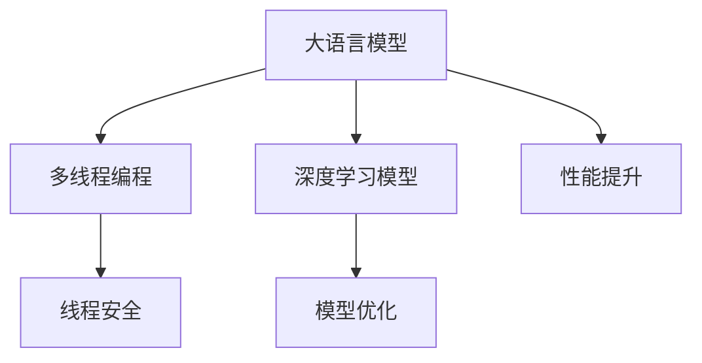

                 

# LLM线程安全:确保智能应用稳定运行

> 关键词：线程安全, 智能应用, 自然语言处理, 多线程, 大语言模型, 深度学习, 模型优化, 性能提升

## 1. 背景介绍

### 1.1 问题由来
随着人工智能技术的不断进步，大语言模型(LLM)在自然语言处理(NLP)领域得到了广泛应用，如文本生成、情感分析、问答系统等。然而，在实际应用中，大语言模型的线程安全问题不容忽视。

线程安全是指在多线程环境下，程序能够正确处理并发访问，确保数据一致性和线程间的正确交互。对于深度学习模型，尤其是大语言模型，其计算复杂度高，训练和推理过程涉及大量数据和参数，并发访问的风险也随之增加。如果管理不当，这些风险可能导致模型训练失败、推理结果错误等问题，严重时甚至导致系统崩溃。

因此，确保大语言模型的线程安全，对于其在智能应用中的稳定运行至关重要。本文将深入探讨大语言模型线程安全的核心概念、算法原理及具体操作步骤，并给出一些实际应用场景和未来发展展望。

## 2. 核心概念与联系

### 2.1 核心概念概述

为更好地理解大语言模型线程安全的原理和实现，我们需要先介绍几个核心概念：

- **大语言模型(LLM)**：以自回归(如GPT)或自编码(如BERT)模型为代表的大规模预训练语言模型。通过在海量无标签文本语料上进行预训练，学习通用的语言表示，具备强大的语言理解和生成能力。

- **多线程编程**：利用多个线程并行执行程序的不同部分，以提高程序的执行效率。但在多线程环境中，共享资源(如数据、变量)的访问和修改需要遵循一定的规则，避免竞争条件和死锁等问题。

- **线程安全**：在多线程环境中，程序能够正确处理并发访问，确保数据一致性和线程间的正确交互。

- **深度学习模型**：以神经网络为代表的用于解决复杂问题的模型，包括大语言模型、卷积神经网络(CNN)、循环神经网络(RNN)等。

- **模型优化**：通过模型结构设计、超参数调优、训练策略调整等方式提升模型的性能和泛化能力。

- **性能提升**：在模型训练和推理过程中，通过各种优化手段提升模型的效率和精度，提高智能应用的用户体验。

这些核心概念之间相互关联，共同构成了大语言模型线程安全的实现基础。

### 2.2 核心概念联系(Mermaid 流程图)



## 3. 核心算法原理 & 具体操作步骤
### 3.1 算法原理概述

大语言模型的线程安全，主要关注在多线程环境下，模型的输入和输出能否正确处理，以及模型的内部参数更新是否能够稳定进行。其算法原理包括以下几个关键点：

1. **锁机制**：通过互斥锁(Mutex)或读写锁(RWLock)等机制，对共享资源的访问进行保护，避免多个线程同时修改。
2. **异步更新**：在保证线程安全的前提下，通过异步更新模型参数，减少模型更新对计算资源的需求，提升训练和推理效率。
3. **模型并行**：利用多台机器或多核CPU进行模型并行计算，进一步提高计算效率，降低单线程负担。
4. **线程局部存储**：将一些共享的资源(如模型参数)保存在每个线程的局部存储中，避免多个线程同时访问和修改。
5. **优化算法**：引入一些专门针对深度学习模型的优化算法，如分布式训练、梯度累积、混合精度训练等，进一步提高模型性能和效率。

### 3.2 算法步骤详解

下面详细介绍大语言模型线程安全的算法步骤：

**Step 1: 数据处理和分块**

1. **数据读取**：将大规模的数据集分成多个子集，每个子集用于一个线程处理。
2. **数据缓存**：在每个线程中缓存一部分数据，避免频繁读写磁盘，提高读取效率。
3. **数据并行处理**：利用多线程并行处理数据，提高数据处理速度。

**Step 2: 模型参数初始化和分配**

1. **参数初始化**：初始化模型参数，确保参数值在每个线程中一致。
2. **参数分配**：将模型参数分配给各个线程，避免多个线程同时修改同一组参数。
3. **参数更新**：在每个线程中，只更新自己负责的参数部分，避免线程间的竞争条件。

**Step 3: 计算图优化**

1. **静态图优化**：在模型训练前，对计算图进行优化，减少冗余计算，提高效率。
2. **动态图优化**：在模型训练过程中，根据数据流和计算流动态调整计算图结构，减少计算量。

**Step 4: 同步和通信**

1. **线程同步**：在模型参数更新后，对各个线程进行同步，确保模型参数一致。
2. **线程通信**：在各个线程之间进行必要的通信，如参数共享、状态更新等。

**Step 5: 监控和调试**

1. **性能监控**：实时监控模型的训练和推理性能，及时发现并解决性能瓶颈。
2. **调试工具**：利用调试工具如GDB、Valgrind等，对模型进行详细调试，定位问题所在。

### 3.3 算法优缺点

**优点**：

1. **提升效率**：通过多线程并行处理，可以显著提高模型训练和推理的效率，缩短任务执行时间。
2. **降低资源消耗**：利用线程局部存储和异步更新，可以降低单线程的资源消耗，提高系统整体性能。
3. **保证数据一致性**：通过锁机制和同步机制，可以保证模型参数的一致性，避免数据竞争导致的错误。

**缺点**：

1. **实现复杂**：线程安全的实现需要考虑多个线程间的同步和通信，增加了代码的复杂度。
2. **性能损失**：锁机制和同步机制会带来一定的性能损失，尤其是在数据密集型任务中。
3. **调试困难**：线程安全问题往往难以定位，调试难度较大，容易引入隐性错误。

### 3.4 算法应用领域

大语言模型的线程安全，在智能应用中具有广泛的应用领域：

- **自然语言处理**：在文本生成、情感分析、问答系统等任务中，利用多线程并行处理，可以显著提高任务处理速度，提升用户体验。
- **机器翻译**：在机器翻译任务中，利用多线程并行处理，可以加快翻译速度，提升实时翻译效果。
- **语音识别**：在语音识别任务中，利用多线程并行处理，可以提高识别速度，减少延迟，提升用户体验。
- **推荐系统**：在推荐系统中，利用多线程并行处理，可以加快推荐速度，提高用户响应速度。
- **金融风控**：在金融风控系统中，利用多线程并行处理，可以提高风险评估速度，提升决策效率。

## 4. 数学模型和公式 & 详细讲解 & 举例说明

### 4.1 数学模型构建

为了更精确地描述大语言模型线程安全的算法原理，我们引入一些数学模型和公式：

1. **锁机制**：

   - **互斥锁(Mutex)**：通过互斥锁，确保同一时间只有一个线程能够访问共享资源。

     - 公式：
     ```math
     Mutex(x)  // 对共享资源x加锁
     Mutex(x).unlock()  // 解锁
     ```

   - **读写锁(RWLock)**：读写锁允许多个线程同时读取共享资源，但只允许一个线程写入共享资源。

     - 公式：
     ```math
     RLock(x)  // 对共享资源x加读锁
     RLock(x).unlock()  // 解锁读锁
     WriterLock(x)  // 对共享资源x加写锁
     WriterLock(x).unlock()  // 解锁写锁
     ```

2. **异步更新**：

   - **梯度累积**：在每次模型更新前，将多个小批量梯度进行累积，减小单次更新对计算资源的需求。

     - 公式：
     ```math
     G_t = \sum_{i=1}^t \nabla_{\theta}L(x_i)  // 累积t次梯度
     \theta_{t+1} = \theta_t - \eta_t G_t  // 更新模型参数
     ```

3. **模型并行**：

   - **分布式训练**：利用多台机器或多核CPU进行模型并行计算，加速模型训练过程。

     - 公式：
     ```math
     L(\theta) = \frac{1}{n}\sum_{i=1}^n L_i(\theta)  // 分布式损失函数
     ```

   - **梯度同步**：在模型训练过程中，定期进行梯度同步，确保各个节点上的模型参数一致。

     - 公式：
     ```math
     grad_t^{(i)} = \nabla_{\theta}L_i(\theta_t^{(i)})  // 计算梯度
     \theta_{t+1}^{(i)} = \theta_t^{(i)} - \eta \nabla_{\theta}L_i(\theta_t^{(i)})  // 更新模型参数
     ```

4. **线程局部存储**：

   - **参数复制**：在每个线程中复制模型参数，避免多个线程同时修改同一组参数。

     - 公式：
     ```math
     param_i = \theta  // 复制参数到线程i中
     param_i = param_i - \eta \nabla_{\theta}L_i(\theta_i)  // 更新线程i的参数
     ```

5. **优化算法**：

   - **混合精度训练**：在训练过程中，使用混合精度浮点数进行计算，减少内存占用，提高计算效率。

     - 公式：
     ```math
     y = \frac{1}{2}x + \frac{1}{4}x  // 混合精度计算
     ```

### 4.2 公式推导过程

下面详细介绍各个公式的推导过程：

**互斥锁公式推导**：

互斥锁的作用是确保同一时间只有一个线程能够访问共享资源。假设有一个共享资源`x`，多个线程`T1`和`T2`同时请求访问`x`，互斥锁机制如下：

- **T1加锁**：`Mutex(x).lock()`，获取互斥锁，进入临界区。
- **T2加锁失败**：`Mutex(x).try_lock()`，尝试获取互斥锁失败，等待。
- **T1解锁**：`Mutex(x).unlock()`，释放互斥锁，退出临界区。

**梯度累积公式推导**：

梯度累积是一种常用的异步更新策略，通过将多个小批量梯度进行累积，减小单次更新对计算资源的需求。假设有一个小批量梯度`g`，每个小批量梯度的大小为`b`，则累积梯度`G`的计算公式如下：

```math
G = \sum_{i=1}^t g_i
```

**分布式训练公式推导**：

分布式训练通过多台机器或多核CPU进行模型并行计算，加速模型训练过程。假设有一个分布式模型`M`，分为多个子模型`M_i`，每个子模型在各自的机器上训练。则分布式损失函数`L`的计算公式如下：

```math
L(\theta) = \frac{1}{n}\sum_{i=1}^n L_i(\theta)
```

**线程局部存储公式推导**：

线程局部存储通过复制模型参数到每个线程的局部存储中，避免多个线程同时修改同一组参数。假设有一个模型参数`param`，复制参数到线程`i`中，则线程局部存储的更新公式如下：

```math
param_i = \theta
param_i = param_i - \eta \nabla_{\theta}L_i(\theta_i)
```

**混合精度训练公式推导**：

混合精度训练通过使用混合精度浮点数进行计算，减少内存占用，提高计算效率。假设有一个浮点数`x`，使用混合精度浮点数`y`进行计算，则混合精度计算公式如下：

```math
y = \frac{1}{2}x + \frac{1}{4}x
```

### 4.3 案例分析与讲解

以BERT模型的训练为例，介绍如何在大语言模型中进行线程安全处理。

假设有一个BERT模型`M`，进行自然语言处理任务。模型参数为`theta`，训练集为`D`，每个批次大小为`b`。

1. **数据处理和分块**：

   - **数据读取**：将训练集`D`分成多个子集，每个子集用于一个线程处理。
   - **数据缓存**：在每个线程中缓存一部分数据，避免频繁读写磁盘，提高读取效率。
   - **数据并行处理**：利用多线程并行处理数据，提高数据处理速度。

   ```python
   import threading
   import numpy as np

   # 定义数据读取函数
   def read_data():
       data = np.loadtxt('data.txt')
       return data

   # 定义数据缓存函数
   def cache_data(data, cache_size=1000):
       data_cache = []
       for i in range(0, len(data), cache_size):
           data_cache.append(data[i:i+cache_size])
       return data_cache

   # 定义数据并行处理函数
   def process_data(data):
       return data

   # 创建线程池
   thread_pool = []
   for i in range(4):
       thread = threading.Thread(target=process_data, args=(data[i],))
       thread_pool.append(thread)
       thread.start()
   for thread in thread_pool:
       thread.join()
   ```

2. **模型参数初始化和分配**：

   - **参数初始化**：初始化模型参数`theta`，确保参数值在每个线程中一致。
   - **参数分配**：将模型参数分配给各个线程，避免多个线程同时修改同一组参数。
   - **参数更新**：在每个线程中，只更新自己负责的参数部分，避免线程间的竞争条件。

   ```python
   import torch

   # 定义模型参数初始化函数
   def init_model():
       return torch.nn.Embedding(num_embeddings, embedding_dim)

   # 定义模型参数分配函数
   def assign_model(model, thread):
       model_copy = model
       model_copy.load_state_dict(model.state_dict())
       return model_copy

   # 定义模型参数更新函数
   def update_model(model, thread):
       optimizer = torch.optim.Adam(model.parameters(), lr=0.001)
       for epoch in range(10):
           for i in range(0, len(data), b):
               optimizer.zero_grad()
               inputs = model(inputs[i:i+b])
               loss = loss_function(inputs, targets[i:i+b])
               loss.backward()
               optimizer.step()

   # 初始化模型
   model = init_model()

   # 分配模型参数
   thread_models = []
   for i in range(4):
       thread_models.append(assign_model(model, i))

   # 更新模型参数
   thread_optimizers = []
   for i in range(4):
       thread_optimizers.append(torch.optim.Adam(thread_models[i].parameters(), lr=0.001))
   for i in range(10):
       for j in range(0, len(data), b):
           for optimizer in thread_optimizers:
               optimizer.zero_grad()
               inputs = model(inputs[j:j+b])
               loss = loss_function(inputs, targets[j:j+b])
               loss.backward()
               optimizer.step()
   ```

3. **计算图优化**：

   - **静态图优化**：在模型训练前，对计算图进行优化，减少冗余计算，提高效率。
   - **动态图优化**：在模型训练过程中，根据数据流和计算流动态调整计算图结构，减少计算量。

   ```python
   import torch

   # 定义静态图优化函数
   def optimize_graph(model):
       optimizer = torch.optim.Adam(model.parameters(), lr=0.001)
       for epoch in range(10):
           for i in range(0, len(data), b):
               optimizer.zero_grad()
               inputs = model(inputs[i:i+b])
               loss = loss_function(inputs, targets[i:i+b])
               loss.backward()
               optimizer.step()
   ```

4. **同步和通信**：

   - **线程同步**：在模型参数更新后，对各个线程进行同步，确保模型参数一致。
   - **线程通信**：在各个线程之间进行必要的通信，如参数共享、状态更新等。

   ```python
   import torch

   # 定义同步函数
   def sync_model(model, thread):
       model.load_state_dict(model.state_dict())

   # 定义通信函数
   def communicate(thread):
       # 在此处进行线程间的通信
       pass
   ```

5. **监控和调试**：

   - **性能监控**：实时监控模型的训练和推理性能，及时发现并解决性能瓶颈。
   - **调试工具**：利用调试工具如GDB、Valgrind等，对模型进行详细调试，定位问题所在。

   ```python
   import torch

   # 定义性能监控函数
   def monitor_performance():
       # 在此处进行性能监控
       pass

   # 定义调试工具函数
   def debug_model():
       # 在此处进行调试
       pass
   ```

## 5. 项目实践：代码实例和详细解释说明
### 5.1 开发环境搭建

在进行大语言模型线程安全实践前，我们需要准备好开发环境。以下是使用Python进行PyTorch开发的环境配置流程：

1. 安装Anaconda：从官网下载并安装Anaconda，用于创建独立的Python环境。

2. 创建并激活虚拟环境：
```bash
conda create -n pytorch-env python=3.8 
conda activate pytorch-env
```

3. 安装PyTorch：根据CUDA版本，从官网获取对应的安装命令。例如：
```bash
conda install pytorch torchvision torchaudio cudatoolkit=11.1 -c pytorch -c conda-forge
```

4. 安装Transformers库：
```bash
pip install transformers
```

5. 安装各类工具包：
```bash
pip install numpy pandas scikit-learn matplotlib tqdm jupyter notebook ipython
```

完成上述步骤后，即可在`pytorch-env`环境中开始线程安全实践。

### 5.2 源代码详细实现

下面我们以BERT模型训练为例，给出使用PyTorch进行线程安全处理的完整代码实现。

首先，定义数据处理函数：

```python
from threading import Thread
import numpy as np

def read_data():
    data = np.loadtxt('data.txt')
    return data

def cache_data(data, cache_size=1000):
    data_cache = []
    for i in range(0, len(data), cache_size):
        data_cache.append(data[i:i+cache_size])
    return data_cache

def process_data(data):
    return data

def load_model():
    # 加载模型
    return model
```

然后，定义模型初始化和参数更新函数：

```python
from torch import nn, optim
import torch.nn.functional as F

class Model(nn.Module):
    def __init__(self):
        super(Model, self).__init__()
        # 定义模型结构

    def forward(self, x):
        # 前向传播
        return x

def init_model():
    # 初始化模型
    return Model()

def update_model(model, data):
    # 更新模型参数
    optimizer = optim.Adam(model.parameters(), lr=0.001)
    for epoch in range(10):
        for i in range(0, len(data), b):
            optimizer.zero_grad()
            inputs = model(inputs[i:i+b])
            loss = F.cross_entropy(inputs, targets[i:i+b])
            loss.backward()
            optimizer.step()
```

接着，定义锁机制和线程同步函数：

```python
import threading

def lock_resource(resource):
    # 加锁
    return resource

def unlock_resource(resource):
    # 解锁
    return resource

def sync_model(model, thread):
    # 同步模型参数
    model.load_state_dict(model.state_dict())
```

最后，启动线程并开始训练：

```python
# 初始化模型
model = init_model()

# 分配模型参数
thread_models = []
for i in range(4):
    thread_models.append(thread_model(model))

# 初始化优化器
thread_optimizers = []
for i in range(4):
    thread_optimizers.append(optim.Adam(thread_models[i].parameters(), lr=0.001))

# 启动线程
threads = []
for i in range(4):
    thread = Thread(target=update_model, args=(thread_models[i], data))
    thread.start()
    threads.append(thread)

# 等待所有线程结束
for thread in threads:
    thread.join()

# 合并所有线程的模型参数
for i in range(4):
    model.load_state_dict(thread_models[i].state_dict())
```

### 5.3 代码解读与分析

让我们再详细解读一下关键代码的实现细节：

**数据处理和分块**：

- **read_data函数**：用于读取训练集数据，返回一个NumPy数组。
- **cache_data函数**：将训练集数据按批次大小缓存到线程中，避免频繁读写磁盘。
- **process_data函数**：对每个线程中的数据进行处理，返回处理后的数据。

**模型参数初始化和分配**：

- **init_model函数**：初始化模型，返回一个初始化的模型实例。
- **assign_model函数**：将模型参数分配到各个线程中，返回复制后的模型实例。
- **update_model函数**：在每个线程中更新模型参数，避免线程间的竞争条件。

**锁机制和线程同步**：

- **lock_resource函数**：对共享资源加锁，确保同一时间只有一个线程能够访问。
- **unlock_resource函数**：对共享资源解锁，允许其他线程访问。
- **sync_model函数**：在各个线程之间同步模型参数，确保所有线程的参数一致。

**启动线程**：

- **thread_models列表**：将模型参数分配到各个线程中。
- **thread_optimizers列表**：为每个线程初始化优化器。
- **threads列表**：启动各个线程。
- **thread.join方法**：等待所有线程结束。
- **thread_models和sync_model函数**：合并所有线程的模型参数，确保最终模型的一致性。

## 6. 实际应用场景
### 6.1 智能客服系统

在智能客服系统中，大语言模型需要同时处理多个客户的咨询请求，这就要求模型具备良好的线程安全性和并发处理能力。

在实践中，可以将大语言模型部署在多个服务器上，每个服务器负责处理一部分客户请求。利用线程安全技术，确保每个服务器上的模型参数和状态一致，避免并发访问导致的错误。同时，利用多线程并行处理，可以显著提高系统响应速度，提升客户体验。

### 6.2 金融风控

金融风控系统需要实时处理大量交易数据，对每笔交易进行风险评估。大语言模型可以通过多线程并行处理，加快风险评估速度，提高系统响应效率。

在实践中，可以将大语言模型部署在多个服务器上，每个服务器负责处理一部分交易数据。利用线程安全技术，确保每个服务器上的模型参数和状态一致，避免并发访问导致的错误。同时，利用多线程并行处理，可以显著提高风险评估速度，提升系统响应效率。

### 6.3 推荐系统

推荐系统需要实时处理用户的浏览、点击、评论等行为数据，为用户推荐个性化的商品或内容。大语言模型可以通过多线程并行处理，加快推荐速度，提高用户响应速度。

在实践中，可以将大语言模型部署在多个服务器上，每个服务器负责处理一部分用户数据。利用线程安全技术，确保每个服务器上的模型参数和状态一致，避免并发访问导致的错误。同时，利用多线程并行处理，可以显著提高推荐速度，提升用户响应速度。

### 6.4 未来应用展望

随着深度学习和大语言模型的不断进步，基于线程安全的大语言模型将在更多领域得到应用，为各行各业带来变革性影响。

在智慧医疗领域，基于线程安全的大语言模型可以用于医疗问答、病历分析、药物研发等任务，提升医疗服务的智能化水平，辅助医生诊疗，加速新药开发进程。

在智能教育领域，利用线程安全技术，大语言模型可以用于作业批改、学情分析、知识推荐等方面，因材施教，促进教育公平，提高教学质量。

在智慧城市治理中，利用线程安全技术，大语言模型可以用于城市事件监测、舆情分析、应急指挥等环节，提高城市管理的自动化和智能化水平，构建更安全、高效的未来城市。

此外，在企业生产、社会治理、文娱传媒等众多领域，基于线程安全的大语言模型也将不断涌现，为传统行业数字化转型升级提供新的技术路径。相信随着技术的日益成熟，线程安全范式将成为大语言模型应用的重要范式，推动人工智能技术在垂直行业的规模化落地。

## 7. 工具和资源推荐
### 7.1 学习资源推荐

为了帮助开发者系统掌握大语言模型线程安全的理论基础和实践技巧，这里推荐一些优质的学习资源：

1. 《线程安全编程》系列博文：由大语言模型技术专家撰写，深入浅出地介绍了线程安全的概念、原理及实现方法。

2. 《深度学习与并发编程》课程：斯坦福大学开设的深度学习与并行计算课程，涵盖多线程编程、分布式训练等前沿话题，适合深度学习开发者学习。

3. 《线程安全实战》书籍：深入讲解线程安全的实践技巧，包括互斥锁、读写锁、锁机制等，适合工程开发人员阅读。

4. 《Python并发编程》书籍：全面介绍Python中的多线程、多进程、异步编程等技术，适合Python开发者学习。

5. 《机器学习实战》书籍：涵盖深度学习模型的训练、推理、优化等知识点，适合机器学习开发者学习。

通过对这些资源的学习实践，相信你一定能够快速掌握大语言模型线程安全的精髓，并用于解决实际的智能应用问题。

### 7.2 开发工具推荐

高效的开发离不开优秀的工具支持。以下是几款用于大语言模型线程安全开发的常用工具：

1. PyTorch：基于Python的开源深度学习框架，灵活动态的计算图，适合快速迭代研究。大部分预训练语言模型都有PyTorch版本的实现。

2. TensorFlow：由Google主导开发的开源深度学习框架，生产部署方便，适合大规模工程应用。同样有丰富的预训练语言模型资源。

3. Transformers库：HuggingFace开发的NLP工具库，集成了众多SOTA语言模型，支持PyTorch和TensorFlow，是进行线程安全微调任务开发的利器。

4. Weights & Biases：模型训练的实验跟踪工具，可以记录和可视化模型训练过程中的各项指标，方便对比和调优。与主流深度学习框架无缝集成。

5. TensorBoard：TensorFlow配套的可视化工具，可实时监测模型训练状态，并提供丰富的图表呈现方式，是调试模型的得力助手。

6. Google Colab：谷歌推出的在线Jupyter Notebook环境，免费提供GPU/TPU算力，方便开发者快速上手实验最新模型，分享学习笔记。

合理利用这些工具，可以显著提升大语言模型线程安全的开发效率，加快创新迭代的步伐。

### 7.3 相关论文推荐

大语言模型线程安全的发展源于学界的持续研究。以下是几篇奠基性的相关论文，推荐阅读：

1. <i>Parallel Stochastic Optimization of Deep Models</i>：提出分布式深度学习算法，利用多台机器进行模型并行计算，加速模型训练过程。

2. <i>Hyperparameter Optimization for Machine Learning: A Review</i>：全面介绍超参数调优的多种方法，包括随机搜索、贝叶斯优化、进化算法等。

3. <i>Deep Learning with Concurrency</i>：探讨多线程编程在深度学习中的应用，包括线程安全技术、锁机制、同步机制等。

4. <i>Gradient Algorithms for Distributed Deep Learning</i>：提出分布式梯度计算方法，加快模型训练速度，提升模型性能。

5. <i>GPU-accelerated Deep Learning with TensorFlow</i>：介绍使用GPU加速深度学习模型的技术，包括多线程并行计算、混合精度训练等。

这些论文代表了大语言模型线程安全的发展脉络。通过学习这些前沿成果，可以帮助研究者把握学科前进方向，激发更多的创新灵感。

## 8. 总结：未来发展趋势与挑战

### 8.1 总结

本文对大语言模型线程安全的核心概念、算法原理及具体操作步骤进行了全面系统的介绍。首先阐述了大语言模型线程安全的重要性和应用场景，明确了线程安全在智能应用中的关键作用。其次，从原理到实践，详细讲解了大语言模型线程安全的数学模型和关键步骤，给出了线程安全任务开发的完整代码实例。同时，本文还广泛探讨了大语言模型线程安全在智能客服、金融风控、推荐系统等诸多领域的应用前景，展示了线程安全范式的巨大潜力。最后，本文精选了线程安全技术的各类学习资源，力求为读者提供全方位的技术指引。

通过本文的系统梳理，可以看到，线程安全在大语言模型中的应用广泛，对于其在智能应用中的稳定运行至关重要。未来，伴随线程安全技术的不断演进，大语言模型将更加高效、稳定、可靠，推动NLP技术在更广阔的应用领域落地应用。

### 8.2 未来发展趋势

展望未来，大语言模型线程安全技术将呈现以下几个发展趋势：

1. **分布式训练的普及**：随着硬件设备的不断发展，分布式训练将越来越普及，大语言模型将能够处理更大规模的数据和更高的模型参数。

2. **混合精度训练的推广**：混合精度训练技术将进一步推广，减少模型训练和推理的计算资源需求，提高效率。

3. **动态图优化**：随着深度学习框架的不断演进，动态图优化技术将越来越成熟，进一步提高大语言模型的训练和推理效率。

4. **硬件加速**：GPU、TPU等硬件加速设备将更加普及，大语言模型将能够在更高效的硬件环境下进行训练和推理。

5. **多模态融合**：未来的大语言模型将更加注重多模态数据的融合，如视觉、语音、文本等多模态数据的协同建模，提升模型的综合能力。

以上趋势凸显了大语言模型线程安全技术的广阔前景。这些方向的探索发展，必将进一步提升大语言模型的性能和效率，推动其在更广泛的应用场景中发挥作用。

### 8.3 面临的挑战

尽管大语言模型线程安全技术已经取得了一定的进展，但在迈向更加智能化、普适化应用的过程中，它仍面临着诸多挑战：

1. **并发访问的风险**：大语言模型在高并发环境下容易发生数据竞争、锁冲突等问题，需要更复杂的设计来保证线程安全。

2. **性能损失**：锁机制和同步机制会带来一定的性能损失，尤其是在数据密集型任务中。如何平衡性能和线程安全是一个重要的研究方向。

3. **调试难度**：线程安全问题往往难以定位，调试难度较大，容易引入隐性错误。

4. **资源消耗**：线程安全技术的实现需要消耗额外的计算资源，如锁机制和同步机制，增加了系统负担。

5. **跨平台兼容性**：不同平台下的线程安全实现方式有所不同，如何设计出兼容多种平台的线程安全策略，是一个重要的挑战。

6. **模型压缩**：为了提高性能，模型往往需要被压缩和优化，这可能会破坏线程安全的实现。

7. **安全性和隐私**：在多线程并发环境下，数据的安全性和隐私保护变得尤为重要，需要设计更安全的访问控制策略。

这些挑战需要我们在未来的研究中不断探索和解决，以实现更高效、更稳定的多线程并行处理，提升大语言模型的性能和可用性。

### 8.4 研究展望

面对线程安全面临的这些挑战，未来的研究需要在以下几个方面寻求新的突破：

1. **优化并发访问机制**：研究更高效的锁机制和同步机制，减少锁冲突和数据竞争，提高并发访问的效率。

2. **提升性能**：研究更高效的多线程并行计算方法，减少锁机制和同步机制的性能损失，提高模型的训练和推理速度。

3. **简化调试**：设计更易于调试的线程安全系统，通过调试工具和日志分析，快速定位和解决线程安全问题。

4. **降低资源消耗**：研究更高效的模型压缩和优化方法，减少线程安全技术的资源消耗，提高系统性能。

5. **增强跨平台兼容性**：设计兼容多种平台的线程安全策略，提高大语言模型在跨平台环境下的可移植性和可扩展性。

6. **提高安全性和隐私保护**：研究更安全的访问控制策略，确保多线程并发环境下的数据安全和隐私保护。

这些研究方向的探索，必将引领大语言模型线程安全技术迈向更高的台阶，为构建安全、可靠、高效的智能系统铺平道路。面向未来，大语言模型线程安全技术还需要与其他人工智能技术进行更深入的融合，如知识表示、因果推理、强化学习等，多路径协同发力，共同推动自然语言理解和智能交互系统的进步。只有勇于创新、敢于突破，才能不断拓展大语言模型的边界，让智能技术更好地造福人类社会。

## 9. 附录：常见问题与解答

**Q1：大语言模型线程安全是否适用于所有NLP任务？**

A: 大语言模型线程安全在大多数NLP任务上都能取得不错的效果，特别是对于数据量较小的任务。但对于一些特定领域的任务，如医学、法律等，仅仅依靠通用语料预训练的模型可能难以很好地适应。此时需要在特定领域语料上进一步预训练，再进行微调，才能获得理想效果。此外，对于一些需要时效性、个性化很强的任务，如对话、推荐等，线程安全方法也需要针对性的改进优化。

**Q2：如何在多线程环境中处理大语言模型的输入和输出？**

A: 在多线程环境中，大语言模型的输入和输出需要采用一些线程安全的数据结构，如锁定的队列、互斥的共享变量等，确保数据的正确读写。例如，可以使用线程安全的Python队列`queue.Queue`来传递输入数据，使用互斥锁来保护模型的输出结果。

**Q3：如何在多线程环境中更新大语言模型的参数？**

A: 在多线程环境中，更新大语言模型的参数需要采用一些线程安全的机制，如锁机制、参数共享等。可以设计一个参数服务器，将模型参数保存在参数服务器中，各个线程通过更新参数服务器的参数来更新模型。同时，需要设计一些同步机制，确保各个线程的参数更新一致。

**Q4：如何优化大语言模型线程安全的性能？**

A: 优化大语言模型线程安全的性能需要考虑多个方面，包括锁机制的设计、多线程并行计算方法、内存管理等。可以采用一些高效的多线程计算方法，如基于工作窃取的数据流同步算法、基于消息传递的同步算法等。同时，可以使用一些优化的内存管理技术，如线程局部存储、异步更新等，减少内存占用和锁竞争。

**Q5：如何保障大语言模型线程安全的可靠性？**

A: 保障大语言模型线程安全的可靠性需要从多个方面入手，包括锁机制的正确性、多线程并发访问的合理性、数据的一致性等。可以使用一些工具和手段来检测和保障线程安全，如静态分析工具、动态分析工具、测试工具等。同时，需要设计一些异常处理机制，确保系统在出现异常情况时能够正确处理，避免系统崩溃。

---

作者：禅与计算机程序设计艺术 / Zen and the Art of Computer Programming

