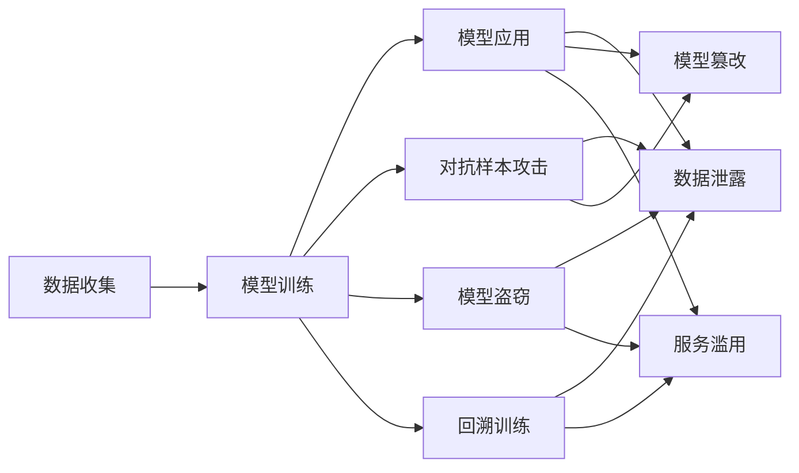

                 

# LLM隐私伦理:AI安全性挑战

## 1. 背景介绍

随着人工智能(AI)技术不断渗透到各个领域，大语言模型(LLMs)也逐渐成为社会各行各业的重要工具。然而，随着LLMs的广泛应用，隐私和安全问题变得愈加突出，如何在保证AI技术高效应用的同时，确保数据隐私和模型安全，成为当前亟需解决的关键问题。本文将对LLMs在隐私和安全性方面面临的挑战进行深入探讨，并提出一些切实可行的应对策略。

### 1.1 问题由来

大语言模型通过大量的无监督学习和有监督微调，可以获取和理解复杂的语言结构，并应用于问答、文本生成、机器翻译、情感分析等多个领域。然而，在模型训练和应用过程中，会涉及到大量的用户数据，包括个人信息、行为记录、社交互动等，这些数据具有高度的隐私敏感性。此外，LLMs还可能面临恶意攻击，如对抗样本攻击、模型盗窃、回溯训练等，给数据和模型安全带来严重威胁。

## 2. 核心概念与联系

### 2.1 核心概念概述

本节将介绍几个与大语言模型隐私伦理相关的核心概念：

- **隐私**：指个人信息在处理和传输过程中，未被非法泄露或未经授权使用。大语言模型在应用过程中，会收集和处理大量的用户数据，如何保护这些数据不被滥用，成为隐私保护的难点。

- **安全性**：指系统在运行过程中，避免被未授权者入侵或破坏。大语言模型存在多种安全性问题，包括对抗样本攻击、模型盗窃、回溯训练等，需要采取相应措施来加强模型防御能力。

- **对抗样本攻击**：通过在输入数据中加入微小扰动，使模型输出发生错误。攻击者可以通过对抗样本欺骗模型，导致系统行为异常。

- **模型盗窃**：攻击者通过反向推断模型参数，重建模型的结构，进而获取模型的行为信息。

- **回溯训练**：攻击者通过收集模型推理过程中的梯度信息，重新训练出与原始模型相似的模型。

这些核心概念之间存在紧密的联系，相互影响。隐私问题在数据收集阶段就已经存在，而安全问题在模型应用阶段尤为突出。因此，保障LLMs的隐私和安全性是一个系统性的工程，需要从数据收集、模型训练、模型应用等多个环节进行综合防护。

### 2.2 核心概念原理和架构的 Mermaid 流程图



这个流程图展示了数据收集、模型训练和模型应用三个阶段的隐私和安全问题。在数据收集阶段，隐私问题表现为数据泄露和滥用；在模型训练阶段，安全性问题包括对抗样本攻击、模型盗窃和回溯训练；而在模型应用阶段，隐私问题表现为数据泄露和滥用，安全性问题表现为模型篡改和服务滥用。

## 3. 核心算法原理 & 具体操作步骤

### 3.1 算法原理概述

大语言模型的隐私和安全性问题通常通过以下步骤进行处理：

1. **数据加密**：在数据收集和传输过程中，对数据进行加密处理，防止数据泄露。
2. **隐私保护技术**：在数据处理和模型训练过程中，采用差分隐私、同态加密等技术保护隐私。
3. **模型防御策略**：在模型应用过程中，采用对抗训练、模型加固等方法提高模型安全性。
4. **模型监控与审计**：对模型的应用和推理过程进行监控，及时发现和修复安全性问题。

### 3.2 算法步骤详解

1. **数据加密**：
   - 在数据收集阶段，对数据进行加密处理。常用的加密算法包括对称加密、非对称加密、哈希函数等。
   - 对于文本数据，可以采用AES、RSA等算法进行加密，确保数据在传输过程中的安全性。

2. **隐私保护技术**：
   - **差分隐私**：在模型训练过程中，采用差分隐私算法，对训练数据进行扰动处理，防止攻击者通过差分分析恢复原始数据。差分隐私算法包括Laplace机制、高斯机制等。
   - **同态加密**：在模型训练过程中，采用同态加密算法，对模型参数进行加密处理，确保模型在加密状态下进行计算，保护模型参数的安全性。常用的同态加密算法包括Paillier加密、BFV加密等。

3. **模型防御策略**：
   - **对抗训练**：在模型训练过程中，引入对抗样本进行训练，提高模型的鲁棒性。常用的对抗训练方法包括FGSM、PGD等。
   - **模型加固**：在模型应用过程中，采用模型加固技术，防止模型被恶意攻击。常用的模型加固方法包括基于梯度的方法、基于深度学习的方法等。

4. **模型监控与审计**：
   - **模型监控**：对模型的应用和推理过程进行实时监控，检测异常行为和攻击事件。
   - **模型审计**：定期对模型进行审计，评估模型的安全性和隐私保护效果，及时发现和修复问题。

### 3.3 算法优缺点

大语言模型的隐私和安全性问题的解决方法具有以下优点：

1. **增强隐私保护**：通过数据加密和隐私保护技术，可以有效防止数据泄露和滥用，保护用户隐私。
2. **提高模型安全性**：通过对抗训练和模型加固，可以有效提高模型的鲁棒性和安全性，防止恶意攻击。
3. **降低风险成本**：通过模型监控和审计，及时发现和修复安全性问题，降低潜在的风险成本。

但这些方法也存在一定的局限性：

1. **计算开销大**：加密和隐私保护技术会增加计算开销，降低模型训练和推理效率。
2. **复杂度高**：隐私保护和模型加固技术实现复杂，需要高水平的工程和技术支持。
3. **安全性不绝对**：即便采取了隐私保护和模型加固措施，仍不能完全避免数据泄露和模型攻击。

### 3.4 算法应用领域

隐私和安全性问题在大语言模型的多个应用领域中都具有重要意义。以下是一些典型的应用场景：

- **自然语言处理(NLP)**：在文本分类、情感分析、机器翻译等任务中，模型需要处理大量的用户数据，隐私和安全性问题尤为突出。
- **智能推荐系统**：在个性化推荐、广告投放等任务中，模型需要处理用户行为数据，需要确保数据隐私和模型安全。
- **医疗领域**：在医疗影像分析、疾病诊断等任务中，模型需要处理患者数据，隐私和安全性问题同样重要。
- **金融领域**：在金融风控、欺诈检测等任务中，模型需要处理大量交易数据，隐私和安全性问题不可忽视。

这些领域的应用需要在大语言模型的隐私和安全性问题上投入更多关注和资源，才能确保模型应用的合规性和安全性。

## 4. 数学模型和公式 & 详细讲解 & 举例说明

### 4.1 数学模型构建

在隐私和安全性问题处理中，常用的数学模型包括差分隐私模型和同态加密模型。这里以差分隐私模型为例进行详细讲解。

### 4.2 公式推导过程

差分隐私模型通过在数据扰动过程中引入噪声，确保数据集在统计意义上的隐私保护。假设原始数据集为 $D$，扰动后的数据集为 $D'$，其中 $D'$ 中的每个元素都是 $D$ 中元素的扰动版本。差分隐私模型的隐私保护程度由 $\epsilon$ 和 $\delta$ 两个参数决定。其中 $\epsilon$ 表示隐私预算，$\delta$ 表示结果错误概率。差分隐私模型的目标是最小化隐私损失函数：

$$
\mathcal{L}(D) = \log(1 + e^{\epsilon}) + \delta
$$

### 4.3 案例分析与讲解

以Laplace机制为例，Laplace机制在数据扰动过程中，对每个数据点引入Laplace分布的噪声。设原始数据为 $x$，噪声为 $\sigma$，扰动后的数据为 $x'$，则有：

$$
x' = x + \sigma
$$

其中 $\sigma$ 的取值为 $\Delta/2$，$\Delta$ 为数据点的范围。Laplace机制的隐私保护强度可以通过调整 $\Delta$ 和 $\sigma$ 的大小来控制，其中 $\epsilon$ 和 $\delta$ 的值由 $\Delta$ 和 $\sigma$ 确定。

## 5. 项目实践：代码实例和详细解释说明

### 5.1 开发环境搭建

在实践中，我们通常使用Python语言，配合TensorFlow和PyTorch等深度学习框架进行隐私和安全性问题的处理。以下是基本的开发环境搭建流程：

1. 安装Anaconda：从官网下载并安装Anaconda，用于创建独立的Python环境。
2. 创建并激活虚拟环境：
```bash
conda create -n pytorch-env python=3.8 
conda activate pytorch-env
```

3. 安装必要的工具包：
```bash
pip install tensorflow torch numpy pandas scikit-learn
```

### 5.2 源代码详细实现

以下是一个基于差分隐私的简单示例代码，展示了如何在模型训练过程中应用差分隐私算法。

```python
import numpy as np
import tensorflow as tf
from sklearn.datasets import load_iris
from sklearn.model_selection import train_test_split
from sklearn.preprocessing import StandardScaler
from tf_keras_privacy.layers import DifferentialPrivacy

# 加载数据集
iris = load_iris()
X = iris.data
y = iris.target

# 数据预处理
scaler = StandardScaler()
X = scaler.fit_transform(X)
X_train, X_test, y_train, y_test = train_test_split(X, y, test_size=0.2)

# 定义模型
model = tf.keras.Sequential([
    tf.keras.layers.Dense(16, activation='relu'),
    tf.keras.layers.Dense(8, activation='relu'),
    tf.keras.layers.Dense(3)
])

# 定义差分隐私参数
epsilon = 0.1
delta = 0.05

# 初始化差分隐私层
dp = DifferentialPrivacy(model.layers[0], epsilon, delta)

# 编译模型
model.compile(optimizer='adam', loss='sparse_categorical_crossentropy', metrics=['accuracy'])

# 训练模型
dp.train(X_train, y_train, epochs=10)
```

### 5.3 代码解读与分析

在上述代码中，我们首先加载了一个Iris数据集，并对数据进行了标准化处理。然后定义了一个简单的全连接神经网络模型，并在模型的第一层中初始化了一个差分隐私层。最后，编译模型并开始训练。在训练过程中，差分隐私层会随机扰动模型的输入数据，确保隐私保护。

### 5.4 运行结果展示

在训练过程中，差分隐私层的扰动效果会随着训练轮数增加而逐渐降低，最终输出的模型参数也会发生微小的变化。通过差分隐私算法，可以有效保护数据隐私，防止攻击者通过模型推理恢复原始数据。

## 6. 实际应用场景

### 6.1 智能客服系统

智能客服系统在处理用户咨询和反馈时，会收集大量的用户信息，包括用户姓名、联系方式、咨询内容等。这些信息具有高度的隐私敏感性，需要采取严格的隐私保护措施。

在实践中，可以通过差分隐私算法对用户信息进行扰动处理，确保用户隐私。同时，对模型进行对抗训练和模型加固，防止攻击者通过模型推理恢复用户信息。

### 6.2 金融风控系统

金融风控系统需要处理大量的交易数据，包括用户交易记录、账户信息等。这些数据具有高度的隐私敏感性，需要确保数据隐私和模型安全。

在实践中，可以通过同态加密算法对交易数据进行加密处理，确保数据在计算过程中的安全性。同时，对模型进行对抗训练和模型加固，防止攻击者通过模型推理恢复交易信息。

### 6.3 医疗影像分析系统

医疗影像分析系统需要处理患者的影像数据和医疗记录，这些数据具有高度的隐私敏感性，需要确保数据隐私和模型安全。

在实践中，可以通过差分隐私算法对患者数据进行扰动处理，确保患者隐私。同时，对模型进行对抗训练和模型加固，防止攻击者通过模型推理恢复患者数据。

## 7. 工具和资源推荐

### 7.1 学习资源推荐

为深入理解大语言模型的隐私和安全性问题，推荐以下学习资源：

1. **《差分隐私基础与实践》**：由差分隐私领域的专家撰写，系统介绍了差分隐私的基本概念、算法和应用。
2. **《同态加密基础与实现》**：介绍了同态加密的基本原理和实现方法，适合技术开发者深入学习。
3. **《深度学习中的隐私保护技术》**：由深度学习专家撰写，介绍了在深度学习中应用隐私保护技术的思路和方法。
4. **《TensorFlow Privacy》**：TensorFlow官方文档中的隐私保护部分，提供了基于TensorFlow的差分隐私和同态加密实现。
5. **《PyTorch Privacy》**：PyTorch官方文档中的隐私保护部分，提供了基于PyTorch的差分隐私和同态加密实现。

### 7.2 开发工具推荐

以下是一些常用的开发工具，有助于处理大语言模型的隐私和安全性问题：

1. **TensorFlow**：基于数据流图的深度学习框架，支持差分隐私和同态加密算法。
2. **PyTorch**：基于动态图机制的深度学习框架，支持差分隐私和同态加密算法。
3. **Google Colab**：免费的在线Jupyter Notebook环境，支持GPU/TPU算力，方便开发者快速实验最新模型。
4. **AWS SageMaker**：亚马逊提供的云平台服务，支持大语言模型训练和推理，支持差分隐私和同态加密。
5. **Microsoft Azure**：微软提供的云平台服务，支持大语言模型训练和推理，支持差分隐私和同态加密。

### 7.3 相关论文推荐

以下是几篇具有代表性的论文，深度介绍了大语言模型的隐私和安全性问题：

1. **《Differential Privacy: The Least Private Algorithm: Protection via Transformations》**：介绍了差分隐私的基本概念和保护机制，是差分隐私领域的经典论文。
2. **《Homomorphic Encryption: Fully Homomorphic Encryption Schemes》**：介绍了同态加密的基本原理和实现方法，是同态加密领域的经典论文。
3. **《Privacy-Preserving Deep Learning via Pruning》**：介绍了基于剪枝的差分隐私保护方法，适用于深度学习模型。
4. **《Adversarial Robustness and Privacy in Deep Learning》**：介绍了对抗训练和差分隐私在深度学习中的应用，适合技术开发者参考。
5. **《Secure Learning and Its Applications》**：介绍了安全学习的基本概念和应用场景，适合深入了解隐私和安全问题。

## 8. 总结：未来发展趋势与挑战

### 8.1 研究成果总结

本文系统介绍了大语言模型在隐私和安全性方面面临的挑战，并提出了一系列解决策略。通过差分隐私和同态加密等技术，可以有效保护数据隐私；通过对抗训练和模型加固等方法，可以提升模型安全性。但这些方法也存在计算开销大、复杂度高、安全性不绝对等缺点，需要不断优化和改进。

### 8.2 未来发展趋势

未来，大语言模型的隐私和安全性问题将继续受到广泛关注和深入研究，主要趋势如下：

1. **隐私保护技术不断发展**：随着隐私保护技术的不断进步，差分隐私、同态加密等方法将更加成熟和高效，能够更好地保护用户隐私。
2. **模型加固技术更灵活**：未来的模型加固技术将更加灵活多样，能够适应不同的应用场景和攻击方式。
3. **模型监控和审计工具更完善**：随着模型的应用范围不断扩大，模型监控和审计工具将更加完善，能够及时发现和修复潜在的安全问题。
4. **隐私和安全性研究更加全面**：未来的研究将更加注重隐私和安全性问题的全面解决，不仅在技术层面，还要在法律、伦理、社会等方面进行深入探讨。

### 8.3 面临的挑战

尽管隐私和安全性问题处理技术不断进步，但仍面临诸多挑战：

1. **计算资源限制**：差分隐私和同态加密等技术需要消耗大量计算资源，如何降低计算开销是未来研究的重点。
2. **隐私保护与性能平衡**：隐私保护技术通常会降低模型性能，如何在隐私保护和模型性能之间找到平衡点是未来的挑战。
3. **模型窃取和对抗攻击**：攻击者会不断寻找新的攻击手段，如何防御这些攻击是未来的重要课题。
4. **法律和伦理问题**：隐私和安全性问题涉及到复杂的法律和伦理问题，如何在技术层面与社会层面进行协调是未来的难点。

### 8.4 研究展望

未来的隐私和安全性研究需要在以下几个方面进行深入探索：

1. **跨领域隐私保护技术**：将隐私保护技术应用于多个领域，如金融、医疗、教育等，提升隐私保护的普适性和实用性。
2. **模型隐私保护技术**：开发更加高效的模型隐私保护方法，如基于学习的差分隐私、基于机制的差分隐私等，提升隐私保护的灵活性和效率。
3. **模型加固技术**：开发更加灵活的模型加固方法，如基于梯度的方法、基于深度学习的方法等，提升模型加固的适应性和安全性。
4. **模型监控和审计**：开发更加全面的模型监控和审计工具，实时检测和修复模型问题，确保模型安全和隐私保护。
5. **隐私和安全性法律和伦理**：在技术层面和社会层面共同努力，建立更加完善的隐私和安全性法律和伦理规范，保障用户隐私和数据安全。

总之，隐私和安全性问题是大语言模型应用过程中必须解决的重要问题，未来的研究需要在技术、法律、伦理等多个层面进行综合考虑，才能构建更加安全、可靠的智能系统。

