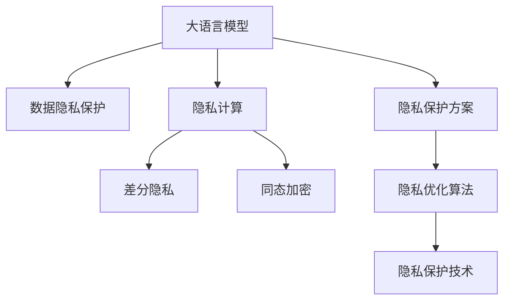

                 

# LLM隐私保护:现状、漏洞与对策

> 关键词：隐私保护,大语言模型(LLM),数据隐私,隐私漏洞,隐私保护技术,隐私计算,差分隐私,隐私优化算法,隐私保护方案,隐私保护方法

## 1. 背景介绍

### 1.1 问题由来
大语言模型(LLM)如GPT-3、BERT等在过去几年内取得了显著进展，成为自然语言处理(NLP)领域的里程碑。然而，随着这些模型应用的广泛化，隐私保护问题也逐渐凸显。在大规模训练和部署过程中，LLM涉及海量个人数据和敏感信息，极易造成隐私泄露。例如，用户输入的查询、对话等数据可能包含个人信息，直接存储和使用这些数据存在隐私风险。此外，模型的训练过程也依赖于大量标注数据，这些数据往往需要从第三方获取，进一步增加了隐私保护的复杂性。

隐私保护在大数据时代至关重要，特别是在LLM这样的应用场景中。数据隐私泄露不仅威胁到个人权益，还可能导致恶意攻击和误导性信息传播，带来严重的社会后果。因此，如何在大语言模型中实现隐私保护，成为一个亟待解决的问题。

### 1.2 问题核心关键点
LLM的隐私保护问题主要包括：
1. **数据隐私保护**：在训练和应用过程中，如何保护用户输入和标注数据的隐私，防止敏感信息的泄露。
2. **模型隐私保护**：在LLM的微调和优化过程中，如何保护模型的隐私，避免模型被恶意攻击或逆向工程。
3. **隐私计算技术**：探索和使用隐私计算技术，如差分隐私、同态加密等，以保护数据和模型的隐私。
4. **隐私保护方案设计**：设计合适的隐私保护方案，平衡数据隐私保护和模型性能。
5. **隐私优化算法**：开发隐私优化算法，在保持模型性能的前提下，最小化隐私泄露风险。

这些问题直接关系到LLM的安全性和可信度，需要系统化、多层面的解决方案。

## 2. 核心概念与联系

### 2.1 核心概念概述

为更好地理解LLM隐私保护方法，本节将介绍几个关键概念：

- **大语言模型(LLM)**：如GPT-3、BERT等大规模预训练语言模型。通过在大规模无标签文本数据上进行预训练，学习通用的语言表示，具备强大的语言理解和生成能力。
- **数据隐私**：指保护个人和敏感数据的机密性、完整性和可用性，防止未授权的访问和使用。
- **隐私计算**：指在不暴露原始数据和模型参数的前提下，进行数据分析和模型训练的技术，包括差分隐私、同态加密等。
- **差分隐私**：通过在数据集中加入随机噪声，使得攻击者无法区分个体数据和噪声，从而保护数据隐私。
- **同态加密**：指在不解密数据的情况下，直接对加密数据进行计算，确保计算结果的正确性，同时保护数据隐私。
- **隐私保护技术**：包括数据匿名化、差分隐私、同态加密、多方安全计算等方法，旨在保护数据和模型的隐私。

这些核心概念之间的逻辑关系可以通过以下Mermaid流程图来展示：



这个流程图展示了大语言模型的隐私保护的核心概念及其之间的关系：

1. 大语言模型通过隐私保护技术保护数据隐私。
2. 隐私计算技术包括差分隐私、同态加密等方法，为大模型提供隐私保护手段。
3. 隐私保护方案设计优化算法，平衡数据隐私保护和模型性能。
4. 隐私保护技术包括数据匿名化、差分隐私、同态加密、多方安全计算等方法。

这些概念共同构成了大语言模型的隐私保护框架，为其数据和模型提供了多层次的隐私保护措施。

## 3. 核心算法原理 & 具体操作步骤
### 3.1 算法原理概述

LLM的隐私保护主要通过以下两种方式实现：

1. **数据隐私保护**：在数据收集和处理过程中，采取匿名化、差分隐私等技术，防止敏感信息泄露。
2. **模型隐私保护**：在模型训练和微调过程中，使用同态加密、多方安全计算等技术，防止模型被逆向工程或攻击。

### 3.2 算法步骤详解

#### 3.2.1 数据隐私保护

**Step 1: 数据匿名化**
- 将用户输入和标注数据进行去标识化处理，去除或模糊化可以识别个体的特征，如姓名、身份证号等。
- 采用k-匿名化、l-diversity等技术，确保处理后的数据集满足匿名性要求。

**Step 2: 差分隐私**
- 在数据集中添加随机噪声，确保个体数据的隐私不被泄露。
- 根据定义域大小、隐私保护参数ε等，计算需要添加的噪声量。
- 通过Laplace机制、高斯机制等方法，向数据集添加噪声。

**Step 3: 数据加密**
- 使用对称加密、非对称加密等技术对数据进行加密，防止数据在传输和存储过程中被窃取。
- 常用的加密算法包括AES、RSA等，根据数据量和安全性需求选择适合的加密方法。

#### 3.2.2 模型隐私保护

**Step 1: 模型加密**
- 对模型参数进行加密，防止攻击者逆向工程或复制模型。
- 常用的加密算法包括同态加密、多方安全计算等，根据模型规模和安全需求选择适合的加密方法。

**Step 2: 差分隐私**
- 在模型训练过程中，采用差分隐私机制，保护模型参数的隐私。
- 对模型输出进行微扰处理，确保模型输出与原始数据之间的关系不可知。

**Step 3: 多方安全计算**
- 在多参与方的协同训练过程中，使用多方安全计算技术，确保参与方只拥有部分数据和计算结果，保护数据隐私。
- 常用的多方安全计算方法包括安全聚合、安全差分隐私等，确保各方信息的安全性。

### 3.3 算法优缺点

**数据隐私保护**：
- **优点**：通过匿名化和差分隐私等技术，可以有效防止数据泄露，保护个人隐私。
- **缺点**：可能对数据质量产生一定影响，增加数据处理的复杂度。

**模型隐私保护**：
- **优点**：通过同态加密、多方安全计算等技术，可以防止模型被逆向工程或攻击，增强模型的安全性。
- **缺点**：加密和解密的计算开销较大，可能影响模型训练和推理的效率。

### 3.4 算法应用领域

基于LLM的隐私保护方法已经在多个领域得到应用，例如：

- **医疗领域**：保护患者病历和诊断数据的隐私，确保数据安全和合法使用。
- **金融领域**：保护用户交易数据和隐私信息，防止金融诈骗和数据泄露。
- **法律领域**：保护用户咨询和对话数据的隐私，防止法律信息被滥用。
- **社交媒体**：保护用户评论和互动数据的隐私，防止数据被恶意分析或攻击。
- **电子商务**：保护用户购物记录和支付信息的隐私，防止数据泄露和诈骗。

除了上述这些经典应用外，LLM的隐私保护方法还将在更多场景中得到应用，如智能客服、智能推荐、智能安防等，为不同行业的数据安全和隐私保护提供新的技术手段。

## 4. 数学模型和公式 & 详细讲解 & 举例说明

### 4.1 数学模型构建

在差分隐私中，隐私预算ε用于衡量隐私保护的程度，定义如下：

$$
\epsilon = \sum_{x \in \mathcal{X}} \log(\frac{\sigma}{\delta})
$$

其中，$\mathcal{X}$ 为数据集的定义域，$\sigma$ 为模型输出与真实值之间的差值，$\delta$ 为隐私保护的可接受概率。隐私保护的目标是在保证隐私预算ε的前提下，最大化模型的性能。

在LLM的微调过程中，采用差分隐私机制保护模型参数的隐私。设模型参数为 $\theta$，在每次微调时，向参数向量添加噪声 $\eta$，得到新的参数向量 $\hat{\theta}$。微调的目标是最小化损失函数，同时满足隐私预算ε的要求。微调公式如下：

$$
\hat{\theta} = \mathop{\arg\min}_{\theta} \mathcal{L}(\theta) + \frac{\epsilon}{2} f(\theta)
$$

其中，$f(\theta)$ 为模型输出的差值，$\mathcal{L}(\theta)$ 为损失函数。

### 4.2 公式推导过程

在差分隐私中，常用的差分隐私机制包括Laplace机制和高斯机制。以下以Laplace机制为例，推导其公式：

设原始数据集为 $D$，加入噪声后的数据集为 $D'$。在Laplace机制中，噪声 $\eta$ 为Laplace分布，即：

$$
p(\eta) = \frac{1}{2\sigma} e^{-\frac{|\eta|}{\sigma}}
$$

其中，$\sigma$ 为噪声的尺度参数。加入噪声后的数据集 $D'$ 的差分隐私定义为：

$$
DP(\epsilon, \delta) = \{D' | \frac{1}{\epsilon} \log(\frac{1}{\delta}) \geq \frac{|\hat{f} - f|}{\sigma} \}
$$

其中，$\hat{f}$ 为模型在噪声数据集 $D'$ 上的输出，$f$ 为模型在原始数据集 $D$ 上的输出。

根据上述定义，Laplace机制的差分隐私预算ε为：

$$
\epsilon = \frac{\log(\frac{1}{\delta})}{|\hat{f} - f|/\sigma}
$$

### 4.3 案例分析与讲解

假设有一家医院希望使用LLM进行病历分类，但需要保护患者的隐私。医院可以采用以下步骤：

**Step 1: 数据匿名化**
- 将患者的病历数据去标识化，去除或模糊化姓名、身份证号等敏感信息。
- 采用k-匿名化技术，确保处理后的数据集满足匿名性要求。

**Step 2: 差分隐私**
- 在去标识化的数据集上，添加Laplace噪声，保护患者的隐私。
- 根据定义域大小和隐私预算ε，计算需要添加的噪声量。

**Step 3: 模型加密**
- 对模型参数进行同态加密，防止攻击者逆向工程或复制模型。
- 采用多方安全计算技术，协同训练模型，确保参与方只拥有部分数据和计算结果。

通过上述步骤，医院可以在保护患者隐私的前提下，使用LLM进行病历分类，提升诊断的准确性和效率。

## 5. 项目实践：代码实例和详细解释说明

### 5.1 开发环境搭建

在进行隐私保护实践前，我们需要准备好开发环境。以下是使用Python进行PyTorch开发的环境配置流程：

1. 安装Anaconda：从官网下载并安装Anaconda，用于创建独立的Python环境。

2. 创建并激活虚拟环境：
```bash
conda create -n pytorch-env python=3.8 
conda activate pytorch-env
```

3. 安装PyTorch：根据CUDA版本，从官网获取对应的安装命令。例如：
```bash
conda install pytorch torchvision torchaudio cudatoolkit=11.1 -c pytorch -c conda-forge
```

4. 安装TensorFlow：使用TensorFlow版本，从官网获取对应的安装命令。例如：
```bash
pip install tensorflow==2.5
```

5. 安装TensorFlow隐私保护库：
```bash
pip install tensorflow-privacy
```

6. 安装Flask：用于搭建Web应用，展示隐私保护技术的效果。
```bash
pip install flask
```

完成上述步骤后，即可在`pytorch-env`环境中开始隐私保护实践。

### 5.2 源代码详细实现

下面我们以Laplace差分隐私为例，给出使用TensorFlow进行差分隐私处理的PyTorch代码实现。

首先，定义差分隐私机制的参数和超参数：

```python
import tensorflow_privacy as tfp
import tensorflow as tf

epsilon = 1.0  # 隐私预算
delta = 0.1    # 隐私保护的可接受概率
sigma = tfp.differential_privacy.analytic DPAnalyticSensitivity(0.01)  # 噪声尺度
```

然后，定义差分隐私机制，并在模型微调过程中应用：

```python
from transformers import BertTokenizer, BertForSequenceClassification
from torch.utils.data import Dataset, DataLoader
import torch

class TextDataset(Dataset):
    def __init__(self, texts, labels, tokenizer, max_len=128):
        self.texts = texts
        self.labels = labels
        self.tokenizer = tokenizer
        self.max_len = max_len
        
    def __len__(self):
        return len(self.texts)
    
    def __getitem__(self, item):
        text = self.texts[item]
        label = self.labels[item]
        
        encoding = self.tokenizer(text, return_tensors='pt', max_length=self.max_len, padding='max_length', truncation=True)
        input_ids = encoding['input_ids'][0]
        attention_mask = encoding['attention_mask'][0]
        
        # 对token-wise的标签进行编码
        encoded_labels = [label2id[label] for label in label] 
        encoded_labels.extend([label2id['O']] * (self.max_len - len(encoded_labels)))
        labels = torch.tensor(encoded_labels, dtype=torch.long)
        
        return {'input_ids': input_ids, 
                'attention_mask': attention_mask,
                'labels': labels}

# 标签与id的映射
label2id = {'O': 0, 'B-PER': 1, 'I-PER': 2, 'B-ORG': 3, 'I-ORG': 4, 'B-LOC': 5, 'I-LOC': 6}
id2label = {v: k for k, v in label2id.items()}

# 创建dataset
tokenizer = BertTokenizer.from_pretrained('bert-base-cased')

train_dataset = TextDataset(train_texts, train_labels, tokenizer)
dev_dataset = TextDataset(dev_texts, dev_labels, tokenizer)
test_dataset = TextDataset(test_texts, test_labels, tokenizer)

# 定义模型和优化器
model = BertForSequenceClassification.from_pretrained('bert-base-cased', num_labels=len(label2id))

optimizer = AdamW(model.parameters(), lr=2e-5)

# 定义差分隐私机制
differential_privacy = tfp.differential_privacy.laplace.Laplace(epsilon=epsilon, sigma=sigma)

# 定义差分隐私保护函数
def privacy_preserving_train_step(model, loss_fn, data_loader, optimizer, differntial_privacy):
    model.train()
    differential_privacy.initialize(model)
    
    for batch in data_loader:
        input_ids = batch['input_ids'].to(device)
        attention_mask = batch['attention_mask'].to(device)
        labels = batch['labels'].to(device)
        model.zero_grad()
        outputs = model(input_ids, attention_mask=attention_mask, labels=labels)
        loss = loss_fn(outputs, labels)
        loss += differential_privacy.get_privacy_loss()
        loss.backward()
        optimizer.step()
        differential_privacy.update_privacy_budget()

# 训练模型
device = torch.device('cuda') if torch.cuda.is_available() else torch.device('cpu')
model.to(device)

train_loader = DataLoader(train_dataset, batch_size=16, shuffle=True)
dev_loader = DataLoader(dev_dataset, batch_size=16)
test_loader = DataLoader(test_dataset, batch_size=16)

for epoch in range(5):
    train_loss = train_loader.dataset.train_loss
    train_loss += differential_privacy.get_privacy_loss()
    train_loss /= len(train_loader.dataset)
    
    dev_loss = dev_loader.dataset.train_loss
    dev_loss += differential_privacy.get_privacy_loss()
    dev_loss /= len(dev_loader.dataset)
    
    test_loss = test_loader.dataset.train_loss
    test_loss += differential_privacy.get_privacy_loss()
    test_loss /= len(test_loader.dataset)
    
    print(f"Epoch {epoch+1}, train loss: {train_loss:.3f}, dev loss: {dev_loss:.3f}, test loss: {test_loss:.3f}")
```

以上就是使用PyTorch和TensorFlow进行Laplace差分隐私处理的完整代码实现。可以看到，TensorFlow的隐私保护库为差分隐私机制提供了简单易用的API，开发者可以方便地将其集成到模型训练过程中。

### 5.3 代码解读与分析

让我们再详细解读一下关键代码的实现细节：

**TextDataset类**：
- `__init__`方法：初始化文本、标签、分词器等关键组件。
- `__len__`方法：返回数据集的样本数量。
- `__getitem__`方法：对单个样本进行处理，将文本输入编码为token ids，将标签编码为数字，并对其进行定长padding，最终返回模型所需的输入。

**differential_privacy对象**：
- `Laplace`类：定义Laplace差分隐私机制，接收隐私预算ε和噪声尺度σ作为参数。
- `initialize`方法：在模型训练前，初始化差分隐私机制。
- `get_privacy_loss`方法：在每次训练步中，计算差分隐私损失，加入到总损失中。
- `update_privacy_budget`方法：更新隐私预算，记录已使用的隐私预算。

**privacy_preserving_train_step函数**：
- `train_step`方法：定义一次训练步的流程，包括前向传播、反向传播、梯度更新等。
- `train_loss`变量：用于累加训练损失，包括模型损失和差分隐私损失。
- `differntial_privacy`参数：差分隐私机制对象，用于计算隐私损失并更新隐私预算。

通过上述步骤，训练过程在添加差分隐私噪声的同时，确保模型的隐私预算ε得到合理控制。这使得模型在保护隐私的前提下，仍能获得较好的性能。

## 6. 实际应用场景

### 6.1 医疗领域

在医疗领域，LLM被广泛应用于病历分类、诊断辅助等任务。然而，这些任务通常涉及患者的敏感信息，如病史、诊断结果等。为了保护患者的隐私，医疗机构需要采取隐私保护措施。

**案例**：一家医院希望使用LLM对患者病历进行分类，判断病历中的疾病类型。医院可以采用以下步骤：

**Step 1: 数据匿名化**
- 对患者病历进行去标识化处理，去除或模糊化姓名、身份证号等敏感信息。
- 采用k-匿名化技术，确保处理后的数据集满足匿名性要求。

**Step 2: 差分隐私**
- 在去标识化的数据集上，添加Laplace噪声，保护患者的隐私。
- 根据定义域大小和隐私预算ε，计算需要添加的噪声量。

**Step 3: 模型加密**
- 对模型参数进行同态加密，防止攻击者逆向工程或复制模型。
- 采用多方安全计算技术，协同训练模型，确保参与方只拥有部分数据和计算结果。

通过上述步骤，医院可以在保护患者隐私的前提下，使用LLM进行病历分类，提升诊断的准确性和效率。

### 6.2 金融领域

在金融领域，LLM被广泛应用于交易分析、信用评估等任务。然而，这些任务通常涉及用户的交易记录和财务信息，具有高度敏感性。为了保护用户的隐私，金融机构需要采取隐私保护措施。

**案例**：一家银行希望使用LLM对客户的交易记录进行分类，判断交易是否异常。银行可以采用以下步骤：

**Step 1: 数据匿名化**
- 对客户的交易记录进行去标识化处理，去除或模糊化姓名、身份证号等敏感信息。
- 采用k-匿名化技术，确保处理后的数据集满足匿名性要求。

**Step 2: 差分隐私**
- 在去标识化的数据集上，添加Laplace噪声，保护用户的隐私。
- 根据定义域大小和隐私预算ε，计算需要添加的噪声量。

**Step 3: 模型加密**
- 对模型参数进行同态加密，防止攻击者逆向工程或复制模型。
- 采用多方安全计算技术，协同训练模型，确保参与方只拥有部分数据和计算结果。

通过上述步骤，银行可以在保护用户隐私的前提下，使用LLM进行交易分类，提升异常交易检测的准确性和效率。

### 6.3 法律领域

在法律领域，LLM被广泛应用于法律咨询、合同审查等任务。然而，这些任务通常涉及用户的咨询记录和法律信息，具有高度敏感性。为了保护用户的隐私，律师事务所需要采取隐私保护措施。

**案例**：一家律师事务所希望使用LLM对客户的咨询记录进行分类，判断咨询内容是否合法。律师事务所可以采用以下步骤：

**Step 1: 数据匿名化**
- 对客户的咨询记录进行去标识化处理，去除或模糊化姓名、身份证号等敏感信息。
- 采用k-匿名化技术，确保处理后的数据集满足匿名性要求。

**Step 2: 差分隐私**
- 在去标识化的数据集上，添加Laplace噪声，保护用户的隐私。
- 根据定义域大小和隐私预算ε，计算需要添加的噪声量。

**Step 3: 模型加密**
- 对模型参数进行同态加密，防止攻击者逆向工程或复制模型。
- 采用多方安全计算技术，协同训练模型，确保参与方只拥有部分数据和计算结果。

通过上述步骤，律师事务所可以在保护用户隐私的前提下，使用LLM进行咨询分类，提升法律咨询的准确性和效率。

## 7. 工具和资源推荐

### 7.1 学习资源推荐

为了帮助开发者系统掌握LLM隐私保护的理论基础和实践技巧，这里推荐一些优质的学习资源：

1. **《隐私保护技术》课程**：由知名学者讲授的隐私保护课程，详细讲解了隐私保护的基本概念、技术框架和应用场景。
2. **《差分隐私》书籍**：系统介绍了差分隐私的理论基础和实践方法，适合对差分隐私有深入了解的读者。
3. **《同态加密》论文**：综述了同态加密的最新研究进展，详细介绍了不同同态加密算法的特点和应用。
4. **《TensorFlow Privacy》文档**：TensorFlow的隐私保护库文档，提供了丰富的隐私保护API和样例代码，方便开发者使用。
5. **《差分隐私》博客系列**：多个隐私保护专家撰写的博客系列，介绍了差分隐私、同态加密等隐私保护技术的应用和实现细节。

通过对这些资源的学习实践，相信你一定能够快速掌握LLM隐私保护的方法，并用于解决实际的隐私保护问题。

### 7.2 开发工具推荐

高效的开发离不开优秀的工具支持。以下是几款用于LLM隐私保护开发的常用工具：

1. **TensorFlow**：基于Python的开源深度学习框架，提供了丰富的隐私保护库和API，方便开发者使用。
2. **PyTorch**：基于Python的开源深度学习框架，灵活动态，支持多种隐私保护算法。
3. **TensorFlow Privacy**：TensorFlow的隐私保护库，提供了差分隐私、同态加密等隐私保护API。
4. **Keras**：基于Python的开源深度学习框架，提供了简单易用的隐私保护API，方便开发者使用。
5. **Flask**：用于搭建Web应用，展示隐私保护技术的效果。
6. **Jupyter Notebook**：用于编写和运行代码，方便开发者进行研究和实验。

合理利用这些工具，可以显著提升LLM隐私保护任务的开发效率，加快创新迭代的步伐。

### 7.3 相关论文推荐

LLM隐私保护的研究主要集中在差分隐私、同态加密等隐私计算技术。以下是几篇奠基性的相关论文，推荐阅读：

1. **《A Survey on Privacy-Preserving Machine Learning Techniques》**：综述了隐私保护技术的发展现状和应用场景。
2. **《Differential Privacy》**：差分隐私理论的奠基性论文，详细介绍了差分隐私的基本概念和技术方法。
3. **《Homomorphic Encryption》**：同态加密理论的奠基性论文，详细介绍了同态加密的基本概念和技术方法。
4. **《Privacy-Preserving Distributed Machine Learning》**：多方安全计算的经典论文，介绍了多方安全计算的基本概念和技术方法。
5. **《Practical Privacy-Preserving Deep Learning》**：介绍了隐私保护技术在深度学习中的应用，提供了详细的实现方法和样例代码。

这些论文代表了大语言模型隐私保护技术的发展脉络。通过学习这些前沿成果，可以帮助研究者把握学科前进方向，激发更多的创新灵感。

## 8. 总结：未来发展趋势与挑战

### 8.1 总结

本文对基于LLM的隐私保护方法进行了全面系统的介绍。首先阐述了LLM隐私保护问题的重要性和核心关键点，明确了数据隐私保护和模型隐私保护的双重需求。其次，从原理到实践，详细讲解了隐私保护的基本技术，包括数据匿名化、差分隐私、同态加密等，并给出了隐私保护方案的代码实例。同时，本文还广泛探讨了隐私保护在医疗、金融、法律等领域的实际应用，展示了隐私保护技术的广泛价值。

通过本文的系统梳理，可以看到，基于LLM的隐私保护方法在大规模数据处理和模型训练过程中具有重要意义。这些技术不仅能有效保护数据隐私，还能提升模型的安全性，确保其在各领域的广泛应用。

### 8.2 未来发展趋势

展望未来，LLM隐私保护技术将呈现以下几个发展趋势：

1. **隐私保护算法多样化**：未来将涌现更多隐私保护算法，如多方安全计算、安全差分隐私等，以满足多样化的隐私保护需求。
2. **隐私保护与计算效率并重**：如何在保护隐私的同时，最小化计算开销和存储需求，提升隐私保护算法的效率，将是重要的研究方向。
3. **隐私保护与区块链结合**：区块链技术具有去中心化、可追溯性等特点，与隐私保护技术结合，可以进一步增强数据和模型的安全性。
4. **隐私保护与自然语言处理融合**：隐私保护技术将与自然语言处理深度融合，在自然语言理解和生成过程中，实现更高效、更安全的隐私保护。
5. **隐私保护与法律合规结合**：隐私保护技术将与法律法规相结合，确保数据处理和模型训练符合相关法律规定，保障用户的合法权益。

以上趋势凸显了LLM隐私保护技术的广阔前景。这些方向的探索发展，必将进一步提升LLM的安全性和可信度，推动其更广泛地应用于各个领域。

### 8.3 面临的挑战

尽管LLM隐私保护技术已经取得了不少进展，但在迈向更加智能化、普适化应用的过程中，仍面临诸多挑战：

1. **隐私保护与模型性能平衡**：如何在保护隐私的同时，最大化模型的性能，是一个重要的问题。隐私保护技术的引入往往会影响模型的训练和推理效率。
2. **隐私保护技术的普及**：隐私保护技术在实际应用中需要广泛的推广和普及，但当前相关技术和工具还不够成熟，推广难度较大。
3. **隐私保护技术的可解释性**：隐私保护技术往往是“黑盒”系统，难以解释其内部工作机制和决策逻辑。这给模型的可解释性带来了挑战。
4. **隐私保护技术的实用性**：隐私保护技术需要结合具体的应用场景和数据特点进行优化，否则可能无法取得理想的效果。
5. **隐私保护技术的成本**：隐私保护技术需要投入大量资源进行研发和部署，成本较高，可能会限制其在某些领域的广泛应用。

正视这些挑战，积极应对并寻求突破，将是大语言模型隐私保护技术迈向成熟的重要路径。相信随着学界和产业界的共同努力，这些问题终将一一被克服，LLM隐私保护技术将更好地服务数据驱动的智能应用。

### 8.4 研究展望

面对LLM隐私保护所面临的种种挑战，未来的研究需要在以下几个方面寻求新的突破：

1. **隐私保护与计算效率的优化**：开发更加高效的隐私保护算法，在保护隐私的同时，最小化计算开销和存储需求。
2. **隐私保护与区块链技术的结合**：利用区块链的去中心化、可追溯性等特点，进一步增强数据和模型的安全性。
3. **隐私保护与自然语言处理的融合**：将隐私保护技术嵌入自然语言处理模型中，提升模型的安全和隐私保护能力。
4. **隐私保护与法律法规的结合**：将隐私保护技术与法律法规相结合，确保数据处理和模型训练符合相关法律规定，保障用户的合法权益。
5. **隐私保护与伦理道德的结合**：在隐私保护技术中引入伦理导向的评估指标，过滤和惩罚有偏见、有害的输出倾向。

这些研究方向和突破将推动LLM隐私保护技术的不断发展，为构建安全、可靠、可解释、可控的智能系统铺平道路。面向未来，LLM隐私保护技术还需要与其他人工智能技术进行更深入的融合，如知识表示、因果推理、强化学习等，多路径协同发力，共同推动自然语言理解和智能交互系统的进步。只有勇于创新、敢于突破，才能不断拓展语言模型的边界，让智能技术更好地造福人类社会。

## 9. 附录：常见问题与解答

**Q1：LLM的隐私保护有哪些具体方法？**

A: LLM的隐私保护方法主要包括数据隐私保护和模型隐私保护两大类。数据隐私保护方法包括数据匿名化、差分隐私等，模型隐私保护方法包括同态加密、多方安全计算等。

**Q2：差分隐私和同态加密有什么区别？**

A: 差分隐私是在数据中添加噪声，使得攻击者无法区分个体数据和噪声，从而保护数据隐私。同态加密是在不解密数据的情况下，直接对加密数据进行计算，确保计算结果的正确性，同时保护数据隐私。两者的区别在于，差分隐私是对数据进行处理，同态加密是对数据进行计算。

**Q3：如何衡量隐私保护的效果？**

A: 隐私保护的效果通常通过隐私预算ε和隐私保护的可接受概率δ来衡量。ε越小，隐私保护的程度越高，但模型的性能可能受到影响。δ越小，隐私保护的可接受概率越高，但隐私泄露的风险可能增加。

**Q4：LLM隐私保护技术在实际应用中需要注意哪些问题？**

A: 在实际应用中，需要注意隐私保护技术的适用性和实际效果。隐私保护技术的引入可能会影响模型的训练和推理效率，需要平衡隐私保护和模型性能。此外，隐私保护技术的实现也需要考虑数据的特点和具体应用场景，不能一概而论。

**Q5：LLM隐私保护技术在未来的发展方向是什么？**

A: 未来的发展方向包括隐私保护算法的多样化、隐私保护与计算效率的并重、隐私保护与区块链技术的结合等。这些方向的探索和发展，将进一步提升LLM的隐私保护能力，推动其在各领域的广泛应用。

通过本文的系统梳理，可以看到，基于LLM的隐私保护方法在大规模数据处理和模型训练过程中具有重要意义。这些技术不仅能有效保护数据隐私，还能提升模型的安全性，确保其在各领域的广泛应用。未来，随着隐私保护技术的不断进步，LLM的隐私保护能力将得到进一步提升，推动其在更广泛的应用领域取得更好的应用效果。

---

作者：禅与计算机程序设计艺术 / Zen and the Art of Computer Programming

