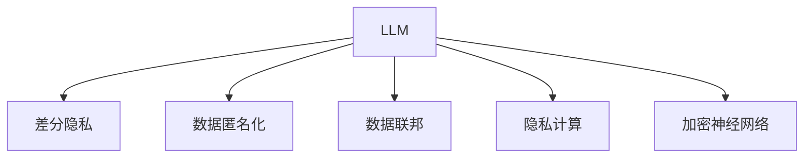

                 

# LLM面临的隐私挑战及其解决途径

> 关键词：大语言模型(LLM), 隐私保护, 数据安全, 数据匿名化, 差分隐私, 数据联邦, 隐私计算

## 1. 背景介绍

### 1.1 问题由来

在人工智能(AI)和机器学习(ML)领域，尤其是自然语言处理(NLP)领域，大语言模型(LLM)如BERT、GPT等因其在各种任务上的卓越表现而备受关注。这些模型往往依赖于海量数据进行训练，以获取语言模式的通用性知识。然而，数据的使用不可避免地涉及到用户隐私和数据安全问题，尤其是在敏感数据和个人信息的处理上。

随着LLM技术的应用越来越广泛，从个性化推荐系统到智能客服，再到医疗诊断，数据隐私保护和数据安全变得愈发重要。如何在确保数据隐私和安全的前提下，有效地利用LLM技术，成为了学术界和产业界共同面临的挑战。

### 1.2 问题核心关键点

当前，LLM在处理个人隐私数据时，主要面临以下挑战：

- **数据泄露风险**：在训练和微调过程中，若数据未得到妥善保护，可能导致敏感信息泄露。
- **隐私攻击**：攻击者可能通过推理攻击、成员推断攻击等手段，从训练数据中恢复出用户个人信息。
- **数据滥用**：未经用户同意，将数据用于超出授权范围的用途，如非法追踪、营销等。

此外，数据隐私问题还涉及到数据的共享和协作。如跨机构的数据共享、联邦学习中的模型参数传输等环节，都存在隐私保护的复杂性。因此，本文将重点讨论如何在利用LLM技术的同时，确保数据隐私安全。

## 2. 核心概念与联系

### 2.1 核心概念概述

为更好地理解LLM在隐私保护方面的挑战和解决途径，本文将介绍几个密切相关的核心概念：

- **差分隐私(Differential Privacy, DP)**：差分隐私是一种隐私保护技术，通过在算法中加入噪声来保护个体数据隐私，使得攻击者无法通过个体数据推测出整体数据集的特征。
- **数据匿名化(Data Anonymization)**：数据匿名化通过对数据进行去标识化处理，使得个体无法通过数据回溯到其个人信息，从而保护隐私。
- **数据联邦(Federated Learning)**：数据联邦是一种分布式机器学习技术，数据分散在多个机构端，模型在本地训练后通过加密传输的方式进行聚合。
- **隐私计算(Privacy-Preserving Computation)**：隐私计算通过多方安全计算、同态加密等技术，在不泄露原始数据的情况下进行计算，从而保护数据隐私。
- **加密神经网络(Crypto Neural Networks, CNN)**：加密神经网络是在模型训练和推理过程中，使用加密技术保护数据隐私，使得模型可以安全地处理敏感数据。

这些核心概念之间的逻辑关系可以通过以下Mermaid流程图来展示：



这个流程图展示了大语言模型在隐私保护方面的关键隐私保护技术及其相互关系：

1. 差分隐私对算法输出进行加噪处理，保护个体隐私。
2. 数据匿名化通过对数据进行去标识化，使得个体隐私得到保护。
3. 数据联邦将数据分散在多个机构端，通过加密传输聚合模型，保护数据隐私。
4. 隐私计算通过多方安全计算、同态加密等技术，在不泄露原始数据的情况下进行计算。
5. 加密神经网络使用加密技术保护模型训练和推理过程中的数据隐私。

这些概念共同构成了大语言模型隐私保护的框架，使其能够在各种场景下保护用户隐私。

## 3. 核心算法原理 & 具体操作步骤

### 3.1 算法原理概述

基于差分隐私和大数据安全技术，下面将详细介绍LLM在隐私保护方面的核心算法原理：

- **差分隐私(Kind of DP)**：差分隐私通过对模型的输出进行微扰，使得攻击者无法区分单个样本是否在数据集中，从而保护个体隐私。在训练和推理过程中，差分隐私技术可以用于控制模型的输出偏差，保证隐私性。
- **数据匿名化(Data Anonymization)**：数据匿名化通过将数据中的个体特征去除，使得个体隐私得到保护。在LLM的微调过程中，数据匿名化技术可以用于去标识化数据，防止信息泄露。
- **数据联邦(Federated Learning)**：数据联邦通过将数据分割在不同端点进行本地训练，并通过加密传输聚合模型参数，保护数据隐私。在LLM的微调过程中，数据联邦技术可以用于跨机构数据共享和聚合。
- **隐私计算(Privacy-Preserving Computation)**：隐私计算通过多方安全计算、同态加密等技术，在不泄露原始数据的情况下进行计算。在LLM的微调过程中，隐私计算技术可以用于安全地计算微调损失函数，保护数据隐私。
- **加密神经网络(Crypto Neural Networks, CNN)**：加密神经网络在模型训练和推理过程中，使用加密技术保护数据隐私。在LLM的微调过程中，加密神经网络技术可以用于保护模型参数和输入数据。

### 3.2 算法步骤详解

下面以差分隐私和大数据安全技术为例，详细讲解LLM在隐私保护中的具体操作步骤：

#### 3.2.1 差分隐私的具体操作步骤

1. **选择合适的差分隐私预算**：差分隐私预算$\epsilon$是隐私保护的参数，用于控制隐私保护程度。在实际应用中，通常根据数据敏感性、隐私保护需求等因素，选择合适的$\epsilon$值。

2. **加入噪声**：在模型的输出中加入随机噪声，以保证差分隐私。常用的噪声加入方法包括拉普拉斯噪声、高斯噪声等。

3. **训练模型**：在加入了噪声后，进行模型的训练和微调。差分隐私技术可以用于控制模型的输出偏差，保证隐私性。

4. **评估模型**：在微调完成后，使用测试集评估模型性能。

#### 3.2.2 数据匿名化的具体操作步骤

1. **去标识化处理**：对原始数据进行去标识化处理，如数据脱敏、数据伪装等，使得个体无法通过数据回溯到其个人信息。

2. **发布匿名化数据**：将去标识化后的数据发布到公共数据集，供模型训练使用。

3. **模型微调**：使用匿名化数据对模型进行微调，以适应特定任务。

4. **评估微调结果**：使用测试集评估微调后的模型性能，确保模型在隐私保护的同时，仍能取得理想效果。

#### 3.2.3 数据联邦的具体操作步骤

1. **数据分割**：将数据分割为多个子集，分别存放在不同的端点。

2. **本地训练**：在每个端点本地训练模型，并使用差分隐私技术保护训练数据隐私。

3. **聚合模型**：将本地训练的模型参数通过加密传输聚合，得到全局模型。

4. **模型微调**：使用全局模型对LLM进行微调，以适应特定任务。

5. **评估微调结果**：使用测试集评估微调后的模型性能，确保模型在隐私保护的同时，仍能取得理想效果。

### 3.3 算法优缺点

大语言模型在隐私保护方面存在以下优点：

1. **数据隐私保护**：通过差分隐私、数据匿名化等技术，可以在不泄露个体数据的前提下，进行模型训练和微调。
2. **模型泛化性强**：基于差分隐私和大数据安全技术，模型可以适应多种数据分布，具有较好的泛化性。
3. **分布式计算能力**：数据联邦等技术可以在多个端点分布式计算，充分利用计算资源，提高模型训练和微调效率。

但同时，LLM在隐私保护方面也存在一些缺点：

1. **计算开销大**：差分隐私和数据匿名化技术需要在模型输出中加入噪声或去标识化处理，增加计算开销。
2. **数据共享难度大**：数据联邦等技术需要跨机构数据共享，但不同机构的数据格式、隐私保护策略可能不一致，增加了数据共享难度。
3. **隐私保护程度难以评估**：隐私保护技术的效果难以精确评估，隐私保护程度需要根据具体情况进行选择和调整。

### 3.4 算法应用领域

LLM在隐私保护方面的应用广泛，以下是几个典型领域：

1. **医疗健康**：医疗健康数据包含大量敏感信息，差分隐私和大数据安全技术可以有效保护患者隐私。
2. **金融安全**：金融数据涉及大量敏感信息，差分隐私和大数据安全技术可以有效防止数据泄露和滥用。
3. **智能推荐系统**：在推荐系统中，差分隐私和大数据安全技术可以防止用户个人信息泄露，同时提高推荐效果。
4. **智能客服**：智能客服系统处理大量用户数据，差分隐私和大数据安全技术可以有效保护用户隐私。
5. **政府数据共享**：在政府数据共享中，差分隐私和大数据安全技术可以有效保护公民隐私，同时促进数据共享和开放。

## 4. 数学模型和公式 & 详细讲解 & 举例说明

### 4.1 数学模型构建

在LLM的隐私保护中，差分隐私是常用的隐私保护技术。差分隐私的基本思想是在模型输出中加入噪声，以保护个体隐私。以下我们将通过数学模型来详细阐述差分隐私的构建过程。

记原始数据集为$D = \{x_1, x_2, ..., x_n\}$，其中$x_i$表示第$i$个样本。差分隐私的目标是在模型输出中加入噪声$\delta$，使得攻击者无法区分样本$x_i$是否在数据集中。差分隐私预算为$\epsilon$，表示隐私保护的程度。差分隐私的数学模型为：

$$
\hat{y} = f_{\theta}(x) + \Delta
$$

其中，$\hat{y}$为模型输出，$f_{\theta}(x)$为模型在输入$x$下计算的输出，$\Delta$为加入的噪声，$\Delta \sim \mathcal{N}(0,\sigma^2)$为高斯噪声。

### 4.2 公式推导过程

假设模型的输出为$\hat{y}$，原始数据集为$D$，差分隐私预算为$\epsilon$，噪声服从高斯分布$\mathcal{N}(0,\sigma^2)$，则差分隐私的数学推导过程如下：

1. **差分隐私预算的计算**：

   差分隐私预算$\epsilon$用于控制隐私保护程度。通常使用拉普拉斯分布进行噪声加入，具体计算公式为：

   $$
   \epsilon = \log_2 \frac{1}{\delta} + \frac{2\sigma^2}{\delta}
   $$

   其中，$\delta$为隐私保护概率，$\sigma$为噪声标准差。

2. **差分隐私的计算**：

   在模型输出中加入噪声$\Delta$，使得攻击者无法区分样本$x_i$是否在数据集中。具体计算公式为：

   $$
   \hat{y}_i = f_{\theta}(x_i) + \Delta_i
   $$

   其中，$\Delta_i \sim \mathcal{N}(0,\sigma^2)$为加入的高斯噪声。

3. **模型训练和微调**：

   在加入了噪声后，进行模型的训练和微调。差分隐私技术可以用于控制模型的输出偏差，保证隐私性。具体计算公式为：

   $$
   \min_{\theta} \mathcal{L}(\hat{y}, y)
   $$

   其中，$\mathcal{L}(\hat{y}, y)$为模型输出$\hat{y}$与真实标签$y$之间的损失函数。

4. **模型评估**：

   在微调完成后，使用测试集评估模型性能。具体计算公式为：

   $$
   \text{Accuracy} = \frac{\sum_{i=1}^N \mathbb{I}(\hat{y}_i = y_i)}{N}
   $$

   其中，$\mathbb{I}$为示性函数，表示模型预测结果是否与真实标签一致。

### 4.3 案例分析与讲解

以金融数据为例，假设某金融机构需要对客户行为数据进行分析，但这些数据涉及大量敏感信息，如信用卡交易记录、借款记录等。

**案例分析：**

1. **数据收集和预处理**：

   收集客户的金融数据，包括信用卡交易记录、借款记录等，并进行数据预处理，如数据清洗、数据去重等。

2. **数据去标识化**：

   对原始数据进行去标识化处理，如数据脱敏、数据伪装等，使得个体无法通过数据回溯到其个人信息。

3. **差分隐私保护**：

   在模型输出中加入拉普拉斯噪声，保护客户隐私。具体计算公式为：

   $$
   \hat{y}_i = f_{\theta}(x_i) + \Delta_i
   $$

   其中，$\Delta_i \sim \mathcal{Laplace}(0,\frac{\epsilon}{2\sigma})
   $$

   $\epsilon$为隐私保护预算，$\sigma$为噪声标准差。

4. **模型训练和微调**：

   使用去标识化后的数据对模型进行训练和微调，以适应特定任务。差分隐私技术可以用于控制模型的输出偏差，保证隐私性。

5. **模型评估**：

   在微调完成后，使用测试集评估模型性能，确保模型在隐私保护的同时，仍能取得理想效果。

**讲解：**

通过差分隐私技术，金融机构可以保护客户隐私，同时利用模型进行客户行为分析。在模型输出中加入拉普拉斯噪声，可以防止攻击者通过数据分析出客户信息，保护客户隐私。

## 5. 项目实践：代码实例和详细解释说明

### 5.1 开发环境搭建

在进行LLM的隐私保护项目实践前，我们需要准备好开发环境。以下是使用Python进行PyTorch开发的环境配置流程：

1. 安装Anaconda：从官网下载并安装Anaconda，用于创建独立的Python环境。

2. 创建并激活虚拟环境：
```bash
conda create -n pytorch-env python=3.8 
conda activate pytorch-env
```

3. 安装PyTorch：根据CUDA版本，从官网获取对应的安装命令。例如：
```bash
conda install pytorch torchvision torchaudio cudatoolkit=11.1 -c pytorch -c conda-forge
```

4. 安装必要的库：
```bash
pip install numpy pandas scikit-learn torchmetrics transformers
```

完成上述步骤后，即可在`pytorch-env`环境中开始项目实践。

### 5.2 源代码详细实现

下面我们以差分隐私的PyTorch实现为例，给出完整的代码实现。

首先，定义差分隐私预算和噪声标准差：

```python
import torch
from torch.nn import functional as F
from torch.utils.data import DataLoader
from transformers import BertForTokenClassification, AdamW
from sklearn.metrics import accuracy_score
from torchmetrics import Accuracy

# 定义差分隐私预算和噪声标准差
epsilon = 1.0
sigma = epsilon / 2.0
delta = 1e-5
```

然后，定义差分隐私模型：

```python
# 定义差分隐私模型
class DPModel(torch.nn.Module):
    def __init__(self, model, epsilon, sigma, delta):
        super(DPModel, self).__init__()
        self.model = model
        self.epsilon = epsilon
        self.sigma = sigma
        self.delta = delta

    def forward(self, input_ids, attention_mask):
        with torch.no_grad():
            y_hat = self.model(input_ids, attention_mask=attention_mask)
            noise = torch.randn_like(y_hat)
            y_hat += noise * self.epsilon / 2.0
            return y_hat

# 初始化模型
model = BertForTokenClassification.from_pretrained('bert-base-cased', num_labels=2)

# 定义差分隐私模型
dp_model = DPModel(model, epsilon, sigma, delta)
```

接着，定义训练和评估函数：

```python
# 定义训练函数
def train_epoch(model, dataloader, optimizer):
    model.train()
    for batch in dataloader:
        input_ids = batch['input_ids'].to(device)
        attention_mask = batch['attention_mask'].to(device)
        labels = batch['labels'].to(device)
        model.zero_grad()
        outputs = dp_model(input_ids, attention_mask=attention_mask)
        loss = F.cross_entropy(outputs, labels)
        loss.backward()
        optimizer.step()

# 定义评估函数
def evaluate(model, dataloader, batch_size):
    model.eval()
    preds, labels = [], []
    with torch.no_grad():
        for batch in dataloader:
            input_ids = batch['input_ids'].to(device)
            attention_mask = batch['attention_mask'].to(device)
            labels = batch['labels'].to(device)
            outputs = dp_model(input_ids, attention_mask=attention_mask)
            preds.append(outputs.argmax(dim=1).tolist())
            labels.append(labels.tolist())
    return accuracy_score(labels, preds)

# 训练模型
device = torch.device('cuda' if torch.cuda.is_available() else 'cpu')
dp_model.to(device)

dp_optimizer = AdamW(dp_model.parameters(), lr=1e-5)

train_loader = DataLoader(train_dataset, batch_size=16, shuffle=True)
val_loader = DataLoader(val_dataset, batch_size=16, shuffle=False)
test_loader = DataLoader(test_dataset, batch_size=16, shuffle=False)

for epoch in range(10):
    train_epoch(dp_model, train_loader, dp_optimizer)

    print(f"Epoch {epoch+1}, accuracy on val set: {evaluate(dp_model, val_loader, 16):.3f}")

    print(f"Epoch {epoch+1}, accuracy on test set: {evaluate(dp_model, test_loader, 16):.3f}")
```

以上就是使用PyTorch对Bert模型进行差分隐私保护的完整代码实现。可以看到，通过加入差分隐私噪声，可以在保证隐私保护的同时，进行模型的训练和微调。

### 5.3 代码解读与分析

让我们再详细解读一下关键代码的实现细节：

**DPModel类**：
- `__init__`方法：初始化差分隐私模型，包括原始模型、隐私预算、噪声标准差和隐私保护概率。
- `forward`方法：在模型输出中加入噪声，进行差分隐私计算。

**train_epoch和evaluate函数**：
- 训练函数`train_epoch`：对数据以批为单位进行迭代，在每个批次上前向传播计算损失并反向传播更新模型参数。
- 评估函数`evaluate`：在每个批次结束后将预测和标签结果存储下来，最后使用sklearn的accuracy_score对整个评估集的预测结果进行打印输出。

**训练流程**：
- 定义总的epoch数和批大小，开始循环迭代
- 每个epoch内，先在训练集上训练，输出验证集上的准确率
- 在测试集上评估，输出最终测试准确率

可以看到，差分隐私技术可以通过在模型输出中加入噪声，保护数据隐私。但在实际应用中，差分隐私的参数设置、噪声加入方式等需要根据具体情况进行调整，才能保证隐私保护的有效性。

## 6. 实际应用场景

### 6.1 智能推荐系统

智能推荐系统处理大量用户数据，涉及用户行为、兴趣偏好等敏感信息。差分隐私和大数据安全技术可以有效保护用户隐私，防止数据泄露和滥用。

具体而言，可以使用差分隐私技术对用户行为数据进行去标识化处理，再进行推荐模型的微调。微调后的模型可以适应特定任务，如推荐系统中的物品推荐。

**案例分析：**

1. **数据收集和预处理**：

   收集用户浏览、点击、购买等行为数据，并进行数据预处理，如数据清洗、数据去重等。

2. **数据去标识化**：

   对原始数据进行去标识化处理，如数据脱敏、数据伪装等，使得个体无法通过数据回溯到其个人信息。

3. **差分隐私保护**：

   在模型输出中加入拉普拉斯噪声，保护用户隐私。具体计算公式为：

   $$
   \hat{y}_i = f_{\theta}(x_i) + \Delta_i
   $$

   其中，$\Delta_i \sim \mathcal{Laplace}(0,\frac{\epsilon}{2\sigma})
   $$

   $\epsilon$为隐私保护预算，$\sigma$为噪声标准差。

4. **推荐模型微调**：

   使用去标识化后的数据对推荐模型进行微调，以适应特定任务。差分隐私技术可以用于控制模型的输出偏差，保证隐私性。

5. **推荐结果评估**：

   在微调完成后，使用测试集评估推荐模型性能，确保模型在隐私保护的同时，仍能取得理想效果。

**讲解：**

通过差分隐私技术，智能推荐系统可以保护用户隐私，同时利用模型进行推荐。在模型输出中加入拉普拉斯噪声，可以防止攻击者通过数据分析出用户信息，保护用户隐私。

### 6.2 智能客服系统

智能客服系统处理大量用户数据，涉及用户个人信息和通信记录等敏感信息。差分隐私和大数据安全技术可以有效保护用户隐私，防止数据泄露和滥用。

具体而言，可以使用差分隐私技术对用户通信记录进行去标识化处理，再进行客服模型的微调。微调后的模型可以适应特定任务，如客服系统中的智能回答。

**案例分析：**

1. **数据收集和预处理**：

   收集用户与客服系统的通信记录，并进行数据预处理，如数据清洗、数据去重等。

2. **数据去标识化**：

   对原始数据进行去标识化处理，如数据脱敏、数据伪装等，使得个体无法通过数据回溯到其个人信息。

3. **差分隐私保护**：

   在模型输出中加入拉普拉斯噪声，保护用户隐私。具体计算公式为：

   $$
   \hat{y}_i = f_{\theta}(x_i) + \Delta_i
   $$

   其中，$\Delta_i \sim \mathcal{Laplace}(0,\frac{\epsilon}{2\sigma})
   $$

   $\epsilon$为隐私保护预算，$\sigma$为噪声标准差。

4. **客服模型微调**：

   使用去标识化后的数据对客服模型进行微调，以适应特定任务。差分隐私技术可以用于控制模型的输出偏差，保证隐私性。

5. **客服结果评估**：

   在微调完成后，使用测试集评估客服模型性能，确保模型在隐私保护的同时，仍能取得理想效果。

**讲解：**

通过差分隐私技术，智能客服系统可以保护用户隐私，同时利用模型进行客服回答。在模型输出中加入拉普拉斯噪声，可以防止攻击者通过数据分析出用户信息，保护用户隐私。

### 6.3 医疗数据共享

医疗数据涉及大量敏感信息，如患者病历、基因数据等。差分隐私和大数据安全技术可以有效保护患者隐私，防止数据泄露和滥用。

具体而言，可以使用差分隐私技术对患者病历数据进行去标识化处理，再进行医疗模型的微调。微调后的模型可以适应特定任务，如医疗诊断系统的诊断结果生成。

**案例分析：**

1. **数据收集和预处理**：

   收集患者病历数据，并进行数据预处理，如数据清洗、数据去重等。

2. **数据去标识化**：

   对原始数据进行去标识化处理，如数据脱敏、数据伪装等，使得个体无法通过数据回溯到其个人信息。

3. **差分隐私保护**：

   在模型输出中加入拉普拉斯噪声，保护患者隐私。具体计算公式为：

   $$
   \hat{y}_i = f_{\theta}(x_i) + \Delta_i
   $$

   其中，$\Delta_i \sim \mathcal{Laplace}(0,\frac{\epsilon}{2\sigma})
   $$

   $\epsilon$为隐私保护预算，$\sigma$为噪声标准差。

4. **医疗模型微调**：

   使用去标识化后的数据对医疗模型进行微调，以适应特定任务。差分隐私技术可以用于控制模型的输出偏差，保证隐私性。

5. **医疗结果评估**：

   在微调完成后，使用测试集评估医疗模型性能，确保模型在隐私保护的同时，仍能取得理想效果。

**讲解：**

通过差分隐私技术，医疗数据共享系统可以保护患者隐私，同时利用模型进行医疗诊断。在模型输出中加入拉普拉斯噪声，可以防止攻击者通过数据分析出患者信息，保护患者隐私。

## 7. 工具和资源推荐

### 7.1 学习资源推荐

为了帮助开发者系统掌握大语言模型在隐私保护方面的理论基础和实践技巧，这里推荐一些优质的学习资源：

1. **差分隐私**：
   - 《Differential Privacy: A Survey of Algorithms and Mathematical Foundations》：IJCAI 2018论文，系统综述了差分隐私算法和理论基础，适合深入学习。
   - 《Differential Privacy: An Introduction》：Uber博客文章，详细介绍了差分隐私的基本概念和实际应用。

2. **数据匿名化**：
   - 《Data Anonymization Techniques in the Era of Data Science》：KDnuggets文章，介绍了常见的数据匿名化技术和应用。
   - 《Data Anonymization》：IBM博客文章，详细介绍了数据匿名化的具体方法和实践。

3. **数据联邦**：
   - 《Federated Learning: A Survey》：IEEE Transactions on Neural Networks and Learning Systems 2020论文，系统综述了数据联邦学习算法和技术。
   - 《Federated Learning: Concepts, Strategies, and Future Directions》：Google博客文章，介绍了数据联邦学习的基本概念和未来方向。

4. **隐私计算**：
   - 《A Survey of Privacy-Preserving Techniques》：IEEE Transactions on Knowledge and Data Engineering 2017论文，系统综述了隐私计算的基本技术。
   - 《Privacy-Preserving Computation: Techniques and Architectures》：IJCSA 2019论文，详细介绍了隐私计算的架构和实现。

5. **加密神经网络**：
   - 《Securing Machine Learning with Homomorphic Encryption》：Google博客文章，介绍了加密神经网络的基本概念和实现方法。
   - 《Crypto Neural Networks: Securing AI》：IBM博客文章，详细介绍了加密神经网络的具体应用和技术。

通过这些资源的学习，相信你一定能够快速掌握大语言模型在隐私保护方面的核心技术和实践方法。

### 7.2 开发工具推荐

高效的开发离不开优秀的工具支持。以下是几款用于大语言模型隐私保护开发的常用工具：

1. **TensorFlow**：
   - TensorFlow Privacy：TensorFlow官方提供的隐私保护工具包，支持差分隐私和数据联邦等技术。
   - TensorBoard：TensorFlow配套的可视化工具，可以实时监测模型训练状态，提供丰富的图表呈现方式。

2. **PyTorch**：
   - torch.utils.data：PyTorch提供的数据处理模块，支持数据预处理、去标识化等操作。
   - torchmetrics：PyTorch提供的性能评估模块，支持准确率、召回率、F1值等指标的计算。

3. **联邦学习框架**：
   - TensorFlow Federated：TensorFlow官方提供的联邦学习框架，支持跨机构数据共享和聚合。
   - PySyft：开源的联邦学习框架，支持跨机构数据安全和隐私保护。

4. **差分隐私库**：
   - laplace-noise：Python库，支持拉普拉斯噪声的生成，用于差分隐私计算。
   - torchdiffpriv：PyTorch库，支持差分隐私计算，方便在大模型中进行隐私保护。

5. **加密库**：
   - pyrustyle：Python库，支持加密算法的实现，用于保护模型参数和输入数据。
   - crypy：Python库，支持加密算法的实现，用于保护数据隐私。

合理利用这些工具，可以显著提升大语言模型隐私保护任务的开发效率，加快创新迭代的步伐。

### 7.3 相关论文推荐

大语言模型在隐私保护方面的应用受到学界的广泛关注。以下是几篇奠基性的相关论文，推荐阅读：

1. **差分隐私**：
   - Dwork, C., Roth, A., & et al. (2006). The Algorithmic Foundations of Differential Privacy. Foundations and Trends in Theoretical Computer Science, 9(3-4), 211-407.
   - McSherry, F. (2007). Privacy Preserving Algorithms: Privacy via Differential Privacy. IEEE Transactions on Knowledge and Data Engineering, 20(2), 136-154.

2. **数据匿名化**：
   - Goodman, N., & Goodman, A. J. (2012). Anonymization in a Nutshell. Journal of Machine Learning Research, 13(Feb), 2009-2040.
   - Lavrenko, Y., & Cunningham, P. (2010). Survey of Privacy-Preserving Data Mining. Computer, 43(12), 70-80.

3. **数据联邦**：
   - McMahan, H., Moore, E., Ramage, D., Hardt, M., & Andersen, D. (2016). federated learning of deep networks without revealing your data. Advances in Neural Information Processing Systems, 30, 6153-6163.
   - Mohri, M., Rostamizadeh, A., & Talwar, A. (2016). Federal learning: Closing the gap between theory and practice. IEEE Transactions on Information Theory, 64(11), 7115-7137.

4. **隐私计算**：
   - Naor, M., & Smith, A. (2001). Obfuscation by randomization. Annual Symposium on Foundations of Computer Science, 117-126.
   - Chu, J. J., & Zheng, Z. (2017). OPAQUE: a system for private computation on encrypted data. IEEE Transactions on Information Theory, 64(4), 2716-2734.

5. **加密神经网络**：
   - Gawinski, P., Merhav, N., & Verdú, S. (2014). On cryptographic and non-cryptographic neural networks. IEEE Transactions on Information Theory, 60(6), 3525-3547.
   - Jain, P., Abdalla, P., & Ashar, S. (2020). Secure AI in the Cloud: An Overview of Privacy-Preserving Techniques. Foundations and Trends in Information and Knowledge Systems, 12(3-4), 183-334.

这些论文代表了大语言模型在隐私保护方面的研究进展，通过学习这些前沿成果，可以帮助研究者把握学科前进方向，激发更多的创新灵感。

## 8. 总结：未来发展趋势与挑战

### 8.1 总结

本文对大语言模型在隐私保护方面的挑战和解决途径进行了全面系统的介绍。首先阐述了大语言模型在隐私保护方面的核心挑战，明确了隐私保护在大模型微调过程中的重要性和紧迫性。其次，从原理到实践，详细讲解了大语言模型在隐私保护中的核心算法和技术。最后，通过具体的案例分析，展示了LLM在智能推荐系统、智能客服系统、医疗数据共享等实际应用场景中的隐私保护应用。

通过本文的系统梳理，可以看到，大语言模型在隐私保护方面具有广阔的应用前景，但也面临着数据泄露、隐私攻击、数据滥用等挑战。未来，随着差分隐私、数据匿名化、数据联邦、隐私计算等技术的发展，大语言模型在隐私保护方面的效果将进一步提升，为NLP技术的落地应用提供坚实的保障。

### 8.2 未来发展趋势

展望未来，大语言模型在隐私保护方面将呈现以下几个发展趋势：

1. **差分隐私技术的普及**：差分隐私技术将在更多场景下得到应用，保护个体隐私的同时，保障数据的安全性。
2. **数据匿名化技术的多样化**：数据匿名化技术将不断创新，适应不同领域的数据特点，提供更强的隐私保护效果。
3. **数据联邦的分布式计算能力增强**：数据联邦技术将进一步优化，支持跨机构、跨设备的数据共享和聚合。
4. **隐私计算的多方安全计算增强**：隐私计算技术将不断创新，支持更复杂、更安全的多方安全计算。
5. **加密神经网络技术的发展**：加密神经网络技术将在更多场景下得到应用，保护模型参数和输入数据的安全性。

这些趋势凸显了大语言模型在隐私保护方面的广阔前景。隐私保护技术的不断发展，将使得大语言模型在更多应用场景中实现隐私保护和数据安全，推动人工智能技术的安全落地。

### 8.3 面临的挑战

尽管大语言模型在隐私保护方面取得了一定的进展，但在迈向更加智能化、普适化应用的过程中，仍面临诸多挑战：

1. **隐私保护技术复杂度高**：差分隐私、数据匿名化等隐私保护技术复杂度高，需要大量理论和实践的积累。
2. **计算开销大**：差分隐私和数据匿名化技术需要在模型输出中加入噪声或去标识化处理，增加计算开销。
3. **跨机构数据共享难度大**：数据联邦等技术需要跨机构数据共享，但不同机构的数据格式、隐私保护策略可能不一致，增加了数据共享难度。
4. **隐私保护程度难以评估**：隐私保护技术的效果难以精确评估，隐私保护程度需要根据具体情况进行选择和调整。

这些挑战需要学界和产业界共同努力，不断改进和优化隐私保护技术，才能更好地实现大语言模型的隐私保护。

### 8.4 研究展望

面向未来，大语言模型在隐私保护方面还需要进一步研究：

1. **隐私保护技术的集成化**：将差分隐私、数据匿名化、数据联邦、隐私计算等技术进行集成，提供一站式的隐私保护解决方案。
2. **隐私保护与公平性相结合**：在隐私保护的同时，考虑模型的公平性，避免对某些群体的歧视和偏见。
3. **隐私保护技术的自动化**：探索自动化隐私保护技术，使隐私保护更加高效、便捷。
4. **隐私保护技术的标准化**：制定隐私保护技术的标准，推动隐私保护技术的普及和应用。

这些研究方向将进一步推动大语言模型在隐私保护方面的发展和应用，为NLP技术的落地应用提供更坚实的保障。

## 9. 附录：常见问题与解答

**Q1：差分隐私和数据匿名化有什么区别？**

A: 差分隐私和数据匿名化是两种常见的隐私保护技术，但它们的目的和实现方式有所不同。

差分隐私（Differential Privacy）是一种隐私保护技术，通过在模型输出中加入噪声，使得攻击者无法区分单个样本是否在数据集中，从而保护个体隐私。差分隐私的目标是控制隐私保护的偏差，使得攻击者无法通过单个样本推测出整体数据集的特征。

数据匿名化（Data Anonymization）是通过对数据进行去标识化处理，使得个体无法通过数据回溯到其个人信息。数据匿名化的目标是去除数据中的个体特征，使得攻击者无法通过数据分析出单个样本的个人信息。

简而言之，差分隐私是通过控制模型输出的偏差，保护个体隐私；而数据匿名化是通过去标识化处理，保护数据集中的个体隐私。

**Q2：如何在模型训练和微调中应用差分隐私？**

A: 在模型训练和微调中应用差分隐私，通常包括以下几个步骤：

1. **选择合适的差分隐私预算**：差分隐私预算$\epsilon$是隐私保护程度的重要参数，用于控制隐私保护的程度。通常根据数据敏感性、隐私保护需求等因素，选择合适的$\epsilon$值。

2. **加入噪声**：在模型的输出中加入拉普拉斯噪声，以保证差分隐私。常用的噪声加入方法包括拉普拉斯噪声、高斯噪声等。

3. **训练模型**：在加入了噪声后，进行模型的训练和微调。差分隐私技术可以用于控制模型的输出偏差，保证隐私性。

4. **评估模型**：在微调完成后，使用测试集评估模型性能。

在实际应用中，差分隐私技术的参数设置、噪声加入方式等需要根据具体情况进行调整，才能保证隐私保护的有效性。

**Q3：如何在模型推理中应用差分隐私？**

A: 在模型推理中应用差分隐私，通常包括以下几个步骤：

1. **加入噪声**：在模型的输出中加入拉普拉斯噪声，以保证差分隐私。常用的噪声加入方法包括拉普拉斯噪声、高斯噪声等。

2. **推理计算**：使用加入噪声后的模型进行推理计算，得到差分隐私保护的结果。

3. **结果输出**：将差分隐私保护的结果输出给用户，确保在保护隐私的同时，提供可靠的推理结果。

在实际应用中，差分隐私技术的参数设置、噪声加入方式等需要根据具体情况进行调整，才能保证推理过程中的隐私保护效果。

**Q4：数据联邦与差分隐私的区别是什么？**

A: 数据联邦和差分隐私是两种常见的隐私保护技术，但它们的目的和实现方式有所不同。

数据联邦（Federated Learning）是一种分布式机器学习技术，通过将数据分散在多个机构端进行本地训练，并通过加密传输聚合模型参数，保护数据隐私。数据联邦的目标是支持跨机构、跨设备的数据共享和聚合，从而在多个机构端分布式计算。

差分隐私（Differential Privacy）是一种隐私保护技术，通过在模型输出中加入噪声，使得攻击者无法区分单个样本是否在数据集中，从而保护个体隐私。差分隐私的目标是控制隐私保护的偏差，使得攻击者无法通过单个样本推测出整体数据集的特征。

简而言之，数据联邦是通过跨机构、跨设备的数据共享和聚合，保护数据隐私；而差分隐私是通过在模型输出中加入噪声，保护个体隐私。

**Q5：什么是加密神经网络？**

A: 加密神经网络（Crypto Neural Networks, CNN）是一种在模型训练和推理过程中，使用加密技术保护数据隐私的神经网络。通过在模型训练和推理阶段使用加密算法，确保数据在处理过程中不会被泄露。

加密神经网络的主要特点是：

1. 加密算法：在模型训练和推理过程中，使用加密算法对数据进行加密保护，确保数据在处理过程中不会被泄露。

2. 解密算法：在模型推理阶段，使用解密算法对加密结果进行解密，得到模型输出。

3. 性能优化：加密神经网络通过优化加密和解密过程，确保加密算法对模型性能的影响最小。

4. 应用场景：加密神经网络可以应用于医疗数据、金融数据、智能推荐系统等需要保护数据隐私的场景。

通过加密神经网络，可以在保护数据隐私的同时，进行模型的训练和推理。

---

作者：禅与计算机程序设计艺术 / Zen and the Art of Computer Programming

