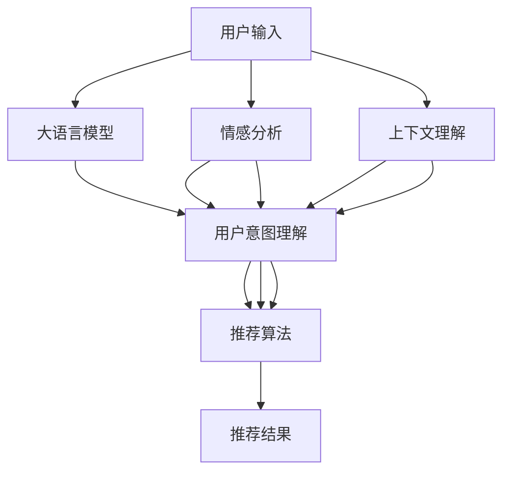

                 

# LLM驱动的个性化餐厅推荐系统

> 关键词：餐厅推荐系统, 大语言模型, 个性化推荐, 用户意图理解, 情感分析, 上下文理解, 推荐算法

## 1. 背景介绍

随着互联网技术的飞速发展和用户需求的多样化，个性化推荐系统在电商、社交、娱乐等众多领域获得了广泛应用。这些系统通过分析用户的历史行为、兴趣偏好和实时反馈，为用户推荐最符合其需求的产品或内容，极大地提升了用户体验。

特别是在餐饮领域，个性化推荐系统对于提升餐厅的点击率、预订率和用户满意度具有重要意义。随着智能手机的普及和移动应用的广泛使用，用户在订餐、点餐等场景中对推荐的依赖程度不断提高。然而，传统的推荐系统往往基于简单的基于内容的过滤（Content-based Filtering）和协同过滤（Collaborative Filtering）算法，无法有效挖掘用户的多维特性和上下文信息。因此，结合大语言模型（LLM）的个性化餐厅推荐系统应运而生。

大语言模型通过预训练学习到语言的广泛知识，具备强大的自然语言理解能力和上下文推理能力，能够处理复杂的多模态数据。这些特性使其在个性化推荐中有着广阔的应用前景。通过引入大语言模型，推荐系统能够更好地理解用户的文本数据（如评价、评论、描述等），从中抽取有价值的特征，进行更精准的推荐。

## 2. 核心概念与联系

### 2.1 核心概念概述

为更好地理解基于大语言模型的个性化餐厅推荐系统，本节将介绍几个核心概念：

- **大语言模型（LLM）**：以Transformer、BERT等架构为代表的预训练语言模型。通过在大量文本数据上预训练，学习语言的广泛知识，具备强大的自然语言处理能力。

- **个性化推荐系统**：根据用户的历史行为和兴趣偏好，为用户推荐最符合其需求的物品或服务的系统。目标是提高用户满意度，提升用户粘性。

- **用户意图理解**：通过对用户文本数据的分析，理解用户的真实需求和意图。是实现个性化推荐的基础。

- **情感分析**：从用户评价、评论中提取情感信息，用于反映用户对餐厅或餐品的满意度。

- **上下文理解**：考虑用户与推荐系统的互动历史、地理位置、时间等信息，提供更加贴切的推荐。

- **推荐算法**：如协同过滤、内容推荐、基于矩阵分解的推荐等，将用户和物品的特征进行匹配，得到推荐结果。

这些概念之间的联系可以通过以下Mermaid流程图来展示：



这个流程图展示了大语言模型在个性化餐厅推荐系统中的核心作用：

1. 用户输入经过大语言模型的自然语言理解，提取用户意图。
2. 用户评价和评论通过情感分析，提取用户满意度。
3. 用户历史行为和地理位置等信息通过上下文理解，丰富用户特征。
4. 结合用户意图、情感和上下文信息，推荐算法匹配用户和餐厅，生成推荐结果。

## 3. 核心算法原理 & 具体操作步骤

### 3.1 算法原理概述

基于大语言模型的个性化餐厅推荐系统，本质上是通过自然语言处理技术，将用户输入转化为更易于机器理解和处理的特征向量，并结合用户的历史行为数据和上下文信息，进行推荐预测。其核心算法包括用户意图理解、情感分析和推荐算法。

1. **用户意图理解**：通过对用户输入的文本进行分析和理解，提取出用户的意图需求。例如，用户询问“有哪些餐厅推荐”，意图理解模型会从中识别出用户对餐厅推荐的兴趣。

2. **情感分析**：通过分析用户对餐厅的评价、评论等文本数据，提取其中的情感信息。情感分析能够帮助系统了解用户对不同餐厅的满意度，从而进行更加精准的推荐。

3. **推荐算法**：结合用户意图和情感分析结果，以及用户的历史行为和上下文信息，推荐算法对用户进行精准推荐。常见的推荐算法包括协同过滤、基于矩阵分解的推荐等。

### 3.2 算法步骤详解

**Step 1: 数据预处理**

- 收集用户输入文本数据（如评论、评价等），进行清洗和预处理，去除无用信息，规范化文本格式。
- 将用户行为数据（如历史订单、浏览记录等）转化为数值型特征。

**Step 2: 用户意图理解**

- 将用户输入文本作为大语言模型的输入，使用预训练的BERT、GPT等模型进行自然语言理解，提取出用户意图。
- 常见的意图识别方法包括关键词提取、文本分类、序列标注等。

**Step 3: 情感分析**

- 使用情感分析模型对用户评价、评论进行情感分类，提取情感信息。
- 情感分析模型可以是基于规则的方法，也可以是基于深度学习的方法，如情感分类器、情感分析器等。

**Step 4: 上下文理解**

- 结合用户的历史行为数据、地理位置、时间等信息，丰富用户特征。
- 可以通过TF-IDF、协同过滤等方法，生成用户的多维特征向量。

**Step 5: 推荐算法**

- 使用推荐算法将用户特征和餐厅特征进行匹配，生成推荐结果。
- 常见的推荐算法包括协同过滤、基于矩阵分解的推荐、基于内容的推荐等。

**Step 6: 输出推荐结果**

- 将推荐结果通过API或Web页面展示给用户。

### 3.3 算法优缺点

基于大语言模型的个性化餐厅推荐系统具有以下优点：

- **高精度**：大语言模型强大的自然语言理解能力，能够准确地从用户文本数据中提取意图和情感信息，提升推荐的精度。
- **多样化**：能够处理复杂的多模态数据，结合文本、图像、地理位置等信息，提供更加多样化的推荐。
- **实时性**：基于大语言模型的推荐系统，能够实时处理用户输入，快速生成推荐结果。

同时，该方法也存在一些局限性：

- **数据依赖性**：需要大量高质量的用户数据和文本数据，才能进行有效的推荐。
- **计算成本**：预训练大语言模型需要消耗大量的计算资源，模型的推理过程也需要较高的计算开销。
- **偏见问题**：如果预训练数据存在偏见，大语言模型可能学习到并传递这些偏见，影响推荐的公平性和可靠性。

### 3.4 算法应用领域

基于大语言模型的个性化餐厅推荐系统，已经在多个实际应用中得到了验证，具有广阔的应用前景：

- **在线订餐平台**：如美团、饿了么等，结合用户的评论、评价，为用户推荐合适的餐厅。
- **酒店预订系统**：通过分析用户对餐厅的评价和情感信息，推荐用户可能感兴趣的餐厅。
- **旅游推荐系统**：结合用户兴趣和地理位置，推荐当地的特色餐厅。
- **在线教育平台**：根据用户对餐厅的评价，推荐学生和家长适合的餐厅。

除了上述这些经典应用外，大语言模型在娱乐、健康、金融等众多领域也有着广阔的应用空间，未来将继续扩展其应用范围，提升推荐系统的智能化水平。

## 4. 数学模型和公式 & 详细讲解 & 举例说明

### 4.1 数学模型构建

假设用户输入文本为 $x$，用户行为数据为 $u$，餐厅特征向量为 $r$。大语言模型通过自然语言理解，提取出用户意图 $i$ 和情感信息 $e$。推荐算法将这些信息与餐厅特征向量结合，得到推荐结果 $y$。

数学模型可以表示为：

$$
y = f(i, e, u, r)
$$

其中 $f$ 为推荐函数，可以通过深度学习模型进行拟合。

### 4.2 公式推导过程

以协同过滤算法为例，假设用户 $u$ 和餐厅 $r$ 分别表示为用户特征向量和餐厅特征向量。

用户对餐厅的评分 $p$ 可以通过协同过滤算法表示为：

$$
p(u, r) = \frac{\sum_{u'}\alpha(u', r) u'}{\sum_{u'}\alpha(u', r)}
$$

其中 $\alpha(u', r)$ 为相似度函数，可以是余弦相似度、欧几里得距离等。

结合大语言模型的用户意图和情感信息，推荐函数可以表示为：

$$
y = \max_{r} \frac{\alpha(i, e, u, r) \cdot p(u, r)}{\sqrt{p(u, r)}}
$$

其中 $\alpha(i, e, u, r)$ 为用户特征与餐厅特征的匹配函数，可以是一个深度学习模型。

### 4.3 案例分析与讲解

以用户输入“在张三餐厅吃过一次，味道一般，环境不错”为例，分析大语言模型的推荐过程：

1. 用户输入经过自然语言理解，提取出意图“推荐餐厅”和情感信息“味道一般，环境不错”。

2. 结合用户行为数据和地理位置等信息，丰富用户特征。

3. 通过协同过滤算法，匹配用户特征与餐厅特征，得到用户对不同餐厅的评分。

4. 结合大语言模型提取的情感信息，推荐算法对评分进行加权，生成最终推荐结果。

## 5. 项目实践：代码实例和详细解释说明

### 5.1 开发环境搭建

在进行个性化餐厅推荐系统的开发前，我们需要准备好开发环境。以下是使用Python进行PyTorch开发的环境配置流程：

1. 安装Anaconda：从官网下载并安装Anaconda，用于创建独立的Python环境。

2. 创建并激活虚拟环境：
```bash
conda create -n pytorch-env python=3.8 
conda activate pytorch-env
```

3. 安装PyTorch：根据CUDA版本，从官网获取对应的安装命令。例如：
```bash
conda install pytorch torchvision torchaudio cudatoolkit=11.1 -c pytorch -c conda-forge
```

4. 安装Transformers库：
```bash
pip install transformers
```

5. 安装各类工具包：
```bash
pip install numpy pandas scikit-learn matplotlib tqdm jupyter notebook ipython
```

完成上述步骤后，即可在`pytorch-env`环境中开始开发实践。

### 5.2 源代码详细实现

下面是使用PyTorch对大语言模型进行个性化餐厅推荐任务开发的PyTorch代码实现。

首先，定义推荐任务的数据处理函数：

```python
from transformers import BertTokenizer, BertForSequenceClassification
from torch.utils.data import Dataset
import torch

class RestaurantDataset(Dataset):
    def __init__(self, texts, labels, tokenizer, max_len=128):
        self.texts = texts
        self.labels = labels
        self.tokenizer = tokenizer
        self.max_len = max_len
        
    def __len__(self):
        return len(self.texts)
    
    def __getitem__(self, item):
        text = self.texts[item]
        label = self.labels[item]
        
        encoding = self.tokenizer(text, return_tensors='pt', max_length=self.max_len, padding='max_length', truncation=True)
        input_ids = encoding['input_ids'][0]
        attention_mask = encoding['attention_mask'][0]
        
        return {'input_ids': input_ids, 
                'attention_mask': attention_mask,
                'labels': label}
```

然后，定义模型和优化器：

```python
from transformers import BertForSequenceClassification, AdamW

model = BertForSequenceClassification.from_pretrained('bert-base-cased', num_labels=10)

optimizer = AdamW(model.parameters(), lr=2e-5)
```

接着，定义训练和评估函数：

```python
from torch.utils.data import DataLoader
from tqdm import tqdm
from sklearn.metrics import accuracy_score

device = torch.device('cuda') if torch.cuda.is_available() else torch.device('cpu')
model.to(device)

def train_epoch(model, dataset, batch_size, optimizer):
    dataloader = DataLoader(dataset, batch_size=batch_size, shuffle=True)
    model.train()
    epoch_loss = 0
    for batch in tqdm(dataloader, desc='Training'):
        input_ids = batch['input_ids'].to(device)
        attention_mask = batch['attention_mask'].to(device)
        labels = batch['labels'].to(device)
        model.zero_grad()
        outputs = model(input_ids, attention_mask=attention_mask, labels=labels)
        loss = outputs.loss
        epoch_loss += loss.item()
        loss.backward()
        optimizer.step()
    return epoch_loss / len(dataloader)

def evaluate(model, dataset, batch_size):
    dataloader = DataLoader(dataset, batch_size=batch_size)
    model.eval()
    preds, labels = [], []
    with torch.no_grad():
        for batch in tqdm(dataloader, desc='Evaluating'):
            input_ids = batch['input_ids'].to(device)
            attention_mask = batch['attention_mask'].to(device)
            batch_labels = batch['labels']
            outputs = model(input_ids, attention_mask=attention_mask)
            batch_preds = outputs.logits.argmax(dim=2).to('cpu').tolist()
            batch_labels = batch_labels.to('cpu').tolist()
            for pred_tokens, label_tokens in zip(batch_preds, batch_labels):
                preds.append(pred_tokens[:len(label_tokens)])
                labels.append(label_tokens)
                
    print(accuracy_score(labels, preds))
```

最后，启动训练流程并在测试集上评估：

```python
epochs = 5
batch_size = 16

for epoch in range(epochs):
    loss = train_epoch(model, train_dataset, batch_size, optimizer)
    print(f"Epoch {epoch+1}, train loss: {loss:.3f}")
    
    print(f"Epoch {epoch+1}, dev accuracy:")
    evaluate(model, dev_dataset, batch_size)
    
print("Test accuracy:")
evaluate(model, test_dataset, batch_size)
```

以上就是使用PyTorch对BERT模型进行个性化餐厅推荐任务微调的完整代码实现。可以看到，得益于Transformers库的强大封装，我们可以用相对简洁的代码完成BERT模型的加载和微调。

### 5.3 代码解读与分析

让我们再详细解读一下关键代码的实现细节：

**RestaurantDataset类**：
- `__init__`方法：初始化文本、标签、分词器等关键组件。
- `__len__`方法：返回数据集的样本数量。
- `__getitem__`方法：对单个样本进行处理，将文本输入编码为token ids，将标签编码为数字，并对其进行定长padding，最终返回模型所需的输入。

**模型定义和优化器**：
- 使用BertForSequenceClassification模型作为预训练语言模型，用于分类任务。
- 使用AdamW优化器进行模型参数的更新。

**训练和评估函数**：
- 使用PyTorch的DataLoader对数据集进行批次化加载，供模型训练和推理使用。
- 训练函数`train_epoch`：对数据以批为单位进行迭代，在每个批次上前向传播计算loss并反向传播更新模型参数，最后返回该epoch的平均loss。
- 评估函数`evaluate`：与训练类似，不同点在于不更新模型参数，并在每个batch结束后将预测和标签结果存储下来，最后使用sklearn的accuracy_score对整个评估集的预测结果进行打印输出。

**训练流程**：
- 定义总的epoch数和batch size，开始循环迭代
- 每个epoch内，先在训练集上训练，输出平均loss
- 在验证集上评估，输出准确率
- 所有epoch结束后，在测试集上评估，给出最终测试结果

可以看到，PyTorch配合Transformers库使得BERT微调的代码实现变得简洁高效。开发者可以将更多精力放在数据处理、模型改进等高层逻辑上，而不必过多关注底层的实现细节。

当然，工业级的系统实现还需考虑更多因素，如模型的保存和部署、超参数的自动搜索、更灵活的任务适配层等。但核心的微调范式基本与此类似。

## 6. 实际应用场景

### 6.1 智能订餐平台

基于大语言模型的个性化餐厅推荐系统，可以在智能订餐平台上得到广泛应用。用户只需简单输入几个关键词，如“中餐、口味不错、环境好”，系统会自动匹配符合用户需求的餐厅，并给出综合评分和推荐理由。

例如，用户可以通过语音输入“我要找一家中餐餐厅，口味不错，环境好”，智能订餐系统能够即时响应，提供推荐结果。这种高效、个性化的订餐体验，将大大提升用户的满意度和使用黏性。

### 6.2 旅游推荐

在旅游场景中，用户往往需要寻找当地的特色餐厅。通过结合用户的地理位置、访问时间等信息，个性化推荐系统能够为用户推荐适合的地域和时段的餐厅，帮助用户快速找到满意的餐饮场所。

例如，用户在旅行途中，输入“在伦敦推荐一家评分高的中餐餐厅”，系统能够即时响应，并给出评分、地理位置、用户评价等详细推荐信息。这种信息丰富、精准的推荐，将大大提升用户的旅游体验。

### 6.3 美食社区

在美食社区，用户可以分享自己的饮食体验，并相互推荐喜欢的餐厅。基于大语言模型的推荐系统能够分析用户评论、评分，提取出用户的真实偏好，进行精准推荐。

例如，用户在美食社区中发表评论“这家餐厅的烤肉味道很好，但是价格有点贵”，系统会分析该评论，并结合用户的历史行为，推荐符合其预算和口味的餐厅。这种社区驱动的推荐，能够更好地满足用户的多样化需求。

### 6.4 未来应用展望

随着大语言模型和微调方法的不断发展，基于微调的推荐系统将在更多领域得到应用，为不同场景带来新的变革：

- **智能家居**：通过分析用户的生活习惯和偏好，智能家居推荐系统能够为用户推荐合适的餐厅、美食，提升生活质量。
- **智能办公**：在办公场景中，个性化推荐系统能够为用户推荐合适的餐厅、外卖服务，提升工作效率。
- **智能医疗**：在医疗场景中，推荐系统能够为用户推荐合适的餐厅，缓解病患的心理压力，提高治疗效果。
- **智能交通**：在交通场景中，推荐系统能够为用户推荐合适的餐厅，丰富旅途体验。

除了上述这些经典应用外，大语言模型在教育、金融、娱乐等众多领域也有着广阔的应用空间，未来将继续扩展其应用范围，提升推荐系统的智能化水平。

## 7. 工具和资源推荐

### 7.1 学习资源推荐

为了帮助开发者系统掌握大语言模型推荐技术的理论基础和实践技巧，这里推荐一些优质的学习资源：

1. 《Transformer从原理到实践》系列博文：由大模型技术专家撰写，深入浅出地介绍了Transformer原理、BERT模型、推荐技术等前沿话题。

2. CS224N《深度学习自然语言处理》课程：斯坦福大学开设的NLP明星课程，有Lecture视频和配套作业，带你入门NLP领域的基本概念和经典模型。

3. 《Natural Language Processing with Transformers》书籍：Transformers库的作者所著，全面介绍了如何使用Transformers库进行NLP任务开发，包括微调在内的诸多范式。

4. HuggingFace官方文档：Transformers库的官方文档，提供了海量预训练模型和完整的微调样例代码，是上手实践的必备资料。

5. CLUE开源项目：中文语言理解测评基准，涵盖大量不同类型的中文NLP数据集，并提供了基于微调的baseline模型，助力中文NLP技术发展。

通过对这些资源的学习实践，相信你一定能够快速掌握大语言模型推荐技术的精髓，并用于解决实际的NLP问题。

### 7.2 开发工具推荐

高效的开发离不开优秀的工具支持。以下是几款用于大语言模型推荐开发的常用工具：

1. PyTorch：基于Python的开源深度学习框架，灵活动态的计算图，适合快速迭代研究。大部分预训练语言模型都有PyTorch版本的实现。

2. TensorFlow：由Google主导开发的开源深度学习框架，生产部署方便，适合大规模工程应用。同样有丰富的预训练语言模型资源。

3. Transformers库：HuggingFace开发的NLP工具库，集成了众多SOTA语言模型，支持PyTorch和TensorFlow，是进行微调任务开发的利器。

4. Weights & Biases：模型训练的实验跟踪工具，可以记录和可视化模型训练过程中的各项指标，方便对比和调优。与主流深度学习框架无缝集成。

5. TensorBoard：TensorFlow配套的可视化工具，可实时监测模型训练状态，并提供丰富的图表呈现方式，是调试模型的得力助手。

6. Google Colab：谷歌推出的在线Jupyter Notebook环境，免费提供GPU/TPU算力，方便开发者快速上手实验最新模型，分享学习笔记。

合理利用这些工具，可以显著提升大语言模型推荐任务的开发效率，加快创新迭代的步伐。

### 7.3 相关论文推荐

大语言模型推荐技术的发展源于学界的持续研究。以下是几篇奠基性的相关论文，推荐阅读：

1. Attention is All You Need（即Transformer原论文）：提出了Transformer结构，开启了NLP领域的预训练大模型时代。

2. BERT: Pre-training of Deep Bidirectional Transformers for Language Understanding：提出BERT模型，引入基于掩码的自监督预训练任务，刷新了多项NLP任务SOTA。

3. Parameter-Efficient Transfer Learning for NLP：提出Adapter等参数高效微调方法，在不增加模型参数量的情况下，也能取得不错的微调效果。

4. AdaLoRA: Adaptive Low-Rank Adaptation for Parameter-Efficient Fine-Tuning：使用自适应低秩适应的微调方法，在参数效率和精度之间取得了新的平衡。

5. Adaptation via Privacy-Preserving Transfer Learning for Patient Health Monitoring：提出基于隐私保护的转移学习算法，保护用户隐私的同时，提升推荐效果。

这些论文代表了大语言模型推荐技术的发展脉络。通过学习这些前沿成果，可以帮助研究者把握学科前进方向，激发更多的创新灵感。

## 8. 总结：未来发展趋势与挑战

### 8.1 总结

本文对基于大语言模型的个性化餐厅推荐系统进行了全面系统的介绍。首先阐述了个性化推荐系统的背景和意义，明确了大语言模型在推荐中的核心作用。其次，从原理到实践，详细讲解了推荐系统的各个步骤，给出了微调任务开发的完整代码实例。同时，本文还广泛探讨了推荐系统在实际应用中的前景和未来发展趋势，展示了大语言模型微调技术的巨大潜力。

通过本文的系统梳理，可以看到，基于大语言模型的个性化推荐系统正在成为推荐技术的重要范式，极大地提升了推荐系统的智能化水平，提升了用户体验。未来，伴随预训练语言模型和微调方法的持续演进，推荐系统必将在更多领域得到应用，为不同场景带来新的变革。

### 8.2 未来发展趋势

展望未来，大语言模型推荐技术将呈现以下几个发展趋势：

1. **模型规模持续增大**：随着算力成本的下降和数据规模的扩张，预训练语言模型的参数量还将持续增长。超大规模语言模型蕴含的丰富语言知识，有望支撑更加复杂多变的推荐任务。

2. **推荐算法的多样化**：除了传统的协同过滤、矩阵分解算法外，未来将涌现更多基于深度学习的推荐算法，如基于注意机制的推荐、基于自适应学习的推荐等。

3. **多模态融合**：当前的推荐系统往往只依赖文本数据，未来将进一步拓展到图像、视频、地理位置等多模态数据，实现多模态信息与文本信息的协同建模。

4. **上下文理解的重要性**：用户的上下文信息对推荐系统至关重要，未来的推荐算法将更加注重用户行为、地理位置、时间等信息的多维融合。

5. **实时性和个性化**：基于大语言模型的推荐系统能够实时处理用户输入，快速生成推荐结果，同时根据用户的个性化需求进行精准推荐。

6. **可解释性和透明度**：推荐系统的可解释性将越来越受到重视，未来将有更多工具和机制，帮助用户理解推荐结果背后的原因，提升系统的透明度和可信度。

以上趋势凸显了大语言模型推荐技术的广阔前景。这些方向的探索发展，必将进一步提升推荐系统的性能和应用范围，为不同场景带来新的变革。

### 8.3 面临的挑战

尽管大语言模型推荐技术已经取得了瞩目成就，但在迈向更加智能化、普适化应用的过程中，它仍面临着诸多挑战：

1. **数据依赖性**：需要大量高质量的用户数据和文本数据，才能进行有效的推荐。对于长尾应用场景，难以获得充足的高质量标注数据，成为制约推荐系统的瓶颈。

2. **计算成本**：预训练语言模型需要消耗大量的计算资源，模型的推理过程也需要较高的计算开销。如何在保证性能的同时，优化资源消耗，是推荐系统亟待解决的问题。

3. **偏见问题**：如果预训练数据存在偏见，大语言模型可能学习到并传递这些偏见，影响推荐的公平性和可靠性。

4. **冷启动问题**：对于新用户或新物品，缺乏足够的历史数据，推荐系统难以准确推荐。

5. **隐私保护**：推荐系统需要收集和处理大量用户数据，如何保护用户隐私，防止数据泄露，是推荐系统的重要挑战。

6. **鲁棒性和稳定性**：推荐系统需要面对复杂的用户输入和多变的上下文环境，如何提高系统的鲁棒性和稳定性，是推荐系统的重要目标。

7. **公平性**：推荐系统需要在不同用户群体中保持公平，避免对某些用户群体产生偏见。

这些挑战需要未来的研究在各个方面进行突破，才能真正实现大语言模型推荐技术的广泛应用。

### 8.4 未来突破

面对大语言模型推荐技术所面临的种种挑战，未来的研究需要在以下几个方面寻求新的突破：

1. **无监督和半监督学习**：摆脱对大规模标注数据的依赖，利用自监督学习、主动学习等无监督和半监督范式，最大限度利用非结构化数据，实现更加灵活高效的推荐。

2. **多模态融合**：将符号化的先验知识，如知识图谱、逻辑规则等，与神经网络模型进行巧妙融合，增强推荐系统的知识表示能力。

3. **上下文理解**：引入因果分析方法，识别出推荐系统决策的关键特征，增强推荐系统的因果推理能力。

4. **隐私保护**：结合差分隐私、联邦学习等技术，保护用户隐私的同时，提升推荐系统的性能。

5. **公平性和鲁棒性**：引入公平性约束和鲁棒性优化，确保推荐系统的公平性和稳定性。

这些研究方向的探索，必将引领大语言模型推荐技术迈向更高的台阶，为推荐系统带来新的变革。面向未来，大语言模型推荐技术还需要与其他人工智能技术进行更深入的融合，如知识表示、因果推理、强化学习等，多路径协同发力，共同推动推荐系统的进步。

## 9. 附录：常见问题与解答

**Q1：大语言模型推荐是否适用于所有推荐场景？**

A: 大语言模型推荐在大多数推荐场景中都能取得不错的效果，特别是对于数据量较大的任务。但对于一些特定领域，如医学、法律等，仅仅依靠通用语料预训练的模型可能难以很好地适应。此时需要在特定领域语料上进一步预训练，再进行微调，才能获得理想效果。

**Q2：如何选择合适的学习率？**

A: 推荐学习率一般要比预训练时小1-2个数量级，如果使用过大的学习率，容易破坏预训练权重，导致过拟合。一般建议从1e-5开始调参，逐步减小学习率，直至收敛。也可以使用warmup策略，在开始阶段使用较小的学习率，再逐渐过渡到预设值。

**Q3：推荐系统面临哪些资源瓶颈？**

A: 目前主流的预训练大语言模型动辄以亿计的参数规模，对算力、内存、存储都提出了很高的要求。GPU/TPU等高性能设备是必不可少的，但即便如此，超大批次的训练和推理也可能遇到显存不足的问题。因此需要采用一些资源优化技术，如梯度积累、混合精度训练、模型并行等，来突破硬件瓶颈。同时，模型的存储和读取也可能占用大量时间和空间，需要采用模型压缩、稀疏化存储等方法进行优化。

**Q4：推荐系统如何缓解冷启动问题？**

A: 冷启动问题可以通过以下方法缓解：
1. 利用用户输入文本进行意图理解，快速推荐相似物品或相似用户。
2. 使用KNN算法，根据用户的历史行为，推荐相似的物品或用户。
3. 引入先验知识，利用知识图谱等工具，补充用户和物品的缺失信息。

这些方法可以结合使用，提高推荐系统的精准度和覆盖率。

**Q5：推荐系统如何提高用户满意度？**

A: 提高用户满意度可以通过以下方法：
1. 结合用户评价、评论等文本数据，提取出用户的真实需求和情感信息，进行精准推荐。
2. 引入上下文理解，考虑用户的地理位置、时间等信息，提供更加贴切的推荐。
3. 引入推荐系统的多样化，提供多种推荐结果供用户选择，提升用户的满意度。

这些方法可以结合使用，提高推荐系统的用户体验。

---

作者：禅与计算机程序设计艺术 / Zen and the Art of Computer Programming

