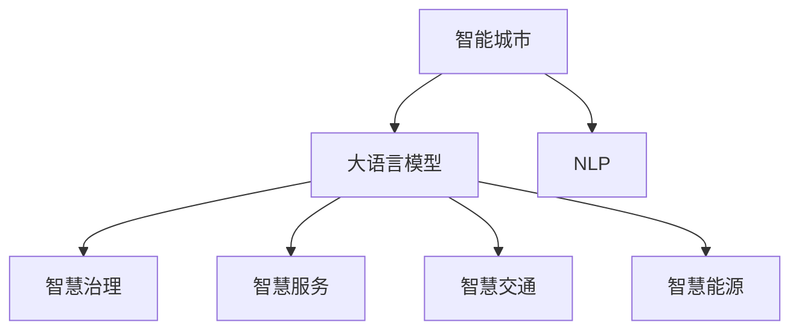

                 

# LLM驱动的智能城市：未来urban planning的新范式

> 关键词：智能城市,大语言模型,自然语言处理(NLP),城市规划,智慧治理,城市管理,物联网(IoT),数据分析,智慧交通,智慧能源

## 1. 背景介绍

### 1.1 问题由来

随着全球城镇化进程的加速，城市面临着交通拥堵、环境污染、资源紧张、公共服务不足等诸多问题。传统的城市规划和管理方式已经难以满足现代城市的发展需求。迫切需要一场数字化、智能化转型，将城市打造为智慧化的有机生命体。

近年来，随着大语言模型（Large Language Model, LLM）技术的发展，其强大的自然语言处理（Natural Language Processing, NLP）能力为智能城市的建设提供了全新的视角。通过将大语言模型应用于城市规划、管理、服务等多个领域，可以大幅提升城市治理的效率和智能化水平。

### 1.2 问题核心关键点

大语言模型在智能城市中的应用，主要体现在以下几个方面：

- 城市规划：通过分析历史数据和实时数据，大语言模型能够辅助城市规划师进行决策，优化土地利用和基础设施建设。
- 智慧治理：利用大语言模型对海量数据进行分析和处理，提升公共安全、公共卫生等方面的治理能力。
- 智慧服务：基于自然语言理解，大语言模型可以构建智能客服、智能导引、智能问答等服务，提升市民的体验和满意度。
- 智慧交通：通过大语言模型对交通流量进行预测和优化，实现交通管理的智能化和精细化。
- 智慧能源：利用大语言模型对能源消耗进行分析和预测，优化能源分配和利用。

大语言模型的强大能力，使其成为未来智能城市建设的重要驱动力。但如何在大规模数据中提取有效信息，如何在大语言模型中实现多领域的协同应用，是大语言模型在智能城市应用中需要解决的关键问题。

## 2. 核心概念与联系

### 2.1 核心概念概述

为更好地理解基于大语言模型构建智能城市的过程，本节将介绍几个密切相关的核心概念：

- 智能城市：通过信息技术将城市各方面进行数字化、网络化、智能化升级，实现高效、可持续、智能化的城市管理。
- 大语言模型：基于深度学习技术训练出的海量语料库，具备强大的自然语言处理能力，能够理解和生成人类语言。
- 自然语言处理（NLP）：计算机对人类语言的处理和理解，包括分词、语法分析、语义理解、机器翻译等。
- 智慧治理：利用信息技术提升公共安全、公共卫生、城市环境等方面的治理能力，实现智能化、精细化的管理。
- 智慧服务：基于人工智能技术，构建智能客服、智能导引、智能问答等服务，提升市民的体验和满意度。
- 智慧交通：通过大数据、物联网、人工智能等技术，对交通流量进行预测和优化，实现交通管理的智能化和精细化。
- 智慧能源：利用大数据、人工智能等技术，对能源消耗进行分析和预测，优化能源分配和利用。

这些概念之间的逻辑关系可以通过以下Mermaid流程图来展示：



这个流程图展示了大语言模型在智能城市建设中的核心作用，以及与各子领域的关系：

1. 大语言模型通过NLP技术对各类城市数据进行处理和分析，辅助智慧治理、智慧服务、智慧交通、智慧能源等领域的应用。
2. 智慧治理、智慧服务、智慧交通、智慧能源等领域的应用，是大语言模型在智能城市中的具体落地场景，体现了大语言模型在城市管理中的应用价值。
3. 通过大语言模型的驱动，智能城市能够实现高效、智能、可持续的运行。

## 3. 核心算法原理 & 具体操作步骤
### 3.1 算法原理概述

基于大语言模型构建智能城市，本质上是一个多领域的协同优化过程。其核心思想是：利用大语言模型强大的NLP能力，对海量城市数据进行分析和处理，辅助城市规划、管理、服务等多个领域的决策和执行。

具体来说，大语言模型通过以下几个步骤实现其在智能城市中的应用：

1. **数据采集与预处理**：从城市各类传感器、监控摄像头、公共数据库等渠道，采集各类城市数据，并进行清洗和预处理，形成结构化数据集。
2. **模型训练与微调**：使用大语言模型对结构化数据集进行训练，并通过微调优化模型在特定任务上的性能。
3. **任务执行与反馈**：将训练好的模型应用于城市规划、管理、服务等领域，进行任务执行，同时收集反馈数据，进一步优化模型和算法。
4. **系统集成与优化**：将各领域的应用模型集成到一个统一的智能城市平台上，通过数据共享和协同优化，提升整体系统的运行效率和智能化水平。

### 3.2 算法步骤详解

基于大语言模型构建智能城市的一般流程如下：

**Step 1: 数据采集与预处理**

- 使用各类传感器、监控摄像头等设备，采集城市基础设施、交通流量、环境监测等数据。
- 对采集到的数据进行清洗、去重、归一化等预处理操作，形成结构化数据集。
- 将数据集分为训练集、验证集和测试集，以便后续的模型训练和性能评估。

**Step 2: 模型训练与微调**

- 选择合适的预训练语言模型，如BERT、GPT等，作为初始化参数。
- 设计合适的任务适配层，如分类器、生成器等，适配城市规划、管理、服务等不同领域的任务。
- 设置微调超参数，如学习率、批大小、迭代轮数等。
- 使用训练集对模型进行微调，最小化损失函数，优化模型性能。
- 在验证集上评估模型性能，根据性能指标调整模型参数，避免过拟合。

**Step 3: 任务执行与反馈**

- 将微调后的模型应用于城市规划、管理、服务等领域，进行任务执行。
- 收集模型执行结果和用户反馈数据，进行数据增强和模型优化。
- 实时监测模型执行效果，根据反馈数据动态调整模型参数和策略。

**Step 4: 系统集成与优化**

- 将各领域的应用模型集成到一个统一的智能城市平台上，实现数据共享和协同优化。
- 利用大数据分析技术，对各领域数据进行融合和挖掘，提升城市治理的决策能力。
- 通过物联网技术，实现城市基础设施、交通系统、环境监测等领域的实时监控和控制。
- 构建智能城市操作系统，实现跨领域的数据流动和协同，提升城市管理的智能化水平。

### 3.3 算法优缺点

基于大语言模型构建智能城市的方法具有以下优点：

1. **高效处理海量数据**：大语言模型具备强大的NLP能力，能够高效处理海量城市数据，辅助城市治理决策。
2. **多领域协同优化**：通过模型训练和微调，实现城市规划、管理、服务等多领域的协同优化，提升整体系统的智能化水平。
3. **实时监测与反馈**：利用物联网技术实现城市基础设施、交通系统、环境监测等领域的实时监测和控制，提升城市管理的及时性和准确性。
4. **灵活应对变化**：大语言模型具备较强的自适应能力，能够灵活应对城市数据分布的变化，保持系统的稳定性。

但该方法也存在一定的局限性：

1. **数据质量要求高**：模型训练和微调依赖高质量的数据集，城市数据的质量和完整性对模型的性能有较大影响。
2. **资源消耗大**：大语言模型需要大量的计算资源和存储空间，大规模数据集的处理和存储对资源需求较高。
3. **模型复杂度高**：大语言模型结构复杂，对模型的训练和微调需要较高的技术门槛。
4. **安全性问题**：城市数据涉及公共安全，大语言模型的应用需要严格的隐私保护和安全性控制。

尽管存在这些局限性，但就目前而言，基于大语言模型构建智能城市的方法仍是最主流的技术范式。未来相关研究的重点在于如何进一步降低对数据质量的要求，提高模型的资源效率，同时兼顾可解释性和安全性等因素。

### 3.4 算法应用领域

基于大语言模型构建智能城市的方法，在城市规划、管理、服务等多个领域均有广泛应用：

- 城市规划：利用大语言模型对历史数据和实时数据进行分析，辅助城市规划师进行决策，优化土地利用和基础设施建设。
- 智慧治理：利用大语言模型对海量城市数据进行分析和处理，提升公共安全、公共卫生等方面的治理能力。
- 智慧服务：基于自然语言理解，大语言模型可以构建智能客服、智能导引、智能问答等服务，提升市民的体验和满意度。
- 智慧交通：通过大语言模型对交通流量进行预测和优化，实现交通管理的智能化和精细化。
- 智慧能源：利用大语言模型对能源消耗进行分析和预测，优化能源分配和利用。

除了上述这些经典领域外，大语言模型还被创新性地应用到更多场景中，如可控城市环境、城市应急管理、智慧农业等，为智能城市建设提供了新的技术路径。

## 4. 数学模型和公式 & 详细讲解 & 举例说明

### 4.1 数学模型构建

本节将使用数学语言对基于大语言模型构建智能城市的过程进行更加严格的刻画。

记城市数据集为 $D=\{(x_i, y_i)\}_{i=1}^N, x_i \in \mathbb{R}^d, y_i \in \mathbb{R}^k$，其中 $x_i$ 为城市数据样本，$y_i$ 为对应的标签向量。

定义大语言模型为 $M_{\theta}:\mathbb{R}^d \rightarrow \mathbb{R}^k$，其中 $\theta$ 为模型参数。

模型的损失函数定义为：

$$
\mathcal{L}(\theta) = \frac{1}{N}\sum_{i=1}^N \|M_{\theta}(x_i) - y_i\|^2
$$

其中 $\|\cdot\|$ 表示向量范数。

模型的优化目标是最小化损失函数，即：

$$
\theta^* = \mathop{\arg\min}_{\theta} \mathcal{L}(\theta)
$$

在实践中，我们通常使用梯度下降等优化算法来近似求解上述最优化问题。设 $\eta$ 为学习率，$\nabla_{\theta}\mathcal{L}(\theta)$ 为损失函数对参数 $\theta$ 的梯度，则参数的更新公式为：

$$
\theta \leftarrow \theta - \eta \nabla_{\theta}\mathcal{L}(\theta)
$$

其中 $\nabla_{\theta}\mathcal{L}(\theta)$ 可进一步递归展开，利用自动微分技术完成计算。

### 4.2 公式推导过程

以下我们以智慧交通系统为例，推导基于大语言模型的交通流量预测模型。

假设交通流量数据集为 $D=\{(x_i,y_i)\}_{i=1}^N, x_i \in \mathbb{R}^d, y_i \in \mathbb{R}$，其中 $x_i$ 为交通流量数据样本，$y_i$ 为对应的标签值。

定义大语言模型为 $M_{\theta}:\mathbb{R}^d \rightarrow \mathbb{R}$，其中 $\theta$ 为模型参数。

模型的损失函数定义为：

$$
\mathcal{L}(\theta) = \frac{1}{N}\sum_{i=1}^N (y_i - M_{\theta}(x_i))^2
$$

其梯度为：

$$
\nabla_{\theta}\mathcal{L}(\theta) = \frac{2}{N}\sum_{i=1}^N (y_i - M_{\theta}(x_i))\nabla_{\theta}M_{\theta}(x_i)
$$

通过反向传播算法，可以得到模型参数的更新公式：

$$
\theta \leftarrow \theta - \eta \nabla_{\theta}\mathcal{L}(\theta)
$$

在得到损失函数的梯度后，即可带入参数更新公式，完成模型的迭代优化。重复上述过程直至收敛，最终得到适应智慧交通系统的最优模型参数 $\theta^*$。

## 5. 项目实践：代码实例和详细解释说明

### 5.1 开发环境搭建

在进行智能城市微调实践前，我们需要准备好开发环境。以下是使用Python进行PyTorch开发的环境配置流程：

1. 安装Anaconda：从官网下载并安装Anaconda，用于创建独立的Python环境。

2. 创建并激活虚拟环境：
```bash
conda create -n pytorch-env python=3.8 
conda activate pytorch-env
```

3. 安装PyTorch：根据CUDA版本，从官网获取对应的安装命令。例如：
```bash
conda install pytorch torchvision torchaudio cudatoolkit=11.1 -c pytorch -c conda-forge
```

4. 安装Transformers库：
```bash
pip install transformers
```

5. 安装各类工具包：
```bash
pip install numpy pandas scikit-learn matplotlib tqdm jupyter notebook ipython
```

完成上述步骤后，即可在`pytorch-env`环境中开始微调实践。

### 5.2 源代码详细实现

这里我们以智慧交通系统的交通流量预测为例，给出使用Transformers库对BERT模型进行微调的PyTorch代码实现。

首先，定义交通流量预测任务的数据处理函数：

```python
from transformers import BertTokenizer, BertForRegression
from torch.utils.data import Dataset
import torch

class TrafficFlowDataset(Dataset):
    def __init__(self, texts, targets, tokenizer, max_len=128):
        self.texts = texts
        self.targets = targets
        self.tokenizer = tokenizer
        self.max_len = max_len
        
    def __len__(self):
        return len(self.texts)
    
    def __getitem__(self, item):
        text = self.texts[item]
        target = self.targets[item]
        
        encoding = self.tokenizer(text, return_tensors='pt', max_length=self.max_len, padding='max_length', truncation=True)
        input_ids = encoding['input_ids'][0]
        attention_mask = encoding['attention_mask'][0]
        
        # 将目标值转化为tensor
        target = torch.tensor(target, dtype=torch.float32)
        
        return {'input_ids': input_ids, 
                'attention_mask': attention_mask,
                'targets': target}

# 加载BERT模型和分词器
model = BertForRegression.from_pretrained('bert-base-cased')
tokenizer = BertTokenizer.from_pretrained('bert-base-cased')

# 创建dataset
train_dataset = TrafficFlowDataset(train_texts, train_targets, tokenizer)
dev_dataset = TrafficFlowDataset(dev_texts, dev_targets, tokenizer)
test_dataset = TrafficFlowDataset(test_texts, test_targets, tokenizer)
```

然后，定义模型和优化器：

```python
from transformers import AdamW

optimizer = AdamW(model.parameters(), lr=2e-5)
```

接着，定义训练和评估函数：

```python
from torch.utils.data import DataLoader
from tqdm import tqdm
from sklearn.metrics import mean_squared_error

device = torch.device('cuda') if torch.cuda.is_available() else torch.device('cpu')
model.to(device)

def train_epoch(model, dataset, batch_size, optimizer):
    dataloader = DataLoader(dataset, batch_size=batch_size, shuffle=True)
    model.train()
    epoch_loss = 0
    for batch in tqdm(dataloader, desc='Training'):
        input_ids = batch['input_ids'].to(device)
        attention_mask = batch['attention_mask'].to(device)
        targets = batch['targets'].to(device)
        model.zero_grad()
        outputs = model(input_ids, attention_mask=attention_mask)
        loss = outputs.loss
        epoch_loss += loss.item()
        loss.backward()
        optimizer.step()
    return epoch_loss / len(dataloader)

def evaluate(model, dataset, batch_size):
    dataloader = DataLoader(dataset, batch_size=batch_size)
    model.eval()
    mse = 0
    for batch in tqdm(dataloader, desc='Evaluating'):
        input_ids = batch['input_ids'].to(device)
        attention_mask = batch['attention_mask'].to(device)
        targets = batch['targets'].to(device)
        outputs = model(input_ids, attention_mask=attention_mask)
        targets = targets.to('cpu').numpy()
        outputs = outputs.logits.argmax(dim=1).to('cpu').numpy()
        mse += mean_squared_error(targets, outputs)
        
    print(f'Mean Squared Error: {mse / len(dataset)}')
```

最后，启动训练流程并在测试集上评估：

```python
epochs = 5
batch_size = 16

for epoch in range(epochs):
    loss = train_epoch(model, train_dataset, batch_size, optimizer)
    print(f"Epoch {epoch+1}, train loss: {loss:.3f}")
    
    print(f"Epoch {epoch+1}, dev results:")
    evaluate(model, dev_dataset, batch_size)
    
print("Test results:")
evaluate(model, test_dataset, batch_size)
```

以上就是使用PyTorch对BERT进行交通流量预测任务的微调的完整代码实现。可以看到，得益于Transformers库的强大封装，我们可以用相对简洁的代码完成BERT模型的加载和微调。

### 5.3 代码解读与分析

让我们再详细解读一下关键代码的实现细节：

**TrafficFlowDataset类**：
- `__init__`方法：初始化文本、标签、分词器等关键组件。
- `__len__`方法：返回数据集的样本数量。
- `__getitem__`方法：对单个样本进行处理，将文本输入编码为token ids，将标签转化为tensor，并对其进行定长padding，最终返回模型所需的输入。

**mse变量**：
- 用于计算模型在验证集和测试集上的均方误差，衡量模型预测的准确度。

**训练和评估函数**：
- 使用PyTorch的DataLoader对数据集进行批次化加载，供模型训练和推理使用。
- 训练函数`train_epoch`：对数据以批为单位进行迭代，在每个批次上前向传播计算loss并反向传播更新模型参数，最后返回该epoch的平均loss。
- 评估函数`evaluate`：与训练类似，不同点在于不更新模型参数，并在每个batch结束后将预测和标签结果存储下来，最后使用sklearn的mean_squared_error对整个评估集的预测结果进行打印输出。

**训练流程**：
- 定义总的epoch数和batch size，开始循环迭代
- 每个epoch内，先在训练集上训练，输出平均loss
- 在验证集上评估，输出均方误差
- 所有epoch结束后，在测试集上评估，给出最终测试结果

可以看到，PyTorch配合Transformers库使得BERT微调的代码实现变得简洁高效。开发者可以将更多精力放在数据处理、模型改进等高层逻辑上，而不必过多关注底层的实现细节。

当然，工业级的系统实现还需考虑更多因素，如模型的保存和部署、超参数的自动搜索、更灵活的任务适配层等。但核心的微调范式基本与此类似。

## 6. 实际应用场景
### 6.1 智能交通系统

智能交通系统是智慧城市的重要组成部分，利用大语言模型可以实现交通流量的实时预测和优化，提升城市交通的管理效率。

具体而言，大语言模型可以通过对历史交通数据和实时监测数据的分析，预测未来交通流量变化趋势，辅助交通管理部门进行路网优化。例如，在某个交叉口，模型可以预测到某个时间段内的车流量增长趋势，系统则提前调整信号灯配时，减少拥堵。此外，模型还可以对交通事故、道路施工等异常事件进行监测和预警，提升交通安全性。

### 6.2 智慧能源系统

智慧能源系统通过大语言模型对能源消耗进行分析和预测，优化能源分配和利用，实现节能减排和能源管理的智能化。

例如，模型可以分析城市的用电量、用水量、燃气量等数据，预测未来的能源需求，并根据需求优化能源分配。系统可以根据需求，自动调整电网负荷、水网流量等，减少能源浪费，提升能源使用效率。此外，模型还可以对可再生能源进行智能调度，提升可再生能源在能源结构中的比例，降低碳排放。

### 6.3 智慧环保系统

智慧环保系统利用大语言模型对城市环境数据进行分析，实时监测和预测环境污染状况，提升环境治理的智能化水平。

例如，模型可以分析空气质量监测数据、水质监测数据、垃圾处理数据等，预测未来的环境污染趋势，并提出治理建议。系统可以根据污染预测结果，自动调整污水处理厂、垃圾处理厂等的运行策略，减少环境污染。此外，模型还可以对公众环境投诉进行智能分析，提升环境投诉的响应效率和处理效果。

### 6.4 未来应用展望

随着大语言模型和智能城市技术的发展，未来基于大语言模型构建的智能城市将具有更加广阔的应用前景：

1. **全域数据融合**：大语言模型可以将城市各类数据进行融合分析，提升城市治理的决策能力。例如，交通数据、环境数据、经济数据等融合分析，可以提升城市智慧治理的水平。
2. **多领域协同优化**：基于大语言模型，可以实现城市规划、智慧交通、智慧能源等多个领域的协同优化，提升城市管理效率和智能化水平。
3. **实时数据监测**：大语言模型可以实现对城市基础设施、交通系统、环境监测等领域的实时监测和控制，提升城市管理的及时性和准确性。
4. **智慧服务深化**：基于大语言模型，可以实现更加智能、个性化的智慧服务，提升市民的体验和满意度。例如，智能客服、智能导引、智能问答等。
5. **知识图谱应用**：大语言模型可以将城市各类数据进行知识图谱构建，提升城市治理的智能化水平。例如，构建城市基础设施知识图谱、城市交通知识图谱等。

## 7. 工具和资源推荐
### 7.1 学习资源推荐

为了帮助开发者系统掌握大语言模型在智能城市中的应用，这里推荐一些优质的学习资源：

1. 《Transformer从原理到实践》系列博文：由大模型技术专家撰写，深入浅出地介绍了Transformer原理、BERT模型、智能城市构建等前沿话题。

2. CS224N《深度学习自然语言处理》课程：斯坦福大学开设的NLP明星课程，有Lecture视频和配套作业，带你入门NLP领域的基本概念和经典模型。

3. 《Natural Language Processing with Transformers》书籍：Transformers库的作者所著，全面介绍了如何使用Transformers库进行NLP任务开发，包括智能城市构建在内的诸多范式。

4. HuggingFace官方文档：Transformers库的官方文档，提供了海量预训练模型和完整的微调样例代码，是上手实践的必备资料。

5. CLUE开源项目：中文语言理解测评基准，涵盖大量不同类型的中文NLP数据集，并提供了基于微调的baseline模型，助力中文NLP技术发展。

通过对这些资源的学习实践，相信你一定能够快速掌握大语言模型在智能城市中的应用，并用于解决实际的NLP问题。
### 7.2 开发工具推荐

高效的开发离不开优秀的工具支持。以下是几款用于智能城市微调开发的常用工具：

1. PyTorch：基于Python的开源深度学习框架，灵活动态的计算图，适合快速迭代研究。大部分预训练语言模型都有PyTorch版本的实现。

2. TensorFlow：由Google主导开发的开源深度学习框架，生产部署方便，适合大规模工程应用。同样有丰富的预训练语言模型资源。

3. Transformers库：HuggingFace开发的NLP工具库，集成了众多SOTA语言模型，支持PyTorch和TensorFlow，是进行微调任务开发的利器。

4. Weights & Biases：模型训练的实验跟踪工具，可以记录和可视化模型训练过程中的各项指标，方便对比和调优。与主流深度学习框架无缝集成。

5. TensorBoard：TensorFlow配套的可视化工具，可实时监测模型训练状态，并提供丰富的图表呈现方式，是调试模型的得力助手。

6. Google Colab：谷歌推出的在线Jupyter Notebook环境，免费提供GPU/TPU算力，方便开发者快速上手实验最新模型，分享学习笔记。

合理利用这些工具，可以显著提升智能城市微调任务的开发效率，加快创新迭代的步伐。

### 7.3 相关论文推荐

大语言模型和智能城市构建的研究源于学界的持续研究。以下是几篇奠基性的相关论文，推荐阅读：

1. Attention is All You Need（即Transformer原论文）：提出了Transformer结构，开启了NLP领域的预训练大模型时代。

2. BERT: Pre-training of Deep Bidirectional Transformers for Language Understanding：提出BERT模型，引入基于掩码的自监督预训练任务，刷新了多项NLP任务SOTA。

3. Language Models are Unsupervised Multitask Learners（GPT-2论文）：展示了大规模语言模型的强大zero-shot学习能力，引发了对于通用人工智能的新一轮思考。

4. Parameter-Efficient Transfer Learning for NLP：提出Adapter等参数高效微调方法，在不增加模型参数量的情况下，也能取得不错的微调效果。

5. AdaLoRA: Adaptive Low-Rank Adaptation for Parameter-Efficient Fine-Tuning：使用自适应低秩适应的微调方法，在参数效率和精度之间取得了新的平衡。

这些论文代表了大语言模型在智能城市构建的研究脉络。通过学习这些前沿成果，可以帮助研究者把握学科前进方向，激发更多的创新灵感。

## 8. 总结：未来发展趋势与挑战

### 8.1 总结

本文对基于大语言模型构建智能城市的过程进行了全面系统的介绍。首先阐述了大语言模型和智能城市的研究背景和意义，明确了智能城市应用大语言模型的独特价值。其次，从原理到实践，详细讲解了基于大语言模型构建智能城市的方法，包括数据采集、模型训练、任务执行和系统优化等关键步骤。同时，本文还广泛探讨了大语言模型在智能城市应用中面临的挑战，并提出了未来的研究方向。

通过本文的系统梳理，可以看到，基于大语言模型构建智能城市的技术手段已经初现雏形，具备高效处理海量数据、多领域协同优化等诸多优势。未来，随着技术的进一步成熟和应用场景的不断拓展，基于大语言模型构建智能城市必将开启新的篇章。

### 8.2 未来发展趋势

展望未来，大语言模型在智能城市构建中将呈现以下几个发展趋势：

1. **多模态融合**：未来的智能城市构建将突破单模态数据的局限，实现视觉、语音、文本等多模态数据的融合。例如，将城市监控摄像头获取的图像数据与大语言模型结合起来，可以实现更加智能的视频监控分析。
2. **实时协同优化**：未来的智能城市构建将实现跨领域数据的实时共享和协同优化。例如，将交通数据、环境数据、能源数据等进行实时融合分析，提升城市治理的决策能力。
3. **深度学习与AI结合**：未来的智能城市构建将深度学习与人工智能技术相结合，提升系统的智能化水平。例如，将深度学习与强化学习、因果推理等技术结合，实现更智能的决策和优化。
4. **知识图谱构建**：未来的智能城市构建将利用大语言模型构建知识图谱，提升城市治理的智能化水平。例如，构建城市基础设施知识图谱、城市交通知识图谱等，实现更智能的城市规划和管理。
5. **伦理与安全**：未来的智能城市构建将更加注重伦理与安全问题。例如，如何保护城市数据的隐私和安全，如何设计公平、透明的决策算法，如何避免算法偏见等，都是未来的研究方向。

以上趋势凸显了大语言模型在智能城市构建中的广阔前景。这些方向的探索发展，必将进一步提升智能城市的智能化水平，为智慧城市建设注入新的动力。

### 8.3 面临的挑战

尽管大语言模型在智能城市构建中具有巨大的潜力，但在实现过程中仍面临诸多挑战：

1. **数据质量要求高**：城市数据的质量和完整性对模型的性能有较大影响，如何获取高质量、高完整性的城市数据，是实现智能城市构建的前提。
2. **计算资源消耗大**：大语言模型需要大量的计算资源和存储空间，大规模数据集的处理和存储对资源需求较高，如何优化模型结构和计算效率，是实现智能城市构建的关键。
3. **模型复杂度高**：大语言模型结构复杂，对模型的训练和微调需要较高的技术门槛，如何简化模型结构，降低模型复杂度，是实现智能城市构建的技术难点。
4. **伦理与安全问题**：智能城市构建涉及大量公共数据和关键决策，如何保护数据隐私和安全，如何设计公平、透明的决策算法，如何避免算法偏见，是实现智能城市构建的伦理和社会挑战。

尽管存在这些挑战，但大语言模型在智能城市构建中的应用前景仍然广阔。未来相关研究的重点在于如何进一步降低对数据质量的要求，提高模型的资源效率，同时兼顾可解释性和安全性等因素。

### 8.4 研究展望

面对大语言模型在智能城市构建中所面临的挑战，未来的研究需要在以下几个方面寻求新的突破：

1. **数据增强与数据清洗**：采用数据增强技术，提升城市数据的丰富性和多样性，同时利用数据清洗技术，去除噪声数据和异常数据，提升模型的泛化能力和鲁棒性。
2. **模型压缩与剪枝**：采用模型压缩与剪枝技术，优化大语言模型的结构，降低计算资源消耗，提升模型的实时性和可部署性。
3. **多模态融合与跨模态学习**：研究多模态数据融合和跨模态学习技术，提升智能城市构建的智能化水平和决策能力。
4. **知识图谱构建与应用**：利用大语言模型构建城市知识图谱，提升城市治理的智能化水平，实现更加智能的城市规划和管理。
5. **伦理与社会研究**：研究智能城市构建中的伦理与社会问题，确保数据隐私和安全，设计公平、透明的决策算法，避免算法偏见。

这些研究方向的探索，必将进一步推动智能城市构建的智能化和可持续发展，为构建智能、智慧、安全的未来城市贡献力量。

## 9. 附录：常见问题与解答

**Q1：智能城市构建中，大语言模型如何处理大规模城市数据？**

A: 大语言模型处理大规模城市数据，主要通过以下几个步骤：

1. **数据采集与预处理**：使用各类传感器、监控摄像头等设备，采集城市基础设施、交通流量、环境监测等数据。对采集到的数据进行清洗、去重、归一化等预处理操作，形成结构化数据集。
2. **模型训练与微调**：选择合适的预训练语言模型，如BERT、GPT等，作为初始化参数。设计合适的任务适配层，如分类器、生成器等，适配城市规划、管理、服务等不同领域的任务。设置微调超参数，如学习率、批大小、迭代轮数等。使用训练集对模型进行微调，最小化损失函数，优化模型性能。
3. **任务执行与反馈**：将微调后的模型应用于城市规划、管理、服务等领域，进行任务执行。收集模型执行结果和用户反馈数据，进行数据增强和模型优化。实时监测模型执行效果，根据反馈数据动态调整模型参数和策略。
4. **系统集成与优化**：将各领域的应用模型集成到一个统一的智能城市平台上，实现数据共享和协同优化。利用大数据分析技术，对各领域数据进行融合和挖掘，提升城市治理的决策能力。通过物联网技术，实现城市基础设施、交通系统、环境监测等领域的实时监控和控制。构建智能城市操作系统，实现跨领域的数据流动和协同，提升城市管理的智能化水平。

**Q2：智能城市构建中，大语言模型的计算资源消耗如何优化？**

A: 大语言模型在智能城市构建中，需要大量的计算资源和存储空间，如何优化计算资源消耗，是实现智能城市构建的关键。以下是一些优化策略：

1. **模型压缩与剪枝**：采用模型压缩与剪枝技术，优化大语言模型的结构，降低计算资源消耗，提升模型的实时性和可部署性。例如，使用知识蒸馏技术，将大模型压缩为小模型，保留关键特征，提高模型的推理速度。
2. **分布式计算**：利用分布式计算技术，将模型训练任务分散到多台机器上并行计算，提高计算效率。例如，使用Hadoop、Spark等分布式计算框架，实现大规模模型的并行训练。
3. **混合精度训练**：采用混合精度训练技术，将部分参数转化为低精度表示，减少计算资源消耗，提高计算效率。例如，使用16位精度表示模型参数，降低计算资源消耗，提高训练速度。
4. **量化加速**：将浮点模型转化为定点模型，压缩存储空间，提高计算效率。例如，使用整数型量化技术，将模型参数转化为整数表示，降低内存占用，提高推理速度。
5. **优化器优化**：采用更加高效的优化器，提高模型的训练效率。例如，使用AdamW、Adafactor等优化器，加速模型训练过程。

**Q3：智能城市构建中，大语言模型的伦理与安全问题如何解决？**

A: 智能城市构建中，大语言模型涉及大量公共数据和关键决策，如何保护数据隐私和安全，如何设计公平、透明的决策算法，如何避免算法偏见，是实现智能城市构建的伦理和社会挑战。以下是一些解决策略：

1. **数据隐私保护**：采用数据匿名化和去标识化技术，保护用户隐私。例如，使用差分隐私技术，在数据发布前对数据进行噪声注入，保护用户隐私。
2. **模型公平性**：设计公平、透明的决策算法，避免算法偏见。例如，使用公平性约束技术，确保模型对不同群体的预测结果公平。
3. **模型鲁棒性**：提高模型的鲁棒性和泛化能力，避免模型过拟合和泛化不足。例如，使用正则化技术，避免模型过拟合。
4. **安全与可靠性**：建立模型的安全性和可靠性保障机制，确保模型输出可信。例如，使用对抗样本检测技术，检测模型的鲁棒性和安全性。

**Q4：智能城市构建中，如何设计公平、透明的决策算法？**

A: 在智能城市构建中，设计公平、透明的决策算法是确保模型可信和用户满意的关键。以下是一些设计策略：

1. **透明性设计**：将决策过程和依据公开透明，让用户了解模型的工作原理和决策逻辑。例如，使用可解释性技术，解释模型的预测结果和决策依据。
2. **公平性设计**：确保模型对不同群体的预测结果公平。例如，使用公平性约束技术，确保模型对不同群体的预测结果一致。
3. **可解释性设计**：设计可解释性的决策算法，确保模型的决策过程透明、可理解。例如，使用可解释性技术，解释模型的预测结果和决策依据。
4. **用户参与设计**：在设计决策算法时，考虑用户反馈和需求，确保模型符合用户预期。例如，使用用户参与设计技术，确保模型符合用户需求。

**Q5：智能城市构建中，如何实现跨领域数据的实时共享与协同？**

A: 在智能城市构建中，实现跨领域数据的实时共享和协同是提升城市治理决策能力的关键。以下是一些实现策略：

1. **数据标准化**：采用数据标准化技术，确保不同领域的数据格式一致，便于数据的共享和集成。例如，使用数据标准化技术，统一城市基础设施、交通系统、环境监测等数据格式。
2. **数据融合与分析**：利用大数据分析技术，对不同领域的数据进行融合和分析，提升城市治理的决策能力。例如，将交通数据、环境数据、能源数据等进行实时融合分析，提升城市治理的决策能力。
3. **实时数据共享**：采用实时数据共享技术，实现不同领域数据的实时共享。例如，使用数据共享技术，实现城市基础设施、交通系统、环境监测等数据的实时共享。
4. **协同优化设计**：设计协同优化算法，实现不同领域数据的协同优化。例如，使用协同优化算法，实现交通流量、能源消耗、环境监测等数据的协同优化。

**Q6：智能城市构建中，如何确保模型的稳定性和可靠性？**

A: 在智能城市构建中，确保模型的稳定性和可靠性是实现智能城市构建的基石。以下是一些实现策略：

1. **模型鲁棒性**：提高模型的鲁棒性和泛化能力，避免模型过拟合和泛化不足。例如，使用正则化技术，避免模型过拟合。
2. **模型可靠性**：设计可靠性保障机制，确保模型输出可信。例如，使用对抗样本检测技术，检测模型的鲁棒性和安全性。
3. **模型验证**：在模型发布前进行充分验证，确保模型性能稳定可靠。例如，使用模型验证技术，验证模型的预测结果和决策依据。
4. **模型监控与维护**：建立模型的监控与维护机制，及时发现和解决模型问题。例如，使用模型监控技术，实时监测模型性能，及时发现和解决模型问题。

---

作者：禅与计算机程序设计艺术 / Zen and the Art of Computer Programming

