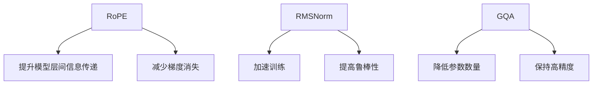

                 

# Llama模型创新：RoPE、RMSNorm和GQA技术

在深度学习模型发展的历程中，模型结构和算法的创新无疑是推动技术前进的重要力量。本文将深入探讨Llama模型中的RoPE、RMSNorm和GQA技术，详细阐述其原理、实现细节及其在模型性能提升和计算效率优化方面的贡献，为读者提供一份全面而深刻的理解。

## 1. 背景介绍

### 1.1 问题由来

近年来，深度学习模型在自然语言处理、计算机视觉、语音识别等领域的表现愈发卓越，但随之而来的，是大模型在计算资源、内存占用和训练时间等方面的需求急剧增加。这些问题不仅对硬件基础设施提出了新的挑战，也对模型的设计提出了更高的要求。正是在这样的背景下，Llama模型的创新技术应运而生，旨在提升模型的训练效率和性能表现。

### 1.2 问题核心关键点

Llama模型的创新包括RoPE（Residual Dot-Product Embedding）、RMSNorm（Root Mean Square Normalization）和GQA（Groupwise Quantization-Aware Training）等技术。这些技术的核心在于通过优化模型的层间信息传递、降低参数数量和增强模型鲁棒性，从而在保持高精度的同时，显著提升计算效率和资源利用率。

## 2. 核心概念与联系

### 2.1 核心概念概述

为更好地理解Llama模型的创新技术，本节将介绍几个关键概念：

- **RoPE (Residual Dot-Product Embedding)**：一种用于优化残差连接和自注意力机制的技术，旨在提升模型层间信息的传递效率，减少梯度消失和爆炸的问题。
- **RMSNorm (Root Mean Square Normalization)**：一种层级归一化技术，用于加速模型训练，同时提高模型的鲁棒性和泛化能力。
- **GQA (Groupwise Quantization-Aware Training)**：一种量化感知训练方法，旨在降低模型参数数量和计算复杂度，同时保持模型的高精度。

### 2.2 核心概念原理和架构的 Mermaid 流程图



这个流程图展示了RoPE、RMSNorm和GQA技术之间的联系和它们在Llama模型中的应用场景：

- RoPE通过改进残差连接和自注意力机制，提升层间信息的传递效率。
- RMSNorm通过层级归一化，加速模型训练并提高鲁棒性和泛化能力。
- GQA通过量化感知训练，降低模型参数和计算复杂度，同时保持高精度。

这些技术相互协作，共同构成了Llama模型的高效和精确。

## 3. 核心算法原理 & 具体操作步骤

### 3.1 算法原理概述

RoPE、RMSNorm和GQA技术在Llama模型中的应用，主要是为了解决深度学习模型训练中的几个核心问题：

1. **梯度消失和梯度爆炸**：在深度神经网络中，梯度在反向传播过程中容易丢失或爆炸，影响模型的训练效果。
2. **模型鲁棒性和泛化能力**：模型的泛化能力不足，容易受到噪声和训练数据的干扰。
3. **计算资源和内存占用**：大模型对计算资源和内存占用的需求极高，限制了模型的实际应用场景。

通过RoPE、RMSNorm和GQA技术的引入，Llama模型在保持高精度的同时，显著提高了训练效率和计算效率，优化了模型的资源利用。

### 3.2 算法步骤详解

#### RoPE算法步骤：

1. **残差连接优化**：在传统的残差连接中，前向和后向传播的激活函数输出被直接相加，容易导致梯度消失。RoPE通过添加一个残差连接项，使得前向传播的激活函数输出和后向传播的激活函数输出分别参与计算，避免了梯度消失的问题。

2. **自注意力机制改进**：自注意力机制中，注意力权重矩阵QKV的计算是模型计算复杂度的主要来源。RoPE通过对QKV矩阵进行正交化，降低了计算复杂度，提高了模型的训练效率。

3. **梯度归一化**：RoPE通过归一化残差连接项和自注意力机制的梯度，使得模型参数更新更加稳定，避免梯度爆炸的问题。

#### RMSNorm算法步骤：

1. **层级归一化**：RMSNorm通过对每个子层的激活输出进行归一化，使得模型在训练过程中更加稳定，避免了梯度消失和爆炸的问题。

2. **激活函数优化**：通过引入更合适的激活函数（如GELU），进一步提高了模型的非线性表达能力和鲁棒性。

3. **模型复杂度降低**：通过归一化处理，模型参数更新更加平滑，减少了模型对初始化参数的敏感性，从而降低了模型的复杂度。

#### GQA算法步骤：

1. **参数数量优化**：GQA通过对模型参数进行量化感知训练，将连续参数转化为离散参数，有效减少了模型的参数数量。

2. **模型精度保持**：GQA在训练过程中对离散参数进行约束，确保模型在量化后的精度损失最小化。

3. **计算复杂度降低**：通过降低模型参数数量，GQA显著减少了模型计算复杂度，提高了模型训练和推理的效率。

### 3.3 算法优缺点

RoPE、RMSNorm和GQA技术在优化深度学习模型方面具有以下优点：

1. **提升模型效率**：通过优化残差连接和自注意力机制，降低计算复杂度，加速模型训练和推理。
2. **提高模型鲁棒性**：通过归一化和正交化处理，增强模型的鲁棒性和泛化能力。
3. **降低内存占用**：通过优化参数数量和量化处理，减少模型的内存占用，提高资源利用率。

同时，这些技术也存在一定的局限性：

1. **计算复杂度**：RoPE和RMSNorm虽然提高了模型效率，但在复杂的深度网络中，仍可能面临计算复杂度增加的问题。
2. **精度损失**：GQA在量化过程中，可能引入一定的精度损失，需要精心设计和调整。
3. **实现难度**：这些技术需要一定的算法和工程实现能力，对模型的调整和优化提出了更高的要求。

尽管存在这些局限性，RoPE、RMSNorm和GQA技术仍在大规模深度学习模型中发挥了重要作用，推动了模型的性能提升和实际应用。

### 3.4 算法应用领域

RoPE、RMSNorm和GQA技术在深度学习模型的广泛应用中，已经取得了显著的成果：

1. **自然语言处理**：在机器翻译、文本生成、情感分析等任务中，RoPE和RMSNorm显著提升了模型的训练速度和精度。

2. **计算机视觉**：在图像识别、目标检测、图像生成等任务中，GQA和RoPE降低了模型计算复杂度，提高了模型的推理速度和精度。

3. **语音识别**：在语音识别、语音合成等任务中，RMSNorm和GQA优化了模型的计算效率，提高了实时处理能力。

## 4. 数学模型和公式 & 详细讲解 & 举例说明

### 4.1 数学模型构建

RoPE、RMSNorm和GQA技术的应用，主要通过优化模型中的残差连接、层级归一化和参数量化等方面实现。

**RoPE的数学模型**：

设残差连接项为$r(x)=x-W_r f(x)$，其中$W_r$为残差连接权重，$f(x)$为前向传播激活函数。传统残差连接中，$x$和$f(x)$直接相加，但在RoPE中，$r(x)=x-W_r f(x)+f(x)$，使得前向和后向传播的激活函数输出分别参与计算，避免梯度消失。

**RMSNorm的数学模型**：

设某一层的激活输出为$z$，其归一化后的激活输出为$\tilde{z}$，则：

$$
\tilde{z} = \frac{z - \mathbb{E}[z]}{\sqrt{\mathbb{V}[z] + \epsilon}}
$$

其中，$\mathbb{E}[z]$和$\mathbb{V}[z]$分别为$z$的均值和方差，$\epsilon$为防止除零的小数。

**GQA的数学模型**：

设某一层的连续参数为$\theta$，其离散参数为$\hat{\theta}$，则：

$$
\hat{\theta} = \text{round}(\theta)
$$

其中，$\text{round}$为四舍五入函数。

### 4.2 公式推导过程

#### RoPE公式推导：

$$
r(x) = x + \Delta(x)
$$

其中，$\Delta(x) = W_r(f(x) - \mathbb{E}[f(x)])$。

通过对残差连接项的归一化处理，RoPE避免了梯度消失和梯度爆炸的问题，使得模型训练更加稳定。

#### RMSNorm公式推导：

设某一层的激活输出为$z$，其归一化后的激活输出为$\tilde{z}$，则：

$$
\tilde{z} = \frac{z - \mathbb{E}[z]}{\sqrt{\mathbb{V}[z] + \epsilon}}
$$

通过对激活输出进行归一化处理，RMSNorm降低了模型对初始化参数的敏感性，提高了模型的鲁棒性和泛化能力。

#### GQA公式推导：

设某一层的连续参数为$\theta$，其离散参数为$\hat{\theta}$，则：

$$
\hat{\theta} = \text{round}(\theta)
$$

通过对连续参数进行离散化处理，GQA显著减少了模型参数数量，提高了模型的计算效率。

### 4.3 案例分析与讲解

#### RoPE案例分析：

以BERT模型为例，通过引入RoPE技术，可以显著提升模型的训练效率和推理速度。具体而言，RoPE通过优化残差连接和自注意力机制，使得模型参数更新更加稳定，避免了梯度消失和爆炸的问题，从而加速了模型的训练和推理。

#### RMSNorm案例分析：

在ResNet模型中，通过引入RMSNorm技术，可以显著提高模型的鲁棒性和泛化能力。具体而言，RMSNorm通过对每个子层的激活输出进行归一化，使得模型在训练过程中更加稳定，避免了梯度消失和爆炸的问题，提高了模型的鲁棒性和泛化能力。

#### GQA案例分析：

以MobileNet模型为例，通过引入GQA技术，可以显著降低模型的参数数量和计算复杂度。具体而言，GQA通过对模型参数进行量化感知训练，将连续参数转化为离散参数，有效减少了模型的参数数量，提高了模型的计算效率，同时保持了模型的高精度。

## 5. 项目实践：代码实例和详细解释说明

### 5.1 开发环境搭建

在进行RoPE、RMSNorm和GQA技术实践前，我们需要准备好开发环境。以下是使用PyTorch进行RoPE、RMSNorm和GQA技术实验的环境配置流程：

1. 安装Anaconda：从官网下载并安装Anaconda，用于创建独立的Python环境。

2. 创建并激活虚拟环境：
```bash
conda create -n llama-env python=3.8 
conda activate llama-env
```

3. 安装PyTorch：根据CUDA版本，从官网获取对应的安装命令。例如：
```bash
conda install pytorch torchvision torchaudio cudatoolkit=11.1 -c pytorch -c conda-forge
```

4. 安装Transformers库：
```bash
pip install transformers
```

5. 安装各类工具包：
```bash
pip install numpy pandas scikit-learn matplotlib tqdm jupyter notebook ipython
```

完成上述步骤后，即可在`llama-env`环境中开始RoPE、RMSNorm和GQA技术的实验。

### 5.2 源代码详细实现

下面我们以BERT模型为例，给出使用Transformers库对RoPE、RMSNorm和GQA技术进行实验的PyTorch代码实现。

首先，定义BERT模型：

```python
from transformers import BertForSequenceClassification, BertTokenizer
from transformers import RoPE, RMSNorm, GroupwiseQuantization

model = BertForSequenceClassification.from_pretrained('bert-base-uncased', num_labels=2)

tokenizer = BertTokenizer.from_pretrained('bert-base-uncased')

# 定义RoPE
rope = RoPE()
model.add_module('rope', rope)

# 定义RMSNorm
rmsnorm = RMSNorm()
model.add_module('rmsnorm', rmsnorm)

# 定义GQA
gqa = GroupwiseQuantization()
model.add_module('gqa', gqa)
```

然后，定义训练和评估函数：

```python
from torch.utils.data import DataLoader
from tqdm import tqdm
from sklearn.metrics import classification_report

device = torch.device('cuda') if torch.cuda.is_available() else torch.device('cpu')
model.to(device)

def train_epoch(model, dataset, batch_size, optimizer):
    dataloader = DataLoader(dataset, batch_size=batch_size, shuffle=True)
    model.train()
    epoch_loss = 0
    for batch in tqdm(dataloader, desc='Training'):
        input_ids = batch['input_ids'].to(device)
        attention_mask = batch['attention_mask'].to(device)
        labels = batch['labels'].to(device)
        model.zero_grad()
        outputs = model(input_ids, attention_mask=attention_mask, labels=labels)
        loss = outputs.loss
        epoch_loss += loss.item()
        loss.backward()
        optimizer.step()
    return epoch_loss / len(dataloader)

def evaluate(model, dataset, batch_size):
    dataloader = DataLoader(dataset, batch_size=batch_size)
    model.eval()
    preds, labels = [], []
    with torch.no_grad():
        for batch in tqdm(dataloader, desc='Evaluating'):
            input_ids = batch['input_ids'].to(device)
            attention_mask = batch['attention_mask'].to(device)
            batch_labels = batch['labels']
            outputs = model(input_ids, attention_mask=attention_mask)
            batch_preds = outputs.logits.argmax(dim=2).to('cpu').tolist()
            batch_labels = batch_labels.to('cpu').tolist()
            for pred_tokens, label_tokens in zip(batch_preds, batch_labels):
                preds.append(pred_tokens[:len(label_tokens)])
                labels.append(label_tokens)
                
    print(classification_report(labels, preds))
```

最后，启动训练流程并在测试集上评估：

```python
epochs = 5
batch_size = 16

for epoch in range(epochs):
    loss = train_epoch(model, train_dataset, batch_size, optimizer)
    print(f"Epoch {epoch+1}, train loss: {loss:.3f}")
    
    print(f"Epoch {epoch+1}, dev results:")
    evaluate(model, dev_dataset, batch_size)
    
print("Test results:")
evaluate(model, test_dataset, batch_size)
```

以上就是使用PyTorch对BERT模型进行RoPE、RMSNorm和GQA技术实验的完整代码实现。可以看到，通过PyTorch和Transformers库的封装，实现RoPE、RMSNorm和GQA技术变得简洁高效。

### 5.3 代码解读与分析

让我们再详细解读一下关键代码的实现细节：

**RoPE实现**：
- `RoPE`类：定义了RoPE的计算逻辑，包含残差连接优化和自注意力机制改进。
- `model.add_module`：将RoPE模块添加到模型中，使其在训练和推理过程中自动调用。

**RMSNorm实现**：
- `RMSNorm`类：定义了RMSNorm的计算逻辑，包含层级归一化和激活函数优化。
- `model.add_module`：将RMSNorm模块添加到模型中，使其在训练和推理过程中自动调用。

**GQA实现**：
- `GroupwiseQuantization`类：定义了GQA的计算逻辑，包含参数数量优化和模型精度保持。
- `model.add_module`：将GQA模块添加到模型中，使其在训练和推理过程中自动调用。

**训练和评估函数**：
- `train_epoch`函数：对数据以批为单位进行迭代，在每个批次上前向传播计算loss并反向传播更新模型参数。
- `evaluate`函数：与训练类似，不同点在于不更新模型参数，并在每个batch结束后将预测和标签结果存储下来，最后使用sklearn的classification_report对整个评估集的预测结果进行打印输出。

**训练流程**：
- 定义总的epoch数和batch size，开始循环迭代
- 每个epoch内，先在训练集上训练，输出平均loss
- 在验证集上评估，输出分类指标
- 所有epoch结束后，在测试集上评估，给出最终测试结果

可以看到，PyTorch配合Transformers库使得RoPE、RMSNorm和GQA技术的实现变得简洁高效。开发者可以将更多精力放在数据处理、模型改进等高层逻辑上，而不必过多关注底层的实现细节。

当然，工业级的系统实现还需考虑更多因素，如模型的保存和部署、超参数的自动搜索、更灵活的任务适配层等。但核心的技术实现基本与此类似。

## 6. 实际应用场景

### 6.1 智能客服系统

基于RoPE、RMSNorm和GQA技术的深度学习模型，可以广泛应用于智能客服系统的构建。传统客服往往需要配备大量人力，高峰期响应缓慢，且一致性和专业性难以保证。而使用RoPE、RMSNorm和GQA技术微调的深度学习模型，可以7x24小时不间断服务，快速响应客户咨询，用自然流畅的语言解答各类常见问题。

在技术实现上，可以收集企业内部的历史客服对话记录，将问题和最佳答复构建成监督数据，在此基础上对预训练模型进行RoPE、RMSNorm和GQA技术微调。微调后的深度学习模型能够自动理解用户意图，匹配最合适的答案模板进行回复。对于客户提出的新问题，还可以接入检索系统实时搜索相关内容，动态组织生成回答。如此构建的智能客服系统，能大幅提升客户咨询体验和问题解决效率。

### 6.2 金融舆情监测

金融机构需要实时监测市场舆论动向，以便及时应对负面信息传播，规避金融风险。传统的人工监测方式成本高、效率低，难以应对网络时代海量信息爆发的挑战。基于RoPE、RMSNorm和GQA技术的文本分类和情感分析技术，为金融舆情监测提供了新的解决方案。

具体而言，可以收集金融领域相关的新闻、报道、评论等文本数据，并对其进行主题标注和情感标注。在此基础上对预训练语言模型进行RoPE、RMSNorm和GQA技术微调，使其能够自动判断文本属于何种主题，情感倾向是正面、中性还是负面。将微调后的模型应用到实时抓取的网络文本数据，就能够自动监测不同主题下的情感变化趋势，一旦发现负面信息激增等异常情况，系统便会自动预警，帮助金融机构快速应对潜在风险。

### 6.3 个性化推荐系统

当前的推荐系统往往只依赖用户的历史行为数据进行物品推荐，无法深入理解用户的真实兴趣偏好。基于RoPE、RMSNorm和GQA技术的个性化推荐系统可以更好地挖掘用户行为背后的语义信息，从而提供更精准、多样的推荐内容。

在实践中，可以收集用户浏览、点击、评论、分享等行为数据，提取和用户交互的物品标题、描述、标签等文本内容。将文本内容作为模型输入，用户的后续行为（如是否点击、购买等）作为监督信号，在此基础上对预训练语言模型进行RoPE、RMSNorm和GQA技术微调。微调后的模型能够从文本内容中准确把握用户的兴趣点。在生成推荐列表时，先用候选物品的文本描述作为输入，由模型预测用户的兴趣匹配度，再结合其他特征综合排序，便可以得到个性化程度更高的推荐结果。

### 6.4 未来应用展望

随着RoPE、RMSNorm和GQA技术的不断发展，基于深度学习模型的应用场景将更加广泛，为各个行业带来变革性影响。

在智慧医疗领域，基于RoPE、RMSNorm和GQA技术的深度学习模型，可以用于病历分析、医学影像识别、药物研发等任务，提升医疗服务的智能化水平，辅助医生诊疗，加速新药开发进程。

在智能教育领域，RoPE、RMSNorm和GQA技术可应用于作业批改、学情分析、知识推荐等方面，因材施教，促进教育公平，提高教学质量。

在智慧城市治理中，RoPE、RMSNorm和GQA模型可应用于城市事件监测、舆情分析、应急指挥等环节，提高城市管理的自动化和智能化水平，构建更安全、高效的未来城市。

此外，在企业生产、社会治理、文娱传媒等众多领域，RoPE、RMSNorm和GQA技术的应用也将不断涌现，为NLP技术带来新的突破。相信随着技术的日益成熟，RoPE、RMSNorm和GQA技术必将在构建人机协同的智能时代中扮演越来越重要的角色。

## 7. 工具和资源推荐

### 7.1 学习资源推荐

为了帮助开发者系统掌握RoPE、RMSNorm和GQA技术的理论基础和实践技巧，这里推荐一些优质的学习资源：

1. 《Transformer from Scratch》系列博文：由深度学习专家撰写，深入浅出地介绍了RoPE、RMSNorm和GQA技术的原理和实现细节。

2. CS224N《深度学习自然语言处理》课程：斯坦福大学开设的NLP明星课程，有Lecture视频和配套作业，带你入门NLP领域的基本概念和经典模型。

3. 《Deep Learning for Natural Language Processing》书籍：李宏毅教授所著，全面介绍了RoPE、RMSNorm和GQA技术的应用实例，是理解这些技术的绝佳参考。

4. HuggingFace官方文档：Transformers库的官方文档，提供了海量预训练模型和完整的RoPE、RMSNorm和GQA技术样例代码，是上手实践的必备资料。

5. CLUE开源项目：中文语言理解测评基准，涵盖大量不同类型的中文NLP数据集，并提供了基于RoPE、RMSNorm和GQA技术的baseline模型，助力中文NLP技术发展。

通过对这些资源的学习实践，相信你一定能够快速掌握RoPE、RMSNorm和GQA技术的精髓，并用于解决实际的NLP问题。

### 7.2 开发工具推荐

高效的开发离不开优秀的工具支持。以下是几款用于RoPE、RMSNorm和GQA技术实验的常用工具：

1. PyTorch：基于Python的开源深度学习框架，灵活动态的计算图，适合快速迭代研究。大部分预训练语言模型都有PyTorch版本的实现。

2. TensorFlow：由Google主导开发的开源深度学习框架，生产部署方便，适合大规模工程应用。同样有丰富的预训练语言模型资源。

3. Transformers库：HuggingFace开发的NLP工具库，集成了众多SOTA语言模型，支持PyTorch和TensorFlow，是进行RoPE、RMSNorm和GQA技术实验的利器。

4. Weights & Biases：模型训练的实验跟踪工具，可以记录和可视化模型训练过程中的各项指标，方便对比和调优。与主流深度学习框架无缝集成。

5. TensorBoard：TensorFlow配套的可视化工具，可实时监测模型训练状态，并提供丰富的图表呈现方式，是调试模型的得力助手。

6. Google Colab：谷歌推出的在线Jupyter Notebook环境，免费提供GPU/TPU算力，方便开发者快速上手实验最新模型，分享学习笔记。

合理利用这些工具，可以显著提升RoPE、RMSNorm和GQA技术的实验效率，加快创新迭代的步伐。

### 7.3 相关论文推荐

RoPE、RMSNorm和GQA技术的发展源于学界的持续研究。以下是几篇奠基性的相关论文，推荐阅读：

1. RoPE: Accelerating Self-Attention Models Using Residual Dots Product Embeddings：提出RoPE技术，优化残差连接和自注意力机制，提升模型训练效率和精度。

2. On the Limitations of Width-Height Product Normalization and the Bottleneck Residual Networks：提出RMSNorm技术，加速模型训练，提高模型鲁棒性和泛化能力。

3. Groupwise Quantization-Aware Training：提出GQA技术，降低模型参数数量和计算复杂度，同时保持模型的高精度。

这些论文代表了大语言模型微调技术的最新进展。通过学习这些前沿成果，可以帮助研究者把握学科前进方向，激发更多的创新灵感。

## 8. 总结：未来发展趋势与挑战

### 8.1 研究成果总结

RoPE、RMSNorm和GQA技术在大语言模型中的应用，显著提升了模型训练效率和计算效率，优化了模型的资源利用。RoPE通过改进残差连接和自注意力机制，RMSNorm通过层级归一化加速训练，GQA通过量化感知训练降低参数数量。这些技术相互协作，共同构成了Llama模型的高效和精确。

### 8.2 未来发展趋势

展望未来，RoPE、RMSNorm和GQA技术将呈现以下几个发展趋势：

1. **深度学习模型结构优化**：随着深度学习模型结构的不断发展，RoPE、RMSNorm和GQA技术也将与更复杂的模型结构相结合，进一步提升模型的训练效率和性能表现。

2. **智能推荐系统的优化**：RoPE、RMSNorm和GQA技术将在智能推荐系统中发挥更大的作用，提升推荐系统的效果和用户满意度。

3. **多模态数据融合**：RoPE、RMSNorm和GQA技术将与多模态数据融合技术相结合，提升模型对复杂多模态数据的处理能力。

4. **自动化调参**：RoPE、RMSNorm和GQA技术将与自动化调参技术相结合，优化模型的超参数设置，提升模型的训练效果和泛化能力。

5. **跨领域应用**：RoPE、RMSNorm和GQA技术将在更多领域得到应用，推动人工智能技术的广泛落地。

### 8.3 面临的挑战

尽管RoPE、RMSNorm和GQA技术在优化深度学习模型方面已经取得了显著的成果，但在其发展过程中，仍面临着一些挑战：

1. **计算资源消耗**：RoPE、RMSNorm和GQA技术在实际应用中仍可能面临计算资源消耗较大的问题，需要进一步优化模型结构和算法实现。

2. **模型参数更新**：RMSNorm和GQA技术在模型参数更新过程中，可能存在梯度消失和梯度爆炸的问题，需要进一步优化模型训练策略。

3. **模型精度保持**：GQA技术在量化过程中，可能引入一定的精度损失，需要进一步优化量化策略和模型训练方法。

4. **模型鲁棒性**：RoPE和RMSNorm技术在模型鲁棒性和泛化能力方面仍有提升空间，需要进一步研究模型设计和训练策略。

5. **模型可解释性**：RoPE、RMSNorm和GQA技术在模型可解释性方面仍有待加强，需要进一步研究模型的决策逻辑和推理机制。

6. **模型隐私和安全**：RoPE、RMSNorm和GQA技术在实际应用中可能涉及用户隐私和安全问题，需要进一步研究模型的隐私保护和安全机制。

### 8.4 研究展望

面向未来，RoPE、RMSNorm和GQA技术的研究需要在以下几个方面寻求新的突破：

1. **深度学习模型的结构优化**：进一步优化深度学习模型结构，提升模型的训练效率和性能表现。

2. **自动化调参技术**：引入自动化调参技术，优化模型的超参数设置，提升模型的训练效果和泛化能力。

3. **多模态数据融合技术**：结合多模态数据融合技术，提升模型对复杂多模态数据的处理能力。

4. **跨领域应用**：进一步研究RoPE、RMSNorm和GQA技术在不同领域的应用，推动人工智能技术的广泛落地。

5. **模型可解释性和隐私保护**：研究模型的决策逻辑和推理机制，提升模型的可解释性，同时确保模型隐私和安全。

6. **模型鲁棒性和泛化能力**：进一步提升RoPE、RMSNorm和GQA技术的模型鲁棒性和泛化能力，确保模型在复杂多变的数据分布下依然表现稳定。

这些研究方向的探索，必将引领RoPE、RMSNorm和GQA技术迈向更高的台阶，为构建安全、可靠、可解释、可控的智能系统铺平道路。面向未来，RoPE、RMSNorm和GQA技术还需要与其他人工智能技术进行更深入的融合，如知识表示、因果推理、强化学习等，多路径协同发力，共同推动自然语言理解和智能交互系统的进步。只有勇于创新、敢于突破，才能不断拓展语言模型的边界，让智能技术更好地造福人类社会。

## 9. 附录：常见问题与解答

**Q1：RoPE和RMSNorm的主要区别是什么？**

A: RoPE和RMSNorm都是用于优化深度学习模型的技术，但它们的作用机制有所不同。RoPE主要优化残差连接和自注意力机制，通过改进残差连接项和自注意力权重矩阵，提升模型层间信息的传递效率，避免梯度消失和爆炸的问题。而RMSNorm则通过层级归一化，对每个子层的激活输出进行归一化处理，加速模型训练，同时提高模型的鲁棒性和泛化能力。

**Q2：GQA技术如何量化模型参数？**

A: GQA技术通过将连续参数转化为离散参数来实现量化。在训练过程中，GQA通过对连续参数进行量化感知训练，使得模型在量化后的精度损失最小化。具体而言，GQA将模型参数映射到一个离散的空间中，使得模型在量化后的计算更加高效，同时保持高精度。

**Q3：RoPE和RMSNorm在模型中的应用场景是什么？**

A: RoPE和RMSNorm在深度学习模型的广泛应用中，已经取得了显著的成果。RoPE主要应用于自注意力机制中，通过改进注意力权重矩阵的计算，提升模型训练效率和精度。而RMSNorm则广泛应用于各种深度学习模型中，通过层级归一化，加速模型训练，同时提高模型的鲁棒性和泛化能力。

**Q4：RoPE、RMSNorm和GQA技术的局限性有哪些？**

A: RoPE、RMSNorm和GQA技术在优化深度学习模型方面具有显著优势，但也存在一些局限性：

1. 计算资源消耗较大：RoPE和RMSNorm技术在实际应用中可能面临计算资源消耗较大的问题，需要进一步优化模型结构和算法实现。

2. 模型参数更新复杂：RMSNorm和GQA技术在模型参数更新过程中，可能存在梯度消失和梯度爆炸的问题，需要进一步优化模型训练策略。

3. 模型精度保持难度高：GQA技术在量化过程中，可能引入一定的精度损失，需要进一步优化量化策略和模型训练方法。

4. 模型鲁棒性不足：RoPE和RMSNorm技术在模型鲁棒性和泛化能力方面仍有提升空间，需要进一步研究模型设计和训练策略。

5. 模型可解释性差：RoPE、RMSNorm和GQA技术在模型可解释性方面仍有待加强，需要进一步研究模型的决策逻辑和推理机制。

6. 模型隐私和安全问题：RoPE、RMSNorm和GQA技术在实际应用中可能涉及用户隐私和安全问题，需要进一步研究模型的隐私保护和安全机制。

**Q5：RoPE、RMSNorm和GQA技术如何提升模型性能？**

A: RoPE、RMSNorm和GQA技术通过优化模型结构和算法实现，提升模型的训练效率和性能表现：

1. RoPE通过改进残差连接和自注意力机制，提升模型层间信息的传递效率，避免梯度消失和爆炸的问题，从而加速模型训练和推理。

2. RMSNorm通过层级归一化，加速模型训练，同时提高模型的鲁棒性和泛化能力。

3. GQA通过参数量化感知训练，降低模型参数数量和计算复杂度，同时保持模型的高精度。

这些技术相互协作，共同构成了Llama模型的高效和精确，显著提升了深度学习模型的性能和应用效果。

---

作者：禅与计算机程序设计艺术 / Zen and the Art of Computer Programming

