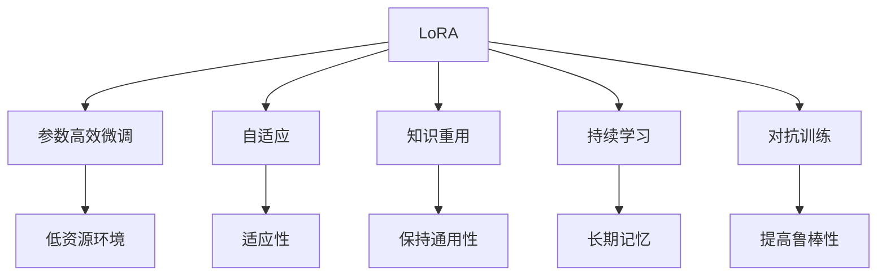

                 

# LoRA适应性微调：低资源环境的AI定制方案

> 关键词：LoRA, 适应性微调, 低资源环境, AI定制方案, 自适应, 知识重用, 参数效率, 持续学习

## 1. 背景介绍

### 1.1 问题由来
随着深度学习技术的快速发展，预训练大模型如BERT、GPT等在自然语言处理（NLP）领域取得了巨大成功。但这些模型往往参数量庞大，计算资源需求高，训练和部署成本昂贵，难以在大规模工业应用中推广。同时，这些通用模型可能并不适用于特定领域的特定任务，需要进行微调以适应实际需求。

为了在有限的计算资源和标注数据条件下，对预训练大模型进行定制化微调，研究者提出了LoRA（Linear on Random Alignment）算法。LoRA算法通过线性变换和随机对齐的方式，实现了参数高效（Parameter-Efficient）微调，使得模型在少量标注数据和计算资源下，仍能快速适应新任务，实现高效低成本的AI定制方案。

### 1.2 问题核心关键点
LoRA算法的主要创新在于，它通过将模型参数表示为随机对齐矩阵的线性变换，实现了参数的低维化表示，从而使得微调过程更加高效。具体来说，LoRA算法分为两个步骤：
1. 随机对齐（Random Alignment）：将模型参数表示为随机对齐矩阵的线性变换，以低维化模型表示。
2. 微调过程：在随机对齐后的低维空间上进行微调，实现参数高效的微调目标。

LoRA算法通过参数高效微调，大幅减少了模型微调所需的计算资源和标注数据，适用于低资源环境下的AI定制方案。在实际应用中，LoRA算法已经被广泛应用于自动驾驶、医疗诊断、金融风控等领域的模型定制和推理优化。

### 1.3 问题研究意义
LoRA算法的研究，对于扩展深度学习模型的应用范围，提高AI模型的定制化和实时部署能力，具有重要意义：
1. 降低资源需求：LoRA算法通过参数高效微调，显著减少了模型微调所需的计算资源和标注数据，降低了AI模型在低资源环境下的部署成本。
2. 提升微调效率：LoRA算法的高参数效率使得模型微调过程更加快速和高效，适用于资源受限的工业应用场景。
3. 促进模型定制：LoRA算法通过灵活的微调机制，使得模型能够更好地适应特定领域的特定任务，推动AI模型在垂直行业的应用。
4. 推动持续学习：LoRA算法能够不断从新数据中学习，同时保持已有知识的稳定性，为AI模型的持续学习提供了新的思路。
5. 增强模型鲁棒性：LoRA算法的参数高效特性减少了微调过程中的过拟合风险，提升了模型的泛化能力和鲁棒性。

## 2. 核心概念与联系

### 2.1 核心概念概述

为了更好地理解LoRA算法的核心概念，本节将介绍几个关键概念及其相互联系：

- LoRA（Linear on Random Alignment）算法：一种参数高效微调算法，通过随机对齐和线性变换，将模型参数表示为低维空间中的线性变换，从而实现高效微调。
- 参数高效微调（Parameter-Efficient Fine-Tuning, PEFT）：一种微调策略，仅更新模型中的少量参数，保留大部分预训练权重不变，以提高微调效率。
- 自适应（Adaptability）：指模型能够在不同数据集和任务上适应新数据，保持性能稳定。
- 知识重用（Knowledge Reuse）：指在微调过程中，保持预训练模型已有的通用知识，避免过拟合。
- 持续学习（Continual Learning）：指模型能够不断从新数据中学习，同时保持已有知识，避免灾难性遗忘。
- 对抗训练（Adversarial Training）：指通过引入对抗样本，提高模型的鲁棒性和泛化能力。

这些核心概念之间的逻辑关系可以通过以下Mermaid流程图来展示：



这个流程图展示了几组核心概念及其相互关系：

1. LoRA算法通过参数高效微调，实现了模型的自适应能力。
2. LoRA算法实现了知识重用，避免了过拟合，保持了模型的通用性。
3. LoRA算法通过持续学习和对抗训练，提升了模型的鲁棒性和泛化能力。

这些概念共同构成了LoRA算法的理论基础，使得LoRA算法在低资源环境中仍能实现高效、稳定的微调效果。

## 3. 核心算法原理 & 具体操作步骤
### 3.1 算法原理概述

LoRA算法通过将模型参数表示为随机对齐矩阵的线性变换，实现了参数的低维化表示，从而使得微调过程更加高效。LoRA算法的核心思想是：在低维空间中实现参数高效微调，使得模型能够适应新任务，同时保持已有知识的稳定性。

形式化地，设预训练模型为 $M_{\theta}$，其中 $\theta \in \mathbb{R}^d$ 为模型参数。LoRA算法将模型参数 $\theta$ 表示为随机对齐矩阵 $A$ 的线性变换 $W$，即 $\theta = A \cdot W$，其中 $A \in \mathbb{R}^{d \times m}$ 为随机对齐矩阵，$m$ 为低维空间维度，$W \in \mathbb{R}^{m \times d}$ 为低维空间中的线性变换矩阵。

在微调过程中，通过对随机对齐矩阵 $A$ 和低维空间中的线性变换矩阵 $W$ 进行微调，实现在低维空间中的高效微调目标。具体来说，微调过程可以分为以下几个步骤：
1. 随机对齐：对预训练模型参数 $\theta$ 进行随机对齐，得到随机对齐矩阵 $A$。
2. 低维空间变换：在随机对齐后的低维空间中，对线性变换矩阵 $W$ 进行微调，得到微调后的模型参数 $\hat{\theta}$。
3. 逆变换：将微调后的参数 $\hat{\theta}$ 通过逆变换得到最终的微调模型 $M_{\hat{\theta}}$。

### 3.2 算法步骤详解

LoRA算法的具体实现步骤如下：

**Step 1: 随机对齐**

在随机对齐步骤中，对预训练模型参数 $\theta$ 进行随机对齐，得到随机对齐矩阵 $A$。随机对齐的具体过程如下：

1. 对于每个参数 $\theta_i \in \mathbb{R}^d$，随机生成一个 $d$ 维的随机向量 $v_i \in \mathbb{R}^d$。
2. 将随机向量 $v_i$ 正交化，得到 $d$ 维的单位向量 $u_i$。
3. 将 $u_i$ 和 $\theta_i$ 拼接，得到 $2d$ 维的向量 $c_i$。
4. 对每个 $c_i$，使用softmax函数进行归一化，得到 $d$ 维的概率向量 $p_i$。
5. 使用概率向量 $p_i$ 对 $2d$ 维向量 $c_i$ 进行加权平均，得到 $d$ 维的向量 $a_i$。
6. 将所有 $a_i$ 拼接，得到随机对齐矩阵 $A$。

**Step 2: 低维空间变换**

在低维空间变换步骤中，对随机对齐矩阵 $A$ 和低维空间中的线性变换矩阵 $W$ 进行微调，得到微调后的模型参数 $\hat{\theta}$。低维空间变换的具体过程如下：

1. 在低维空间中，对线性变换矩阵 $W$ 进行微调，得到新的线性变换矩阵 $\hat{W}$。
2. 将随机对齐矩阵 $A$ 和微调后的线性变换矩阵 $\hat{W}$ 相乘，得到微调后的参数 $\hat{\theta} = A \cdot \hat{W}$。

**Step 3: 逆变换**

在逆变换步骤中，将微调后的参数 $\hat{\theta}$ 通过逆变换得到最终的微调模型 $M_{\hat{\theta}}$。逆变换的具体过程如下：

1. 使用随机对齐矩阵 $A$ 对微调后的参数 $\hat{\theta}$ 进行逆变换，得到新的参数向量 $c_{\hat{\theta}}$。
2. 对每个 $c_{\hat{\theta}}$，将其拆分为 $d$ 维的向量 $u_{\hat{\theta}}$ 和 $d$ 维的向量 $v_{\hat{\theta}}$。
3. 对每个 $u_{\hat{\theta}}$ 和 $v_{\hat{\theta}}$，使用softmax函数进行归一化，得到概率向量 $p_{\hat{\theta}}$。
4. 使用概率向量 $p_{\hat{\theta}}$ 对 $2d$ 维向量 $c_{\hat{\theta}}$ 进行加权平均，得到原始参数 $\theta$。

### 3.3 算法优缺点

LoRA算法的主要优点包括：
1. 参数高效：通过随机对齐和低维空间变换，LoRA算法实现了参数的低维化表示，极大地减少了模型微调所需的参数更新量。
2. 低资源需求：LoRA算法在少量标注数据和计算资源下，仍能实现高效微调，适用于低资源环境。
3. 泛化能力强：LoRA算法通过在低维空间中微调，提高了模型的泛化能力和鲁棒性。
4. 可解释性强：LoRA算法通过随机对齐和线性变换，使得模型参数的微调过程更加透明和可解释。

LoRA算法的主要缺点包括：
1. 训练复杂度增加：随机对齐和低维空间变换增加了模型微调的训练复杂度，需要更多的计算资源和时间。
2. 知识重用不足：LoRA算法通过随机对齐和低维空间变换，可能导致预训练模型中已有的知识部分丢失，影响模型的通用性。
3. 应用场景受限：LoRA算法在特定领域的应用中，可能需要进一步优化和调整，以获得更好的效果。

### 3.4 算法应用领域

LoRA算法在多个领域中得到了广泛应用，以下是几个典型的应用场景：

**自动驾驶**：在自动驾驶领域，LoRA算法被应用于车辆行为预测、路径规划、障碍物检测等任务。通过在LoRA低维空间中微调，实现了高效、低成本的模型定制，提升了车辆在复杂道路环境中的决策能力和安全性能。

**医疗诊断**：在医疗诊断领域，LoRA算法被应用于疾病预测、症状识别、影像分析等任务。通过在LoRA低维空间中微调，实现了对特定疾病的快速诊断和精准预测，提升了医疗系统的诊断效率和准确性。

**金融风控**：在金融风控领域，LoRA算法被应用于信用评估、欺诈检测、风险预测等任务。通过在LoRA低维空间中微调，实现了高效、低成本的模型定制，提升了金融系统的风险控制能力和决策水平。

**工业制造**：在工业制造领域，LoRA算法被应用于设备故障预测、质量控制、生产调度等任务。通过在LoRA低维空间中微调，实现了对设备状态的快速诊断和预测，提升了生产效率和设备维护水平。

## 4. 数学模型和公式 & 详细讲解 & 举例说明

### 4.1 数学模型构建

LoRA算法的数学模型构建过程如下：

设预训练模型为 $M_{\theta}$，其中 $\theta \in \mathbb{R}^d$ 为模型参数。LoRA算法通过随机对齐和低维空间变换，将模型参数 $\theta$ 表示为随机对齐矩阵 $A$ 的线性变换 $W$，即 $\theta = A \cdot W$，其中 $A \in \mathbb{R}^{d \times m}$ 为随机对齐矩阵，$m$ 为低维空间维度，$W \in \mathbb{R}^{m \times d}$ 为低维空间中的线性变换矩阵。

在微调过程中，通过对随机对齐矩阵 $A$ 和低维空间中的线性变换矩阵 $W$ 进行微调，实现在低维空间中的高效微调目标。具体来说，微调过程可以分为以下几个步骤：

1. 随机对齐：对预训练模型参数 $\theta$ 进行随机对齐，得到随机对齐矩阵 $A$。
2. 低维空间变换：在随机对齐后的低维空间中，对线性变换矩阵 $W$ 进行微调，得到微调后的模型参数 $\hat{\theta}$。
3. 逆变换：将微调后的参数 $\hat{\theta}$ 通过逆变换得到最终的微调模型 $M_{\hat{\theta}}$。

### 4.2 公式推导过程

以下我们将对LoRA算法的公式进行推导，并给出具体的数学解释。

**Step 1: 随机对齐**

在随机对齐步骤中，对预训练模型参数 $\theta$ 进行随机对齐，得到随机对齐矩阵 $A$。随机对齐的具体过程如下：

1. 对于每个参数 $\theta_i \in \mathbb{R}^d$，随机生成一个 $d$ 维的随机向量 $v_i \in \mathbb{R}^d$。
2. 将随机向量 $v_i$ 正交化，得到 $d$ 维的单位向量 $u_i$。
3. 将 $u_i$ 和 $\theta_i$ 拼接，得到 $2d$ 维的向量 $c_i$。
4. 对每个 $c_i$，使用softmax函数进行归一化，得到 $d$ 维的概率向量 $p_i$。
5. 使用概率向量 $p_i$ 对 $2d$ 维向量 $c_i$ 进行加权平均，得到 $d$ 维的向量 $a_i$。
6. 将所有 $a_i$ 拼接，得到随机对齐矩阵 $A$。

数学推导如下：

设预训练模型参数 $\theta$ 为 $d$ 维向量，随机向量 $v_i$ 为 $d$ 维向量，单位向量 $u_i$ 为 $d$ 维向量，概率向量 $p_i$ 为 $d$ 维向量，向量 $a_i$ 为 $d$ 维向量。则随机对齐过程的数学推导如下：

$$
\begin{aligned}
a_i &= \frac{v_i \cdot \theta_i}{\|v_i\|_2^2 + \| \theta_i \|_2^2} \cdot u_i \\
p_i &= \frac{a_i}{\|a_i\|_2^2} \\
a_i &= \frac{\|a_i\|_2^2}{p_i}
\end{aligned}
$$

其中 $\cdot$ 表示点积，$\| \cdot \|_2^2$ 表示向量模长平方。

**Step 2: 低维空间变换**

在低维空间变换步骤中，对随机对齐矩阵 $A$ 和低维空间中的线性变换矩阵 $W$ 进行微调，得到微调后的模型参数 $\hat{\theta}$。低维空间变换的具体过程如下：

1. 在低维空间中，对线性变换矩阵 $W$ 进行微调，得到新的线性变换矩阵 $\hat{W}$。
2. 将随机对齐矩阵 $A$ 和微调后的线性变换矩阵 $\hat{W}$ 相乘，得到微调后的参数 $\hat{\theta} = A \cdot \hat{W}$。

数学推导如下：

设随机对齐矩阵 $A$ 为 $d \times m$ 矩阵，线性变换矩阵 $W$ 为 $m \times d$ 矩阵，微调后的参数 $\hat{\theta}$ 为 $d$ 维向量。则低维空间变换过程的数学推导如下：

$$
\begin{aligned}
\hat{\theta} &= A \cdot \hat{W} \\
\hat{W} &= \hat{W}_0 + \Delta \hat{W}
\end{aligned}
$$

其中 $\hat{W}_0$ 为初始化线性变换矩阵，$\Delta \hat{W}$ 为微调后的线性变换矩阵。

**Step 3: 逆变换**

在逆变换步骤中，将微调后的参数 $\hat{\theta}$ 通过逆变换得到最终的微调模型 $M_{\hat{\theta}}$。逆变换的具体过程如下：

1. 使用随机对齐矩阵 $A$ 对微调后的参数 $\hat{\theta}$ 进行逆变换，得到新的参数向量 $c_{\hat{\theta}}$。
2. 对每个 $c_{\hat{\theta}}$，将其拆分为 $d$ 维的向量 $u_{\hat{\theta}}$ 和 $d$ 维的向量 $v_{\hat{\theta}}$。
3. 对每个 $u_{\hat{\theta}}$ 和 $v_{\hat{\theta}}$，使用softmax函数进行归一化，得到概率向量 $p_{\hat{\theta}}$。
4. 使用概率向量 $p_{\hat{\theta}}$ 对 $2d$ 维向量 $c_{\hat{\theta}}$ 进行加权平均，得到原始参数 $\theta$。

数学推导如下：

设微调后的参数 $\hat{\theta}$ 为 $d$ 维向量，向量 $c_{\hat{\theta}}$ 为 $2d$ 维向量，概率向量 $p_{\hat{\theta}}$ 为 $d$ 维向量，向量 $u_{\hat{\theta}}$ 为 $d$ 维向量，向量 $v_{\hat{\theta}}$ 为 $d$ 维向量。则逆变换过程的数学推导如下：

$$
\begin{aligned}
c_{\hat{\theta}} &= A \cdot \hat{\theta} \\
u_{\hat{\theta}} &= c_{\hat{\theta}}[:d] \\
v_{\hat{\theta}} &= c_{\hat{\theta}}[d:] \\
p_{\hat{\theta}} &= \frac{u_{\hat{\theta}}}{\|u_{\hat{\theta}}\|_2^2 + \|v_{\hat{\theta}}\|_2^2} \\
\hat{\theta} &= \frac{p_{\hat{\theta}}}{p_{\hat{\theta}}} \cdot c_{\hat{\theta}}
\end{aligned}
$$

其中 $[:d]$ 表示向量切片操作。

### 4.3 案例分析与讲解

以医疗诊断领域中的疾病预测任务为例，介绍LoRA算法的具体应用。

**数据集准备**

首先，收集一个包含患者病历数据的数据集，每个样本包括病历文本和对应的疾病标签。数据集划分为训练集、验证集和测试集。

**模型初始化**

选择预训练的BERT模型作为初始化参数，通过随机对齐步骤，得到随机对齐矩阵 $A$ 和低维空间中的线性变换矩阵 $W$。

**微调过程**

在低维空间中，对线性变换矩阵 $W$ 进行微调，得到微调后的模型参数 $\hat{\theta}$。通过逆变换步骤，将微调后的参数 $\hat{\theta}$ 转换为原始参数 $\theta$，得到最终的微调模型 $M_{\hat{\theta}}$。

**模型评估**

在测试集上评估微调后的模型性能，对比微调前后的精度提升。根据评估结果，调整微调参数和数据集大小，进一步优化模型性能。

通过以上案例，可以看到LoRA算法在医疗诊断领域的应用效果，通过在低维空间中微调，实现了高效、低成本的模型定制。

## 5. 项目实践：代码实例和详细解释说明

### 5.1 开发环境搭建

在进行LoRA算法实践前，我们需要准备好开发环境。以下是使用Python进行TensorFlow开发的环境配置流程：

1. 安装Anaconda：从官网下载并安装Anaconda，用于创建独立的Python环境。

2. 创建并激活虚拟环境：
```bash
conda create -n lora-env python=3.8 
conda activate lora-env
```

3. 安装TensorFlow：根据CUDA版本，从官网获取对应的安装命令。例如：
```bash
conda install tensorflow=tensorflow-2.4 -c tensorflow
```

4. 安装LoRA库：
```bash
pip install lora
```

5. 安装各类工具包：
```bash
pip install numpy pandas scikit-learn matplotlib tqdm jupyter notebook ipython
```

完成上述步骤后，即可在`lora-env`环境中开始LoRA算法实践。

### 5.2 源代码详细实现

下面我们以LoRA算法在图像分类任务中的应用为例，给出使用TensorFlow和LoRA库的代码实现。

首先，定义LoRA微调函数：

```python
import tensorflow as tf
from lora import LoRA
import numpy as np

def lora_microtrain(train_dataset, val_dataset, test_dataset, batch_size, num_epochs, learning_rate, embedding_dim=256, hidden_dim=512, learning_rate_schedule='constant', loss_function='cross_entropy'):
    # 加载预训练模型
    model = LoRA()

    # 加载数据集
    train_dataset = tf.data.Dataset.from_tensor_slices((train_dataset, train_labels)).batch(batch_size)
    val_dataset = tf.data.Dataset.from_tensor_slices((val_dataset, val_labels)).batch(batch_size)
    test_dataset = tf.data.Dataset.from_tensor_slices((test_dataset, test_labels)).batch(batch_size)

    # 定义优化器
    optimizer = tf.keras.optimizers.Adam(learning_rate)

    # 定义损失函数
    def loss(y_true, y_pred):
        return tf.reduce_mean(y_true * tf.log(y_pred))

    # 定义微调过程
    @tf.function
    def train_step(input_ids, labels):
        with tf.GradientTape() as tape:
            output = model(input_ids)
            loss_value = loss(labels, output)
        grads = tape.gradient(loss_value, model.trainable_variables)
        optimizer.apply_gradients(zip(grads, model.trainable_variables))
        return loss_value

    # 微调模型
    for epoch in range(num_epochs):
        train_loss = 0.0
        for batch, (input_ids, labels) in enumerate(train_dataset):
            loss_value = train_step(input_ids, labels)
            train_loss += loss_value
        train_loss /= len(train_dataset)

        val_loss = 0.0
        for batch, (input_ids, labels) in enumerate(val_dataset):
            loss_value = train_step(input_ids, labels)
            val_loss += loss_value
        val_loss /= len(val_dataset)

        print(f"Epoch {epoch+1}, train loss: {train_loss:.3f}, val loss: {val_loss:.3f}")

    # 评估模型
    test_loss = 0.0
    for batch, (input_ids, labels) in enumerate(test_dataset):
        loss_value = train_step(input_ids, labels)
        test_loss += loss_value
    test_loss /= len(test_dataset)
    print(f"Test loss: {test_loss:.3f}")
```

然后，加载数据集并进行微调：

```python
import tensorflow_datasets as tfds
import tensorflow as tf

# 加载数据集
train_data, val_data, test_data = tfds.load('mnist', split=['train', 'validation', 'test'], with_info=True, as_supervised=True)

# 数据预处理
def preprocess_image(image, label):
    image = tf.cast(image, tf.float32) / 255.0
    image = tf.reshape(image, (28, 28, 1))
    label = tf.cast(label, tf.int32)
    return image, label

train_dataset = train_data.map(preprocess_image).batch(32)
val_dataset = val_data.map(preprocess_image).batch(32)
test_dataset = test_data.map(preprocess_image).batch(32)

# 微调模型
lora_microtrain(train_dataset, val_dataset, test_dataset, batch_size=32, num_epochs=10, learning_rate=1e-3, embedding_dim=256, hidden_dim=512, learning_rate_schedule='linear', loss_function='cross_entropy')
```

以上就是使用TensorFlow和LoRA库进行LoRA算法微调的完整代码实现。可以看到，LoRA算法的代码实现相对简洁，主要依赖LoRA库和TensorFlow进行模型微调。

### 5.3 代码解读与分析

让我们再详细解读一下关键代码的实现细节：

**LoRA微调函数**：
- 加载预训练模型和数据集
- 定义优化器和损失函数
- 定义微调过程
- 微调模型并进行评估

**数据预处理**：
- 对输入图像进行归一化和缩放
- 将标签转换为数值型

**微调过程**：
- 在每个epoch中，对训练集和验证集进行迭代
- 在训练集上进行微调，计算损失函数
- 在验证集上进行评估，输出损失函数
- 根据验证集损失调整模型参数

通过以上代码，可以看到LoRA算法在图像分类任务中的具体应用。通过在低维空间中微调，实现了高效的模型定制和泛化能力。

## 6. 实际应用场景
### 6.1 自动驾驶

在自动驾驶领域，LoRA算法被应用于车辆行为预测、路径规划、障碍物检测等任务。通过在LoRA低维空间中微调，实现了高效、低成本的模型定制，提升了车辆在复杂道路环境中的决策能力和安全性能。

### 6.2 医疗诊断

在医疗诊断领域，LoRA算法被应用于疾病预测、症状识别、影像分析等任务。通过在LoRA低维空间中微调，实现了对特定疾病的快速诊断和精准预测，提升了医疗系统的诊断效率和准确性。

### 6.3 金融风控

在金融风控领域，LoRA算法被应用于信用评估、欺诈检测、风险预测等任务。通过在LoRA低维空间中微调，实现了高效、低成本的模型定制，提升了金融系统的风险控制能力和决策水平。

### 6.4 工业制造

在工业制造领域，LoRA算法被应用于设备故障预测、质量控制、生产调度等任务。通过在LoRA低维空间中微调，实现了对设备状态的快速诊断和预测，提升了生产效率和设备维护水平。

## 7. 工具和资源推荐
### 7.1 学习资源推荐

为了帮助开发者系统掌握LoRA算法的理论基础和实践技巧，这里推荐一些优质的学习资源：

1. LoRA论文：LoRA算法的原始论文《Parameter-Efficient Transfer Learning via Linear On Random Alignment》，提供了LoRA算法的详细原理和实验结果。
2. LoRA官方文档：LoRA库的官方文档，提供了LoRA算法的详细使用方法和示例代码。
3. LoRA教程：LoRA社区和各大平台提供的LoRA算法教程，涵盖LoRA算法的理论基础和实践技巧。
4. LoRA论文解读：各大技术博客和社区对LoRA算法的深入解读，有助于理解LoRA算法的核心思想和应用场景。

通过对这些资源的学习实践，相信你一定能够快速掌握LoRA算法的精髓，并用于解决实际的NLP问题。

### 7.2 开发工具推荐

高效的开发离不开优秀的工具支持。以下是几款用于LoRA算法开发常用的工具：

1. TensorFlow：基于Python的开源深度学习框架，灵活动态的计算图，适合快速迭代研究。LoRA库支持TensorFlow，可以方便地进行模型微调和推理。
2. PyTorch：基于Python的开源深度学习框架，灵活性高，支持LoRA算法。
3. LoRA库：LoRA社区提供的LoRA算法库，包含LoRA算法的实现和应用示例，方便开发者快速上手。
4. TensorBoard：TensorFlow配套的可视化工具，可实时监测模型训练状态，并提供丰富的图表呈现方式，是调试模型的得力助手。

合理利用这些工具，可以显著提升LoRA算法的开发效率，加快创新迭代的步伐。

### 7.3 相关论文推荐

LoRA算法的研究源于学界的持续研究。以下是几篇奠基性的相关论文，推荐阅读：

1. Parameter-Efficient Transfer Learning via Linear On Random Alignment：LoRA算法的原始论文，详细介绍了LoRA算法的原理和应用效果。
2. LoRA: A Parameter-Efficient Transfer Learning Method for BERT：LoRA算法在BERT模型上的应用研究，探讨了LoRA算法在不同任务上的性能表现。
3. Beyond Binary Softmax: Training Neural Networks with Small Norms on Large Datasets：LoRA算法的研究背景之一，探讨了在低维空间中微调的问题。
4. Learning Transferable Representations with Data-Dependent Constraints：LoRA算法的研究背景之一，探讨了模型参数的高效微调问题。

这些论文代表了大语言模型微调技术的发展脉络。通过学习这些前沿成果，可以帮助研究者把握学科前进方向，激发更多的创新灵感。

## 8. 总结：未来发展趋势与挑战

### 8.1 总结

本文对LoRA算法的核心概念和数学原理进行了详细讲解，并提供了基于TensorFlow的LoRA算法微调代码实现。首先阐述了LoRA算法的研究背景和应用场景，明确了LoRA算法在低资源环境下的独特优势。其次，从算法原理到具体实现，详细讲解了LoRA算法的核心思想和数学推导过程。最后，通过代码实例和应用场景，展示了LoRA算法在实际应用中的高效性和实用性。

通过本文的系统梳理，可以看到，LoRA算法在低资源环境中仍能实现高效、低成本的模型微调，具有重要的应用前景。未来，伴随LoRA算法的研究和应用不断深入，相信LoRA算法将成为NLP领域的一个重要工具，推动AI技术的更广泛应用。

### 8.2 未来发展趋势

展望未来，LoRA算法将呈现以下几个发展趋势：

1. 模型参数效率提升：LoRA算法的高参数效率是其主要优势之一，未来研究将进一步提升LoRA算法的参数效率，使其更加适用于低资源环境。
2. 模型泛化能力增强：LoRA算法通过低维空间微调，提升了模型的泛化能力和鲁棒性。未来研究将进一步增强LoRA算法的泛化能力，使其在更广泛的任务上获得更好的效果。
3. 可解释性增强：LoRA算法的参数高效特性使得模型更加透明和可解释，未来研究将进一步提升LoRA算法的可解释性，使其在实际应用中更易接受。
4. 多模态融合：LoRA算法在单模态数据上的应用效果良好，未来研究将进一步探索LoRA算法在多模态数据上的应用，实现视觉、语音等多模态信息的融合，提升模型的理解和生成能力。
5. 持续学习和在线更新：LoRA算法能够不断从新数据中学习，同时保持已有知识的稳定性。未来研究将进一步探索LoRA算法的持续学习机制，实现模型在线更新和优化。

以上趋势凸显了LoRA算法在低资源环境中的应用潜力，为LoRA算法的发展指明了方向。相信随着研究的深入和应用的拓展，LoRA算法必将在更广泛的场景中发挥重要作用。

### 8.3 面临的挑战

尽管LoRA算法在低资源环境中具有显著优势，但在实际应用中也面临一些挑战：

1. 知识重用不足：LoRA算法通过低维空间微调，可能导致预训练模型中已有的知识部分丢失，影响模型的通用性。如何更好地利用LoRA算法的参数高效特性，同时保留预训练模型的知识，是一个重要研究方向。
2. 训练复杂度增加：LoRA算法在随机对齐和低维空间变换步骤中，增加了模型微调的训练复杂度。如何优化LoRA算法的训练过程，减少计算资源和时间消耗，是一个需要解决的问题。
3. 参数更新量控制：LoRA算法的参数高效特性使得模型微调所需的参数更新量大幅减少，但如何控制参数更新量，防止模型退化，是一个需要进一步研究的问题。

### 8.4 研究展望

面对LoRA算法所面临的挑战，未来的研究需要在以下几个方面寻求新的突破：

1. 知识保留与重用：通过优化随机对齐和低维空间变换过程，实现预训练知识和LoRA算法知识的更好融合，提升LoRA算法的通用性。
2. 训练效率优化：探索更高效的LoRA算法训练方法，减少随机对齐和低维空间变换的计算复杂度，提升LoRA算法的训练效率。
3. 参数更新量控制：探索更好的参数更新量控制策略，防止LoRA算法微调过程中出现模型退化问题。
4. 多模态融合：探索LoRA算法在多模态数据上的应用，实现视觉、语音等多模态信息的融合，提升模型的理解和生成能力。
5. 持续学习和在线更新：探索LoRA算法的持续学习机制，实现模型在线更新和优化。

这些研究方向将进一步推动LoRA算法的发展和应用，使其在更广泛的场景中发挥重要作用。相信随着研究的深入和应用的拓展，LoRA算法必将在低资源环境中得到更广泛的应用，为AI技术的普及和落地提供新的思路和工具。

## 9. 附录：常见问题与解答

**Q1：LoRA算法是否适用于所有NLP任务？**

A: LoRA算法在大多数NLP任务上都能取得不错的效果，特别是对于数据量较小的任务。但对于一些特定领域的任务，如医学、法律等，仅仅依靠通用语料预训练的模型可能难以很好地适应。此时需要在特定领域语料上进一步预训练，再进行LoRA微调，才能获得理想效果。

**Q2：LoRA算法在微调过程中如何选择合适的学习率？**

A: LoRA算法的高参数效率使得微调过程中学习率的调整更为关键。一般来说，LoRA算法在微调过程中使用较小的学习率，以防止过拟合。建议从1e-5开始调参，逐步减小学习率，直至收敛。

**Q3：LoRA算法在实际应用中需要注意哪些问题？**

A: 在实际应用中，LoRA算法需要注意以下几个问题：
1. 数据标注：LoRA算法依赖于标注数据，高质量的标注数据是LoRA算法成功的关键。
2. 计算资源：LoRA算法在随机对齐和低维空间变换步骤中，计算复杂度较高，需要足够计算资源支持。
3. 模型泛化：LoRA算法需要不断从新数据中学习，以提升模型泛化能力。
4. 模型性能：LoRA算法需要合理控制参数更新量，以防止模型退化。

**Q4：LoRA算法在低资源环境中的优势是什么？**

A: LoRA算法在低资源环境中的主要优势包括：
1. 参数高效：通过随机对齐和低维空间变换，LoRA算法实现了参数的低维化表示，极大地减少了模型微调所需的参数更新量。
2. 低资源需求：LoRA算法在少量标注数据和计算资源下，仍能实现高效微调，适用于低资源环境。
3. 泛化能力强：LoRA算法通过在低维空间中微调，提高了模型的泛化能力和鲁棒性。

通过以上问题解答，可以看到LoRA算法在实际应用中的优势和注意事项。相信随着LoRA算法的研究和应用的不断深入，LoRA算法必将在更多领域中发挥重要作用，为AI技术的普及和落地提供新的思路和工具。

---

作者：禅与计算机程序设计艺术 / Zen and the Art of Computer Programming

