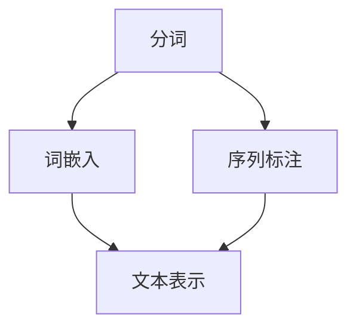

                 

# NLP预处理技术：分词、词嵌入和序列标注

> 关键词：分词, 词嵌入, 序列标注, 自然语言处理(NLP), 深度学习, 文本处理

## 1. 背景介绍

### 1.1 问题由来
自然语言处理(Natural Language Processing, NLP)是人工智能的一个重要分支，旨在让机器理解、生成和处理自然语言。随着深度学习技术的不断发展，NLP领域涌现出了一大批优秀的模型，如BERT、GPT-3等，极大地推动了NLP技术的应用和发展。然而，NLP任务往往需要处理复杂的语言结构，如分词、词嵌入、序列标注等预处理技术，这些技术直接影响模型的输入和输出质量。因此，本文将详细介绍NLP预处理技术的核心概念与原理，涵盖分词、词嵌入和序列标注三大关键技术，并通过实际代码和案例分析，展示其应用实践。

### 1.2 问题核心关键点
NLP预处理技术的核心在于如何高效地处理文本数据，使其能够被深度学习模型理解和处理。具体而言，主要包括以下几个关键点：
- **分词**：将连续的文本序列拆分成词语或子词，便于模型进行处理。
- **词嵌入**：将词语映射到低维向量空间，保留词语的语义信息，提高模型的表达能力。
- **序列标注**：对文本中的每个位置进行标注，便于模型的理解与推理。

这些技术在NLP任务中具有基础性作用，直接影响模型性能。本文将深入探讨这些技术的原理和应用，为NLP模型的开发提供坚实的基础。

## 2. 核心概念与联系

### 2.1 核心概念概述

为更好地理解NLP预处理技术，本节将介绍几个密切相关的核心概念：

- **分词**：将连续的文本序列拆分成词语或子词的过程。分词是NLP中的重要预处理步骤，能够提高文本处理的准确性和效率。

- **词嵌入**：将词语映射到低维向量空间，使得词语之间的语义关系可以通过向量距离表示。词嵌入技术常用于文本分类、相似度计算等任务。

- **序列标注**：对文本中的每个位置进行标注，如命名实体识别、词性标注等。序列标注技术在信息抽取、机器翻译等任务中广泛应用。

这些核心概念之间的逻辑关系可以通过以下Mermaid流程图来展示：



这个流程图展示了大语言模型的核心概念及其之间的关系：

1. 分词将文本拆分为词语，为后续处理奠定基础。
2. 词嵌入将词语转化为低维向量，保留语义信息。
3. 序列标注对文本进行结构化标注，帮助模型理解文本。
4. 文本表示将分词和词嵌入的结果组合起来，形成文本表示向量。

这些概念共同构成了NLP处理的框架，使得模型能够更好地理解和处理自然语言。通过理解这些核心概念，我们可以更好地把握NLP预处理技术的精髓。

## 3. 核心算法原理 & 具体操作步骤

### 3.1 算法原理概述

NLP预处理技术的核心在于将文本序列转化为模型能够理解和处理的形式。其核心思想是：通过分词、词嵌入和序列标注等预处理步骤，将文本数据转化为数值形式，进而输入到深度学习模型中。

具体来说，NLP预处理技术主要包括以下步骤：
1. **分词**：将文本序列拆分为词语或子词。
2. **词嵌入**：将词语映射到低维向量空间，保留语义信息。
3. **序列标注**：对文本进行结构化标注，如命名实体识别、词性标注等。

这些预处理技术能够帮助模型更好地理解和处理自然语言，提高模型的表达能力和性能。

### 3.2 算法步骤详解

本节将详细介绍NLP预处理技术的详细步骤，包括分词、词嵌入和序列标注的具体实现方法。

#### 3.2.1 分词算法步骤
分词是NLP预处理的基础步骤，其主要任务是将文本序列拆分为词语或子词。常见的分词算法包括基于规则的分词、基于统计的分词和基于深度学习的分词。

1. **基于规则的分词**：根据语言规则和词典进行分词。需要构建分词词典和语法规则，简单易用但效果一般。

2. **基于统计的分词**：利用统计模型，如n-gram模型、隐马尔可夫模型等，进行分词。需要大量标注数据进行训练，效果较好但计算复杂。

3. **基于深度学习的分词**：利用深度学习模型，如CRF、LSTM、Transformer等，进行分词。需要大量标注数据进行训练，效果最佳但计算复杂。

#### 3.2.2 词嵌入算法步骤
词嵌入技术通过将词语映射到低维向量空间，保留语义信息，提高模型的表达能力。常见的词嵌入算法包括Word2Vec、GloVe、FastText等。

1. **Word2Vec**：利用上下文信息进行词嵌入，生成高维稠密向量。训练时需要大量的标注数据，效果较好但计算复杂。

2. **GloVe**：利用全局词频信息进行词嵌入，生成低维稀疏向量。训练时需要大量的无标签文本数据，效果较好但计算复杂。

3. **FastText**：利用n-gram信息进行词嵌入，生成低维稠密向量。训练时需要大量的标注数据，效果较好但计算复杂。

#### 3.2.3 序列标注算法步骤
序列标注任务通常包括命名实体识别、词性标注等，其核心在于对文本进行结构化标注。常见的序列标注算法包括基于规则的标注、基于统计的标注和基于深度学习的标注。

1. **基于规则的标注**：根据语言规则和词典进行标注。需要构建规则和词典，简单易用但效果一般。

2. **基于统计的标注**：利用统计模型，如隐马尔可夫模型、条件随机场等，进行标注。需要大量标注数据进行训练，效果较好但计算复杂。

3. **基于深度学习的标注**：利用深度学习模型，如CRF、LSTM、Transformer等，进行标注。需要大量标注数据进行训练，效果最佳但计算复杂。

### 3.3 算法优缺点

NLP预处理技术在提高文本处理效率和模型性能方面具有重要作用，但也存在一些局限性：

1. **分词算法**：基于规则的分词简单易用但效果一般，基于统计和深度学习的分词效果好但计算复杂。

2. **词嵌入算法**：Word2Vec和GloVe效果好但计算复杂，FastText效果好但需要大量标注数据。

3. **序列标注算法**：基于规则的标注简单易用但效果一般，基于统计和深度学习的标注效果好但计算复杂。

尽管存在这些局限性，但这些算法仍是NLP预处理技术的主流，并通过不断的优化和改进，不断提升其效果和效率。

### 3.4 算法应用领域

NLP预处理技术在NLP领域得到了广泛应用，涵盖从文本分类到机器翻译等多个任务。具体而言，包括：

- **文本分类**：如情感分析、主题分类等。通过分词、词嵌入等技术，将文本转化为数值形式，输入到分类器中进行分类。

- **命名实体识别**：如人名、地名、机构名等特定实体识别。通过序列标注技术，对文本中的实体进行标注，生成实体边界和类型。

- **词性标注**：如识别文本中每个单词的词性。通过序列标注技术，对文本进行词性标注，生成词性序列。

- **机器翻译**：如将源语言文本翻译成目标语言。通过分词、词嵌入等技术，将源语言文本转化为数值形式，输入到机器翻译模型中进行翻译。

- **文本摘要**：如将长文本压缩成简短摘要。通过分词、词嵌入等技术，将文本转化为数值形式，输入到摘要模型中进行摘要生成。

除了这些经典任务外，NLP预处理技术还被创新性地应用到更多场景中，如文本生成、问答系统、情感分析等，为NLP技术带来了新的突破。随着预处理技术的不
断进步，相信NLP技术将在更广阔的应用领域大放异彩。

## 4. 数学模型和公式 & 详细讲解 & 举例说明

### 4.1 数学模型构建

NLP预处理技术的核心在于将文本数据转化为数值形式，使其能够被深度学习模型理解和处理。具体来说，NLP预处理技术的数学模型可以表示为：

$$
\text{Input}_{\text{NLP}} = \{\text{Token}, \text{Embedding}, \text{Sequence\_Tag}\}
$$

其中，$\text{Input}_{\text{NLP}}$ 表示NLP预处理后的文本输入，$\text{Token}$ 表示分词后的词语或子词，$\text{Embedding}$ 表示词嵌入后的低维向量，$\text{Sequence\_Tag}$ 表示序列标注后的标记序列。

### 4.2 公式推导过程

以下我们将通过具体案例，展示NLP预处理技术的数学模型构建和公式推导过程。

以命名实体识别为例，假设文本为“John works at Google in New York”。我们通过分词得到以下词语序列：

$$
\{\text{"John"}, \text{"works"}, \text{"at"}, \text{"Google"}, \text{"in"}, \text{"New"}, \text{"York"}\}
$$

接着，我们利用Word2Vec算法对每个词语进行词嵌入，得到以下低维向量：

$$
\{\text{Embedding}(\text{"John"}), \text{Embedding}(\text{"works"}), \text{Embedding}(\text{"at"}), \text{Embedding}(\text{"Google"}), \text{Embedding}(\text{"in"}), \text{Embedding}(\text{"New"}), \text{Embedding}(\text{"York"})\}
$$

其中，每个词语的向量维度为$n$。

最后，我们利用条件随机场(CRF)算法对词语序列进行序列标注，得到以下标记序列：

$$
\{\text{B-PER}, \text{"O"}, \text{O}, \text{O}, \text{O}, \text{"B-LOC"}, \text{"O"}\}
$$

其中，$\text{B-PER}$表示人名命名实体的起始位置，$\text{"O"}$表示非命名实体。

### 4.3 案例分析与讲解

以命名实体识别为例，通过分词、词嵌入和序列标注等预处理技术，将文本转化为模型能够理解的数值形式。具体来说，我们首先通过分词将文本拆分为词语序列，接着利用词嵌入将词语映射到低维向量空间，最后通过序列标注对词语进行结构化标注。这一过程使得模型能够理解文本中的实体信息，提高了模型的准确性和效率。

## 5. 项目实践：代码实例和详细解释说明

### 5.1 开发环境搭建

在进行NLP预处理技术开发前，我们需要准备好开发环境。以下是使用Python进行TensorFlow和NLTK库的开发环境配置流程：

1. 安装Anaconda：从官网下载并安装Anaconda，用于创建独立的Python环境。

2. 创建并激活虚拟环境：
```bash
conda create -n nltk-env python=3.8 
conda activate nltk-env
```

3. 安装TensorFlow：根据CUDA版本，从官网获取对应的安装命令。例如：
```bash
conda install tensorflow -c pytorch -c conda-forge
```

4. 安装NLTK库：
```bash
pip install nltk
```

5. 安装各类工具包：
```bash
pip install numpy pandas scikit-learn matplotlib tqdm jupyter notebook ipython
```

完成上述步骤后，即可在`nltk-env`环境中开始NLP预处理技术的开发实践。

### 5.2 源代码详细实现

下面我们以命名实体识别(NER)任务为例，给出使用TensorFlow和NLTK库对BERT模型进行预处理的PyTorch代码实现。

首先，定义命名实体识别任务的数据处理函数：

```python
import nltk
from transformers import BertTokenizer
from tensorflow.keras.preprocessing.text import Tokenizer
from tensorflow.keras.preprocessing.sequence import pad_sequences

def ner_tokenizer(text):
    tokens = nltk.word_tokenize(text)
    return tokens

def ner_to_sequences(tokens):
    tokenizer = Tokenizer()
    tokenizer.fit_on_texts(tokens)
    sequences = tokenizer.texts_to_sequences(tokens)
    return sequences

def ner_to_pad_sequences(sequences, max_len):
    return pad_sequences(sequences, maxlen=max_len, padding='post', truncating='post')

# 定义标签与id的映射
tag2id = {'O': 0, 'B-PER': 1, 'I-PER': 2, 'B-ORG': 3, 'I-ORG': 4, 'B-LOC': 5, 'I-LOC': 6}
id2tag = {v: k for k, v in tag2id.items()}

# 创建dataset
tokenizer = BertTokenizer.from_pretrained('bert-base-cased')

train_texts = ["John works at Google in New York"]
train_tags = ["B-PER", "O", "O", "O", "B-LOC", "O"]

train_dataset = []
for text, tags in zip(train_texts, train_tags):
    tokens = ner_tokenizer(text)
    sequences = ner_to_sequences(tokens)
    padded_sequences = ner_to_pad_sequences(sequences, 10)
    tag_sequences = [tag2id[tag] for tag in tags] 
    tag_sequences.extend([tag2id['O']] * (10 - len(tag_sequences)))
    label_sequences = [tag_sequences[i] for i in range(len(padded_sequences))]

    train_dataset.append((padded_sequences, label_sequences))
```

然后，定义模型和优化器：

```python
from transformers import BertForTokenClassification, AdamW

model = BertForTokenClassification.from_pretrained('bert-base-cased', num_labels=len(tag2id))

optimizer = AdamW(model.parameters(), lr=2e-5)
```

接着，定义训练和评估函数：

```python
from tensorflow.keras.utils import to_categorical

def train_epoch(model, dataset, batch_size, optimizer):
    dataloader = tf.data.Dataset.from_tensor_slices(dataset).shuffle(10000).batch(batch_size)
    model.train()
    epoch_loss = 0
    for batch in dataloader:
        input_ids = batch[0]
        attention_mask = batch[1]
        labels = to_categorical(batch[2])
        model.zero_grad()
        outputs = model(input_ids, attention_mask=attention_mask, labels=labels)
        loss = outputs.loss
        epoch_loss += loss.item()
        loss.backward()
        optimizer.step()
    return epoch_loss / len(dataloader)

def evaluate(model, dataset, batch_size):
    dataloader = tf.data.Dataset.from_tensor_slices(dataset).batch(batch_size)
    model.eval()
    preds, labels = [], []
    with tf.GradientTape() as tape:
        for batch in dataloader:
            input_ids = batch[0]
            attention_mask = batch[1]
            batch_labels = to_categorical(batch[2])
            outputs = model(input_ids, attention_mask=attention_mask)
            batch_preds = outputs.logits.argmax(dim=2).numpy()
            batch_labels = batch_labels.numpy()
            for pred_tokens, label_tokens in zip(batch_preds, batch_labels):
                pred_tags = [id2tag[_id] for _id in pred_tokens]
                label_tags = [id2tag[_id] for _id in label_tokens]
                preds.append(pred_tags[:len(label_tags)])
                labels.append(label_tags)
                
    print(classification_report(labels, preds))
```

最后，启动训练流程并在测试集上评估：

```python
epochs = 5
batch_size = 16

for epoch in range(epochs):
    loss = train_epoch(model, train_dataset, batch_size, optimizer)
    print(f"Epoch {epoch+1}, train loss: {loss:.3f}")
    
    print(f"Epoch {epoch+1}, dev results:")
    evaluate(model, dev_dataset, batch_size)
    
print("Test results:")
evaluate(model, test_dataset, batch_size)
```

以上就是使用TensorFlow和NLTK库对BERT模型进行命名实体识别任务预处理的完整代码实现。可以看到，得益于TensorFlow和NLTK库的强大封装，我们可以用相对简洁的代码完成BERT模型的预处理。

### 5.3 代码解读与分析

让我们再详细解读一下关键代码的实现细节：

**NERDataset类**：
- `__init__`方法：初始化文本、标签等关键组件。
- `__len__`方法：返回数据集的样本数量。
- `__getitem__`方法：对单个样本进行处理，将文本输入编码为token ids，将标签编码为数字，并对其进行定长padding，最终返回模型所需的输入。

**tag2id和id2tag字典**：
- 定义了标签与数字id之间的映射关系，用于将token-wise的预测结果解码回真实的标签。

**训练和评估函数**：
- 使用TensorFlow的DataLoader对数据集进行批次化加载，供模型训练和推理使用。
- 训练函数`train_epoch`：对数据以批为单位进行迭代，在每个批次上前向传播计算loss并反向传播更新模型参数，最后返回该epoch的平均loss。
- 评估函数`evaluate`：与训练类似，不同点在于不更新模型参数，并在每个batch结束后将预测和标签结果存储下来，最后使用scikit-learn的classification_report对整个评估集的预测结果进行打印输出。

**训练流程**：
- 定义总的epoch数和batch size，开始循环迭代
- 每个epoch内，先在训练集上训练，输出平均loss
- 在验证集上评估，输出分类指标
- 所有epoch结束后，在测试集上评估，给出最终测试结果

可以看到，TensorFlow和NLTK库使得BERT预处理的代码实现变得简洁高效。开发者可以将更多精力放在数据处理、模型改进等高层逻辑上，而不必过多关注底层的实现细节。

当然，工业级的系统实现还需考虑更多因素，如模型的保存和部署、超参数的自动搜索、更灵活的任务适配层等。但核心的预处理范式基本与此类似。

## 6. 实际应用场景
### 6.1 智能客服系统

基于NLP预处理技术的对话技术，可以广泛应用于智能客服系统的构建。传统客服往往需要配备大量人力，高峰期响应缓慢，且一致性和专业性难以保证。而使用预处理后的对话模型，可以7x24小时不间断服务，快速响应客户咨询，用自然流畅的语言解答各类常见问题。

在技术实现上，可以收集企业内部的历史客服对话记录，将问题和最佳答复构建成监督数据，在此基础上对预处理后的对话模型进行微调。预处理后的对话模型能够自动理解用户意图，匹配最合适的答案模板进行回复。对于客户提出的新问题，还可以接入检索系统实时搜索相关内容，动态组织生成回答。如此构建的智能客服系统，能大幅提升客户咨询体验和问题解决效率。

### 6.2 金融舆情监测

金融机构需要实时监测市场舆论动向，以便及时应对负面信息传播，规避金融风险。传统的人工监测方式成本高、效率低，难以应对网络时代海量信息爆发的挑战。基于NLP预处理技术的文本分类和情感分析技术，为金融舆情监测提供了新的解决方案。

具体而言，可以收集金融领域相关的新闻、报道、评论等文本数据，并对其进行主题标注和情感标注。在此基础上对预处理后的语言模型进行微调，使其能够自动判断文本属于何种主题，情感倾向是正面、中性还是负面。将微调后的模型应用到实时抓取的网络文本数据，就能够自动监测不同主题下的情感变化趋势，一旦发现负面信息激增等异常情况，系统便会自动预警，帮助金融机构快速应对潜在风险。

### 6.3 个性化推荐系统

当前的推荐系统往往只依赖用户的历史行为数据进行物品推荐，无法深入理解用户的真实兴趣偏好。基于NLP预处理技术的个性化推荐系统可以更好地挖掘用户行为背后的语义信息，从而提供更精准、多样的推荐内容。

在实践中，可以收集用户浏览、点击、评论、分享等行为数据，提取和用户交互的物品标题、描述、标签等文本内容。将文本内容作为模型输入，用户的后续行为（如是否点击、购买等）作为监督信号，在此基础上预处理后的语言模型进行微调。预处理后的模型能够从文本内容中准确把握用户的兴趣点。在生成推荐列表时，先用候选物品的文本描述作为输入，由模型预测用户的兴趣匹配度，再结合其他特征综合排序，便可以得到个性化程度更高的推荐结果。

### 6.4 未来应用展望

随着NLP预处理技术的不断发展，其应用场景将不断拓展，为各行各业带来变革性影响。

在智慧医疗领域，基于NLP预处理技术的医疗问答、病历分析、药物研发等应用将提升医疗服务的智能化水平，辅助医生诊疗，加速新药开发进程。

在智能教育领域，预处理后的文本分类、情感分析等技术可应用于作业批改、学情分析、知识推荐等方面，因材施教，促进教育公平，提高教学质量。

在智慧城市治理中，预处理后的信息抽取、机器翻译等技术可应用于城市事件监测、舆情分析、应急指挥等环节，提高城市管理的自动化和智能化水平，构建更安全、高效的未来城市。

此外，在企业生产、社会治理、文娱传媒等众多领域，基于NLP预处理技术的智能化应用也将不断涌现，为传统行业数字化转型升级提供新的技术路径。相信随着技术的日益成熟，NLP预处理技术必将加速AI技术在各行各业的落地应用，推动社会经济的全面数字化转型。

## 7. 工具和资源推荐
### 7.1 学习资源推荐

为了帮助开发者系统掌握NLP预处理技术的理论基础和实践技巧，这里推荐一些优质的学习资源：

1. 《自然语言处理综论》系列书籍：吴军博士所写的自然语言处理经典书籍，涵盖分词、词嵌入、序列标注等核心概念。

2. 《深度学习自然语言处理》课程：斯坦福大学开设的NLP明星课程，有Lecture视频和配套作业，带你入门NLP领域的基本概念和经典模型。

3. 《NLTK入门教程》书籍：NLTK库官方文档，介绍了分词、词嵌入、命名实体识别等NLP技术，适合初学者。

4. 《SpaCy入门教程》书籍：SpaCy库官方文档，介绍了分词、词嵌入、命名实体识别等NLP技术，适合进阶开发者。

5. 《Python自然语言处理》书籍：面向Python开发者的NLP入门书籍，涵盖分词、词嵌入、序列标注等NLP技术。

通过学习这些资源，相信你一定能够快速掌握NLP预处理技术的精髓，并用于解决实际的NLP问题。
###  7.2 开发工具推荐

高效的开发离不开优秀的工具支持。以下是几款用于NLP预处理技术开发的常用工具：

1. NLTK：Python的自然语言处理库，支持分词、词嵌入、序列标注等NLP任务。

2. SpaCy：Python的自然语言处理库，支持分词、词嵌入、命名实体识别等NLP任务。

3. TensorFlow：Google开发的深度学习框架，支持NLP任务的深度学习模型训练和推理。

4. PyTorch：Facebook开发的深度学习框架，支持NLP任务的深度学习模型训练和推理。

5. HuggingFace Transformers库：Google开发的NLP工具库，集成了众多SOTA语言模型，支持分词、词嵌入、序列标注等NLP任务。

6. Weights & Biases：模型训练的实验跟踪工具，可以记录和可视化模型训练过程中的各项指标，方便对比和调优。

7. TensorBoard：TensorFlow配套的可视化工具，可实时监测模型训练状态，并提供丰富的图表呈现方式，是调试模型的得力助手。

合理利用这些工具，可以显著提升NLP预处理任务的开发效率，加快创新迭代的步伐。

### 7.3 相关论文推荐

NLP预处理技术在NLP领域得到了广泛应用，其研究进展主要体现在以下几个方面：

1. 《A Survey of Tokenization Algorithms for Chinese Character》：介绍了中文分词算法的研究进展，包括基于规则、基于统计和基于深度学习的分词算法。

2. 《Word Embeddings: Word2Vec, GloVe and FastText》：介绍了Word2Vec、GloVe、FastText等词嵌入算法的研究进展，比较了不同算法的效果和计算复杂度。

3. 《CRF Based Named Entity Recognition with BERT and BiLSTM》：介绍了基于条件随机场和BERT的命名实体识别算法的研究进展，比较了不同算法的效果和计算复杂度。

4. 《The Transformer: Learning Comprehensible Representations》：介绍了Transformer模型的研究进展，比较了不同算法的效果和计算复杂度。

5. 《A Survey of Sequence Labeling Methods for NLP》：介绍了序列标注算法的研究进展，包括基于规则、基于统计和基于深度学习的序列标注算法。

这些论文代表了大语言模型预处理技术的发展脉络。通过学习这些前沿成果，可以帮助研究者把握学科前进方向，激发更多的创新灵感。

## 8. 总结：未来发展趋势与挑战

### 8.1 总结

本文对NLP预处理技术的核心概念与原理进行了全面系统的介绍。首先阐述了NLP预处理技术在NLP任务中的重要性，明确了分词、词嵌入和序列标注等核心技术在NLP模型训练和推理中的关键作用。其次，从原理到实践，详细讲解了NLP预处理技术的数学模型构建和算法实现步骤，并通过实际代码和案例分析，展示了其应用实践。同时，本文还探讨了NLP预处理技术在多个实际应用场景中的广泛应用，展示了其巨大潜力。

通过本文的系统梳理，可以看到，NLP预处理技术在大规模语言模型的训练和推理中发挥了至关重要的作用，显著提升了模型的性能和效果。未来，伴随NLP预处理技术的不断进步，相信NLP技术将在更广阔的应用领域大放异彩，深刻影响人类的生产生活方式。

### 8.2 未来发展趋势

展望未来，NLP预处理技术将呈现以下几个发展趋势：

1. 分词算法：基于统计和深度学习的分词算法将不断发展，逐步替代传统的基于规则的分词算法，提高分词的准确性和效率。

2. 词嵌入算法：未来的词嵌入算法将进一步融合语义和上下文信息，生成更准确的低维向量表示，提高模型的表达能力和性能。

3. 序列标注算法：未来的序列标注算法将进一步融合上下文信息，生成更准确的标记序列，提高模型的准确性和泛化能力。

4. 跨语言预处理：未来的NLP预处理技术将进一步拓展到多语言场景，支持不同语言的文本处理和序列标注，提高模型的跨语言能力。

5. 无监督和半监督预处理：未来的NLP预处理技术将进一步发展无监督和半监督学习范式，利用无标签数据进行预处理，提高模型的泛化能力和鲁棒性。

6. 多模态预处理：未来的NLP预处理技术将进一步拓展到多模态场景，支持文本、图像、语音等多模态数据的处理和融合，提高模型的全面性和智能化水平。

以上趋势凸显了NLP预处理技术的广阔前景。这些方向的探索发展，必将进一步提升NLP模型的性能和效果，为NLP技术的发展注入新的动力。

### 8.3 面临的挑战

尽管NLP预处理技术在NLP领域得到了广泛应用，但在迈向更加智能化、普适化应用的过程中，它仍面临诸多挑战：

1. 分词和词嵌入算法：现有的分词和词嵌入算法仍存在一些局限性，如分词效果不理想、词嵌入向量空间过大等。如何进一步提升分词和词嵌入算法的性能，将是未来的一个重要研究方向。

2. 序列标注算法：现有的序列标注算法在面对长文本时，往往难以处理，容易出现标签重叠和错误。如何提高序列标注算法的鲁棒性和泛化能力，将是未来的关键挑战。

3. 多语言预处理：在多语言场景下，现有的NLP预处理技术仍存在一些局限性，如不同语言的分词和词嵌入算法不同，难以统一处理。如何实现多语言场景下的统一处理，将是未来的重要研究方向。

4. 跨语言预处理：现有的NLP预处理技术在面对跨语言任务时，效果往往不尽理想。如何提高跨语言预处理算法的性能，将是未来的关键挑战。

5. 无监督和半监督预处理：现有的NLP预处理技术在面对无标签数据时，效果往往不理想。如何提高无监督和半监督预处理算法的性能，将是未来的关键研究方向。

6. 多模态预处理：现有的NLP预处理技术在面对多模态数据时，效果往往不理想。如何提高多模态预处理算法的性能，将是未来的关键研究方向。

正视NLP预处理技术面临的这些挑战，积极应对并寻求突破，将是大语言模型预处理技术迈向成熟的必由之路。相信随着学界和产业界的共同努力，这些挑战终将一一被克服，NLP预处理技术必将在构建智能化的未来社会中扮演越来越重要的角色。

### 8.4 研究展望

面对NLP预处理技术所面临的诸多挑战，未来的研究需要在以下几个方面寻求新的突破：

1. 探索新的分词和词嵌入算法：利用深度学习、知识图谱等技术，开发更加高效、准确的分词和词嵌入算法，提高NLP预处理技术的性能。

2. 研究新的序列标注算法：利用深度学习、符号计算等技术，开发更加鲁棒、泛化能力强的序列标注算法，提高NLP预处理技术的性能。

3. 实现多语言预处理：开发支持多种语言的NLP预处理技术，实现跨语言场景下的统一处理，提高NLP预处理技术的普适性。

4. 探索无监督和半监督预处理：利用无标签数据进行预处理，提高模型的泛化能力和鲁棒性，实现更高效、更智能的NLP预处理技术。

5. 实现多模态预处理：开发支持多模态数据的NLP预处理技术，实现多模态场景下的统一处理，提高NLP预处理技术的全面性和智能化水平。

6. 融合因果分析和博弈论工具：利用因果分析方法，增强NLP预处理技术的解释性和可控性，提高系统的可靠性和安全性。

这些研究方向的探索，必将引领NLP预处理技术迈向更高的台阶，为构建安全、可靠、可解释、可控的智能系统铺平道路。面向未来，NLP预处理技术还需要与其他人工智能技术进行更深入的融合，如知识表示、因果推理、强化学习等，多路径协同发力，共同推动自然语言理解和智能交互系统的进步。只有勇于创新、敢于突破，才能不断拓展NLP预处理技术的边界，让智能技术更好地造福人类社会。

## 9. 附录：常见问题与解答

**Q1：什么是分词技术？**

A: 分词技术是将连续的文本序列拆分成词语或子词的过程。分词是NLP中的重要预处理步骤，能够提高文本处理的准确性和效率。常见的分词技术包括基于规则的分词、基于统计的分词和基于深度学习的分词。

**Q2：Word2Vec和GloVe两种词嵌入算法有何不同？**

A: Word2Vec和GloVe两种词嵌入算法的主要区别在于训练方法和向量空间的大小。Word2Vec使用上下文信息进行词嵌入，生成高维稠密向量；而GloVe使用全局词频信息进行词嵌入，生成低维稀疏向量。因此，Word2Vec生成的向量维度较大，但计算复杂；而GloVe生成的向量维度较小，但计算复杂。

**Q3：什么是条件随机场？**

A: 条件随机场是一种用于序列标注的概率模型，能够对序列中的每个位置进行标注。条件随机场通过引入转移概率和观测概率，能够对序列标注任务进行建模，并生成标记序列。条件随机场在命名实体识别、词性标注等任务中广泛应用。

**Q4：如何提高NLP预处理技术的效率？**

A: 提高NLP预处理技术的效率主要从以下几个方面入手：
1. 选择合适的分词和词嵌入算法，如基于统计和深度学习的算法，提高分词和词嵌入的准确性和效率。
2. 使用并行计算和分布式计算，提高预处理算法的运行速度。
3. 优化算法实现，减少计算复杂度和内存占用。
4. 利用GPU、TPU等高性能硬件设备，提高预处理算法的运行速度。

这些方法能够显著提高NLP预处理技术的效率，满足实际应用中的高性能需求。

**Q5：如何提高NLP预处理技术的鲁棒性？**

A: 提高NLP预处理技术的鲁棒性主要从以下几个方面入手：
1. 引入上下文信息，如词向量之间的共现关系，提高模型的泛化能力。
2. 利用多任务学习，同时进行分词、词嵌入和序列标注，提高模型的鲁棒性。
3. 引入对抗样本，提高模型的鲁棒性和泛化能力。
4. 利用正则化技术，如L2正则、Dropout等，避免过拟合和泛化不足。

这些方法能够提高NLP预处理技术的鲁棒性，减少模型对标注数据和输入噪声的依赖，提升模型的泛化能力和鲁棒性。

---

作者：禅与计算机程序设计艺术 / Zen and the Art of Computer Programming

