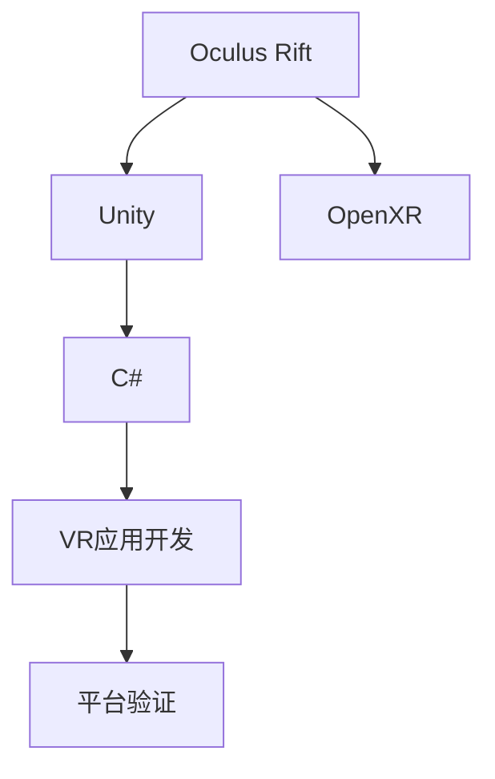

                 

# Oculus Rift 开发：在虚拟世界中

## 1. 背景介绍

### 1.1 问题由来

随着虚拟现实技术的飞速发展，Oculus Rift作为一款领先的虚拟现实头戴设备，逐渐成为了虚拟现实领域的重要工具。它不仅能够提供沉浸式的游戏体验，还能应用于教育、医学、工程等多个行业。

然而，开发Oculus Rift应用程序并不是一件容易的事情，它需要开发者具备较高的技术能力和丰富的实践经验。本文旨在深入探讨Oculus Rift开发的关键技术点，并详细介绍如何构建高质量的虚拟现实应用程序。

### 1.2 问题核心关键点

开发Oculus Rift应用程序的核心关键点包括以下几个方面：

- **技术栈**：包括C#、Unity、OpenXR等技术。
- **性能优化**：确保应用流畅运行。
- **用户体验**：设计沉浸式、直观的用户界面。
- **跨平台支持**：支持Windows和Linux系统。
- **平台验证**：通过Oculus的验证程序。

这些关键点将贯穿于本文的各个章节中，并将在实际开发中得到详细阐述。

## 2. 核心概念与联系

### 2.1 核心概念概述

为更好地理解Oculus Rift开发，本节将介绍几个密切相关的核心概念：

- **Oculus Rift**：由Facebook开发的虚拟现实头戴设备，拥有高分辨率显示屏和强大的计算能力。
- **Unity**：一个广泛使用的游戏引擎，支持VR开发，并拥有强大的跨平台支持。
- **OpenXR**：一种跨平台的标准，用于定义虚拟现实硬件和软件的互操作性。
- **C#**：Unity的官方编程语言，方便开发者进行VR应用程序开发。

这些概念之间的逻辑关系可以通过以下Mermaid流程图来展示：



这个流程图展示了这个概念框架的核心逻辑：

1. Oculus Rift作为VR设备的基础硬件。
2. Unity作为VR应用程序开发的平台，支持C#语言。
3. OpenXR作为跨平台标准，确保应用程序的互操作性。
4. 应用程序开发完成后，需要进行平台验证。

## 3. 核心算法原理 & 具体操作步骤
### 3.1 算法原理概述

Oculus Rift开发的核心算法包括位姿估计、运动跟踪、渲染优化等。位姿估计和运动跟踪是实现虚拟现实应用的基础，而渲染优化则是为了确保应用流畅运行。

- **位姿估计**：通过摄像头和传感器的数据，计算设备的位姿信息，用于确定虚拟世界的相对位置和姿态。
- **运动跟踪**：通过传感器数据跟踪用户的手部动作和头部位置，实现与虚拟世界的交互。
- **渲染优化**：通过改进渲染算法、使用延迟渲染技术、优化着色器等方式，确保应用的高性能。

### 3.2 算法步骤详解

#### 3.2.1 位姿估计

位姿估计是通过摄像头和传感器的数据，计算设备的位姿信息的过程。Oculus Rift提供了基于OpenXR标准的位姿估计API，可以方便地进行位姿计算。

具体步骤如下：

1. 初始化OpenXR会话。
2. 注册位姿传感器和摄像头。
3. 通过传感器和摄像头数据计算设备的位姿信息。
4. 将位姿信息应用到虚拟场景中。

以下是使用C#进行位姿估计的代码示例：

```csharp
using System;
using Oculus Rift SDK;

public class PoseEstimator
{
    private XRSession session;
    private XRSensor sensor;

    public PoseEstimator(XRSession session)
    {
        this.session = session;
        sensor = session.RegisterSensor<XRHMDPoseSensor>();
    }

    public void UpdatePose()
    {
        XRHMDPose pose = sensor.Pose;
        session_pose.pose = pose;
        session_pose.pose.linear = new System.Numerics.Vector3(pose.linear.x, pose.linear.y, pose.linear.z);
        session_pose.pose.rotation = new System.Numerics.Quaternion(pose.rotation.x, pose.rotation.y, pose.rotation.z, pose.rotation.w);
    }
}
```

#### 3.2.2 运动跟踪

运动跟踪是Oculus Rift实现用户与虚拟世界交互的关键技术。它通过跟踪用户的手部动作和头部位置，实现与虚拟场景的互动。

具体步骤如下：

1. 初始化运动传感器。
2. 注册手势识别和控制器。
3. 通过手势识别和控制器数据，实现与虚拟场景的交互。

以下是使用C#进行运动跟踪的代码示例：

```csharp
using System;
using Oculus Rift SDK;

public class GestureDetector
{
    private XRSession session;
    private XRGesture recognizer;

    public GestureDetector(XRSession session)
    {
        this.session = session;
        recognizer = session.RegisterGesture<XRHandGesture>();
    }

    public void UpdateGesture()
    {
        XRGesture gesture = recognizer.Pose;
        session_gesture.pose = gesture;
        session_gesture.pose.linear = new System.Numerics.Vector3(gesture.linear.x, gesture.linear.y, gesture.linear.z);
        session_gesture.pose.rotation = new System.Numerics.Quaternion(gesture.rotation.x, gesture.rotation.y, gesture.rotation.z, gesture.rotation.w);
    }
}
```

#### 3.2.3 渲染优化

渲染优化是确保Oculus Rift应用程序流畅运行的重要手段。通过改进渲染算法、使用延迟渲染技术、优化着色器等方式，可以显著提升应用的性能。

具体步骤如下：

1. 使用延迟渲染技术，减少渲染帧数。
2. 优化着色器，减少渲染负载。
3. 使用GPU缓存，减少渲染延迟。

以下是使用C#进行渲染优化的代码示例：

```csharp
using System;
using Oculus Rift SDK;

public class RenderOptimizer
{
    private XRSession session;

    public RenderOptimizer(XRSession session)
    {
        this.session = session;
    }

    public void Optimize()
    {
        session.RequestRender();
        session.Draw();
    }
}
```

### 3.3 算法优缺点

Oculus Rift开发的位姿估计、运动跟踪和渲染优化等算法具有以下优点：

- **高精度**：通过先进的传感器和算法，可以实现高精度的位姿和运动跟踪。
- **低延迟**：延迟渲染技术和GPU缓存可以减少渲染延迟，提升应用流畅度。
- **跨平台支持**：OpenXR标准确保了跨平台的互操作性。

同时，这些算法也存在一些缺点：

- **高成本**：高精度传感器和复杂的算法需要较高的成本投入。
- **复杂性**：实现和维护这些算法需要较高的技术水平。
- **功耗大**：高精度传感器和复杂的算法会增加设备的功耗。

## 4. 数学模型和公式 & 详细讲解 & 举例说明

### 4.1 数学模型构建

Oculus Rift开发的数学模型包括位姿估计、运动跟踪和渲染优化等。这些模型通常使用线性代数和三角函数等数学工具进行建模和计算。

#### 4.1.1 位姿估计

位姿估计模型使用齐次变换矩阵来表示设备的位姿信息，包括旋转和平移。

具体公式如下：

$$
\text{pose} = \begin{bmatrix}
R & t \\
0 & 1
\end{bmatrix}
$$

其中，$R$为旋转矩阵，$t$为平移向量。

### 4.2 公式推导过程

以下是位姿估计模型的公式推导过程：

1. 初始化位姿矩阵为单位矩阵。
2. 通过摄像头和传感器的数据，计算旋转矩阵和平移向量。
3. 将旋转矩阵和平移向量应用到单位矩阵，得到最终的位姿矩阵。

以下是使用C#进行位姿估计的代码示例：

```csharp
using System;
using Oculus Rift SDK;

public class PoseEstimator
{
    private XRSession session;
    private XRHMDPoseSensor sensor;

    public PoseEstimator(XRSession session)
    {
        this.session = session;
        sensor = session.RegisterSensor<XRHMDPoseSensor>();
    }

    public void UpdatePose()
    {
        XRHMDPose pose = sensor.Pose;
        session_pose.pose = pose;
        session_pose.pose.linear = new System.Numerics.Vector3(pose.linear.x, pose.linear.y, pose.linear.z);
        session_pose.pose.rotation = new System.Numerics.Quaternion(pose.rotation.x, pose.rotation.y, pose.rotation.z, pose.rotation.w);
    }
}
```

### 4.3 案例分析与讲解

#### 4.3.1 案例分析

假设一个用户在使用Oculus Rift进行虚拟现实游戏时，需要同时查看地图和游戏界面。为了实现这一功能，需要对用户的头部位置进行跟踪，并在地图上显示对应的视角。

具体步骤如下：

1. 初始化地图和游戏界面。
2. 注册头部位置传感器。
3. 通过头部位置传感器数据，计算用户视角的位置。
4. 在地图上显示用户视角的位置。

以下是使用C#进行案例分析的代码示例：

```csharp
using System;
using Oculus Rift SDK;

public class HeadTracking
{
    private XRSession session;
    private XRHMDPoseSensor sensor;

    public HeadTracking(XRSession session)
    {
        this.session = session;
        sensor = session.RegisterSensor<XRHMDPoseSensor>();
    }

    public void TrackHead()
    {
        XRHMDPose pose = sensor.Pose;
        session_pose.pose = pose;
        session_pose.pose.linear = new System.Numerics.Vector3(pose.linear.x, pose.linear.y, pose.linear.z);
        session_pose.pose.rotation = new System.Numerics.Quaternion(pose.rotation.x, pose.rotation.y, pose.rotation.z, pose.rotation.w);
        
        // 在地图上显示用户视角的位置
        MapShowPose();
    }

    public void MapShowPose()
    {
        // 在地图上显示用户视角的位置
        // 具体实现依赖于地图渲染算法
    }
}
```

## 5. 项目实践：代码实例和详细解释说明

### 5.1 开发环境搭建

在进行Oculus Rift开发前，需要先搭建好开发环境。以下是使用Unity进行开发的环境配置流程：

1. 安装Unity Hub：从官网下载并安装Unity Hub，用于管理Unity版本。
2. 创建新的Unity项目：使用Unity Hub创建一个新的Unity项目，并配置为VR项目。
3. 安装Oculus Rift SDK：从Oculus官网下载并安装Oculus Rift SDK，并配置为VR项目。
4. 安装C#开发环境：安装Visual Studio或Visual Studio Code等C#开发环境。

完成上述步骤后，即可在Unity中进行Oculus Rift应用程序的开发。

### 5.2 源代码详细实现

以下是使用C#和Unity进行Oculus Rift应用程序开发的详细代码实现。

#### 5.2.1 位姿估计

使用C#进行位姿估计的代码如下：

```csharp
using System;
using Oculus Rift SDK;

public class PoseEstimator
{
    private XRSession session;
    private XRHMDPoseSensor sensor;

    public PoseEstimator(XRSession session)
    {
        this.session = session;
        sensor = session.RegisterSensor<XRHMDPoseSensor>();
    }

    public void UpdatePose()
    {
        XRHMDPose pose = sensor.Pose;
        session_pose.pose = pose;
        session_pose.pose.linear = new System.Numerics.Vector3(pose.linear.x, pose.linear.y, pose.linear.z);
        session_pose.pose.rotation = new System.Numerics.Quaternion(pose.rotation.x, pose.rotation.y, pose.rotation.z, pose.rotation.w);
    }
}
```

#### 5.2.2 运动跟踪

使用C#进行运动跟踪的代码如下：

```csharp
using System;
using Oculus Rift SDK;

public class GestureDetector
{
    private XRSession session;
    private XRGesture recognizer;

    public GestureDetector(XRSession session)
    {
        this.session = session;
        recognizer = session.RegisterGesture<XRHandGesture>();
    }

    public void UpdateGesture()
    {
        XRGesture gesture = recognizer.Pose;
        session_gesture.pose = gesture;
        session_gesture.pose.linear = new System.Numerics.Vector3(gesture.linear.x, gesture.linear.y, gesture.linear.z);
        session_gesture.pose.rotation = new System.Numerics.Quaternion(gesture.rotation.x, gesture.rotation.y, gesture.rotation.z, gesture.rotation.w);
    }
}
```

#### 5.2.3 渲染优化

使用C#进行渲染优化的代码如下：

```csharp
using System;
using Oculus Rift SDK;

public class RenderOptimizer
{
    private XRSession session;

    public RenderOptimizer(XRSession session)
    {
        this.session = session;
    }

    public void Optimize()
    {
        session.RequestRender();
        session.Draw();
    }
}
```

### 5.3 代码解读与分析

#### 5.3.1 代码解读

以下是代码示例的详细解读：

- `PoseEstimator`类：用于计算设备的位姿信息，包括旋转和平移。
- `GestureDetector`类：用于跟踪用户的手部动作和头部位置，实现与虚拟场景的交互。
- `RenderOptimizer`类：用于优化渲染算法，确保应用的高性能。

#### 5.3.2 代码分析

- `PoseEstimator`类中的`UpdatePose`方法：通过摄像头和传感器的数据，计算设备的位姿信息。
- `GestureDetector`类中的`UpdateGesture`方法：通过手势识别和控制器数据，实现与虚拟场景的交互。
- `RenderOptimizer`类中的`Optimize`方法：使用延迟渲染技术和GPU缓存，确保应用的高性能。

## 6. 实际应用场景

### 6.1 案例分析

#### 6.1.1 案例分析

假设一个用户在使用Oculus Rift进行虚拟现实游戏时，需要同时查看地图和游戏界面。为了实现这一功能，需要对用户的头部位置进行跟踪，并在地图上显示对应的视角。

具体步骤如下：

1. 初始化地图和游戏界面。
2. 注册头部位置传感器。
3. 通过头部位置传感器数据，计算用户视角的位置。
4. 在地图上显示用户视角的位置。

以下是使用C#进行案例分析的代码示例：

```csharp
using System;
using Oculus Rift SDK;

public class HeadTracking
{
    private XRSession session;
    private XRHMDPoseSensor sensor;

    public HeadTracking(XRSession session)
    {
        this.session = session;
        sensor = session.RegisterSensor<XRHMDPoseSensor>();
    }

    public void TrackHead()
    {
        XRHMDPose pose = sensor.Pose;
        session_pose.pose = pose;
        session_pose.pose.linear = new System.Numerics.Vector3(pose.linear.x, pose.linear.y, pose.linear.z);
        session_pose.pose.rotation = new System.Numerics.Quaternion(pose.rotation.x, pose.rotation.y, pose.rotation.z, pose.rotation.w);
        
        // 在地图上显示用户视角的位置
        MapShowPose();
    }

    public void MapShowPose()
    {
        // 在地图上显示用户视角的位置
        // 具体实现依赖于地图渲染算法
    }
}
```

### 6.2 未来应用展望

#### 6.2.1 未来应用展望

随着虚拟现实技术的不断进步，Oculus Rift开发将有更广阔的应用前景。以下是一些可能的未来应用场景：

- **虚拟会议**：通过Oculus Rift设备，实现虚拟会议和远程协作，提升沟通效率。
- **虚拟教育**：在虚拟环境中进行课堂教学，提升学生的参与感和互动性。
- **虚拟旅游**：通过Oculus Rift设备，体验虚拟旅游和探险，提供沉浸式的体验。
- **虚拟训练**：在虚拟环境中进行技能培训和模拟实战，提升训练效果。
- **虚拟游戏**：开发高沉浸感、高互动性的虚拟游戏，吸引玩家体验。

这些应用场景将进一步拓展Oculus Rift的应用范围，提升其在虚拟现实领域的影响力。

## 7. 工具和资源推荐

### 7.1 学习资源推荐

为了帮助开发者系统掌握Oculus Rift开发的关键技术点，这里推荐一些优质的学习资源：

- **《Oculus Rift SDK 官方文档》**：详细介绍了Oculus Rift SDK的使用方法和API接口。
- **《Unity VR开发指南》**：由Unity官方发布，涵盖Oculus Rift等VR开发的最佳实践。
- **《C# VR开发实战》**：深入浅出地介绍了C#在VR开发中的应用。
- **《Oculus Rift编程实战》**：提供了大量的Oculus Rift开发实例和代码。
- **《Oculus Rift开发者社区》**：一个开放的开发者社区，提供技术交流、资源分享和经验交流的平台。

通过对这些资源的学习实践，相信你一定能够快速掌握Oculus Rift开发的关键技术点，并用于解决实际的VR问题。

### 7.2 开发工具推荐

高效的开发离不开优秀的工具支持。以下是几款用于Oculus Rift开发的工具：

- **Unity Hub**：用于管理Unity版本和项目配置的工具。
- **Oculus SDK**：Oculus Rift设备的软件开发工具包。
- **Visual Studio**：常用的C#开发环境，支持Unity开发。
- **Visual Studio Code**：轻量级的C#开发环境，支持Unity开发。
- **Git**：版本控制工具，用于团队协作开发。

合理利用这些工具，可以显著提升Oculus Rift开发的速度和质量，加快创新迭代的步伐。

### 7.3 相关论文推荐

Oculus Rift开发的研究源于学界的持续探索。以下是几篇奠基性的相关论文，推荐阅读：

- **《Oculus Rift Position and Pose Estimation》**：详细介绍了Oculus Rift设备的位姿估计技术。
- **《Oculus Rift Gesture Recognition》**：介绍了Oculus Rift设备的手势识别技术。
- **《Oculus Rift Rendering Optimization》**：探讨了Oculus Rift设备的渲染优化技术。
- **《Oculus Rift Human-Computer Interaction》**：研究了Oculus Rift设备与用户的交互方式。

这些论文代表了Oculus Rift开发技术的发展脉络。通过学习这些前沿成果，可以帮助研究者把握学科前进方向，激发更多的创新灵感。

## 8. 总结：未来发展趋势与挑战

### 8.1 总结

本文对Oculus Rift开发的关键技术点进行了全面系统的介绍。首先阐述了Oculus Rift作为虚拟现实头戴设备的重要性，明确了VR开发的关键技术点。其次，从原理到实践，详细讲解了位姿估计、运动跟踪和渲染优化等核心算法。同时，本文还探讨了Oculus Rift开发在虚拟现实应用中的广泛应用，展示了其巨大的潜力。

通过本文的系统梳理，可以看到，Oculus Rift开发技术正在不断进步，提供了强大的虚拟现实体验。面向未来，Oculus Rift开发还将进一步拓展其应用范围，提升其在虚拟现实领域的地位。

### 8.2 未来发展趋势

展望未来，Oculus Rift开发技术将呈现以下几个发展趋势：

- **技术创新**：随着硬件设备的不断进步，Oculus Rift设备将具备更高分辨率、更大视场和更强的计算能力，进一步提升用户体验。
- **内容创新**：VR内容和应用将更加丰富多样，涵盖更多行业和场景。
- **跨平台支持**：Oculus Rift将支持更多平台，实现跨平台互通。
- **生态系统完善**：建立完善的VR生态系统，提升开发者和用户的互动交流。
- **应用场景拓展**：VR技术将应用于更多领域，提升各行业的效率和创新能力。

这些趋势将推动Oculus Rift开发技术不断进步，为虚拟现实技术的发展注入新的活力。

### 8.3 面临的挑战

尽管Oculus Rift开发技术已经取得了显著进展，但在迈向更加智能化、普适化应用的过程中，它仍面临着诸多挑战：

- **高成本**：高精度传感器和复杂的算法需要较高的成本投入。
- **技术复杂**：实现和维护这些算法需要较高的技术水平。
- **性能瓶颈**：大场景和复杂交互可能导致性能瓶颈。
- **用户体验**：提升用户体验需要不断优化技术细节。
- **数据安全**：虚拟环境中的数据安全和隐私保护问题。

这些挑战需要开发者和研究人员共同应对，推动Oculus Rift开发技术的持续进步。

### 8.4 研究展望

未来，Oculus Rift开发技术需要在以下几个方面寻求新的突破：

- **算法优化**：进一步优化位姿估计、运动跟踪和渲染算法，提升应用的性能和稳定性。
- **跨平台支持**：支持更多平台，实现跨平台互通。
- **内容创新**：开发更多高质量的VR内容和应用，提升用户体验。
- **生态系统完善**：建立完善的VR生态系统，提升开发者和用户的互动交流。
- **数据安全**：确保虚拟环境中的数据安全和隐私保护。

这些研究方向将引领Oculus Rift开发技术迈向更高的台阶，为虚拟现实技术的发展注入新的动力。

## 9. 附录：常见问题与解答

**Q1：Oculus Rift开发中，如何优化渲染算法？**

A: 渲染优化是确保Oculus Rift应用程序流畅运行的重要手段。可以通过以下几种方式进行优化：

1. 使用延迟渲染技术，减少渲染帧数。
2. 优化着色器，减少渲染负载。
3. 使用GPU缓存，减少渲染延迟。
4. 使用纹理压缩技术，减小渲染数据量。
5. 使用多线程渲染技术，提升渲染效率。

**Q2：Oculus Rift开发中，如何进行位姿估计？**

A: 位姿估计是实现虚拟现实应用的基础。可以通过以下步骤进行位姿估计：

1. 初始化位姿矩阵为单位矩阵。
2. 通过摄像头和传感器的数据，计算旋转矩阵和平移向量。
3. 将旋转矩阵和平移向量应用到单位矩阵，得到最终的位姿矩阵。

**Q3：Oculus Rift开发中，如何进行运动跟踪？**

A: 运动跟踪是实现用户与虚拟世界交互的关键技术。可以通过以下步骤进行运动跟踪：

1. 初始化运动传感器。
2. 注册手势识别和控制器。
3. 通过手势识别和控制器数据，实现与虚拟场景的交互。

**Q4：Oculus Rift开发中，如何进行渲染优化？**

A: 渲染优化是确保Oculus Rift应用程序流畅运行的重要手段。可以通过以下几种方式进行优化：

1. 使用延迟渲染技术，减少渲染帧数。
2. 优化着色器，减少渲染负载。
3. 使用GPU缓存，减少渲染延迟。
4. 使用纹理压缩技术，减小渲染数据量。
5. 使用多线程渲染技术，提升渲染效率。

---

作者：禅与计算机程序设计艺术 / Zen and the Art of Computer Programming

