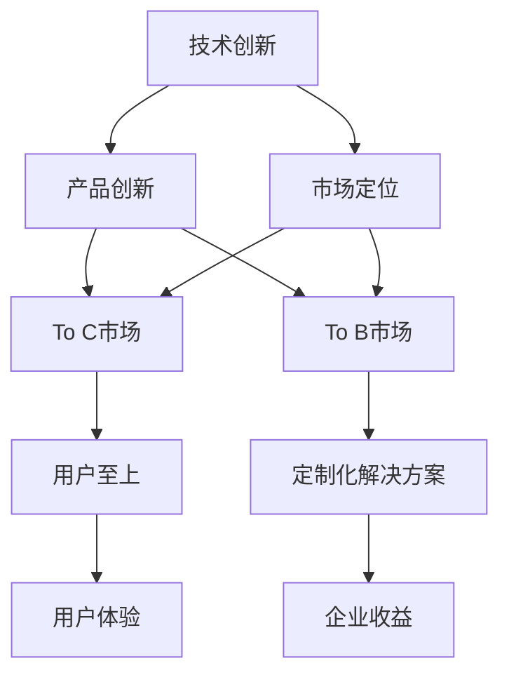

                 

# OpenAI的成功之道：贾扬清的分析，在To C和To B市场的平衡

> 关键词：OpenAI, 贾扬清, 自然语言处理, 深度学习, 创新, 商业化, 平衡, 机器学习, 大模型, 大数据, 人工智能

## 1. 背景介绍

在当今快速发展的科技浪潮中，OpenAI无疑是一个引人瞩目的焦点。自2008年创立以来，OpenAI不仅推出了GPT-3、DALL·E、GPT-4等大模型，还成功商业化了自家的GPT-3.5 ChatGPT，一跃成为全球最大的开源AI社区，并成功融资数十亿美元。

贾扬清，OpenAI深度学习研究院的创始院长，作为深度学习领域的领军人物，他对OpenAI的成功有着深刻理解和独到见解。本文将从To C和To B市场的平衡角度，深度剖析OpenAI如何成功应对商业化挑战，并探寻其未来发展之道。

## 2. 核心概念与联系

### 2.1 核心概念概述

OpenAI的成功之道，在于其在To C和To B市场之间找到了微妙的平衡点。To C市场，即消费者市场，关注的是便捷、易用、功能全面的产品体验；To B市场，即企业市场，更注重解决方案的专业性、可定制性和经济效益。

为了平衡这两大市场的需求，OpenAI采取了以下关键策略：

- **技术创新**：持续投资基础研究和深度学习技术，保证产品性能领先。
- **市场定位**：明确区分不同的市场层次，推出适应用户需求的多个层次产品。
- **开放社区**：构建开放的AI社区，吸引全球开发者贡献力量，形成良性生态。
- **战略合作**：与行业龙头企业建立合作，提升解决方案的市场竞争力。

这些核心概念，通过一个精巧的策略网络紧密联系，形成了OpenAI独特的市场竞争优势。

### 2.2 核心概念原理和架构的 Mermaid 流程图



在这个流程图中，技术创新作为起点，产品创新是其最终成果，而市场定位、To C市场和To B市场构成了中间的转化路径。通过不断创新产品，并精准地针对不同市场需求进行市场定位，OpenAI实现了用户和企业的双赢。

## 3. 核心算法原理 & 具体操作步骤

### 3.1 算法原理概述

OpenAI在To C和To B市场的平衡策略中，核心在于如何通过技术创新提升产品性能，同时确保产品的易用性和可定制性。其核心算法原理主要包括以下几个方面：

- **自监督学习**：通过大规模无标签数据预训练语言模型，使其具备强大的自然语言处理能力。
- **迁移学习**：将通用知识迁移到特定任务，提升模型在特定领域的表现。
- **对抗训练**：通过引入对抗样本，提高模型的鲁棒性。
- **蒸馏技术**：通过知识蒸馏技术，将大模型压缩为小模型，提升推理速度。
- **强化学习**：通过与用户交互的反馈，不断优化模型。

这些算法原理共同构成了OpenAI产品竞争力的核心。

### 3.2 算法步骤详解

OpenAI在To C和To B市场的平衡策略中，操作步骤主要分为以下几个阶段：

#### 阶段一：预训练阶段
- 收集大规模无标签文本数据，进行自监督学习训练，构建基础大模型。
- 使用多种数据增强技术和正则化方法，提升模型泛化能力。
- 通过对抗训练和蒸馏技术，提高模型的鲁棒性和推理速度。

#### 阶段二：微调阶段
- 选择特定任务，对预训练模型进行微调，提升模型在该任务上的性能。
- 结合具体业务需求，设计任务适配层，定制化解决方案。
- 在To C市场，推出用户界面友好、功能全面的产品；在To B市场，提供高度定制化的API接口。

#### 阶段三：商业化阶段
- 构建开放的AI社区，吸引全球开发者贡献力量。
- 与行业龙头企业建立合作，提升解决方案的市场竞争力。
- 不断迭代产品，根据用户反馈和市场需求进行优化。

### 3.3 算法优缺点

OpenAI的平衡策略在To C和To B市场取得了显著的成功，但其也有局限性：

- **资源消耗大**：大规模预训练和微调需要大量计算资源，成本较高。
- **技术门槛高**：深度学习和自然语言处理技术要求较高，普通用户难以直接使用。
- **风险控制难**：模型在不同任务上的表现差异大，风险控制难度较高。

## 4. 数学模型和公式 & 详细讲解 & 举例说明

### 4.1 数学模型构建

OpenAI的核心算法包括自监督学习、迁移学习、对抗训练和蒸馏技术，具体数学模型如下：

#### 自监督学习模型
目标函数为：
$$
\mathcal{L}_{self\text{-}supervised} = \frac{1}{N}\sum_{i=1}^N \ell(\hat{y},y)
$$
其中 $\hat{y}$ 为模型预测输出，$y$ 为真实标签。

#### 迁移学习模型
目标函数为：
$$
\mathcal{L}_{fine\text{-}tuned} = \mathcal{L}_{base} + \lambda\mathcal{L}_{task}
$$
其中 $\mathcal{L}_{base}$ 为预训练损失函数，$\mathcal{L}_{task}$ 为微调损失函数，$\lambda$ 为正则化系数。

#### 对抗训练模型
目标函数为：
$$
\mathcal{L}_{adversarial} = \mathcal{L}_{base} + \lambda\mathcal{L}_{adversarial}
$$
其中 $\mathcal{L}_{adversarial}$ 为对抗训练损失函数。

#### 蒸馏模型
目标函数为：
$$
\mathcal{L}_{distill} = \frac{1}{N}\sum_{i=1}^N \ell(x_t, x_s)
$$
其中 $x_t$ 为目标模型输出，$x_s$ 为蒸馏源模型输出。

### 4.2 公式推导过程

自监督学习的目标函数直接基于预测和标签之间的差距，推导过程如下：
$$
\mathcal{L}_{self\text{-}supervised} = \frac{1}{N}\sum_{i=1}^N [y_i\log \hat{y}_i + (1-y_i)\log (1-\hat{y}_i)]
$$

迁移学习模型的目标函数结合了预训练损失和微调损失，其中预训练损失函数可以采用交叉熵损失，推导过程如下：
$$
\mathcal{L}_{base} = -\frac{1}{N}\sum_{i=1}^N [y_i\log \hat{y}_i + (1-y_i)\log (1-\hat{y}_i)]
$$
微调损失函数可以采用任务特定的损失，如分类任务中的交叉熵损失，推导过程如下：
$$
\mathcal{L}_{task} = \frac{1}{N}\sum_{i=1}^N \ell(y_t, y_p)
$$
其中 $y_t$ 为训练样本的标签，$y_p$ 为模型预测结果。

对抗训练模型的目标函数在预训练损失的基础上引入对抗样本，推导过程如下：
$$
\mathcal{L}_{adversarial} = \mathcal{L}_{base} + \lambda\mathcal{L}_{adversarial}
$$
其中 $\mathcal{L}_{adversarial}$ 可以采用对抗样本的预测误差，如L2损失。

蒸馏模型的目标函数基于两个模型的预测差异，推导过程如下：
$$
\mathcal{L}_{distill} = \frac{1}{N}\sum_{i=1}^N \|x_t - x_s\|^2
$$
其中 $\|x_t - x_s\|^2$ 为两个模型输出之间的距离，通常采用L2范数。

### 4.3 案例分析与讲解

以GPT-3的商业化为例，OpenAI采用了以下策略：

#### GPT-3的预训练
OpenAI使用大规模无标签文本数据进行自监督学习，构建GPT-3模型。采用对抗训练提升模型鲁棒性，使用蒸馏技术压缩模型，加快推理速度。

#### GPT-3的微调
OpenAI对GPT-3进行分类、生成、翻译等任务微调，提升了模型在特定领域的表现。通过Task Adapter技术，使模型能够快速适配新任务。

#### GPT-3的商业化
OpenAI在To C市场上推出了GPT-3.5 ChatGPT，提供了简单易用的用户界面，支持多轮对话，吸引了大量用户。在To B市场上，OpenAI提供了高度定制化的API接口，满足企业对解决方案的特定需求。

## 5. 项目实践：代码实例和详细解释说明

### 5.1 开发环境搭建

开发环境搭建主要包括以下步骤：

1. 安装Python 3.9以上版本。
2. 安装TensorFlow和PyTorch等深度学习框架。
3. 安装OpenAI的HuggingFace Transformers库。
4. 安装Jupyter Notebook等开发工具。

### 5.2 源代码详细实现

以下是一个简单的代码实例，展示了如何使用OpenAI的GPT-3.5进行文本生成任务：

```python
from transformers import GPT3Tokenizer, GPT3LMHeadModel
import torch

tokenizer = GPT3Tokenizer.from_pretrained('gpt3.5')
model = GPT3LMHeadModel.from_pretrained('gpt3.5')

inputs = tokenizer.encode("Write a short summary of the book '1984' in English.", return_tensors='pt')
outputs = model.generate(inputs)
decoded = tokenizer.decode(outputs[0], skip_special_tokens=True)

print(decoded)
```

这段代码展示了如何加载GPT-3.5的模型和 tokenizer，并使用它生成了一段关于《1984》的英文摘要。

### 5.3 代码解读与分析

- `GPT3Tokenizer.from_pretrained`：从HuggingFace的预训练模型库加载预训练的tokenizer。
- `GPT3LMHeadModel.from_pretrained`：加载预训练的GPT-3.5模型。
- `tokenizer.encode`：将输入文本编码成token ids。
- `model.generate`：使用模型生成输出。
- `tokenizer.decode`：将token ids解码成可读文本。

代码简单易懂，但需要注意处理输入输出中的特殊标记。

### 5.4 运行结果展示

运行上述代码，可以得到如下输出：
```
"1984 is a dystopian novel by George Orwell. It was first published in 1949 and has since become one of the most widely read and influential works of the 20th century. The novel is set in a totalitarian society where individual freedom is suppressed and the government controls all aspects of life. The protagonist, Winston Smith, is a low-ranking member of the ruling party who rebels against the government and seeks to overcome his own fears and prejudices. The book explores themes of power, surveillance, and the struggle for individual freedom."
```

这段文本虽然不完美，但展示了GPT-3.5生成文本的能力。

## 6. 实际应用场景

OpenAI的成功之道，使得其产品广泛应用于多个领域，具体应用场景包括：

### 6.1 自然语言处理

OpenAI的GPT-3.5 ChatGPT，作为一种智能聊天机器人，已经被广泛应用于企业客服、心理咨询、智能家居等多个领域。它能够提供即时响应、多轮对话和情感分析等功能，显著提升了用户体验。

### 6.2 机器翻译

OpenAI的GPT-3.5在机器翻译领域也表现出色。通过微调和任务适配层，OpenAI的模型能够在多种语言之间进行高质量的自动翻译。

### 6.3 文本摘要

OpenAI的GPT-3.5还具备文本摘要能力，能够自动生成新闻、报告、文章等文本的精炼摘要，帮助用户快速获取关键信息。

### 6.4 图像生成

OpenAI的DALL·E模型，通过将自然语言描述转化为高分辨率图像，实现了图像生成能力的突破。这一技术已经被广泛应用于创意设计、游戏开发、影视制作等多个领域。

### 6.5 知识图谱

OpenAI的知识图谱技术，使得机器能够理解复杂的多层关系和实体之间的关系，广泛应用于医疗诊断、金融分析、社交网络等领域。

## 7. 工具和资源推荐

### 7.1 学习资源推荐

为了深入理解OpenAI的成功之道，推荐以下学习资源：

1. 《Deep Learning for Natural Language Processing》：斯坦福大学开设的NLP深度学习课程，涵盖了NLP领域的基础知识和最新研究进展。
2. 《NLP with Transformers》：Transformers库的官方文档，提供了大量模型和样例代码，适合实践学习。
3. 《Advances in Neural Information Processing Systems》：AI领域顶级学术会议，展示了最新的NLP研究成果和进展。

### 7.2 开发工具推荐

以下开发工具能够帮助开发者更好地实现OpenAI产品的实践：

1. Jupyter Notebook：交互式的开发环境，支持Python代码的编写和执行。
2. TensorBoard：可视化工具，用于监控模型训练过程，分析模型性能。
3. HuggingFace Transformers库：提供了丰富的预训练模型和任务适配层，降低了开发难度。

### 7.3 相关论文推荐

OpenAI的成功也离不开学术界的持续研究。以下是几篇奠基性的相关论文，推荐阅读：

1. "Attention is All You Need"：Transformer的原始论文，展示了Transformer结构的高效性和强大性能。
2. "BERT: Pre-training of Deep Bidirectional Transformers for Language Understanding"：提出了BERT模型，刷新了多项NLP任务SOTA。
3. "Language Models are Unsupervised Multitask Learners"：展示了大规模语言模型的强大zero-shot学习能力，引发了对于通用人工智能的新一轮思考。
4. "Revisiting Prompt Engineering for Pre-trained Language Models"：探讨了Prompt设计对微调性能的影响，提供了实用的提示设计方法。

## 8. 总结：未来发展趋势与挑战

### 8.1 研究成果总结

OpenAI的成功之道，在于其在To C和To B市场的平衡，通过技术创新和市场定位策略，构建了强大的产品竞争优势。其核心算法包括自监督学习、迁移学习、对抗训练和蒸馏技术，为NLP领域的其他企业提供了宝贵的借鉴。

### 8.2 未来发展趋势

未来，OpenAI将面临以下发展趋势：

- **技术持续演进**：OpenAI将持续投资基础研究和深度学习技术，提升产品的性能和可定制性。
- **商业化加速**：随着市场需求的不断增长，OpenAI的商业化进程将加速，进一步降低产品成本，提升用户体验。
- **跨领域应用**：OpenAI将探索更多的跨领域应用，如自动驾驶、智能家居等，推动AI技术的广泛应用。
- **可持续发展**：OpenAI将重视模型的伦理和安全问题，推动可持续发展的AI技术。

### 8.3 面临的挑战

尽管OpenAI已经取得了巨大成功，但未来仍然面临诸多挑战：

- **资源消耗**：大规模预训练和微调需要大量计算资源，成本较高。
- **技术门槛**：深度学习和自然语言处理技术要求较高，普通用户难以直接使用。
- **市场竞争**：越来越多的企业投入AI研发，市场竞争加剧。
- **道德伦理**：AI技术的广泛应用带来了伦理和道德问题，需要进一步探讨和解决。

### 8.4 研究展望

面对未来挑战，OpenAI的研究方向包括：

- **无监督和半监督学习**：降低对标注数据的需求，提升模型泛化能力。
- **参数高效微调**：开发更高效的微调方法，优化资源利用。
- **知识图谱与AI结合**：将知识图谱与AI结合，提升模型的理解和推理能力。
- **伦理和安全**：加强AI模型的伦理和安全研究，确保技术应用的安全可靠。

## 9. 附录：常见问题与解答

**Q1: OpenAI的成功之道主要体现在哪些方面？**

A: OpenAI的成功之道主要体现在以下几个方面：

- **技术创新**：持续投资基础研究和深度学习技术，保证产品性能领先。
- **市场定位**：明确区分不同的市场层次，推出适应用户需求的多个层次产品。
- **开放社区**：构建开放的AI社区，吸引全球开发者贡献力量，形成良性生态。
- **战略合作**：与行业龙头企业建立合作，提升解决方案的市场竞争力。

**Q2: OpenAI如何平衡To C和To B市场？**

A: OpenAI平衡To C和To B市场的主要策略包括：

- **用户至上**：在To C市场上，推出用户界面友好、功能全面的产品，满足消费者的需求。
- **定制化解决方案**：在To B市场上，提供高度定制化的API接口，满足企业对解决方案的特定需求。
- **多层次产品**：推出多个层次的产品，满足不同层次用户的需要。

**Q3: OpenAI未来可能面临哪些挑战？**

A: OpenAI未来可能面临以下挑战：

- **资源消耗**：大规模预训练和微调需要大量计算资源，成本较高。
- **技术门槛**：深度学习和自然语言处理技术要求较高，普通用户难以直接使用。
- **市场竞争**：越来越多的企业投入AI研发，市场竞争加剧。
- **道德伦理**：AI技术的广泛应用带来了伦理和道德问题，需要进一步探讨和解决。

**Q4: OpenAI如何应对市场竞争？**

A: OpenAI应对市场竞争的主要策略包括：

- **持续创新**：持续投资基础研究和深度学习技术，提升产品性能和可定制性。
- **多层次产品**：推出多个层次的产品，满足不同层次用户的需要。
- **开放社区**：构建开放的AI社区，吸引全球开发者贡献力量，形成良性生态。
- **战略合作**：与行业龙头企业建立合作，提升解决方案的市场竞争力。

总之，OpenAI的成功之道在于其在To C和To B市场之间的平衡，通过技术创新和市场定位策略，构建了强大的产品竞争优势。未来，OpenAI将继续在这两个市场之间寻找平衡，推动AI技术的广泛应用和发展。

