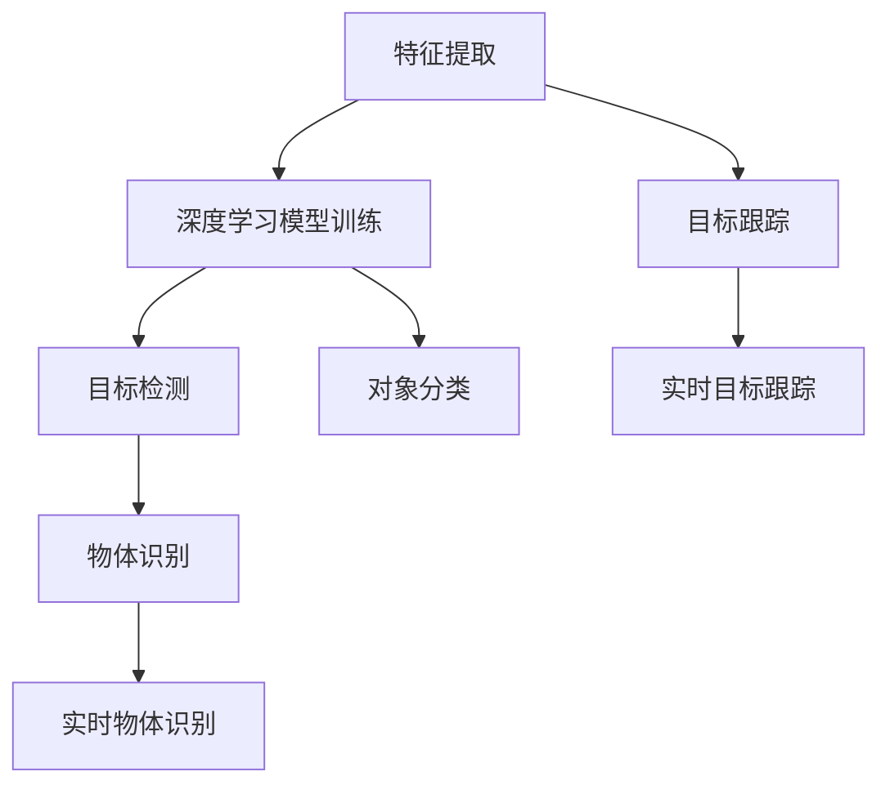

                 

# OpenCV 图像处理：对象检测和识别

> 关键词：OpenCV, 图像处理, 对象检测, 目标识别, 深度学习, 特征提取, 卷积神经网络, 对象跟踪

## 1. 背景介绍

### 1.1 问题由来
随着计算机视觉技术的不断进步，图像处理和分析在众多领域中得到了广泛应用。例如，自动驾驶、医疗影像分析、安防监控、智能家居等。在这些应用场景中，准确、高效地识别和跟踪物体是实现智能决策和操作的前提。

对象检测和识别技术，即从图像或视频中自动检测出物体的位置和类别，是计算机视觉领域的一大挑战。传统的基于模板匹配和特征描述符的方法已经不能满足高精度和高效率的要求。近年来，随着深度学习技术的发展，基于深度学习的方法在对象检测和识别任务中取得了重大突破，得到了工业界和学术界的广泛关注。

OpenCV是一款广泛应用的计算机视觉开源库，提供了丰富的图像处理和分析功能。其内置的机器学习模块支持多种深度学习模型，特别是针对对象检测和识别任务，提供了深度学习和传统方法的混合解决方案。本文将深入探讨OpenCV中对象检测和识别的实现原理和应用场景，通过具体实例和代码分析，帮助读者掌握这一重要技术。

### 1.2 问题核心关键点
OpenCV中对象检测和识别的关键技术点包括：
- 特征提取：从图像中提取有效的特征描述符，用于训练深度学习模型。
- 深度学习模型：基于深度神经网络的对象检测和识别模型，如Faster R-CNN、YOLO、SSD等。
- 目标跟踪：基于深度学习的方法对物体进行持续跟踪，如基于目标检测的跟踪算法。
- 应用场景：广泛应用于自动驾驶、安防监控、医疗影像分析等领域。

这些技术点构成了OpenCV中对象检测和识别任务的基础，帮助其在不同的应用场景中发挥重要作用。

## 2. 核心概念与联系

### 2.1 核心概念概述

为更好地理解OpenCV中对象检测和识别的实现原理，本节将介绍几个密切相关的核心概念：

- **特征提取**：从图像中提取有效的特征描述符，用于训练深度学习模型。常见的特征提取方法包括SIFT、SURF、ORB等。
- **深度学习模型**：基于深度神经网络的对象检测和识别模型，如Faster R-CNN、YOLO、SSD等。这些模型通常由多个卷积层、池化层、全连接层等组成，通过反向传播算法优化模型参数。
- **目标跟踪**：基于深度学习的方法对物体进行持续跟踪，如基于目标检测的跟踪算法。常见的方法包括Siam RNN、CFNet等。
- **应用场景**：广泛应用于自动驾驶、安防监控、医疗影像分析等领域。例如，在自动驾驶中，通过对象检测和识别，实现车辆和行人的精准定位；在安防监控中，通过目标跟踪，实时监控异常行为。

这些核心概念之间的逻辑关系可以通过以下Mermaid流程图来展示：



这个流程图展示了特征提取、深度学习模型训练、目标跟踪、目标检测、物体识别、实时目标跟踪和对象分类之间的联系：

1. 特征提取：从图像中提取特征描述符。
2. 深度学习模型训练：利用提取的特征训练深度学习模型。
3. 目标跟踪：基于深度学习模型实现物体跟踪。
4. 目标检测：从图像中检测出物体的位置和类别。
5. 物体识别：识别物体的具体类别。
6. 实时目标跟踪：对物体进行持续跟踪，更新物体位置。
7. 对象分类：将物体分类到特定的类别中。

这些概念共同构成了OpenCV中对象检测和识别任务的技术框架，使得开发者能够高效地实现各种计算机视觉应用。

## 3. 核心算法原理 & 具体操作步骤
### 3.1 算法原理概述

OpenCV中的对象检测和识别算法，主要基于深度学习技术，特别是卷积神经网络（CNN）。其核心思想是：通过大规模数据集进行预训练，提取特征描述符，并在目标检测和识别任务中进行微调，以识别图像或视频中的物体。

具体流程包括以下几个关键步骤：
1. 数据准备：收集并标注大量图像和视频数据，划分为训练集、验证集和测试集。
2. 特征提取：使用预训练的特征提取模型，如VGG、ResNet等，提取图像特征。
3. 模型训练：基于提取的特征，使用深度学习框架（如TensorFlow、Keras、PyTorch等）训练目标检测和识别模型。
4. 目标检测：在新的图像或视频数据上，使用训练好的模型进行目标检测，识别出物体的位置和类别。
5. 目标跟踪：对识别出的物体进行持续跟踪，更新物体位置。

### 3.2 算法步骤详解

以下是OpenCV中进行对象检测和识别的详细步骤：

**Step 1: 数据准备**
- 收集并标注大量图像和视频数据，通常需要数千张图像和数小时的视频数据。标注数据集可以用于训练和验证深度学习模型。
- 使用OpenCV中的CascadeClassifier或HOGDescriptor等工具，生成训练数据集。

**Step 2: 特征提取**
- 选择预训练的特征提取模型，如VGG、ResNet等。在OpenCV中，可以使用cv2.dnn.readNetFromCaffe()函数加载预训练模型。
- 将图像数据输入模型，提取特征描述符。

**Step 3: 模型训练**
- 使用深度学习框架（如TensorFlow、Keras、PyTorch等），基于提取的特征描述符，训练目标检测和识别模型。
- 常用的目标检测模型包括Faster R-CNN、YOLO、SSD等。OpenCV中提供了对这些模型的支持。

**Step 4: 目标检测**
- 在新的图像或视频数据上，使用训练好的模型进行目标检测。
- 在OpenCV中，可以使用cv2.dnn.readNetFromCaffe()函数加载训练好的模型，并使用cv2.dnn.blobFromImage()函数生成模型输入。
- 模型输出包括物体的位置和类别，可以通过OpenCV的detectionResult对象获取。

**Step 5: 目标跟踪**
- 对识别出的物体进行持续跟踪，更新物体位置。
- 在OpenCV中，可以使用cv2.TrackerKCF()等工具实现目标跟踪。
- 跟踪过程包括计算物体的位置、大小、方向等信息，并更新物体位置。

### 3.3 算法优缺点

OpenCV中的对象检测和识别算法具有以下优点：
1. 精度高：基于深度学习的方法，能够准确识别图像或视频中的物体。
2. 速度较快：OpenCV中提供了多种加速技术，如卷积运算优化、GPU加速等，能够快速处理大规模数据。
3. 应用广泛：适用于自动驾驶、安防监控、医疗影像分析等多个领域。
4. 开源免费：OpenCV是一款开源免费库，社区活跃，资源丰富。

同时，该方法也存在一定的局限性：
1. 数据需求大：需要大量标注数据，获取标注数据的成本较高。
2. 模型较大：深度学习模型参数较多，内存和计算资源需求较高。
3. 鲁棒性差：对光照、遮挡、视角变化等较为敏感，识别精度可能受到影响。
4. 迁移能力有限：不同数据集训练的模型，迁移能力可能较弱。

尽管存在这些局限性，但就目前而言，基于深度学习的方法在对象检测和识别任务中仍是最为有效的。未来相关研究的重点在于如何进一步降低对标注数据的依赖，提高模型的迁移能力和鲁棒性，同时兼顾速度和精度。

### 3.4 算法应用领域

OpenCV中的对象检测和识别算法，在众多领域中得到了广泛应用：

- 自动驾驶：通过对象检测和识别，实现车辆和行人的精准定位，辅助自动驾驶决策。
- 安防监控：实时监控视频中的异常行为，及时预警。
- 医疗影像分析：自动识别影像中的病变区域，辅助医生诊断。
- 智能家居：识别环境中的物体和人物，实现智能家居功能。
- 工业检测：对生产线上缺陷或异常进行检测和分类。

这些领域的应用，展示了OpenCV在计算机视觉中的强大能力和广泛适用性。

## 4. 数学模型和公式 & 详细讲解 & 举例说明（备注：数学公式请使用latex格式，latex嵌入文中独立段落使用 $$，段落内使用 $)
### 4.1 数学模型构建

OpenCV中的对象检测和识别算法，主要基于深度学习技术，特别是卷积神经网络（CNN）。其核心思想是：通过大规模数据集进行预训练，提取特征描述符，并在目标检测和识别任务中进行微调，以识别图像或视频中的物体。

数学上，可以将对象检测和识别任务看作分类问题。给定一张图像，目标检测和识别模型的任务是预测图像中包含的物体类别，并确定每个物体的位置。这可以通过多阶段过程实现：
1. 特征提取阶段：使用卷积神经网络提取图像特征。
2. 区域提议阶段：生成候选物体的位置信息。
3. 物体分类阶段：对每个候选位置进行分类和回归。

### 4.2 公式推导过程

以下以Faster R-CNN模型为例，推导其在OpenCV中的实现过程。

Faster R-CNN模型的核心是一个深度卷积神经网络，包括特征提取网络（ backbone network）和RPN（Region Proposal Network）网络。特征提取网络通常使用VGG、ResNet等，用于提取图像特征。RPN网络用于生成候选物体的位置信息。

在特征提取网络中，卷积层和池化层交替堆叠，提取图像特征。以VGG16为例，特征提取网络的输出可以表示为：
$$
f(x) = \mathcal{F}([x], \theta)
$$
其中，$[x]$表示输入图像，$\mathcal{F}$表示特征提取网络，$\theta$表示网络参数。

在RPN网络中，输入特征图$f(x)$通过一系列卷积层和池化层，生成候选物体的位置信息。RPN网络的输出可以表示为：
$$
r(x) = \mathcal{R}([f(x)], \theta)
$$
其中，$\mathcal{R}$表示RPN网络，$\theta$表示网络参数。

在物体分类阶段，对每个候选位置$r(x)$进行分类和回归。假设每个候选位置对应一个物体类别$c$和一个边界框位置$b$，则分类器输出可以表示为：
$$
p(x) = \mathcal{P}([r(x)], \theta)
$$
其中，$\mathcal{P}$表示分类器，$\theta$表示网络参数。

将上述三个阶段组合起来，可以得到Faster R-CNN的完整模型。在训练过程中，通过最小化交叉熵损失和回归损失，优化网络参数。

### 4.3 案例分析与讲解

以自动驾驶中的对象检测和识别为例，分析OpenCV中该任务的实现过程。

**Step 1: 数据准备**
- 收集并标注大量自动驾驶场景的图像和视频数据，例如车辆、行人、交通标志等。
- 使用OpenCV中的CascadeClassifier或HOGDescriptor等工具，生成训练数据集。

**Step 2: 特征提取**
- 使用预训练的特征提取模型，如VGG16。在OpenCV中，可以使用cv2.dnn.readNetFromCaffe()函数加载预训练模型。
- 将自动驾驶场景的图像数据输入模型，提取特征描述符。

**Step 3: 模型训练**
- 使用深度学习框架（如TensorFlow、Keras、PyTorch等），基于提取的特征描述符，训练目标检测和识别模型。
- 常用的目标检测模型包括Faster R-CNN、YOLO、SSD等。OpenCV中提供了对这些模型的支持。

**Step 4: 目标检测**
- 在新的自动驾驶场景的图像或视频数据上，使用训练好的模型进行目标检测。
- 在OpenCV中，可以使用cv2.dnn.readNetFromCaffe()函数加载训练好的模型，并使用cv2.dnn.blobFromImage()函数生成模型输入。
- 模型输出包括物体的位置和类别，可以通过OpenCV的detectionResult对象获取。

**Step 5: 目标跟踪**
- 对识别出的物体进行持续跟踪，更新物体位置。
- 在OpenCV中，可以使用cv2.TrackerKCF()等工具实现目标跟踪。
- 跟踪过程包括计算物体的位置、大小、方向等信息，并更新物体位置。

## 5. 项目实践：代码实例和详细解释说明
### 5.1 开发环境搭建

在进行OpenCV中的对象检测和识别实践前，我们需要准备好开发环境。以下是使用Python进行OpenCV开发的环境配置流程：

1. 安装Anaconda：从官网下载并安装Anaconda，用于创建独立的Python环境。

2. 创建并激活虚拟环境：
```bash
conda create -n opencv-env python=3.8 
conda activate opencv-env
```

3. 安装OpenCV：根据操作系统版本，从官网获取对应的安装命令。例如：
```bash
pip install opencv-python-headless opencv-contrib-python-headless
```

4. 安装深度学习工具包：
```bash
pip install tensorflow keras pytorch
```

5. 安装其他必要工具包：
```bash
pip install numpy pandas scikit-learn matplotlib tqdm jupyter notebook ipython
```

完成上述步骤后，即可在`opencv-env`环境中开始OpenCV的开发实践。

### 5.2 源代码详细实现

下面我们以OpenCV中的YOLO（You Only Look Once）目标检测为例，给出YOLO的Python代码实现。

首先，定义YOLO的训练函数：

```python
from cv2 import dnn
import numpy as np

def train_yolo(data_dir, save_model_path):
    # 加载训练数据集
    class_names = []
    train_images, train_labels = [], []
    with open(data_dir + 'train.txt') as f:
        for line in f:
            image, label = line.strip().split(' ')
            class_names.append(label.split(','))
            train_images.append(cv2.imread(image))
            train_labels.append([int(x) for x in label.split(',')])
    class_names = np.array(class_names)
    
    # 加载YOLO模型
    net = dnn.readNetFromDarknet(data_dir + 'yolov3.cfg', save_model_path)
    layer_names = net.getLayerNames()
    output_layers = [layer_names[i[0] - 1] for i in net.getUnconnectedOutLayers()]
    
    # 训练YOLO模型
    train_data = []
    for image, label in zip(train_images, train_labels):
        blob = cv2.dnn.blobFromImage(image, scalefactor=1/255.0, size=(448, 448), swapRB=True, crop=False)
        net.setInput(blob)
        outputs = net.forward(output_layers)
        train_data.append((outputs, label))
    
    # 保存训练数据
    np.save('train_data.npy', train_data)
    
    # 保存类别标签
    np.save('class_names.npy', class_names)
```

接着，定义YOLO的预测函数：

```python
def predict_yolo(model_path, image_path):
    # 加载YOLO模型
    net = dnn.readNetFromDarknet(model_path, model_path)
    layer_names = net.getLayerNames()
    output_layers = [layer_names[i[0] - 1] for i in net.getUnconnectedOutLayers()]
    
    # 加载图像
    image = cv2.imread(image_path)
    blob = cv2.dnn.blobFromImage(image, scalefactor=1/255.0, size=(448, 448), swapRB=True, crop=False)
    
    # 进行预测
    net.setInput(blob)
    outputs = net.forward(output_layers)
    
    # 解析预测结果
    results = []
    for output in outputs:
        for detection in output:
            scores = detection[5:]
            class_ids = np.argmax(scores)
            confidence = scores[class_ids]
            if confidence > 0.5:
                results.append((image.shape[0], image.shape[1], class_ids, confidence))
    
    # 可视化结果
    for result in results:
        x, y, class_id, confidence = result
        class_name = class_names[class_id]
        cv2.rectangle(image, (x, y), (x+10, y+10), (0, 255, 0), 2)
        cv2.putText(image, f'{class_name} {confidence:.2f}', (x, y), cv2.FONT_HERSHEY_PLAIN, 1, (0, 255, 0), 2)
    
    # 显示结果
    cv2.imshow('YOLO Result', image)
    cv2.waitKey(0)
    cv2.destroyAllWindows()
```

最后，启动YOLO训练流程并在图像上展示预测结果：

```python
# 训练YOLO模型
train_yolo(data_dir, save_model_path)

# 加载训练好的YOLO模型
predict_yolo(model_path, image_path)
```

以上就是使用OpenCV进行YOLO目标检测的完整代码实现。可以看到，借助OpenCV，开发者可以轻松地进行目标检测和识别的实现，并直观地展示预测结果。

### 5.3 代码解读与分析

让我们再详细解读一下关键代码的实现细节：

**train_yolo函数**：
- 定义了YOLO模型的训练过程。
- 加载训练数据集，包括图像和标签。
- 加载YOLO模型，设置输出层。
- 生成训练数据，包括模型输入和标签。
- 保存训练数据和类别标签。

**predict_yolo函数**：
- 定义了YOLO模型的预测过程。
- 加载YOLO模型，设置输出层。
- 加载待预测的图像，生成模型输入。
- 进行预测，获取输出结果。
- 解析预测结果，并在图像上绘制矩形框和类别标签。

**训练和预测流程**：
- 训练阶段：加载训练数据集，生成训练数据，训练YOLO模型，保存训练结果。
- 预测阶段：加载训练好的YOLO模型，加载待预测的图像，进行预测，并展示结果。

可以看到，OpenCV提供了丰富的图像处理和分析功能，使得目标检测和识别的实现变得简单高效。开发者可以使用OpenCV中的深度学习模块，方便地进行模型的训练和预测。

## 6. 实际应用场景
### 6.1 智能交通管理

在智能交通管理中，基于OpenCV的目标检测和识别技术，可以实现车辆和行人的精准定位和行为分析。通过实时监控交通视频，检测车辆、行人和交通标志，分析交通流量、拥堵情况，辅助交通管理决策。

具体而言，可以在交叉口或道路上安装摄像头，采集交通视频。使用OpenCV中的目标检测和识别算法，实时分析视频中的物体，判断是否存在交通违规行为。例如，检测行人闯红灯、车辆违规变道等，及时进行预警和处罚。

### 6.2 医疗影像分析

在医疗影像分析中，基于OpenCV的目标检测和识别技术，可以实现病变区域的自动检测和分类。通过扫描患者影像，检测出病灶、肿瘤等异常区域，辅助医生诊断。

具体而言，可以将患者影像输入OpenCV中，使用目标检测和识别算法，检测出异常区域。然后，使用分类算法，将异常区域分类为不同的病变类型，如肺癌、乳腺癌等。通过可视化结果，医生可以直观地了解患者的病情，辅助诊断和治疗。

### 6.3 工业检测

在工业检测中，基于OpenCV的目标检测和识别技术，可以实现生产线上缺陷和异常的检测和分类。通过实时监控生产线上的产品，检测出缺陷或异常，进行分类和处理。

具体而言，可以在生产线上安装摄像头，采集产品图像。使用OpenCV中的目标检测和识别算法，检测出产品缺陷或异常。然后，使用分类算法，将缺陷或异常分类为不同的类型，如划痕、变形等。通过可视化结果，工人可以及时发现和处理产品缺陷，提高产品质量。

### 6.4 未来应用展望

随着OpenCV中目标检测和识别算法的不断发展，其应用领域将不断扩展，带来更多的技术创新和应用场景：

1. 增强现实（AR）：通过目标检测和识别，实现虚拟物体的实时叠加和交互。
2. 机器人导航：使用目标检测和识别技术，实现机器人对环境的精准感知和导航。
3. 自动驾驶：通过目标检测和识别，实现车辆和行人的精准定位，辅助自动驾驶决策。
4. 智能家居：使用目标检测和识别技术，实现智能家居功能的自动化和智能化。
5. 公共安全：通过目标检测和识别，实时监控公共场所，防范异常行为。

这些应用场景展示了OpenCV在计算机视觉中的强大能力和广泛适用性，相信未来还将有更多创新应用不断涌现。

## 7. 工具和资源推荐
### 7.1 学习资源推荐

为了帮助开发者掌握OpenCV中的对象检测和识别技术，这里推荐一些优质的学习资源：

1. OpenCV官方文档：提供了OpenCV库的详细文档和示例代码，适合新手入门和进阶。

2. PyImageSearch：提供了一系列OpenCV图像处理的教程和实战案例，帮助开发者系统掌握OpenCV技术。

3. 《OpenCV 计算机视觉编程》书籍：系统介绍了OpenCV库的功能和应用，适合有一定编程基础的读者。

4. Kaggle竞赛：参加OpenCV相关的图像处理和计算机视觉竞赛，实战提升技能。

5. Coursera课程：提供了一系列计算机视觉和图像处理的在线课程，帮助开发者系统学习相关知识。

通过对这些资源的学习实践，相信你一定能够快速掌握OpenCV中的对象检测和识别技术，并用于解决实际的计算机视觉问题。

### 7.2 开发工具推荐

高效的开发离不开优秀的工具支持。以下是几款用于OpenCV开发的高效工具：

1. PyCharm：功能强大的Python IDE，提供代码高亮、自动补全、调试等功能，适合进行OpenCV开发。

2. VSCode：轻量级的IDE，支持Python、C++等多种语言，集成OpenCV插件，适合快速开发。

3. Jupyter Notebook：交互式的Python开发环境，适合进行数据可视化和算法验证。

4. TensorBoard：TensorFlow配套的可视化工具，可以实时监测模型训练状态，提供丰富的图表呈现方式。

5. Weights & Biases：模型训练的实验跟踪工具，记录和可视化模型训练过程中的各项指标，方便对比和调优。

6. Anaconda：提供虚拟环境管理，方便开发者快速搭建和管理开发环境。

合理利用这些工具，可以显著提升OpenCV开发效率，快速迭代和优化算法。

### 7.3 相关论文推荐

OpenCV中的对象检测和识别技术不断发展，涌现了大量前沿研究成果。以下是几篇具有代表性的相关论文，推荐阅读：

1. R-CNN: Object Detection with R-CNN（2014）：提出R-CNN模型，基于区域提议网络实现目标检测。

2. Faster R-CNN: Towards Real-Time Object Detection with Region Proposal Networks（2015）：改进R-CNN，提出Faster R-CNN模型，加速目标检测。

3. YOLO: Real-Time Object Detection（2016）：提出YOLO模型，通过单个神经网络实现实时目标检测。

4. SSD: Single Shot MultiBox Detector（2016）：提出SSD模型，通过单个神经网络实现多尺度目标检测。

5. RetinaNet: Focal Loss for Dense Object Detection（2017）：提出RetinaNet模型，通过改进损失函数提高小物体检测效果。

这些论文展示了OpenCV中对象检测和识别技术的发展脉络，帮助开发者深入理解相关算法。

## 8. 总结：未来发展趋势与挑战
### 8.1 总结

本文对OpenCV中对象检测和识别技术进行了全面系统的介绍。首先阐述了对象检测和识别技术的背景和意义，明确了其在计算机视觉中的重要地位。其次，从原理到实践，详细讲解了OpenCV中的深度学习模型、特征提取、目标检测和识别等关键技术，通过具体实例和代码分析，帮助读者掌握这一重要技术。

通过本文的系统梳理，可以看到，OpenCV在计算机视觉中的应用广泛，具有强大的图像处理和分析能力。其在对象检测和识别任务中表现出色，能够准确识别图像或视频中的物体，并实时进行跟踪。未来，OpenCV将不断融入更多前沿技术和应用场景，为计算机视觉技术的进步贡献力量。

### 8.2 未来发展趋势

展望未来，OpenCV中的对象检测和识别技术将呈现以下几个发展趋势：

1. 深度学习模型的提升：随着深度学习技术的不断发展，基于卷积神经网络的目标检测和识别模型将更加强大和高效。

2. 多模态融合：未来的目标检测和识别技术将不再局限于单一模态数据，而是融合图像、视频、传感器等多种数据，实现更加全面和精确的物体识别。

3. 实时性和低延迟：随着硬件性能的提升和算法优化，目标检测和识别算法的实时性和低延迟将进一步提高，适应更多实时应用场景。

4. 可解释性和可控性：未来的目标检测和识别算法将更加注重可解释性和可控性，帮助用户理解算法的决策过程，提高系统的可信度。

5. 端到端优化：未来的目标检测和识别算法将更加注重端到端优化，从数据采集、模型训练到推理部署，形成一个完整的系统，提高系统的整体效率和效果。

这些趋势凸显了OpenCV在计算机视觉中的重要地位和广阔前景，相信未来将有更多创新应用不断涌现，推动计算机视觉技术的持续发展。

### 8.3 面临的挑战

尽管OpenCV中的对象检测和识别技术已经取得了显著进展，但在迈向更加智能化、普适化应用的过程中，仍面临诸多挑战：

1. 数据获取成本高：高质量标注数据的获取成本较高，需要大量人力和时间。

2. 算法复杂度高：深度学习模型参数较多，训练和推理需要高性能计算资源。

3. 鲁棒性不足：对光照、遮挡、视角变化等较为敏感，识别精度可能受到影响。

4. 模型泛化能力弱：不同数据集训练的模型，迁移能力可能较弱，难以适应新场景。

5. 可解释性差：深度学习模型具有"黑盒"特性，难以解释其内部工作机制和决策逻辑。

尽管存在这些挑战，但通过不断探索和优化，OpenCV中的对象检测和识别技术仍有很大的发展潜力，未来必将在计算机视觉领域发挥重要作用。

### 8.4 研究展望

面对OpenCV中对象检测和识别技术的诸多挑战，未来的研究需要在以下几个方面寻求新的突破：

1. 无监督和半监督学习：探索不依赖标注数据的学习方法，利用自监督学习、主动学习等技术，最大限度利用非结构化数据。

2. 轻量化模型设计：开发更轻量化的目标检测和识别模型，在固定大部分预训练参数的情况下，只更新极少量的任务相关参数。

3. 多任务学习：研究多任务学习技术，让目标检测和识别算法同时学习多个任务，提高模型的泛化能力和迁移能力。

4. 鲁棒性增强：提高模型对光照、遮挡、视角变化等干扰的鲁棒性，增强模型的泛化能力。

5. 端到端训练：探索端到端训练方法，从数据采集、模型训练到推理部署，形成一个完整的系统，提高系统的整体效率和效果。

6. 可解释性提升：通过因果分析、博弈论等工具，增强目标检测和识别算法的可解释性和可控性，提高系统的可信度。

这些研究方向将推动OpenCV中的对象检测和识别技术不断进步，为计算机视觉技术的未来发展贡献力量。

## 9. 附录：常见问题与解答

**Q1: OpenCV中的对象检测和识别算法需要多少标注数据？**

A: OpenCV中的深度学习模型通常需要大量的标注数据进行训练。一般而言，每张图像需要至少几十个标注框，标注框包含物体的位置和类别信息。标注数据的质量对模型性能有重要影响，标注应当准确、完整、一致。

**Q2: OpenCV中常用的目标检测算法有哪些？**

A: OpenCV中常用的目标检测算法包括YOLO、Faster R-CNN、SSD等。这些算法具有不同的特点和应用场景，开发者可以根据具体需求选择合适的算法。

**Q3: 如何使用OpenCV实现目标跟踪？**

A: 使用OpenCV中的深度学习模块，可以加载预训练的目标跟踪模型，如Siam RNN、CFNet等，进行目标跟踪。通过实时采集物体的位置和大小信息，更新物体位置，实现持续跟踪。

**Q4: OpenCV中目标检测和识别算法的精度如何？**

A: OpenCV中的深度学习模型通常具有较高的精度，能够准确识别图像或视频中的物体。但是，模型的精度也受到训练数据质量、参数设置、硬件性能等因素的影响。

**Q5: OpenCV中如何处理图像和视频数据？**

A: 使用OpenCV中的dnn模块，可以方便地加载图像和视频数据，进行特征提取、模型训练和预测。常用的图像和视频处理函数包括cv2.imread()、cv2.dnn.blobFromImage()等。

这些问答帮助读者更好地理解OpenCV中的对象检测和识别技术，并应用于实际开发中。

---

作者：禅与计算机程序设计艺术 / Zen and the Art of Computer Programming

