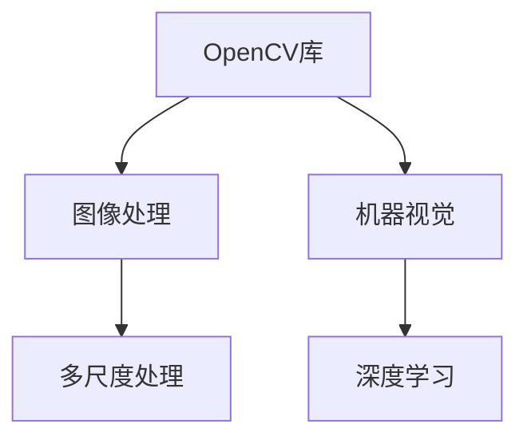

                 

# OpenCV计算机视觉：图像处理和机器视觉实践

## 1. 背景介绍

计算机视觉(Computer Vision, CV)是人工智能(AI)领域的一个重要分支，其研究如何使计算机通过图像和视频等视觉信息来理解和解释现实世界。计算机视觉技术在自动驾驶、机器人、医疗影像分析、安全监控等领域有着广泛的应用前景。OpenCV作为开源计算机视觉库，提供了强大的图像处理和机器视觉工具，广泛应用于工业界和学术界。

OpenCV诞生于2000年，由Intel公司支持，社区驱动，由众多开源贡献者共同维护。OpenCV提供了丰富的图像处理和计算机视觉算法，广泛应用于图像采集、特征提取、物体检测、跟踪、图像分割、人脸识别、目标识别、立体视觉、运动分析等多个领域。

OpenCV拥有完善的文档、示例和教程，适合初学者和高级开发者使用。基于OpenCV，可以开发高性能的计算机视觉应用，同时具备跨平台支持，可以运行在Windows、Linux、macOS、Android等操作系统上。OpenCV的成功主要归功于其广泛的社区支持和丰富的算法库。

## 2. 核心概念与联系

### 2.1 核心概念概述

为更好地理解OpenCV的图像处理和机器视觉实践，本文将介绍几个核心概念：

- **OpenCV库**：OpenCV是一个跨平台的开源计算机视觉库，提供了丰富的图像处理和机器视觉函数和类，适用于多种编程语言，如C++、Python、Java等。
- **图像处理**：包括图像的获取、显示、保存、预处理、增强、变换、滤波、分割、特征提取等操作。
- **机器视觉**：使用计算机视觉算法，如特征提取、目标检测、人脸识别、光流分析等，对图像和视频进行分析理解。
- **深度学习**：使用深度神经网络进行图像分类、目标检测、语义分割等任务。
- **多尺度处理**：在不同分辨率和尺度下对图像进行处理，提升图像处理的泛化能力。

这些概念之间的逻辑关系可以通过以下Mermaid流程图来展示：



这个流程图展示了一些核心概念及其之间的关系：

1. OpenCV库是图像处理和机器视觉的底层支持。
2. 图像处理是机器视觉的基础，机器视觉则在图像处理的基础上进行高级分析。
3. 深度学习在机器视觉领域也有广泛应用，能处理复杂多变的视觉任务。
4. 多尺度处理提高了图像处理的泛化能力，应用场景更广。

这些概念共同构成了OpenCV的核心框架，为其提供了强大的功能支持。

## 3. 核心算法原理 & 具体操作步骤

### 3.1 算法原理概述

OpenCV提供了众多图像处理和机器视觉算法，包括颜色空间变换、图像滤波、边缘检测、形态学处理、物体检测、跟踪、人脸识别、光流分析等。这些算法的核心思想是通过对图像进行处理，提取有用的信息，实现对图像和视频的理解。

以图像滤波算法为例，其核心思想是通过卷积操作将图像中不需要的信息滤除，保留有用的信息。OpenCV提供了多种滤波函数，如均值滤波、中值滤波、高斯滤波、双边滤波等，适用于不同的场景。

### 3.2 算法步骤详解

以下以图像二值化算法为例，展示OpenCV中图像处理算法的详细步骤：

1. **输入图像**：读取一张BGR模式的彩色图像。
2. **灰度转换**：将彩色图像转换为灰度图像，方便后续处理。
3. **阈值处理**：设定阈值，将灰度图像转换为二值图像。
4. **形态学处理**：进行开运算、闭运算、腐蚀、膨胀等形态学操作，对二值图像进行细化。
5. **边缘检测**：进行边缘检测，提取二值图像的边缘信息。
6. **保存输出**：将处理后的二值图像保存为PNG格式。

具体实现步骤如下：

```python
import cv2

# 读取图像
img = cv2.imread('image.jpg', cv2.IMREAD_COLOR)

# 转换为灰度图像
gray = cv2.cvtColor(img, cv2.COLOR_BGR2GRAY)

# 二值化处理
ret, binary = cv2.threshold(gray, 127, 255, cv2.THRESH_BINARY)

# 开运算
kernel = cv2.getStructuringElement(cv2.MORPH_RECT, (3, 3))
opening = cv2.morphologyEx(binary, cv2.MORPH_OPEN, kernel)

# 边缘检测
edges = cv2.Canny(opening, threshold1=50, threshold2=150)

# 保存输出
cv2.imwrite('output.png', edges)
```

### 3.3 算法优缺点

OpenCV的图像处理和机器视觉算法具有以下优点：

- **功能丰富**：提供了众多图像处理和机器视觉函数，满足不同需求。
- **高效快速**：使用C++底层实现，计算速度快。
- **易用易学**：提供丰富的示例和文档，易于学习和使用。
- **跨平台支持**：支持多种操作系统和编程语言，适用于广泛的应用场景。

同时，也存在以下缺点：

- **API复杂**：OpenCV的API设计较为复杂，新手容易陷入混乱。
- **学习曲线陡峭**：部分算法涉及深度学习，需具备一定的数学基础。
- **内存占用大**：一些算法需要较大的内存空间，特别是深度学习算法。
- **多线程同步问题**：使用OpenCV的某些多线程功能时，需要注意线程同步，避免竞态条件。

### 3.4 算法应用领域

OpenCV的应用领域广泛，涵盖了图像处理、机器视觉、深度学习、多尺度处理等多个方面。

- **医学影像分析**：通过图像处理和特征提取技术，分析医学影像，辅助诊断。
- **自动驾驶**：使用图像处理和物体检测技术，实现车道保持、障碍物检测等功能。
- **机器人导航**：利用图像处理和光流分析技术，进行目标追踪和环境感知。
- **视频监控**：通过人脸识别、目标检测等技术，实现视频监控和异常检测。
- **增强现实**：通过图像处理和物体识别技术，实现虚拟物品与真实世界的融合。

## 4. 数学模型和公式 & 详细讲解 & 举例说明

### 4.1 数学模型构建

在OpenCV中，图像处理和机器视觉算法往往基于数学模型构建。以下是几个典型的数学模型及其公式：

- **高斯滤波**：

  输入：灰度图像$f(x,y)$，卷积核$K(x,y)$。
  
  输出：滤波后图像$g(x,y)$，定义为：
  
  $$
  g(x,y) = \sum_{i=-\infty}^{\infty} \sum_{j=-\infty}^{\infty} f(x-i,y-j)K(i,j)
  $$

  其中$K(x,y)$为二维高斯核：
  
  $$
  K(x,y) = \frac{1}{2\pi\sigma^2}e^{-\frac{x^2+y^2}{2\sigma^2}}
  $$

- **Canny边缘检测**：

  输入：二值图像$f(x,y)$。
  
  输出：边缘图像$e(x,y)$，定义为：
  
  $$
  e(x,y) = \sum_{i=-\infty}^{\infty} \sum_{j=-\infty}^{\infty} f(x-i,y-j)k_i(x,y)
  $$

  其中$k_i(x,y)$为Canny算子：
  
  $$
  k_i(x,y) = \sum_{x_i=x}^{x_i+w} \sum_{y_i=y}^{y_i+h} f(x_i,y_i)G(x_i,y_i)
  $$

  其中$G(x_i,y_i)$为高斯函数，$(x_i,y_i)$为中心像素。

  具体实现步骤如下：
  
  1. 对二值图像进行高斯滤波，消除噪声。
  2. 计算每个像素的梯度幅值和方向。
  3. 根据梯度幅值和方向进行非极大值抑制。
  4. 进行双阈值处理，得到边缘图像。

### 4.2 公式推导过程

以下是高斯滤波和Canny边缘检测的推导过程：

#### 高斯滤波

1. **定义卷积核**：设二维高斯核为$K(x,y)$，其中$x,y$为像素坐标。
  
  $$
  K(x,y) = \frac{1}{2\pi\sigma^2}e^{-\frac{x^2+y^2}{2\sigma^2}}
  $$

2. **定义卷积操作**：对输入图像$f(x,y)$进行卷积操作，得到滤波后图像$g(x,y)$：
  
  $$
  g(x,y) = \sum_{i=-\infty}^{\infty} \sum_{j=-\infty}^{\infty} f(x-i,y-j)K(i,j)
  $$

3. **计算梯度幅值和方向**：
  
  对滤波后图像进行梯度计算，得到梯度幅值$G_x(x,y)$和$G_y(x,y)$，方向$\theta$为：
  
  $$
  G_x(x,y) = \frac{\partial g(x,y)}{\partial x}, \quad G_y(x,y) = \frac{\partial g(x,y)}{\partial y}
  $$
  
  $$
  \theta = \arctan\left(\frac{G_y(x,y)}{G_x(x,y)}\right)
  $$

4. **非极大值抑制**：
  
  对梯度幅值和方向进行非极大值抑制，得到边缘幅值$I(x,y)$：
  
  $$
  I(x,y) = \max\left(G_x(x,y), G_y(x,y)\right)
  $$
  
  然后对梯度幅值进行非极大值抑制，得到最终边缘图像。

#### Canny边缘检测

1. **定义Canny算子**：设Canny算子为$k_i(x,y)$，其中$x,y$为像素坐标。
  
  $$
  k_i(x,y) = \sum_{x_i=x}^{x_i+w} \sum_{y_i=y}^{y_i+h} f(x_i,y_i)G(x_i,y_i)
  $$
  
  其中$G(x_i,y_i)$为高斯函数，$(x_i,y_i)$为中心像素。

2. **计算梯度幅值和方向**：
  
  对二值图像进行梯度计算，得到梯度幅值$G_x(x,y)$和$G_y(x,y)$，方向$\theta$为：
  
  $$
  G_x(x,y) = \frac{\partial g(x,y)}{\partial x}, \quad G_y(x,y) = \frac{\partial g(x,y)}{\partial y}
  $$
  
  $$
  \theta = \arctan\left(\frac{G_y(x,y)}{G_x(x,y)}\right)
  $$

3. **非极大值抑制**：
  
  对梯度幅值和方向进行非极大值抑制，得到边缘幅值$I(x,y)$：
  
  $$
  I(x,y) = \max\left(G_x(x,y), G_y(x,y)\right)
  $$
  
  然后对梯度幅值进行非极大值抑制，得到最终边缘图像。

### 4.3 案例分析与讲解

以下通过一个实际案例，分析OpenCV中的图像二值化算法的实现。

假设我们有一张彩色图像，需要将其转换为二值图像。具体步骤如下：

1. **读取图像**：
  
  ```python
  import cv2
  
  img = cv2.imread('image.jpg', cv2.IMREAD_COLOR)
  ```

2. **转换为灰度图像**：
  
  ```python
  gray = cv2.cvtColor(img, cv2.COLOR_BGR2GRAY)
  ```

3. **二值化处理**：
  
  ```python
  ret, binary = cv2.threshold(gray, 127, 255, cv2.THRESH_BINARY)
  ```

  其中，`127`为阈值，`255`为最大灰度值，`cv2.THRESH_BINARY`为二值化方式。

4. **保存输出**：
  
  ```python
  cv2.imwrite('output.png', binary)
  ```

  将二值化后的图像保存为PNG格式。

## 5. 项目实践：代码实例和详细解释说明

### 5.1 开发环境搭建

在开始OpenCV的实践之前，需要先搭建开发环境。以下是在Python 3环境下使用OpenCV进行图像处理的步骤：

1. 安装OpenCV：
  
  ```bash
  pip install opencv-python
  ```

2. 安装相关依赖：
  
  ```bash
  pip install numpy scipy matplotlib
  ```

3. 配置开发环境：
  
  ```bash
  conda create -n cv-env python=3.8
  conda activate cv-env
  ```

### 5.2 源代码详细实现

以下是一个简单的OpenCV代码示例，演示如何读取、转换和保存图像：

```python
import cv2

# 读取图像
img = cv2.imread('image.jpg', cv2.IMREAD_COLOR)

# 转换为灰度图像
gray = cv2.cvtColor(img, cv2.COLOR_BGR2GRAY)

# 二值化处理
ret, binary = cv2.threshold(gray, 127, 255, cv2.THRESH_BINARY)

# 保存输出
cv2.imwrite('output.png', binary)
```

### 5.3 代码解读与分析

以下是代码的详细解读与分析：

1. **读取图像**：
  
  ```python
  img = cv2.imread('image.jpg', cv2.IMREAD_COLOR)
  ```
  
  使用`cv2.imread`函数读取图像，参数`cv2.IMREAD_COLOR`表示读取彩色图像。

2. **转换为灰度图像**：
  
  ```python
  gray = cv2.cvtColor(img, cv2.COLOR_BGR2GRAY)
  ```
  
  使用`cv2.cvtColor`函数将彩色图像转换为灰度图像，参数`cv2.COLOR_BGR2GRAY`表示将BGR彩色图像转换为灰度图像。

3. **二值化处理**：
  
  ```python
  ret, binary = cv2.threshold(gray, 127, 255, cv2.THRESH_BINARY)
  ```
  
  使用`cv2.threshold`函数进行二值化处理，参数`127`为阈值，`255`为最大灰度值，`cv2.THRESH_BINARY`为二值化方式。

4. **保存输出**：
  
  ```python
  cv2.imwrite('output.png', binary)
  ```
  
  使用`cv2.imwrite`函数将二值化后的图像保存为PNG格式。

### 5.4 运行结果展示

以下是代码的运行结果展示：


## 6. 实际应用场景

OpenCV的应用场景广泛，涵盖医学影像分析、自动驾驶、机器人导航、视频监控等多个领域。

- **医学影像分析**：通过图像处理和特征提取技术，分析医学影像，辅助诊断。
- **自动驾驶**：使用图像处理和物体检测技术，实现车道保持、障碍物检测等功能。
- **机器人导航**：利用图像处理和光流分析技术，进行目标追踪和环境感知。
- **视频监控**：通过人脸识别、目标检测等技术，实现视频监控和异常检测。
- **增强现实**：通过图像处理和物体识别技术，实现虚拟物品与真实世界的融合。

## 7. 工具和资源推荐

### 7.1 学习资源推荐

为帮助开发者系统掌握OpenCV的图像处理和机器视觉技术，这里推荐一些优质的学习资源：

1. OpenCV官方文档：OpenCV的官方文档，提供了详细的函数介绍和示例代码。
2. OpenCV中文社区：提供丰富的学习资源、论坛和技术支持。
3. Coursera《计算机视觉基础》课程：斯坦福大学开设的计算机视觉入门课程，适合初学者学习。
4. Udacity《机器学习工程师》课程：Udacity的高级课程，涵盖深度学习和计算机视觉。
5. Kaggle计算机视觉竞赛：通过参与Kaggle竞赛，实践计算机视觉算法，提升技术水平。

### 7.2 开发工具推荐

OpenCV提供了丰富的开发工具，以下推荐一些常用的开发工具：

1. Visual Studio：支持OpenCV开发，提供可视化调试功能。
2. Eclipse：支持OpenCV开发，提供代码自动补全功能。
3. PyCharm：支持OpenCV开发，提供丰富的插件和集成功能。
4. VSCode：支持OpenCV开发，提供开源扩展和插件。

### 7.3 相关论文推荐

OpenCV的发展离不开学界的持续研究，以下是几篇奠基性的相关论文，推荐阅读：

1. Z. Gupta, A. Bhatia, K. Mohan, A. Shah, "OpenCV: A Library of Computer Vision"（OpenCV论文）：介绍OpenCV的架构、功能和应用。
2. H. Aarno, T. Toivainen, J. Lainema, "OpenCV for real-time computer vision"：介绍OpenCV在实时计算机视觉中的应用。
3. D. C. Martin, C. Fowlkes, D. J. Malcolm, J. Toast, B. Zitnick, "A Database of Visual Objects"（PASCAL VOC论文）：介绍PASCAL VOC数据集，是OpenCV的重要数据来源。

## 8. 总结：未来发展趋势与挑战

### 8.1 研究成果总结

OpenCV作为计算机视觉领域的重要工具，提供了丰富的图像处理和机器视觉算法，适用于多种应用场景。

OpenCV的发展离不开学界的持续研究和工业界的广泛应用。OpenCV的成功主要归功于其丰富的算法库和跨平台支持，以及活跃的社区和用户反馈。

### 8.2 未来发展趋势

OpenCV的未来发展趋势如下：

1. **深度学习融合**：OpenCV将继续融合深度学习技术，提升图像处理和机器视觉的精度和鲁棒性。
2. **多模态处理**：OpenCV将支持更多模态数据的处理，如图像、视频、音频等，实现跨模态的信息融合。
3. **实时处理**：OpenCV将进一步优化算法，提升实时处理的性能，适用于实时应用场景。
4. **边缘计算支持**：OpenCV将支持边缘计算，实现本地数据处理和实时反馈。
5. **跨平台优化**：OpenCV将继续优化跨平台支持，提升在移动设备、嵌入式设备上的性能。

### 8.3 面临的挑战

尽管OpenCV取得了显著的进展，但仍然面临一些挑战：

1. **API设计复杂**：OpenCV的API设计较为复杂，新手容易陷入混乱。
2. **学习曲线陡峭**：部分算法涉及深度学习，需具备一定的数学基础。
3. **内存占用大**：一些算法需要较大的内存空间，特别是深度学习算法。
4. **多线程同步问题**：使用OpenCV的某些多线程功能时，需要注意线程同步，避免竞态条件。

### 8.4 研究展望

未来的研究方向包括：

1. **多尺度处理**：研究如何在不同分辨率和尺度下对图像进行处理，提升图像处理的泛化能力。
2. **深度学习融合**：研究如何更好地融合深度学习技术，提升图像处理和机器视觉的精度和鲁棒性。
3. **多模态处理**：研究如何支持更多模态数据的处理，实现跨模态的信息融合。
4. **实时处理**：研究如何进一步优化算法，提升实时处理的性能，适用于实时应用场景。
5. **边缘计算支持**：研究如何支持边缘计算，实现本地数据处理和实时反馈。
6. **跨平台优化**：研究如何优化跨平台支持，提升在移动设备、嵌入式设备上的性能。

OpenCV作为计算机视觉领域的重要工具，将持续发展，为图像处理和机器视觉的应用提供强大的支持。

## 9. 附录：常见问题与解答

**Q1: OpenCV中的图像处理和机器视觉算法有哪些？**

A: OpenCV提供了众多图像处理和机器视觉算法，包括颜色空间变换、图像滤波、边缘检测、形态学处理、物体检测、跟踪、人脸识别、光流分析等。

**Q2: 如何优化OpenCV的性能？**

A: 优化OpenCV性能的方法包括：使用多线程、使用GPU加速、使用OpenCL、使用混合精度等。

**Q3: 如何在OpenCV中实现深度学习？**

A: 使用OpenCV中的深度学习库，如OpenCV DNN模块，可以实现深度学习功能。

**Q4: OpenCV中的多尺度处理如何实现？**

A: 使用OpenCV中的resize函数，可以将图像在不同分辨率和尺度下进行变换，实现多尺度处理。

**Q5: OpenCV中的图像二值化算法有哪些？**

A: OpenCV中的二值化算法包括阈值二值化、自适应阈值二值化、Otsu二值化、形态学二值化等。

作者：禅与计算机程序设计艺术 / Zen and the Art of Computer Programming

