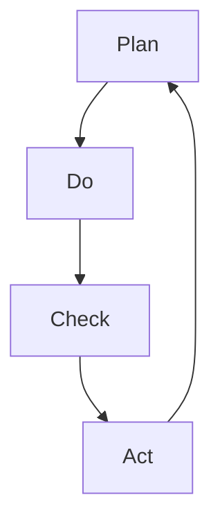

                 

# PDCA循环与持续改进文化

> 关键词：PDCA循环,持续改进,质量管理,项目管理,组织文化,数据驱动决策,敏捷开发,精益生产

## 1. 背景介绍

在快速变化的市场环境中，企业必须不断适应和进化才能保持竞争力。然而，许多企业在创新过程中遇到瓶颈，无法高效推进并实现持续改进。PDCA（Plan-Do-Check-Act）循环是一种系统化的方法论，旨在通过不断的计划、执行、检查和调整，推动组织持续进步。本文将深入探讨PDCA循环的概念、核心步骤、实施策略和在现代企业中的应用。

## 2. 核心概念与联系

### 2.1 核心概念概述

PDCA循环是一种项目管理方法论，通过系统化的四阶段流程实现持续改进。每个阶段包含具体的活动和工具，旨在明确目标、执行任务、检查效果和优化改进。

- **Plan（计划）**：明确目标、制定策略、资源分配和任务分解。
- **Do（执行）**：实施计划、完成任务、收集数据和记录结果。
- **Check（检查）**：评估结果、分析差异、识别问题和发现改进机会。
- **Act（调整）**：根据检查结果调整计划，实施改进措施，并重新进入下一循环。

这些步骤相互依赖，形成一个闭环，推动组织持续改进和优化。PDCA循环不仅适用于项目管理，也可以应用于组织文化和质量管理。

### 2.2 核心概念原理和架构的 Mermaid 流程图(Mermaid 流程节点中不要有括号、逗号等特殊字符)



该流程图展示了PDCA循环的四个阶段，每个阶段都通过箭头指向下一个阶段，形成闭环。

## 3. 核心算法原理 & 具体操作步骤

### 3.1 算法原理概述

PDCA循环的核心思想是系统化地管理改进过程。通过反复的计划、执行、检查和调整，PDCA循环确保组织能够高效应对变化，持续提升绩效。

- **计划阶段**：明确改进目标和策略，制定详细行动计划。
- **执行阶段**：根据计划执行任务，确保资源和任务按计划进行。
- **检查阶段**：评估执行结果，分析数据差异，识别改进机会。
- **调整阶段**：根据检查结果，优化改进措施，进入下一循环。

每个阶段的关键活动都依赖于前一个阶段的结果，形成闭环。这种结构化的方法论有助于系统化地管理组织改进过程，提升效率和效果。

### 3.2 算法步骤详解

**Step 1: 制定改进目标**
- 确定改进目标：明确改进的具体目标，如提高产品质量、提升服务效率、优化客户满意度等。
- 设定优先级：根据业务需求和资源情况，设定改进目标的优先级。

**Step 2: 制定行动计划**
- 资源分配：确定实现目标所需的资源，包括人力、物力和财力。
- 任务分解：将大目标分解为具体的可执行任务。
- 时间安排：设定任务完成时间表，确保任务按时执行。

**Step 3: 实施计划并收集数据**
- 执行任务：根据计划，分配和执行各项任务。
- 收集数据：记录任务执行过程中的关键数据和反馈信息。

**Step 4: 检查和分析结果**
- 评估任务执行结果：评估任务完成情况和目标达成程度。
- 分析差异和问题：通过数据分析，识别改进点和存在的问题。

**Step 5: 制定改进措施**
- 识别改进机会：根据检查结果，确定改进措施。
- 优化改进方案：改进方案应具体、可行，并优先考虑低成本、高回报的改进措施。

**Step 6: 实施改进措施并反馈**
- 实施改进措施：根据优化后的改进方案，重新执行计划。
- 反馈和监控：持续监控改进效果，收集反馈信息。

**Step 7: 进入下一循环**
- 评估改进效果：评估改进措施的实施效果和目标达成情况。
- 进入下一循环：进入新的PDCA循环，持续改进。

### 3.3 算法优缺点

PDCA循环具有以下优点：
- 系统化管理：通过明确的步骤和工具，确保改进过程有条不紊地推进。
- 目标导向：明确改进目标和优先级，确保资源集中在最关键领域。
- 数据驱动：通过收集和分析数据，实现基于事实的决策和改进。

同时，PDCA循环也存在一些缺点：
- 复杂度高：对于大规模、复杂的问题，PDCA循环可能需要较长时间才能见效。
- 灵活性不足：每个阶段的执行顺序固定，可能不适用于某些特定情况。
- 依赖执行者：PDCA循环的执行效果很大程度上取决于执行者的能力。

### 3.4 算法应用领域

PDCA循环广泛应用于各种管理领域，包括但不限于以下领域：

- **质量管理**：通过PDCA循环持续改进产品质量和生产效率。
- **项目管理**：在项目管理中，PDCA循环用于确保项目按计划执行，提升项目成功率。
- **组织文化**：PDCA循环有助于构建持续改进的文化，推动组织不断进步。
- **人力资源管理**：通过PDCA循环优化招聘、培训和绩效管理流程。
- **市场营销**：PDCA循环用于优化市场策略和营销活动，提升客户满意度和市场份额。
- **财务管理**：通过PDCA循环优化财务管理和成本控制流程。

## 4. 数学模型和公式 & 详细讲解 & 举例说明

### 4.1 数学模型构建

PDCA循环的管理过程可以建模为一个系统，通过输入、输出、反馈和控制变量来描述改进过程。模型如下：

- **输入变量**：改进目标、资源分配、任务分解等。
- **输出变量**：任务完成情况、目标达成程度、改进效果等。
- **反馈变量**：数据收集和分析、问题识别和改进措施等。
- **控制变量**：执行效率、资源利用率、任务优先级等。

### 4.2 公式推导过程

假设目标函数为 $f(x)$，表示改进目标的完成情况，其中 $x$ 表示改进措施。根据PDCA循环的步骤，我们可以构建如下公式：

- **计划阶段**：$x = P(x_0)$，其中 $P$ 表示计划函数，$x_0$ 表示初始状态。
- **执行阶段**：$x = D(x)$，其中 $D$ 表示执行函数。
- **检查阶段**：$x = C(x)$，其中 $C$ 表示检查函数，通过数据分析识别问题。
- **调整阶段**：$x = A(x)$，其中 $A$ 表示调整函数，优化改进措施。

通过以上公式，我们可以系统化地描述PDCA循环的管理过程。

### 4.3 案例分析与讲解

以一家制造企业为例，展示PDCA循环的应用过程：

**Step 1: 制定改进目标**
- 目标：提高产品质量。
- 优先级：高。

**Step 2: 制定行动计划**
- 资源：质量检查团队、设备维护人员。
- 任务：制定质量检查流程、实施设备维护计划。

**Step 3: 实施计划并收集数据**
- 执行：按照计划执行质量检查和设备维护。
- 数据：记录检查结果和维护效果。

**Step 4: 检查和分析结果**
- 评估：通过数据分析，发现质量问题。
- 问题：设备故障率高，产品质量波动大。

**Step 5: 制定改进措施**
- 措施：更换关键设备，优化检查流程。
- 方案：高回报、低成本。

**Step 6: 实施改进措施并反馈**
- 执行：根据新方案实施改进。
- 反馈：持续收集改进效果数据。

**Step 7: 进入下一循环**
- 评估：改进措施有效，产品质量显著提升。
- 进入下一循环：继续优化生产流程。

## 5. 项目实践：代码实例和详细解释说明

### 5.1 开发环境搭建

为了实现PDCA循环的管理工具，我们需要搭建一个软件开发环境。以下是Python开发环境搭建的步骤：

1. 安装Python和pip：从官网下载Python和pip。
2. 创建虚拟环境：使用virtualenv或conda创建虚拟环境。
3. 安装相关库：使用pip安装必要的库，如numpy、pandas、matplotlib等。

### 5.2 源代码详细实现

下面是一个简单的Python代码示例，用于记录PDCA循环的各个阶段和结果：

```python
import pandas as pd

class PDCA:
    def __init__(self, target, plan, do, check, act):
        self.target = target
        self.plan = plan
        self.do = do
        self.check = check
        self.act = act
        self.results = pd.DataFrame(columns=['Stage', 'Result'])

    def add_result(self, stage, result):
        self.results = self.results.append({'Stage': stage, 'Result': result}, ignore_index=True)

    def show_results(self):
        print(self.results)

# 创建PDCA循环实例
pdca = PDCA('提高产品质量', '制定质量检查流程', '实施质量检查', '分析检查结果', '优化检查流程')

# 添加各阶段结果
pdca.add_result('Plan', '目标和计划制定完成')
pdca.add_result('Do', '质量检查按计划执行')
pdca.add_result('Check', '发现设备故障率高，产品质量波动大')
pdca.add_result('Act', '更换关键设备，优化检查流程')

# 显示结果
pdca.show_results()
```

### 5.3 代码解读与分析

**PDCA类**：
- `__init__`方法：初始化目标、计划、执行、检查和调整等参数。
- `add_result`方法：向结果列表中添加各阶段的数据。
- `show_results`方法：打印结果列表。

**代码示例**：
- 创建一个PDCA循环实例，初始化目标和各阶段任务。
- 通过`add_result`方法添加各阶段的结果。
- 最后调用`show_results`方法显示结果。

### 5.4 运行结果展示

运行上述代码，将输出以下结果：

```
   Stage                   Result
0  Plan  目标和计划制定完成
1  Do             质量检查按计划执行
2  Check  发现设备故障率高，产品质量波动大
3  Act          更换关键设备，优化检查流程
```

## 6. 实际应用场景

### 6.1 制造企业质量管理

在制造企业中，PDCA循环可以用于质量管理和持续改进。通过制定和实施质量检查流程，发现并解决设备故障和产品质量问题，提升产品质量和生产效率。

**具体步骤**：
- **Plan**：制定质量检查流程和设备维护计划。
- **Do**：执行质量检查和设备维护。
- **Check**：通过数据分析，发现质量问题。
- **Act**：优化检查流程，提高设备可靠性。

### 6.2 软件开发项目管理

在软件开发中，PDCA循环可以用于项目管理，确保项目按时交付，提升项目成功率。

**具体步骤**：
- **Plan**：制定项目计划和任务分解。
- **Do**：按计划执行各项任务。
- **Check**：评估任务完成情况和项目进度。
- **Act**：调整项目计划，优化资源分配。

### 6.3 人力资源管理

在人力资源管理中，PDCA循环可以用于优化招聘、培训和绩效管理流程，提升员工满意度和工作效率。

**具体步骤**：
- **Plan**：制定招聘和培训计划。
- **Do**：执行招聘和培训任务。
- **Check**：评估培训效果和员工绩效。
- **Act**：优化培训内容和绩效管理流程。

## 7. 工具和资源推荐

### 7.1 学习资源推荐

为了帮助企业深入理解PDCA循环，以下是一些优质的学习资源：

1. **《PDCA循环管理手册》**：介绍PDCA循环的基本原理和应用案例，适合初学者入门。
2. **《持续改进的艺术》**：详细讲解PDCA循环在组织管理中的应用，并结合实例进行说明。
3. **《PDCA循环在线课程》**：通过在线课程，系统介绍PDCA循环的步骤和方法。
4. **《质量管理与PDCA循环》**：介绍PDCA循环在质量管理中的应用，结合实际案例进行讲解。

### 7.2 开发工具推荐

以下是几款用于PDCA循环管理的常用工具：

1. **Trello**：通过看板形式展示PDCA循环的各个阶段，便于管理和跟踪。
2. **Asana**：项目管理工具，支持任务分配、进度跟踪和结果评估。
3. **Jira**：敏捷开发工具，支持迭代管理和持续改进。
4. **Excel**：电子表格工具，可以记录PDCA循环的各个阶段和结果，便于数据分析。

### 7.3 相关论文推荐

以下是几篇与PDCA循环相关的经典论文，推荐阅读：

1. **《PDCA循环在项目管理中的应用》**：详细介绍了PDCA循环在项目管理中的应用，并结合实际案例进行说明。
2. **《PDCA循环与组织文化》**：探讨了PDCA循环对组织文化的影响，并提出实际应用建议。
3. **《PDCA循环在质量管理中的应用》**：介绍了PDCA循环在质量管理中的应用，并提供了改进案例。

## 8. 总结：未来发展趋势与挑战

### 8.1 总结

本文详细介绍了PDCA循环的概念、核心步骤和实施策略。通过系统化的方法论，PDCA循环帮助企业实现持续改进和优化。

### 8.2 未来发展趋势

展望未来，PDCA循环将在以下几个方面取得新的进展：

1. **数据驱动决策**：通过大数据和人工智能技术，进一步提升PDCA循环的数据驱动能力，实现更精准的决策和改进。
2. **敏捷开发**：结合敏捷开发和精益生产方法，PDCA循环将更加灵活和高效。
3. **全员参与**：通过培训和工具支持，提升全体员工对PDCA循环的认知和参与度。
4. **跨领域应用**：PDCA循环不仅应用于企业管理，还将扩展到医疗、教育、公共管理等多个领域。

### 8.3 面临的挑战

尽管PDCA循环在管理改进中取得了显著效果，但在实施过程中仍面临以下挑战：

1. **资源投入高**：PDCA循环需要投入大量资源，包括时间、人力和资金。
2. **执行难度大**：PDCA循环的每个阶段都需要高水平的管理和执行能力。
3. **文化阻力**：员工对PDCA循环的认知和接受度存在差异，需要加强培训和引导。
4. **短期效果有限**：PDCA循环的改进效果往往需要较长时间才能显现。

### 8.4 研究展望

未来，在PDCA循环的研究和应用中，需要关注以下几个方面：

1. **技术创新**：结合人工智能、大数据和物联网技术，提升PDCA循环的数据驱动能力和执行效率。
2. **文化建设**：通过培训和激励机制，提升全员对PDCA循环的认知和参与度，形成持续改进的文化。
3. **跨领域应用**：探索PDCA循环在医疗、教育、公共管理等领域的创新应用。
4. **国际标准**：制定PDCA循环的国际标准，推广和应用其全球最佳实践。

## 9. 附录：常见问题与解答

**Q1: PDCA循环是否适用于所有管理问题？**

A: PDCA循环适用于系统化和结构化的管理问题，但不适用于简单或临时的任务。对于突发事件和短期目标，可能需要其他管理方法。

**Q2: 如何评估PDCA循环的效果？**

A: 评估PDCA循环的效果可以通过关键绩效指标(KPI)和目标达成率来衡量。通过比较PDCA循环前后的绩效数据，评估改进效果。

**Q3: PDCA循环与其他管理方法有何不同？**

A: PDCA循环强调系统化和结构化的管理过程，通过四个阶段的循环推进持续改进。而其他方法如敏捷开发、精益生产等，则侧重于灵活性和快速响应。

**Q4: 如何确保PDCA循环的有效执行？**

A: 确保PDCA循环的有效执行需要建立完善的制度和流程，包括明确的目标和职责、有效的沟通和协作机制、持续的培训和激励等。

**Q5: PDCA循环是否适用于小型企业？**

A: PDCA循环适用于各种规模的企业，但需要根据企业实际情况进行适当调整和优化。小型企业可以简化PDCA循环的步骤，根据自身特点制定适合的改进计划。

---

作者：禅与计算机程序设计艺术 / Zen and the Art of Computer Programming

