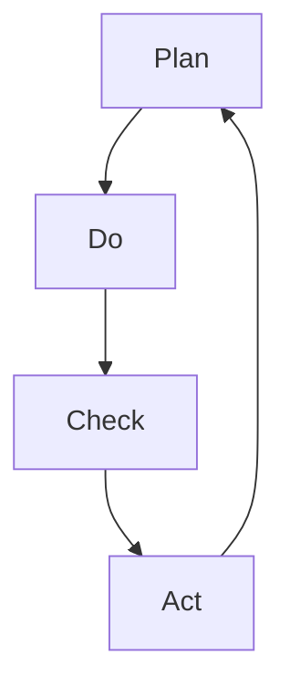

                 

# PDCA循环与持续改进文化

## 1. 背景介绍

### 1.1 问题由来
在IT领域，技术的不断迭代和业务的快速变化使得持续改进成为一种必须。PDCA（Plan-Do-Check-Act）循环是一种被广泛采用且被证明有效的持续改进方法。然而，许多企业和团队在应用PDCA循环时，往往难以系统化和规范化，导致PDCA的效果大打折扣。

### 1.2 问题核心关键点
PDCA循环的核心在于通过持续的计划、执行、检查和总结，不断优化和提升产品或服务的质量和效率。但实际应用中，缺乏系统化的方法论和工具，使得PDCA难以形成持续改进的文化。本文将从系统化、结构化的角度，详细解析PDCA循环的各个环节，并结合实际案例进行讲解。

## 2. 核心概念与联系

### 2.1 核心概念概述
- **PDCA循环**：通过持续的计划（Plan）、执行（Do）、检查（Check）和总结（Act）四个阶段，实现持续改进的过程。
- **质量管理**：PDCA循环的核心在于通过控制和改进，提升产品或服务的质量。
- **持续改进文化**：建立PDCA循环的思维习惯，将持续改进融入企业文化和日常工作中。
- **项目管理**：PDCA循环是项目管理的重要方法之一，用于项目规划、执行、监控和评估。

### 2.2 核心概念原理和架构的 Mermaid 流程图



该图展示了PDCA循环的四个阶段：

1. **Plan**：制定计划，明确改进目标和实施步骤。
2. **Do**：执行计划，实施改进措施。
3. **Check**：检查执行效果，评估改进效果。
4. **Act**：总结经验教训，制定下一步改进计划。

## 3. 核心算法原理 & 具体操作步骤

### 3.1 算法原理概述

PDCA循环的原理在于通过循环迭代，不断提升产品或服务的质量。每个循环阶段都围绕着提升质量的目标进行，形成一个持续改进的闭环。

### 3.2 算法步骤详解

**Step 1: 计划（Plan）**

1. **目标制定**：明确改进目标，包括时间、范围、责任人和预期效果。
2. **资源准备**：评估所需资源（人力、物力、技术等），进行必要的准备。
3. **行动计划**：制定详细的执行计划，包括具体步骤、时间节点、风险评估等。

**Step 2: 执行（Do）**

1. **任务分配**：将计划中的任务分配给相关人员，明确职责和工作内容。
2. **实施改进**：按照计划逐步实施改进措施，确保执行到位。
3. **记录日志**：实时记录执行过程中的数据和情况，以便后续分析和总结。

**Step 3: 检查（Check）**

1. **效果评估**：对比实施前后的数据和结果，评估改进效果。
2. **问题分析**：分析执行过程中出现的问题，找到改进点。
3. **调整优化**：根据检查结果，调整行动计划，优化执行过程。

**Step 4: 总结（Act）**

1. **总结经验**：总结本次PDCA循环中的经验教训，形成标准化流程或工具。
2. **知识共享**：将改进的经验和方法分享给团队，推广到其他项目或部门。
3. **制定下一个PDCA**：根据总结结果，制定下一个PDCA循环的计划，确保持续改进。

### 3.3 算法优缺点

**优点**：

- **系统化**：PDCA循环提供了系统化的持续改进框架，有助于系统性地解决复杂问题。
- **结构清晰**：四个阶段明确，便于团队协作和流程管理。
- **效果显著**：通过循环迭代，逐步优化和提升产品质量和效率。

**缺点**：

- **复杂度高**：尤其是大型项目或复杂问题，PDCA循环可能需要多次迭代才能见效。
- **灵活性差**：如果目标或环境发生较大变化，PDCA循环可能需要重新规划。
- **资源投入大**：需要较多的时间、人力和物力投入，特别是对于中小型团队和项目。

### 3.4 算法应用领域

PDCA循环适用于各种规模和类型的IT项目和业务改进，包括但不限于：

- **软件开发**：通过PDCA循环，不断提升软件质量、性能和用户体验。
- **系统运维**：通过PDCA循环，持续优化系统性能、可靠性和安全性。
- **产品设计**：通过PDCA循环，不断提升产品功能、质量和用户体验。
- **客户服务**：通过PDCA循环，持续提升客户满意度和服务质量。
- **流程改进**：通过PDCA循环，优化业务流程，提高效率和效果。

## 4. 数学模型和公式 & 详细讲解 & 举例说明

### 4.1 数学模型构建

PDCA循环的数学模型可以简化为四个阶段的控制函数：

1. **Plan函数**：目标设定、资源评估和计划制定。
2. **Do函数**：任务执行和数据记录。
3. **Check函数**：效果评估和问题分析。
4. **Act函数**：总结优化和下一个循环。

### 4.2 公式推导过程

以软件开发为例，我们可以将PDCA循环的四个阶段分解为如下数学模型：

1. **Plan函数**：
   $$
   P = (T, R, A)
   $$
   - **T**：时间目标
   - **R**：资源评估
   - **A**：行动计划

2. **Do函数**：
   $$
   D = (E, R, L)
   $$
   - **E**：执行过程
   - **R**：记录日志
   - **L**：日志数据

3. **Check函数**：
   $$
   C = (E', L', P')
   $$
   - **E'**：执行效果
   - **L'**：问题日志
   - **P'**：问题点分析

4. **Act函数**：
   $$
   A = (E', L', P', P_{next})
   $$
   - **E'**：总结经验
   - **L'**：知识共享
   - **P'**：下一个计划
   - **P_{next**：下一个PDCA循环的计划

### 4.3 案例分析与讲解

假设一家软件开发公司决定通过PDCA循环提升其产品质量。具体步骤和案例分析如下：

1. **Plan阶段**：
   - 目标：在6个月内将软件缺陷率降低50%。
   - 资源：100人团队、10天培训、30台服务器。
   - 行动计划：引入代码审查流程、每周代码审计、每月性能测试等。

2. **Do阶段**：
   - 执行：团队按照计划进行代码审查和性能测试，并记录所有日志数据。
   - 数据：记录缺陷数、审查次数、性能测试结果等。

3. **Check阶段**：
   - 效果评估：对比6个月前后的缺陷率，评估改进效果。
   - 问题分析：分析代码审查中的常见问题和性能瓶颈。
   - 调整优化：调整行动计划，优化代码审计和性能测试方法。

4. **Act阶段**：
   - 总结：总结本次PDCA循环的经验教训，形成标准化代码审计和性能测试流程。
   - 知识共享：将改进的经验和方法分享给团队，推广到其他项目。
   - 下一个PDCA：制定下一个PDCA循环的计划，如扩大代码审查范围、增加代码审计频率等。

## 5. 项目实践：代码实例和详细解释说明

### 5.1 开发环境搭建

为了进行PDCA循环的实践，首先需要搭建一个开发环境。以下是使用Python进行开发的简单步骤：

1. 安装Python：确保开发机器上安装有Python，建议使用Python 3.8及以上版本。
2. 安装必要的库：包括pandas、numpy、matplotlib等，用于数据处理和可视化。
3. 搭建代码审查工具：如GitHub、GitLab等，用于代码管理和审计。
4. 搭建性能测试工具：如JMeter、LoadRunner等，用于性能测试和监控。

### 5.2 源代码详细实现

下面以代码审计为例，给出使用Python进行PDCA循环的代码实现。

1. **Plan阶段代码**：
   ```python
   import pandas as pd

   def plan(target, resources, actions):
       plan_data = pd.DataFrame({
           'Time Target': target,
           'Resources': resources,
           'Actions': actions
       })
       return plan_data
   ```

2. **Do阶段代码**：
   ```python
   def do(actions, logs):
       do_data = pd.DataFrame({
           'Actions': actions,
           'Logs': logs
       })
       return do_data
   ```

3. **Check阶段代码**：
   ```python
   def check(actions, logs, results):
       check_data = pd.DataFrame({
           'Actions': actions,
           'Logs': logs,
           'Results': results
       })
       return check_data
   ```

4. **Act阶段代码**：
   ```python
   def act(actions, logs, results, next_plan):
       act_data = pd.DataFrame({
           'Actions': actions,
           'Logs': logs,
           'Results': results,
           'Next Plan': next_plan
       })
       return act_data
   ```

### 5.3 代码解读与分析

以上代码实现是基于数据框架（DataFrame）的PDCA循环框架，每个阶段通过数据框架记录关键信息。其中，Plan阶段记录目标、资源和行动计划，Do阶段记录执行过程和日志数据，Check阶段记录执行效果、问题和调整，Act阶段记录总结、共享和下一个PDCA计划。

### 5.4 运行结果展示

通过上述代码实现，可以方便地对PDCA循环的各个阶段进行数据记录和分析。例如，通过可视化工具绘制PDCA循环的执行效果和调整路径，可以直观地展示改进过程和结果。

## 6. 实际应用场景

### 6.1 软件质量改进

通过PDCA循环，软件团队可以系统性地提升产品质量。例如，某软件团队通过PDCA循环引入代码审计流程，实现了缺陷率的显著降低，提升了用户满意度。

### 6.2 系统性能优化

在IT运维中，PDCA循环是优化系统性能的有效方法。通过PDCA循环，系统运维团队可以不断优化服务器配置、网络架构和安全策略，提升系统可靠性和性能。

### 6.3 产品功能迭代

产品团队可以通过PDCA循环，持续迭代产品功能，提升用户体验。例如，某电商平台通过PDCA循环，不断优化推荐算法和搜索算法，提高了用户粘性和购买转化率。

### 6.4 客户服务优化

客户服务团队可以通过PDCA循环，优化服务流程和响应速度，提升客户满意度。例如，某客服团队通过PDCA循环，引入智能客服机器人，大幅度提升了服务效率和质量。

### 6.5 流程改进

通过PDCA循环，企业可以优化业务流程，提高效率和效果。例如，某金融公司通过PDCA循环，优化了贷款审批流程，大幅缩短了审批时间，提高了贷款成功率。

## 7. 工具和资源推荐

### 7.1 学习资源推荐

1. **书籍**：《持续改进：PDCA循环的实践》，详细介绍了PDCA循环的原理、方法和工具。
2. **课程**：Coursera上的《项目管理基础》课程，提供了PDCA循环的详细讲解和案例分析。
3. **博客**：DevOps.com上的持续改进博客，分享了企业如何通过PDCA循环提升质量和效率的实践经验。
4. **研讨会**：多次参加项目管理国际研讨会（PMI）和软件工程国际研讨会（IEEE），获取最新的PDCA循环研究成果。

### 7.2 开发工具推荐

1. **项目管理工具**：JIRA、Trello等，用于规划和执行PDCA循环。
2. **代码审查工具**：GitHub、GitLab等，用于记录和管理代码审计数据。
3. **性能测试工具**：JMeter、LoadRunner等，用于记录和管理性能测试数据。
4. **数据分析工具**：Excel、Tableau等，用于分析和可视化PDCA循环的数据。

### 7.3 相关论文推荐

1. **经典文献**：《The Plan-Do-Check-Act Cycle》，详细介绍了PDCA循环的历史和应用。
2. **最新研究**：《The Effectiveness of PDCA Cycle in Improving Software Quality》，研究PDCA循环在提升软件质量中的效果。
3. **工业应用**：《How to Implement PDCA in IT Projects》，分享了多个IT项目中应用PDCA循环的实践经验。

## 8. 总结：未来发展趋势与挑战

### 8.1 总结

本文通过系统化的解析和实例讲解，全面介绍了PDCA循环的各个环节和应用方法。通过PDCA循环，可以帮助企业系统化地进行持续改进，提升产品质量和效率。

### 8.2 未来发展趋势

1. **智能化**：未来PDCA循环将更多地借助人工智能和大数据技术，实现更智能化的决策和优化。
2. **自动化**：通过自动化工具和系统，减少人工干预，提高PDCA循环的效率和效果。
3. **跨领域**：PDCA循环将跨越不同的业务领域，形成更加综合和系统化的改进方法。
4. **协作化**：PDCA循环将更多地借助协作工具和系统，实现团队协同和信息共享。

### 8.3 面临的挑战

1. **复杂性增加**：随着系统规模和复杂度的增加，PDCA循环的复杂性也将增加，需要更多的工具和资源支持。
2. **文化阻力**：部分团队和组织可能对PDCA循环缺乏理解和认同，需要加强培训和推广。
3. **数据质量**：PDCA循环的效果依赖于数据的准确性和完整性，数据质量不高将影响改进效果。
4. **资源投入**：PDCA循环需要较多的时间、人力和物力投入，特别是对于中小型团队和项目。

### 8.4 研究展望

未来的研究需要在以下几个方面寻求新的突破：

1. **自动化工具的开发**：开发更多智能化的PDCA循环工具，减少人工干预，提高效率和效果。
2. **跨领域应用**：研究和探索PDCA循环在不同业务领域的应用方法，提升综合改进能力。
3. **数据质量优化**：研究和探索数据清洗、标注和处理的方法，提升数据质量，保证PDCA循环的效果。
4. **文化和组织变革**：研究和探索PDCA文化的推广方法和组织变革策略，提升团队的持续改进能力。

## 9. 附录：常见问题与解答

**Q1：PDCA循环的四个阶段是否必须按顺序执行？**

A: 是的，PDCA循环的四个阶段必须按顺序执行。每个阶段都是PDCA循环的关键部分，缺一不可。如果跳过某个阶段，PDCA循环的效果将大打折扣。

**Q2：PDCA循环适用于所有类型的项目吗？**

A: PDCA循环适用于大部分类型的项目，但并不适用于所有项目。对于特别复杂、结构不清晰的项目，可能需要结合其他方法和工具，才能更好地进行改进。

**Q3：PDCA循环需要多长时间才能见效？**

A: PDCA循环的效果取决于具体项目和改进目标，通常需要多次迭代才能见效。一般来说，建议每个PDCA循环的周期为1-3个月，视具体情况而定。

**Q4：PDCA循环中的“Act”阶段是否重要？**

A: 是的，PDCA循环中的“Act”阶段非常重要。总结经验教训、制定下一步计划，是PDCA循环的核心，也是持续改进的关键。忽视“Act”阶段，PDCA循环的效果将大打折扣。

**Q5：PDCA循环是否适用于敏捷开发项目？**

A: PDCA循环可以应用于敏捷开发项目，但需要在敏捷框架下进行适当调整。例如，可以将PDCA循环与Scrum框架结合，实现快速迭代和持续改进。

---

作者：禅与计算机程序设计艺术 / Zen and the Art of Computer Programming

